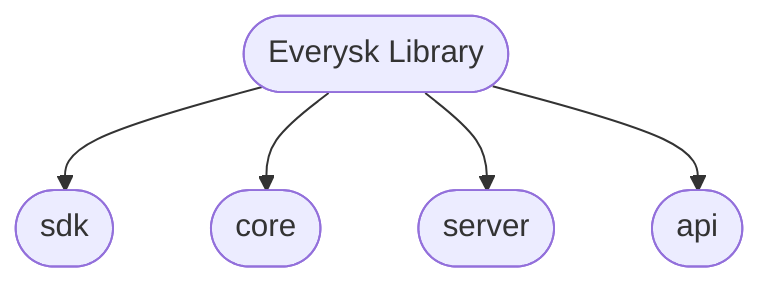

# Everysk Library

| | |
| --- | --- |
| Testing | [](https://github.com/Everysk/everysk-lib/actions/workflows/coverage.yml) [](https://github.com/Everysk/everysk-lib/actions/workflows/security-checks.yml) |
| Package | [](https://pypi.org/project/everysk-lib/) |


The **Everysk Library** is a one-stop solution designed to help our teams and partners streamline workflows and maximize productivity.

Many projects at Everysk rely on multiple **endpoints**, **engines**, and **utilities** to automate workflows, handle entities such as portfolios, datastores, reports, and files, and perform complex calculations. Adopting and maintaining each of these components individually can be both time-consuming and expensive.

To address this challenge, Everysk developed the Everysk Library: a unified Python library that bundles these capabilities into a single, convenient package.

By consolidating essential functionalities — ranging from portfolio creation to workflow automation — Everysk Lib greatly simplifies implementation and ongoing maintenance. This all-in-one toolkit ensures you have everything you need to build powerful, scalable solutions across a variety of Everysk projects.

<br>

## Table of Contents

- [Module Structure](#module-structure)
- [Installation](#installation)
- [Running Tests](#running-tests)
- [Running Tests with coverage](#running-tests-with-coverage)
- [Contributing](#contributing)
- [License](#license)

## Module Structure

Below we have the main directories that you will be working with.



<br>

## Installation

To install the **Everysk library**, you will need to use pip's `install` command:

```bash
  pip install everysk-lib
```

### Verifying the Installation

After installing the library, it's a good practice to verify if the installation was successful. Here is how to achieve this:

#### 1. Open a terminal

#### 2. Start the Python interpreter by typing `python` and pressing `Enter`

#### 3. In the Python interpreter, type the following command then press `Enter`:

```python
  import everysk
```

If the library has been installed correctly, this command should complete without any errors. If the library is not installed or there's a problem with the installation, Python will raise a `ModuleNotFoundError`

<br>

## Documentation

The main documentation of the Everysk Library can be founded here: [Everysk Library Documentation](docs/README.md)

<br>

## Running Tests

This section provides instructions on how to run tests for the project. There are two scenarios, the first one is running tests in a development environment and the second one is running tests after the library has been installed from PyPI.

### Running Tests in Development Environment

In a development environment you can use the provided shell script to run the tests. The script sets up the necessary environment and then run the tests. To execute the tests, open a bash terminal and run the following command.

```bash
  ./run.sh tests
```

### Running Tests After the Library is Installed

After the library has been installed in your project from PyPI, you can start running tests using Python's built-in unittest module. To run tests use the following command:


```bash
  python3 -m unittest everysk.core.tests
```

The command uses Python's unittest module as mentioned above as a script, which then runs the test in the `everysk.core.tests` package.

<br>

## Running Tests with coverage

Code coverage us a way of measuring how many lines of code are executed while the automated tests are running.

To run tests along with a coverage report, you can use the provided shell script. The script will not only run the tests but also generate a coverage report that shows the percentage of code that was executed during the tests.

This is useful to identify sections of your code that are not being tested and may need additional tests.

#### 1. Open a terminal in your Visual Studio Code environment.

#### 2. Run the following command.

```bash
  ./run.sh coverage
```

This command executes the `run.sh` script with the `coverage` argument. The report will be displayed in the terminal after the script completed the tests.

**Remember:** a high coverage percentage is generally good, but 100% coverage does not ensures that your code is free from bugs or any other problem that might occur in your code. The full coverage just means that all the lines in your code were executed during the tests.

<br>

## Contributing

Contributions are always welcome and greatly appreciated!

Go to the repository [link](https://github.com/Everysk/everysk-lib) and click on the `Fork` button to create your own copy of the everysk library.

Then clone the project in your own local machine by running the command below or using the **GitHub Desktop**.

```bash
  git clone https://github.com/<your-username>/everysk-lib.git everysk-yourusername
```

This section creates a directory called `everysk-yourusername` to center all your code.

After that you can change the directory by:

```bash
  cd everysk-yourusername
```

Create the **upstream** repository which will refer to the main repository that you just forked.

```bash
  git remote add upstream https://github.com/Everysk/everysk-lib.git
```

Now run the following commands to make sure that your clone is up-to-date with main everysk repository

```bash
  git checkout main
  git pull upstream main
```

Shortly after, create a new branch to add your code

```bash
  git checkout -b brand-new-feature
```

The command above will automatically switch to this newly created branch. At this moment your are able to make your modifications to the code and commit locally as you progress.

After all the code changes, you can submit your contribution by pushing the changes to your fork on GitHub:

```bash
  git push origin brand-new-feature
```

The command above ensures that all the modifications that you've made are up-to-date with your current branch.

At the end of this process you will need to make a **Pull Request** to the main branch.

To achieve this, go to the GitHub page of the project and click on the `Pull requests` tab, then click on `New pull request` button.

This will open a new section used to compare branches, now choose your branch for merging into the main branch and hit the `Create pull request` button.

<br>

## License

(C) Copyright 2025 EVERYSK TECHNOLOGIES

This is an unpublished work containing confidential and proprietary
information of EVERYSK TECHNOLOGIES. Disclosure, use, or reproduction
without authorization of EVERYSK TECHNOLOGIES is prohibited.

Date: Jan 2025

Contact: contact@everysk.com

URL: https://everysk.com/


<br>
<hr>
<br>

[Back to the top](#everysk-library)
