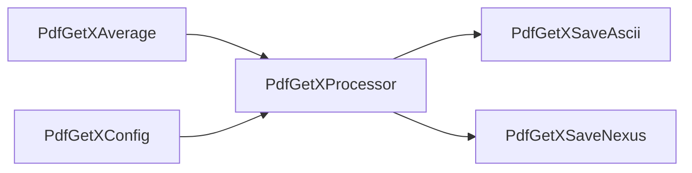

# ewokspdf

`ewokspdf` provides a set of [Ewoks](https://ewoks.readthedocs.io) workflow tasks dedicated to Pair Distribution Function (PDF) analysis.  
The tasks orchestrate the full PDFgetX3 pipeline—averaging integrated XRPD patterns, configuring and running `pdfgetx`, and saving results to NeXus (HDF5) or ASCII.

## Features

- Ewoks-compatible tasks for averaging, configuring, processing, and exporting PDF data.
- Convenience utilities for storing results in instrument-friendly NeXus layouts.
- Example workflow demonstrating how to chain the provided tasks together.

## Installation

At the ESRF the package is usually deployed on Ewoks workers via Ansible; no manual action is required.

To install manually you will need Python 3.11+ and `pip`:

```bash
pip install ewokspdf
```

Or install the development version from source:

```bash
git clone https://gitlab.esrf.fr/workflow/ewoksapps/ewokspdf.git
cd ewokspdf
pip install -e .[doc]
```

The runtime dependency tree is deliberately small:

- `ewoksxrpd` (declared in `pyproject.toml`)
- `diffpy.pdfgetx` 2.3+ (not published on PyPI; download the wheel from the [PDFgetX project](https://www.diffpy.org/products/pdfgetx.html) and install it with `pip install ./diffpy.pdfgetx-<VERSION>.whl`)

PDF calculations require `diffpy.pdfgetx` 2.3+ (aka PDFgetX3).  
Ensure the wheel you install matches your Python version.

## Quickstart

The repository contains a demonstrator workflow (`src/ewokspdf/workflows/demo.json`) that links all provided tasks:



1. Prepare an integrated XRPD dataset exported as an HDF5/NXdata signal (`nxdata_url`), and a PDFgetX configuration file or dictionary.
2. Choose an output location for the ASCII files and NeXus group (usually under the same HDF5 file).
3. Execute the workflow with Ewoks (either via the Ewoks GUI or the CLI), for example:

```bash
ewoks execute src/ewokspdf/workflows/demo.json \
  --inputs average.nxdata_url=/data/integrated.h5::/entry/scan/data \
  --inputs config.filename=/data/pdfgetx.cfg \
  --inputs save_ascii.filename=/tmp/pdf/results.h5 \
  --inputs save_nexus.nxdata_url=/tmp/pdf/results.h5::/entry/1.1/ \
  --inputs processor.info=@json:'{"wavelength": 0.14088}'
```

The workflow will:

- average XRPD patterns (`PdfGetXAverage`),
- merge configuration from file and overrides (`PdfGetXConfig`),
- compute PDF signals (`PdfGetXProcessor`), and
- persist results to ASCII and NeXus (`PdfGetXSaveAscii` and `PdfGetXSaveNexus`).

### Running locally outside Ewoks

You can drive the tasks programmatically if Ewoks is not available:

```python
from ewokspdf.tasks.average import PdfGetXAverage
from ewokspdf.tasks.config import PdfGetXConfig
from ewokspdf.tasks.processor import PdfGetXProcessor

avg = PdfGetXAverage()
avg(nxdata_url="silx:///path/to/data.h5::/entry/data")

cfg = PdfGetXConfig()
cfg(filename="pdfgetx.cfg", pdfgetx_options_dict={"qmax": 22.0})

processor = PdfGetXProcessor()
processor(radial=avg.outputs.radial,
          intensity=avg.outputs.intensity,
          info=avg.outputs.info,
          pdfgetx_options=cfg.outputs.pdfgetx_options)
```

Persist the results with either `PdfGetXSaveAscii` or `PdfGetXSaveNexus` depending on the output format you need.

## Documentation

Detailed guides, conceptual overviews, tutorials, and API references live in the [`doc/`](./doc) directory and on [Read the Docs](https://ewokspdf.readthedocs.io).  
To build the documentation locally run:

```bash
sphinx-build -n -b html doc doc/_build/html
```

## Contributing

Contributions are welcome! To contribute:

1. Fork or clone the repository and create a new branch for your feature or fix.
2. Add tests and documentation when applicable.
3. Open a merge request for review.

See the [CONTRIBUTING.md](./CONTRIBUTING.md) file for more details.

## License

This project is licensed under the MIT License. See the [LICENSE.md](./LICENSE.md) file for details.

## Support

For questions or issues open a ticket on the GitLab project or submit a [data processing request](https://requests.esrf.fr/plugins/servlet/desk/portal/41).
