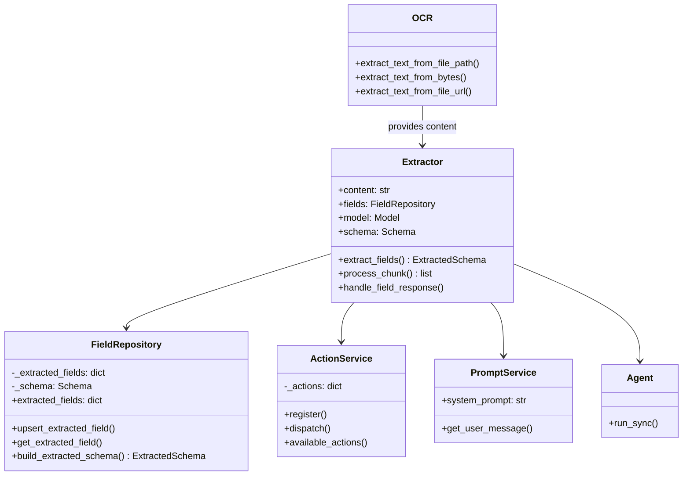

# Extractly

Extractly is a Python library for turning unstructured text into structured, typed data. Built on top of Pydantic AI, it orchestrates large language model calls, merges incremental field updates, and optionally performs OCR through Mistral so you can ingest PDFs or images.

## Table of Contents

- [Extractly](#extractly)
  - [Table of Contents](#table-of-contents)
  - [Features](#features)
  - [Requirements](#requirements)
  - [Installation](#installation)
  - [Quick Start](#quick-start)
    - [Discover fields automatically](#discover-fields-automatically)
    - [Schema-driven extraction](#schema-driven-extraction)
    - [OCR then extract](#ocr-then-extract)
  - [Architecture](#architecture)
    - [High-Level Extraction Flow](#high-level-extraction-flow)
    - [Component Architecture](#component-architecture)
    - [Chunk Processing Pipeline](#chunk-processing-pipeline)
    - [Action Handling Flow](#action-handling-flow)
    - [Schema Modes](#schema-modes)
  - [Configuration](#configuration)
  - [Schemas and data types](#schemas-and-data-types)
  - [Actions](#actions)
  - [Examples](#examples)
  - [API reference](#api-reference)
    - [`Extractor`](#extractor)
    - [`OCR`](#ocr)
    - [Schemas and responses](#schemas-and-responses)
  - [Development](#development)
    - [Running tests](#running-tests)
    - [Type checking](#type-checking)
    - [Formatting](#formatting)
    - [Pre-commit hook](#pre-commit-hook)
    - [Publishing (maintainers only)](#publishing-maintainers-only)
  - [License](#license)
  - [Contributing](#contributing)

## Features

- **LLM-powered extraction**: Uses Pydantic AI agents (default model `google-gla:gemini-2.5-flash-lite`) to turn raw text into structured fields.
- **Schema-aware control**: Provide a `Schema` describing entities and fields, or enable discovery mode with `identify_fields=True`.
- **Action pipeline**: Reconcile incremental model responses via configurable handlers (merge lists, upsert tables, etc.).
- **OCR integration**: Convert images and documents into Markdown with the built-in Mistral OCR helper before extraction.
- **Chunking built in**: Large inputs are automatically split into manageable chunks to stay within model limits.
- **Confidence scoring**: Every `ExtractedField` includes a 0-1 confidence score for downstream quality checks.

## Requirements

- Python 3.13 or newer (per `pyproject.toml`)
- Credentials for your LLM provider. The default model `google-gla:gemini-2.5-flash-lite` expects `GOOGLE_API_KEY` to be set or otherwise visible to Pydantic AI.
- A Mistral API key (`MISTRAL_API_KEY`) when using the OCR helpers.

A local `.env` file is loaded automatically via `python-dotenv`, making it convenient to store credentials during development.

## Installation

- **Create a token:** Generate a Personal Access Token with **Repository → Contents (read-only)** permission at https://github.com/settings/personal-access-tokens/new. Store it securely (for example, `export GITHUB_TOKEN="ghp_..."` in your shell).

- **Install with `pip`:**

  ```bash
  pip install "git+https://${GITHUB_TOKEN}@github.com/Darkmatter-AI/extract-lib.git@v0.1.6"
  ```

  You can inline the token instead by replacing `${GITHUB_TOKEN}` with the PAT value.

- **Install with `uv`:**

  ```bash
  uv add "git+https://${GITHUB_TOKEN}@github.com/Darkmatter-AI/extract-lib.git@v0.1.6"
  ```

Replace `v0.1.6` with another tag if you need a different version. For contributor tooling (linters, tests) install extras with `pip install ".[dev]"`.

## Quick Start

With the package installed and credentials exported, you can start extracting data programmatically.

### Discover fields automatically

```python
from extractly import Extractor

content = """
Invoice #12345
Issued on 2024-01-15
Total due: $1,250.00
"""

extractor = Extractor(content=content)
extracted_schema = extractor.extract_fields()

for field_id, field in extracted_schema.entities:
    print(f"{field_id}: {field.value} (confidence: {field.confidence:.2f})")
```

`Extractor.extract_fields()` returns an `ExtractedSchema`, which exposes the extracted fields via `fields_by_id` keyed by `<entity name>.<field name>`.

### Schema-driven extraction

```python
from extractly import Extractor
from extractly.schemas import Schema, SchemaEntity, SchemaField, Table

invoice_schema = Schema(
    name="Invoice",
    description="Fields expected in an invoice document.",
    entities=[
        SchemaEntity(
            name="invoice",
            description="Top-level invoice information.",
            fields=[
                SchemaField(
                    name="invoice_number",
                    description="Unique invoice identifier.",
                    data_type="string",
                    example="INV-12345",
                ),
                SchemaField(
                    name="amount_due",
                    description="Total amount owed.",
                    data_type="currency",
                    example="$1,250.00",
                ),
                SchemaField(
                    name="line_items",
                    description="Table of invoice line items.",
                    data_type="table<description, quantity, price>",
                    example=Table(
                        headers=["Description", "Quantity", "Price"],
                        rows=[["Design work", 10, "$125.00"]],
                    ),
                ),
            ],
        ),
    ],
)

invoice_text = """
Invoice INV-12345
Amount due: $1,250.00
Line items:
- Design work, 10 hours @ $125.00
"""

extractor = Extractor(
    content=invoice_text,
    schema=invoice_schema,
    identify_fields=False,  # Only return fields defined in the schema
)

extracted_schema = extractor.extract_fields()
for field_id, field in extracted_schema.fields_by_id.items():
    print(f"{field_id}: {field.value}")
```

Leave `identify_fields=True` (the default) if you want the agent to return schema fields _and_ discover additional fields that look relevant.

Schema definitions can also be loaded from JSON. For example, the sample invoice schema used in the examples can be loaded with:

```python
from pathlib import Path
from extractly.schemas import Schema

schema = Schema.model_validate_json(
    Path("samples/invoice/invoice_schema.json").read_text()
)
```

### OCR then extract

```python
from pathlib import Path
from extractly import Extractor, OCR
from extractly.schemas import Schema

schema = Schema.model_validate_json(
    Path("samples/invoice/invoice_schema.json").read_text()
)

ocr = OCR()
extractor = Extractor.from_file(
    input_file_path=Path("samples/invoice/invoice_image.jpg"),
    use_ocr=True,
    ocr_service=ocr,
    # use ocr_filename if the file name is missing/hashed to improve type detection
    ocr_filename="invoice.jpg",
    schema=schema,
    identify_fields=False,
)

extracted_schema = extractor.extract_fields()
for entity in extracted_schema.entities:
    for field in entity.fields:
        print(f"{field.name}: {field.value} (confidence: {field.confidence})")

```

Set `use_ocr=True` to have the extractor run OCR before chunking; leave it `False` to read text files directly (you can pass `encoding=` for non-UTF-8 text). The OCR service automatically detects whether the file is an image when `is_image` is omitted. Pass `is_image=True` or `False` to override the detection, `ocr_filename` when the original file name is missing or extensionless, and `ocr_output_file_path` to save the rendered Markdown.

`OCR.extract_text_from_file_path` also accepts PDFs and can optionally write the Markdown output to disk.

## Architecture

### High-Level Extraction Flow


### Component Architecture



### Chunk Processing Pipeline


### Action Handling Flow


### Schema Modes


## Configuration

- Export `GOOGLE_API_KEY` (or configure another Pydantic AI-supported model via the `model` parameter).
- Export `MISTRAL_API_KEY` when using the OCR helpers.
- Add either value to `.env` if you prefer not to export in the shell; the package loads it on import.

Tune the extraction behaviour via the `Extractor` parameters:

- `model`: Override the default LLM (`google-gla:gemini-2.5-flash-lite`).
- `max_chunk_size`: Control chunking; defaults to `3000` characters.
- `schema`: Provide a `Schema` to constrain extraction targets.
- `identify_fields`: Toggle auto-discovery of new fields (defaults to `True`).
- `actions`: Supply custom `Action` handlers to override the default merge logic.

## Schemas and data types

Schemas describe the fields you care about:

- `Schema` groups one or more `SchemaEntity` definitions.
- Each `SchemaEntity` contains `SchemaField` objects with a `name`, optional `description`, `data_type` string hint, and `example` value.
- `Schema.field_ids` (and `ExtractedSchema.field_ids`) expose the canonical `<entity>.<field>` identifiers used as keys in extraction results.
- `Table` represents tabular data with `headers` and `rows`. You can pass a `Table` or a JSON-serialisable dict with the same shape as the example value.

The `data_type` string is forwarded to the agent as a hint (for example, `table<date, hours, project>`). Use any structure that helps the model return the right shape.

## Actions

Extraction results can arrive incrementally across chunks. The action service resolves those updates using handler functions. The default handlers (registered by `ActionService`) are:

- `handle_add_new_field`
- `handle_replace_value_in_existing_field`
- `handle_add_value_to_existing_list`
- `handle_add_row_to_existing_table_field`

Each action name matches the handler’s qualified name and is surfaced to the agent so it can choose how to merge a response. You can append or replace handlers:

```python
from extractly import Extractor
from extractly.actions.schemas import Action
from extractly.fields import FieldRepository
from extractly.schemas import FieldResponse

def custom_action(field_response: FieldResponse, fields: FieldRepository) -> None:
    # Custom merge logic goes here.
    ...

extractor = Extractor(
    content="Your content...",
    actions=[
        Action(
            handler=custom_action,
            description="Describe when the agent should call this action.",
        )
    ],
)
```

## Examples

Ready-to-run scripts live under `examples/`:

- `extract_discover_fields.py` – Discover fields without providing a schema (`python examples/extract_discover_fields.py`)
- `extract_from_invoice_text.py` – Schema-driven extraction from sample invoice text (`python examples/extract_from_invoice_text.py`)
- `extract_from_contract_text.py` – Apply a JSON schema to contract-like Markdown (`python examples/extract_from_contract_text.py`)
- `extract_given_fields_dry_run.py` – Run in dry-run mode to inspect the generated prompts (`python examples/extract_given_fields_dry_run.py`)
- `extract_list_fields.py` – Work with list-typed schema fields (`python examples/extract_list_fields.py`)
- `extract_table_data.py` – Capture table-shaped data with schema hints (`python examples/extract_table_data.py`)
- `extract_with_ocr.py` – Combine OCR with schema-based extraction (`python examples/extract_with_ocr.py`)

## API reference

### `Extractor`

- `content: str` – Text to analyse.
- `model: models.Model | str` – Pydantic AI model to use (`google-gla:gemini-2.5-flash-lite` by default).
- `max_chunk_size: int` – Soft limit for chunking (`3000` by default).
- `schema: Schema | None` – Schema describing the fields you want returned.
- `actions: list[Action] | None` – Optional custom action handlers (defaults registered automatically).
- `identify_fields: bool` – When `True`, the agent may return new fields beyond the schema.

Key methods:

- `extract_fields(dry_run: bool = False) -> ExtractedSchema`
- `process_chunk(chunk: str, dry_run: bool = False) -> list[FieldResponse]`
- `handle_field_response(field_response: FieldResponse) -> None`

Set `dry_run=True` to inspect prompt construction without calling the model.

### `OCR`

Helper around Mistral OCR:

- `extract_text_from_file_path(input_file_path, output_file_path=None, filename=None, is_image=None)`
- `extract_text_from_bytes(content, filename, is_image=None)`
- `extract_text_from_file_url(file_url, filename, is_image=None)`

### Schemas and responses

- `Schema`, `SchemaEntity`, `SchemaField`
- `ExtractedSchema`, `ExtractedEntity`, `ExtractedField`
- `FieldResponse`
- `Table`
- `DefaultActionsT` – Literal union of the canonical action identifiers (`"add_new_field"`, `"replace_value_in_existing_field"`, `"add_value_to_existing_list"`, `"add_row_to_existing_table_field"`).

## Development

### Running tests

```bash
pytest tests/
```

### Type checking

```bash
basedpyright
```

### Formatting

Format code with ruff:

```bash
uv run ruff format .
```

### Pre-commit hook

Install the development dependencies with `uv` (they include `pre-commit`) and install the hook so `ruff` runs before every commit:

```bash
uv sync --extra dev
uv run pre-commit install
```

Run the hook manually with `uv run pre-commit run --all-files` if you want to lint the entire repository before pushing changes.

### Publishing (maintainers only)

These steps publish the `extract` package itself via our CI pipeline. No PAT is required on your machine.

1. Bump the version in `pyproject.toml`.
2. Commit the change then tag the release:

   ```bash
   git tag -a v0.1.2 -m "Release 0.1.2"
   ```

   Replace `0.1.2` with the version you just set.

3. Push the commit and tag so CI can build and publish:

   ```bash
   git push --follow-tags
   ```

## License

This project is licensed under the MIT License.

## Contributing

Contributions are welcome! Please feel free to submit a Pull Request.
