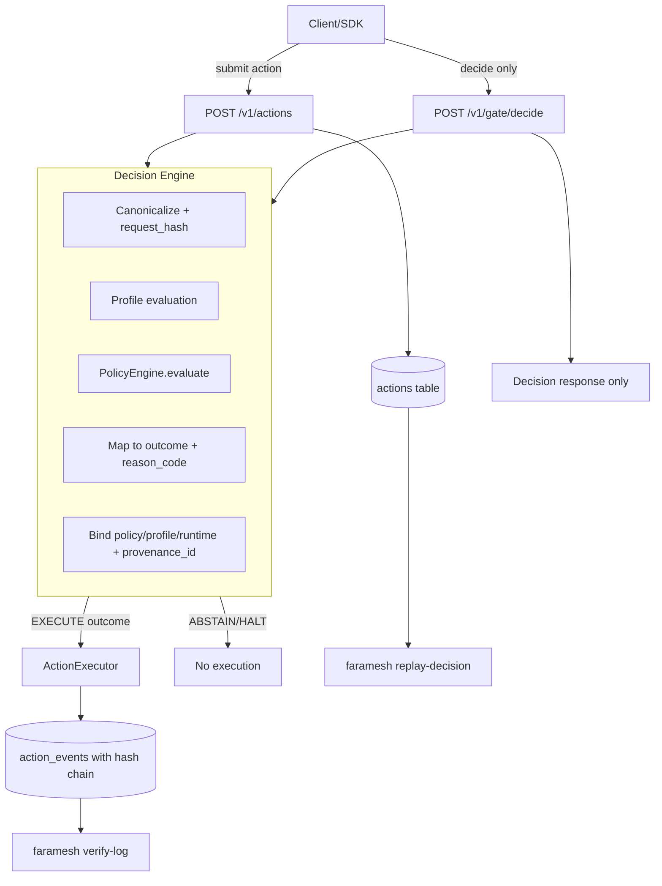

# Faramesh

**Execution gatekeeper for AI agents**

Faramesh Core is an open-core execution governor that provides policy-driven governance, risk scoring, and human-in-the-loop approval for AI agent tool calls. Built for production use with a modern web UI, comprehensive CLI, and SDK integrations.

## Faramesh Cloud Products

### Faramesh Horizon (hosted control plane)

Faramesh Horizon is our fully-managed SaaS offering that provides instant onboarding with no deployments required. Horizon includes a fully-managed core service, automatic upgrades, usage tracking and metrics, API keys and secrets management, and approval routing via Slack and email. Ideal for startups and small teams who want to get started quickly without infrastructure management.

### Faramesh Nexus (enterprise/on-prem)

Faramesh Nexus is an enterprise-grade deployment of Faramesh that runs inside your VPC or Kubernetes cluster. Nexus supports SSO, RBAC, multi-org management, audit exports with long-term retention, and optional air-gap compatibility for security-critical environments. Perfect for organizations that need full control over their governance infrastructure.

Faramesh OSS is the engine, Nexus and Horizon are the accelerators.

[](https://www.python.org/downloads/)
[](LICENSE)
[](https://pypi.org/project/faramesh/)
[](https://github.com/faramesh/faramesh-core/actions)
[](https://codecov.io/gh/faramesh/faramesh-core)
[](https://github.com/faramesh/faramesh-core/pkgs/container/faramesh-core)

## Features

### 🎯 Core Capabilities

- **Policy-Driven Governance**: YAML-based policies with first-match-wins evaluation
- **Risk Scoring**: Automatic risk assessment (low/medium/high) based on configurable rules
- **Human-in-the-Loop**: Approval workflows for high-risk or policy-required actions
- **Audit Ledger**: Complete event timeline for every action (created, approved, executed, etc.)
- **Real-Time UI**: Modern web dashboard with live updates via Server-Sent Events
- **Developer-Friendly CLI**: Powerful command-line interface with prefix matching
- **SDK Integration**: Python and Node.js SDKs for easy agent integration
- **LangChain Support**: Drop-in wrapper for LangChain tools

### 🚀 Quick Start (TL;DR)

```bash
pip install faramesh
faramesh serve
```

SDKs:

- **Python SDK**: `pip install faramesh-sdk` (optional - for advanced SDK features)
- **Node SDK**: `npm install @faramesh/sdk` (optional - for Node.js/TypeScript)

**Note:** Framework integrations work with just `pip install faramesh` - no SDK package needed!

See `docs/Quickstart.md` for a step‑by‑step guide.

## Table of Contents

- [Installation](#installation)
- [Quick Start](#quick-start)
- [Core Concepts](#core-concepts)
- [Policy Configuration](#policy-configuration)
- [Risk Scoring](#risk-scoring)
- [CLI Usage](#cli-usage)
- [Web UI](#web-ui)
- [SDK Integration](#sdk-integration)
- [Framework Integrations](#framework-integrations)
- [Docker Deployment](#docker-deployment)
- [API Reference](#api-reference)
- [Environment Variables](#environment-variables)
- [Examples](#examples)
- [Architecture](#architecture)
- [Contributing](#contributing)
- [Governance](#governance)

## Installation

### Prerequisites

- Python 3.9+
- pip
- Node.js 18+ (optional, for UI development)

### Install from Source

```bash
git clone https://github.com/faramesh/faramesh-core.git
cd faramesh
pip install -e .
```

### Optional Dependencies

For enhanced CLI output and DX features:
```bash
pip install -e ".[cli]"
```

This installs:
- `rich` - Beautiful terminal output with colors
- `tabulate` - Professional table formatting
- `watchdog` - File watching (for `--watch` flag)
- `sseclient` - SSE streaming (for `tail` command)

**Note:** All features work without these dependencies, with graceful fallbacks to plain text output.

## Quick Start

### 1. Start the Server

```bash
faramesh serve
```

Server starts on `http://127.0.0.1:8000` by default.

### 2. Access the Web UI

Open `http://127.0.0.1:8000` in your browser.

The UI provides:
- Real-time action monitoring
- Event timeline for each action
- One-click approve/deny
- Risk level visualization
- Demo mode with sample data

### 3. Submit Your First Action

**Python SDK:**
```python
from faramesh import configure, submit_action

# Configure client (or use environment variables)
configure(base_url="http://127.0.0.1:8000")

# Submit action
action = submit_action(
    agent_id="my-agent",
    tool="shell",
    operation="run",
    params={"cmd": "echo 'Hello Faramesh'"}
)

print(f"Status: {action['status']}")
print(f"Risk Level: {action.get('risk_level')}")
```

**Alternative (Class-based API):**
```python
from faramesh.sdk.client import ExecutionGovernorClient

client = ExecutionGovernorClient("http://127.0.0.1:8000")

action = client.submit_action(
    tool="shell",
    operation="run",
    params={"cmd": "echo 'Hello Faramesh'"},
    context={"agent_id": "my-agent"}
)

print(f"Status: {action['status']}")
print(f"Risk Level: {action.get('risk_level')}")
```

**cURL:**
```bash
curl -X POST http://127.0.0.1:8000/v1/actions \
  -H "Content-Type: application/json" \
  -d '{
    "agent_id": "my-agent",
    "tool": "shell",
    "operation": "run",
    "params": {"cmd": "echo test"}
  }'
```

### 4. View Actions

**CLI:**
```bash
# List all actions (color-coded)
faramesh list

# List with full UUIDs
faramesh list --full

# Explain why action was allowed/denied
faramesh explain <action-id>

# Get specific action
faramesh get <action-id>

# View event timeline
faramesh events <action-id>

# Stream live actions
faramesh tail
```

**Web UI:**
- Click any action row to see details
- View event timeline in the detail drawer
- See risk levels and approval status
- Copy curl commands with one click
- Demo mode indicator (if active)

## Core Concepts

### Actions

An **action** represents a tool call that an AI agent wants to execute. Each action has:

- **ID**: Unique identifier (UUID)
- **Agent ID**: Identifier for the agent making the request
- **Tool**: Tool name (e.g., "shell", "http", "stripe")
- **Operation**: Operation name (e.g., "run", "get", "refund")
- **Params**: Tool-specific parameters
- **Context**: Additional metadata
- **Status**: Current state (pending_approval, approved, executing, etc.)
- **Decision**: Policy decision (allow, deny, require_approval)
- **Risk Level**: Computed risk (low, medium, high)
- **Events**: Timeline of all state changes

### Policy Evaluation

Policies are evaluated in order, and the **first matching rule wins**. If no rules match, the action is **denied by default** (deny-by-default security model).

### Risk Scoring

Risk scoring runs independently of policy rules. Risk rules can trigger automatic approval requirements even if a policy rule would allow the action.

## Policy Configuration

Policies are defined in YAML files. By default, Faramesh looks for `policies/default.yaml`.

### Basic Policy Structure

```yaml
rules:
  # Rules evaluated in order - first match wins
  - match:
      tool: "http"
      op: "get"
    allow: true
    description: "Allow HTTP GET requests"
    risk: "low"

  - match:
      tool: "shell"
      op: "*"
    require_approval: true
    description: "Shell commands require approval"
    risk: "medium"

  # Default deny (must be last)
  - match:
      tool: "*"
      op: "*"
    deny: true
    description: "Default deny rule"
    risk: "high"
```

### Match Conditions

Available match conditions:

- `tool`: Tool name (supports `"*"` wildcard)
- `op` / `operation`: Operation name
- `contains`: Substring match in params JSON
- `pattern`: Regex pattern match
- `amount_gt`, `amount_lt`, `amount_gte`, `amount_lte`: Numeric comparisons
- `path_contains`, `path_starts_with`, `path_ends_with`: Path matching
- `method`: HTTP method
- `branch`: Git branch name
- `agent_id`: Agent identifier
- `field` + `value`: Custom field matching

### Policy Effects

Each rule can have one effect:

- `allow: true` - Allow immediately
- `deny: true` - Deny immediately
- `require_approval: true` - Require human approval

### Example Policies

**Block Destructive Shell Commands:**
```yaml
rules:
  - match:
      tool: "shell"
      op: "*"
      pattern: "rm -rf|shutdown|reboot|mkfs"
    deny: true
    description: "Block destructive commands"
    risk: "high"

  - match:
      tool: "*"
      op: "*"
    deny: true
```

**Require Approval for Large Payments:**
```yaml
rules:
  - match:
      tool: "stripe"
      op: "refund"
      amount_gt: 1000
    require_approval: true
    description: "Large refunds require approval"
    risk: "medium"

  - match:
      tool: "stripe"
      op: "*"
    allow: true
    risk: "low"

  - match:
      tool: "*"
      op: "*"
    deny: true
```

## Risk Scoring

Risk scoring provides an additional layer of safety by automatically assessing action risk levels.

### Risk Rules

Define risk rules in your policy file:

```yaml
risk:
  rules:
    - name: dangerous_shell
      when:
        tool: shell
        operation: run
        pattern: "rm -rf"
      risk_level: high
    
    - name: large_payments
      when:
        tool: stripe
        operation: refund
        amount_gt: 1000
      risk_level: medium
```

### Risk Levels

- **low**: Safe operations (default)
- **medium**: Moderate risk
- **high**: High risk - automatically requires approval even if policy allows

### Risk Rule Matching

Risk rules use the same match conditions as policy rules. The first matching risk rule determines the risk level.

### High-Risk Auto-Approval

If an action has `risk_level: high` and a policy rule would `allow` it, Faramesh automatically changes the decision to `require_approval` for safety.

## CLI Usage

Faramesh provides a powerful CLI for managing actions and policies.

### Basic Commands

```bash
# Start server
faramesh serve

# Start with policy hot-reload (local mode only)
faramesh serve --hot-reload
# Or use environment variable:
# FARAMESH_HOT_RELOAD=1 faramesh serve
# Note: If policy reload fails, previous valid policy stays active

# List actions (truncated IDs, color-coded)
faramesh list

# List with full UUIDs
faramesh list --full

# JSON output (for scripting)
faramesh list --json

# Get specific action (supports prefix matching)
faramesh get 2755d4a8
faramesh get 2755d4a8-1000-47e6-873c-b9fd535234ad

# Explain why action was allowed/denied
faramesh explain 2755d4a8

# View event timeline
faramesh events 2755d4a8

# Approve action
faramesh approve 2755d4a8
# or
faramesh allow 2755d4a8

# Deny action
faramesh deny 2755d4a8

# Replay an action
faramesh replay 2755d4a8

# Get ready-to-copy curl commands
faramesh curl 2755d4a8

# Stream live actions (SSE, like kubectl logs)
faramesh tail

# Show status transitions
faramesh logs 2755d4a8
```

### DX Commands

```bash
# Scaffold starter layout
faramesh init

# Build web UI
faramesh build-ui

# Sanity check environment
faramesh doctor

# Compare policy files
faramesh policy-diff old.yaml new.yaml

# Generate Docker files
faramesh init-docker
```

### Prefix Matching

All commands that take an action ID support **prefix matching**. Use the first 8+ characters:

```bash
# These are equivalent:
faramesh get 2755d4a8
faramesh get 2755d4a8-1000-47e6-873c-b9fd535234ad
```

If multiple actions match, Faramesh will warn you and list all matches.

### Global Options

```bash
# Specify API host/port
faramesh --host 0.0.0.0 --port 9000 list

# Override auth token
faramesh --token my-token list

# JSON output
faramesh --json get <id>
```

### Command Examples

**List actions with risk levels (color-coded):**
```bash
$ faramesh list
┌────────────┬──────────────────┬────────┬────────────┬──────────────┬──────────────────────────────────────┬─────────────────────┐
│ ID         │ Status           │ Risk   │ Tool       │ Operation    │ Params                               │ Created             │
├────────────┼──────────────────┼────────┼────────────┼──────────────┼──────────────────────────────────────┼─────────────────────┤
│ 2755d4a8   │ pending_approval │ high   │ shell     │ run         │ {"cmd": "rm -rf /tmp"}               │ 2026-01-12 10:00:00 │
│ a1b2c3d4   │ allowed          │ low    │ http      │ get         │ {"url": "https://..."}                │ 2026-01-12 09:59:00 │
└────────────┴──────────────────┴────────┴────────────┴──────────────┴──────────────────────────────────────┴─────────────────────┘
```

**Explain why action was allowed/denied:**
```bash
$ faramesh explain 2755d4a8
Action Explanation: 2755d4a8

Status: pending_approval
Decision: require_approval
Reason: Shell commands require approval
Risk Level: high

Policy File: /path/to/policies/default.yaml
Policy Version: yaml

Tool: shell
Operation: run
Params: {"cmd": "rm -rf /tmp"}
```

**View event timeline:**
```bash
$ faramesh events 2755d4a8
Event Timeline - 2755d4a8
┌─────────────────────┬──────────────────────┬─────────────────────────────┐
│ Time                │ Event                │ Details                     │
├─────────────────────┼──────────────────────┼─────────────────────────────┤
│ 2026-01-12 10:00:00 │ created              │ {"decision": "require_..."} │
│ 2026-01-12 10:00:01 │ decision_made        │ {"decision": "require_..."} │
│ 2026-01-12 10:05:23 │ approved             │ {"reason": "Looks safe"}   │
│ 2026-01-12 10:05:24 │ started              │ {}                          │
│ 2026-01-12 10:05:25 │ succeeded            │ {"reason": "ok"}            │
└─────────────────────┴──────────────────────┴─────────────────────────────┘
```

**Stream live actions (SSE):**
```bash
$ faramesh tail
Streaming actions (press CTRL+C to stop)...

[10:00:15] pending_approval  2755d4a8 | shell      | run
[10:00:20] approved          a1b2c3d4 | http       | get
[10:00:25] succeeded         2755d4a8 | shell      | run
```

**Get curl commands:**
```bash
$ faramesh curl 2755d4a8
# Action: 2755d4a8-1000-47e6-873c-b9fd535234ad
# Status: pending_approval

# Approve:
curl -X POST http://127.0.0.1:8000/v1/actions/2755d4a8-.../approval \
  -H "Content-Type: application/json" \
  -d '{"token": "abc123...", "approve": true}'

# Deny:
curl -X POST http://127.0.0.1:8000/v1/actions/2755d4a8-.../approval \
  -H "Content-Type: application/json" \
  -d '{"token": "abc123...", "approve": false}'
```

**DX Commands:**
```bash
# Initialize project
$ faramesh init
✓ Created starter files:
  • policies/
  • policies/default.yaml
  • .env.example

Next steps:
  1. Review policies/default.yaml
  2. Copy .env.example to .env and customize
  3. Run: faramesh serve

# Check environment
$ faramesh doctor
✓ Python 3.11.0
✓ Database exists and is writable
✓ Policy file exists: policies/default.yaml
✓ Auth token configured
✓ UI assets found

# Compare policies
$ faramesh policy-diff old.yaml new.yaml
Policy Differences:

Old: old.yaml
New: new.yaml

Old rules: 3
New rules: 4

Added rules:
  + Allow HTTP GET requests
```

## Web UI

The Faramesh web UI provides a modern, real-time dashboard for monitoring and managing actions.

### Features

- **Action Table**: View all actions with status, risk level, tool, and operation
- **Event Timeline**: Click any action to see complete event history
- **Real-Time Updates**: Live updates via Server-Sent Events (SSE)
- **Approve/Deny**: One-click approval for pending actions
- **Copy Curl Commands**: Copy ready-to-use curl commands for API calls
- **Demo Badge**: Visual indicator for demo-seeded actions
- **Dark/Light Mode**: Toggle between themes
- **Search & Filters**: Filter by status, agent, tool
- **Pagination**: Navigate large action lists

### Accessing the UI

1. Start the server: `faramesh serve`
2. Open `http://127.0.0.1:8000` in your browser

### UI Workflow

1. **View Actions**: See all actions in the main table
2. **Click Action**: Opens detail drawer with full information
3. **View Events**: Scroll to event timeline section
4. **Approve/Deny**: Click buttons if action is pending approval
5. **Copy Curl**: Use copy buttons to get API commands

### Event Timeline

The event timeline shows every state change:

- `created` - Action was created
- `decision_made` - Policy evaluation completed
- `approved` - Human approved the action
- `denied` - Human denied the action
- `started` - Execution began
- `succeeded` - Execution completed successfully
- `failed` - Execution failed

Each event includes:
- Timestamp
- Event type
- Metadata (reason, error, etc.)

## SDK Integration

### Python SDK

**Modern Functional API:**
```python
from faramesh import configure, submit_action, get_action, start_action, wait_for_completion

# Configure client
configure(base_url="http://127.0.0.1:8000")

# Submit action
action = submit_action(
    agent_id="my-agent",
    tool="shell",
    operation="run",
    params={"cmd": "echo 'Hello World'"}
)

# Check status
print(f"Status: {action['status']}")
print(f"Risk Level: {action.get('risk_level')}")
print(f"Decision: {action.get('decision')}")

# If pending approval, wait for completion
if action['status'] == 'pending_approval':
    final = wait_for_completion(action['id'])
    print(f"Final status: {final['status']}")

# Start execution and wait for result
if action['status'] in ('allowed', 'approved'):
    start_action(action['id'])
    result = wait_for_completion(action['id'])
    print(f"Execution result: {result.get('result')}")
```

**Class-based API (Legacy):**
```python
from faramesh.sdk.client import ExecutionGovernorClient

client = ExecutionGovernorClient("http://127.0.0.1:8000")

action = client.submit_action(
    tool="shell",
    operation="run",
    params={"cmd": "echo 'Hello World'"},
    context={"agent_id": "my-agent"}
)

# Check status
print(f"Status: {action['status']}")

# Wait for approval if needed
if action['status'] == 'pending_approval':
    import time
    while True:
        time.sleep(2)
        updated = client.get_action(action['id'])
        if updated['status'] in ('approved', 'denied'):
            break
    print(f"Final status: {updated['status']}")

# Report result
client.report_result(action['id'], success=True, error=None)
```

### Node.js SDK

```javascript
const { ExecutionGovernorClient } = require('@faramesh/sdk');

const client = new ExecutionGovernorClient('http://127.0.0.1:8000');

// Submit action
const action = await client.submitAction({
  tool: 'shell',
  operation: 'run',
  params: { cmd: "echo 'Hello World'" },
  context: { agent_id: 'my-agent' }
});

console.log(`Status: ${action.status}`);
console.log(`Risk Level: ${action.risk_level}`);

// Get events
const events = await client.getEvents(action.id);
console.log(`Event count: ${events.length}`);
```

## LangChain Integration

Faramesh provides a drop-in wrapper for LangChain tools that automatically enforces governance.

### Basic Usage

```python
from langchain.tools import ShellTool
from faramesh.sdk.client import ExecutionGovernorClient
from faramesh.integrations.langchain.governed_tool import GovernedTool

# Create Faramesh client
client = ExecutionGovernorClient("http://127.0.0.1:8000")

# Wrap LangChain tool
shell_tool = ShellTool()
governed = GovernedTool(
    tool=shell_tool,
    client=client,
    agent_id="my-langchain-agent"
)

# Use in agent - tool calls are automatically governed
result = governed.run("ls -la")
```

### Integration with Agents

```python
from langchain.agents import initialize_agent, AgentType
from langchain.llms import OpenAI

# Wrap all tools
governed_tools = [
    GovernedTool(tool=t, client=client, agent_id="agent-1")
    for t in [shell_tool, http_tool]
]

# Create agent with governed tools
agent = initialize_agent(
    tools=governed_tools,
    llm=llm,
    agent=AgentType.ZERO_SHOT_REACT_DESCRIPTION,
    verbose=True
)

# Agent tool calls are now governed by Faramesh
response = agent.run("List files in /tmp and fetch a URL")
```

### How It Works

1. **Intercept**: GovernedTool intercepts tool calls before execution
2. **Submit**: Submits to Faramesh for policy evaluation
3. **Wait**: If pending approval, polls until approved/denied
4. **Execute**: Only executes if allowed/approved
5. **Report**: Reports result back to Faramesh

See [`examples/langchain/`](examples/langchain/) for a complete runnable demo with HTTP and shell tools.

## Docker Deployment

### Quick Start

```bash
# Start with demo data
docker compose up

# Access UI
open http://localhost:8000
```

### Custom Build

```bash
# Build image
docker build -t faramesh .

# Run with custom config
docker run -p 8000:8000 \
  -e FARAMESH_DEMO=1 \
  -e FARAMESH_ENABLE_CORS=1 \
  -e FARAMESH_HOST=0.0.0.0 \
  -e FARAMESH_PORT=8000 \
  -v $(pwd)/policies:/app/policies \
  -v $(pwd)/data:/app/data \
  faramesh
```

### Docker Compose

The `docker-compose.yaml` includes:

- **faramesh**: Main server
- **demo-agent**: Example agent that submits actions

Edit `docker-compose.yaml` to customize:

```yaml
services:
  faramesh:
    build: .
    ports:
      - "8000:8000"
    environment:
      - FARAMESH_DEMO=1
      - FARAMESH_ENABLE_CORS=1
    volumes:
      - ./data:/app/data
      - ./policies:/app/policies
```

## API Reference

### Endpoints

#### Submit Action
```http
POST /v1/actions
Content-Type: application/json

{
  "agent_id": "string",
  "tool": "string",
  "operation": "string",
  "params": {},
  "context": {}
}
```

#### Get Action
```http
GET /v1/actions/{action_id}
```

#### List Actions
```http
GET /v1/actions?limit=20&offset=0&status=pending_approval&tool=shell
```

#### Get Action Events
```http
GET /v1/actions/{action_id}/events
```

Returns array of events:
```json
[
  {
    "id": "uuid",
    "action_id": "uuid",
    "event_type": "created",
    "meta": {},
    "created_at": "2026-01-12T10:00:00Z"
  }
]
```

#### Approve/Deny Action
```http
POST /v1/actions/{action_id}/approval
Content-Type: application/json

{
  "token": "approval_token",
  "approve": true,
  "reason": "Optional reason"
}
```

#### Start Execution
```http
POST /v1/actions/{action_id}/start
```

#### Report Result
```http
POST /v1/actions/{action_id}/result
Content-Type: application/json

{
  "success": true,
  "error": "Optional error message"
}
```

#### Server-Sent Events
```http
GET /v1/events
```

Returns SSE stream of action updates.

#### Health Check
```http
GET /health
GET /ready
```

#### Metrics
```http
GET /metrics
```

Returns Prometheus metrics.

## Environment Variables

### Server Configuration

| Variable | Default | Description |
|----------|---------|-------------|
| `FARAMESH_HOST` | `127.0.0.1` | Server bind address |
| `FARAMESH_PORT` | `8000` | Server port |
| `FARAMESH_TOKEN` | - | Auth token (overrides `FARA_AUTH_TOKEN`) |
| `FARAMESH_ENABLE_CORS` | `1` | Enable CORS (`1`=enabled, `0`=disabled) |
| `FARAMESH_DEMO` | - | Demo mode (`1`=seed demo data if DB empty) |

### Policy & Database

| Variable | Default | Description |
|----------|---------|-------------|
| `FARA_POLICY_FILE` | `policies/default.yaml` | Policy file path |
| `FARA_DB_BACKEND` | `sqlite` | Database backend (`sqlite` or `postgres`) |
| `FARA_SQLITE_PATH` | `data/actions.db` | SQLite database path |
| `FARA_POSTGRES_DSN` | - | PostgreSQL connection string |

### Legacy Variables

These are still supported but `FARAMESH_*` variants take precedence:

- `FARA_API_HOST` → `FARAMESH_HOST`
- `FARA_API_PORT` → `FARAMESH_PORT`
- `FARA_AUTH_TOKEN` → `FARAMESH_TOKEN`

### Quick Reference

**All configurable via environment variables:**
```bash
# Server
export FARAMESH_HOST=0.0.0.0
export FARAMESH_PORT=9000
export FARAMESH_TOKEN=my-secret-token
export FARAMESH_ENABLE_CORS=1

# Policy
export FARA_POLICY_FILE=policies/custom.yaml

# Database
export FARA_DB_BACKEND=sqlite
export FARA_SQLITE_PATH=data/actions.db

# Demo Mode
export FARAMESH_DEMO=1
```

**Or use `.env` file:**
```bash
# Copy example
cp .env.example .env

# Edit .env with your settings
# Faramesh automatically reads .env if python-dotenv is installed
```

## Examples & Starter Kits

### Quick Links

- **[Framework Integrations](docs/INTEGRATIONS.md)** - One-line governance for LangChain, CrewAI, AutoGen, MCP, LangGraph, LlamaIndex
- **[LangChain Integration Demo](examples/langchain/)** - Runnable demo showing how to wrap LangChain tools with Faramesh governance
- **[CrewAI Integration](examples/crewai/)** - One-line governance for CrewAI agents
- **[AutoGen Integration](examples/autogen/)** - One-line governance for AutoGen function calling
- **[MCP Integration](examples/mcp/)** - One-line governance for MCP tools
- **[LangGraph Integration](examples/langgraph/)** - Simple graph nodes with Faramesh governance
- **[LlamaIndex Integration](examples/llamaindex/)** - Tool wrapping for LlamaIndex agents
- **[Docker Compose with Demo Agent](docker-compose.yaml)** - One-click setup with continuous demo agent
- **[Policy Packs](policies/packs/)** - Ready-to-use policy templates for common scenarios
- **[Govern Your Own Tool Tutorial](docs/govern-your-own-tool.md)** - Step-by-step guide to wrapping custom tools

### Example 1: Basic Agent Integration

```python
from faramesh.sdk.client import ExecutionGovernorClient

client = ExecutionGovernorClient("http://127.0.0.1:8000")

def execute_command(cmd):
    action = client.submit_action(
        tool="shell",
        operation="run",
        params={"cmd": cmd},
        context={"agent_id": "my-bot"}
    )
    
    if action['status'] == 'denied':
        raise PermissionError(f"Action denied: {action['reason']}")
    
    if action['status'] == 'pending_approval':
        # Wait for approval
        import time
        while True:
            time.sleep(2)
            updated = client.get_action(action['id'])
            if updated['status'] in ('approved', 'denied'):
                break
        
        if updated['status'] == 'denied':
            raise PermissionError("Action denied")
    
    # Execute command
    import subprocess
    result = subprocess.run(cmd, shell=True, capture_output=True)
    
    # Report result
    client.report_result(
        action['id'],
        success=result.returncode == 0,
        error=result.stderr.decode() if result.returncode != 0 else None
    )
    
    return result.stdout.decode()
```

### Example 2: Policy with Risk Scoring

```yaml
rules:
  - match:
      tool: "http"
      op: "*"
    allow: true
    risk: "low"

  - match:
      tool: "shell"
      op: "*"
    require_approval: true
    risk: "medium"

  - match:
      tool: "*"
      op: "*"
    deny: true

risk:
  rules:
    - name: dangerous_commands
      when:
        tool: shell
        operation: run
        pattern: "rm -rf|shutdown|reboot"
      risk_level: high
    
    - name: large_payments
      when:
        tool: stripe
        operation: refund
        amount_gt: 1000
      risk_level: medium
```

### Example 3: Docker Compose with Custom Policy

```yaml
version: '3.8'

services:
  faramesh:
    build: .
    ports:
      - "8000:8000"
    environment:
      - FARAMESH_DEMO=1
      - FARAMESH_ENABLE_CORS=1
      - FARA_POLICY_FILE=/app/policies/custom.yaml
    volumes:
      - ./policies:/app/policies
      - ./data:/app/data
```

## Architecture

High‑level data flow:

```text
┌─────────┐      submit        ┌─────────────┐        decision        ┌───────────────┐
│ Agents  │ ─────────────────▶ │ Faramesh    │ ─────────────────────▶ │ Executors /   │
│ (LLMs,  │                    │ API Server  │                        │ Tools         │
└─────────┘                    │  / Policy   │                        └───────────────┘
       ▲                       │  Engine     │                               │
       │                       └─────────────┘                               │ report
       │                              ▲                                      │ result
       │                              │                                      ▼
       │                        ┌─────────────┐                       ┌──────────────┐
       │                        │ Web UI &   │◀──────────────────────▶│ Storage /    │
       └──────────────────────▶ │ CLI (HITL) │        events / state   │ DB / Metrics │
                                └─────────────┘                       └──────────────┘
```

### Execution Gate Flow

The deterministic execution gate ensures all actions pass through canonicalization, profile evaluation, and policy evaluation before any execution occurs.



**Decision Outcomes:**
| Outcome | Description | Next Step |
|---------|-------------|-----------|
| **EXECUTE** | Action is allowed to proceed | Executor runs the action |
| **ABSTAIN** | Action requires human approval | Wait for approval |
| **HALT** | Action is denied | No execution, logged |

**Version-Bound Fields:** Every decision includes deterministic metadata: `request_hash`, `policy_hash`, `profile_hash`, `runtime_version`, and `provenance_id` for replay verification.

See also:

- `Architecture.png` for a visual diagram.
- `docs/API.md` for endpoint‑level details.

## Contributing

Contributions are welcome! Please see [CONTRIBUTING.md](CONTRIBUTING.md) for guidelines.

### Development Setup

```bash
# Clone repository
git clone https://github.com/faramesh/faramesh-core.git
cd faramesh

# Install in development mode
pip install -e ".[dev,cli]"

# Initialize project
faramesh init

# Run tests
pytest

# Start development server with hot-reload
faramesh serve --watch

# Build UI (if making UI changes)
cd web && npm install && npm run build
```

### DX Features

Faramesh includes comprehensive developer experience features:

- **`faramesh init`** - Scaffold starter layout
- **`faramesh explain <id>`** - Explain policy decisions
- **`faramesh doctor`** - Environment sanity checks
- **`faramesh build-ui`** - Build web UI
- **`faramesh serve --hot-reload`** - Hot reload policy files (local mode only)
- **`FARAMESH_HOT_RELOAD=1`** - Enable hot reload via environment variable
  - Note: If policy reload fails, previous valid policy stays active
- **`faramesh replay <id>`** - Replay actions
- **`faramesh tail`** - Stream live actions (SSE)
- **`faramesh policy-diff`** - Compare policy files
- **`faramesh init-docker`** - Generate Docker config

See `docs/CLI.md` and `docs/Policies.md` for complete DX and policy documentation.

### Project Structure

```
faramesh/
├── src/faramesh/
│   ├── server/          # FastAPI server
│   ├── sdk/            # Python SDK
│   ├── cli.py          # CLI interface
│   └── integrations/   # LangChain, etc.
├── web/                # React UI
├── policies/           # Policy examples
├── examples/           # Integration examples
└── tests/              # Test suite
```

## License

Faramesh Core is made available under the **Elastic License 2.0**.

- See [`LICENSE`](LICENSE) for the full text.
- See [`NOTICE`](NOTICE) for additional attributions.

You are free to use, modify, and integrate Faramesh Core in your own products and services, **except** you may not offer it as a competing hosted service where the primary value is Faramesh Core itself.

## Governance

- Code of Conduct: [`CODE_OF_CONDUCT.md`](CODE_OF_CONDUCT.md)
- Security policy: [`SECURITY.md`](SECURITY.md)
- Changelog: [`CHANGELOG.md`](CHANGELOG.md)
- Issues: GitHub Issues (bug/feature templates included)
- Pull requests: See `.github/PULL_REQUEST_TEMPLATE.md`

## Troubleshooting

### Installation Issues

If installation fails, upgrade pip: `python3 -m pip install --upgrade pip`

## Support

- **Documentation**: [docs/](docs/)
- **Issues**: [GitHub Issues](https://github.com/faramesh/faramesh-core/issues)
- **Discussions**: [GitHub Discussions](https://github.com/faramesh/faramesh-core/discussions)

---

**Built with ❤️ for safe AI agent operations**

## Architecture Diagrams

### 1. Core Runtime Flow

The primary execution path from agent action submission through policy evaluation to final execution and logging.

```
+--------+     +------+     +------------+     +--------+
| Agent  | --> | SDK  | --> | Faramesh   | --> | Policy |
+--------+     +------+     | Core API   |     | Engine |
                            +------------+     +--------+
                                   |
                                   v
                            +-------------+
                            | allow/deny/ |
                            |  pending    |
                            +-------------+
                                   |
                    +--------------+--------------+
                    |                             |
                    v                             v
            +-------------+              +-------------+
            |   Agent /   |              |  Dashboard  |
            |  Executor   |              |   + Logs    |
            +-------------+              +-------------+
```

### 2. Policy Evaluation Layer

How YAML policies are loaded, matched against actions, and produce decisions.

```
+-------------+
| YAML Policy |
+-------------+
      |
      v
+-------------+
| Load Policy |
+-------------+
      |
      v
+-------------+
| Rule Match  |
| (first wins)|
+-------------+
      |
      v
+-------------+
|  Decision   |
| allow/deny/ |
|  pending    |
+-------------+
      |
      v
+-------------+
| API Response|
+-------------+
```

### 3. Execution Decision Lifecycle

The complete lifecycle of an action from creation through approval, execution, and final audit logging.

```
+-------------+
| Action      |
| Created     |
+-------------+
      |
      v
+-------------+
|  Pending    |
|  Approval   |
+-------------+
      |
      v
+-------------+
| Approve or  |
|   Reject    |
+-------------+
      |
      +----> Deny --> Audit Log (Final)
      |
      v
+-------------+
|  Execute    |
+-------------+
      |
      v
+-------------+
| Audit Log   |
|  (Final)    |
+-------------+
```

### 4. Integration Surface

All integration points that connect to Faramesh Core and consume its outputs.

```
+----------------------------------+
|  Integration Layer               |
|  +--------+  +--------+  +------+ |
|  | SDKs   |  |  CLI   |  |Lang | |
|  |(Py/JS) |  |        |  |Chain| |
|  +--------+  +--------+  +------+ |
|  +--------+                        |
|  |CI Hooks|                        |
|  +--------+                        |
+----------------------------------+
            |
            v
    +---------------+
    | Faramesh Core |
    +---------------+
            |
    +-------+-------+
    |               |
    v               v
+----------+  +-----------+
|Dashboard |  |   Logs    |
+----------+  +-----------+
```

### 5. Deployment Topologies

Three common deployment patterns for Faramesh.

**Single Binary (Local):**
```
+------------------+
|  Single Binary   |
|  +------------+  |
|  | Faramesh   |  |
|  | Core + DB  |  |
|  +------------+  |
+------------------+
```

**Docker Compose:**
```
+------------------+     +------------+
|  Faramesh Core   | <-> | PostgreSQL |
|  (Container)     |     | (Container)|
+------------------+     +------------+
```

**Kubernetes:**
```
+------------------+     +------------------+
|  Faramesh Pods   | <-> | Persistent DB    |
|  (Replicas)      |     | (StatefulSet)    |
+------------------+     +------------------+
```

### 6. OSS vs Cloud Features

The open-source core and the hosted/enterprise feature layers.

```
+----------------------------------------+
|  Hosted/Enterprise Features (Horizon/ |
|  Nexus): SSO, RBAC, Multi-org,        |
|  Advanced Routing, ML Risk Scoring    |
+----------------------------------------+
|                                        |
|  +----------------------------------+  |
|  |  Open Source Core                |  |
|  |  Policy Engine, API, CLI, SDKs, |  |
|  |  Web UI, Basic Auth             |  |
|  +----------------------------------+  |
|                                        |
+----------------------------------------+
```

### 7. Secure-by-Default Pattern

The security model ensuring no side effects occur until approval.

```
+-------------+
|   Inputs    |
+-------------+
      |
      v
+-------------+
| Policy Gate |
| (no side    |
|  effects)   |
+-------------+
      |
      +--> Deny --> Append-Only Log
      |
      v
+-------------+
|  Approval   |
|  Required?  |
+-------------+
      |
      +--> No --> Controlled Execution
      |
      v
+-------------+
|   Human     |
|  Approval   |
+-------------+
      |
      v
+-------------+
| Controlled  |
| Execution   |
+-------------+
      |
      v
+-------------+
| Append-Only|
|    Log     |
+-------------+
```

## FAQ

### What is Faramesh?

Faramesh is an execution gatekeeper for AI agents that intercepts tool calls before execution, evaluates them against configurable policies, requires human approval when necessary, and logs every decision for audit purposes.

### How does Faramesh differ from other agent frameworks?

Faramesh focuses specifically on governance and safety—it doesn't build agents, it governs them. It provides policy-driven control, risk scoring, and human-in-the-loop approval workflows that work with any agent framework.

### Do I need to modify my existing agents?

No. Faramesh integrates via SDKs that wrap your existing tools. Your agents call the SDK instead of tools directly, and Faramesh handles the governance layer transparently.

See [Govern Your Own Tool](docs/govern-your-own-tool.md) for a step-by-step tutorial on wrapping custom tools.

### What happens if Faramesh is down?

This depends on your integration pattern. The SDK can be configured to fail-open (allow actions) or fail-closed (deny actions) when Faramesh is unavailable. Production deployments should run Faramesh as a critical service with appropriate redundancy.

### Can I use Faramesh in production?

Yes. Faramesh Core is production-ready with PostgreSQL support, comprehensive APIs, web UI, and robust error handling. For enterprise features like SSO, RBAC, and advanced routing, consider Faramesh Nexus or Horizon.

### How do policies work?

Policies are YAML files that define rules evaluated in order (first-match-wins). Each rule can allow, deny, or require approval. If no rule matches, actions are denied by default (secure-by-default).

### What's the difference between policy rules and risk scoring?

Policy rules determine the decision (allow/deny/require_approval). Risk scoring provides an independent assessment (low/medium/high) that can automatically upgrade decisions—for example, high-risk actions automatically require approval even if a policy would allow them.

### Can I integrate with CI/CD pipelines?

Yes. Faramesh provides CLI tools and APIs that can be integrated into CI/CD workflows to govern automated actions and deployments.

### Is there a hosted version?

Yes. Faramesh Horizon provides a fully-managed SaaS offering, and Faramesh Nexus provides enterprise on-prem deployments. See the [Faramesh Cloud Products](#faramesh-cloud-products) section above.

### What databases are supported?

Faramesh supports SQLite (default, for development) and PostgreSQL (recommended for production). The database stores actions, events, and audit logs.

### How do I handle approvals in automated workflows?

For automated workflows, you can configure policies to allow low-risk actions automatically while requiring approval for high-risk operations. You can also integrate with approval systems via the API or use Faramesh Nexus/Horizon for advanced routing.

### Can I export audit logs?

Yes. All actions and events are stored in the database and can be exported via the API. Faramesh Nexus includes advanced audit export features with long-term retention.

### What license is Faramesh under?

Faramesh Core is available under the Elastic License 2.0. See the [License](#license) section for details.
