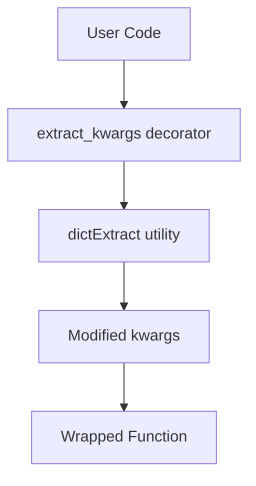
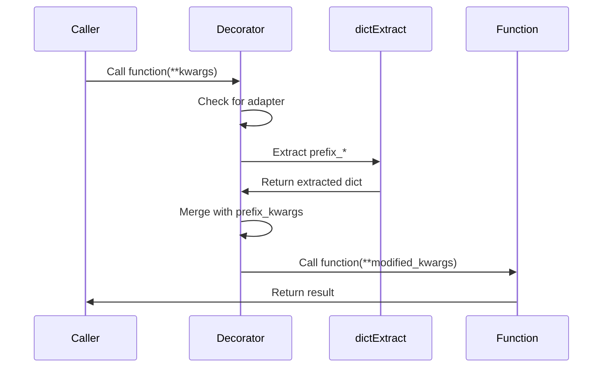
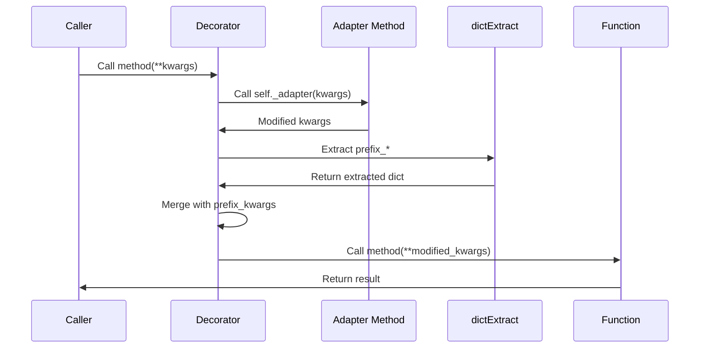

# Architecture

Technical design and architecture of Genro-Toolbox.

## Overview

Genro-Toolbox is designed with simplicity and zero dependencies in mind:



## Core Components

### 1. extract_kwargs Decorator

**Location**: `src/genro_toolbox/decorators.py`

The main decorator that orchestrates kwargs extraction:

```python
def extract_kwargs(
    _adapter: Optional[str] = None,
    _dictkwargs: Optional[Dict[str, Any]] = None,
    **extraction_specs: Any
) -> Callable[[F], F]
```

**Responsibilities**:
- Parse extraction specifications
- Call optional adapter method
- Extract kwargs by prefix
- Merge with existing extracted kwargs
- Call wrapped function

### 2. dictExtract Utility

**Location**: `src/genro_toolbox/dict_utils.py`

Internal utility for prefix-based dict extraction:

```python
def dictExtract(
    mydict: dict,
    prefix: str,
    pop: bool = False,
    slice_prefix: bool = True,
    is_list: bool = False
) -> dict
```

**Responsibilities**:
- Find keys matching prefix
- Optionally remove keys from source
- Optionally remove prefix from keys
- Handle reserved names (e.g., 'class' → '_class')

## Design Principles

### 1. Zero Dependencies

Genro-Toolbox uses **only Python standard library**:
- `functools.wraps` - Function metadata preservation
- `typing` - Type hints
- No external dependencies

**Benefits**:
- Fast installation
- No dependency conflicts
- Minimal security surface
- Easy to audit

### 2. Performance Optimization

The decorator uses constant reuse to minimize overhead:

```python
_DEFAULT_EXTRACT_OPTIONS = {'slice_prefix': True, 'pop': False, 'is_list': False}
_POP_EXTRACT_OPTIONS = {'slice_prefix': True, 'pop': True, 'is_list': False}
```

Instead of creating new dicts on every call, we reuse pre-defined constants.

### 3. Type Safety

The implementation provides complete type safety:
- Full type hints for all functions
- `@wraps` for metadata preservation
- Support for both functions and methods
- Type-preserving decorator pattern
- Compatible with mypy and pyright

## Execution Flow

### Basic Flow



### With Adapter



## Type System

Genro-Toolbox uses a type-preserving decorator pattern:

```python
F = TypeVar('F', bound=Callable[..., Any])

def extract_kwargs(...) -> Callable[[F], F]:
    def decorator(func: F) -> F:
        @wraps(func)
        def wrapper(*args: Any, **kwargs: Any) -> Any:
            ...
        return wrapper
    return decorator
```

**Benefits**:
- Type checkers (mypy, pyright) understand the decorator
- IDEs provide correct autocomplete
- Function signature is preserved
- Return type is preserved

## Error Handling

### Missing Adapter

If an adapter method is specified but doesn't exist, the decorator **silently continues**:

```python
adapter_method = getattr(self_arg, _adapter, None)
if adapter_method is not None:
    adapter_method(kwargs)
```

**Rationale**: Allows optional adapters in base classes that may be implemented in subclasses.

### Reserved Names

Keys like `class` are renamed to `_class` to avoid Python keyword conflicts:

```python
reserved_names = ['class']
k[lprefix:] if not k[lprefix:] in reserved_names else '_%s' % k[lprefix:]
```

## Testing Architecture

Tests are organized by concern:

```
tests/
├── test_decorators.py
│   ├── TestExtractKwargsBasic      # Core functionality
│   └── TestExtractKwargsAdapter    # Adapter tests
├── test_dict_utils.py
│   ├── TestFilteredDict            # Dict filtering
│   ├── TestMakeOpts                # Option merging
│   └── TestSmartOptions            # SmartOptions class
├── test_typeutils.py
│   ├── TestSafeIsInstance          # Type checking
│   └── TestSafeIsInstanceEdgeCases # Edge cases
└── test_ascii_table.py             # Table rendering
```

**Coverage**: 100% test coverage goal

## Extension Points

### Custom Adapters

Implement adapter methods to pre-process kwargs:

```python
class MyService:
    def _normalize_kwargs(self, kwargs):
        """Called before extraction."""
        # Normalize, validate, or transform kwargs
        pass

    @extract_kwargs(_adapter='_normalize_kwargs', logging=True)
    def __init__(self, logging_kwargs=None):
        pass
```

### Dynamic Specifications

Use `_dictkwargs` for runtime extraction specs:

```python
specs = {'logging': True, 'cache': True}

@extract_kwargs(_dictkwargs=specs)
def setup(logging_kwargs=None, cache_kwargs=None):
    pass
```

## See Also

- [Contributing Guide](contributing.md) - Development setup
- [Best Practices](../user-guide/best-practices.md) - Usage patterns
- [API Reference](../api/reference.md) - Complete API
