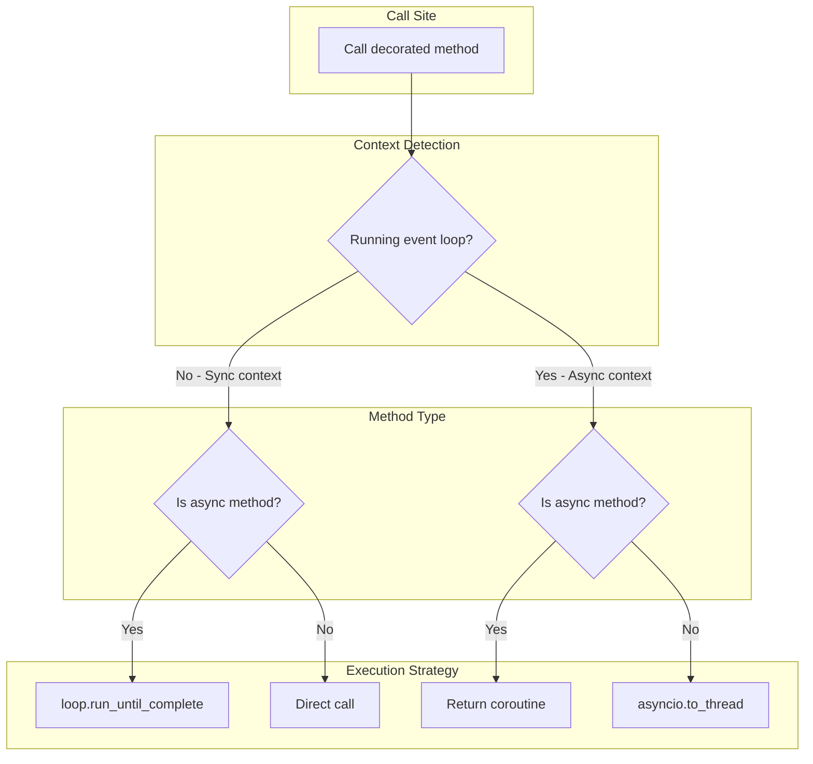
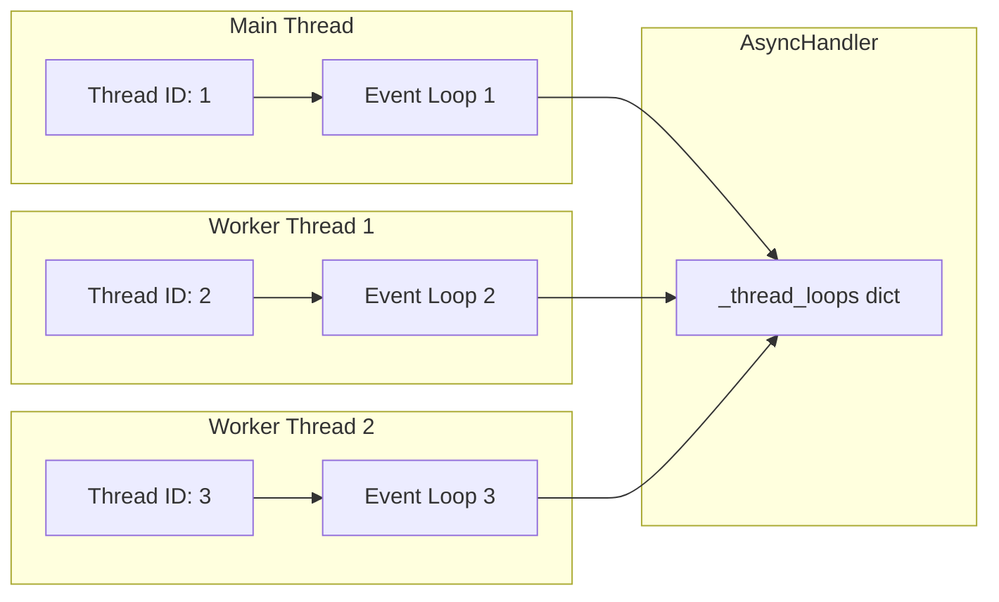
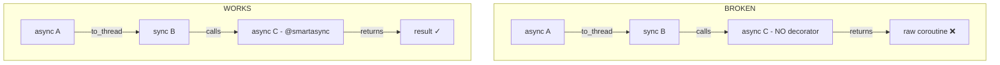
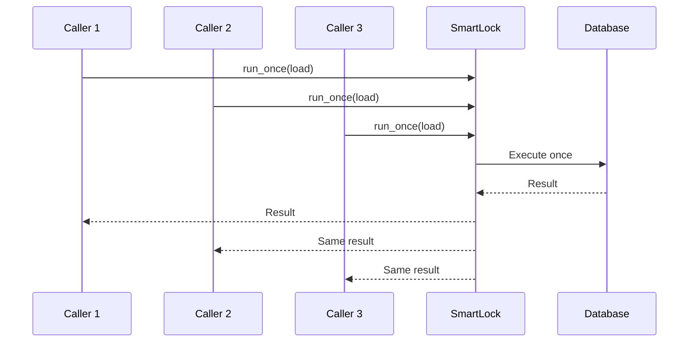

# SmartAsync - Unified Sync/Async API

The `smartasync` module provides utilities for writing code that works seamlessly in both synchronous and asynchronous contexts, without requiring the caller to know which context they're in.

## Overview



## Installation

`smartasync` is included in `genro-toolbox`:

```python
from genro_toolbox import smartasync, smartawait, smartcontinuation, SmartLock
```

## When to Use

### Use `@smartasync` when:

- **Building libraries** that should work in both sync and async applications
- **Wrapping async I/O** (HTTP clients, databases) for sync callers
- **Legacy integration** - making async code available to sync codebases
- **Gunicorn/Django/Flask** - sync workers calling async code

### Don't use `@smartasync` when:

- Your code is **purely async** (just use `async def`)
- Your code is **purely sync** (just use `def`)
- **Performance is critical** - there's overhead in context detection
- **Simple scripts** - just use `asyncio.run()` directly

## Core Components

### `@smartasync` Decorator

The main decorator that makes functions work in any context.

```python
from genro_toolbox import smartasync

class DataManager:
    @smartasync
    async def fetch_data(self, url: str) -> dict:
        """Async method that works in both contexts."""
        async with aiohttp.ClientSession() as session:
            async with session.get(url) as response:
                return await response.json()

    @smartasync
    def process_data(self, data: dict) -> dict:
        """Sync method that won't block async callers."""
        # CPU-intensive processing
        return expensive_computation(data)
```

#### Sync Context Usage

```python
# No event loop running - works without await
manager = DataManager()
data = manager.fetch_data("https://api.example.com")  # Returns result directly
result = manager.process_data(data)  # Direct call
```

#### Async Context Usage

```python
async def main():
    manager = DataManager()
    data = await manager.fetch_data("https://api.example.com")  # Normal await
    result = await manager.process_data(data)  # Offloaded to thread!
```

### Execution Matrix

| Context | Method Type | Action | Mechanism |
|---------|-------------|--------|-----------|
| Sync | Async | Execute blocking | `loop.run_until_complete()` |
| Sync | Sync | Direct call | Pass-through |
| Async | Async | Return coroutine | For `await` |
| Async | Sync | Thread offload | `asyncio.to_thread()` |

### Inline Usage

`smartasync` can be used without the decorator syntax:

```python
# Wrap and call in one line
result = smartasync(some_async_func)(arg1, arg2)

# Or wrap once, call multiple times
wrapped = smartasync(third_party_async_func)
result1 = wrapped(args1)
result2 = wrapped(args2)
```

This is useful for wrapping third-party async functions.

## Architecture

### Per-Thread Event Loop Pool



Each thread gets its own event loop, created on first use and reused for subsequent calls. This is optimized for environments like **Gunicorn with sync workers** where threads are long-lived.

### Context Detection

```python
# Simplified detection logic
try:
    asyncio.get_running_loop()
    # Running loop exists -> async context
    return None
except RuntimeError:
    # No running loop -> sync context
    return get_or_create_thread_loop()
```

## Helper Functions

### `smartawait`

Resolves nested awaitables recursively:

```python
from genro_toolbox import smartawait

async def flexible_load(self):
    # self.loader() might return value, coroutine, or coroutine returning coroutine
    result = await smartawait(self.loader())
    return result
```

### `smartcontinuation`

Applies a callback to a value, handling both sync and async:

```python
from genro_toolbox import smartcontinuation

def extract_name(data):
    return data["name"]

# Works with sync values
result = smartcontinuation({"name": "Alice"}, extract_name)  # "Alice"

# Works with async values
result = smartcontinuation(async_fetch_user(), extract_name)  # coroutine
name = await result  # "Alice"
```

### `SmartLock`

Async lock with request coalescing (singleflight pattern):

```python
from genro_toolbox import SmartLock

class CachedLoader:
    def __init__(self):
        self._lock = SmartLock()
        self._cache = None

    async def get_data(self):
        if self._cache is not None:
            return self._cache

        # Only first caller executes, others wait for result
        result = await self._lock.run_once(self._expensive_load)
        self._cache = result
        return result
```

## Caveats and Best Practices

### Nested Mixed Calls



**Problem**: When async code offloads sync code to a thread, and that sync code calls async functions without `@smartasync`, the sync code receives a raw coroutine it cannot use.

**Solution**: Apply `@smartasync` to all async functions that might be called from sync contexts.

### Best Practice: Leaf-Level Decoration

Apply `@smartasync` only at the "leaf" level - the outermost boundary where sync code calls async code:

```python
# Good: decorator at the API boundary
class StorageClient:
    @smartasync
    async def get(self, key: str) -> bytes:
        return await self._internal_get(key)

    async def _internal_get(self, key: str) -> bytes:
        # Internal methods don't need decorator
        ...
```

### Testing

Always reset the cache between tests:

```python
from genro_toolbox import reset_smartasync_cache

def test_my_feature():
    reset_smartasync_cache()
    # test code...
```

## FAQ

### Q: Why not just use `asyncio.run()`?

`asyncio.run()` creates a new event loop each time, which:
- Has overhead from loop creation
- Cannot be called from within an async context
- Doesn't integrate with existing loops

`@smartasync` detects the context and uses the appropriate strategy.

### Q: Does `@smartasync` have overhead?

Yes, there's a small overhead for:
- Checking if an event loop is running (`asyncio.get_running_loop()`)
- Looking up the thread's event loop in the dictionary

For most applications this is negligible, but for extremely hot paths you might want to avoid it.

### Q: Can I use `@smartasync` on class methods?

Yes, it works on:
- Instance methods
- Class methods (not recommended - see coding guidelines)
- Static methods (not recommended - see coding guidelines)
- Standalone functions

### Q: What happens if I forget `@smartasync` on a nested async call?

The sync caller receives a raw coroutine object:
```python
result = async_func()  # <coroutine object at 0x...>
```

This is a bug - add `@smartasync` to the async function.

### Q: Is it thread-safe?

Yes:
- Each thread gets its own event loop
- The `reset()` method uses a lock
- `SmartLock` uses `asyncio.Lock` for coordination

### Q: What about `async for` and `async with`?

These are async constructs that must be used within async contexts. `@smartasync` doesn't change this - it only affects function calls.

### Q: Can I call a `@smartasync` method from within another `@smartasync` method?

Yes, it works correctly. In async context, both return coroutines for `await`. In sync context, both execute via `run_until_complete`.

### Q: Why use `SmartLock` instead of regular caching?

`SmartLock` prevents the "thundering herd" problem:



Without it, all three callers would hit the database.

## API Reference

### `smartasync(method)`

Decorator that makes a function work in both sync and async contexts.

**Parameters:**
- `method`: Function to decorate (async or sync)

**Returns:** Wrapped function

### `smartawait(value)`

Async function that resolves nested awaitables.

**Parameters:**
- `value`: Value or awaitable to resolve

**Returns:** Final resolved value

### `smartcontinuation(value, on_resolved, *args, **kwargs)`

Applies a callback to a value, handling sync/async transparently.

**Parameters:**
- `value`: Value or awaitable
- `on_resolved`: Callback function
- `*args, **kwargs`: Arguments for callback

**Returns:** Result or coroutine

### `SmartLock`

Async lock with request coalescing.

**Methods:**
- `run_once(coro_func, *args, **kwargs)`: Execute once, share result
- `reset()`: Cancel pending futures and reset state

### `reset_smartasync_cache()`

Clear all cached event loops. Use in tests.
