# Processing GIFT-Seq Data
The [`giftwrap`](../cli/giftwrap.md) command is the main entry point for processing GIFT-seq data, it will run the full FastQ-to-counts matrix pipeline, including basic quality control. This guide will describe how to use `giftwrap` and how it works under the hood. For experimental considerations, please refer to the [GIFT-seq publication](...) for more details. Note that some QC metrics require that GIFTwrap was installed using the `analysis` extra as described in the [installation guide](../installation.md) and VisiumHD processing requires `spaceranger` from 10X Genomics to be installed in your system PATH.

## Overview of the GIFTwrap Pipeline
The `giftwrap` command is actually just an automated sequence of commands that will run each individual step of the GIFT-seq processing pipeline. As a result, it is possible to intervene and run each step individually, however, this is not typically necessary. For more details, refer to the [GIFTwrap CLI documentation](../cli/giftwrap.md).

The `giftwrap` pipeline will run the following major steps:

1. **Mapping**: Given a set of FastQ files, we will attempt to identify reads that are valid 10X reads. These reads will then be mapped to the specified probe list. The output is a flat list of parsed cell barcodes, umis, probe barcodes, probe ids, and gapfill sequences. When mapping the cell barcodes, if cellranger was already run on the whole transcriptome data, cell barcodes will only be mapped to observed transcriptome cell barcodes. If cellranger was not run, the full 10X cell barcode whitelist will be used instead. At this point, the data has not been corrected for UMI or gapfill sequencing errors, thus there will be duplicates in the output when multiple reads map to the same cell barcode, UMI, and probe barcode. Mapping is done by testing each read against our cell barcode and probe whitelists, allowing an error rate of ~10% (i.e. 1 nucleotide error per 10 bases). The output of this step is a flat list of parsed reads, which is then used for further processing.
2. **UMI Correction**: Once the universe of mapped reads is obtained, we will correct UMIs for both sequencing errors and PCR chimeras. Since UMIs have no explicit whitelist, we assume that for each cell barcode, there is a single probe that a given UMI maps to. We also assume that UMIs have a typical error rate of up to 10%. Correction is done by sorting probe/UMI pairs by the number of reads that map to them. Going down the list, we will correct a UMI if it is within 10% of a more abundant UMI, otherwise we assume it is a unique UMI. Finally, where there are multiple probes a corrected UMI maps to, we will filter out all reads that do not map to the most abundant probe/UMI pair for that UMI.
3. **Gapfill Correction**: Once all reads have been corrected for technical sequences, we now need to correct the gapfill sequences. Since each cell barcode/UMI/probe tuple should have a single gapfill sequence, we can correct the gapfill sequences by picking the most abundant gapfill sequence across all reads that map to the same cell barcode/UMI/probe tuple. If there is no immediate consensus for each set of reads, we will group the observed sequences by their length, and then pick the most abundant sequence length, removing all reads that do not match the most abundant sequence length (therefore avoiding the need to perform a gappy alignment). Finally, for each position in the gapfill sequence, we will model the most likely nucleotide at that position by computing the probability of correct assignment (by PHRED score) across the number of reads that map to the same nucleotide at the given position. For quality control, we record the number of reads that support the corrected gapfill sequence. 
4. **Counting UMIs**: The final processing step is to demultiplex counts by probe barcode (if multiplexed), followed by the counting of distinct UMIs for each cell barcode. The pipeline simply first scans all possible probe/gapfill sequence combinations (defining the number of features in the final counts matrix), then for each cell barcode: count the number of distinct UMIs that map to each probe/gapfill sequence combination. While collecting this data, we also collect the metadata and output a set of counts matrices (n_cells x n_features) to describe both counts and the number of supporting reads for each cell barcode/feature combination. The output is an h5 file, which has a data structure similar to that used by cellranger. This file can be loaded using the `giftwrap` Python API at this point. 
5. **Quality Control**: Finally, various quality control metrics are computed to quantify the quality of the data and its efficiency at genotyping. Note that if cellranger was run on the whole transcriptome data, the quality control metrics will be computed only for the observed transcriptome cell barcodes with a filtered h5 file containing only those cell barcodes. Furthermore, additional metrics will be computed to compare the capture rate of genes observed in the transcriptome data to the genes observed in the GIFT-seq data. 

For a more detailed overview of GIFTwrap workflow, [refer to the GIFTwrap workflow below](./processing_giftseq_data.md#giftwrap-workflow).

## Running the GIFTwrap Pipeline
The recommended way to run the GIFTwrap pipeline is through the [`giftwrap`](../cli/giftwrap.md) command, which automatically runs all the previously described steps in sequence. View the [GIFTwrap CLI documentation](../cli/index.md) for more details on how to run each step individually and their associated options.

```py exec="md"
import subprocess, textwrap, os
cmd = "giftwrap --help"
out = subprocess.check_output(cmd.split(), text=True, env={**os.environ, "TERM": "xterm-256color"})
print("<!-- termynal -->")
print("```console")
print(f"$ {cmd}")
print(textwrap.dedent(out))
print("```")
```

The pipeline contains many different options, but the most important ones are simply the flags to specify the input FastQ and probeset files and the output destination directory. These options are described below:

### Specifying Input Sequencing Files
GIFTwrap expects paired-end FastQ files as input, which should be sequenced similarly to 10X Genomics fixed single-cell data. The sequencing data can be provided in one of the following ways:

* Explicit FastQ files: If you have a single pair of FastQ files, you can specify them using the `-r1` and `-r2` options, which specify the read 1 and read 2 FastQ files, respectively. For example:

<!-- termynal -->
```console
$ giftwrap -r1 /path/to/sample_R1.fastq.gz -r2 /path/to/sample_R2.fastq.gz ...
```

* FastQ file prefix: To simplify FastQ file specification you can use the `--project` option, which attempts to automatically find the FastQ files with a given prefix and with suffixes of either `_R{1,2}.fastq.gz` or `_R{1,2}.fastq`. This is therefore the recommended way to specify FastQ files if multiple lanes were used to sequence the same sample. For example: 

<!-- termynal -->
```console
$ giftwrap --project /path/to/sample_project ...
```
Would automatically match files with wildcards similar to bash: `/path/to/sample_project*R1*.f*q*` and `/path/to/sample_project*R2*.f*q*`.

### Specifying Probeset Files
The probeset file is either comma-separated, tab-separated, or an excel file describing the probe names and their "left-hand-side" (LHS) and "right-hand-side" (RHS) sequences. The LHS and RHS sequences refer to the sequences that would be read in by the sequencer (i.e. the reverse-complemented sequences of the targeted transcripts). This follows the terminology used by 10X Genomics in their Flex and Visium protocols. The probeset file has a header and the following columns described in the following table:

| Column Name | Description | Required? |
|-------------|-------------|-----------|
| `name` | The name of the probe. By convention this should follow the format of: `gene_name HGSVc`. For example: `TP53 c.215G>A`. | Yes |
| `lhs_sequence` | The left-hand side sequence of the probe, this is the reverse complement of the right side of your gene sequence of interest. | Yes |
| `rhs_sequence` | The right-hand side sequence of the probe, this is the reverse complement of the left side of your gene sequence of interest. | Yes |
| `gap_probe_sequence` | The expected "mutant" sequence of the gapfill sequenced (i.e. the reverse complement of the region of interest). This is only used to annotate outputs and is not involved in default analysis. | No |
| `original_gap_probe_sequence` | The "wild-type" sequence of the gapfill probe (i.e. the reverse complement of the region of interest), this is only used to annotate outputs and is not involved in default analysis. | No |
| `gene` | The gene name that is associated with the probe. If not provided, GIFTwrap will attempt to infer this from the `name` column. | No |

Note that the name, lhs_sequence, and rhs_sequence columns are required and the additional columns are optional but can aid in downstream analysis. The probeset file is specified using the `--probes` option, for example:

<!-- termynal -->
```console
$ giftwrap --probes /path/to/probes.csv ...
```

### Specifying Output Directory
The final required option is the output directory. This is where all final and intermediate files will be saved. Additionally, this directory will contain sentinel files that indicate completion of each step of the pipeline, allowing for you to resume processing from the last completed step when re-running the pipeline. The output is specified using the `--output` option, for example:

<!-- termynal -->
```console
$ giftwrap --output /path/to/output_directory ...
```

### Typical Additional Options
In addition to the required options, typically you will want to improve the performance and quality of the pipeline by specifying additional options. 

We recommend setting the `--cores` option to allow the pipeline to use multiple cores to speed up processing. Specifying `--cores 0` will use all available cores detected on the system. 

Additionally, if you have run cellranger on the whole transcriptome data prior to running GIFTwrap, specifying the `--cellranger_output` option will allow GIFTwrap to prune the cell barcode list to only include cell barcodes that were observed in the output of cellranger as well as enabling additional quality control metrics to check the efficiency of the GIFT-seq capture of genotypes. The cellranger output can either be specified as the path to the final sample_filtered_feature_bc_matrix .h5 file (e.g. `--cellranger_output /path/to/sample_filtered_feature_bc_matrix.h5`) or as the path to the directory containing the cellranger counts data (including the counts matrix, cell barcodes, and feature names. e.g. `--cellranger_output /path/to/cellranger_output/`).

These two options are highly recommended:
<!-- termynal -->
```console
$ giftwrap --cores 0 --cellranger_output /path/to/cellranger_output/ ...
```

### Applying GIFTwrap to Multiplexed Data
As is common to Flex-based experiments, GIFTwrap supports multiplexed data by splitting reads according to probe barcodes. This can be done by one of two ways:

1. **Using the `--multiplex` option**: This option tells GIFTwrap to process multiplexed data by processing everything at the same time and splitting counts into different final output matrices in the last steps of the pipeline. For Flex, this automatically supports up to 16-plex experiments. For example:

<!-- termynal -->
```console
$ giftwrap --multiplex 16 ...
```

2. **Specifying the probe barcode**: Instead of processing all multiplexed data at once, by specifying `--barcode` to a specific 1-indexed id for the probe barcode, GIFTwrap will automatically ignore reads that do not match the given probe barcode. Note that you will notice that many reads do not map, this is expected due to the skipping of reads that do not match the given probe barcode. An example of this option is:

<!-- termynal -->
```console
$ giftwrap --barcode 1 ...
```

### Running GIFTwrap on VisiumHD
GIFTwrap has built-in support for VisiumHD data. Most processing steps are similar, however cell barcode mapping/correction is done distinctly by allowing indels, allowing greater error rates, and by parsing the proprietary experiment design file provided by spaceranger. Therefore, it is *required* that spaceranger is installed on your system PATH. Note that non-HD Visium data is technically supported, but it has not been tested/validated. 

To perform VisiumHD processing, you must specify the `--technology` option as `VisiumHD`, Giftwrap will then automatically scan the spaceranger installation for additional required data files to run the pipeline. 

!!! info
    VisiumHD data processing takes significantly longer than standard Flex-based experiments due to the high complexity of the spatial barcode design and its unique correction requirements. Consider increasing the number of cores to speed up processing.

<!-- termynal -->
```console
$ giftwrap --technology VisiumHD --cores 0 ...
```

### Dealing with Experimental Design Complexities
When running GIFTwrap with atypical experimental designs (for example, dealing with extremely long gapfill sequences), you may specify several additional options to help GIFTwrap process the data correctly. These options are broken down by several common scenarios.

!!! info
    There may be additional options not included in the `giftwrap` pipeline wrapper, but may be included in each individual step. To run them individually and see their options, refer to the [GIFTwrap CLI documentation](../cli/index.md).

#### Scenario 1: Extremely Long Gapfill Sequences 
GIFTwrap can typically handle long gapfill sequences, however, you may run into issues with library sequencing when using standard 10X Flex-based protocols. Specifically, the R2 length may not be sufficient to cover the expected constant sequence in each probe when the gapfill+probe sequence is longer than 60 bases. GIFTwrap normally requires the constant sequence to be present when possible in order to improve data quality. However, this can be disabled with a limited expected reduction of data quality by specifying the `--skip_constant_seq` flag. This is because the constant sequence is typically at the end of the R2 read. 

<!-- termynal -->
```console
$ giftwrap --skip_constant_seq ...
```

#### Scenario 2: Intentionally Non-Specific Probe Pairings
Normally, GIFTwrap requires that probes are paired according to the provided probeset file explicitly. GIFTwrap also supports allowing multiple components to be paired to different probes. However, if you have a complex probe design where it is unclear which probes may be paired with each other (i.e. due to high sequence similarity), you can pass the `--allow_any_combination` flag. This will make GIFTwrap fill in all possible combinations of probe pairs in its final output, and allow any pairing when mapping. The final output will contain an additional feature metadata column, `was_defined` indicating whether the probe pair was defined in the original probeset file or not. 

!!! warning
    This option will lead to slower processing times and may produce inconsistent mapping results. Ensure that you are careful about validating the final output of the pipeline. 

<!-- termynal -->
```console
$ giftwrap --allow_any_combination ...
```

#### Scenario 3: Combining Multiple Sequencing Runs With Different Read Lengths
If you have multiple sequencing runs with different read lengths, GIFTwrap may produce inconsistent mapping results. For example, if R1 is shorter in one run than the other, UMI correction and parsing will be completely inconsistent. To avoid this, it is recommended that the R1 read length and/or the R2 read length is explicitly specified using the `--r1_length` and `--r2_length` options, respectively. Modifying these lengths will typically adjust UMI and constant sequence parsing, respectively. 

Example of varying R1 lengths:
<!-- termynal -->
```console
# If one run has R1 length of 26 and another has R1 length of 28:
$ giftwrap --r1_length 26 ...
>>> All R1 reads will now be shortened to 26 bases when running the pipeline.
```

Example of varying R2 lengths:
<!-- termynal -->
```console
# If one run has R2 length of 60 and another has R2 length of 70:
$ giftwrap --r2_length 60 --skip_constant_seq ...
>>> All R2 reads will now be shortened to 60 bases when running the pipeline. Note that we skip the constant sequence parsing step to prevent filtering out reads without the constant sequence.
```

#### Scenario 4: Low Number of Mapped Reads
Many different factors can lead to a low number of reads. The best way to understand the issue is to examine the `fastq_metrics.tsv` file in the output directory to see why reads were not mapped. Additionally, you can specify the `--unmapped_reads` option to save unmapped reads to a separate set of FastQ files which can then be manually inspected. This option accepts a filename prefix which will be used to save the unmapped reads. For example:

<!-- termynal -->
```console
$ giftwrap --unmapped_reads my_unmapped_reads ...
>>> This will save unmapped reads to files named my_unmapped_reads_R1.fastq.gz and my_unmapped_reads_R2.fastq.gz to your output directory.
```

#### Scenario 5: Using a Custom Single-Cell Protocol
If you are using a non-supported single-cell protocol, follow the [Extending GIFTwrap guide](extending_giftwrap.md) to create a custom protocol. Note that when creating a custom protocol, you must set the `--technology` option to `Custom` and provide the required `--tech_def` option for your custom protocol.


### Additional Options
Here are the remaining options that can be used with the `giftwrap` command:

* `---flexible_start_mapping <N>`: If specified, GIFTwrap will allow for some insertion/deletions related to technical artifacts in sequencing at the start of R2.

* `--overwrite`: If specified, GIFTwrap will overwrite any existing output files in the output directory. This is useful if you want to re-run the pipeline without having to delete the output directory first.

* `--allow_chimeras`: If specified, GIFTwrap will skip filtering out UMIs that pair to multiple probes within the same cell barcode. 

* `--flatten`: If specified, in addition to the final .h5 file, GIFTwrap will also output a flattened TSV file containing the same mapped data, but human readable and easy to parse. The file will be named `flat_counts.{plex}.tsv.gz` in the output directory. This is the same as the intermediate `probe_reads.tsv.gz` file generated while running the pipeline, but manifest metadata is joined to the resultant output.

## Common Examples of running GIFTwrap
Basic single-plex run:

<!-- termynal -->
```console
$ giftwrap -r1 /path/to/sample_R1.fastq.gz -r2 /path/to/sample_R2.fastq.gz --probes /path/to/probes.csv --output /path/to/output_directory --cores 0
```

Basic 4-plex run:
<!-- termynal -->
```console
$ giftwrap --project /path/to/files/sample_id --probes /path/to/probes.csv --output /path/to/output_directory --cores 0 --multiplex 4
```

Basic VisiumHD run:
<!-- termynal -->
```console
$ giftwrap --project /path/to/files/sample_id --probes /path/to/probes.csv --output /path/to/output_directory --cores 0 --technology VisiumHD
```

## Conclusion
The `giftwrap` command provides a powerful and flexible way to process GIFT-seq data. Additional options and greater customization can be achieved by running the individual steps of the pipeline manually, but this pipeline should cover most common use cases. For more details on the experimental design and considerations, please refer to the [GIFT-seq publication](...). If you have any questions or issues, don't hesitate to reach out via the [GIFTwrap GitHub repository](https://github.com/clareaulab/giftwrap).


## GIFTwrap Workflow
Below is a high-level overview of the entire GIFTwrap workflow, which is automatically executed via the `giftwrap` command.
This diagram illustrates the main steps involved in processing GIFT-seq data, from reading the FastQ files to generating the final counts matrix.

```mermaid
---
config:
  theme: redux
  layout: dagre
  look: neo
---
%%{init: {'themeVariables': { 'edgeLabelBackground': 'white'}}}%%
flowchart LR
 subgraph s1["giftwrap-count"]
    direction TB
        n2["GIFT-seq FASTQs"]
        n3["WTA<br>Provided?"]
        n4@{ label: "<span style=\"padding-left:\">Use Called Cells<br>For Cell Barcode<br>Whitelist<span style=\"padding-left:\">t</span></span>" }
        n5@{ label: "<span style=\"padding-left:\">Use Default<br>Cell Barcode<br>Whitelist</span>" }
        n6["LHS<br>Sequences<br>Differ?"]
        n28["Sort All Recorded Reads By:<br>Probe BC, Cell BC, Probe ID"]
        s2["s2"]
  end
 subgraph s2["<div style="width:54em; height:2em; display:flex; justify-content: flex-start; align-items:flex-end;"><strong>For each read</strong></div>"]
    direction TB
        n7["Fuzzy Match LHS,<br>Prioritizing Longer<br>LHS Sequences"]
        n8["Fuzzy Match LHS<br>Based on First N<br>Nucleotides in R2"]
        n9["Match?"]
        n10["Fuzzy Search Remaining<br>R2 for the Constant<br>Sequence"]
        n11["Discard Read"]
        n12["Present<br>Or Ignored?"]
        n13["Discard Read"]
        n14["Multiplexed?"]
        n15["Fuzzy Match<br>Probe Barcode"]
        n16["Expected<br>Barcode<br>Matched?"]
        n17["Discard Read"]
        n18["Fuzzy Search<br>for a Paired<br>RHS Sequence"]
        n19["Expected RHS<br>Matched?"]
        n20["Grab Sequence<br>Between LHS and<br>RHS as Gapfill"]
        n21["Discard Read"]
        n22["Split R1 Into<br>Expected UMI<br>and Cell Barcode<br>Sequences"]
        n23["Fuzzy Search Cell<br>Barcode Against<br>Whitelist"]
        n24["Matched<br>Cell Barcode?"]
        n25["Record Mapped<br>Read"]
        n26["Discard Read"]
  end
 subgraph s3["giftwrap-correct-umis"]
    direction TB
        s4["s4"]
        n27["Group Reads By<br>Probe Barcode and<br>Cell Barcode"]
        n29["Iterate Over Reads<br>Within Each Cell"]
  end
 subgraph s4["<div style="width:52em; height:2em; display:flex; justify-content: flex-start; align-items:flex-end;"><strong>For each Probe BC/Cell BC pair</strong></div>"]
    direction TB
        n35["Sort UMIs<br>By Number of<br>Reads Captured"]
        n31["Observed<br>UMIs"]
        n30["Test Raw<br>UMI Sequence"]
        n40["Probe/UMI<br>Chimeras<br>Allowed?"]
        n32["Accept UMI"]
        n33["Collect PHRED<br>Quality Scores<br>for Each UMI Base"]
        n36["Test Up to 1 Edit<br>Prioritized by Quality"]
        n37["Matches Existing<br>Probe / UMI Pair?"]
        n38["Accept Corrected UMI"]
        n39["Accept Uncorrected<br>UMI As Newly<br>Observed"]
        n41["Save All Collected<br>Probe/UMI Pairs"]
        n42["Sort All Probes<br>Observed For<br>Each UMI"]
        n43["Only 1 Probe<br>for a UMI?"]
        n44["Sort the Probes<br>By Number of<br>Reads"]
        n45["Save the<br>Probe/UMI Pair"]
        n46["Discard Reads Not<br>Mapping to the Most<br>Commonly Observed<br>Probe/UMI Pair"]
  end
 subgraph s5["giftwrap-correct-gapfill"]
    direction TB
        s6["s6"]
        n47["Group Reads by<br>Probe BC/Cell BC/UMI<br>Tuples"]
  end
 subgraph s6["<div style="width:44em; height:2em; display:flex; justify-content: flex-start; align-items:flex-end;"><strong>For each Probe BC/Cell BC/Probe/UMI tuple</strong></div>"]
    direction TB
        n48["More Than<br>One Read?"]
        n51["Are All<br>Gapfills the<br>Same Length?"]
        n50["Accept Collected<br>Gapfill Sequence"]
        n52["Collect the<br>Frequency of<br>Nucleotides for<br>Each Position"]
        n53["Count the Total<br>Number of Reads<br>Supporting Each<br>Gapfill Sequence<br>Length"]
        n54["Retain Gapfill<br>Reads That Match<br>the Most Common<br>Gapfill Sequence<br>Length"]
        n55["Only One<br>Remaining<br>Read?"]
        n56["Accept Collected<br>Gapfill Sequence"]
        n57["Select the<br>Most Frequent<br>Nucleotide Per<br>Position"]
        n58["Accept the<br>Corrected<br>Gapfill Sequence"]
        n59["Compute Estimated<br>Number of Reads<br>Supporting the<br>Corrected Gapfill"]
  end
 subgraph s7["giftwrap-collect"]
        s8["s8"]
        n60["Group Reads by<br>Probe BC"]
  end
 subgraph s8["<div style="width:19em; height:-2em; display:flex; justify-content: flex-start; align-items:flex-end;"><strong>For each Probe BC</strong></div>"]
        n61["Collect All<br>Possible Observed<br>Probe/Gapfill Sequence<br>Combinations"]
        n62["Collect All UMIs<br>Supporting Each<br>Cell BC/Probe/Gapfill<br>Combination"]
        n63["Write to<br>GIFTwrap .h5<br>Counts File"]
        n64["Output .h5 File"]
  end
 subgraph s9["giftwrap-summarize"]
        n65["Compute Summary<br>Statistics"]
        n66["Was Cellranger<br>WTA Data<br>Provided?"]
        n67["Filter final .h5<br>File to Contain<br>Only Cell Barcodes<br>Observed in the<br>WTA Dataset"]
        n68["Exit"]
        n69["Compute Summary<br>Statistics to<br>Evaluate Genotyping<br>Efficicency"]
  end
    n2 --> n3
    n3 -- Yes --> n4
    n3 -- No --> n5
    n4 --> n6
    n5 --> n6
    n6 -- Yes --> n7
    n6 -- No --> n8
    n7 --> n9
    n9 -- Yes --> n10
    n9 -- No --> n11
    n8 --> n9
    n10 --> n12
    n12 -- No --> n13
    n12 -- Yes --> n14
    n14 -- Yes --> n15
    n15 --> n16
    n16 -- No --> n17
    n16 -- yes --> n18
    n14 -- No --> n18
    n18 --> n19
    n19 -- Yes --> n20
    n19 -- No --> n21
    n20 --> n22
    n22 --> n23
    n23 --> n24
    n24 -- Yes --> n25
    n24 -- No --> n26
    n25 --> n28
    n27 --> n29
    n29 --> n35
    n31 --> n30 & n40
    n30 -- No UMIs<br>Observed Yet --> n32
    n30 -- UMI Has Not Been<br>Observed for<br>the Given Probe --> n33
    n30 -- Exact Match to<br>Observed UMI --> n32
    n35 --> n30
    n32 -- Save UMI --> n31
    n33 --> n36
    n36 --> n37
    n37 -- Yes --> n38
    n38 -- Save UMI --> n31
    n37 -- No --> n39
    n39 -- Save UMI --> n31
    n40 -- Yes --> n41
    n40 -- No --> n42
    n42 --> n43
    n43 -- No --> n44
    n43 -- Yes --> n45
    n44 --> n46
    n47 --> n48
    n48 -- Yes --> n51
    n48 -- No --> n50
    n51 -- Yes --> n52
    n51 -- No --> n53
    n53 --> n54
    n54 --> n55
    n55 -- Yes --> n56
    n55 -- No --> n52
    n52 --> n57
    n57 --> n58
    n58 --> n59
    n56 --> n59
    n50 --> n59
    n60 --> n61
    n61 --> n62
    n62 --> n63
    n63 --> n64
    n65 --> n66
    n66 -- Yes --> n67
    n66 -- No --> n68
    n67 --> n69
    s1 ==> s3
    s3 ==> s5
    s5 ==> s7
    s7 ==> s9
    n2@{ shape: docs, pos: "t"}
    n3@{ shape: diam}
    n4@{ shape: rect}
    n5@{ shape: rect}
    n6@{ shape: diam}
    n9@{ shape: diam}
    n12@{ shape: diam}
    n14@{ shape: diam}
    n16@{ shape: diam}
    n19@{ shape: diam}
    n24@{ shape: diam}
    n31@{ shape: cyl}
    n37@{ shape: diam}
    n43@{ shape: diam}
    n48@{ shape: diam}
    n51@{ shape: diam}
    n55@{ shape: diam}
    n64@{ shape: doc, pos: "b"}
    n66@{ shape: diam}
    style s2 fill:#00C853
    style s4 fill:#FFD600
    style s6 fill:#2962FF
    style s8 fill:#D50000
    style s1 fill:#C8E6C9
    style s3 fill:#FFF9C4
    style s5 fill:#BBDEFB
    style s7 fill:#FFCDD2
    style s9 fill:#E1BEE7
    style n2 fill:#f0f0f0
    style n3 fill:#f0f0f0
    style n4 fill:#f0f0f0
    style n5 fill:#f0f0f0
    style n6 fill:#f0f0f0
    style n7 fill:#f0f0f0
    style n8 fill:#f0f0f0
    style n9 fill:#f0f0f0
    style n10 fill:#f0f0f0
    style n11 fill:#f0f0f0
    style n12 fill:#f0f0f0
    style n13 fill:#f0f0f0
    style n14 fill:#f0f0f0
    style n15 fill:#f0f0f0
    style n16 fill:#f0f0f0
    style n17 fill:#f0f0f0
    style n18 fill:#f0f0f0
    style n19 fill:#f0f0f0
    style n20 fill:#f0f0f0
    style n21 fill:#f0f0f0
    style n22 fill:#f0f0f0
    style n23 fill:#f0f0f0
    style n24 fill:#f0f0f0
    style n25 fill:#f0f0f0
    style n26 fill:#f0f0f0
    style n27 fill:#f0f0f0
    style n28 fill:#f0f0f0
    style n29 fill:#f0f0f0
    style n30 fill:#f0f0f0
    style n31 fill:#f0f0f0
    style n32 fill:#f0f0f0
    style n33 fill:#f0f0f0
    style n35 fill:#f0f0f0
    style n36 fill:#f0f0f0
    style n37 fill:#f0f0f0
    style n38 fill:#f0f0f0
    style n39 fill:#f0f0f0
    style n40 fill:#f0f0f0
    style n41 fill:#f0f0f0
    style n42 fill:#f0f0f0
    style n43 fill:#f0f0f0
    style n44 fill:#f0f0f0
    style n45 fill:#f0f0f0
    style n46 fill:#f0f0f0
    style n47 fill:#f0f0f0
    style n48 fill:#f0f0f0
    style n50 fill:#f0f0f0
    style n51 fill:#f0f0f0
    style n52 fill:#f0f0f0
    style n53 fill:#f0f0f0
    style n54 fill:#f0f0f0
    style n55 fill:#f0f0f0
    style n56 fill:#f0f0f0
    style n57 fill:#f0f0f0
    style n58 fill:#f0f0f0
    style n59 fill:#f0f0f0
    style n60 fill:#f0f0f0
    style n61 fill:#f0f0f0
    style n62 fill:#f0f0f0
    style n63 fill:#f0f0f0
    style n64 fill:#f0f0f0
    style n65 fill:#f0f0f0
    style n66 fill:#f0f0f0
    style n67 fill:#f0f0f0
    style n68 fill:#f0f0f0
    style n69 fill:#f0f0f0
```

