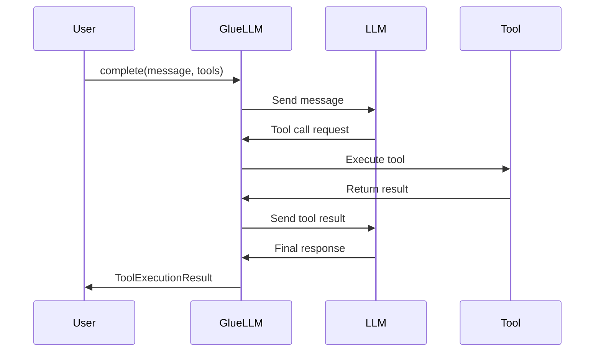
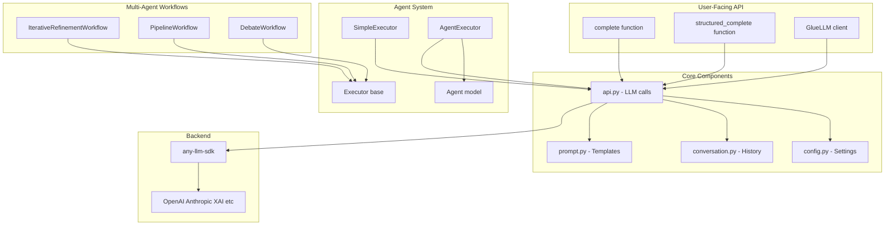
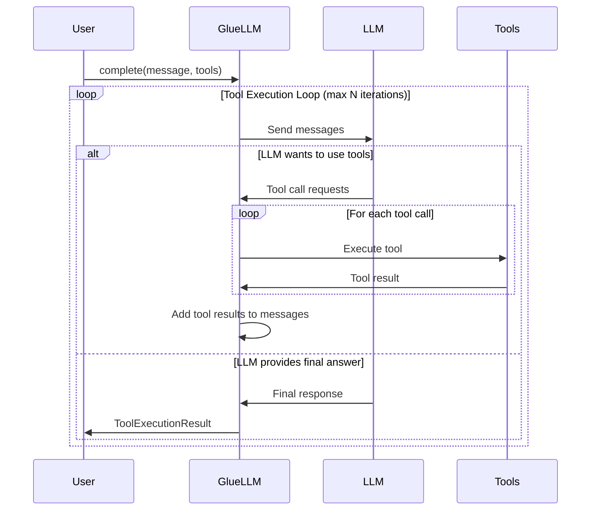

# GlueLLM

> **TL;DR:** I got tired of writing the same LLM boilerplate over and over, so I built this. It's opinionated, has sensible defaults (for me, at least), and gets out of your way. If you like it too, awesome! If not, that's cool—there are plenty of other libraries out there.

## What is this?

GlueLLM is a high-level Python SDK that makes working with Large Language Models actually pleasant. Instead of manually managing tool calls, conversations, retries, and all that jazz, you just tell it what you want and it handles the rest.

**The vibe:** This is what I call a "vibe-coded" library—built iteratively based on real-world needs rather than some grand architectural vision. That said, it's currently running in production projects (including my own), so it's battle-tested enough to be useful.

**Why might you like it?**
- 🎯 **Zero ceremony** - No boilerplate, no manual tool loops, just results
- 🔄 **Works everywhere** - One API for OpenAI, Anthropic, XAI, and others (thanks to `any-llm-sdk`)
- 🤖 **Multi-agent workflows** - 16 pre-built patterns when you need to get fancy
- 🛡️ **Smart defaults** - Automatic retries, proper error handling, and logging that doesn't suck
- 📊 **Structured output** - Type-safe responses with Pydantic (because we're not animals)
- 🔢 **Embeddings support** - Generate embeddings with the same error handling and observability

**Why might you not?**
- This isn't a low-level client—if you need fine-grained control over every API parameter, you might want something else
- It's opinionated about how LLM interactions should work
- Documentation is thorough but might reference my sense of humor occasionally

**Want to help?** Found a bug? Have a feature idea? Please [open an issue](https://github.com/Bioto/glue-llm/issues)! This is a living project that gets better when people actually use it and tell me what's broken or missing.

## Features

- 🔄 **Automatic Tool Execution Loop** - No manual tool call handling required
- 📊 **Structured Output** - Type-safe responses with Pydantic models
- 💬 **Conversation Management** - Built-in multi-turn conversation support
- 🛠️ **Multiple Tools** - Easy integration of multiple tools (sync and async)
- 🎯 **Simple API** - Clean, intuitive interface for common LLM tasks
- 🔌 **Provider Agnostic** - Built on `any-llm-sdk` for multi-provider support
- ⚡ **Automatic Retry with Exponential Backoff** - Smart retry logic for rate limits and connection issues
- 🛡️ **Comprehensive Error Handling** - Catch and classify errors from any LLM provider
- 📝 **Enhanced Logging** - Track retry attempts and tool execution errors with correlation IDs
- ⚙️ **Flexible Configuration** - Environment-based settings with pydantic-settings
- 🤖 **Multi-Agent Workflows** - Orchestrate multiple agents in iterative, pipeline, and debate patterns
- 🌊 **Streaming Support** - Real-time response streaming for better UX
- 📈 **Token Usage Tracking** - Monitor token consumption and costs
- 🔍 **OpenTelemetry Tracing** - Distributed tracing with MLflow for observability
- 🚀 **Local Batch Processing** - Efficient concurrent processing with automatic retry and error handling
- 🚦 **Smart Rate Limiting** - Transparent rate limiting with API key pool management for batch operations
- 📊 **Evaluation Data Recording** - Capture complete request/response lifecycle for LLM evaluations and analysis

## Installation

```bash
# Using uv (recommended)
uv pip install -e .

# With development dependencies
uv pip install -e ".[dev]"

# Requirements
# Python 3.12+
# See pyproject.toml for full dependencies
```

## Quick Start

### Simple Completion

```python
import asyncio
from gluellm.api import complete

async def main():
    result = await complete(
        user_message="What is the capital of France?",
        system_prompt="You are a helpful geography assistant.",
    )
    print(result.final_response)

asyncio.run(main())
```

### Tool Execution

```python
import asyncio
from gluellm.api import complete

def get_weather(location: str, unit: str = "celsius") -> str:
    """Get the current weather for a location.

    Args:
        location: City and country, e.g. "Tokyo, Japan"
        unit: Temperature unit ("celsius" or "fahrenheit")
    """
    return f"Weather in {location}: 22°{unit[0].upper()}, sunny"

async def main():
    result = await complete(
        user_message="What's the weather in Tokyo and Paris?",
        system_prompt="You are a weather assistant. Use get_weather for queries.",
        tools=[get_weather],
    )

    print(result.final_response)
    print(f"Tool calls made: {result.tool_calls_made}")

asyncio.run(main())
```

### Structured Output

```python
import asyncio
from gluellm.api import structured_complete
from pydantic import BaseModel, Field
from typing import Annotated

class PersonInfo(BaseModel):
    name: Annotated[str, Field(description="Full name")]
    age: Annotated[int, Field(description="Age in years")]
    city: Annotated[str, Field(description="City of residence")]

async def main():
    person = await structured_complete(
        user_message="Extract info: John Smith, 35, lives in Seattle",
        response_format=PersonInfo,
    )

    print(f"{person.name} is {person.age} years old and lives in {person.city}")

asyncio.run(main())
```

## Provider Support via any-llm-sdk

GlueLLM is built on top of [any-llm-sdk](https://github.com/BerkYeni/any_llm_client), which provides a unified interface to multiple LLM providers. This means you can easily switch between providers without changing your code.

### Supported Providers

- **OpenAI** - GPT-4, GPT-4o, GPT-3.5, etc.
- **Anthropic** - Claude 3.5 Sonnet, Claude 3 Opus, etc.
- **XAI** - Grok models
- **And more** - any-llm-sdk supports multiple providers

### Model Specification Format

Models are specified using the format: `provider:model_name`

```python
# OpenAI models
model="openai:gpt-4o-mini"
model="openai:gpt-4o"
model="openai:gpt-4-turbo"

# Anthropic models
model="anthropic:claude-3-5-sonnet-20241022"
model="anthropic:claude-3-opus-20240229"

# XAI models
model="xai:grok-beta"
```

### API Key Configuration

Each provider requires its own API key. Set them via environment variables:

```bash
# OpenAI
export OPENAI_API_KEY=sk-...

# Anthropic
export ANTHROPIC_API_KEY=sk-ant-...

# XAI
export XAI_API_KEY=xai-...
```

Alternatively, use the `GLUELLM_` prefixed variables:

```bash
export GLUELLM_OPENAI_API_KEY=sk-...
export GLUELLM_ANTHROPIC_API_KEY=sk-ant-...
export GLUELLM_XAI_API_KEY=xai-...
```

### Switching Providers

Switching between providers is as simple as changing the model string:

```python
# Use OpenAI
result = await complete(
    user_message="Hello!",
    model="openai:gpt-4o-mini",
)

# Switch to Anthropic
result = await complete(
    user_message="Hello!",
    model="anthropic:claude-3-5-sonnet-20241022",
)

# Switch to XAI
result = await complete(
    user_message="Hello!",
    model="xai:grok-beta",
)
```

All features (tool calling, structured output, conversations) work consistently across providers thanks to any-llm-sdk's unified interface.

### Default Provider

Set a default provider in your configuration to avoid specifying it every time:

```bash
# .env file
GLUELLM_DEFAULT_MODEL=openai:gpt-4o-mini
```

```python
from gluellm.api import complete

# Uses default model from config
result = await complete("Hello!")
```

### Why any-llm-sdk?

- **Unified API** - Same code works with any provider
- **Feature Parity** - Consistent tool calling and structured output
- **Easy Migration** - Switch providers without code changes
- **Future-Proof** - New providers added to any-llm-sdk work automatically

For more details on any-llm-sdk capabilities and supported providers, see the [any-llm-sdk documentation](https://github.com/BerkYeni/any_llm_client).

## Core API

### GlueLLM Client

The main client class for stateful LLM interactions with conversation memory.

```python
from gluellm.api import GlueLLM

client = GlueLLM(
    model="openai:gpt-4o-mini",          # Model in "provider:model" format
    system_prompt="You are helpful.",    # System prompt (optional)
    tools=[my_tool],                     # List of tools (optional)
    max_tool_iterations=10,              # Max tool execution loops (optional)
    eval_store=my_store,                 # Evaluation store (optional)
)

# Make completions with conversation memory
result = await client.complete("My favorite color is blue")
result = await client.complete("What's my favorite color?")  # Remembers context

# Structured completions
data = await client.structured_complete("Extract data...", response_format=MyModel)

# Reset conversation history
client.reset_conversation()
```

### Convenience Functions

For one-off requests without maintaining conversation state:

```python
from gluellm.api import complete, structured_complete, embed

# Simple completion
result = await complete(
    user_message="What is 2+2?",
    model="openai:gpt-4o-mini",          # Optional, defaults to config
    system_prompt="You are helpful.",    # Optional
    tools=[calculator],                  # Optional
    execute_tools=True,                  # Optional, default True
    max_tool_iterations=10,              # Optional
)

# Structured completion
person = await structured_complete(
    user_message="Extract: Jane Doe, age 28",
    response_format=PersonInfo,
    model="openai:gpt-4o-mini",          # Optional
    system_prompt="Extract data.",       # Optional
    tools=[lookup_tool],                 # Optional - can call tools before returning structured output
    execute_tools=True,                  # Optional, default True
    max_tool_iterations=10,              # Optional
)
```

### ToolExecutionResult

The result object returned by `complete()` and `client.complete()`:

```python
class ToolExecutionResult:
    final_response: str                      # Final text response from model
    tool_calls_made: int                     # Number of tool calls executed
    tool_execution_history: list[dict]       # Detailed tool call history
    raw_response: ChatCompletion | None      # Raw response from any-llm-sdk
    tokens_used: dict[str, int] | None       # Token usage info (prompt, completion, total)

# Access result data
result = await complete("Query with tools...", tools=[my_tool])
print(result.final_response)
print(f"Made {result.tool_calls_made} tool calls")

# Token usage tracking
if result.tokens_used:
    print(f"Tokens used: {result.tokens_used['total']}")
    print(f"  Prompt: {result.tokens_used['prompt']}")
    print(f"  Completion: {result.tokens_used['completion']}")

for exec_info in result.tool_execution_history:
    print(f"{exec_info['tool_name']}({exec_info['arguments']}) -> {exec_info['result']}")
```

## Tool Execution

### How It Works

GlueLLM automatically handles the tool execution loop:

1. Send user message to LLM
2. If LLM wants to call a tool, execute it
3. Send tool result back to LLM
4. Repeat until LLM provides final answer or max iterations reached

No manual tool call management required!



### Creating Tools

Tools are simple Python functions with docstrings:

```python
def calculate(expression: str) -> str:
    """Safely evaluate a mathematical expression.

    Args:
        expression: A mathematical expression like "2 + 2" or "10 * 5"

    Returns:
        The result of the calculation
    """
    try:
        result = eval(expression)  # Use safely in production!
        return str(result)
    except Exception as e:
        return f"Error: {str(e)}"
```

**Important:**
- Function name becomes the tool name
- Docstring is used by the LLM to understand tool purpose
- Type hints help the LLM understand parameters
- Return string values for best results
- Tools can be synchronous or asynchronous (use `async def` for async tools)

### Multiple Tools Example

```python
def get_weather(location: str) -> str:
    """Get current weather for a location."""
    return f"Weather in {location}: 22°C, sunny"

def get_time(timezone: str = "UTC") -> str:
    """Get current time in a timezone."""
    from datetime import datetime
    return datetime.now().strftime("%H:%M:%S")

result = await complete(
    user_message="What's the weather in Tokyo and what time is it there?",
    tools=[get_weather, get_time],
)
```

### Async Tools

Tools can be asynchronous for database queries, API calls, etc.:

```python
import aiohttp

async def fetch_data(url: str) -> str:
    """Fetch data from a URL."""
    async with aiohttp.ClientSession() as session:
        async with session.get(url) as response:
            return await response.text()

result = await complete(
    user_message="Fetch data from https://api.example.com/data",
    tools=[fetch_data],
)
```

GlueLLM automatically detects async tools and awaits them appropriately.

### Tool Execution History

Track all tool calls and their results:

```python
result = await complete("Complex query requiring tools...", tools=[tool1, tool2])

for i, exec_info in enumerate(result.tool_execution_history, 1):
    print(f"\nTool Call {i}:")
    print(f"  Tool: {exec_info['tool_name']}")
    print(f"  Args: {exec_info['arguments']}")
    print(f"  Result: {exec_info['result']}")
    print(f"  Error: {exec_info.get('error', False)}")
```

## Embeddings

Generate embeddings for text with automatic error handling, rate limiting, and cost tracking.

### Basic Embedding Generation

```python
import asyncio
from gluellm import embed

async def main():
    # Single text
    result = await embed("Hello, world!")
    print(f"Dimension: {result.dimension}")  # e.g., 1536 for text-embedding-3-small
    print(f"Tokens: {result.tokens_used}")
    print(f"Cost: ${result.estimated_cost_usd:.6f}")

    # Access the embedding vector
    embedding_vector = result.embeddings[0]
    print(f"First 5 values: {embedding_vector[:5]}")

asyncio.run(main())
```

### Batch Embeddings

```python
import asyncio
from gluellm import embed

async def main():
    # Multiple texts at once
    texts = ["Hello", "World", "Python programming"]
    result = await embed(texts)

    print(f"Generated {result.count} embeddings")
    print(f"Each has {result.dimension} dimensions")

    # Access individual embeddings
    for i, text in enumerate(texts):
        embedding = result.get_embedding(i)
        print(f"{text}: {embedding[:3]}...")  # First 3 dimensions

asyncio.run(main())
```

### Using GlueLLM Client

```python
import asyncio
from gluellm import GlueLLM

async def main():
    # Create client with custom embedding model
    client = GlueLLM(
        embedding_model="openai/text-embedding-3-large",  # Optional
    )

    # Generate embeddings
    result = await client.embed("Your text here")
    print(f"Dimension: {result.dimension}")

    # Use same client for completions
    completion = await client.complete("Summarize this")
    print(completion.final_response)

asyncio.run(main())
```

### EmbeddingResult Model

The `EmbeddingResult` provides convenient access to embedding data:

```python
from gluellm import embed

result = await embed("Hello")

# Properties
result.embeddings      # List of embedding vectors
result.model           # Model used (e.g., "openai/text-embedding-3-small")
result.tokens_used     # Total tokens consumed
result.estimated_cost_usd  # Estimated cost in USD
result.dimension       # Dimension of embedding vectors
result.count           # Number of embeddings

# Methods
embedding = result.get_embedding(0)  # Get embedding by index
```

### Custom Embedding Model

```python
from gluellm import embed

# Use a different embedding model
result = await embed(
    "Your text",
    model="openai/text-embedding-3-large",  # 3072 dimensions
)

print(f"Dimension: {result.dimension}")  # 3072
```

### Configuration

Set default embedding model via environment variable:

```bash
export GLUELLM_DEFAULT_EMBEDDING_MODEL=openai/text-embedding-3-small
```

Or in code:

```python
from gluellm.config import settings

print(settings.default_embedding_model)  # "openai/text-embedding-3-small"
```

### Supported Embedding Models

Currently supported embedding models:
- `openai/text-embedding-3-small` (1536 dimensions, $0.02/1M tokens)
- `openai/text-embedding-3-large` (3072 dimensions, $0.13/1M tokens)
- `openai/text-embedding-ada-002` (1536 dimensions, $0.10/1M tokens)

### Error Handling

Embeddings use the same error handling as completions:

```python
from gluellm import embed, RateLimitError, TokenLimitError

try:
    result = await embed("Your text")
except RateLimitError:
    print("Rate limit hit - will retry automatically")
except TokenLimitError:
    print("Text too long - reduce input size")
```

## Evaluation Data Recording

GlueLLM provides comprehensive evaluation data recording to capture complete request/response lifecycle data for LLM evaluations, debugging, and analysis. This feature enables full observability with pluggable storage backends, giving you maximum flexibility in how you store and evaluate LLM interaction data.

### Overview

The evaluation recording system automatically captures:
- **Request data**: User messages, system prompts, model configuration, conversation state
- **Response data**: Final responses, structured outputs, raw API responses
- **Tool execution**: Tool calls made, execution history, available tools
- **Metrics**: Latency, token usage, estimated costs
- **Outcomes**: Success/failure status, error types and messages

All recording happens asynchronously and non-blocking, ensuring zero performance impact on your application. Failures in recording never break your completions - the system gracefully degrades.

### Quick Start

The simplest way to enable evaluation recording is using the built-in file storage:

```python
from gluellm import GlueLLM
from gluellm.eval import enable_file_recording

# Enable global file recording
store = enable_file_recording("./eval_data/records.jsonl")

# All GlueLLM instances will now record automatically
client = GlueLLM()
result = await client.complete("What is 2+2?")
print(f"Response: {result.final_response}")

# Clean up when done
await store.close()
```

### Built-in File Storage

`JSONLFileStore` writes evaluation records to a newline-delimited JSON file, perfect for analysis and evaluation workflows:

```python
from gluellm import GlueLLM
from gluellm.eval import JSONLFileStore

# Create a file store
store = JSONLFileStore("./eval_data/records.jsonl")

# Use with a specific client instance
client = GlueLLM(eval_store=store)
result = await client.complete("Explain quantum computing")

# Records are written asynchronously
await store.close()
```

Each line in the JSONL file is a complete `EvalRecord` with all request/response data:

```json
{"id": "uuid-here", "user_message": "...", "final_response": "...", "latency_ms": 1234.5, ...}
{"id": "uuid-here", "user_message": "...", "final_response": "...", "latency_ms": 987.6, ...}
```

### Custom Callbacks

For custom storage backends (databases, APIs, etc.), use `CallbackStore`:

```python
from gluellm import GlueLLM
from gluellm.eval import CallbackStore, enable_callback_recording
from gluellm.models.eval import EvalRecord

# Define your custom storage handler
async def save_to_database(record: EvalRecord):
    """Save record to your database."""
    # Your storage logic here
    await db.save(record.model_dump_dict())

# Enable callback recording globally
enable_callback_recording(save_to_database)

# Or use with a specific instance
store = CallbackStore(save_to_database)
client = GlueLLM(eval_store=store)
```

Callbacks can be synchronous or asynchronous:

```python
# Synchronous callback
def sync_handler(record: EvalRecord):
    print(f"Recorded: {record.id}")

# Asynchronous callback
async def async_handler(record: EvalRecord):
    await api.post("/records", record.model_dump_dict())
```

### Multi-Store (Fan-Out)

Record to multiple backends simultaneously using `MultiStore`:

```python
from gluellm import GlueLLM
from gluellm.eval import JSONLFileStore, CallbackStore, MultiStore

# In-memory storage for real-time analysis
memory_records = []

async def save_to_memory(record: EvalRecord):
    memory_records.append(record)

# Create multi-store that writes to both file and memory
multi_store = MultiStore([
    JSONLFileStore("./eval_data/records.jsonl"),
    CallbackStore(save_to_memory),
])

client = GlueLLM(eval_store=multi_store)
result = await client.complete("What is Python?")

# Records are written to both stores concurrently
await multi_store.close()
```

### Configuration

Evaluation recording can be configured via environment variables:

```bash
# Enable/disable recording globally
export GLUELLM_EVAL_RECORDING_ENABLED=true

# Set default file path (used when no store is explicitly provided)
export GLUELLM_EVAL_RECORDING_PATH=logs/eval_records.jsonl
```

Or programmatically:

```python
from gluellm.config import settings

# Check if recording is enabled
if settings.eval_recording_enabled:
    print("Recording is enabled")

# Get default recording path
print(settings.eval_recording_path)
```

### Data Model

The `EvalRecord` model captures comprehensive data about each LLM interaction:

```python
from gluellm.models.eval import EvalRecord

# EvalRecord fields:
# - id: Unique identifier (UUID)
# - correlation_id: Request tracking ID
# - timestamp: When the request was made
# - user_message: User's input message
# - system_prompt: System prompt used
# - model: Model identifier (e.g., "openai:gpt-4o-mini")
# - messages_snapshot: Full conversation state
# - final_response: Final text response
# - structured_output: Serialized structured output (if applicable)
# - raw_response: Raw API response
# - tool_calls_made: Number of tool calls executed
# - tool_execution_history: Complete tool call history
# - tools_available: List of available tool names
# - latency_ms: Total request latency
# - tokens_used: Token usage dict (prompt, completion, total)
# - estimated_cost_usd: Estimated cost in USD
# - success: Whether request succeeded
# - error_type: Error type if failed
# - error_message: Error message if failed
```

### Advanced Usage

#### Conditional Recording

Create custom stores that filter or transform records:

```python
class ConditionalStore:
    """Only record expensive requests."""

    def __init__(self, base_store: JSONLFileStore):
        self.base_store = base_store

    async def record(self, record: EvalRecord) -> None:
        # Only record if cost > $0.001
        if record.estimated_cost_usd and record.estimated_cost_usd > 0.001:
            await self.base_store.record(record)

    async def close(self) -> None:
        await self.base_store.close()

store = ConditionalStore(JSONLFileStore("./expensive_records.jsonl"))
client = GlueLLM(eval_store=store)
```

#### Reading Recorded Data

Read and analyze recorded data from JSONL files:

```python
import json
from pathlib import Path

records = []
with Path("./eval_data/records.jsonl").open() as f:
    for line in f:
        if line.strip():
            records.append(json.loads(line))

# Analyze your data
total_cost = sum(r.get("estimated_cost_usd", 0) for r in records)
avg_latency = sum(r["latency_ms"] for r in records) / len(records)
print(f"Total cost: ${total_cost:.4f}")
print(f"Average latency: {avg_latency:.2f}ms")
```

#### Instance-Level vs Global Stores

Use stores at different scopes:

```python
from gluellm.eval import enable_file_recording, JSONLFileStore

# Global store - all clients record to it
enable_file_recording("./global_records.jsonl")
client1 = GlueLLM()  # Records to global store
client2 = GlueLLM()  # Records to global store

# Instance-level store - only this client records to it
instance_store = JSONLFileStore("./instance_records.jsonl")
client3 = GlueLLM(eval_store=instance_store)  # Records to instance store only
```

### Integration Examples

#### Recording Structured Outputs

Structured outputs are automatically captured:

```python
from pydantic import BaseModel
from gluellm import structured_complete
from gluellm.eval import JSONLFileStore, enable_file_recording

class Answer(BaseModel):
    number: int
    reasoning: str

# Enable recording
enable_file_recording("./structured_records.jsonl")

# Structured outputs are recorded automatically
result = await structured_complete(
    "What is 2+2? Provide your reasoning.",
    response_format=Answer,
)
# Record includes structured_output field with serialized Answer
```

#### Recording Tool Execution

Tool calls and execution history are fully captured:

```python
from gluellm import GlueLLM
from gluellm.eval import JSONLFileStore

def get_weather(city: str) -> str:
    """Get weather for a city."""
    return f"Sunny in {city}, 72°F"

store = JSONLFileStore("./tool_records.jsonl")
client = GlueLLM(
    tools=[get_weather],
    eval_store=store,
)

result = await client.complete("What's the weather in Paris?")
# Record includes:
# - tool_calls_made: 1
# - tool_execution_history: [{"tool": "get_weather", "args": {...}, "result": "..."}]
# - tools_available: ["get_weather"]
```

#### Error Recording

Errors are automatically recorded with full context:

```python
from gluellm import GlueLLM
from gluellm.eval import JSONLFileStore

store = JSONLFileStore("./error_records.jsonl")
client = GlueLLM(eval_store=store)

try:
    await client.complete("Hello", model="invalid:model-name")
except Exception:
    pass  # Error is automatically recorded with error_type and error_message
```

### Creating Custom Stores

Implement the `EvalStore` protocol to create custom storage backends:

```python
from gluellm.eval import EvalStore
from gluellm.models.eval import EvalRecord

class DatabaseStore:
    """Custom store that saves to a database."""

    async def record(self, record: EvalRecord) -> None:
        # Your database save logic
        await db.insert("eval_records", record.model_dump_dict())

    async def close(self) -> None:
        # Cleanup if needed
        await db.close()

# Use your custom store
client = GlueLLM(eval_store=DatabaseStore())
```

The `EvalStore` protocol requires:
- `async def record(record: EvalRecord) -> None`: Record an evaluation
- `async def close() -> None`: Cleanup resources

### Best Practices

1. **Always close stores**: Call `await store.close()` when done to ensure all records are flushed
2. **Use instance-level stores**: For better isolation, use instance-level stores instead of global ones
3. **Handle errors gracefully**: Recording failures won't break your completions, but monitor them
4. **Filter when needed**: Use conditional stores to reduce storage costs for high-volume applications
5. **Analyze regularly**: Regularly analyze recorded data to understand usage patterns and costs

For more examples, see `examples/eval_recording.py`.

## Structured Output

Get type-safe, validated responses using Pydantic models:

```python
from pydantic import BaseModel, Field
from typing import Annotated

class Product(BaseModel):
    name: Annotated[str, Field(description="Product name")]
    price: Annotated[float, Field(description="Price in USD")]
    in_stock: Annotated[bool, Field(description="Whether item is in stock")]
    category: Annotated[str, Field(description="Product category")]

product = await structured_complete(
    user_message="Extract: iPhone 15 Pro, $999, available, Electronics",
    response_format=Product,
)

# Type-safe access
print(f"{product.name}: ${product.price}")
print(f"In stock: {product.in_stock}")
```

### Complex Structured Output

```python
from typing import List

class Address(BaseModel):
    street: str
    city: str
    country: str

class Person(BaseModel):
    name: str
    age: int
    addresses: List[Address]
    occupation: str | None = None

person = await structured_complete(
    user_message="""
    Extract: Sarah Johnson, 32 years old.
    Lives at 123 Main St, New York, USA and 456 Oak Ave, Boston, USA.
    Works as a software engineer.
    """,
    response_format=Person,
)
```

### Structured Output with Tools

The LLM can call tools to gather information before returning structured output. This is powerful for scenarios where you need to fetch data, perform calculations, or verify information before generating the final structured response.

```python
from pydantic import BaseModel, Field
from typing import Annotated

class WeatherReport(BaseModel):
    location: Annotated[str, Field(description="City name")]
    temperature: Annotated[float, Field(description="Temperature in Celsius")]
    conditions: Annotated[str, Field(description="Weather conditions")]
    recommendation: Annotated[str, Field(description="Activity recommendation")]

def get_weather(city: str) -> dict:
    """Fetch current weather for a city."""
    # In production, this would call a real weather API
    return {"temp": 18, "conditions": "sunny"}

# LLM will call get_weather tool, then return structured output
report = await structured_complete(
    user_message="Get the weather for San Francisco and provide a report with recommendations",
    response_format=WeatherReport,
    tools=[get_weather],
)

print(f"🌡️  {report.location}: {report.temperature}°C, {report.conditions}")
print(f"💡 {report.recommendation}")
print(f"🔧 Tools called: {report.tool_calls_made}")
```

**How it works:**
1. The LLM receives your request and the structured output format
2. If tools are needed, the LLM calls them to gather information
3. Tool results are fed back to the LLM (automatic iteration)
4. Once the LLM has sufficient information, it returns the structured output
5. You get type-safe, validated data plus execution metadata

**Example with multiple tool calls:**

```python
class Analysis(BaseModel):
    summary: str
    data_points: list[dict]
    conclusion: str

def query_database(table: str, filter: str) -> list[dict]:
    """Query a database table."""
    # Mock implementation
    return [{"id": 1, "value": 42}, {"id": 2, "value": 73}]

def calculate_stats(data: list[dict]) -> dict:
    """Calculate statistics on data."""
    values = [d["value"] for d in data]
    return {"mean": sum(values) / len(values), "count": len(values)}

# LLM will orchestrate multiple tool calls as needed
analysis = await structured_complete(
    user_message="Analyze the sales data from Q4 and provide insights",
    response_format=Analysis,
    tools=[query_database, calculate_stats],
    max_tool_iterations=10,  # Allow multiple rounds of tool calls
)
```

**Use cases:**
- **Data extraction**: Fetch data from APIs/databases before structuring
- **Validation**: Verify information using external sources
- **Calculation**: Perform computations before generating reports
- **Multi-step reasoning**: Gather evidence before drawing conclusions

## Batch Processing

Process multiple LLM requests efficiently with controlled concurrency, automatic retry, comprehensive error handling, and intelligent API key rotation.

**Note:** For high-volume batch operations, see the [Rate Limiting](#rate-limiting) section to learn about API key pools that automatically manage rate limits across multiple keys.

### Simple Batch Processing

Process a list of messages with automatic concurrency control:

```python
import asyncio
from gluellm import batch_complete_simple, BatchConfig

async def main():
    messages = [
        "What is 2+2?",
        "What is the capital of France?",
        "Explain quantum computing in one sentence.",
    ]

    # Process with concurrency limit of 3
    responses = await batch_complete_simple(
        messages,
        config=BatchConfig(max_concurrent=3),
    )

    for msg, resp in zip(messages, responses, strict=True):
        print(f"Q: {msg}")
        print(f"A: {resp}\n")

asyncio.run(main())
```

### Advanced Batch Processing

Use `BatchRequest` for fine-grained control over each request:

```python
from gluellm import batch_complete, BatchRequest, BatchConfig, BatchErrorStrategy

requests = [
    BatchRequest(
        id="math-1",
        user_message="Calculate 15 * 24",
        metadata={"category": "math"},
    ),
    BatchRequest(
        id="geography-1",
        user_message="What is the capital of Japan?",
        timeout=30.0,
        metadata={"category": "geography"},
    ),
    BatchRequest(
        id="code-1",
        user_message="Write a Python function to reverse a string",
        model="openai:gpt-4o",  # Per-request model override
        tools=[my_tool],  # Per-request tools
        metadata={"category": "coding"},
    ),
]

response = await batch_complete(
    requests,
    config=BatchConfig(
        max_concurrent=5,
        error_strategy=BatchErrorStrategy.CONTINUE,  # Continue on errors
        retry_failed=True,  # Automatically retry failed requests
    ),
)

# Access results
print(f"Completed: {response.successful_requests}/{response.total_requests}")
print(f"Failed: {response.failed_requests}")
print(f"Total time: {response.total_elapsed_time:.2f}s")

for result in response.results:
    if result.success:
        print(f"{result.id}: {result.response}")
    else:
        print(f"{result.id}: Error - {result.error}")
```

### Batch Processing Features

**Concurrency Control:**
- Limit concurrent requests to avoid rate limits
- Automatic queuing and execution management
- Configurable via `max_concurrent` parameter

**Error Handling Strategies:**
- `FAIL_FAST`: Stop on first error
- `CONTINUE`: Process all requests despite errors
- `COLLECT`: Gather all errors and raise at end

**Automatic Retry:**
- Optional retry of failed requests
- Preserves request metadata including retry status
- Configurable retry behavior

**Per-Request Configuration:**
- Custom timeout per request
- Model override per request
- Tools override per request
- Custom system prompt per request
- Request-specific metadata

**Response Tracking:**
- Individual request IDs for correlation
- Success/failure status per request
- Detailed error messages
- Elapsed time per request
- Token usage tracking
- Tool call statistics

**API Key Pool Management:**
- Automatic rotation across multiple API keys
- Per-key rate limiting
- Provider-specific key management
- Maximizes throughput for high-volume operations
- See [Rate Limiting](#rate-limiting) for details

### Batch Processing with Tools

```python
def calculate(expression: str) -> str:
    """Evaluate a mathematical expression."""
    return str(eval(expression))

requests = [
    BatchRequest(
        user_message="Calculate 25 * 4",
        tools=[calculate],
        execute_tools=True,
    ),
    BatchRequest(
        user_message="What is 100 divided by 5?",
        tools=[calculate],
        execute_tools=True,
    ),
]

response = await batch_complete(requests)
```

### Error Handling in Batches

```python
from gluellm import BatchErrorStrategy

# Stop on first error
config = BatchConfig(error_strategy=BatchErrorStrategy.FAIL_FAST)

# Continue processing all requests
config = BatchConfig(error_strategy=BatchErrorStrategy.CONTINUE)

# Process all then raise exception with all errors
config = BatchConfig(error_strategy=BatchErrorStrategy.COLLECT)

response = await batch_complete(requests, config=config)

# Check for failures
if response.failed_requests > 0:
    for result in response.results:
        if not result.success:
            print(f"Request {result.id} failed: {result.error}")
```

### Batch Response

The `BatchResponse` object provides comprehensive batch operation statistics:

```python
class BatchResponse:
    results: list[BatchResult]              # All individual results
    total_requests: int                      # Total requests processed
    successful_requests: int                 # Number of successful requests
    failed_requests: int                     # Number of failed requests
    total_elapsed_time: float               # Total batch processing time
    total_tokens_used: dict[str, int] | None # Aggregated token usage

# Access statistics
print(f"Success rate: {response.successful_requests / response.total_requests * 100:.1f}%")
if response.total_tokens_used:
    print(f"Total tokens: {response.total_tokens_used['total']}")
```

### Batch Processing with Multiple API Keys

For high-volume batch operations, you can provide a pool of API keys that GlueLLM will automatically rotate through, managing rate limits on a per-key basis:

```python
import asyncio
from gluellm import batch_complete, BatchRequest, BatchConfig
from gluellm.models.batch import APIKeyConfig

async def main():
    # Configure multiple API keys with optional per-key rate limits
    api_keys = [
        APIKeyConfig(
            key="sk-proj-key1...",
            provider="openai",
            requests_per_minute=60,  # Optional: custom limit for this key
            burst=10,                 # Optional: burst capacity for this key
        ),
        APIKeyConfig(
            key="sk-proj-key2...",
            provider="openai",
            requests_per_minute=60,
        ),
        APIKeyConfig(
            key="sk-proj-key3...",
            provider="openai",
        ),
        # You can also include keys for different providers
        APIKeyConfig(
            key="sk-ant-...",
            provider="anthropic",
            requests_per_minute=50,
        ),
    ]

    # Create batch requests
    requests = [
        BatchRequest(
            user_message=f"Analyze document {i}",
            model="openai:gpt-4o-mini",
        )
        for i in range(200)
    ]

    # Process with automatic key rotation
    response = await batch_complete(
        requests,
        config=BatchConfig(
            max_concurrent=10,
            api_keys=api_keys,  # Keys automatically rotated based on rate limits
        ),
    )

    print(f"Completed: {response.successful_requests}/{response.total_requests}")

asyncio.run(main())
```

**How it works:**
- Each API key has its own rate limiter
- When a key hits its rate limit, GlueLLM automatically switches to the next available key
- If all keys are rate-limited, the system waits for the next available key
- Keys are balanced to distribute load evenly

**Benefits:**
- **Higher Throughput**: Process more requests per minute by combining limits across keys
- **Automatic Management**: No manual key rotation or rate limit tracking needed
- **Per-Key Limits**: Set custom rate limits for each key based on your tier
- **Multi-Provider**: Mix keys from different providers in the same pool

**When to use:**
- Processing hundreds or thousands of requests
- Need throughput beyond a single API key's rate limit
- Want to maximize parallel processing
- Production workloads requiring high reliability

For more details on rate limiting configuration, see the [Rate Limiting](#rate-limiting) section.

### Example Use Cases

**1. Content Generation at Scale:**
```python
# Generate multiple article variations
topics = ["AI", "Blockchain", "Quantum Computing"]
requests = [
    BatchRequest(user_message=f"Write a brief introduction about {topic}")
    for topic in topics
]
```

**2. Data Extraction:**
```python
# Extract structured data from multiple sources
documents = load_documents()
requests = [
    BatchRequest(
        user_message=f"Extract key entities from: {doc}",
        metadata={"document_id": doc.id},
    )
    for doc in documents
]
```

**3. A/B Testing:**
```python
# Test different models on same prompts
models = ["openai:gpt-4o-mini", "anthropic:claude-3-5-sonnet-20241022"]
prompts = ["Question 1", "Question 2"]
requests = [
    BatchRequest(user_message=prompt, model=model, id=f"{model}-{i}")
    for model in models
    for i, prompt in enumerate(prompts)
]
```

**4. High-Volume Processing with API Key Pool:**
```python
from gluellm.models.batch import APIKeyConfig

# Define multiple API keys for automatic rotation
api_keys = [
    APIKeyConfig(key="sk-key1...", provider="openai", requests_per_minute=60),
    APIKeyConfig(key="sk-key2...", provider="openai", requests_per_minute=60),
    APIKeyConfig(key="sk-key3...", provider="openai", requests_per_minute=60),
]

# Process large datasets efficiently with automatic key rotation
requests = [BatchRequest(user_message=item) for item in large_dataset]
config = BatchConfig(
    max_concurrent=10,  # Process 10 at a time
    error_strategy=BatchErrorStrategy.CONTINUE,  # Don't stop on errors
    retry_failed=True,  # Retry failed requests once
    api_keys=api_keys,  # GlueLLM automatically manages rate limits per key
)
response = await batch_complete(requests, config=config)
```

**5. Single API Key for Batch:**
```python
# If you just need one key (falls back to environment variables if not provided)
config = BatchConfig(
    max_concurrent=5,
    error_strategy=BatchErrorStrategy.CONTINUE,
)
response = await batch_complete(requests, config=config)
```

### Performance Tips

1. **Tune Concurrency**: Balance speed vs rate limits
   ```python
   # Conservative (avoid rate limits)
   config = BatchConfig(max_concurrent=3)

   # Aggressive (faster, may hit rate limits)
   config = BatchConfig(max_concurrent=10)
   ```

2. **Use Request IDs**: Track requests for logging and debugging
   ```python
   BatchRequest(id=f"request-{uuid.uuid4()}", ...)
   ```

3. **Set Timeouts**: Prevent slow requests from blocking
   ```python
   BatchRequest(timeout=30.0, ...)  # 30 second timeout
   ```

4. **Monitor Token Usage**: Track costs across batch
   ```python
   if response.total_tokens_used:
       cost = calculate_cost(response.total_tokens_used)
       print(f"Batch cost: ${cost:.4f}")
   ```

25. **Use API Key Pools for High Throughput**: Rotate multiple keys automatically
   ```python
   from gluellm.models.batch import APIKeyConfig

   # Multiple keys = higher total throughput
   api_keys = [
       APIKeyConfig(key="sk-key1...", provider="openai", requests_per_minute=60),
       APIKeyConfig(key="sk-key2...", provider="openai", requests_per_minute=60),
   ]
   config = BatchConfig(api_keys=api_keys, max_concurrent=10)
   ```

For more examples, see `examples/batch_processing.py`.

## Rate Limiting

GlueLLM includes smart, transparent rate limiting powered by `throttled-py` to prevent accidental API abuse and manage request rates efficiently.

### Features

- **Automatic Rate Limiting** - Transparent rate limiting that waits when limits are hit (no manual handling required)
- **Configurable Limits** - Set global or per-provider rate limits via configuration
- **Multiple Backends** - In-memory (default) or Redis for distributed rate limiting
- **API Key Pool Management** - Automatically rotate through multiple API keys with per-key rate limiting
- **Sliding Window Algorithm** - Smooth rate limiting without sudden drops at window boundaries

### Basic Rate Limiting

Rate limiting is enabled by default and works transparently:

```python
import asyncio
from gluellm.api import complete

async def main():
    # Rate limiting happens automatically
    for i in range(100):
        result = await complete(f"Question {i}")
        print(f"{i}: {result.final_response}")
        # If rate limit is hit, GlueLLM automatically waits and retries

asyncio.run(main())
```

### Configuration

Configure rate limiting via environment variables:

```bash
# Enable/disable rate limiting
export GLUELLM_RATE_LIMIT_ENABLED=true

# Set limits
export GLUELLM_RATE_LIMIT_REQUESTS_PER_MINUTE=60    # Default: 60 RPM
export GLUELLM_RATE_LIMIT_BURST=10                  # Burst capacity (default: 10)

# Choose backend
export GLUELLM_RATE_LIMIT_BACKEND=memory            # "memory" (default) or "redis"

# Redis backend (optional)
export GLUELLM_RATE_LIMIT_REDIS_URL=redis://localhost:6379
```

Or configure programmatically:

```python
from gluellm.config import settings

# Access current rate limit settings
print(settings.rate_limit_enabled)              # True
print(settings.rate_limit_requests_per_minute)  # 60
print(settings.rate_limit_burst)                # 10
```

### Disabling Rate Limiting

To disable rate limiting entirely:

```bash
export GLUELLM_RATE_LIMIT_ENABLED=false
```

Or in code:

```python
from gluellm.config import settings

settings.rate_limit_enabled = False
```

### API Key Pool for Batch Operations

For high-volume batch processing, use an API key pool to automatically rotate through multiple keys with per-key rate limiting:

```python
import asyncio
from gluellm import batch_complete, BatchRequest, BatchConfig
from gluellm.models.batch import APIKeyConfig

async def main():
    # Define API key pool with per-key rate limits
    api_keys = [
        APIKeyConfig(
            key="sk-key1...",
            provider="openai",
            requests_per_minute=60,  # Optional per-key limit
            burst=10,                 # Optional per-key burst
        ),
        APIKeyConfig(
            key="sk-key2...",
            provider="openai",
            requests_per_minute=60,
        ),
        APIKeyConfig(
            key="sk-ant-key1...",
            provider="anthropic",
            requests_per_minute=50,
        ),
    ]

    # Create batch requests
    requests = [
        BatchRequest(user_message=f"Question {i}", model="openai:gpt-4o-mini")
        for i in range(200)
    ]

    # Process with API key pool
    response = await batch_complete(
        requests,
        config=BatchConfig(
            max_concurrent=10,
            api_keys=api_keys,  # GlueLLM automatically manages key rotation
        ),
    )

    print(f"Completed: {response.successful_requests}/{response.total_requests}")

asyncio.run(main())
```

**How it works:**
1. GlueLLM maintains separate rate limiters for each API key
2. When a key hits its rate limit, the system automatically rotates to the next available key
3. If all keys are rate-limited, the system waits for the next available key
4. Keys are distributed evenly to balance load

### Advanced: Custom Rate Limiters

For fine-grained control, use the rate limiter API directly:

```python
from gluellm.rate_limiter import get_rate_limiter, acquire_rate_limit

# Create a custom rate limiter
rate_limiter = get_rate_limiter(
    key="my_custom_limiter",
    requests_per_minute=30,
    burst=5,
    backend="memory",
)

# Manually acquire rate limit permit
async def rate_limited_operation():
    await acquire_rate_limit("my_custom_limiter", rate_limiter=rate_limiter)
    # Your operation here
    print("Operation executed")
```

### Redis Backend for Distributed Systems

For distributed applications, use Redis to share rate limits across instances:

```bash
# Set Redis backend
export GLUELLM_RATE_LIMIT_BACKEND=redis
export GLUELLM_RATE_LIMIT_REDIS_URL=redis://localhost:6379
```

```python
from gluellm.rate_limiter import get_rate_limiter

# Rate limiter state is shared across all instances
rate_limiter = get_rate_limiter(
    key="shared_limiter",
    requests_per_minute=100,
    backend="redis",
    redis_url="redis://localhost:6379",
)
```

**Benefits of Redis backend:**
- Shared rate limits across multiple application instances
- Persistent rate limit state across restarts
- Centralized rate limit management
- Ideal for microservices and distributed systems

### API Key Pool Configuration

The `APIKeyConfig` model allows per-key customization:

```python
from gluellm.models.batch import APIKeyConfig

# Basic key configuration
key_config = APIKeyConfig(
    key="sk-...",
    provider="openai",
)

# With custom rate limits
key_config = APIKeyConfig(
    key="sk-...",
    provider="openai",
    requests_per_minute=100,  # Custom RPM for this key
    burst=20,                  # Custom burst capacity
)

# Multiple providers
key_configs = [
    APIKeyConfig(key="sk-...", provider="openai", requests_per_minute=60),
    APIKeyConfig(key="sk-ant-...", provider="anthropic", requests_per_minute=50),
    APIKeyConfig(key="xai-...", provider="xai", requests_per_minute=40),
]
```

### Rate Limiting Strategies

GlueLLM uses the **Sliding Window** algorithm, which provides:

- **Smooth rate limiting** - No sudden resets at window boundaries
- **Fair distribution** - Requests are evenly distributed over time
- **Burst handling** - Allows short bursts up to the burst capacity
- **Accurate limiting** - Precise rate enforcement without over-limiting

### Performance Considerations

1. **Memory Backend**: Fast, suitable for single-instance applications
   ```python
   # Default - no setup required
   export GLUELLM_RATE_LIMIT_BACKEND=memory
   ```

2. **Redis Backend**: Adds network latency but enables distributed rate limiting
   ```python
   # Requires Redis server
   export GLUELLM_RATE_LIMIT_BACKEND=redis
   export GLUELLM_RATE_LIMIT_REDIS_URL=redis://localhost:6379
   ```

3. **API Key Pool**: Maximizes throughput by parallelizing across keys
   ```python
   # Use multiple keys for high-volume workloads
   config = BatchConfig(api_keys=[key1, key2, key3])
   ```

### Best Practices

1. **Set Conservative Limits**: Start with lower limits and increase as needed
   ```bash
   export GLUELLM_RATE_LIMIT_REQUESTS_PER_MINUTE=30
   ```

2. **Use API Key Pools for Batch**: Distribute load across multiple keys
   ```python
   config = BatchConfig(api_keys=multiple_keys, max_concurrent=10)
   ```

3. **Monitor Rate Limit Hits**: Enable debug logging to track rate limiting
   ```bash
   export GLUELLM_LOG_LEVEL=DEBUG
   ```

4. **Match Provider Limits**: Set limits below your provider's actual limits
   ```python
   # If OpenAI allows 3500 RPM, set to 3000 RPM for safety margin
   APIKeyConfig(provider="openai", requests_per_minute=3000)
   ```

5. **Use Redis for Production**: For multi-instance deployments, use Redis
   ```bash
   export GLUELLM_RATE_LIMIT_BACKEND=redis
   ```

### Troubleshooting

**Rate limits still being hit:**
- Check your configured limits against provider limits
- Reduce `requests_per_minute` or `max_concurrent` settings
- Add more API keys to your pool

**Slow batch processing:**
- Rate limiting is working correctly - this prevents API errors
- Increase `requests_per_minute` if you have higher provider limits
- Add more API keys to increase throughput

**Redis connection errors:**
- Verify Redis server is running: `redis-cli ping`
- Check Redis URL is correct
- Ensure network connectivity to Redis server

## Multi-turn Conversations

Use the `GlueLLM` client to maintain conversation context across multiple turns:

```python
from gluellm.api import GlueLLM

# Create client with conversation memory
client = GlueLLM(
    model="openai:gpt-4o-mini",
    system_prompt="You are a helpful assistant with memory.",
    tools=[calculator],  # Tools available across conversation
)

# Turn 1
result1 = await client.complete("My favorite number is 42")
print(result1.final_response)  # "I'll remember that your favorite number is 42!"

# Turn 2 - Has context from turn 1
result2 = await client.complete("What's my favorite number?")
print(result2.final_response)  # "Your favorite number is 42."

# Turn 3 - Can use tools with context
result3 = await client.complete("Calculate my favorite number times 2")
print(result3.final_response)  # "42 × 2 = 84"

# Reset conversation to start fresh
client.reset_conversation()
```

## Configuration

GlueLLM uses `pydantic-settings` for flexible configuration via environment variables or `.env` files.

### Configuration Options

```python
from gluellm.config import settings

# Access current settings
print(settings.default_model)           # "openai:gpt-4o-mini"
print(settings.max_tool_iterations)     # 10
print(settings.retry_max_attempts)      # 3
```

### Environment Variables

All settings can be configured via environment variables with the `GLUELLM_` prefix:

```bash
# Model settings
export GLUELLM_DEFAULT_MODEL=openai:gpt-4o-mini
export GLUELLM_DEFAULT_EMBEDDING_MODEL=openai/text-embedding-3-small
export GLUELLM_DEFAULT_SYSTEM_PROMPT="You are a helpful assistant."

# Tool execution
export GLUELLM_MAX_TOOL_ITERATIONS=10

# Retry configuration
export GLUELLM_RETRY_MAX_ATTEMPTS=3
export GLUELLM_RETRY_MIN_WAIT=2
export GLUELLM_RETRY_MAX_WAIT=30
export GLUELLM_RETRY_MULTIPLIER=1

# Rate limiting
export GLUELLM_RATE_LIMIT_ENABLED=true              # Enable/disable rate limiting
export GLUELLM_RATE_LIMIT_REQUESTS_PER_MINUTE=60    # Default requests per minute
export GLUELLM_RATE_LIMIT_BURST=10                  # Burst capacity
export GLUELLM_RATE_LIMIT_BACKEND=memory            # Backend: "memory" or "redis"
export GLUELLM_RATE_LIMIT_REDIS_URL=redis://localhost:6379  # Redis URL (if using redis backend)

# Logging
export GLUELLM_LOG_LEVEL=INFO                    # Console log level (DEBUG, INFO, WARNING, ERROR, CRITICAL)
export GLUELLM_LOG_FILE_LEVEL=DEBUG              # File log level (typically DEBUG for full details)
export GLUELLM_LOG_DIR=logs                      # Log directory (default: logs/)
export GLUELLM_LOG_FILE_NAME=gluellm.log         # Log file name
export GLUELLM_LOG_JSON_FORMAT=false             # Enable JSON structured logging
export GLUELLM_LOG_MAX_BYTES=10485760            # Max log file size before rotation (10MB)
export GLUELLM_LOG_BACKUP_COUNT=5                # Number of backup log files to keep

# Evaluation recording
export GLUELLM_EVAL_RECORDING_ENABLED=false        # Enable/disable recording
export GLUELLM_EVAL_RECORDING_PATH=logs/eval_records.jsonl  # Default file path

# API Keys (optional - can also use provider-specific vars)
export GLUELLM_OPENAI_API_KEY=your-key
export GLUELLM_ANTHROPIC_API_KEY=your-key
export GLUELLM_XAI_API_KEY=your-key
```

### Using .env File

Create a `.env` file in your project root (see `env.example`):

```bash
# .env
GLUELLM_DEFAULT_MODEL=openai:gpt-4o-mini
GLUELLM_DEFAULT_SYSTEM_PROMPT=You are a helpful assistant.
GLUELLM_MAX_TOOL_ITERATIONS=10
GLUELLM_RETRY_MAX_ATTEMPTS=3
GLUELLM_LOG_LEVEL=INFO
```

### Reloading Configuration

```python
from gluellm.config import reload_settings

# Reload after changing .env file
settings = reload_settings()
```

## OpenTelemetry Tracing with MLflow

GlueLLM supports distributed tracing and metrics tracking using OpenTelemetry and MLflow for comprehensive observability of LLM interactions. This feature enables you to:

- **Monitor LLM calls** with detailed span information
- **Track token usage** and costs
- **Trace tool executions** and their results
- **Debug complex workflows** with visualization
- **Analyze performance** across multiple calls
- **Log metrics automatically** - Latency, token usage, success/error rates from any-llm clients

### Prerequisites

1. Install MLflow and OpenTelemetry dependencies:

```bash
pip install mlflow>=3.6.0 opentelemetry-api opentelemetry-sdk opentelemetry-exporter-otlp
```

2. Start MLflow tracking server:

```bash
# Start with SQLite backend (required for OTLP ingestion)
mlflow server --backend-store-uri sqlite:///mlflow.db --port 5000
```

**Note:** File-based backends do not support OpenTelemetry Protocol (OTLP) ingestion. Use a SQL-based backend (SQLite, PostgreSQL, MySQL).

### Configuration

Enable tracing by setting environment variables:

```bash
# Enable tracing
export GLUELLM_ENABLE_TRACING=true

# MLflow tracking server
export GLUELLM_MLFLOW_TRACKING_URI=http://localhost:5000
export GLUELLM_MLFLOW_EXPERIMENT_NAME=gluellm

# OpenTelemetry OTLP endpoint
export OTEL_EXPORTER_OTLP_ENDPOINT=http://localhost:5000/v1/traces
```

Or use a `.env` file:

```bash
# .env
GLUELLM_ENABLE_TRACING=true
GLUELLM_MLFLOW_TRACKING_URI=http://localhost:5000
GLUELLM_MLFLOW_EXPERIMENT_NAME=gluellm
OTEL_EXPORTER_OTLP_ENDPOINT=http://localhost:5000/v1/traces
```

### Usage

Once configured, tracing is automatic:

```python
import asyncio
from gluellm.api import complete
from gluellm.telemetry import configure_tracing

async def main():
    # Configure tracing on startup
    configure_tracing()

    # All LLM calls will be automatically traced
    result = await complete("What is the capital of France?")
    print(result.final_response)

asyncio.run(main())
```

### Viewing Traces

1. Open MLflow UI: `http://localhost:5000`
2. Navigate to the "Traces" tab
3. Click on a trace to see detailed execution information:
   - LLM call parameters (model, messages count)
   - Token usage (prompt, completion, total)
   - Tool executions and results
   - Error information if any
   - Execution duration

### Traced Attributes

GlueLLM automatically captures the following trace attributes:

**LLM Call Spans:**
- `llm.provider` - Provider name (openai, anthropic, etc.)
- `llm.model` - Model name
- `llm.messages_count` - Number of messages in the request
- `llm.tools_available` - Number of tools available
- `llm.tokens.prompt` - Prompt tokens used
- `llm.tokens.completion` - Completion tokens used
- `llm.tokens.total` - Total tokens used
- `llm.response.finish_reason` - Finish reason (stop, tool_calls, etc.)
- `llm.response.has_tool_calls` - Whether response includes tool calls

**Tool Execution Spans:**
- `tool.name` - Name of the executed tool
- `tool.arg_count` - Number of arguments passed
- `tool.success` - Whether execution succeeded
- `tool.error` - Error message if execution failed

### Example with Tool Tracing

```python
import asyncio
from gluellm.api import complete
from gluellm.telemetry import configure_tracing

def get_weather(location: str) -> str:
    """Get weather for a location."""
    return f"Weather in {location}: Sunny, 72°F"

async def main():
    configure_tracing()

    result = await complete(
        "What's the weather in San Francisco?",
        tools=[get_weather]
    )

    print(result.final_response)
    # Check MLflow UI to see both LLM call and tool execution traces

asyncio.run(main())
```

### Advanced: Custom Span Attributes

For custom instrumentation, use the tracing context:

```python
from gluellm.telemetry import trace_llm_call, set_span_attributes

async def custom_llm_call():
    with trace_llm_call(
        model="openai:gpt-4o-mini",
        messages=[{"role": "user", "content": "Hello"}],
        custom_attribute="custom_value"
    ) as span:
        # Your custom logic
        response = await some_llm_call()

        # Add custom attributes
        set_span_attributes(
            span,
            custom_metric=42,
            user_id="user-123"
        )

        return response
```

### Example Code

See `examples/opentelemetry_tracing.py` for comprehensive examples:

```bash
python examples/opentelemetry_tracing.py
```

This example demonstrates:
- Simple completions with tracing
- Tool execution tracing
- Structured output tracing
- Multi-turn conversation tracing
- Error handling with tracing

### MLflow Metrics Tracking

In addition to OpenTelemetry tracing, GlueLLM automatically logs metrics to MLflow for each LLM call. Metrics are logged automatically when tracing is enabled:

**Automatically Tracked Metrics:**
- `llm.latency_seconds` - Time taken for each LLM call
- `llm.tokens.prompt` - Prompt tokens used
- `llm.tokens.completion` - Completion tokens used
- `llm.tokens.total` - Total tokens used
- `llm.success` - 1.0 for successful calls
- `llm.error` - 1.0 for failed calls

**Tracked Parameters:**
- `llm.provider` - Provider name (openai, anthropic, etc.)
- `llm.model` - Model name
- `llm.finish_reason` - Completion finish reason
- `llm.error_type` - Error type if call failed
- `llm.has_tool_calls` - Whether response included tool calls

**Automatic Run Management:**
- If no MLflow run is active, GlueLLM automatically creates a default run named "gluellm_auto_metrics"
- All metrics are logged to the active run
- Metrics accumulate over time, allowing aggregation and analysis in MLflow UI

**Manual Run Management:**
For more control over run grouping, use the `mlflow_run_context`:

```python
from gluellm.telemetry import mlflow_run_context, configure_tracing
from gluellm.api import complete

configure_tracing()

# Group multiple calls in a single run
with mlflow_run_context("my_workflow", tags={"experiment": "v1"}):
    result1 = await complete("First query")
    result2 = await complete("Second query")
    # Both calls logged to the same run
```

**Viewing Metrics in MLflow:**
1. Open MLflow UI: `http://localhost:5000`
2. Navigate to your experiment
3. Click on a run to see:
   - Metrics over time (latency, token usage)
   - Parameters (model, provider, etc.)
   - Aggregated statistics
   - Comparison across runs

### Benefits

**Development:**
- Debug complex workflows visually
- Identify performance bottlenecks
- Track token usage and optimize costs
- Understand tool execution patterns
- Monitor metrics automatically without manual instrumentation

**Production:**
- Monitor system health in real-time
- Track LLM API reliability
- Measure end-to-end latency
- Correlate errors with specific calls
- Automatic metrics collection from any-llm clients

**Analysis:**
- Compare performance across models
- Analyze token usage patterns
- Optimize system prompts
- Identify frequently used tools
- Aggregate metrics over time for trend analysis

### Disabling Tracing

To disable tracing without changing code:

```bash
export GLUELLM_ENABLE_TRACING=false
```

Tracing has minimal overhead when disabled - the code checks a flag before instrumenting.

## Logging

GlueLLM includes production-grade logging with colored console output, file logging with rotation, and optional JSON structured logging for log aggregation tools.

### Features

- **Colored Console Logs** - Easy-to-read colored output for development (using `colorlog`)
- **File Logging** - Comprehensive DEBUG-level logs written to files for troubleshooting
- **Automatic Rotation** - Log files rotate by size (default: 10MB, keep 5 backups)
- **JSON Format Support** - Optional JSON structured logging for production monitoring
- **Environment Configuration** - Configure via environment variables or settings

### Default Configuration

Logging is automatically configured when you import GlueLLM:

- **Console**: INFO level with colored output
- **File**: DEBUG level in `logs/gluellm.log`
- **Rotation**: 10MB per file, 5 backup files
- **Format**: Human-readable text (JSON optional)

### Configuration

Configure logging via environment variables:

```bash
# Console log level
export GLUELLM_LOG_LEVEL=INFO              # DEBUG, INFO, WARNING, ERROR, CRITICAL

# File log level (typically DEBUG for full details)
export GLUELLM_LOG_FILE_LEVEL=DEBUG

# Log file location
export GLUELLM_LOG_DIR=logs                # Directory for log files
export GLUELLM_LOG_FILE_NAME=gluellm.log  # Log file name

# JSON structured logging (for log aggregation tools)
export GLUELLM_LOG_JSON_FORMAT=true        # Enable JSON format

# Log rotation
export GLUELLM_LOG_MAX_BYTES=10485760      # Max file size (10MB)
export GLUELLM_LOG_BACKUP_COUNT=5          # Number of backup files
```

Or configure programmatically:

```python
from gluellm.config import settings
from gluellm.logging_config import setup_logging

# Configure logging
setup_logging(
    log_level="INFO",
    log_file_level="DEBUG",
    log_dir="logs",
    log_file_name="gluellm.log",
    log_json_format=False,
    log_max_bytes=10 * 1024 * 1024,  # 10MB
    log_backup_count=5,
    console_output=True,  # Enable console output (default: False for library usage)
    force=True,  # Force reconfiguration
)
```

### Library Integration

When using GlueLLM as a library in your application, you have two options:

**Option 1: Complete Control (Recommended)**
```python
# In your application's initialization
import os
os.environ["GLUELLM_DISABLE_LOGGING"] = "true"

# Then configure your own logging with your filters/handlers
import logging
logging.basicConfig(...)  # Your config
```

**Option 2: Minimal Impact (File-only logging)**
```python
# Default behavior - GlueLLM logs to files only, no console interference
from gluellm import completion
# Your application's logging handlers control console output
```

**Important**: By default, `console_output=False` to avoid interfering with your application's logging configuration. GlueLLM will only log to files, and your application's logging handlers will control console output. For complete control, set `GLUELLM_DISABLE_LOGGING=true` to prevent GlueLLM from configuring logging at all.

### Log Levels

- **DEBUG**: Detailed information for diagnosing problems (file only by default)
- **INFO**: General information about program execution (console default)
- **WARNING**: Something unexpected but handled gracefully
- **ERROR**: Serious problems that may allow the program to continue
- **CRITICAL**: Critical errors that may cause the program to abort

### Log File Location

By default, log files are written to the `logs/` directory in your project root:

```
logs/
├── gluellm.log        # Current log file
├── gluellm.log.1     # Rotated backup 1
├── gluellm.log.2     # Rotated backup 2
└── ...
```

### JSON Structured Logging

Enable JSON format for integration with log aggregation tools (ELK stack, Datadog, etc.):

```bash
export GLUELLM_LOG_JSON_FORMAT=true
```

JSON logs include structured fields for easy parsing:

```json
{
  "asctime": "2024-01-15 10:30:45",
  "name": "gluellm.api",
  "levelname": "INFO",
  "message": "LLM call completed",
  "model": "openai:gpt-4o-mini",
  "latency": 1.234,
  "tokens": {"total": 150, "prompt": 100, "completion": 50}
}
```

### Logging Utilities

GlueLLM provides utilities for enhanced logging:

```python
from gluellm.logging_utils import (
    log_function_call,
    log_async_function_call,
    log_timing,
    log_operation,
    get_logger,
)

# Automatic function logging decorator
@log_async_function_call(log_args=True, log_result=True)
async def my_function(x: int, y: int) -> int:
    return x + y

# Timing context manager
with log_timing("database_query"):
    result = await db.query(...)

# Operation context manager
with log_operation("file_processing"):
    process_file(...)

# Get configured logger
logger = get_logger(__name__)
logger.info("Custom log message")
```

### Example

See `examples/logging_example.py` for a complete logging demonstration:

```bash
python examples/logging_example.py
```

## Advanced APIs

### Conversation Management

GlueLLM provides a `Conversation` class for managing conversation history with fine-grained control:

```python
from gluellm.models.conversation import Conversation, Role, Message

# Create a conversation
conv = Conversation()

# Add messages
conv.add_message(Role.USER, "What is Python?")
conv.add_message(Role.ASSISTANT, "Python is a programming language.")

# Access messages
for msg in conv.messages:
    print(f"{msg.role.value}: {msg.content}")

# Convert to dictionary format for API calls
messages_dict = conv.messages_dict
# [{"role": "user", "content": "What is Python?"}, ...]

# Access conversation ID
print(conv.id)  # UUID string
```

**Message Roles:**
- `Role.SYSTEM` - System/instruction messages
- `Role.USER` - User input messages
- `Role.ASSISTANT` - LLM response messages
- `Role.TOOL` - Tool execution result messages

**Direct Message Creation:**
```python
from gluellm.models.conversation import Message, Role
import uuid

msg = Message(
    id=str(uuid.uuid4()),
    role=Role.USER,
    content="Hello!"
)
```

### Prompt Templating System

GlueLLM uses Jinja2 templates for system prompt formatting with automatic tool integration:

```python
from gluellm.models.prompt import SystemPrompt

# Create a system prompt
prompt = SystemPrompt(content="You are a helpful assistant.")

# Format with tools (automatically includes tool definitions)
def get_weather(location: str) -> str:
    """Get weather for a location."""
    return f"Weather in {location}: 22°C"

formatted = prompt.to_formatted_string(tools=[get_weather])
# Returns XML-formatted prompt with tool definitions
```

**Custom Templates:**

The system uses `BASE_SYSTEM_PROMPT` template which wraps instructions and tools in XML. The template automatically:
- Includes system instructions
- Lists available tools with names and docstrings
- Formats output as compact XML

**Template Structure:**
```xml
<system_prompt>
    <system_instructions>
        Your instructions here
    </system_instructions>
    <tools>
        <tool>
            <name>tool_name</name>
            <description>Tool docstring</description>
        </tool>
    </tools>
</system_prompt>
```

### Request Configuration

For advanced use cases, use `RequestConfig` to manage request parameters and conversation state:

```python
from gluellm.models.config import RequestConfig
from gluellm.models.prompt import SystemPrompt
from gluellm.models.conversation import Role
from pydantic import BaseModel

class OutputFormat(BaseModel):
    answer: str

# Create request configuration
config = RequestConfig(
    model="openai:gpt-4o-mini",
    system_prompt=SystemPrompt(content="You are helpful."),
    response_format=OutputFormat,  # Optional structured output
    tools=[get_weather],  # Optional tools
)

# Add messages to conversation
config.add_message_to_conversation(Role.USER, "What's the weather?")
config.add_message_to_conversation(Role.ASSISTANT, "Let me check...")

# Get formatted conversation (includes system message)
messages = config.get_conversation()
# Ready to pass to LLM API
```

**Use Cases:**
- Building custom request pipelines
- Managing conversation state outside GlueLLM client
- Integrating with other LLM libraries
- Advanced prompt engineering

### Workflow Configuration Models

Workflows use configuration models for fine-grained control:

**IterativeConfig** - Controls iterative refinement behavior:

```python
from gluellm.models.workflow import IterativeConfig

config = IterativeConfig(
    max_iterations=5,                    # Maximum refinement rounds
    min_quality_score=0.8,               # Early stopping threshold (0.0-1.0)
    convergence_threshold=0.05,           # Convergence detection (optional)
    quality_evaluator=my_evaluator_func, # Custom quality scorer (optional)
)

def my_evaluator_func(content: str, feedback: dict) -> float:
    """Custom quality evaluator returning 0.0-1.0."""
    # Analyze content and feedback
    return 0.85  # Quality score
```

**CriticConfig** - Defines critic agents in iterative workflows:

```python
from gluellm.models.workflow import CriticConfig
from gluellm.executors import AgentExecutor

critic_config = CriticConfig(
    executor=AgentExecutor(my_critic_agent),
    specialty="grammar and clarity",      # Critic's focus area
    goal="Optimize for readability",      # Specific optimization goal
    weight=1.0,                           # Feedback weight (default: 1.0)
)
```

**DebateConfig** - Controls debate workflow behavior:

```python
from gluellm.workflows.debate import DebateConfig

config = DebateConfig(
    max_rounds=5,                         # Maximum debate rounds
    require_consensus=False,              # Whether consensus is required
    judge_decides=True,                   # Whether judge makes final decision
)
```

### Generic Agent

GlueLLM provides a `GenericAgent` as a starting point for custom agents:

```python
from gluellm.agents.generic import GenericAgent

# Create a generic agent with default configuration
agent = GenericAgent()

# Access agent properties
print(agent.name)  # "Generic Agent"
print(agent.description)  # "A generic agent that can use any tool"

# Use in workflows
from gluellm.executors import AgentExecutor
executor = AgentExecutor(agent)
```

**Customization:**

You can subclass `GenericAgent` or use `Agent` directly for more control:

```python
from gluellm.models.agent import Agent
from gluellm.models.prompt import SystemPrompt

custom_agent = Agent(
    name="My Custom Agent",
    description="Does specific tasks",
    system_prompt=SystemPrompt(content="Custom instructions"),
    tools=[my_tool],
    max_tool_iterations=5,
    model="anthropic:claude-3-5-sonnet-20241022",  # Optional model override
)
```

## Multi-Agent Workflows

GlueLLM provides 16 powerful workflow patterns for orchestrating multiple agents, from simple single-agent refinement to complex multi-agent coordination patterns.

### Iterative Refinement Workflow

Producer agent creates content, critic agents provide parallel feedback, content is refined iteratively.

```python
from gluellm.workflows.iterative import IterativeRefinementWorkflow
from gluellm.models.workflow import IterativeConfig, CriticConfig
from gluellm.executors import AgentExecutor
from gluellm.models.agent import Agent
from gluellm.models.prompt import SystemPrompt

# Create producer (writer)
writer = Agent(
    name="Writer",
    description="Technical writer",
    system_prompt=SystemPrompt(
        content="You are a technical writer. Create clear, engaging content."
    ),
    tools=[],
    max_tool_iterations=5,
)

# Create critics
grammar_critic = Agent(
    name="Grammar Critic",
    description="Reviews grammar and clarity",
    system_prompt=SystemPrompt(
        content="You review grammar, spelling, and readability. Provide specific feedback."
    ),
    tools=[],
    max_tool_iterations=5,
)

style_critic = Agent(
    name="Style Critic",
    description="Reviews writing style",
    system_prompt=SystemPrompt(
        content="You review writing style, tone, and engagement. Provide specific feedback."
    ),
    tools=[],
    max_tool_iterations=5,
)

# Create workflow with multiple critics (execute in parallel)
workflow = IterativeRefinementWorkflow(
    producer=AgentExecutor(writer),
    critics=[
        CriticConfig(
            executor=AgentExecutor(grammar_critic),
            specialty="grammar and clarity",
            goal="Optimize for readability and eliminate errors",
        ),
        CriticConfig(
            executor=AgentExecutor(style_critic),
            specialty="writing style",
            goal="Ensure engaging, well-structured narrative",
        ),
    ],
    config=IterativeConfig(max_iterations=3),
)

# Execute workflow
result = await workflow.execute("Write a short article about Python async programming")

print(f"Final output after {result.iterations} iterations:")
print(result.final_output)
print(f"\nConverged: {result.metadata.get('converged', False)}")
print(f"Total interactions: {len(result.agent_interactions)}")
```

**Key Features:**
- Multiple critics execute in parallel for efficiency
- Each critic has a specialty and goal
- Iterates until convergence or max iterations
- Optional quality evaluator for early stopping

### Pipeline Workflow

Agents execute sequentially, output of one becomes input to the next.

```python
from gluellm.workflows.pipeline import PipelineWorkflow
from gluellm.executors import AgentExecutor
from gluellm.models.agent import Agent
from gluellm.models.prompt import SystemPrompt

# Create pipeline stages
researcher = Agent(
    name="Researcher",
    description="Researches topics",
    system_prompt=SystemPrompt(
        content="You gather and organize information. Provide comprehensive research."
    ),
    tools=[],
)

writer = Agent(
    name="Writer",
    description="Writes content",
    system_prompt=SystemPrompt(
        content="You write clear, engaging content based on research provided."
    ),
    tools=[],
)

editor = Agent(
    name="Editor",
    description="Edits content",
    system_prompt=SystemPrompt(
        content="You review and polish written content to improve clarity and quality."
    ),
    tools=[],
)

# Create pipeline
workflow = PipelineWorkflow(
    stages=[
        ("research", AgentExecutor(researcher)),
        ("write", AgentExecutor(writer)),
        ("edit", AgentExecutor(editor)),
    ]
)

# Execute pipeline
result = await workflow.execute("Topic: The benefits of async programming in Python")

print(f"Completed {result.iterations} stages")
print(f"Final output:\n{result.final_output}")

# View stage outputs
for interaction in result.agent_interactions:
    print(f"\nStage: {interaction['stage']}")
    print(f"Output: {interaction['output'][:100]}...")
```

**Key Features:**
- Sequential execution (stage N gets output from stage N-1)
- Named stages for tracking
- Simple and predictable flow

### Debate Workflow

Multiple agents debate a topic, optional judge makes final decision.

```python
from gluellm.workflows.debate import DebateWorkflow, DebateConfig
from gluellm.executors import AgentExecutor
from gluellm.models.agent import Agent
from gluellm.models.prompt import SystemPrompt

# Create debaters
pro_agent = Agent(
    name="Proponent",
    description="Argues in favor",
    system_prompt=SystemPrompt(
        content="You argue in favor of positions with strong, logical arguments."
    ),
    tools=[],
)

con_agent = Agent(
    name="Opponent",
    description="Argues against",
    system_prompt=SystemPrompt(
        content="You argue against positions with strong counter-arguments."
    ),
    tools=[],
)

judge_agent = Agent(
    name="Judge",
    description="Evaluates arguments",
    system_prompt=SystemPrompt(
        content="You are an impartial judge. Evaluate arguments and make fair decisions."
    ),
    tools=[],
)

# Create debate workflow
workflow = DebateWorkflow(
    participants=[
        ("Pro", AgentExecutor(pro_agent)),
        ("Con", AgentExecutor(con_agent)),
    ],
    judge=AgentExecutor(judge_agent),
    config=DebateConfig(
        max_rounds=3,
        judge_decides=True,
    ),
)

# Execute debate
result = await workflow.execute("Should AI development be regulated by governments?")

print(f"Debate completed in {result.iterations} rounds")
print(f"Judge decision:\n{result.final_output}")
print(f"\nTotal interactions: {len(result.agent_interactions)}")
```

**Key Features:**
- Multiple participants in round-robin debate
- Each participant sees previous arguments
- Optional judge for final decision
- Debate history tracking

### Reflection Workflow

Single agent critiques and improves its own output through self-reflection.

```python
from gluellm.workflows.reflection import ReflectionWorkflow, ReflectionConfig
from gluellm.executors import AgentExecutor

workflow = ReflectionWorkflow(
    generator=AgentExecutor(generator_agent),
    reflector=AgentExecutor(reflector_agent),  # Optional, defaults to generator
    config=ReflectionConfig(max_reflections=3),
)

result = await workflow.execute("Write an article about Python")
```

**Key Features:**
- Self-critique and improvement loop
- Optional improvement threshold for early stopping
- Custom reflection prompt templates

### Chain of Density Workflow

Iteratively increases content density by adding entities, details, or examples.

```python
from gluellm.workflows.chain_of_density import ChainOfDensityWorkflow, ChainOfDensityConfig

workflow = ChainOfDensityWorkflow(
    generator=AgentExecutor(generator_agent),
    config=ChainOfDensityConfig(
        num_iterations=5,
        density_increment="entities",  # or "details" or "examples"
        preserve_length=True,
    ),
)

result = await workflow.execute("Summarize this article")
```

**Key Features:**
- Progressive density increase
- Optional length preservation
- Multiple increment strategies

### Socratic Workflow

Two agents engage in question-answer dialogue to explore topics deeply.

```python
from gluellm.workflows.socratic import SocraticWorkflow, SocraticConfig

workflow = SocraticWorkflow(
    questioner=AgentExecutor(questioner_agent),
    responder=AgentExecutor(responder_agent),
    config=SocraticConfig(
        max_exchanges=5,
        mode="peer",  # or "teacher_student"
        synthesis_at_end=True,
    ),
)

result = await workflow.execute("What is artificial intelligence?")
```

**Key Features:**
- Teacher-student or peer-to-peer modes
- Optional synthesis at end
- Deep exploration through questioning

### RAG Workflow

Retrieval-Augmented Generation with optional fact verification.

```python
from gluellm.workflows.rag import RAGWorkflow, RAGConfig

def my_retriever(query: str) -> list[dict]:
    # Your retrieval logic
    return [
        {"content": "Relevant context...", "source": "doc1"},
        {"content": "More context...", "source": "doc2"},
    ]

workflow = RAGWorkflow(
    retriever=my_retriever,
    generator=AgentExecutor(generator_agent),
    verifier=AgentExecutor(verifier_agent),  # Optional
    config=RAGConfig(
        max_retrieved_chunks=5,
        include_sources=True,
        verify_facts=True,
    ),
)

result = await workflow.execute("What is Python?")
```

**Key Features:**
- Custom retrieval function
- Optional fact verification
- Source attribution
- Fallback on no context

### Round-Robin Workflow

Multiple agents take turns contributing collaboratively.

```python
from gluellm.workflows.round_robin import RoundRobinWorkflow, RoundRobinConfig

workflow = RoundRobinWorkflow(
    agents=[
        ("Writer", AgentExecutor(writer_agent)),
        ("Editor", AgentExecutor(editor_agent)),
        ("Reviewer", AgentExecutor(reviewer_agent)),
    ],
    config=RoundRobinConfig(
        max_rounds=3,
        contribution_style="extend",  # or "refine" or "challenge"
        final_synthesis=True,
    ),
)

result = await workflow.execute("Write an article about AI")
```

**Key Features:**
- Sequential contribution rounds
- Multiple contribution styles
- Optional final synthesis

### Consensus Workflow

Multiple agents propose solutions and iterate until consensus.

```python
from gluellm.workflows.consensus import ConsensusWorkflow, ConsensusConfig

workflow = ConsensusWorkflow(
    proposers=[
        ("Agent1", AgentExecutor(agent1)),
        ("Agent2", AgentExecutor(agent2)),
        ("Agent3", AgentExecutor(agent3)),
    ],
    config=ConsensusConfig(
        min_agreement_ratio=0.7,
        max_rounds=5,
        voting_strategy="majority",  # or "unanimous" or "weighted"
    ),
)

result = await workflow.execute("Design a solution for X")
```

**Key Features:**
- Proposal and voting mechanism
- Configurable agreement threshold
- Multiple voting strategies

### Hierarchical Workflow

Manager breaks down tasks, workers execute, manager synthesizes.

```python
from gluellm.workflows.hierarchical import HierarchicalWorkflow, HierarchicalConfig

workflow = HierarchicalWorkflow(
    manager=AgentExecutor(manager_agent),
    workers=[
        ("Worker1", AgentExecutor(worker1)),
        ("Worker2", AgentExecutor(worker2)),
    ],
    config=HierarchicalConfig(
        max_subtasks=5,
        parallel_workers=True,
        synthesis_strategy="summarize",  # or "concatenate" or "merge"
    ),
)

result = await workflow.execute("Research and write a report on AI")
```

**Key Features:**
- Task decomposition
- Parallel or sequential worker execution
- Multiple synthesis strategies

### MapReduce Workflow

Parallel map phase processes chunks, reduce phase aggregates results.

```python
from gluellm.workflows.map_reduce import MapReduceWorkflow, MapReduceConfig

workflow = MapReduceWorkflow(
    mapper=AgentExecutor(mapper_agent),
    reducer=AgentExecutor(reducer_agent),  # Optional, defaults to mapper
    config=MapReduceConfig(
        chunk_size=1000,
        chunk_overlap=100,
        max_parallel_chunks=5,
        reduce_strategy="summarize",  # or "concatenate" or "hierarchical"
    ),
)

result = await workflow.execute("Process this long document...")
```

**Key Features:**
- Automatic chunking
- Parallel processing
- Multiple reduce strategies

### ReAct Workflow

Reasoning + Acting pattern with interleaved thought/action steps.

```python
from gluellm.workflows.react import ReActWorkflow, ReActConfig

workflow = ReActWorkflow(
    reasoner=AgentExecutor(reasoner_agent),
    config=ReActConfig(
        max_steps=10,
        stop_on_final_answer=True,
    ),
)

result = await workflow.execute("What is the weather in Paris?")
```

**Key Features:**
- Interleaved reasoning and action
- Tool-using pattern
- Automatic final answer detection

### Mixture of Experts Workflow

Routes queries to specialized experts and combines outputs.

```python
from gluellm.workflows.mixture_of_experts import (
    MixtureOfExpertsWorkflow,
    ExpertConfig,
    MoEConfig,
)

workflow = MixtureOfExpertsWorkflow(
    experts=[
        ExpertConfig(
            executor=AgentExecutor(math_expert),
            specialty="mathematics",
            description="Expert in math and calculations",
            activation_keywords=["calculate", "math", "equation"],
        ),
        ExpertConfig(
            executor=AgentExecutor(code_expert),
            specialty="programming",
            description="Expert in coding",
            activation_keywords=["code", "program"],
        ),
    ],
    config=MoEConfig(
        routing_strategy="keyword",  # or "semantic", "all", "top_k"
        top_k=2,
        combine_strategy="synthesize",  # or "concatenate" or "vote"
    ),
)

result = await workflow.execute("Calculate the factorial of 10")
```

**Key Features:**
- Multiple routing strategies
- Specialized expert agents
- Flexible combination methods

### Constitutional Workflow

Generates content, checks against principles, revises until satisfied.

```python
from gluellm.workflows.constitutional import (
    ConstitutionalWorkflow,
    ConstitutionalConfig,
    Principle,
)

workflow = ConstitutionalWorkflow(
    generator=AgentExecutor(generator_agent),
    critic=AgentExecutor(critic_agent),  # Optional, defaults to generator
    config=ConstitutionalConfig(
        principles=[
            Principle(
                name="harmless",
                description="Content should not cause harm",
                severity="critical",
            ),
            Principle(
                name="helpful",
                description="Content should be helpful",
                severity="error",
            ),
        ],
        max_revisions=3,
        require_all_pass=True,
    ),
)

result = await workflow.execute("Write a response about AI safety")
```

**Key Features:**
- Principle-based critique
- Severity levels
- Automatic revision loop

### Tree of Thoughts Workflow

Explores multiple reasoning paths, evaluates and selects best.

```python
from gluellm.workflows.tree_of_thoughts import (
    TreeOfThoughtsWorkflow,
    TreeOfThoughtsConfig,
)

workflow = TreeOfThoughtsWorkflow(
    thinker=AgentExecutor(thinker_agent),
    evaluator=AgentExecutor(evaluator_agent),  # Optional, defaults to thinker
    config=TreeOfThoughtsConfig(
        branching_factor=3,
        max_depth=3,
        evaluation_strategy="score",  # or "vote" or "best_first"
        prune_threshold=0.3,
    ),
)

result = await workflow.execute("Solve this complex problem...")
```

**Key Features:**
- Multiple reasoning paths
- Evaluation and pruning
- Best-first exploration

## Agents and Executors

### Agent Model

An `Agent` represents a configured LLM with specific capabilities:

```python
from gluellm.models.agent import Agent
from gluellm.models.prompt import SystemPrompt

agent = Agent(
    name="Research Assistant",
    description="Helps with research tasks",
    system_prompt=SystemPrompt(content="You are a research assistant."),
    tools=[search_web, summarize_text],
    max_tool_iterations=10,
    model="openai:gpt-4o-mini",  # Optional, defaults to config
)
```

### Executors

Executors run agents or direct LLM queries:

**SimpleExecutor** - Direct LLM execution:

```python
from gluellm.executors import SimpleExecutor

executor = SimpleExecutor(
    model="openai:gpt-4o-mini",
    system_prompt="You are helpful.",
    tools=[calculator],
    max_tool_iterations=5,
)

response = await executor.execute("What is 25 * 4?")
print(response)
```

**AgentExecutor** - Execute using a pre-configured Agent:

```python
from gluellm.executors import AgentExecutor
from gluellm.models.agent import Agent
from gluellm.models.prompt import SystemPrompt

agent = Agent(
    name="Assistant",
    description="Helpful agent",
    system_prompt=SystemPrompt(content="You are helpful."),
    tools=[],
)

executor = AgentExecutor(agent=agent)
response = await executor.execute("Hello!")
print(response)
```

**Use Cases:**
- `SimpleExecutor`: Quick, one-off tasks with minimal setup
- `AgentExecutor`: Workflows with pre-configured, reusable agents

## Error Handling

GlueLLM provides comprehensive error handling with automatic classification and retry logic.

### Exception Hierarchy

```python
from gluellm.api import (
    LLMError,              # Base exception
    TokenLimitError,       # Token/context length exceeded
    RateLimitError,        # Rate limit hit (429)
    APIConnectionError,    # Network/connection issues (5xx)
    InvalidRequestError,   # Bad request parameters (400)
    AuthenticationError,   # Authentication failed (401/403)
)
```

### Handling Errors

```python
from gluellm.api import complete, TokenLimitError, RateLimitError

try:
    result = await complete(
        user_message="Very long query...",
        tools=[my_tool],
    )
except TokenLimitError as e:
    print(f"Token limit exceeded: {e}")
    # Handle by reducing input size
except RateLimitError as e:
    print(f"Rate limit hit after retries: {e}")
    # Handle by backing off further
except AuthenticationError as e:
    print(f"Auth failed: {e}")
    # Check API keys
except APIConnectionError as e:
    print(f"Connection error after retries: {e}")
    # Check network/service status
except InvalidRequestError as e:
    print(f"Invalid request: {e}")
    # Check parameters
```

### Automatic Retry

GlueLLM automatically retries transient errors with exponential backoff:

**Retryable Errors:**
- `RateLimitError` - Rate limit hit (429)
- `APIConnectionError` - Connection issues (5xx)

**Non-Retryable Errors:**
- `TokenLimitError` - Need to reduce input
- `AuthenticationError` - Need to fix credentials
- `InvalidRequestError` - Need to fix parameters

**Retry Configuration:**

```python
# Via environment variables
export GLUELLM_RETRY_MAX_ATTEMPTS=3    # Max retry attempts
export GLUELLM_RETRY_MIN_WAIT=2        # Min wait between retries (seconds)
export GLUELLM_RETRY_MAX_WAIT=30       # Max wait between retries (seconds)
export GLUELLM_RETRY_MULTIPLIER=1      # Exponential backoff multiplier
```

The retry logic uses exponential backoff: if a request fails with a retryable error, GlueLLM waits before retrying, with wait times increasing exponentially up to the max wait time.

## CLI Reference

GlueLLM includes a comprehensive CLI for testing and demonstrations.

### Available Commands

After installation, use the `gluellm` command:

#### Basic Test Commands

```bash
# Test basic completion
gluellm test-completion

# Test tool calling
gluellm test-tool-call

# Test streaming responses
gluellm test-streaming
gluellm test-streaming -m "Tell me a joke"

# Test structured output with Pydantic
gluellm test-structured-output
gluellm test-structured-output -d "Paris, France has 2 million people"

# Test multi-turn conversations
gluellm test-multi-turn-conversation
gluellm test-multi-turn-conversation -t 5

# Run all interactive demos
gluellm demo

# Run example scripts
gluellm examples
```

#### Advanced Feature Tests

```bash
# Test batch processing
gluellm test-batch-processing
gluellm test-batch-processing -c 10 -n 5

# Test hooks system
gluellm test-hooks

# Test correlation ID tracking
gluellm test-correlation-ids

# Test API key pool
gluellm test-api-key-pool
gluellm test-api-key-pool -k 3

# Test OpenTelemetry integration
gluellm test-telemetry
```

#### Performance & Reliability Tests

```bash
# Test error handling
gluellm test-error-handling

# Test rate limiting
gluellm test-rate-limiting
gluellm test-rate-limiting -r 10

# Test timeout handling
gluellm test-timeout
gluellm test-timeout -t 10.0

# Test tool registration without execution
gluellm test-tool-without-execution

# Test different models/providers
gluellm test-different-models
gluellm test-different-models -m openai:gpt-4o -m anthropic:claude-3-sonnet
```

#### Test Suite Commands

```bash
# Run test suite
gluellm run-tests
gluellm run-tests --verbose
gluellm run-tests -c TestBasicToolCalling
gluellm run-tests -t test_single_tool_call
gluellm run-tests --no-integration
```

### Workflow Test Commands

```bash
# Test iterative refinement workflow
gluellm test-iterative-workflow
gluellm test-iterative-workflow -i "Write about AI" -n 3 -c 2

# Test pipeline workflow
gluellm test-pipeline-workflow
gluellm test-pipeline-workflow -i "Topic: Python" -s 3

# Test debate workflow
gluellm test-debate-workflow
gluellm test-debate-workflow -t "Is remote work better?" -r 3 --no-judge

# Test reflection workflow
gluellm test-reflection-workflow
gluellm test-reflection-workflow -i "Write about AI" -r 3

# Test chain of density workflow
gluellm test-chain-of-density-workflow

# Test Socratic workflow
gluellm test-socratic-workflow
gluellm test-socratic-workflow -t "What is Python?" -e 5

# Test RAG workflow
gluellm test-rag-workflow

# Test round-robin workflow
gluellm test-round-robin-workflow

# Test consensus workflow
gluellm test-consensus-workflow

# Test hierarchical workflow
gluellm test-hierarchical-workflow

# Test MapReduce workflow
gluellm test-map-reduce-workflow

# Test ReAct workflow
gluellm test-react-workflow

# Test Mixture of Experts workflow
gluellm test-mixture-of-experts-workflow

# Test Constitutional workflow
gluellm test-constitutional-workflow

# Test Tree of Thoughts workflow
gluellm test-tree-of-thoughts-workflow
```

**Legacy Usage:** If the `gluellm` command is not available, you can use `python -m gluellm.cli` or `python source/cli.py` (deprecated).

## Architecture



### Tool Execution Flow



## Deployment & Production

### Environment Setup

For production deployments, use environment variables or a secure configuration management system:

```bash
# Production environment variables
export GLUELLM_DEFAULT_MODEL=openai:gpt-4o-mini
export GLUELLM_MAX_TOOL_ITERATIONS=10
export GLUELLM_RETRY_MAX_ATTEMPTS=3
export GLUELLM_LOG_LEVEL=INFO

# API Keys (use secrets management in production)
export OPENAI_API_KEY=sk-...
# or
export GLUELLM_OPENAI_API_KEY=sk-...
```

### Docker Deployment

Create a `Dockerfile`:

```dockerfile
FROM python:3.12-slim

WORKDIR /app

# Install uv for dependency management
RUN pip install uv

# Copy dependency files
COPY pyproject.toml uv.lock ./

# Install dependencies
RUN uv pip install --system -e .

# Copy application code
COPY gluellm/ ./gluellm/
COPY examples/ ./examples/

# Set environment variables
ENV PYTHONUNBUFFERED=1
ENV GLUELLM_LOG_LEVEL=INFO

# Run your application
CMD ["python", "your_app.py"]
```

Build and run:

```bash
docker build -t gluellm-app .
docker run -e OPENAI_API_KEY=sk-... gluellm-app
```

### Docker Compose

Example `docker-compose.yml`:

```yaml
version: '3.8'

services:
  gluellm-app:
    build: .
    environment:
      - GLUELLM_DEFAULT_MODEL=openai:gpt-4o-mini
      - GLUELLM_LOG_LEVEL=INFO
      - OPENAI_API_KEY=${OPENAI_API_KEY}
    volumes:
      - ./logs:/app/logs
    restart: unless-stopped
```

### Production Considerations

**1. API Key Management**
- Use secrets management (AWS Secrets Manager, HashiCorp Vault, etc.)
- Never commit API keys to version control
- Rotate keys regularly
- Use least-privilege access

**2. Error Handling**
- Implement comprehensive error handling
- Set up monitoring and alerting
- Log errors for debugging
- Provide fallback responses for users

**3. Rate Limiting**
- Implement rate limiting for your application
- Monitor API usage and costs
- Use retry configuration appropriately
- Consider caching responses when possible

**4. Logging**
- Configure structured logging
- Log to files or centralized logging service
- Include request IDs for tracing
- Don't log sensitive data (API keys, PII)

**5. Performance**
- Use connection pooling for external APIs
- Implement caching for repeated queries
- Monitor token usage and optimize prompts
- Consider async/await for concurrent operations

**6. Security**
- Validate all inputs
- Sanitize tool outputs
- Use HTTPS for all API calls
- Implement authentication/authorization
- Regular security updates

**7. Scaling**
- Use load balancers for multiple instances
- Consider message queues for async processing
- Monitor resource usage
- Scale horizontally as needed

### Example Production Application

```python
"""Production-ready GlueLLM application."""

import asyncio
import logging
import os
from contextlib import asynccontextmanager

from gluellm.api import GlueLLM, RateLimitError, TokenLimitError

# Configure logging
logging.basicConfig(
    level=os.getenv("GLUELLM_LOG_LEVEL", "INFO"),
    format="%(asctime)s - %(name)s - %(levelname)s - %(message)s"
)
logger = logging.getLogger(__name__)


class ProductionLLMService:
    """Production LLM service with error handling and monitoring."""

    def __init__(self):
        self.client = GlueLLM(
            model=os.getenv("GLUELLM_DEFAULT_MODEL", "openai:gpt-4o-mini"),
            system_prompt=os.getenv("GLUELLM_DEFAULT_SYSTEM_PROMPT", "You are helpful."),
            max_tool_iterations=int(os.getenv("GLUELLM_MAX_TOOL_ITERATIONS", "10")),
        )

    async def process_request(self, user_message: str) -> dict:
        """Process a user request with comprehensive error handling."""
        try:
            result = await self.client.complete(user_message)
            return {
                "success": True,
                "response": result.final_response,
                "tool_calls": result.tool_calls_made,
            }
        except RateLimitError as e:
            logger.warning(f"Rate limit hit: {e}")
            return {
                "success": False,
                "error": "Service temporarily unavailable. Please try again later.",
            }
        except TokenLimitError as e:
            logger.error(f"Token limit exceeded: {e}")
            return {
                "success": False,
                "error": "Request too long. Please shorten your message.",
            }
        except Exception as e:
            logger.error(f"Unexpected error: {e}", exc_info=True)
            return {
                "success": False,
                "error": "An error occurred. Please try again.",
            }


# Usage
async def main():
    service = ProductionLLMService()
    result = await service.process_request("Hello!")
    print(result)


if __name__ == "__main__":
    asyncio.run(main())
```

### Monitoring & Observability

- **Metrics**: Track request counts, latency, error rates
- **Logging**: Structured logs with correlation IDs
- **Alerting**: Set up alerts for high error rates or rate limits
- **Cost Monitoring**: Track token usage and API costs

### CI/CD Integration

Example GitHub Actions workflow:

```yaml
name: Deploy GlueLLM App

on:
  push:
    branches: [main]

jobs:
  deploy:
    runs-on: ubuntu-latest
    steps:
      - uses: actions/checkout@v3
      - uses: actions/setup-python@v4
        with:
          python-version: '3.12'
      - name: Install dependencies
        run: |
          pip install uv
          uv pip install -e ".[dev]"
      - name: Run tests
        run: uv run pytest tests/ -m "not integration"
      - name: Deploy
        run: |
          # Your deployment steps
```

## Development

### Running Tests

```bash
# Run all tests
uv run pytest tests/

# Run specific test file
uv run pytest tests/test_api.py

# Run with verbose output
uv run pytest tests/ -v

# Run specific test
uv run pytest tests/test_api.py::test_simple_completion

# Skip integration tests
uv run pytest tests/ -m "not integration"

# Using the CLI
gluellm run-tests
gluellm run-tests --verbose
```

### Running Examples

```bash
# Run all examples
uv run python examples/basic_usage.py

# Run CLI demos
gluellm demo

# Run specific workflow examples
gluellm test-iterative-workflow
gluellm test-pipeline-workflow
gluellm test-debate-workflow
```

### Project Structure

```
gluellm/
├── gluellm/                     # Main package (use this)
│   ├── api.py                   # Core API (GlueLLM, complete, structured_complete)
│   ├── cli.py                   # Command-line interface
│   ├── config.py                # Configuration management
│   ├── eval/
│   │   ├── __init__.py          # Public API, global store registration
│   │   ├── store.py              # EvalStore protocol
│   │   ├── jsonl_store.py       # Built-in file storage
│   │   ├── callback_store.py    # Wrapper for custom callbacks
│   │   └── multi_store.py       # Fan-out to multiple stores
│   ├── models/
│   │   ├── agent.py            # Agent model
│   │   ├── config.py           # Request configuration
│   │   ├── conversation.py     # Conversation and message models
│   │   ├── eval.py             # Evaluation record model
│   │   ├── prompt.py           # Prompt templates
│   │   └── workflow.py         # Workflow configurations
│   ├── executors/
│   │   ├── _base.py            # Executor interface
│   │   └── __init__.py         # SimpleExecutor, AgentExecutor
│   ├── workflows/
│   │   ├── _base.py            # Workflow base class
│   │   ├── iterative.py        # Iterative refinement workflow
│   │   ├── pipeline.py         # Pipeline workflow
│   │   └── debate.py           # Debate workflow
│   └── agents/
│       └── generic.py          # Generic agent implementation
├── source/                      # Legacy/alternate CLI location (deprecated)
│   └── cli.py                   # Use 'gluellm' command instead
├── examples/
│   ├── basic_usage.py           # Usage examples
│   ├── configuration_example.py # Configuration examples
│   ├── error_handling_example.py # Error handling examples
│   └── workflow_example.py      # Workflow examples
├── tests/
│   ├── test_api.py              # API tests
│   ├── test_cli.py              # CLI tests
│   ├── test_workflows.py        # Workflow tests
│   ├── test_error_handling.py   # Error handling tests
│   └── test_llm_edge_cases.py   # LLM integration tests
├── pyproject.toml               # Project configuration
├── env.example                  # Example environment configuration
├── LICENSE                      # MIT License
├── CONTRIBUTING.md              # Contribution guidelines
├── CHANGELOG.md                 # Version history
├── SECURITY.md                  # Security policy
└── README.md                    # This file
```

**Note:** The `source/` directory contains legacy CLI code. The main package is `gluellm/`. Use the `gluellm` CLI command (after installation) instead of `python source/cli.py`.

### Code Quality

```bash
# Format code with ruff
uv run ruff format .

# Lint code
uv run ruff check .

# Run pre-commit hooks
uv run pre-commit run --all-files
```

## Requirements

- **Python:** 3.12+
- **Core Dependencies:**
  - `any-llm-sdk[openai]>=1.5.0` - Multi-provider LLM support
  - `pydantic>=2.12.5` - Data validation and structured output
  - `pydantic-settings>=2.12.0` - Configuration management
  - `tenacity>=9.0.0` - Retry logic with exponential backoff
  - `throttled-py>=3.1.0` - High-performance rate limiting
  - `click>=8.3.1` - CLI framework
  - `rich>=14.2.0` - Terminal formatting
  - `jinja2>=3.1.6` - Prompt templating

See [pyproject.toml](pyproject.toml) for complete dependency list.

## Known Limitations

### Streaming with Tools

When using `stream_complete()` with tools enabled, the final response after tool execution is **not** streamed token-by-token. Instead, it's returned as a single chunk. This is because we need to check if the model wants to call additional tools before streaming.

**True streaming only occurs when:**
- No tools are provided (`tools=None` or empty list), OR
- Tool execution is disabled (`execute_tools=False`)

```python
# This will stream token-by-token (no tools)
async for chunk in stream_complete("Tell me a story"):
    print(chunk.content, end="", flush=True)

# This will NOT stream the final response (tools enabled)
async for chunk in stream_complete("Get weather", tools=[get_weather]):
    # Tool execution happens, then final response comes as one chunk
    print(chunk.content, end="", flush=True)
```

This is a known architectural limitation and may be improved in future versions.

## Contributing

1. Follow the existing code style (enforced by `ruff`)
2. Add tests for new features
3. Update documentation as needed
4. Run tests and linters before submitting
5. Use conventional commit messages

```bash
# Setup development environment
uv pip install -e ".[dev]"
uv run pre-commit install

# Before committing
uv run pytest tests/
uv run ruff check .
uv run ruff format .
```

## License

MIT License - see [LICENSE](LICENSE) file for details.

Copyright (c) 2025 GlueLLM Contributors

## Credits

Built on top of [any-llm-sdk](https://github.com/BerkYeni/any_llm_client) for multi-provider LLM support.

---

**Need Help?** Check out the [examples/](examples/) directory for more usage patterns, or run `gluellm demo` to see interactive demonstrations of all features.
