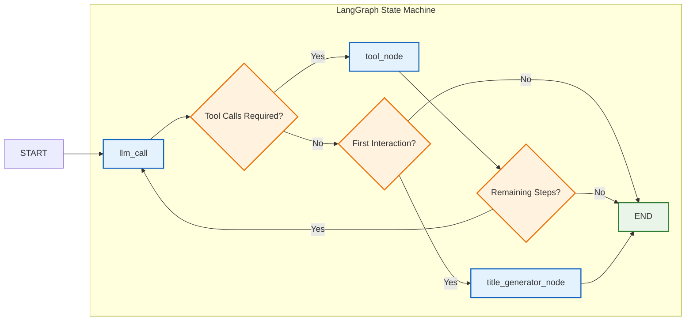
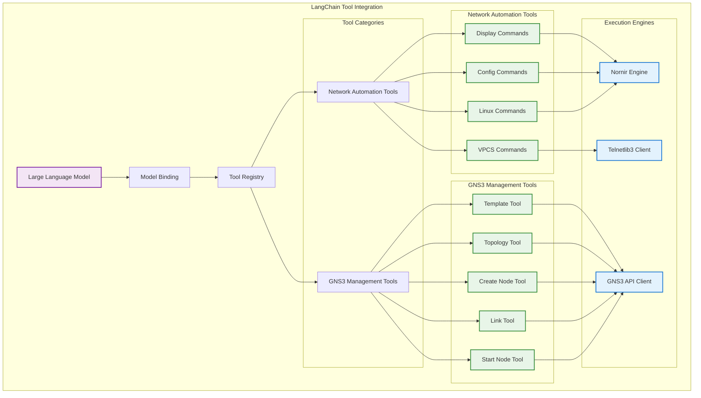
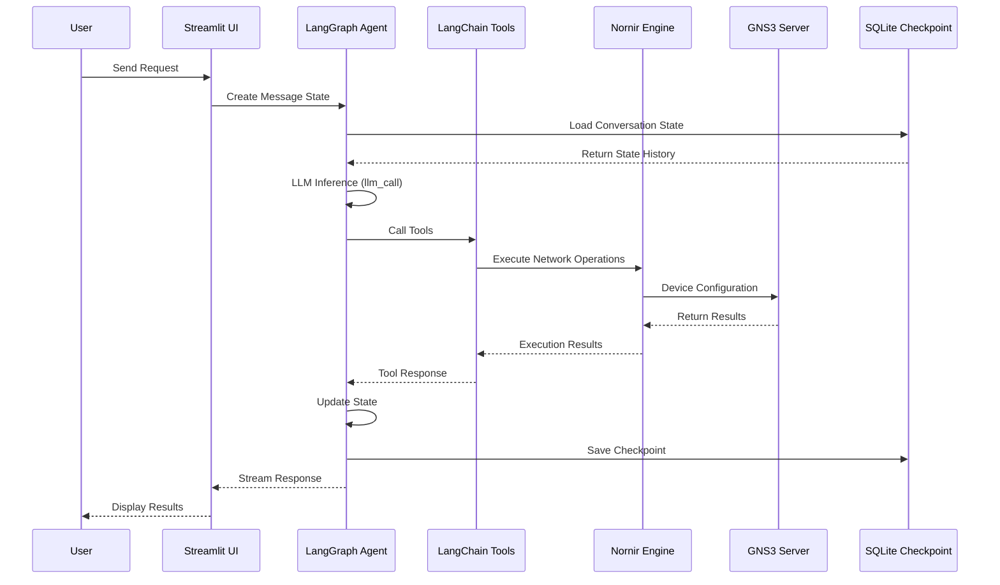

# Core Framework Detailed Design

## 1. LangGraph Intelligent Agent Framework

### State Management Architecture

The LangGraph framework implements a sophisticated state machine with the following components:

**MessagesState Class**:
- `messages`: Conversation history with cumulative updates using `operator.add`
- `llm_calls`: Counter for tracking LLM invocations
- `remaining_steps`: Automatically managed by LangGraph's RemainingSteps for recursion control
- `conversation_title`: Optional session title for identification

**Core Nodes**:
- **llm_call**: Handles LLM inference and decision-making with tool binding
- **tool_node**: Executes tool calls and manages observation responses
- **title_generator_node**: Generates conversation titles on first interaction

**Routing Logic**:
- **should_continue**: Determines workflow routing based on LLM responses and session state
- **recursion_limit_continue**: Prevents infinite loops with step limiting (minimum 4 steps required)

## 2. LangChain Tool Integration Framework

### Tool Implementation Details

**GNS3 Management Tools** (5 tools):
1. **GNS3TemplateTool**: Retrieves available node templates from GNS3 server
2. **GNS3TopologyTool**: Reads and analyzes network topology information
3. **GNS3CreateNodeTool**: Creates new network nodes in GNS3 projects
4. **GNS3LinkTool**: Establishes connections between network nodes
5. **GNS3StartNodeTool**: Manages node lifecycle (start/stop/restart)

**Network Automation Tools** (4 tools):
1. **ExecuteMultipleDeviceCommands**: Runs show/display commands on multiple devices
2. **ExecuteMultipleDeviceConfigCommands**: Applies configuration changes across devices
3. **VPCSMultiCommands**: Manages Virtual PC Simulator instances
4. **LinuxTelnetBatchTool**: Executes batch commands on Linux devices via Telnet

### Execution Engines

**Nornir Framework**:
- High-performance concurrent automation
- Netmiko integration for SSH/Telnet connectivity
- Thread pool execution for parallel operations
- Dynamic device inventory management

**Telnetlib3 Client**:
- Async Telnet operations for VPCS and Linux devices
- Concurrent command execution
- Connection pooling and management

**Custom GNS3 Client**:
- Enhanced gns3fy-based implementation
- RESTful API communication
- Project and topology management
- Real-time node control

## 3. Framework Data Flow Architecture

### Session Management and Persistence

**SQLite Checkpointing**:
- Conversation state persistence across sessions
- Thread-safe database operations for Streamlit
- Automatic state recovery and continuity
- Session history management

**Multi-Session Support**:
- Unique thread ID for each conversation
- Session title generation for identification
- Configurable session retention policies
- Real-time state synchronization

## 4. System Architecture Overview

### 7-Layer Architecture

1. **Presentation Layer**: Streamlit web interface with chat, settings, and help pages
2. **LangGraph Agent Framework**: State machine workflow with intelligent routing
3. **Tool Integration Layer**: 9 specialized tools for network automation
4. **Network Automation Framework**: Nornir-based concurrent execution engine
5. **GNS3 Integration Framework**: Custom client for simulator management
6. **Data Persistence Layer**: SQLite databases and logging systems
7. **Infrastructure Layer**: GNS3 server and network devices

### Technology Stack

**Core Frameworks**:
- **LangGraph**: State machine and agent orchestration
- **LangChain**: Tool integration and LLM abstraction
- **Streamlit**: Web UI framework
- **Nornir**: Network automation framework

**Network Libraries**:
- **Netmiko**: SSH/Telnet connectivity for network devices
- **Telnetlib3**: Async Telnet client implementation
- **Requests**: HTTP client for GNS3 API

**Data Management**:
- **SQLite**: Lightweight database for state persistence
- **Pydantic**: Data validation and serialization
- **Python-dotenv**: Environment configuration management

## 5. Technical Features and Advantages

### Framework Advantages

1. **LangGraph State Machine**: Reliable conversation flow control with error handling and recursion prevention
2. **LangChain Tool Ecosystem**: Unified tool calling interface with multi-provider LLM support
3. **Nornir Concurrent Framework**: High-performance parallel device operations with thread optimization
4. **Modular Design**: Clear separation of concerns with extensible architecture
5. **SQLite Persistence**: Robust state management with session continuity

### Cross-Platform Support

- **Windows**: Native Python environment or WSL support
- **macOS**: Native Python environment with full feature support
- **Linux**: Optimal performance with native Python environment

### Extensibility Design

**Plugin Architecture**:
- Easy addition of new network device types
- Custom tool development framework
- Modular LLM provider integration
- Extensible GNS3 client capabilities

**Multi-Model Support**:
- OpenAI (GPT models)
- Anthropic (Claude models)
- Google (Gemini models)
- AWS (Bedrock models)
- Ollama (local models)
- DeepSeek
- XAI (Grok models)

**API Abstraction**:
- Unified GNS3 operation interface
- Standardized device communication protocols
- Consistent error handling across tools
- Configurable timeout and retry mechanisms

## 6. Performance and Reliability

### Performance Features

- **Concurrent Execution**: Parallel device operations via Nornir thread pools
- **Async Operations**: Non-blocking Telnet communications
- **Streaming Responses**: Real-time user feedback during long operations
- **Efficient State Management**: Optimized SQLite operations with connection pooling

### Reliability Measures

- **Robust Error Handling**: Comprehensive exception management and recovery
- **Connection Management**: Timeout handling and automatic reconnection
- **State Persistence**: Automatic checkpointing and recovery mechanisms
- **Comprehensive Logging**: Detailed activity logs for troubleshooting
- **Graceful Degradation**: Fallback behaviors for service failures

## 7. Security and Scalability

### Security Features

- **API Key Management**: Secure credential storage via environment variables
- **Network Isolation**: Configurable access controls and network segmentation
- **GNS3 Integration**: Leverages GNS3's built-in security and permission system
- **Data Protection**: Local SQLite storage with optional encryption

### Scalability Considerations

**Horizontal Scaling**:
- Stateless agent design for load balancing
- Distributed checkpoint storage capability
- Microservice architecture readiness
- Container deployment support

**Vertical Scaling**:
- Configurable thread pools for resource optimization
- Memory-efficient state management
- Optimized database operations
- Resource monitoring and alerting

This comprehensive framework design provides a solid foundation for AI-powered network automation while maintaining flexibility for future enhancements and integrations.
