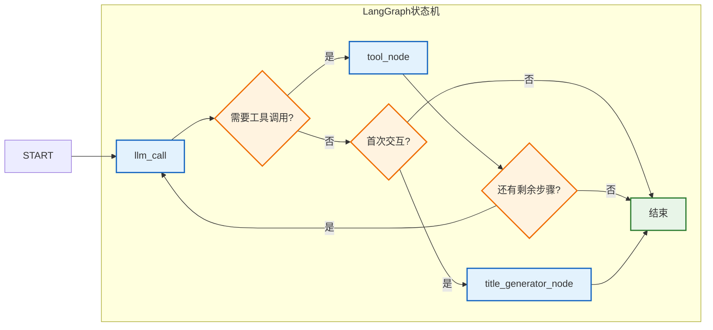
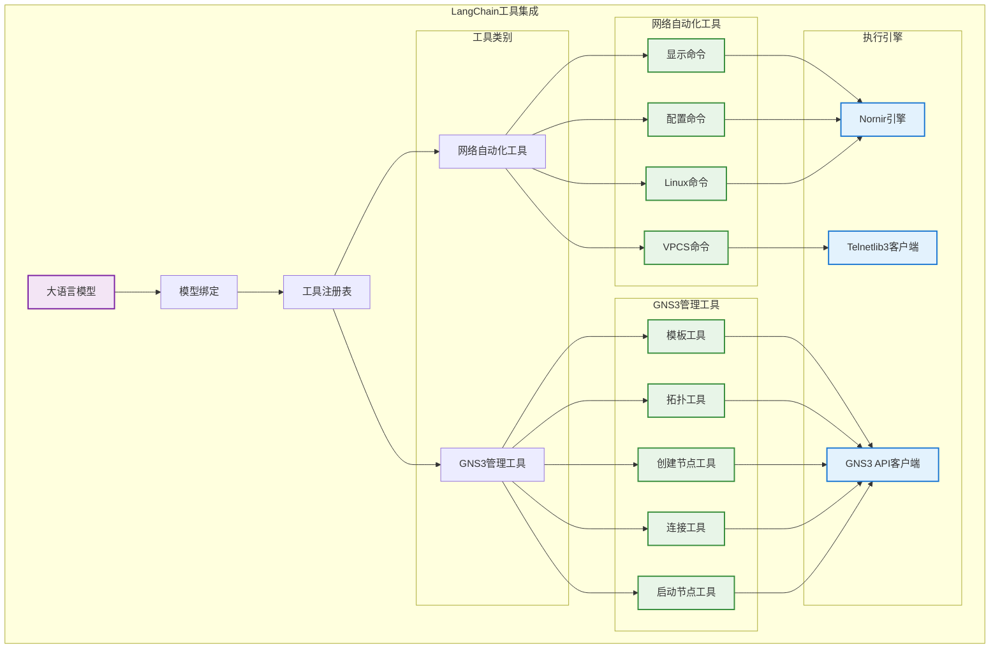
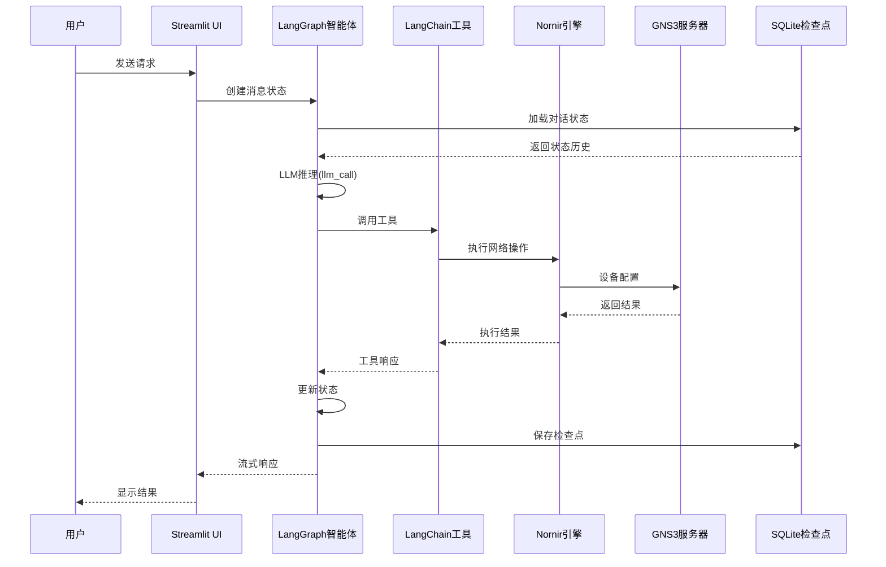

# 核心框架详细设计

## 1. LangGraph智能体框架

### 状态管理架构

LangGraph框架实现了一个复杂的状态机，包含以下组件：

**MessagesState类**：
- `messages`：使用`operator.add`进行累积更新的对话历史
- `llm_calls`：跟踪LLM调用的计数器
- `remaining_steps`：由LangGraph的RemainingSteps自动管理，用于递归控制
- `conversation_title`：用于标识的可选会话标题

**核心节点**：
- **llm_call**：处理LLM推理和决策，包含工具绑定
- **tool_node**：执行工具调用并管理观察响应
- **title_generator_node**：在首次交互时生成对话标题

**路由逻辑**：
- **should_continue**：根据LLM响应和会话状态确定工作流路由
- **recursion_limit_continue**：通过步骤限制防止无限循环（至少需要4个步骤）

## 2. LangChain工具集成框架

### 工具实现详情

**GNS3管理工具**（5个工具）：
1. **GNS3TemplateTool**：从GNS3服务器获取可用节点模板
2. **GNS3TopologyTool**：读取和分析网络拓扑信息
3. **GNS3CreateNodeTool**：在GNS3项目中创建新的网络节点
4. **GNS3LinkTool**：在网络节点之间建立连接
5. **GNS3StartNodeTool**：管理节点生命周期（启动/停止/重启）

**网络自动化工具**（4个工具）：
1. **ExecuteMultipleDeviceCommands**：在多个设备上运行显示/查看命令
2. **ExecuteMultipleDeviceConfigCommands**：在多个设备上应用配置更改
3. **VPCSMultiCommands**：管理虚拟PC模拟器实例
4. **LinuxTelnetBatchTool**：通过Telnet在Linux设备上执行批量命令

### 执行引擎

**Nornir框架**：
- 高性能并发自动化
- Netmiko集成，支持SSH/Telnet连接
- 线程池执行，实现并行操作
- 动态设备清单管理

**Telnetlib3客户端**：
- 用于VPCS和Linux设备的异步Telnet操作
- 并发命令执行
- 连接池和管理

**自定义GNS3客户端**：
- 基于gns3fy的增强实现
- RESTful API通信
- 项目和拓扑管理
- 实时节点控制

## 3. 框架数据流架构

### 会话管理和持久化

**SQLite检查点**：
- 跨会话的对话状态持久化
- Streamlit的线程安全数据库操作
- 自动状态恢复和连续性
- 会话历史管理

**多会话支持**：
- 每个对话的唯一线程ID
- 用于标识的会话标题生成
- 可配置的会话保留策略
- 实时状态同步

## 4. 系统架构概览

### 7层架构

1. **表示层**：包含聊天、设置和帮助页面的Streamlit Web界面
2. **LangGraph智能体框架**：具有智能路由的状态机工作流
3. **工具集成层**：9个用于网络自动化的专用工具
4. **网络自动化框架**：基于Nornir的并发执行引擎
5. **GNS3集成框架**：用于模拟器管理的自定义客户端
6. **数据持久层**：SQLite数据库和日志系统
7. **基础设施层**：GNS3服务器和网络设备

### 技术栈

**核心框架**：
- **LangGraph**：状态机和智能体编排
- **LangChain**：工具集成和LLM抽象
- **Streamlit**：Web UI框架
- **Nornir**：网络自动化框架

**网络库**：
- **Netmiko**：网络设备的SSH/Telnet连接
- **Telnetlib3**：异步Telnet客户端实现
- **Requests**：GNS3 API的HTTP客户端

**数据管理**：
- **SQLite**：用于状态持久化的轻量级数据库
- **Pydantic**：数据验证和序列化
- **Python-dotenv**：环境配置管理

## 5. 技术特性和优势

### 框架优势

1. **LangGraph状态机**：可靠的对话流控制，具有错误处理和递归预防
2. **LangChain工具生态**：统一的工具调用接口，支持多提供商LLM
3. **Nornir并发框架**：具有线程优化和的高性能并行设备操作
4. **模块化设计**：清晰的职责分离，具有可扩展的架构
5. **SQLite持久化**：具有会话连续性的健壮状态管理

### 跨平台支持

- **Windows**：原生Python环境或WSL支持
- **macOS**：具有完整功能支持的原生Python环境
- **Linux**：原生Python环境的最佳性能

### 可扩展性设计

**插件架构**：
- 轻松添加新的网络设备类型
- 自定义工具开发框架
- 模块化LLM提供商集成
- 可扩展的GNS3客户端功能

**多模型支持**：
- OpenAI（GPT模型）
- Anthropic（Claude模型）
- Google（Gemini模型）
- AWS（Bedrock模型）
- Ollama（本地模型）
- DeepSeek
- XAI（Grok模型）

**API抽象**：
- 统一的GNS3操作接口
- 标准化的设备通信协议
- 工具间一致的错误处理
- 可配置的超时和重试机制

## 6. 性能和可靠性

### 性能特性

- **并发执行**：通过Nornir线程池进行并行设备操作
- **异步操作**：非阻塞Telnet通信
- **流式响应**：长操作期间的实时用户反馈
- **高效的状态管理**：具有连接池优化的SQLite操作

### 可靠性措施

- **健壮的错误处理**：全面的异常管理和恢复
- **连接管理**：超时处理和自动重连
- **状态持久化**：自动检查点和恢复机制
- **全面的日志记录**：用于故障排除的详细活动日志
- **优雅降级**：服务故障的回退行为

## 7. 安全性和可扩展性

### 安全特性

- **API密钥管理**：通过环境变量安全存储凭据
- **网络隔离**：可配置的访问控制和网络分段
- **GNS3集成**：利用GNS3内置的安全和权限系统
- **数据保护**：本地SQLite存储，可选加密

### 可扩展性考虑

**水平扩展**：
- 用于负载平衡的无状态智能体设计
- 分布式检查点存储能力
- 微服务架构就绪
- 容器部署支持

**垂直扩展**：
- 用于资源优化的可配置线程池
- 内存高效的状态管理
- 优化的数据库操作
- 资源监控和告警

这个全面的框架设计为基于AI的网络自动化提供了坚实的基础，同时保持了对未来增强和集成的灵活性。
