```mermaid
graph TB
    %% Presentation Layer
    subgraph "Presentation Layer"
        StreamlitUI[Streamlit Web Interface]
        ChatInterface[Chat Interface]
        SettingsPage[Settings Page]
        HelpPage[Help Page]
        SessionManager[Session Management]
    end

    %% LangGraph Agent Framework
    subgraph "LangGraph Agent Framework"
        StateGraph[StateGraph Workflow]
        LLMNode[llm_call Node]
        ToolNode[tool_node Node]
        TitleNode[title_generator Node]
        %% Routing Logic
        ShouldContinueRouter[should_continue Router]
        RecursionRouter[recursion_limit_continue Router]
        %% State Management
        MessagesState[MessagesState]
        SQLiteCheckpoint[SQLite Checkpointer]
    end

    %% Tool Integration Layer
    subgraph "Tool Integration Layer"
        GNS3TemplateTool[GNS3 Template Tool]
        GNS3TopologyTool[GNS3 Topology Tool]
        GNS3CreateNodeTool[GNS3 Create Node Tool]
        GNS3LinkTool[GNS3 Link Tool]
        GNS3StartNodeTool[GNS3 Start Node Tool]
        ExecuteDisplayCommands[Execute Display Commands]
        ExecuteConfigCommands[Execute Config Commands]
        VPCSMultiCommands[VPCS Multi Commands]
        LinuxTelnetBatch[Linux Telnet Batch]
    end

    %% Network Automation Framework
    subgraph "Network Automation Framework"
        NornirEngine[Nornir Concurrent Engine]
        NetmikoConnector[Netmiko Connector]
        Telnetlib3Client[Telnetlib3 Client]
        DeviceInventory[Device Inventory]
        ThreadPool[Thread Pool Executor]
    end

    %% GNS3 Integration Framework
    subgraph "GNS3 Integration Framework"
        CustomGNS3Client[Custom GNS3 Client]
        GNS3Connector[GNS3 API Connector]
        ProjectManager[Project Manager]
        NodeManager[Node Manager]
        LinkManager[Link Manager]
        TopologyReader[Topology Reader]
    end

    %% Data Persistence Layer
    subgraph "Data Persistence Layer"
        SQLiteDB[(SQLite Database)]
        LogFiles[Log Files]
        ConfigFiles[Configuration Files]
        CheckpointDB[Checkpoint Database]
    end

    %% Infrastructure Layer
    subgraph "Infrastructure Layer"
        GNS3Server[GNS3 Server]
        NetworkDevices[Network Devices]
        VirtualMachines[Virtual Machines]
        NetworkTopology[Network Topology]
    end

    %% Data Flow Connections
    %% UI to Agent
    StreamlitUI --> ChatInterface
    ChatInterface --> StateGraph
    SettingsPage --> ConfigFiles
    SessionManager --> SQLiteCheckpoint
    %% LangGraph Internal Flow
    StateGraph --> LLMNode
    LLMNode --> ShouldContinueRouter
    ShouldContinueRouter --> ToolNode
    ShouldContinueRouter --> TitleNode
    ToolNode --> RecursionRouter
    RecursionRouter --> LLMNode
    TitleNode --> SQLiteCheckpoint
    %% State Management
    MessagesState --> StateGraph
    SQLiteCheckpoint --> MessagesState
    %% Tool Integration
    ToolNode --> GNS3TemplateTool
    ToolNode --> GNS3TopologyTool
    ToolNode --> GNS3CreateNodeTool
    ToolNode --> GNS3LinkTool
    ToolNode --> GNS3StartNodeTool
    ToolNode --> ExecuteDisplayCommands
    ToolNode --> ExecuteConfigCommands
    ToolNode --> VPCSMultiCommands
    ToolNode --> LinuxTelnetBatch
    %% Tools to Automation Framework
    ExecuteDisplayCommands --> NornirEngine
    ExecuteConfigCommands --> NornirEngine
    VPCSMultiCommands --> Telnetlib3Client
    LinuxTelnetBatch
    Telnetlib3Client
    %% Automation Framework Internal
    NornirEngine --> NetmikoConnector
    NornirEngine --> DeviceInventory
    NornirEngine
    ThreadPool
    Telnetlib3Client --> DeviceInventory
    %% Tools to GNS3 Framework
    GNS3TemplateTool --> CustomGNS3Client
    GNS3TopologyTool --> CustomGNS3Client
    GNS3CreateNodeTool --> CustomGNS3Client
    GNS3LinkTool --> CustomGNS3Client
    GNS3StartNodeTool --> CustomGNS3Client
    %% GNS3 Framework Internal
    CustomGNS3Client --> GNS3Connector
    CustomGNS3Client --> ProjectManager
    CustomGNS3Client --> NodeManager
    CustomGNS3Client --> LinkManager
    CustomGNS3Client --> TopologyReader
    %% Persistence Connections
    SQLiteCheckpoint --> CheckpointDB
    StateGraph --> LogFiles
    StreamlitUI --> ConfigFiles
    %% Infrastructure Connections
    GNS3Connector --> GNS3Server
    NetmikoConnector --> NetworkDevices
    Telnetlib3Client
    NetworkDevices
    TopologyReader --> NetworkTopology
    NodeManager --> VirtualMachines

    %% Style Definitions
    classDef presentation fill:#e3f2fd,stroke:#1565c0,stroke-width:3px
    classDef agent fill:#f3e5f5,stroke:#7b1fa2,stroke-width:3px
    classDef tools fill:#e8f5e8,stroke:#2e7d32,stroke-width:2px
    classDef automation fill:#fff3e0,stroke:#ef6c00,stroke-width:2px
    classDef gns3 fill:#fce4ec,stroke:#c2185b,stroke-width:2px
    classDef persistence fill:#f1f8e9,stroke:#689f38,stroke-width:2px
    classDef infrastructure fill:#e0f2f1,stroke:#00695c,stroke-width:2px
    class StreamlitUI,ChatInterface,SettingsPage,HelpPage,SessionManager presentation
    class StateGraph,LLMNode,ToolNode,TitleNode,ShouldContinueRouter,RecursionRouter,MessagesState,SQLiteCheckpoint agent
    class GNS3TemplateTool,GNS3TopologyTool,GNS3CreateNodeTool,GNS3LinkTool,GNS3StartNodeTool,ExecuteDisplayCommands,ExecuteConfigCommands,VPCSMultiCommands,LinuxTelnetBatch tools
    class NornirEngine,NetmikoConnector,Telnetlib3Client,DeviceInventory,ThreadPool automation
    class CustomGNS3Client,GNS3Connector,ProjectManager,NodeManager,LinkManager,TopologyReader gns3
    class SQLiteDB,LogFiles,ConfigFiles,CheckpointDB persistence
    class GNS3Server,NetworkDevices,VirtualMachines,NetworkTopology infrastructure
	LinuxTelnetBatch --- NornirEngine
	ProjectManager --- GNS3Server
	LinkManager --- NetworkTopology
	Telnetlib3Client --- ThreadPool
	ThreadPool --- NetworkDevices
	DeviceInventory
	TopologyReader
	CheckpointDB --- SQLiteDB
	subGraph2
	LogFiles
```

# GNS3 Copilot System Architecture

## Overview

GNS3 Copilot is an AI-powered network automation assistant that integrates with GNS3 network simulator to provide intelligent network management and automation capabilities. The system uses a multi-layered architecture with clear separation of concerns, enabling scalable and maintainable network automation solutions.

## Architecture Layers

### 1. Presentation Layer

**Streamlit Web Interface**: Modern web-based UI providing intuitive interaction with the system
- **Chat Interface**: Real-time conversational interface for natural language interaction
- **Settings Page**: Configuration management for LLM providers, GNS3 connections, and system parameters
- **Help Page**: Documentation and user guidance
- **Session Management**: Multi-session support with conversation history and persistence

### 2. LangGraph Agent Framework

**StateGraph Workflow**: Core AI agent orchestration using LangGraph
- **llm_call Node**: Handles LLM inference and decision making
- **tool_node Node**: Executes tool calls based on LLM decisions
- **title_generator Node**: Generates conversation titles for session identification
- **Routing Logic**: 
  - `should_continue`: Determines if tool execution or conversation continuation is needed
  - `recursion_limit_continue`: Prevents infinite loops with step limiting
- **State Management**:
  - `MessagesState`: Maintains conversation history and context
  - `SQLite Checkpointer`: Persistent state storage for conversation continuity

### 3. Tool Integration Layer

Eight specialized tools for comprehensive network automation:

**GNS3 Management Tools**:
- **GNS3 Template Tool**: Retrieves available node templates from GNS3 server
- **GNS3 Topology Tool**: Reads and analyzes network topology information
- **GNS3 Create Node Tool**: Creates new network nodes in GNS3 projects
- **GNS3 Link Tool**: Establishes connections between network nodes
- **GNS3 Start Node Tool**: Manages node lifecycle (start/stop/restart)

**Network Automation Tools**:
- **Execute Display Commands**: Runs show/display commands on multiple devices simultaneously
- **Execute Config Commands**: Applies configuration changes across multiple devices
- **VPCS Multi Commands**: Manages Virtual PC Simulator instances
- **Linux Telnet Batch**: Executes batch commands on Linux devices via Telnet

### 4. Network Automation Framework

**Nornir Concurrent Engine**: High-performance automation framework
- **Netmiko Connector**: SSH/Telnet connectivity for network devices
- **Telnetlib3 Client**: Async Telnet client for VPCS and Linux devices
- **Device Inventory**: Dynamic device discovery and management
- **Thread Pool Executor**: Concurrent execution for improved performance

### 5. GNS3 Integration Framework

**Custom GNS3 Client**: Enhanced GNS3 API client based on gns3fy
- **GNS3 API Connector**: RESTful API communication with GNS3 server
- **Project Manager**: GNS3 project lifecycle management
- **Node Manager**: Node configuration and control operations
- **Link Manager**: Network connection management
- **Topology Reader**: Network topology analysis and visualization

### 6. Data Persistence Layer

**SQLite Database**: Lightweight, reliable data storage
- **Checkpoint Database**: LangGraph conversation state persistence
- **Log Files**: Comprehensive system activity logging
- **Configuration Files**: System and user preference management

### 7. Infrastructure Layer

**Network Infrastructure**: Physical and virtual network components
- **GNS3 Server**: Network simulation and emulation platform
- **Network Devices**: Routers, switches, firewalls, and other network equipment
- **Virtual Machines**: Guest OS instances for network testing
- **Network Topology**: Logical and physical network layout

## Data Flow and Interactions

### Conversation Flow
1. User input enters through Streamlit Chat Interface
2. LangGraph StateGraph processes the input through llm_call node
3. Routing logic determines if tool execution is required
4. Tools execute appropriate network operations
5. Results flow back through the agent to the user interface
6. Conversation state is persisted via SQLite checkpoints

### Tool Execution Flow
1. LLM analyzes user intent and selects appropriate tools
2. Tool node executes selected tools with provided parameters
3. Network automation framework handles device connectivity
4. GNS3 integration framework manages simulator operations
5. Results are formatted and returned to the conversation

### Session Management
1. Each conversation session gets a unique thread ID
2. SQLite checkpoints maintain conversation state across sessions
3. Session history allows conversation continuation
4. Title generation provides meaningful session identification

## Technical Specifications

### Supported LLM Providers
- OpenAI (GPT models)
- Anthropic (Claude models)
- Google (Gemini models)
- AWS (Bedrock models)
- Ollama (local models)
- DeepSeek
- XAI (Grok models)

### Network Device Support
- Cisco IOS/IOS-XE/NX-OS
- Juniper Junos
- Arista EOS
- Linux systems
- VPCS (Virtual PC Simulator)
- Custom device types via Netmiko

### GNS3 Integration
- GNS3 Server 2.2+
- All node types (routers, switches, hosts, etc.)
- Project and topology management
- Real-time node control
- Link management

### Performance Features
- Concurrent device execution via Nornir
- Async Telnet operations
- Thread pool optimization
- Efficient state management
- Streaming responses for real-time interaction

## Security and Reliability

### Security Measures
- API key management through environment variables
- Secure credential storage
- Network isolation options
- Access control through GNS3 permissions

### Reliability Features
- Robust error handling and recovery
- Connection timeout management
- State persistence and recovery
- Comprehensive logging for troubleshooting
- Graceful degradation on service failures

## Scalability Considerations

### Horizontal Scaling
- Stateless agent design
- Distributed checkpoint storage
- Load balancer compatibility
- Microservice architecture potential

### Vertical Scaling
- Configurable thread pools
- Memory-efficient state management
- Optimized database operations
- Resource monitoring capabilities

This architecture provides a solid foundation for AI-powered network automation while maintaining flexibility for future enhancements and integrations.
