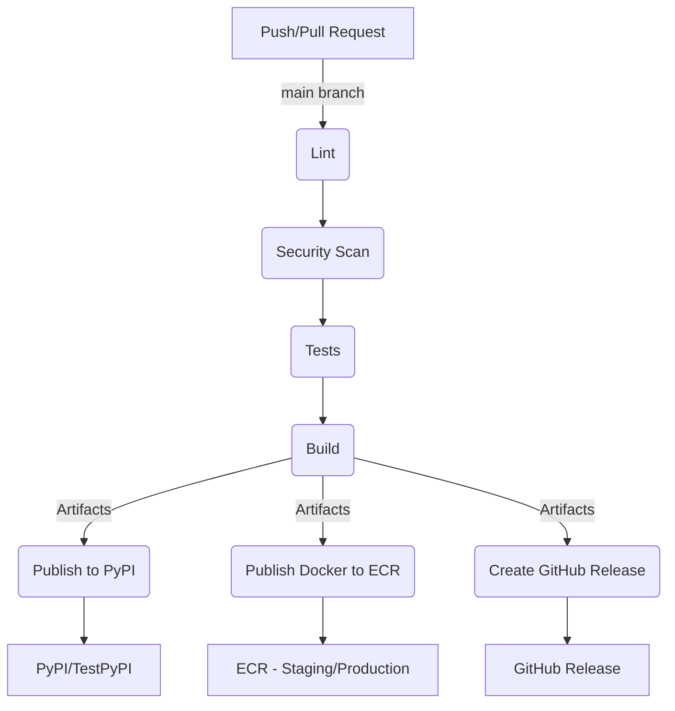

# Release Workflow Documentation

This document describes the CI/CD workflow for automatically building and publishing Python packages to PyPI and creating Docker images for deployment.

## Workflow Overview

The primary goal of this CI/CD pipeline is:

- Build and publish Python packages to PyPI (or TestPyPI).
- Create Docker images published to AWS ECR for use in the platform workflow.

## Workflow Flowchart

### 1. Code Quality Checks
- Ensures code formatting and consistency.
- Scans for security vulnerabilities.
- Runs automated tests.

### 2. Build and Publish
- Builds the Python package for distribution.
- Publishes the package to PyPI or TestPyPI for easy access by users.
- Creates and publishes a Docker image to AWS ECR, enabling the runtime to be integrated seamlessly within the platform.

### 3. Release Management
- Automatically generates GitHub releases to track package versions.

## Required Secrets and Configurations
Ensure the following secrets are configured:
- AWS account details (`PROD_AWS_ACCOUNT_ID`, `STAGE_AWS_ACCOUNT_ID`)
- AWS regions (`PROD_AWS_REGION`, `STAGE_AWS_REGION`)
- AWS IAM role name (`AWS_ROLE_NAME`)
- GitHub provided secrets (`GITHUB_TOKEN`)

