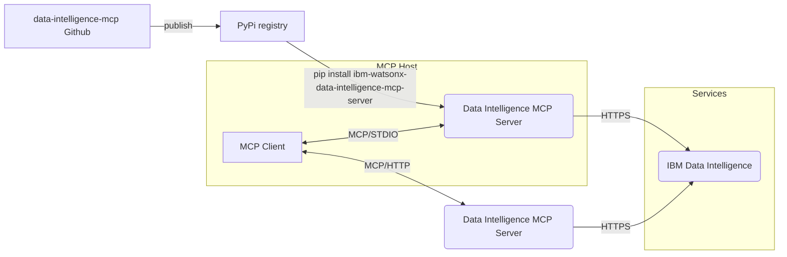

# Data Intelligence MCP Server

The IBM Data Intelligence MCP Server provides a modular and scalable implementation of the Model Context Protocol (MCP), purpose-built to integrate with IBM Data Intelligence services. It enables secure and extensible interaction between MCP clients and IBM’s data intelligence capabilities.

For the list of tools supported in this version and sample prompts, refer to [TOOLS_PROMPTS.md](TOOLS_PROMPTS.md)


Resources:
- [Integrating Claude with Watsonx Data Intelligence](https://community.ibm.com/community/user/blogs/ramakanta-samal/2025/10/01/integrating-claude-with-watsonx-data-intelligence) A step-by-step guide showing how Claude Desktop connects to the Data Intelligence MCP Server.
- [Watsonx Orchestrate + Data Intelligence](https://community.ibm.com/community/user/blogs/ramakanta-samal/2025/09/25/data) Demonstrates how Watsonx Orchestrate integrates with the MCP Server for automation.
- [Ibm Bob + Data Intelligence](https://community.ibm.com/community/user/blogs/xixiang-chen/2025/10/15/integrating-bob-with-watsonx-data-intelligence)  A step-by-step guide showing how IBM Bob connects to the Data Intelligence MCP Server.
---

## Table of Contents

1. [Quick Install - PyPI](#quick-install---pypi)
   - [Prerequisites](#prerequisites)
   - [Installation](#installation)
2. [Quick Install - uvx](#quick-install---uv)
   - [Prerequisites](#prerequisites)
   - [Installation](#installation)
3. [Server](#server)
   - [HTTP Mode](#http-mode)
   - [HTTPS Mode](#https-mode)
4. [Client Configuration](#client-configuration)
   - [Claude Desktop](#claude-desktop)
     - [stdio (Recommended for local setup)](#stdio-recommended-for-local-setup)
     - [http/https (Remote setup)](#httphttps-remote-setup)
   - [VS Code Copilot](#vs-code-copilot)
     - [stdio (Recommended for local setup)](#stdio-recommended-for-local-setup-1)
     - [http/https (Remote setup)](#httphttps-remote-setup-1)
   - [Watsonx Orchestrate](#watsonx-orchestrate)
   - [IBM Bob](#ibm-bob)
5. [Configuration](#configuration)
   - [Client Settings](#client-settings)
   - [SSL/TLS Configuration](#ssltls-configuration)

---

## Quick Install - PyPI

### Prerequisites
- Python 3.11 or higher
- Data Intelligence SaaS or CPD 5.2.1

### Installation

#### Standard Installation

Use pip/pip3 for standard installation:
```bash
pip install ibm-watsonx-data-intelligence-mcp-server
```
---
## Quick Install and run - uv
### Prerequisites
- uv [installation guide](https://docs.astral.sh/uv/getting-started/installation/)
- Data Intelligence SaaS or CPD 5.2.1

### Install and Running

stdio mode
```bash
uvx ibm-watsonx-data-intelligence-mcp-server --transport stdio
```

http mode
```bash
uvx ibm-watsonx-data-intelligence-mcp-server
```

---

## Server

If you have installed the ibm-watsonx-data-intelligence-mcp-server locally on your host machine and want to connect from a client such as Claude, Copilot, or LMStudio, you can use the stdio mode as described in the examples under the [Client Configuration](#client-configuration) section.

The server can also be configured and run in http/https mode.

Refer to [Client Settings](#client-settings) section on applicable environment variables for http mode. Update as required before starting the server below. Default DI_ENV_MODE is SaaS

### HTTP Mode
```bash
ibm-watsonx-data-intelligence-mcp-server --transport http --host 0.0.0.0 --port 3000
```

### HTTPS Mode
Refer to [SERVER_HTTPS.md](readme_guides/SERVER_HTTPS.md) for detailed HTTPS server configuration and setup.

### stdio Mode
When configuring the server through Claude, Copilot, or an MCP client in **stdio mode**, the server does not need to be started separately. The client will invoke the server directly using standard input/output.

---

## Client Configuration

### Claude Desktop

#### stdio (Recommended for local mcp server setup)

Prereq: uv [installation guide](https://docs.astral.sh/uv/getting-started/installation/)

Add the MCP server to your Claude Desktop configuration:
```json
{
  "mcpServers": {
    "wxdi-mcp-server": {
      "command": "uvx",
      "args": ["ibm-watsonx-data-intelligence-mcp-server", "--transport", "stdio"],
      "env": {
         "DI_SERVICE_URL": "https://api.dataplatform.cloud.ibm.com",
         "DI_APIKEY": "<data intelligence api key>",
         "DI_ENV_MODE": "SaaS",
         "LOG_FILE_PATH": "/tmp/di-mcp-server-logs"
      }
    }
  }
}
```

#### http/https (Remote setup)
If the MCP server is running on a local/remote server in http/https mode.

For Cloud SaaS:
```json
{
  "mcpServers": {
    "wxdi-mcp-server": {
      "url": "<url_to_mcp_server>",
      "type": "http",
      "headers": {
        "x-api-key": "your api key from cloud SaaS"
      }
    }
  }
}
```

For CPD:
```json
{
  "mcpServers": {
    "wxdi-mcp-server": {
      "url": "<url_to_mcp_server>",
      "type": "http",
      "headers": {
        "x-api-key": "your api key from cpd env",
        "username": "<user name from cpd env>"
      }
    }
  }
}
```

### VS Code Copilot

#### stdio (Recommended for local mcp server setup)

Prereq: uv [installation guide](https://docs.astral.sh/uv/getting-started/installation/)

Add the MCP server to your VS Code Copilot MCP configuration:
```json
{
  "servers": {
    "wxdi-mcp-server": {
      "command": "uvx",
      "args": ["ibm-watsonx-data-intelligence-mcp-server", "--transport", "stdio"],
      "env": {
         "DI_SERVICE_URL": "https://api.dataplatform.cloud.ibm.com",
         "DI_APIKEY": "<data intelligence api key>",
         "DI_ENV_MODE": "SaaS",
         "LOG_FILE_PATH": "/tmp/di-mcp-server-logs"
      }
    }
  }
}
```

#### http/https (Remote setup)
If the MCP server is running on a local/remote server in http/https mode.

For Cloud SaaS:
```json
{
  "servers": {
    "wxdi-mcp-server": {
      "url": "<url_to_mcp_server>",
      "type": "http",
      "headers": {
        "x-api-key": "your api key from cloud SaaS"
      }
    }
  }
}
```

For CPD:
```json
{
  "servers": {
    "wxdi-mcp-server": {
      "url": "<url_to_mcp_server>",
      "type": "http",
      "headers": {
        "x-api-key": "your api key for cpd env",
        "username": "<user name from cpd env>"
      }
    }
  }
}
```

### Watsonx Orchestrate

[Watsonx Orchestrate + Data Intelligence](https://community.ibm.com/community/user/blogs/ramakanta-samal/2025/09/25/data) blog post demonstrates how Watsonx Orchestrate integrates with the MCP Server for automation.

### IBM Bob
[IBM Bob + Data Intelligence](https://community.ibm.com/community/user/blogs/xixiang-chen/2025/10/15/integrating-bob-with-watsonx-data-intelligence) blog post demonstrates how IBM Bob integrates with the MCP Server for automation.

---
## Configuration

The MCP server can be configured using environment variables or a `.env` file. Copy `.env.example` to `.env` and modify the values as needed.

### Client Settings

Below client settings are common whether `http` or `stdio` mode

| Environment Variable | Default | Description |
|---------------------|---------|-------------|
| `DI_SERVICE_URL` | `None` | Base URL for Watsonx Data Intelligence instance. Example: api.dataplatform.cloud.ibm.com for SaaS and cluster url for CPD |
| `DI_ENV_MODE` | `SaaS` | Environment mode (`SaaS` or `CPD`) |
| `REQUEST_TIMEOUT_S` | `60` | HTTP request timeout in seconds |
| `LOG_FILE_PATH` | `None` | Logs will be written here if provided. Mandatory for `stdio` mode |
| `DI_CONTEXT` | `df` | Context for URLs returned from tool responses ( `df`, `cpdaas` for DI_ENV_MODE=SaaS; `df`, `cpd` for DI_ENV_MODE=CPD ). url will be appended by query parameter accordingly.`context=df` in the url for example  |

Below client settings are only applicable for `stdio` mode

| Environment Variable | Default | Description |
|---------------------|---------|-------------|
| `DI_APIKEY` | `None` | API key for authentication |
| `DI_USERNAME` | `None` | Username (required when using API key for CPD) |
| `DI_AUTH_TOKEN` | `None` | Bearer token for alternative to API key |

For `http/https` mode client can send below headers
| Headers | Default | Description |
|---------------------|---------|-------------|
| `x-api-key` | `None` | API key related to SaaS/CPD |
| `username` | `None` | username for CPD env If API key is provided |
| `authorization` | `None` | Bearer token alternative to apikey |

e.g:

```json
{
  "servers": {
    "wxdi-mcp-server": {
      "url": "<url_to_mcp_server>",
      "type": "http",
      "headers": {
        "x-api-key": "your api key from cloud SaaS/cpd"
      }
    }
  }
}
```

```json
{
  "servers": {
    "wxdi-mcp-server": {
      "url": "<url_to_mcp_server>",
      "type": "http",
      "headers": {
        "authorization": "Bearer token"
      }
    }
  }
}
```


### SSL/TLS Configuration

If running in CPD environment, you might need to configure SSL certificate for client connection. Please look into [SSL_CERTIFICATE_GUIDE.md](readme_guides/SSL_CERTIFICATE_GUIDE.md) for more details.
