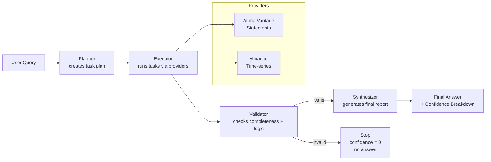

# Jasper Finance

> **Terminal-native autonomous financial research agent.**  
> Deterministic planning. Tool-grounded data. Validation gating. Human-trustworthy answers.

[](https://pypi.org/project/jasper-finance/)
[](https://www.python.org/downloads/)
[](LICENSE)
[](https://github.com/ApexYash11/jasper)

---

## Why Jasper exists

Financial AI is broken. Most tools:
- Hide their data sources
- Hallucinate numbers when APIs fail
- Produce confident-sounding answers backed by nothing
- Treat financial research like casual chat

Jasper takes a different approach.

**It treats a question as a job:**
1. **Plan** → decompose the question into structured research tasks
2. **Execute** → fetch real data from configured APIs (Alpha Vantage, yfinance)
3. **Validate** → check data completeness and financial logic
4. **Synthesize** → generate an answer **only if validation passes**

If validation fails, Jasper stops. No hallucinations. Confidence = 0.

---

## What it does / does NOT do

**Does:**
- Runs a transparent, multi-stage research workflow
- Fetches financial data from real APIs (no invention)
- Blocks answer synthesis when validation fails
- Reports a confidence breakdown (data coverage, data quality, inference strength)
- Provides interactive REPL for iterative research
- Deterministic LLM synthesis (temperature = 0, no randomness)
- Observable logs and progress display

**Does NOT:**
- Provide investment advice
- Place trades or connect to brokerages
- Guarantee data accuracy or third-party API reliability
- Make decisions for you (human review required)

---

## Key Features

🧠 **Planning Agent**  
Decomposes financial questions into ordered research tasks with specific goals.

⚙️ **Execution Engine**  
Runs tasks in sequence using tool adapters (Alpha Vantage, yfinance) to fetch statements and time-series data.

✅ **Validation Gate**  
Checks task completion, data sanity, and financial consistency. Blocks synthesis on failure.

📊 **Confidence Scoring**  
Reports: data coverage (%), data quality (%), inference strength (%), and overall confidence.

💬 **Interactive REPL**  
Ask financial questions one at a time; each query runs the full validation pipeline.

🎨 **Professional CLI**  
Live progress board during execution. Clean final report with metrics and answer.

---

## Installation

### pip

```bash
pip install jasper-finance
```

### uv

```bash
uv pip install jasper-finance
```

---

## Setup (< 2 minutes)

### 1. Get API Keys

**Required:**
- **OpenRouter API Key** — LLM synthesis  
  Get it: https://openrouter.ai/keys

**Optional (but recommended):**
- **Alpha Vantage API Key** — Financial statement data  
  Get it: https://www.alphavantage.co/

### 2. Set Environment Variables

Create a `.env` file in your working directory:

```bash
OPENROUTER_API_KEY=sk-or-v1-xxxxxxxxxxxxx
ALPHA_VANTAGE_API_KEY=demo
```

Or export them in your shell:

```bash
export OPENROUTER_API_KEY="sk-or-v1-xxxxxxxxxxxxx"
export ALPHA_VANTAGE_API_KEY="your-key"
```

### 3. Validate Setup

```bash
jasper doctor
```

Expected output:

```
Running Diagnostics...

✓ OPENROUTER_API_KEY is set
✓ ALPHA_VANTAGE_API_KEY is set
✓ Python 3.12 (requirement: ≥3.9)
✓ Core modules import successfully
✓ LLM initialization works

All checks passed! Jasper is ready to use.
```

---

## Quick Start

### Single Query

```bash
jasper ask "What is Apple's revenue trend over the last 3 years?"
```

Expected output:
```
Researching: What is Apple's revenue trend over the last 3 years?

[Progress board with live task updates]

Research Completed
─────────────────────────────────────────────────────────────────

Final Answer
─────────────────────────────────────────────────────────────────
Apple's revenue has shown consistent growth: FY2021 $365.8B → FY2022 $394.3B (+7.8%) → FY2023 $383.3B (-2.8%). 
The decline in FY2023 was driven by macroeconomic headwinds and lower iPhone sales.

Confidence Breakdown
─────────────────────────────────────────────────────────────────
Data Coverage:        0.85  (strong: 3 years of data fetched)
Data Quality:         0.92  (reliable: official financial statements)
Inference Strength:   0.90  (solid: consistent data patterns)
─────────────────────────────────────────────────────────────────
Overall Confidence:   0.79
```

### Interactive REPL

```bash
jasper interactive
```

You'll see a prompt:

```
Interactive Mode. Type 'exit' to quit.

? Enter Financial Query: Compare AAPL and MSFT operating margins for 2023
```

Each query runs the full workflow (Planning → Execution → Validation → Synthesis).  
If validation fails on any query, you'll see:

```
[bold red]Research Failed[/bold red]

Validation Issues:
  - Missing data for task: Fetch AAPL 10-K statement
  - Incomplete task: Fetch MSFT 10-K statement
```

---

## How the agents work

Jasper uses a modular, multi-agent architecture:



**Planner** — Analyzes your question and creates a structured plan with specific tasks.

**Executor** — Runs each task in sequence, calling data providers to fetch financial information.

**Validator** — Verifies that all tasks completed successfully, checks data consistency, and validates financial logic.

**Synthesizer** — If validation passes, uses the LLM to synthesize a final answer based on the data.

**Providers** — Adapters for Alpha Vantage (income statements, balance sheets, cash flow) and yfinance (stock prices, time-series).

---

## Example Workflows

### 1. Revenue Analysis

```bash
jasper ask "Summarize Apple's revenue trend over the last 4 quarters, highlight YoY growth"
```

Expected behavior:
- Planner creates tasks: Fetch last 4 quarters, calculate YoY growth
- Executor fetches from Alpha Vantage
- Validator checks data completeness
- Synthesizer generates a concise summary with metrics

### 2. Company Comparison

```bash
jasper ask "Compare Tesla and Ford: operating margins, net income, and debt levels for 2023"
```

Expected behavior:
- Planner breaks into: Fetch TSLA 10-K, Fetch F 10-K, compute metrics
- Executor parallelizes where possible
- Validator ensures both companies' data is present
- Synthesizer produces side-by-side comparison

### 3. Validation Failure (No Answer)

```bash
jasper ask "What is the revenue of a private company with no SEC filings?"
```

Expected output:
```
Research Failed

Validation Issues:
  - Missing data for task: Fetch financial statements
  - No provider returned data for the given ticker

Overall Confidence: 0.00
```

Why it fails: Private companies don't file with the SEC. Providers return no data. Validation detects this and blocks synthesis to prevent hallucination.

---

## Project Structure

```
jasper/
├── cli/
│   ├── main.py          # Typer app with ask, version, doctor, interactive commands
│   └── interface.py     # Rich terminal UI (banner, progress board, reports)
├── core/
│   ├── controller.py    # Orchestrates the 4-stage pipeline
│   ├── state.py         # Pydantic models for state management
│   ├── config.py        # Environment variable & config handling
│   └── llm.py           # LLM client setup (OpenRouter)
├── agent/
│   ├── planner.py       # Task decomposition
│   ├── executor.py      # Task execution against tools/providers
│   ├── validator.py     # Data validation & confidence scoring
│   └── synthesizer.py   # LLM-based answer synthesis
├── tools/
│   ├── financials.py    # Tool router
│   └── providers/       # API adapters (Alpha Vantage, yfinance)
└── tests/               # Smoke tests & regression tests
```

---

## Configuration & Recommended Models

### Environment Variables

| Variable | Required | Default | Purpose |
|----------|----------|---------|---------|
| `OPENROUTER_API_KEY` | ✅ Yes | — | LLM synthesis (OpenRouter) |
| `ALPHA_VANTAGE_API_KEY` | ❌ No | `demo` | Financial statement data |

### Recommended LLM Models (via OpenRouter)

For **speed**:
```bash
export MODEL="anthropic/claude-haiku-4.5"
```

For **quality**:
```bash
export MODEL="anthropic/claude-sonnet-4.5"
```

For **cost**:
```bash
export MODEL="x-ai/grok-4-fast"
```

Jasper uses temperature = 0 for deterministic synthesis regardless of model choice.

---

## Commands

```bash
jasper ask <query>          # Run a single financial research query
jasper interactive          # Start interactive REPL mode
jasper version              # Show version
jasper doctor               # Run setup diagnostics
jasper --help               # Show all commands
```

---

## Troubleshooting

### "OPENROUTER_API_KEY is required"

```bash
# Check if set
echo $OPENROUTER_API_KEY

# If empty, add to ~/.bashrc or ~/.zshrc:
export OPENROUTER_API_KEY="sk-or-v1-xxxxx"
source ~/.bashrc  # or ~/.zshrc
```

### "Command not found: jasper"

```bash
# Reinstall the package
pip install --upgrade jasper-finance

# Or use python module:
python -m jasper.cli.main ask "your query"
```

### "Missing data for task"

This usually means the provider (Alpha Vantage, yfinance) returned empty results. Check:
- Ticker symbol is correct (e.g., AAPL, not APPLE)
- For international stocks, use correct format (e.g., INFY.NS for Indian stocks)
- Alpha Vantage API key is valid (use `jasper doctor`)

### "Validation failed"

Jasper is intentionally conservative. If data is missing or incomplete, validation will block synthesis. This is by design—no hallucinations allowed.

---

## Project Status

**Version:** 0.4.0 (pre-1.0)

Jasper is in active development. While the core pipeline is stable, minor releases may include breaking changes while the major version is 0.

---

## Contributing

We welcome contributions! Here's how:

1. **Report bugs** → [Open an issue](https://github.com/ApexYash11/jasper/issues)
2. **Suggest features** → [Start a discussion](https://github.com/ApexYash11/jasper/discussions)
3. **Improve docs** → Submit PRs for README, guides, examples
4. **Fix issues** → Check [good first issues](https://github.com/ApexYash11/jasper/issues?q=label%3A"good+first+issue")

### Development Setup

```bash
git clone https://github.com/ApexYash11/jasper.git
cd jasper

python -m venv .venv
.venv/Scripts/activate  # Windows
# or: source .venv/bin/activate  # macOS/Linux

pip install -e .
python -m pytest tests/
```

Please keep PRs small and focused. Aim for one feature per PR.

---

## License

MIT — See [LICENSE](LICENSE) for details.

---

## Links

- **Source Code** → https://github.com/ApexYash11/jasper
- **Issue Tracker** → https://github.com/ApexYash11/jasper/issues
- **PyPI Package** → https://pypi.org/project/jasper-finance/
- **OpenRouter Docs** → https://openrouter.ai/docs
- **Alpha Vantage API** → https://www.alphavantage.co/

---

**Built for analysts who demand transparency.**
