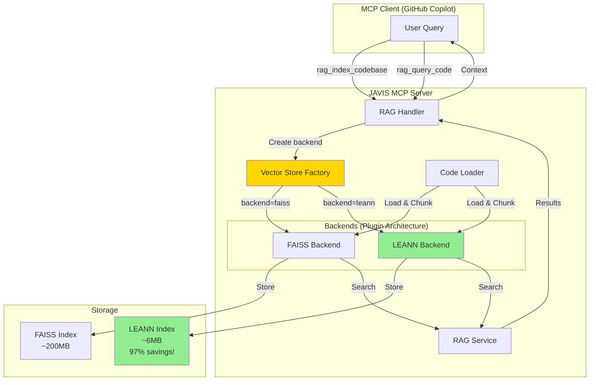

## Key Points:

1. **Factory Pattern**: `VectorStoreFactory` creates the right backend
2. **Plugin Architecture**: Easy to add more backends (ChromaDB, Qdrant, etc.)
3. **Backward Compatible**: FAISS still works, LEANN is optional
4. **Storage Savings**: LEANN uses 97% less storage
5. **Same Interface**: Both backends implement same methods

## Data Flow:

### Indexing:
```
User → RAG Handler → Factory → Backend (FAISS/LEANN) → Storage
                              ↑
                        Code Loader
```

### Querying:
```
User → RAG Handler → Backend → RAG Service → Results → User
```

## Environment Variables:

```bash
RAG_BACKEND=leann     # Choose backend (faiss or leann)
RAG_MODE=retrieval_only  # Choose mode (retrieval_only or full_rag)
```
