<p align="center">
  
</p>

<h1 align="center">JIRA Assistant Skills</h1>

<table align="center">
<tr>
<td align="center">
<h2>10x</h2>
<sub>More context-efficient<br>than MCP servers</sub>
</td>
<td align="center">
<h2>14</h2>
<sub>Specialized skills<br>one conversation</sub>
</td>
<td align="center">
<h2>245</h2>
<sub>Production-ready<br>Python scripts</sub>
</td>
<td align="center">
<h2>0</h2>
<sub>JQL syntax<br>to memorize</sub>
</td>
</tr>
</table>

<p align="center">
  <a href="https://pypi.org/project/jira-assistant-skills-lib/"></a>
  
  
  
  
  
</p>

<p align="center">
  <strong>Natural language JIRA automation for Claude Code</strong><br>
  <sub>From sprint planning to incident response—14 skills, 245 scripts, zero JQL memorization.</sub>
</p>

<div align="center">

```
┌───────────────────────────────────────────────────────────────┐
│ You: "What's blocking the Q4 release?"                        │
├───────────────────────────────────────────────────────────────┤
│ Claude: Analyzing 147 issues across 3 projects...             │
│                                                               │
│ Found 4 blockers:                                             │
│ • PLATFORM-234: API rate limiting (blocked 12 issues)         │
│ • MOBILE-567: iOS signing certificate expired                 │
│ • WEB-890: Pending security review                            │
│ • INFRA-123: Database migration not scheduled                 │
│                                                               │
│ Recommended actions:                                          │
│ 1. Escalate PLATFORM-234 to @api-team (highest impact)        │
│ 2. MOBILE-567 can be resolved by @devops today                │
│ 3. WEB-890 needs @security-lead approval                      │
└───────────────────────────────────────────────────────────────┘
```

</div>

<p align="center">
  <a href="#quick-start"><strong>Get Started</strong></a> •
  <a href="#skills-overview">Skills</a> •
  <a href="#who-is-this-for">Use Cases</a> •
  <a href="#architecture">Architecture</a>
</p>

---

## The Difference

<table>
<tr>
<td width="50%">

### ❌ The JQL Way
```jql
project = PROJ AND
status IN ("To Do", "In Progress") AND
assignee = currentUser() AND
sprint IN openSprints() AND
priority IN (High, Highest)
ORDER BY priority DESC, created ASC
```
*Hope you remembered the syntax...*

</td>
<td width="50%">

### ✅ The Natural Way
```
"Show my high priority sprint work"
```
*Just ask.*

</td>
</tr>
</table>

### Time Saved

| Task | Traditional JIRA | JIRA Assistant | Saved |
|------|------------------|----------------|-------|
| Find my open bugs | 45 seconds | 5 seconds | 89% |
| Create sprint + add stories | 3 minutes | 15 seconds | 92% |
| Log time on 5 issues | 2 minutes | 20 seconds | 83% |
| Check what's blocking release | 5 minutes | 10 seconds | 97% |
| Bulk close 20 resolved issues | 4 minutes | 30 seconds | 88% |

**Typical developer:** Save 30+ minutes per week.
**Team of 8:** Reclaim 31 work days per year.

---

## Quick Start

### 1. Clone the Repository

```bash
git clone https://github.com/grandcamel/jira-assistant-skills.git
cd jira-assistant-skills
```

### 2. Install Dependencies

```bash
pip install jira-assistant-skills-lib
pip install -e .  # Install the jira-as CLI
```

### 3. Get API Token

1. Visit [Atlassian API Tokens](https://id.atlassian.com/manage-profile/security/api-tokens)
2. Create token → Copy it

### 4. Configure

```bash
export JIRA_API_TOKEN="your-token"
export JIRA_EMAIL="you@company.com"
export JIRA_SITE_URL="https://company.atlassian.net"
```

### 5. Start Using

```bash
# Just ask Claude
claude "Show me my open issues"
claude "Create a bug: Login button not working"
claude "What's blocking the release?"

# Or use the CLI directly
jira-as issue get PROJ-123
jira-as search query "project = PROJ AND status = Open"
jira-as time log PROJ-123 2h
```

**That's it.** Claude now has full JIRA access via natural language, and you can use the `jira-as` CLI directly from your terminal.

<p align="center">
  <a href="docs/quick-start.md"><strong>Full Setup Guide →</strong></a>
</p>

---

## Setup (Assistant Skills)

If you're using the [Assistant Skills](https://github.com/grandcamel/assistant-skills) plugin system, run the setup wizard:

```bash
/assistant-skills-setup
```

This configures:
- Shared Python venv at `~/.assistant-skills-venv/`
- Required dependencies from `requirements.txt`
- Environment variables (prompts you to configure Jira credentials)
- `claude-as` shell function for running Claude with dependencies

After setup, use `claude-as` instead of `claude`:
```bash
claude-as  # Runs Claude with Assistant Skills venv activated
```

### Environment Variables

| Variable | Required | Description |
|----------|----------|-------------|
| `JIRA_SITE_URL` | Yes | Jira instance base URL (e.g., `https://company.atlassian.net`) |
| `JIRA_EMAIL` | Yes | Atlassian account email for authentication |
| `JIRA_API_TOKEN` | Yes | Atlassian API token ([generate here](https://id.atlassian.com/manage-profile/security/api-tokens)) |
| `JIRA_PROFILE` | No | Configuration profile for multi-instance support (defaults to `production`) |

### Getting Your API Token

1. Go to [Atlassian API Tokens](https://id.atlassian.com/manage-profile/security/api-tokens)
2. Click "Create API token"
3. Give it a descriptive label (e.g., "Claude Code Jira")
4. Copy the token and add it to your shell config:
   ```bash
   export JIRA_API_TOKEN="your-token-here"
   export JIRA_EMAIL="you@company.com"
   export JIRA_SITE_URL="https://company.atlassian.net"
   ```

---

## What You Can Do

```mermaid
flowchart LR
    subgraph Input["💬 You Say"]
        Q1["Show my high<br/>priority bugs"]
        Q2["Create a story<br/>for login redesign"]
        Q3["What's blocking<br/>the release?"]
    end

    subgraph Processing["🤖 Claude Understands"]
        P1["JQL: assignee=currentUser()<br/>AND type=Bug<br/>AND priority>=High"]
        P2["create_issue.py<br/>--type Story<br/>--summary '...'"]
        P3["Search linked blockers<br/>Traverse dependency tree"]
    end

    subgraph Output["✅ You Get"]
        R1["📋 List of 7 bugs<br/>with details"]
        R2["🎫 PROJ-456 created<br/>ready to refine"]
        R3["🔍 3 blockers found<br/>with recommendations"]
    end

    Q1 --> P1 --> R1
    Q2 --> P2 --> R2
    Q3 --> P3 --> R3
```



<details>
<summary><strong>📖 Example: Sarah's Monday Morning</strong></summary>

**Before JIRA Assistant (15 minutes)**
1. Open browser, navigate to JIRA (2 min)
2. Find the right board (1 min)
3. Set up filters (3 min)
4. Check each issue status (5 min)
5. Look up sprint velocity (2 min)
6. Copy issues to notes (2 min)

**After JIRA Assistant (45 seconds)**
> Sarah: "What's my sprint work and yesterday's progress?"

Claude provides a formatted summary with everything she needs.

**Time saved:** 14 minutes per standup × 250 days = **58 hours/year**

</details>

---

## Skills Overview

| Skill | Purpose | Example Command |
|-------|---------|-----------------|
| **jira-assistant** | Meta-skill router | Routes to the right skill automatically |
| **jira-issue** | Issue CRUD | "Create a bug for login failure" |
| **jira-lifecycle** | Workflow transitions | "Move PROJ-123 to In Progress" |
| **jira-search** | JQL & filters | "Show my open issues" |
| **jira-collaborate** | Comments & watchers | "Add comment to PROJ-123" |
| **jira-agile** | Sprints & epics | "Create sprint for next week" |
| **jira-relationships** | Issue linking | "What's blocking PROJ-123?" |
| **jira-time** | Time tracking | "Log 2 hours on PROJ-123" |
| **jira-jsm** | Service desk | "Show my support queue" |
| **jira-bulk** | Bulk operations | "Close all resolved issues" |
| **jira-dev** | Git integration | "Generate branch name for PROJ-123" |
| **jira-fields** | Field discovery | "Show custom fields in PROJ" |
| **jira-ops** | Cache & utilities | "Clear JIRA cache" |
| **jira-admin** | Project admin | "List project permissions" |

<p align="center">
  <a href="docs/scripts-reference.md"><strong>Full Scripts Reference →</strong></a>
</p>

---

## Who Is This For?

<details>
<summary><strong>👨‍💻 Developers</strong> — Never leave your terminal</summary>

**Stop context-switching to JIRA.**

You're in your IDE. You just fixed a bug. Now you need to update JIRA.

```bash
claude "Close PROJ-123 with 'Fixed null pointer', log 30 minutes"
# 3 seconds, never left your terminal
```

### Developer Cheat Sheet

| Task | Command |
|------|---------|
| Check my work | `"What's assigned to me in the current sprint?"` |
| Start a task | `"Start progress on PROJ-123"` |
| Log time | `"Log 2 hours on PROJ-123: Implemented auth fix"` |
| Mark done | `"Close PROJ-123 with resolution Fixed"` |
| Create bug | `"Create high priority bug: Login fails on Safari"` |
| Get branch name | `"Generate branch name for PROJ-123"` |

**Time saved:** ~45 min/week

</details>

<details>
<summary><strong>👥 Team Leads</strong> — Team visibility in seconds</summary>

**See your team's work without meetings.**

### Morning Check-in (60 Seconds)
```
"Show sprint progress for Team Alpha"
"Who has the most work in progress?"
"What's blocked and why?"
```

### Sprint Planning Support
```
"Show unestimated stories in backlog"
"What's the team velocity for last 3 sprints?"
"Move top 10 priority items to Sprint 42"
```

### Query Templates

| Need | Command |
|------|---------|
| Blockers | `"Show blockers across all team projects"` |
| Workload | `"Who's overloaded? Show assignment counts"` |
| Progress | `"What moved to Done yesterday?"` |
| Export | `"Export this sprint's completed work to CSV"` |

**Time saved:** ~4 hours/week

</details>

<details>
<summary><strong>🏃 Scrum Masters</strong> — Run ceremonies, not admin</summary>

**Focus on facilitation, not JIRA navigation.**

### Sprint Planning (Before)
```
"Show prioritized backlog with estimates"
"What dependencies exist in top 20 items?"
"Create Sprint 43 starting next Monday"
```

### Daily Standup (During)
```
"Show yesterday's progress for Sprint 43"
"What's blocked right now?"
"Who has items without updates > 24 hours?"
```

### Sprint Review (After)
```
"Show completed items in Sprint 43 by epic"
"Export sprint results for stakeholder presentation"
"What carried over from last sprint?"
```

**Time saved:** ~4.5 hours/sprint

</details>

<details>
<summary><strong>📊 Product Managers</strong> — Self-serve product data</summary>

**Focus on product, not project administration.**

### Roadmap Management
```
"Show all epics for Q1 with completion percentage"
"What features shipped last month?"
"Create epic: User Authentication Redesign"
```

### Backlog Grooming
```
"Show stories without acceptance criteria"
"What's been in backlog > 90 days?"
"Prioritize FEAT-123 above FEAT-124"
```

### Stakeholder Communication
```
"Export release notes for v2.1"
"Summarize what's shipping this sprint"
"Show bug fix rate for last quarter"
```

**Time saved:** ~5 hours/week

</details>

<details>
<summary><strong>🔧 IT/Ops</strong> — Incident response accelerated</summary>

**Incident response without the JIRA dance.**

### Incident Creation (10 Seconds)
```
"Create urgent incident: Production database unreachable"
```
Creates P1 with proper labels and assigns to on-call.

### Incident Management
```
"Show all open incidents by severity"
"Link INCIDENT-123 to root cause INFRA-456"
"Escalate INCIDENT-123 to @platform-team"
```

### Service Desk (JSM)
```
"Show my queue sorted by SLA breach time"
"Resolve REQ-789 with 'Password reset completed'"
"Add customer to watchers on REQ-789"
```

**Time saved:** Minutes per incident

</details>

---

## Architecture

```mermaid
flowchart TD
    U["👤 User Request"] --> CC["🤖 Claude Code"]
    CC --> JA["📋 jira-assistant<br/>Meta-Router"]

    JA -->|"Create bug"| JI["jira-issue"]
    JA -->|"Move to Done"| JL["jira-lifecycle"]
    JA -->|"Find issues"| JS["jira-search"]
    JA -->|"Add comment"| JC["jira-collaborate"]
    JA -->|"Link issues"| JR["jira-relationships"]
    JA -->|"Sprint planning"| JAG["jira-agile"]
    JA -->|"Log time"| JT["jira-time"]
    JA -->|"Bulk update"| JB["jira-bulk"]
    JA -->|"Service request"| JSM["jira-jsm"]

    JI & JL & JS & JC & JR & JAG & JT & JB & JSM --> SH["🔧 Shared Library"]
    SH --> API["🔌 JIRA REST API"]
    API --> JIRA[("☁️ JIRA Cloud")]
```



### Technical Highlights

- **Shared Library Pattern** — DRY architecture with common utilities
- **4-Layer Error Handling** — Validation → API → Retry → User messages
- **Profile-Based Config** — Multi-instance support built-in
- **ADF Support** — Native Atlassian Document Format handling
- **Exponential Backoff** — Automatic retry on rate limits

---

## Quality & Security

### Test Coverage

| Category | Tests | Description |
|----------|------:|-------------|
| Core Skills | 850+ | Issue, search, lifecycle, collaborate, agile, relationships, time |
| JSM Integration | 150+ | Service desks, SLAs, approvals, knowledge base |
| Advanced Skills | 300+ | Bulk ops, dev workflows, fields, cache, admin |
| Live Integration | 340+ | End-to-end tests against real JIRA instances |
| **Total** | **1644** | **All passing** |

> Tests run against live JIRA Cloud instances to ensure real-world reliability.

### Security

- **No hardcoded secrets** — API tokens stored in environment variables or gitignored files
- **HTTPS-only connections** — All JIRA API requests enforced over secure transport
- **Input validation** — All user data validated before API calls
- **Credential isolation** — `settings.local.json` gitignored by default
- **No credential logging** — Sensitive data excluded from logs and error output

---

## Try It

[](https://codespaces.new/grandcamel/jira-assistant-skills)

One-click cloud environment with all dependencies pre-installed.

---

## Documentation

| Resource | Description |
|----------|-------------|
| [Quick Start Guide](docs/quick-start.md) | Get up and running in 5 minutes |
| [Configuration Guide](docs/configuration.md) | Multi-profile setup and options |
| [Scripts Reference](docs/scripts-reference.md) | Complete CLI documentation |
| [Troubleshooting](docs/troubleshooting.md) | Common issues and solutions |

### Need Help?

- 💬 [GitHub Discussions](https://github.com/grandcamel/jira-assistant-skills/discussions)
- 🐛 [Report Issues](https://github.com/grandcamel/jira-assistant-skills/issues)

---

## E2E Testing

### Run E2E Tests

E2E tests validate the plugin with the Claude Code CLI:

```bash
# Requires ANTHROPIC_API_KEY
./scripts/run-e2e-tests.sh           # Docker
./scripts/run-e2e-tests.sh --local   # Local
```

See [tests/e2e/README.md](tests/e2e/README.md) for details.

### Sandboxed Container Testing

Run tests with restricted tool access for safe demos and focused testing:

```bash
cd plugins/jira-assistant-skills/skills/jira-assistant/tests

# Safe demo mode (view/search only)
./run_sandboxed.sh --profile read-only

# JQL-focused testing
./run_sandboxed.sh --profile search-only

# Issue CRUD only
./run_sandboxed.sh --profile issue-only
```

| Profile | Use Case | What's Allowed |
|---------|----------|----------------|
| `read-only` | Safe demos, evaluations | View issues, search, list fields |
| `search-only` | JQL training | Search queries only |
| `issue-only` | CRUD workshops | Issue operations only |
| `full` | Complete testing | All operations |

---

## Contributing

Contributions are welcome! See our [Contributing Guide](CONTRIBUTING.md).

```bash
# Clone the repository
git clone https://github.com/grandcamel/jira-assistant-skills.git
cd jira-assistant-skills

# Install dependencies and CLI
pip install jira-assistant-skills-lib>=0.1.5 pytest pytest-asyncio
pip install -e .  # Install CLI in editable mode

# Run tests (uses root pytest.ini configuration)
pytest plugins/jira-assistant-skills/skills/*/tests/*.py -v

# Verify CLI is working
jira-as --version
jira-as --help
```

---

## Roadmap

- [x] Core JIRA operations (v1.0)
- [x] Agile workflow support (v1.1)
- [x] Service Management (v1.2)
- [x] Bulk operations (v1.3)
- [ ] GitHub integration enhancements
- [ ] Slack notifications
- [ ] Custom workflow templates

---

## License

This project is licensed under the MIT License — see the [LICENSE](LICENSE) file for details.

---

<p align="center">
  <strong>Stop clicking through JIRA. Start talking to it.</strong>
  <br>
  <sub>Built for Claude Code by developers who were tired of memorizing JQL.</sub>
</p>
