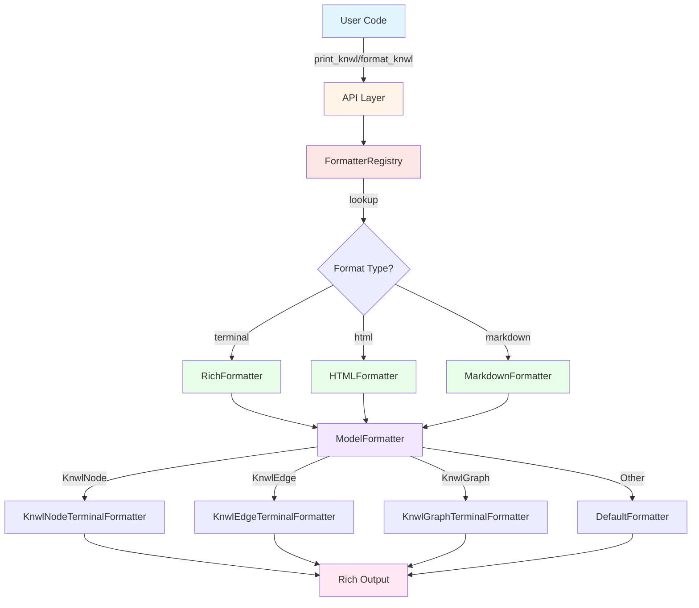
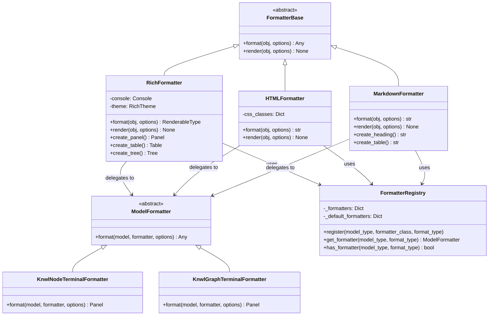
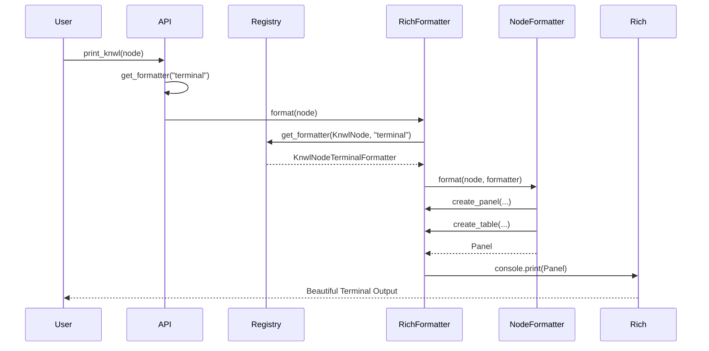
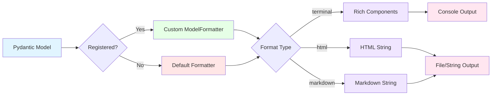
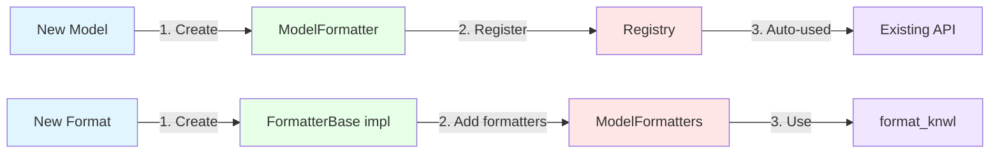
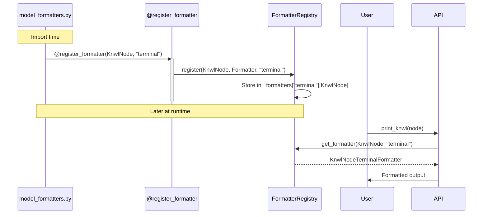

# Knwl Formatting System Architecture

## Component Diagram

```mermaid
graph TD
    A[User Code] -->|print_knwl/format_knwl| B[API Layer]
    B --> C[FormatterRegistry]
    C -->|lookup| D{Format Type?}
    
    D -->|terminal| E[RichFormatter]
    D -->|html| F[HTMLFormatter]
    D -->|markdown| G[MarkdownFormatter]
    
    E --> H[ModelFormatter]
    F --> H
    G --> H
    
    H -->|KnwlNode| I[KnwlNodeTerminalFormatter]
    H -->|KnwlEdge| J[KnwlEdgeTerminalFormatter]
    H -->|KnwlGraph| K[KnwlGraphTerminalFormatter]
    H -->|Other| L[DefaultFormatter]
    
    I --> M[Rich Output]
    J --> M
    K --> M
    L --> M
    
    style A fill:#e1f5ff
    style B fill:#fff4e6
    style C fill:#ffe6e6
    style E fill:#e6ffe6
    style F fill:#e6ffe6
    style G fill:#e6ffe6
    style H fill:#f0e6ff
    style M fill:#ffe6f0
```

## Class Diagram

```mermaid
classDiagram
    class FormatterBase {
        <<abstract>>
        +format(obj, options) Any
        +render(obj, options) None
    }
    
    class ModelFormatter {
        <<abstract>>
        +format(model, formatter, options) Any
    }
    
    class FormatterRegistry {
        -_formatters: Dict
        -_default_formatters: Dict
        +register(model_type, formatter_class, format_type)
        +get_formatter(model_type, format_type) ModelFormatter
        +has_formatter(model_type, format_type) bool
    }
    
    class RichFormatter {
        -console: Console
        -theme: RichTheme
        +format(obj, options) RenderableType
        +render(obj, options) None
        +create_panel() Panel
        +create_table() Table
        +create_tree() Tree
    }
    
    class HTMLFormatter {
        -css_classes: Dict
        +format(obj, options) str
        +render(obj, options) None
    }
    
    class MarkdownFormatter {
        +format(obj, options) str
        +render(obj, options) None
        +create_heading() str
        +create_table() str
    }
    
    class KnwlNodeTerminalFormatter {
        +format(model, formatter, options) Panel
    }
    
    class KnwlGraphTerminalFormatter {
        +format(model, formatter, options) Panel
    }
    
    FormatterBase <|-- RichFormatter
    FormatterBase <|-- HTMLFormatter
    FormatterBase <|-- MarkdownFormatter
    
    ModelFormatter <|-- KnwlNodeTerminalFormatter
    ModelFormatter <|-- KnwlGraphTerminalFormatter
    
    RichFormatter --> FormatterRegistry : uses
    HTMLFormatter --> FormatterRegistry : uses
    MarkdownFormatter --> FormatterRegistry : uses
    
    RichFormatter --> ModelFormatter : delegates to
    HTMLFormatter --> ModelFormatter : delegates to
    MarkdownFormatter --> ModelFormatter : delegates to
```

## Sequence Diagram: Formatting Flow

```mermaid
sequenceDiagram
    participant User
    participant API
    participant Registry
    participant RichFormatter
    participant NodeFormatter
    participant Rich
    
    User->>API: print_knwl(node)
    API->>API: get_formatter("terminal")
    API->>RichFormatter: format(node)
    RichFormatter->>Registry: get_formatter(KnwlNode, "terminal")
    Registry-->>RichFormatter: KnwlNodeTerminalFormatter
    RichFormatter->>NodeFormatter: format(node, formatter)
    NodeFormatter->>RichFormatter: create_panel(...)
    NodeFormatter->>RichFormatter: create_table(...)
    NodeFormatter-->>RichFormatter: Panel
    RichFormatter->>Rich: console.print(Panel)
    Rich-->>User: Beautiful Terminal Output
```

## Data Flow Diagram

```mermaid
flowchart LR
    A[Pydantic Model] --> B{Registered?}
    B -->|Yes| C[Custom ModelFormatter]
    B -->|No| D[Default Formatter]
    
    C --> E{Format Type}
    D --> E
    
    E -->|terminal| F[Rich Components]
    E -->|html| G[HTML String]
    E -->|markdown| H[Markdown String]
    
    F --> I[Console Output]
    G --> J[File/String Output]
    H --> J
    
    style A fill:#e1f5ff
    style C fill:#e6ffe6
    style D fill:#ffe6e6
    style F fill:#f0e6ff
    style G fill:#f0e6ff
    style H fill:#f0e6ff
    style I fill:#ffe6f0
    style J fill:#ffe6f0
```

## Extension Points

```mermaid
graph LR
    A[New Model] -->|1. Create| B[ModelFormatter]
    B -->|2. Register| C[Registry]
    C -->|3. Auto-used| D[Existing API]
    
    E[New Format] -->|1. Create| F[FormatterBase impl]
    F -->|2. Add formatters| G[ModelFormatters]
    G -->|3. Use| H[format_knwl]
    
    style A fill:#e1f5ff
    style B fill:#e6ffe6
    style C fill:#ffe6e6
    style D fill:#f0e6ff
    style E fill:#e1f5ff
    style F fill:#e6ffe6
    style G fill:#ffe6e6
    style H fill:#f0e6ff
```

## Registration Flow

```mermaid
sequenceDiagram
    participant Module as model_formatters.py
    participant Decorator as @register_formatter
    participant Registry as FormatterRegistry
    
    Note over Module: Import time
    Module->>Decorator: @register_formatter(KnwlNode, "terminal")
    activate Decorator
    Decorator->>Registry: register(KnwlNode, Formatter, "terminal")
    Registry->>Registry: Store in _formatters["terminal"][KnwlNode]
    deactivate Decorator
    
    Note over Module,Registry: Later at runtime
    participant User
    participant API
    
    User->>API: print_knwl(node)
    API->>Registry: get_formatter(KnwlNode, "terminal")
    Registry-->>API: KnwlNodeTerminalFormatter
    API->>User: Formatted output
```
