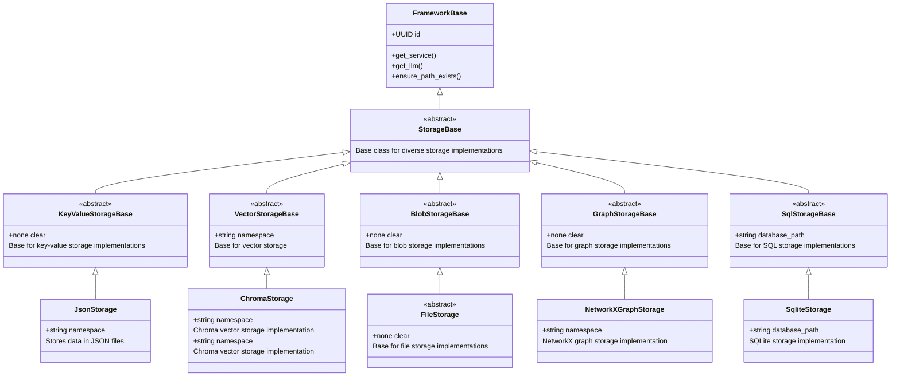

# Storage

## Conventions

All the abstract storage classes in this library follow certain conventions for method names. Here are the common terms used:

- `nearest` refers to retrieving the closest items based on similarity or relevance, usually based on vector embeddings.
- `upsert` is a combination of "update" and "insert". It means to insert a new item if it doesn't exist, or update the existing item if it does.
- `delete_by_id` refers to removing items from storage based on their unique identifiers.
- `get_by_id` refers to retrieving items from storage based on their unique identifiers.
- `count` refers to getting the total number of items stored.
- `clear` refers to removing all items from the storage.
- `query` refers to searching for items based on specific criteria or parameters. Note that some systems use `search` instead of `query` for this operation, some use `query` for `similarity_search`, and some use `query` for filtering based on metadata. Always refer to the specific storage documentation for clarity.

The graph store is unlike other storages in that it stores relationships between nodes in addition to the nodes themselves. This means that `get_by_id` and `delete_by_id` operations are ambiguous and calling these standard methods will raise `NotImplementedError`. Instead, use the specialized methods provided by the graph store for managing nodes and edges.

If there is ambiguity the term is extended. For instance, `nearest` in a graph context could refer to either nodes or edges. In this case, the methods are named `nearest_nodes` and `nearest_edges` to clarify their purpose. Similarly with other methods.

The use of `semantic` as in `SemanticGraph` refer to the fact that the graph is augmented with embedding or 'meaning'. For instance, the endpoints of an edge are typically defined via unique identifiers but this is not useful for rendering purposes (see [[Output]]). For human consumption, things like name and description are more useful and semantic operations like `get_by_name` or `get_descriptions` are define towards this.

## Architecture

The class diagram below illustrates the architecture of the storage system, highlighting the relationships between various storage classes and their base classes.

The setup is geared towards extensibility, allowing for easy addition of new storage types by inheriting from the appropriate base classes. All members are asynchronous which allows you to use remote solutions seamlessly.

## LLM Cache

The LLM Cache is a specialized storage system designed to cache responses from large language models (LLMs). It helps improve performance and reduce costs by storing previously generated responses, allowing for quick retrieval of these responses when the same or similar queries are made in the future.
The base class `LLMCacheBase` has a default implementation using JSON files called `JsonLLMCache`. This implementation stores cached responses in a structured JSON format, making it easy to read and write data. This is great for development and testing purposes. For production use, more robust storage solutions like databases or distributed caches are recommended.

