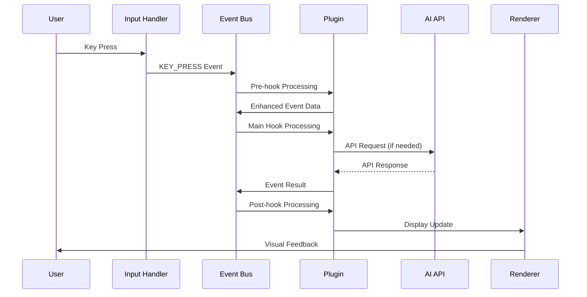
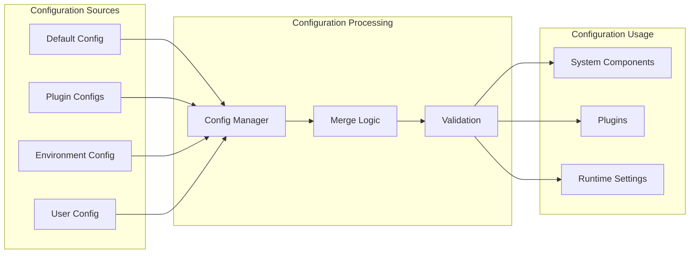
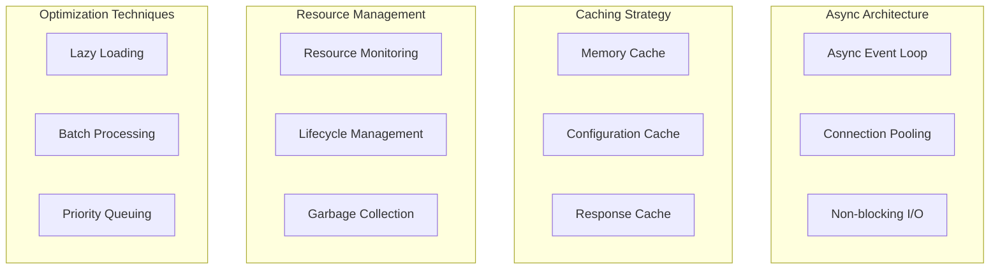
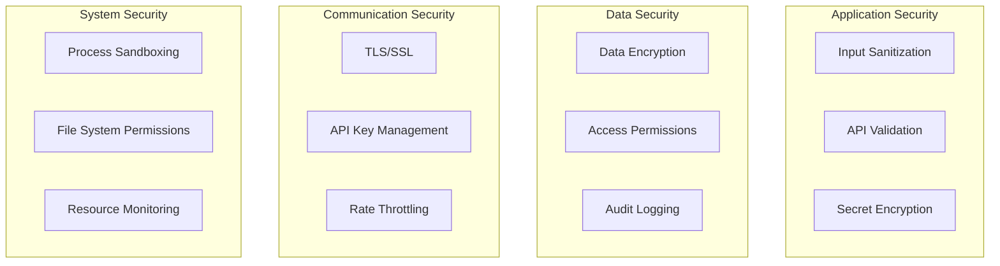

# Kollabor CLI - Advanced AI-Powered Development Terminal

## Overview

**Kollabor** is a sophisticated, enterprise-grade terminal-based AI coding assistant and development platform. This advanced system combines terminal-driven workflows with AI-powered assistance to create a complete development environment that enhances developer productivity through intelligent code analysis, automated refactoring, and AI-powered suggestions.

The system provides an interactive command-line interface for conversing with AI models, executing commands, managing workflows, and performing complex development tasks through a robust, event-driven plugin architecture.

## Architecture

### Core System Architecture

```
┌─────────────────────────────────────────────────────────────────┐
│                        Kollabor CLI                             │
├─────────────────────────────────────────────────────────────────┤
│                      Core Application                           │
│                  (core/application.py)                          │
├─────────────────────────────────────────────────────────────────┤
│  LLM Core   │  Commands   │  Events   │  I/O System  │ Plugins │
│  Services    │  System     │  System    │  (Terminal)  │ System  │
├─────────────────────────────────────────────────────────────────┤
│                     Configuration & State                        │
│                   (Config + State Management)                    │
└─────────────────────────────────────────────────────────────────┘
```

### Core Components (168 Python Files)

#### 1. Application Core (`core/application.py`)
- **TerminalLLMChat**: Main application orchestrator
- **Lifecycle Management**: Startup, shutdown, and resource cleanup
- **Component Coordination**: Integrates all subsystems and plugins
- **Configuration Integration**: Manages hierarchical configuration
- **Event Bus Integration**: Coordinates event-driven communication

#### 2. Advanced LLM Integration (`core/llm/`)
- **`llm_service.py`**: Primary LLM interface with comprehensive API management
- **`conversation_manager.py`**: Multi-threaded conversation history and context management
- **`api_communication_service.py`**: HTTP client with rate limiting and error handling
- **`message_display_service.py`**: Response formatting and rendering
- **`tool_executor.py`**: AI-suggested tool execution with safety controls
- **`response_parser.py`**: Intelligent LLM response parsing and processing
- **`response_processor.py`**: Advanced response processing and formatting
- **`mcp_integration.py`**: Model Context Protocol support
- **`hook_system.py`**: LLM-specific hook management
- **`plugin_sdk.py`**: Plugin development interface for LLM integration
- **`conversation_logger.py`**: Persistent conversation logging
- **`file_operations_executor.py`**: Safe file operation execution

#### 3. Sophisticated Command System (`core/commands/`)
- **`parser.py`**: Advanced command parsing with validation
- **`registry.py`**: Dynamic command registration and lookup
- **`executor.py`**: Secure command execution with error handling
- **`menu_renderer.py`**: Interactive menu rendering and navigation
- **`system_commands.py`**: Built-in system command implementations

#### 4. Event-Driven Architecture (`core/events/`)
- **`bus.py`**: Asynchronous event publishing and subscription system
- **`models.py`**: Event data structures and type definitions
- **`processor.py`**: Priority-based event processing and routing
- **`executor.py`**: Hook execution with error handling and cancellation
- **`registry.py`**: Hook registration and management system

#### 5. Advanced Terminal I/O (`core/io/`)
- **`terminal_renderer.py`**: 20 FPS rendering with visual effects
- **`input_handler.py`**: Sophisticated keyboard input processing
- **`message_renderer.py`**: Message formatting and display
- **`status_renderer.py`**: Multi-area status display
- **`modal_interaction_handler.py`**: Interactive modal management
- **`visual_effects.py`**: Matrix rain, gradients, and animations
- **`layout.py`**: Terminal layout management
- **`buffer_manager.py`**: Efficient buffer management
- **`key_parser.py`**: Advanced key sequence parsing
- **`raw_input_processor.py`**: Raw terminal input handling

#### 6. Comprehensive Plugin System (`core/plugins/`)
- **`registry.py`**: Dynamic plugin discovery and management
- **`factory.py`**: Plugin instantiation with dependency injection
- **`discovery.py`**: Automatic plugin scanning and loading
- **`collector.py`**: Plugin status and metrics collection

#### 7. Advanced UI Framework (`core/ui/`)
- **`modal_renderer.py`**: Full-screen modal overlay system
- **`modal_overlay_renderer.py`**: Advanced modal rendering
- **`modal_state_manager.py`**: Modal state and lifecycle management
- **`widget_integration.py`**: Interactive widget system
- **`config_widgets.py`**: Configuration-specific widgets
- **`config_merger.py`**: Hierarchical configuration merging
- **`modal_actions.py`**: Modal interaction handling

#### 8. Configuration & State Management
- **`core/config/`**: Hierarchical configuration with validation
- **`core/storage/`**: Persistent state management with SQLite
- **`core/utils/`**: Utility functions and helpers
- **`core/models/`**: Data models and type definitions
- **`core/logging/`**: Comprehensive logging system

## Data Flow Architecture

### Event Processing Flow



### Configuration Management Flow



## Capabilities

### Core Functionality

- **Advanced LLM Conversation**: Multi-turn AI conversations with threading and context management
- **Intelligent Command Execution**: Safe command execution with AI-suggested tools and validation
- **Comprehensive File Operations**: Read, write, analyze, and refactor files with backup protection
- **Sophisticated Code Analysis**: Dead code detection, pattern recognition, and intelligent refactoring
- **Plugin Integration**: Extensible architecture with dynamic plugin discovery and management
- **Event-Driven Architecture**: Asynchronous communication with priority-based hook execution
- **Real-time Terminal UI**: 20 FPS rendering with visual effects and interactive modals
- **Configuration Management**: Hierarchical configuration with live updates and validation
- **State Persistence**: SQLite-based state management with automatic backup
- **Multi-Model Support**: Integration with various AI providers (GLM-4.6, OpenAI, Claude, etc.)

### Advanced Features

#### Terminal-Driven Development
- **Command-Line Interface**: Full terminal-based workflow with slash commands
- **Real-time Rendering**: Dynamic terminal UI updates at 20fps with visual effects
- **Modal System**: Interactive overlays with widgets (checkboxes, sliders, dropdowns, text inputs)
- **Visual Effects**: Matrix rain effect, gradients, shimmer animations, and customizable themes
- **Raw Input Handling**: Sophisticated keyboard input processing with validation

#### AI-Powered Assistance
- **Multi-LLM Support**: Integration with various AI models and providers
- **Conversation History**: Persistent conversation management with threading
- **Context-Aware Suggestions**: Intelligent code recommendations based on project analysis
- **Tool Execution**: AI-suggested command execution with comprehensive safety controls
- **Natural Language Processing**: Advanced understanding of developer intent and requirements

#### CodeMod System
- **Automated Code Refactoring**: Intelligent code modifications with pattern matching
- **Pattern-based Transformations**: Rule-based code changes with validation
- **Backup System**: Automatic backup creation before any modifications
- **MCP Server Integration**: Model Context Protocol for advanced transformations
- **Comprehensive Testing**: Extensive test coverage for all code transformations

#### Development Workflow Enhancement
- **Slash Commands**: Quick command execution with `/` prefix (/config, /matrix, /help, /status)
- **Configuration Management**: Dynamic configuration with interactive modal interface
- **Event-Driven Architecture**: Decoupled component communication with hook system
- **Status Monitoring**: Real-time system health tracking and performance metrics
- **Batch Processing**: Automated multi-file operations with progress tracking

## Plugin System

Kollabor supports a sophisticated plugin ecosystem with 7 major plugins:

### 1. Enhanced Input Plugin (`plugins/enhanced_input/`)
- **Advanced Text Processing**: Sophisticated input validation and preprocessing
- **Color Engine**: Advanced color management and styling capabilities
- **Box Rendering**: Custom box drawing with borders and styles
- **Cursor Management**: Advanced cursor positioning and state management
- **Geometry Handling**: Precise terminal geometry calculations
- **State Management**: Input state persistence and restoration
- **Text Processing**: Advanced text manipulation and formatting

### 2. Fullscreen Framework (`plugins/fullscreen/`)
- **Matrix Plugin**: Immersive Matrix rain effect with customizable parameters
- **Example Plugin**: Template for creating fullscreen experiences
- **Complete Terminal Takeover**: Alternate buffer management with proper restoration
- **Real-time Animation**: Smooth 60fps animations with input handling
- **Session Management**: Persistent fullscreen sessions with state tracking
- **Plugin Discovery**: Auto-discovery and registration of fullscreen plugins

### 3. LLM Plugin (`plugins/llm_plugin.py.old`)
- **Extended LLM Functionality**: Advanced AI model integration
- **Custom Prompt Engineering**: Sophisticated prompt templates and engineering
- **Advanced Response Handling**: Intelligent response parsing and formatting
- **Multi-Model Support**: Integration with multiple AI providers
- **Tool Calling**: Advanced tool execution and orchestration
- **Conversation Management**: Enhanced conversation threading and context

### 4. Query Enhancer Plugin (`plugins/query_enhancer_plugin.py`)
- **Context Enrichment**: Automatic context enhancement for user queries
- **Query Optimization**: Intelligent query optimization and refinement
- **Intent Recognition**: Advanced understanding of user intent
- **Response Enhancement**: Improves AI response quality and relevance
- **Pattern Matching**: Sophisticated pattern recognition for queries

### 5. System Commands Plugin (`plugins/system_commands_plugin.py`)
- **Extended Command Set**: Additional system commands and utilities
- **Command Registration**: Dynamic command registration and discovery
- **Safety Controls**: Comprehensive command validation and execution safety
- **Integration Hooks**: Deep integration with core command system

### 6. Workflow Enforcement Plugin (`plugins/workflow_enforcement_plugin.py`)
- **Development Workflow Automation**: Automated enforcement of development practices
- **Quality Gates**: Automatic quality checks and validations
- **Process Compliance**: Ensures adherence to established development processes
- **Task Management**: Automated task tracking and completion
- **Integration Hooks**: Deep integration with event system for workflow monitoring

### 7. Hook Monitoring Plugin (`plugins/hook_monitoring_plugin.py`)
- **System Monitoring**: Comprehensive monitoring of all system hooks
- **Performance Tracking**: Real-time performance metrics and analysis
- **Debugging Support**: Advanced debugging capabilities for hook execution
- **Event Tracking**: Detailed event tracking and logging
- **Health Monitoring**: System health checks and alerting

## Hook System

Kollabor includes a sophisticated hook system for comprehensive system interception and modification:

### Hook Types

- **Pre-processing Hooks**: Modify input and events before core processing
- **Post-processing Hooks**: Transform output and responses after generation
- **Event Hooks**: Respond to system events with custom logic
- **Command Hooks**: Intercept and modify command execution with validation
- **LLM Hooks**: Specialized hooks for LLM interaction and response processing
- **UI Hooks**: Modify rendering and user interface behavior
- **Plugin Hooks**: Plugin lifecycle and integration hooks

### Hook System Features

- **Priority-Based Execution**: Hooks execute in priority order for predictable behavior
- **Asynchronous Processing**: Non-blocking hook execution for performance
- **Error Handling**: Comprehensive error handling with fallback mechanisms
- **Hook Cancellation**: Ability to cancel event propagation
- **Dynamic Registration**: Runtime hook registration and unregistration
- **Performance Monitoring**: Hook execution timing and performance metrics
- **Debugging Support**: Hook execution tracing and debugging capabilities

## Configuration Management

Kollabor uses a sophisticated hierarchical configuration system with comprehensive validation and live updates:

### Configuration Hierarchy

1. **Default Configuration**: Built-in defaults for all system components
2. **User Configuration**: User-specific settings in `.kollabor/config.json`
3. **Plugin Configuration**: Plugin-specific configuration overrides
4. **Environment Configuration**: Environment variable integration
5. **Runtime Configuration**: Dynamic configuration updates without restart

### Configuration Features

#### Dot Notation Access
```python
# Hierarchical configuration access
config.get("core.llm.max_history", 90)
config.get("terminal.render_fps", 20)
config.get("plugins.enhanced_input.enabled", True)
config.get("api.model", "glm-4.6")
```

#### Current Configuration
```bash
# API Configuration (from .env)
API_ENDPOINT=https://api.z.ai/api/coding/paas/v4/chat/completions
API_TOKEN=646c422b705347e3b015b18fa9642cf8.1T7tjk2EmOJCH0Pg
API_MODEL=glm-4.6
API_MAX_TOKENS=32768
API_TEMPERATURE=0.7
API_TIMEOUT=30000

# Core Configuration Categories
core.llm.*           # LLM service settings
terminal.*           # Terminal rendering settings
application.*        # Application metadata
plugins.*           # Plugin-specific settings
events.*            # Event system configuration
```

#### Configuration Management Features
- **Live Updates**: Configuration changes apply immediately without restart
- **Validation**: Automatic validation with meaningful error messages
- **Backup System**: Automatic configuration backup before changes
- **Rollback**: Configuration rollback capability
- **Import/Export**: Configuration import and export functionality
- **Template System**: Configuration templates for different environments

## Usage Patterns & Examples

### Basic Interaction

```bash
# Start the application
python main.py

# Natural language conversation
"Analyze the core/ directory structure and identify potential improvements"

# Request command execution
"run `ls -la` and show me the largest files"

# Code analysis and refactoring
"Find potential bugs in the llm_service.py file and suggest fixes"

# File management
"Create a new file called test.py with a hello world function and proper error handling"

# Configuration management
"Update the LLM model to use gpt-4 and increase max tokens to 4096"
```

### Slash Commands

```bash
/config        # Open configuration modal with interactive widgets
/matrix        # Launch Matrix rain fullscreen effect
/help          # Display available commands and usage
/status        # Show current system status and metrics
/clear         # Clear the screen and reset display
/history       # Show conversation history
/settings      # Access system settings (alias for /config)
```

### CodeMod Operations

```bash
# Replace a method in a class
./codemod replace-method core/llm/llm_service.py old_method new_method.txt --class LLMService

# Add a new method to a class
./codemod add-method core/llm/llm_service.py LLMService new_method.txt

# Replace pattern across files
./codemod search-replace ./ "deprecated_function" "new_function" --pattern "*.py"

# Fix syntax errors
./codemod fix-syntax core/llm/llm_service.py

# Comprehensive code analysis
./codemod analyze ./ --output analysis_report.json
```

### Advanced Usage

#### Plugin Management
```bash
# List available plugins
/plugins list

# Enable/disable plugins
/plugins enable enhanced_input
/plugins disable matrix_plugin

# Configure plugins
/plugins configure enhanced_input --setting value

# Monitor plugin status
/plugins status --verbose
```

#### Session Management
```bash
# Save current session
/session save my_work_session

# Restore previous session
/session load my_work_session

# List available sessions
/session list

# Export session history
/session export --format json --output session.json
```

#### Multi-Model Support
```bash
# Switch between LLM models
/model set gpt-4
/model set claude-3-sonnet
/model list

# Configure model parameters
/model configure --temperature 0.7 --max-tokens 4096

# Compare model responses
/model compare "prompt" --models gpt-4,claude-3
```

## Development Guidelines

### Adding New Commands

```python
# 1. Create command class in core/commands/
class NewCommand(BaseCommand):
    """Description of the new command."""
    
    def __init__(self):
        super().__init__(
            name="new_command",
            description="Command description",
            usage="/new_command [options]"
        )
    
    async def execute(self, args: List[str], context: CommandContext) -> CommandResult:
        """Execute the command with proper error handling."""
        try:
            # Command implementation
            result = await self._process_command(args, context)
            return CommandResult(success=True, data=result)
        except Exception as e:
            logger.error(f"Command execution failed: {e}")
            return CommandResult(success=False, error=str(e))

# 2. Register command in the registry
async def register_new_command():
    command = NewCommand()
    await command_registry.register(command)

# 3. Add comprehensive error handling and logging
# 4. Document command usage with examples
# 5. Add unit tests in tests/test_new_command.py
```

### Creating Plugins

```python
# 1. Implement plugin interface
class MyPlugin(BasePlugin):
    """Custom plugin implementation."""
    
    def __init__(self):
        super().__init__(
            name="my_plugin",
            version="1.0.0",
            description="Plugin description"
        )
        self.config = None
        self.event_bus = None
    
    async def initialize(self, config: dict, event_bus: EventBus) -> bool:
        """Initialize plugin with configuration and event bus."""
        self.config = config
        self.event_bus = event_bus
        await self.register_hooks()
        return True
    
    # 2. Register plugin hooks and event handlers
    async def register_hooks(self):
        """Register event hooks for plugin functionality."""
        await self.event_bus.register_hook(
            "user_input", 
            self.process_input, 
            priority=10
        )
        await self.event_bus.register_hook(
            "llm_response",
            self.enhance_response,
            priority=5
        )
    
    # 3. Define configuration schema
    def get_config_schema(self) -> dict:
        """Return plugin configuration schema."""
        return {
            "enabled": {"type": "boolean", "default": True},
            "threshold": {"type": "number", "min": 0, "max": 100, "default": 50}
        }
    
    # 4. Implement plugin lifecycle methods
    async def process_input(self, event_data: dict) -> dict:
        """Process user input events."""
        # Plugin logic here
        return event_data
    
    async def enhance_response(self, event_data: dict) -> dict:
        """Enhance LLM responses."""
        # Enhancement logic here
        return event_data
    
    async def shutdown(self) -> None:
        """Clean shutdown of plugin resources."""
        await self.event_bus.unregister_hooks(self.name)

# 5. Add comprehensive documentation and examples
# 6. Create tests in tests/test_my_plugin.py
```

## Project Structure

```
kollabor/
├── core/                    # Core system (19 modules)
│   ├── application.py      # Main orchestrator
│   ├── llm/                # AI integration (10 files)
│   ├── commands/           # Command system (5 files)
│   ├── events/             # Event bus (5 files)
│   ├── io/                 # Terminal I/O (20 files)
│   ├── plugins/            # Plugin system (4 files)
│   ├── ui/                 # UI framework (7 files)
│   ├── config/             # Configuration (4 files)
│   ├── effects/            # Visual effects (1 file)
│   ├── logging/            # Logging setup (1 file)
│   ├── models/             # Data models (1 file)
│   ├── storage/            # State management (1 file)
│   └── utils/              # Utilities (4 files)
├── plugins/                # Plugin implementations (7 plugins)
│   ├── enhanced_input/     # Enhanced input plugin modules
│   ├── fullscreen/         # Fullscreen plugins
│   ├── enhanced_input_plugin.py
│   ├── hook_monitoring_plugin.py
│   ├── llm_plugin.py.old
│   ├── query_enhancer_plugin.py
│   ├── system_commands_plugin.py
│   └── workflow_enforcement_plugin.py
├── tests/                  # Comprehensive test suite
│   ├── run_tests.py       # Test runner
│   ├── unit/              # Unit tests (13 files)
│   ├── integration/       # Integration tests (4 files)
│   ├── visual/            # Visual tests (7 files)
│   └── test_*.py          # Component tests (15+ files)
├── docs/                   # Documentation
│   ├── README.md          # Main documentation
│   ├── reference/         # API documentation
│   ├── sdlc/              # Software development lifecycle
│   ├── sop/               # Standard operating procedures
│   ├── standards/         # Development standards
│   └── project-management/ # Project management docs
├── tools/                  # Development utilities
├── codemon/               # CodeMod system
├── backups/               # Automatic backups
├── main.py                # Application entry point
├── requirements.txt       # Dependencies
└── .kollabor/            # Runtime data (created at startup)
    ├── config.json       # User configuration
    ├── logs/             # Application logs
    └── state.db          # Persistent state
```

## Testing Strategy

The project includes enterprise-grade testing with comprehensive coverage:

### Test Architecture

```
tests/
├── run_tests.py              # Main test runner
├── README.md                 # Test documentation
├── unit/                     # Unit tests (13 files)
├── integration/              # Integration tests (4 files)
├── visual/                   # Visual and UI tests (7 files)
├── test_*.py                 # Component tests (15+ files)
└── test_specific_fixes.py    # Regression and bug fix tests
```

### Test Categories

#### Unit Tests (`tests/unit/`)
- **Component Isolation**: Test individual components in isolation
- **Mock Dependencies**: Use mocks for external dependencies
- **Edge Cases**: Comprehensive edge case testing
- **Error Conditions**: Proper error handling validation

#### Integration Tests (`tests/integration/`)
- **System Integration**: Test component interactions
- **API Integration**: External API integration testing
- **Plugin Integration**: Plugin system integration
- **End-to-End Workflows**: Complete user workflow testing

#### Visual Tests (`tests/visual/`)
- **UI Rendering**: Terminal rendering accuracy
- **Modal System**: Modal functionality and layout
- **Visual Effects**: Matrix rain and animation testing
- **Color Schemes**: Theme and color rendering

#### Component Tests (`test_*.py`)
- **LLM Service Tests**: Comprehensive LLM functionality testing
- **API Communication**: HTTP client and error handling
- **Tool Executor**: Command execution and safety
- **Message Display**: Response formatting and rendering
- **Input Handler**: Keyboard input processing
- **Plugin Registry**: Plugin discovery and management
- **Configuration**: Settings and validation

### Running Tests

```bash
# Run all tests
python tests/run_tests.py

# Run with pytest
python -m pytest tests/ -v

# Run specific test file
python -m pytest tests/test_llm_service.py -v

# Run with coverage
python -m pytest tests/ --cov=core --cov=plugins --cov-report=html
```

## Performance & Security

### Performance Architecture



### Performance Targets

- **Render FPS**: Target 20 FPS for smooth terminal updates
- **Response Time**: < 100ms for user interactions
- **Memory Usage**: < 100MB for typical operations
- **CPU Usage**: < 5% during idle state
- **Startup Time**: < 2 seconds for application startup

### Security Architecture



### Security Controls

- **Input Security**: Sanitization, validation, and rate limiting
- **Command Execution**: Filtering, validation, sandbox execution
- **File System Security**: Path validation, access control, backup creation
- **API Security**: Authentication, encryption, rate limiting, input validation
- **Data Protection**: Encryption at rest and in transit, secret management

## Quick Start Guide

### Installation & Setup

```bash
# Clone the repository
git clone <repository-url>
cd kollabor

# Install dependencies
pip install -r requirements.txt

# Set up environment
cp .env.example .env
# Edit .env with your API keys

# Run the application
python main.py
```

### Basic Usage Examples

```bash
# Start Kollabor CLI
python main.py

# Natural language interaction
"Analyze the codebase and suggest improvements"

# Slash commands
/config        # Open configuration modal
/matrix        # Launch Matrix effect
/status        # Show system status
/help          # Display help

# Code operations
"Create a new Python file with error handling"
"Refactor this function to be more efficient"
"Find all security vulnerabilities in the code"
```

### Development Quick Reference

```bash
# Development
python main.py                    # Run application
python tests/run_tests.py        # Run all tests
python -m pytest tests/ -v       # Run with pytest

# Code Quality
python -m black core/ plugins/   # Format code
python -m flake8 core/ plugins/ # Lint code
python -m mypy core/ plugins/    # Type checking

# CodeMod Operations
./codemod search-replace ./ "old" "new" --pattern "*.py"
./codemod add-method file.py ClassName method.txt
./codemod fix-syntax file.py
```

## Technology Stack

- **Python 3.11+** with async/await patterns
- **Event-driven architecture** with hook system
- **SQLite** for state persistence
- **Rich terminal libraries** for UI
- **HTTP clients** for API communication
- **Comprehensive logging** with daily rotation
- **168 Python files** across core, plugins, and tests
- **7 major plugins** with specialized functionality
- **Enterprise-grade documentation** following ISO-inspired standards

## Future Roadmap

### 2025 Q1-Q2: Performance & Stability
- Performance optimization and caching
- Enhanced error handling and recovery
- Improved plugin system stability
- Comprehensive testing and QA

### 2025 Q3-Q4: Advanced Features
- Advanced UI framework and widgets
- Plugin marketplace and SDK
- Enhanced code analysis and refactoring
- Multi-model support expansion

### 2026 Q1-Q2: Enterprise Features
- Team collaboration and multi-user support
- Advanced security and compliance
- Cloud deployment and scaling
- Enterprise monitoring and observability

### 2026 Q3-Q4: Ecosystem Expansion
- Mobile applications
- Third-party integrations
- Advanced AI capabilities
- Community and marketplace growth

---

## Document Information

- **Version**: 1.0
- **Date**: 2025-01-07
- **Author**: Kollabor Development Team
- **Status**: Active
- **Category**: Project Documentation
- **Last Updated**: Comprehensive project overview with current architecture and capabilities

---

**Kollabor CLI** represents a sophisticated approach to AI-powered development tools, combining terminal efficiency with advanced AI capabilities in a comprehensive, enterprise-grade platform. This documentation provides a complete overview of the system architecture, capabilities, and development guidelines for working with this advanced AI development environment.
