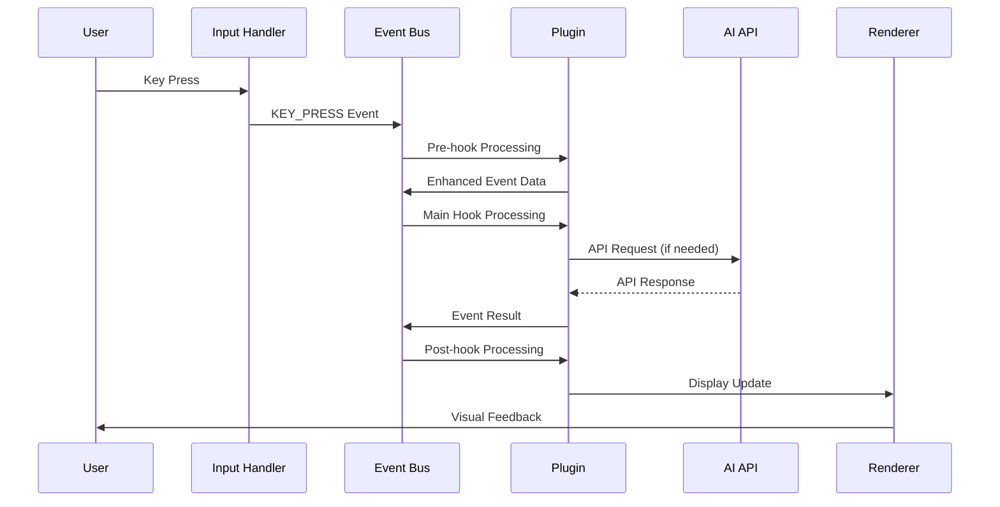
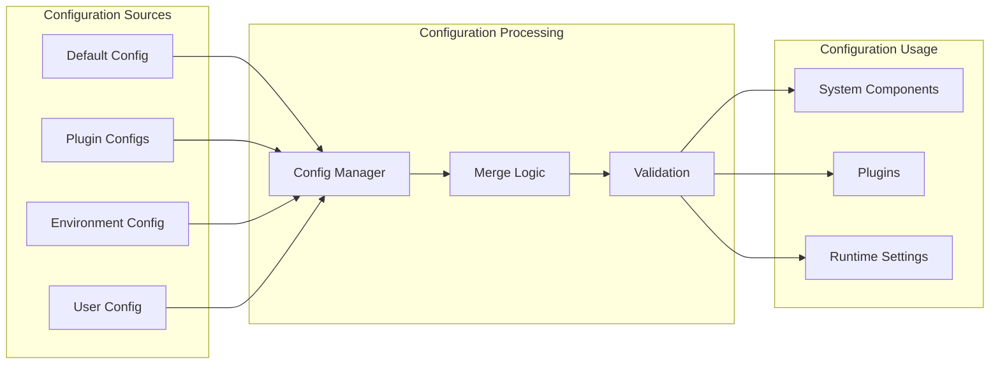
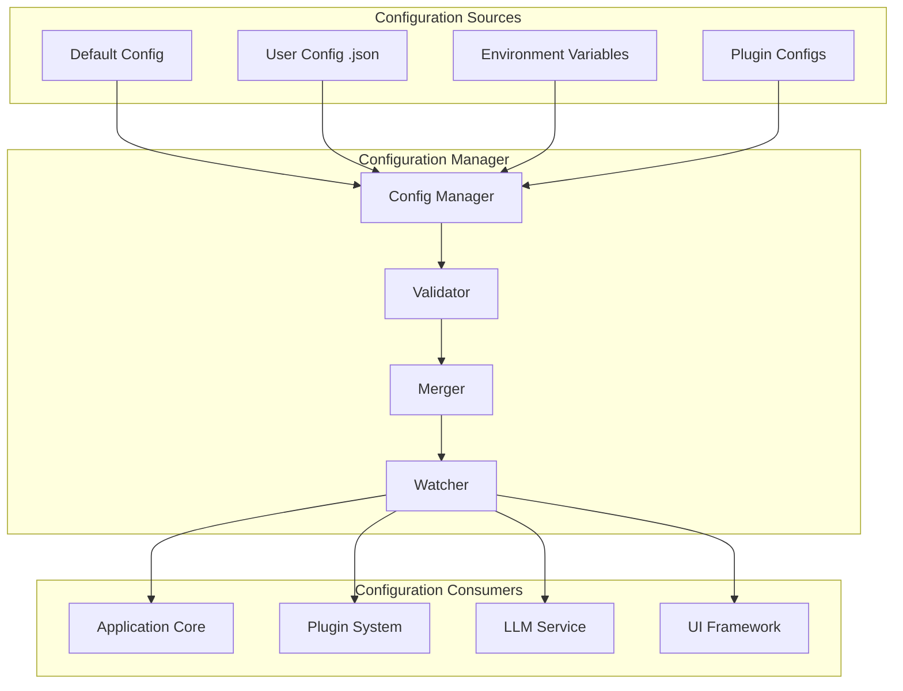
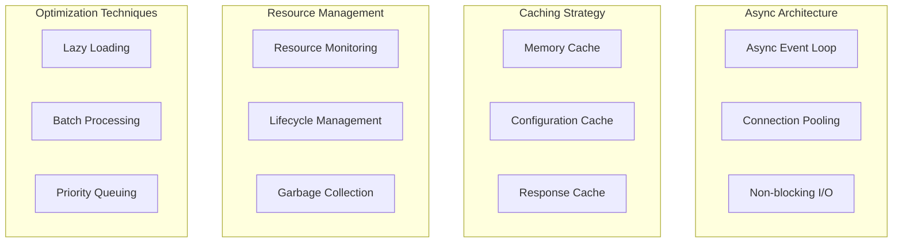
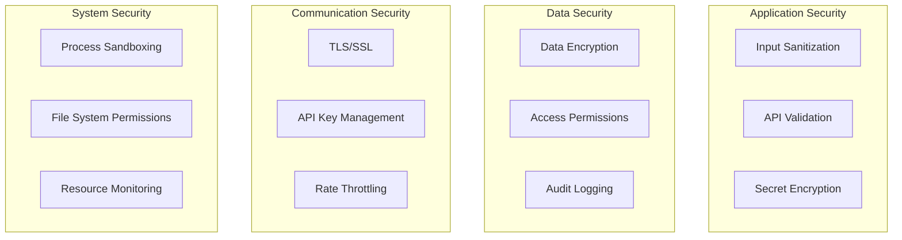
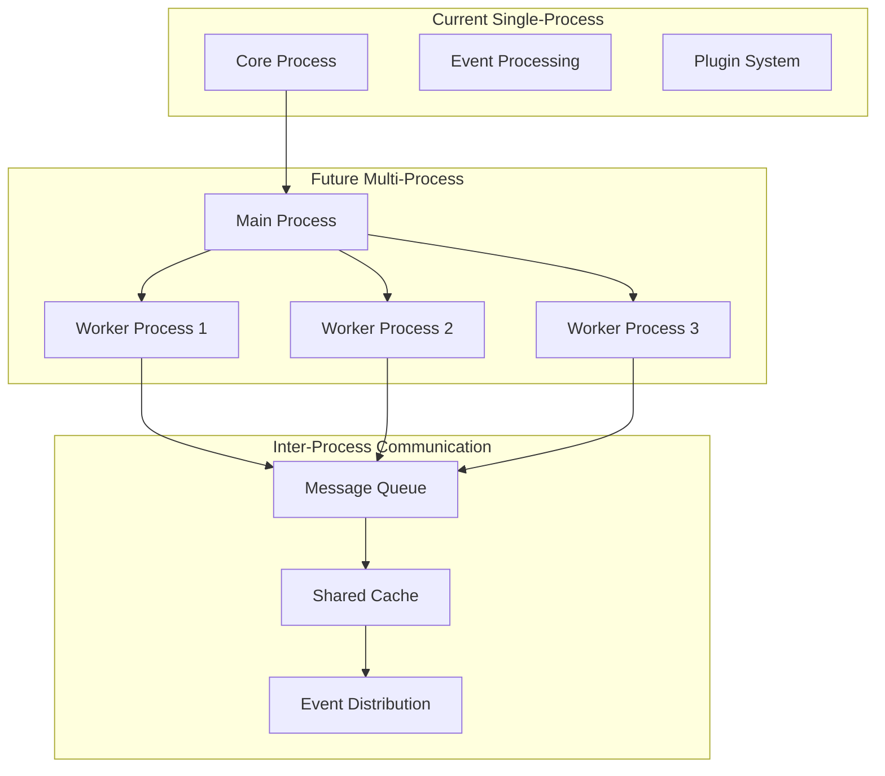

# Kollabor CLI - Advanced AI-Powered Development Agent

## Overview

**Kollabor** is a sophisticated, enterprise-grade terminal-based AI coding assistant and development platform. This advanced system combines terminal-driven workflows with AI-powered assistance to create a complete development environment that enhances developer productivity through intelligent code analysis, automated refactoring, and AI-powered suggestions.

The system provides an interactive command-line interface for conversing with AI models, executing commands, managing workflows, and performing complex development tasks through a robust, event-driven plugin architecture.

## Kollabor Architecture

### Core System Architecture

```
┌─────────────────────────────────────────────────────────────────┐
│                        Kollabor CLI                             │
├─────────────────────────────────────────────────────────────────┤
│                      Core Application                           │
│                  (core/application.py)                          │
├─────────────────────────────────────────────────────────────────┤
│  LLM Core   │  Commands   │  Events   │  I/O System  │ Plugins │
│  Services    │  System     │  System    │  (Terminal)  │ System  │
├─────────────────────────────────────────────────────────────────┤
│                     Configuration & State                        │
│                   (Config + State Management)                    │
└─────────────────────────────────────────────────────────────────┘
```

### Core Components (168 Python Files)

#### 1. **Application Core** (`core/application.py`)
- **TerminalLLMChat**: Main application orchestrator
- **Lifecycle Management**: Startup, shutdown, and resource cleanup
- **Component Coordination**: Integrates all subsystems and plugins
- **Configuration Integration**: Manages hierarchical configuration
- **Event Bus Integration**: Coordinates event-driven communication

#### 2. **Advanced LLM Integration** (`core/llm/`)
- **`llm_service.py`**: Primary LLM interface with comprehensive API management
- **`conversation_manager.py`**: Multi-threaded conversation history and context management
- **`api_communication_service.py`**: HTTP client with rate limiting and error handling
- **`message_display_service.py`**: Response formatting and rendering
- **`tool_executor.py`**: AI-suggested tool execution with safety controls
- **`response_parser.py`**: Intelligent LLM response parsing and processing
- **`response_processor.py`**: Advanced response processing and formatting
- **`mcp_integration.py`**: Model Context Protocol support
- **`hook_system.py`**: LLM-specific hook management
- **`plugin_sdk.py`**: Plugin development interface for LLM integration
- **`conversation_logger.py`**: Persistent conversation logging
- **`file_operations_executor.py`**: Safe file operation execution

#### 3. **Sophisticated Command System** (`core/commands/`)
- **`parser.py`**: Advanced command parsing with validation
- **`registry.py`**: Dynamic command registration and lookup
- **`executor.py`**: Secure command execution with error handling
- **`menu_renderer.py`**: Interactive menu rendering and navigation
- **`system_commands.py`**: Built-in system command implementations

#### 4. **Event-Driven Architecture** (`core/events/`)
- **`bus.py`**: Asynchronous event publishing and subscription system
- **`models.py`**: Event data structures and type definitions
- **`processor.py`**: Priority-based event processing and routing
- **`executor.py`**: Hook execution with error handling and cancellation
- **`registry.py`**: Hook registration and management system

#### 5. **Advanced Terminal I/O** (`core/io/`)
- **`terminal_renderer.py`**: 20 FPS rendering with visual effects
- **`input_handler.py`**: Sophisticated keyboard input processing
- **`message_renderer.py`**: Message formatting and display
- **`status_renderer.py`**: Multi-area status display
- **`modal_interaction_handler.py`**: Interactive modal management
- **`visual_effects.py`**: Matrix rain, gradients, and animations
- **`layout.py`**: Terminal layout management
- **`buffer_manager.py`**: Efficient buffer management
- **`key_parser.py`**: Advanced key sequence parsing
- **`raw_input_processor.py`**: Raw terminal input handling

#### 6. **Comprehensive Plugin System** (`core/plugins/`)
- **`registry.py`**: Dynamic plugin discovery and management
- **`factory.py`**: Plugin instantiation with dependency injection
- **`discovery.py`**: Automatic plugin scanning and loading
- **`collector.py`**: Plugin status and metrics collection

#### 7. **Advanced UI Framework** (`core/ui/`)
- **`modal_renderer.py`**: Full-screen modal overlay system
- **`modal_overlay_renderer.py`**: Advanced modal rendering
- **`modal_state_manager.py`**: Modal state and lifecycle management
- **`widget_integration.py`**: Interactive widget system
- **`config_widgets.py`**: Configuration-specific widgets
- **`config_merger.py`**: Hierarchical configuration merging
- **`modal_actions.py`**: Modal interaction handling

#### 8. **Configuration & State Management**
- **`core/config/`**: Hierarchical configuration with validation
- **`core/storage/`**: Persistent state management with SQLite
- **`core/utils/`**: Utility functions and helpers
- **`core/models/`**: Data models and type definitions
- **`core/logging/`**: Comprehensive logging system

### Advanced Data Flow Architecture



### Event Processing Flow

1. **User Input** → **Raw Input Processor** → **Key Parser** → **Event Bus**
2. **Event Bus** → **Hook Registry** → **Plugin Hooks** → **Command Parser**
3. **Command Parser** → **Command Registry** → **Command Executor** → **LLM Service**
4. **LLM Service** → **API Communication Service** → **AI API** → **Response Processor**
5. **Response Processor** → **Message Display Service** → **Terminal Renderer** → **User Display**

### Configuration Management Flow



## Kollabor Capabilities

### Core Functionality

- **Advanced LLM Conversation**: Multi-turn AI conversations with threading and context management
- **Intelligent Command Execution**: Safe command execution with AI-suggested tools and validation
- **Comprehensive File Operations**: Read, write, analyze, and refactor files with backup protection
- **Sophisticated Code Analysis**: Dead code detection, pattern recognition, and intelligent refactoring
- **Plugin Integration**: Extensible architecture with dynamic plugin discovery and management
- **Event-Driven Architecture**: Asynchronous communication with priority-based hook execution
- **Real-time Terminal UI**: 20 FPS rendering with visual effects and interactive modals
- **Configuration Management**: Hierarchical configuration with live updates and validation
- **State Persistence**: SQLite-based state management with automatic backup
- **Multi-Model Support**: Integration with various AI providers (GLM-4.6, OpenAI, Claude, etc.)

### Advanced Features

#### **Terminal-Driven Development**
- **Command-Line Interface**: Full terminal-based workflow with slash commands
- **Real-time Rendering**: Dynamic terminal UI updates at 20fps with visual effects
- **Modal System**: Interactive overlays with widgets (checkboxes, sliders, dropdowns, text inputs)
- **Visual Effects**: Matrix rain effect, gradients, shimmer animations, and customizable themes
- **Raw Input Handling**: Sophisticated keyboard input processing with validation

#### **AI-Powered Assistance**
- **Multi-LLM Support**: Integration with various AI models and providers
- **Conversation History**: Persistent conversation management with threading
- **Context-Aware Suggestions**: Intelligent code recommendations based on project analysis
- **Tool Execution**: AI-suggested command execution with comprehensive safety controls
- **Natural Language Processing**: Advanced understanding of developer intent and requirements

#### **CodeMod System**
- **Automated Code Refactoring**: Intelligent code modifications with pattern matching
- **Pattern-based Transformations**: Rule-based code changes with validation
- **Backup System**: Automatic backup creation before any modifications
- **MCP Server Integration**: Model Context Protocol for advanced transformations
- **Comprehensive Testing**: Extensive test coverage for all code transformations

#### **Development Workflow Enhancement**
- **Slash Commands**: Quick command execution with `/` prefix (/config, /matrix, /help, /status)
- **Configuration Management**: Dynamic configuration with interactive modal interface
- **Event-Driven Architecture**: Decoupled component communication with hook system
- **Status Monitoring**: Real-time system health tracking and performance metrics
- **Batch Processing**: Automated multi-file operations with progress tracking

### Comprehensive Plugin System

Kollabor supports a sophisticated plugin ecosystem with 7 major plugins:

#### 1. **Enhanced Input Plugin** (`plugins/enhanced_input/`)
- **Advanced Text Processing**: Sophisticated input validation and preprocessing
- **Color Engine**: Advanced color management and styling capabilities
- **Box Rendering**: Custom box drawing with borders and styles
- **Cursor Management**: Advanced cursor positioning and state management
- **Geometry Handling**: Precise terminal geometry calculations
- **State Management**: Input state persistence and restoration
- **Text Processing**: Advanced text manipulation and formatting

#### 2. **Fullscreen Framework** (`plugins/fullscreen/`)
- **Matrix Plugin**: Immersive Matrix rain effect with customizable parameters
- **Example Plugin**: Template for creating fullscreen experiences
- **Complete Terminal Takeover**: Alternate buffer management with proper restoration
- **Real-time Animation**: Smooth 60fps animations with input handling
- **Session Management**: Persistent fullscreen sessions with state tracking
- **Plugin Discovery**: Auto-discovery and registration of fullscreen plugins

#### 3. **LLM Plugin** (`plugins/llm_plugin.py.old`)
- **Extended LLM Functionality**: Advanced AI model integration
- **Custom Prompt Engineering**: Sophisticated prompt templates and engineering
- **Advanced Response Handling**: Intelligent response parsing and formatting
- **Multi-Model Support**: Integration with multiple AI providers
- **Tool Calling**: Advanced tool execution and orchestration
- **Conversation Management**: Enhanced conversation threading and context

#### 4. **Query Enhancer Plugin** (`plugins/query_enhancer_plugin.py`)
- **Context Enrichment**: Automatic context enhancement for user queries
- **Query Optimization**: Intelligent query optimization and refinement
- **Intent Recognition**: Advanced understanding of user intent
- **Response Enhancement**: Improves AI response quality and relevance
- **Pattern Matching**: Sophisticated pattern recognition for queries

#### 5. **System Commands Plugin** (`plugins/system_commands_plugin.py`)
- **Extended Command Set**: Additional system commands and utilities
- **Command Registration**: Dynamic command registration and discovery
- **Safety Controls**: Comprehensive command validation and execution safety
- **Integration Hooks**: Deep integration with core command system

#### 6. **Workflow Enforcement Plugin** (`plugins/workflow_enforcement_plugin.py`)
- **Development Workflow Automation**: Automated enforcement of development practices
- **Quality Gates**: Automatic quality checks and validations
- **Process Compliance**: Ensures adherence to established development processes
- **Task Management**: Automated task tracking and completion
- **Integration Hooks**: Deep integration with event system for workflow monitoring

#### 7. **Hook Monitoring Plugin** (`plugins/hook_monitoring_plugin.py`)
- **System Monitoring**: Comprehensive monitoring of all system hooks
- **Performance Tracking**: Real-time performance metrics and analysis
- **Debugging Support**: Advanced debugging capabilities for hook execution
- **Event Tracking**: Detailed event tracking and logging
- **Health Monitoring**: System health checks and alerting

### Plugin Architecture Features

- **Auto-Discovery**: Automatic plugin detection and registration
- **Dependency Injection**: Proper resource management and dependency resolution
- **Hook Registration**: Event-driven integration with the core system
- **Status Monitoring**: Real-time plugin health monitoring and metrics
- **Configuration Management**: Plugin-specific configuration with validation
- **Lifecycle Management**: Proper plugin initialization and shutdown
- **Error Handling**: Robust error handling and recovery mechanisms

### Advanced Hook System

Kollabor includes a sophisticated hook system for comprehensive system interception and modification:

#### Hook Types

- **Pre-processing Hooks**: Modify input and events before core processing
- **Post-processing Hooks**: Transform output and responses after generation
- **Event Hooks**: Respond to system events with custom logic
- **Command Hooks**: Intercept and modify command execution with validation
- **LLM Hooks**: Specialized hooks for LLM interaction and response processing
- **UI Hooks**: Modify rendering and user interface behavior
- **Plugin Hooks**: Plugin lifecycle and integration hooks

#### Hook System Features

- **Priority-Based Execution**: Hooks execute in priority order for predictable behavior
- **Asynchronous Processing**: Non-blocking hook execution for performance
- **Error Handling**: Comprehensive error handling with fallback mechanisms
- **Hook Cancellation**: Ability to cancel event propagation
- **Dynamic Registration**: Runtime hook registration and unregistration
- **Performance Monitoring**: Hook execution timing and performance metrics
- **Debugging Support**: Hook execution tracing and debugging capabilities

#### Hook Registry Architecture

```python
class HookRegistry:
    async def register_hook(self, event_type: str, hook_func: callable, priority: int)
    async def unregister_hook(self, hook_id: str)
    async def execute_hooks(self, event_type: str, data: dict) -> EventResult
    def get_hook_stats(self) -> dict
    def clear_hooks(self, event_type: str = None)
```

## Advanced Configuration Management

Kollabor uses a sophisticated hierarchical configuration system with comprehensive validation and live updates:

### Configuration Hierarchy

1. **Default Configuration**: Built-in defaults for all system components
2. **User Configuration**: User-specific settings in `.kollabor/config.json`
3. **Plugin Configuration**: Plugin-specific configuration overrides
4. **Environment Configuration**: Environment variable integration
5. **Runtime Configuration**: Dynamic configuration updates without restart

### Configuration Features

#### **Dot Notation Access**
```python
# Hierarchical configuration access
config.get("core.llm.max_history", 90)
config.get("terminal.render_fps", 20)
config.get("plugins.enhanced_input.enabled", True)
config.get("api.model", "glm-4.6")
```

#### **Configuration Sources**
- **JSON File Storage**: Primary configuration in `.kollabor/config.json`
- **Atomic Writes**: Safe configuration updates with automatic backup
- **Validation**: Comprehensive configuration validation with error reporting
- **Merging**: Intelligent hierarchical configuration merging
- **Schema Validation**: Type checking and constraint validation

#### **Current Configuration**
```bash
# API Configuration (from .env)
API_ENDPOINT=https://api.z.ai/api/coding/paas/v4/chat/completions
API_TOKEN=646c422b705347e3b015b18fa9642cf8.1T7tjk2EmOJCH0Pg
API_MODEL=glm-4.6
API_MAX_TOKENS=32768
API_TEMPERATURE=0.7
API_TIMEOUT=30000

# Core Configuration Categories
core.llm.*           # LLM service settings
terminal.*           # Terminal rendering settings
application.*        # Application metadata
plugins.*           # Plugin-specific settings
events.*            # Event system configuration
```

#### **Configuration Management Features**
- **Live Updates**: Configuration changes apply immediately without restart
- **Validation**: Automatic validation with meaningful error messages
- **Backup System**: Automatic configuration backup before changes
- **Rollback**: Configuration rollback capability
- **Import/Export**: Configuration import and export functionality
- **Template System**: Configuration templates for different environments

### Configuration Architecture



## Usage Patterns & Examples

### Basic Interaction

```bash
# Start the application
python main.py

# Natural language conversation
"Analyze the core/ directory structure and identify potential improvements"

# Request command execution
"run `ls -la` and show me the largest files"

# Code analysis and refactoring
"Find potential bugs in the llm_service.py file and suggest fixes"

# File management
"Create a new file called test.py with a hello world function and proper error handling"

# Configuration management
"Update the LLM model to use gpt-4 and increase max tokens to 4096"
```

### Slash Commands

```bash
/config        # Open configuration modal with interactive widgets
/matrix        # Launch Matrix rain fullscreen effect
/help          # Display available commands and usage
/status        # Show current system status and metrics
/clear         # Clear the screen and reset display
/history       # Show conversation history
/settings      # Access system settings (alias for /config)
```

### CodeMod Operations

```bash
# Replace a method in a class
./codemod replace-method core/llm/llm_service.py old_method new_method.txt --class LLMService

# Add a new method to a class
./codemod add-method core/llm/llm_service.py LLMService new_method.txt

# Replace pattern across files
./codemod search-replace ./ "deprecated_function" "new_function" --pattern "*.py"

# Fix syntax errors
./codemod fix-syntax core/llm/llm_service.py

# Comprehensive code analysis
./codemod analyze ./ --output analysis_report.json
```

### Advanced Usage

#### **Plugin Management**
```bash
# List available plugins
/plugins list

# Enable/disable plugins
/plugins enable enhanced_input
/plugins disable matrix_plugin

# Configure plugins
/plugins configure enhanced_input --setting value

# Monitor plugin status
/plugins status --verbose
```

#### **Session Management**
```bash
# Save current session
/session save my_work_session

# Restore previous session
/session load my_work_session

# List available sessions
/session list

# Export session history
/session export --format json --output session.json
```

#### **Multi-Model Support**
```bash
# Switch between LLM models
/model set gpt-4
/model set claude-3-sonnet
/model list

# Configure model parameters
/model configure --temperature 0.7 --max-tokens 4096

# Compare model responses
/model compare "prompt" --models gpt-4,claude-3
```

#### **Workflow Automation**
```bash
# Create custom workflows
/workflow create code_review --steps "analyze,lint,test,document"

# Execute workflows
/workflow run code_review --target ./src/

# Schedule automated workflows
/workflow schedule daily_cleanup --time "02:00" --repeat daily
```

#### **Custom Commands**
```bash
# Register custom commands
/command register deploy --handler "deploy_script.sh"

# Create command aliases
/command alias ll "ls -la"

# Command chaining
/command chain "git status && git add . && git commit -m 'auto commit'"
```

### Interactive Modal Usage

#### **Configuration Modal**
```bash
/config
# Interactive widgets for:
# - Checkboxes for feature toggles
# - Sliders for numeric values (FPS, timeouts)
# - Dropdowns for model selection
# - Text inputs for API keys and endpoints
# - Real-time validation and preview
```

#### **Status Monitoring**
```bash
/status
# Real-time display of:
# - System performance metrics
# - Plugin health status
# - API response times
# - Memory and CPU usage
# - Active conversation statistics
```

### Development Workflow Examples

#### **Code Analysis Workflow**
```bash
# 1. Analyze project structure
"Analyze the entire codebase and generate a comprehensive report"

# 2. Identify issues
"Find all unused imports and dead code in the project"

# 3. Automated refactoring
"Refactor all deprecated function calls to use the new API"

# 4. Quality checks
"Run comprehensive quality analysis including security, performance, and maintainability"

# 5. Documentation generation
"Generate updated documentation for all modified modules"
```

#### **Debugging Workflow**
```bash
# 1. Issue identification
"I'm getting a memory leak in the LLM service, help me debug it"

# 2. Log analysis
"Analyze the recent logs and identify error patterns"

# 3. Root cause analysis
"Trace the execution flow and identify where the memory is being allocated"

# 4. Fix implementation
"Implement a fix for the memory leak with proper resource cleanup"

# 5. Testing and validation
"Create comprehensive tests to verify the fix and prevent regressions"
```

## Development Guidelines

### Adding New Commands

```python
# 1. Create command class in core/commands/
class NewCommand(BaseCommand):
    """Description of the new command."""
    
    def __init__(self):
        super().__init__(
            name="new_command",
            description="Command description",
            usage="/new_command [options]"
        )
    
    async def execute(self, args: List[str], context: CommandContext) -> CommandResult:
        """Execute the command with proper error handling."""
        try:
            # Command implementation
            result = await self._process_command(args, context)
            return CommandResult(success=True, data=result)
        except Exception as e:
            logger.error(f"Command execution failed: {e}")
            return CommandResult(success=False, error=str(e))

# 2. Register command in the registry
async def register_new_command():
    command = NewCommand()
    await command_registry.register(command)

# 3. Add comprehensive error handling and logging
# 4. Document command usage with examples
# 5. Add unit tests in tests/test_new_command.py
```

### Creating Plugins

```python
# 1. Implement plugin interface
class MyPlugin(BasePlugin):
    """Custom plugin implementation."""
    
    def __init__(self):
        super().__init__(
            name="my_plugin",
            version="1.0.0",
            description="Plugin description"
        )
        self.config = None
        self.event_bus = None
    
    async def initialize(self, config: dict, event_bus: EventBus) -> bool:
        """Initialize plugin with configuration and event bus."""
        self.config = config
        self.event_bus = event_bus
        await self.register_hooks()
        return True
    
    # 2. Register plugin hooks and event handlers
    async def register_hooks(self):
        """Register event hooks for plugin functionality."""
        await self.event_bus.register_hook(
            "user_input", 
            self.process_input, 
            priority=10
        )
        await self.event_bus.register_hook(
            "llm_response",
            self.enhance_response,
            priority=5
        )
    
    # 3. Define configuration schema
    def get_config_schema(self) -> dict:
        """Return plugin configuration schema."""
        return {
            "enabled": {"type": "boolean", "default": True},
            "threshold": {"type": "number", "min": 0, "max": 100, "default": 50}
        }
    
    # 4. Implement plugin lifecycle methods
    async def process_input(self, event_data: dict) -> dict:
        """Process user input events."""
        # Plugin logic here
        return event_data
    
    async def enhance_response(self, event_data: dict) -> dict:
        """Enhance LLM responses."""
        # Enhancement logic here
        return event_data
    
    async def shutdown(self) -> None:
        """Clean shutdown of plugin resources."""
        await self.event_bus.unregister_hooks(self.name)

# 5. Add comprehensive documentation and examples
# 6. Create tests in tests/test_my_plugin.py
```

### Professional Code Standards

#### **Python Coding Standards**
- **PEP 8 Compliance**: Follow Python style guide strictly
- **88 Character Line Length**: Black formatter configuration
- **Type Hints Required**: All public functions must have type hints
- **Comprehensive Docstrings**: Google-style docstrings for all classes and methods
- **Async/Await Patterns**: Proper asynchronous programming patterns

#### **Code Quality Requirements**
```python
# Example of expected code quality
from typing import Dict, List, Optional, Any
import logging
import asyncio

logger = logging.getLogger(__name__)

class ExampleService:
    """Example service demonstrating code standards.
    
    This class shows the expected code quality and documentation
    standards for all new code additions.
    
    Attributes:
        config: Service configuration dictionary
        event_bus: Event bus for asynchronous communication
    """
    
    def __init__(self, config: Dict[str, Any], event_bus: EventBus) -> None:
        """Initialize the service with required dependencies.
        
        Args:
            config: Configuration dictionary with service settings
            event_bus: Event bus for publishing and subscribing to events
            
        Raises:
            ValueError: If required configuration keys are missing
        """
        self._validate_config(config)
        self.config = config
        self.event_bus = event_bus
        self._running = False
    
    async def start(self) -> bool:
        """Start the service asynchronously.
        
        Returns:
            True if service started successfully, False otherwise
            
        Raises:
            RuntimeError: If service is already running
        """
        if self._running:
            raise RuntimeError("Service is already running")
        
        try:
            await self._initialize_resources()
            self._running = True
            logger.info("Service started successfully")
            return True
        except Exception as e:
            logger.error(f"Failed to start service: {e}")
            return False
    
    async def stop(self) -> None:
        """Stop the service and clean up resources."""
        if not self._running:
            return
        
        try:
            await self._cleanup_resources()
            self._running = False
            logger.info("Service stopped successfully")
        except Exception as e:
            logger.error(f"Error during service shutdown: {e}")
```

#### **Testing Standards**
```python
# Comprehensive test example
import unittest
from unittest.mock import Mock, AsyncMock
import asyncio

class TestExampleService(unittest.TestCase):
    """Test cases for ExampleService."""
    
    def setUp(self) -> None:
        """Set up test fixtures."""
        self.config = {"setting1": "value1", "setting2": 42}
        self.event_bus = Mock(spec=EventBus)
        self.service = ExampleService(self.config, self.event_bus)
    
    async def test_start_success(self) -> None:
        """Test successful service start."""
        result = await self.service.start()
        self.assertTrue(result)
        self.assertTrue(self.service._running)
    
    async def test_start_already_running(self) -> None:
        """Test start failure when already running."""
        await self.service.start()
        with self.assertRaises(RuntimeError):
            await self.service.start()
    
    def test_config_validation(self) -> None:
        """Test configuration validation."""
        with self.assertRaises(ValueError):
            ExampleService({}, self.event_bus)
```

#### **Documentation Requirements**
- **API Documentation**: Complete docstrings for all public APIs
- **Architecture Documentation**: Update architecture docs for new components
- **Usage Examples**: Provide clear usage examples in docstrings
- **Changelog**: Document changes in appropriate changelog files
- **README Updates**: Update relevant README files for new features

#### **Performance Standards**
- **Async/Await**: Use async patterns for I/O operations
- **Resource Management**: Proper cleanup in shutdown methods
- **Memory Efficiency**: Avoid memory leaks and excessive allocations
- **Error Handling**: Comprehensive error handling with proper logging
- **Testing Coverage**: Minimum 80% test coverage for new code

## Comprehensive Testing Strategy

The project includes enterprise-grade testing with 168 Python files and extensive coverage:

### Test Architecture

```
tests/
├── run_tests.py              # Main test runner
├── README.md                 # Test documentation
├── unit/                     # Unit tests (13 files)
├── integration/              # Integration tests (4 files)
├── visual/                   # Visual and UI tests (7 files)
├── test_*.py                 # Component tests (15+ files)
└── test_specific_fixes.py    # Regression and bug fix tests
```

### Test Categories

#### **Unit Tests** (`tests/unit/`)
- **Component Isolation**: Test individual components in isolation
- **Mock Dependencies**: Use mocks for external dependencies
- **Edge Cases**: Comprehensive edge case testing
- **Error Conditions**: Proper error handling validation
- **Performance**: Unit-level performance testing

```python
# Example unit test structure
class TestLLMService(unittest.TestCase):
    """Test LLM service functionality."""
    
    def setUp(self):
        """Set up test fixtures."""
        self.mock_config = {"api_key": "test_key", "model": "test_model"}
        self.llm_service = LLMService(self.mock_config)
    
    async def test_conversation_creation(self):
        """Test conversation creation and management."""
        conversation = await self.llm_service.create_conversation()
        self.assertIsNotNone(conversation.id)
        self.assertEqual(len(conversation.messages), 0)
```

#### **Integration Tests** (`tests/integration/`)
- **System Integration**: Test component interactions
- **API Integration**: External API integration testing
- **Plugin Integration**: Plugin system integration
- **End-to-End Workflows**: Complete user workflow testing
- **Database Integration**: State persistence testing

```python
# Example integration test
class TestSlashCommandsIntegration(unittest.TestCase):
    """Test slash command integration."""
    
    async def test_config_command_integration(self):
        """Test /config command end-to-end."""
        # Start application
        app = TerminalLLMChat()
        await app.start()
        
        # Execute command
        result = await app.execute_command("/config")
        
        # Verify modal opens
        self.assertTrue(app.ui.modal_active)
        self.assertEqual(app.ui.current_modal, "config")
```

#### **Visual Tests** (`tests/visual/`)
- **UI Rendering**: Terminal rendering accuracy
- **Modal System**: Modal functionality and layout
- **Visual Effects**: Matrix rain and animation testing
- **Color Schemes**: Theme and color rendering
- **Layout Management**: Terminal layout handling

```python
# Example visual test
class TestMatrixEffect(unittest.TestCase):
    """Test Matrix rain visual effect."""
    
    def test_matrix_animation(self):
        """Test Matrix rain animation rendering."""
        effect = MatrixEffect()
        frame = effect.render_frame()
        
        # Verify frame structure
        self.assertIsInstance(frame, list)
        self.assertTrue(all(len(line) <= effect.width for line in frame))
```

#### **Component Tests** (`test_*.py`)
- **LLM Service Tests**: `test_llm_service.py` (17,514 bytes)
- **API Communication**: `test_api_communication_service.py` (13,122 bytes)
- **Tool Executor**: `test_tool_executor.py` (12,893 bytes)
- **Message Display**: `test_message_display_service.py` (14,041 bytes)
- **Input Handler**: `test_input_handler_infinite_loop_fix.py` (11,394 bytes)
- **Plugin Registry**: `test_plugin_registry.py`
- **Configuration**: `test_config_manager.py`
- **Conversation Manager**: `test_conversation_manager.py`

#### **Regression Tests**
- **Bug Fix Verification**: Tests for specific bug fixes
- **Orphaned Tags Fix**: `test_orphaned_tags_fix.py`
- **Input Loop Fix**: `test_input_handler_infinite_loop_fix.py`
- **Task Management**: `test_task_management.py` (15,100 bytes)

### Running Tests

#### **Basic Test Execution**
```bash
# Run all tests
python tests/run_tests.py

# Run with pytest (if available)
python -m pytest tests/ -v

# Run specific test file
python -m pytest tests/test_llm_service.py -v

# Run with coverage
python -m pytest tests/ --cov=core --cov=plugins --cov-report=html
```

#### **Test Categories**
```bash
# Run only unit tests
python -m pytest tests/unit/ -v

# Run integration tests
python -m pytest tests/integration/ -v

# Run visual tests
python -m pytest tests/visual/ -v

# Run specific component tests
python -m pytest tests/test_llm_service.py tests/test_plugin_registry.py -v
```

#### **Debugging Tests**
```bash
# Run with debugging
python -m pytest tests/ -v -s --pdb

# Run specific test method
python -m pytest tests/test_llm_service.py::TestLLMService::test_conversation_creation -v

# Run with verbose output
python -m pytest tests/ -v --tb=long
```

### Test Quality Standards

#### **Test Coverage Requirements**
- **Minimum Coverage**: 80% line coverage for all new code
- **Branch Coverage**: 70% branch coverage minimum
- **Critical Path Coverage**: 95% coverage for critical functionality
- **Integration Coverage**: 60% coverage for integration points

#### **Test Data Management**
- **Test Fixtures**: Consistent test data setup and teardown
- **Mock Management**: Proper mock isolation and cleanup
- **Test Isolation**: No test dependencies or shared state
- **Resource Cleanup**: Proper resource cleanup after tests

#### **Performance Testing**
- **Load Testing**: Test system performance under load
- **Memory Testing**: Memory leak detection and monitoring
- **Latency Testing**: Response time validation
- **Concurrency Testing**: Thread safety and race condition testing

### Continuous Integration

#### **Automated Testing Pipeline**
```yaml
# Example CI configuration
test:
  script:
    - python -m pip install -r requirements.txt
    - python tests/run_tests.py
    - python -m pytest tests/ --cov=core --cov-report=xml
  coverage: '/TOTAL.+?(\d+\%)$/'
  artifacts:
    reports:
      coverage_report:
        coverage_format: cobertura
        path: coverage.xml
```

#### **Quality Gates**
- **All Tests Must Pass**: Zero tolerance for test failures
- **Coverage Threshold**: Minimum coverage requirements must be met
- **Performance Benchmarks**: Performance tests must meet benchmarks
- **Security Scans**: Security vulnerability scanning

### Test Documentation

#### **Test Documentation Requirements**
- **Test Purpose**: Clear documentation of what each test validates
- **Test Data**: Documentation of test data and fixtures
- **Test Scenarios**: Documentation of test scenarios and edge cases
- **Test Maintenance**: Guidelines for test maintenance and updates

## Performance Optimization

### Performance Architecture



### Performance Targets

#### **System Performance Metrics**
- **Render FPS**: Target 20 FPS for smooth terminal updates
- **Response Time**: < 100ms for user interactions
- **Memory Usage**: < 100MB for typical operations
- **CPU Usage**: < 5% during idle state
- **Startup Time**: < 2 seconds for application startup

#### **AI Performance Metrics**
- **API Response Time**: Track and optimize AI API calls (< 5 seconds)
- **Context Processing**: Efficient context management (< 1 second)
- **Tool Orchestration**: Minimize overhead in multi-tool operations
- **Conversation Loading**: < 500ms for conversation history loading

#### **Performance Optimization Techniques**

##### **Async Architecture**
- **Non-blocking I/O**: All I/O operations use async/await patterns
- **Connection Pooling**: Reuse HTTP connections for API calls
- **Concurrent Processing**: Parallel processing of independent tasks
- **Event Loop Optimization**: Efficient event loop management

##### **Caching Strategy**
- **Memory Cache**: Cache frequently accessed data and responses
- **Configuration Cache**: Cache configuration to avoid repeated parsing
- **Response Cache**: Cache AI responses for identical queries
- **Plugin Cache**: Cache plugin metadata and status

##### **Resource Management**
- **Memory Management**: Efficient conversation history with pruning
- **Plugin Loading**: Lazy loading of plugins to reduce startup time
- **Buffer Management**: Efficient terminal buffer management
- **Resource Monitoring**: Real-time resource usage tracking

##### **Optimization Techniques**
- **Lazy Loading**: Load resources on-demand
- **Batch Processing**: Group operations for efficiency
- **Priority Queuing**: Prioritize important operations
- **Early Termination**: Cancel unnecessary operations

### Performance Monitoring

```python
# Performance monitoring example
class PerformanceMonitor:
    """Real-time performance monitoring."""
    
    def __init__(self):
        self.metrics = {
            'render_fps': 0,
            'response_time': 0,
            'memory_usage': 0,
            'cpu_usage': 0,
            'api_response_time': 0
        }
    
    async def start_monitoring(self):
        """Start performance monitoring."""
        while True:
            await self.collect_metrics()
            await self.check_thresholds()
            await asyncio.sleep(1)  # Monitor every second
    
    async def collect_metrics(self):
        """Collect performance metrics."""
        self.metrics['memory_usage'] = self.get_memory_usage()
        self.metrics['cpu_usage'] = self.get_cpu_usage()
        self.metrics['render_fps'] = self.calculate_fps()
```

## Security Architecture

### Security Layers



### Security Controls

#### **Input Security**
```python
class SecurityManager:
    """Comprehensive security management."""
    
    def sanitize_input(self, user_input: str) -> str:
        """Remove potentially dangerous input."""
        # Remove shell metacharacters
        dangerous_chars = [';', '&', '|', '`', '$', '(', ')', '<', '>', '"', "'"]
        sanitized = user_input
        for char in dangerous_chars:
            sanitized = sanitized.replace(char, '')
        return sanitized.strip()
    
    def validate_api_request(self, request: dict) -> bool:
        """Validate API request structure."""
        required_fields = ['model', 'messages', 'max_tokens']
        return all(field in request for field in required_fields)
    
    def check_rate_limit(self, user_id: str) -> bool:
        """Check if user exceeds rate limits."""
        # Implement rate limiting logic
        return True
```

#### **Command Execution Security**
- **Command Filtering**: Only registered commands are executed
- **Argument Validation**: Validate all command arguments
- **Sandbox Execution**: Execute commands in controlled environment
- **Privilege Separation**: Run with minimal required privileges
- **Audit Logging**: Log all command execution attempts

#### **File System Security**
- **Path Validation**: Validate and sanitize file paths
- **Access Control**: Restrict file system access
- **Permission Checks**: Verify file permissions before access
- **Backup Creation**: Automatic backup before modifications
- **Rollback Capability**: Ability to undo file changes

#### **API Security**
- **Authentication**: Secure API key management
- **Encryption**: TLS/SSL for all API communications
- **Rate Limiting**: Prevent API abuse
- **Input Validation**: Validate all API inputs
- **Error Handling**: Secure error message handling

#### **Data Protection**
- **Encryption at Rest**: Encrypt sensitive data storage
- **Encryption in Transit**: Encrypt network communications
- **Secret Management**: Secure storage of API keys and secrets
- **Data Sanitization**: Remove sensitive data from logs
- **Access Control**: Role-based access control

### Security Monitoring

```python
class SecurityMonitor:
    """Security monitoring and alerting."""
    
    def __init__(self):
        self.suspicious_activities = []
        self.security_events = []
    
    def log_security_event(self, event_type: str, details: dict):
        """Log security events for auditing."""
        event = {
            'timestamp': datetime.utcnow(),
            'type': event_type,
            'details': details,
            'severity': self._assess_severity(event_type, details)
        }
        self.security_events.append(event)
        
        # Alert for high-severity events
        if event['severity'] >= 8:
            self._send_alert(event)
    
    def detect_suspicious_activity(self, activity: dict):
        """Detect and flag suspicious activities."""
        # Implement suspicious activity detection
        pass
```

## Future Enhancements & Roadmap

### Planned Enhancements

#### **Performance Optimization**
- **Async Improvements**: Enhanced async patterns and optimizations
- **Caching Implementation**: Advanced caching strategies with Redis
- **Resource Pooling**: Connection and resource pooling
- **Memory Optimization**: Advanced memory management and cleanup

#### **Enhanced UI Framework**
- **Advanced Widgets**: More sophisticated widgets and components
- **Animation System**: Enhanced animation framework
- **Theme Engine**: Advanced theming and customization
- **Accessibility**: Screen reader and accessibility support

#### **Plugin Marketplace**
- **Plugin Discovery**: Online plugin discovery and installation
- **Plugin Ratings**: Community ratings and reviews
- **Automatic Updates**: Automatic plugin updates and dependency management
- **Plugin SDK**: Enhanced plugin development SDK

#### **Advanced Tools**
- **Code Generation**: Advanced code generation capabilities
- **Multi-file Operations**: Sophisticated multi-file operations
- **Project Templates**: Project template system
- **Debugging Tools**: Advanced debugging and profiling tools

### Long-term Goals

#### **Distributed Architecture**


#### **Cloud Integration**
- **Cloud Deployment**: Multi-cloud deployment support
- **Scalability**: Horizontal scaling capabilities
- **Load Balancing**: Advanced load balancing
- **Monitoring**: Cloud-native monitoring and observability

#### **Multi-Model Support**
- **Model Registry**: Comprehensive model management
- **Model Comparison**: Side-by-side model comparison
- **Custom Models**: Support for custom model deployment
- **Model Fine-tuning**: Automated model fine-tuning

#### **Enterprise Features**
- **Team Management**: Multi-user collaboration
- **Role-based Access**: Advanced permission system
- **Audit Trails**: Comprehensive audit logging
- **Compliance**: SOC2, GDPR, and other compliance standards

#### **Mobile Support**
- **Mobile Application**: Native mobile apps
- **Sync**: Cross-device synchronization
- **Notifications**: Mobile notifications
- **Offline Mode**: Offline capability support

### Technology Roadmap

#### **2025 Q1-Q2: Performance & Stability**
- Performance optimization and caching
- Enhanced error handling and recovery
- Improved plugin system stability
- Comprehensive testing and QA

#### **2025 Q3-Q4: Advanced Features**
- Advanced UI framework and widgets
- Plugin marketplace and SDK
- Enhanced code analysis and refactoring
- Multi-model support expansion

#### **2026 Q1-Q2: Enterprise Features**
- Team collaboration and multi-user support
- Advanced security and compliance
- Cloud deployment and scaling
- Enterprise monitoring and observability

#### **2026 Q3-Q4: Ecosystem Expansion**
- Mobile applications
- Third-party integrations
- Advanced AI capabilities
- Community and marketplace growth


## Quick Start Guide

### Installation & Setup

```bash
# Clone the repository
git clone <repository-url>
cd kollabor

# Install dependencies
pip install -r requirements.txt

# Set up environment
cp .env.example .env
# Edit .env with your API keys

# Run the application
python main.py
```

### Basic Usage Examples

```bash
# Start Kollabor CLI
python main.py

# Natural language interaction
"Analyze the codebase and suggest improvements"

# Slash commands
/config        # Open configuration modal
/matrix        # Launch Matrix effect
/status        # Show system status
/help          # Display help

# Code operations
"Create a new Python file with error handling"
"Refactor this function to be more efficient"
"Find all security vulnerabilities in the code"
```

## Development Quick Reference

### Project Structure Summary

```
kollabor/
├── core/                    # Core system (19 modules)
│   ├── application.py      # Main orchestrator
│   ├── llm/                # AI integration (10 files)
│   ├── commands/           # Command system (5 files)
│   ├── events/             # Event bus (5 files)
│   ├── io/                 # Terminal I/O (20 files)
│   ├── plugins/            # Plugin system (4 files)
│   ├── ui/                 # UI framework (7 files)
│   └── config/             # Configuration (4 files)
├── plugins/                # Plugin implementations (7 plugins)
├── tests/                  # Comprehensive test suite
├── codemon/               # CodeMod system
├── docs/                  # Documentation
└── main.py                # Entry point
```

### Key Development Commands

```bash
# Development
python main.py                    # Run application
python tests/run_tests.py        # Run all tests
python -m pytest tests/ -v       # Run with pytest

# Code Quality
python -m black core/ plugins/   # Format code
python -m flake8 core/ plugins/ # Lint code
python -m mypy core/ plugins/    # Type checking

# CodeMod Operations
./codemod search-replace ./ "old" "new" --pattern "*.py"
./codemod add-method file.py ClassName method.txt
./codemod fix-syntax file.py
```

### Configuration Quick Reference

```python
# Configuration access patterns
config.get("core.llm.max_history", 90)
config.get("terminal.render_fps", 20)
config.get("plugins.enhanced_input.enabled", True)

# Environment variables
API_MODEL=glm-4.6
API_MAX_TOKENS=32768
API_TEMPERATURE=0.7
```

---

## Document Information

- **Version**: 2.0 (Updated 2025-01-07)
- **Author**: Kollabor Development Team
- **Status**: Active
- **Category**: Project Documentation
- **Last Updated**: Comprehensive update with current architecture and capabilities

---

**Kollabor CLI** represents a sophisticated approach to AI-powered development tools, combining terminal efficiency with advanced AI capabilities in a comprehensive, enterprise-grade platform. This documentation provides a complete overview of the system architecture, capabilities, and development guidelines for working with this advanced AI development environment.
