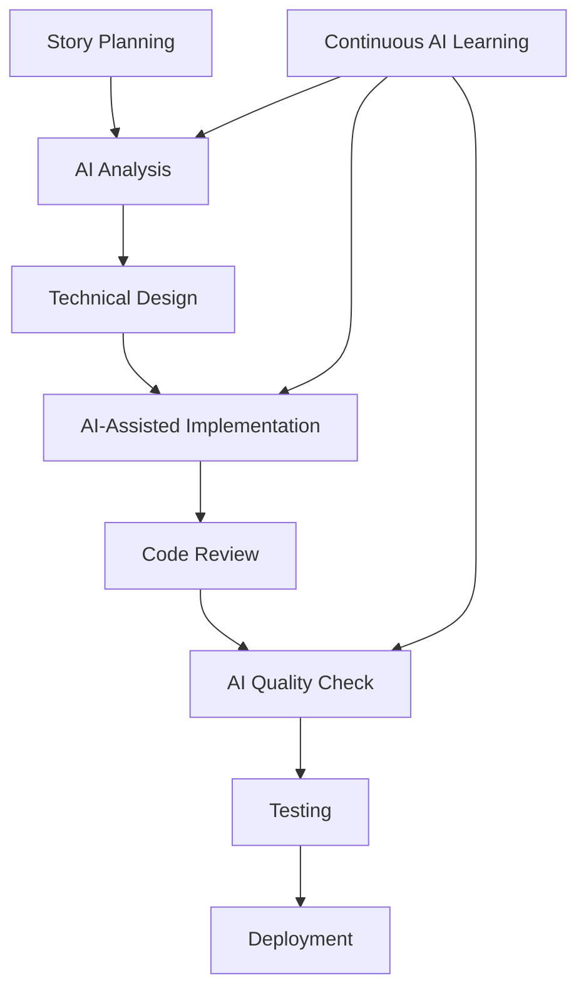

# Agile AI Development Methodology

## Overview
This document defines the Agile AI Development Methodology tailored specifically for AI-assisted development using Claude Code and other AI tools, integrating traditional Agile practices with AI-enhanced workflows.

## Core Principles

### 1. AI-Human Collaboration
- **Human Oversight**: AI suggestions require human review and approval
- **Iterative Refinement**: Continuous improvement of AI prompts and processes
- **Context Preservation**: Maintain conversation history and project context
- **Fail-Fast Mentality**: Quick validation of AI-generated solutions

### 2. Spec-First Development
- **Clear Requirements**: Define specifications before implementation
- **Living Documentation**: Specifications evolve with the project
- **AI-Readable Specs**: Structure specs for optimal AI comprehension
- **Validation Gates**: Regular spec-to-implementation verification

### 3. Continuous Integration of AI Tools
- **Tool Integration**: Seamless integration of AI tools in development workflow
- **Quality Assurance**: AI-generated code undergoes same quality standards
- **Performance Monitoring**: Track AI tool effectiveness and accuracy
- **Adaptation**: Adjust methodologies based on AI capabilities

## Sprint Structure

### Sprint Planning (AI-Enhanced)
**Duration**: 2-4 hours
**Participants**: Product Owner, Scrum Master, Development Team, AI Tools

**Activities**:
1. **Story Refinement with AI**
   - Use Claude Code to analyze user stories
   - Generate acceptance criteria suggestions
   - Identify potential technical challenges

2. **Effort Estimation**
   - AI-assisted complexity analysis
   - Historical data comparison
   - Risk assessment with AI insights

3. **Sprint Goal Definition**
   - Collaborative goal setting
   - AI-generated success metrics
   - Alignment with business objectives

**AI Tools Used**:
- Claude Code for technical analysis
- Automated story point estimation
- Risk assessment algorithms

### Daily Standups (AI-Augmented)
**Duration**: 15 minutes
**Format**: Standard three questions plus AI insights

**Enhanced Questions**:
1. What did I accomplish yesterday?
2. What will I work on today?
3. What impediments do I face?
4. **NEW**: What AI assistance do I need today?
5. **NEW**: What did AI help me accomplish?

**AI Integration**:
- Real-time code quality metrics
- Automated impediment identification
- Suggested solutions for common issues

### Sprint Review (AI-Demonstrated)
**Duration**: 1-2 hours
**Focus**: Demonstrating AI-assisted development outcomes

**Demo Structure**:
1. **Feature Demonstration**
   - Show completed functionality
   - Highlight AI contributions
   - Performance improvements

2. **AI Collaboration Showcase**
   - Examples of successful AI assistance
   - Time savings and quality improvements
   - Lessons learned from AI interactions

3. **Stakeholder Feedback**
   - Gather input on AI-enhanced features
   - Adjust AI integration strategies

### Sprint Retrospective (AI-Analyzed)
**Duration**: 1 hour
**Focus**: Improving human-AI collaboration

**Discussion Topics**:
- AI tool effectiveness
- Human-AI workflow optimization
- Quality of AI-generated code
- Areas for AI improvement

**AI Analytics**:
- Code quality metrics analysis
- Development velocity trends
- AI suggestion acceptance rates
- Error pattern identification

## User Story Templates

### Standard User Story (AI-Enhanced)
```gherkin
As a [user type]
I want [functionality]
So that [business value]

AI Context:
- Complexity Level: [Low/Medium/High]
- AI Assistance Areas: [List applicable areas]
- Related Components: [System components involved]

Acceptance Criteria:
Given [initial context]
When [action performed]
Then [expected result]

Technical Considerations (AI-Generated):
- [Technical requirement 1]
- [Technical requirement 2]
- [Potential challenges]

Definition of Ready:
- [ ] Story is clear and testable
- [ ] AI analysis completed
- [ ] Dependencies identified
- [ ] Acceptance criteria defined
- [ ] Technical approach validated

Definition of Done:
- [ ] Code implemented and reviewed
- [ ] AI-generated tests passing
- [ ] Documentation updated
- [ ] Security review completed
- [ ] Performance validated
- [ ] Stakeholder acceptance obtained
```

### Technical Debt Story Template
```markdown
# Technical Debt: [Brief Description]

## Current State
[Description of current technical debt]

## Proposed Solution
[AI-suggested solution approach]

## AI Analysis
- **Complexity**: [AI assessment]
- **Impact**: [Performance/maintainability impact]
- **Dependencies**: [Related components]
- **Estimated Effort**: [AI-calculated estimate]

## Success Metrics
- [ ] Code quality improvement
- [ ] Performance enhancement
- [ ] Maintainability increase
- [ ] Test coverage improvement

## Implementation Plan
1. [Step 1] - [AI assistance needed]
2. [Step 2] - [AI assistance needed]
3. [Validation] - [AI verification approach]
```

## AI Tool Integration Framework

### Development Workflow


### Quality Gates
1. **Specification Gate**
   - AI spec analysis and validation
   - Completeness verification
   - Inconsistency detection

2. **Implementation Gate**
   - AI code review
   - Style compliance check
   - Security vulnerability scan

3. **Testing Gate**
   - AI-generated test validation
   - Coverage analysis
   - Performance benchmarking

4. **Deployment Gate**
   - Final AI quality assessment
   - Automated deployment checks
   - Rollback plan validation

## Metrics and KPIs

### Development Velocity
- Story points completed per sprint
- AI-assisted vs manual development time
- Defect reduction rates
- Code quality improvements

### AI Effectiveness
- AI suggestion acceptance rate
- Time saved through AI assistance
- Quality improvement metrics
- Error reduction statistics

### Team Performance
- Sprint goal achievement rate
- Team satisfaction with AI tools
- Learning curve progression
- Collaboration effectiveness

## Risk Management

### AI-Specific Risks
| Risk | Impact | Probability | Mitigation |
|------|--------|-------------|------------|
| AI hallucination in code | High | Medium | Mandatory human review |
| Over-reliance on AI | Medium | High | Regular manual coding practice |
| Context loss | Medium | Medium | Structured context management |
| AI tool unavailability | High | Low | Fallback procedures |

### Mitigation Strategies
1. **Code Review Process**: All AI-generated code requires human review
2. **Testing Standards**: Comprehensive testing of AI-assisted features  
3. **Documentation**: Clear documentation of AI tool usage
4. **Training**: Regular team training on AI tool capabilities and limitations

## Communication Protocols

### Stakeholder Communication
- **Daily**: AI-enhanced progress reports
- **Weekly**: Sprint progress with AI metrics
- **Monthly**: AI tool effectiveness assessment
- **Quarterly**: Methodology refinement based on data

### Team Communication
- **Slack Integration**: AI tool status and updates
- **Wiki Updates**: Continuous documentation updates
- **Knowledge Sharing**: Regular AI best practice sessions
- **Feedback Loops**: Continuous improvement discussions

## Adaptation Guidelines

### Methodology Evolution
- Monthly retrospective on AI methodology effectiveness
- Quarterly adjustment of AI tool integration
- Annual comprehensive methodology review
- Continuous learning from AI advancements

### Tool Evaluation
- Regular assessment of new AI tools
- Pilot programs for promising technologies
- Cost-benefit analysis of AI tool adoption
- Integration planning for approved tools

---

*This Agile AI Development Methodology provides a structured approach to integrating AI tools into traditional Agile practices while maintaining quality standards and team effectiveness.*