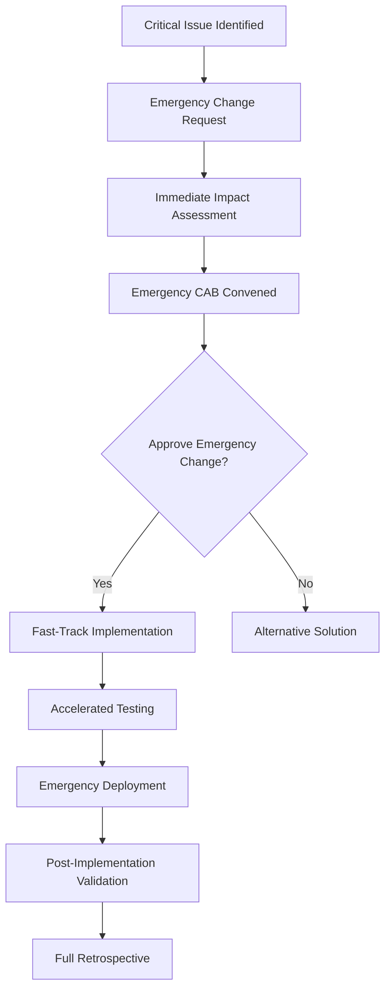

# Change Management Process

## Overview
This document defines the comprehensive change management process for AI-assisted development projects, ensuring controlled, traceable, and quality-driven changes while leveraging AI tools for analysis, validation, and implementation.

## Change Management Philosophy

### Core Principles
1. **AI-Enhanced Analysis**: Leverage AI for impact assessment and risk analysis
2. **Controlled Implementation**: Structured approach to change implementation
3. **Stakeholder Engagement**: Transparent communication throughout the process
4. **Quality Assurance**: Rigorous testing and validation at every stage
5. **Continuous Learning**: Capture and apply lessons from each change

### Change Categories
```yaml
Change_Types:
  Emergency:
    Description: "Critical fixes requiring immediate implementation"
    Approval_Time: "< 2 hours"
    Testing: "Minimal, post-implementation validation"
    
  Standard:
    Description: "Planned changes following normal process"
    Approval_Time: "2-5 business days"
    Testing: "Full testing cycle required"
    
  Major:
    Description: "Significant changes affecting architecture or business logic"
    Approval_Time: "1-2 weeks"
    Testing: "Comprehensive testing and validation"
    
  Normal:
    Description: "Low-risk, routine changes"
    Approval_Time: "1-2 business days"
    Testing: "Standard testing protocols"
```

## Change Management Workflow

### Phase 1: Change Request Initiation

#### Step 1.1: Request Submission
**Duration**: 15-30 minutes
**Responsible**: Change Requester

1. **Change Request Form Completion**:
   ```markdown
   # Change Request Form
   
   ## Basic Information
   - **Request ID**: CR-[YYYY]-[NNNN]
   - **Requester**: [Name and role]
   - **Date**: [Submission date]
   - **Priority**: [Low/Medium/High/Critical]
   - **Change Type**: [Emergency/Standard/Major/Normal]
   
   ## Change Description
   - **Title**: [Brief, descriptive title]
   - **Description**: [Detailed description of the change]
   - **Business Justification**: [Why this change is needed]
   - **Expected Benefits**: [Quantifiable benefits]
   
   ## Technical Details
   - **Affected Systems**: [List all affected components]
   - **Affected Components**: [EventBus, plugins, terminal interface, etc.]
   - **Dependencies**: [Other systems or changes this depends on]
   - **Integration Points**: [External systems affected]
   
   ## Implementation Details
   - **Proposed Solution**: [High-level solution approach]
   - **Alternative Solutions**: [Other options considered]
   - **Resource Requirements**: [People, time, tools needed]
   - **Implementation Timeline**: [Proposed schedule]
   
   ## Risk Assessment
   - **Potential Risks**: [Identified risks and impacts]
   - **Mitigation Strategies**: [How risks will be addressed]
   - **Rollback Plan**: [How to undo the change if needed]
   
   ## Testing Requirements
   - **Testing Strategy**: [How the change will be tested]
   - **Acceptance Criteria**: [Criteria for successful implementation]
   - **User Acceptance Testing**: [UAT requirements if applicable]
   ```

#### Step 1.2: AI-Assisted Initial Analysis
**Duration**: 10-15 minutes
**Responsible**: AI System + Change Coordinator

1. **Automated Impact Assessment**:
   ```python
   class ChangeImpactAnalyzer:
       def __init__(self, ai_client, codebase_analyzer):
           self.ai_client = ai_client
           self.codebase_analyzer = codebase_analyzer
           
       async def analyze_change_request(self, change_request: ChangeRequest) -> ImpactAnalysis:
           """AI-powered analysis of change request impact"""
           
           # Analyze current system state
           system_state = await self.codebase_analyzer.get_system_state()
           
           analysis_prompt = f"""
           Analyze this change request for impact and risk:
           
           Change Request: {change_request.description}
           Affected Components: {change_request.affected_components}
           Current System State: {system_state.summary}
           
           Provide analysis for:
           1. Technical impact on Chat App architecture
           2. Risk assessment (High/Medium/Low) with justification
           3. Dependencies and integration points
           4. Estimated effort (hours)
           5. Testing requirements
           6. Potential conflicts with ongoing changes
           7. Resource requirements
           
           Consider Chat App specific factors:
           - EventBus system implications
           - Plugin compatibility
           - Terminal interface impact
           - Configuration changes needed
           - State management effects
           """
           
           return await self.ai_client.analyze_impact(analysis_prompt)
   ```

2. **Risk Classification**:
   ```yaml
   Risk_Assessment_Criteria:
     High_Risk:
       - Changes to EventBus core functionality
       - Plugin system architecture modifications
       - Security-related changes
       - Database schema modifications
       - Breaking API changes
       
     Medium_Risk:
       - New plugin implementations
       - Terminal interface modifications
       - Configuration system changes
       - Performance optimizations
       - Integration with new AI tools
       
     Low_Risk:
       - Documentation updates
       - Logging improvements
       - Non-breaking feature additions
       - UI styling changes
       - Test coverage improvements
   ```

### Phase 2: Change Assessment and Planning

#### Step 2.1: Technical Review
**Duration**: 1-4 hours (depending on complexity)
**Responsible**: Technical Team + AI Assistant

1. **Architecture Impact Analysis**:
   ```markdown
   ## Technical Review Checklist
   
   ### System Architecture Review
   - [ ] EventBus system impact assessed
   - [ ] Plugin compatibility verified
   - [ ] Terminal interface implications understood
   - [ ] State management changes identified
   - [ ] Configuration modifications documented
   
   ### Code Quality Assessment
   - [ ] Code quality standards compliance
   - [ ] Testing strategy defined
   - [ ] Security implications reviewed
   - [ ] Performance impact evaluated
   - [ ] Documentation requirements identified
   
   ### Integration Analysis
   - [ ] External API dependencies reviewed
   - [ ] Third-party service impacts assessed
   - [ ] Data migration requirements identified
   - [ ] Backward compatibility maintained
   - [ ] Deployment strategy defined
   ```

2. **AI-Enhanced Technical Validation**:
   ```python
   async def validate_technical_feasibility(change_request: ChangeRequest) -> ValidationReport:
       """AI validation of technical feasibility"""
       
       validation_prompt = f"""
       Validate the technical feasibility of this change:
       
       Proposed Change: {change_request.technical_details}
       Current Architecture: {get_current_architecture()}
       
       Evaluate:
       1. Technical feasibility (1-10 scale)
       2. Architectural alignment
       3. Implementation complexity
       4. Resource requirements accuracy
       5. Timeline realism
       6. Risk mitigation completeness
       
       Provide specific recommendations for:
       - Implementation approach optimization
       - Risk mitigation improvements
       - Timeline adjustments
       - Resource allocation
       """
       
       return await ai_client.validate(validation_prompt)
   ```

#### Step 2.2: Business Impact Assessment
**Duration**: 30-60 minutes
**Responsible**: Product Owner + Business Stakeholders

1. **Business Value Analysis**:
   ```yaml
   Business_Impact_Framework:
     Value_Metrics:
       - User experience improvement
       - Development productivity gains
       - Cost reduction potential
       - Revenue impact
       - Competitive advantage
       
     Risk_Metrics:
       - Business continuity risk
       - Customer impact
       - Revenue at risk
       - Compliance implications
       - Market timing considerations
   ```

2. **Stakeholder Impact Matrix**:
   ```markdown
   | Stakeholder Group | Impact Level | Engagement Strategy | Communication Frequency |
   |------------------|--------------|-------------------|----------------------|
   | Development Team | High | Direct involvement | Daily updates |
   | End Users | Medium | Beta testing | Weekly progress |
   | Management | Medium | Progress reports | Bi-weekly status |
   | Support Team | Low | Training sessions | As needed |
   ```

### Phase 3: Change Approval Process

#### Step 3.1: Change Advisory Board (CAB) Review
**Duration**: 1-2 hours
**Responsible**: CAB Members

1. **CAB Composition**:
   ```yaml
   Change_Advisory_Board:
     Core_Members:
       - Technical Lead (mandatory)
       - Product Owner (mandatory)  
       - Quality Assurance Lead (mandatory)
       - DevOps Engineer (if infrastructure changes)
       
     Extended_Members:
       - Security Officer (for security changes)
       - Customer Support Lead (for user-facing changes)
       - Business Stakeholder (for major changes)
   ```

2. **AI-Assisted Decision Support**:
   ```python
   class CABDecisionSupport:
       async def generate_recommendation(self, change_request: ChangeRequest) -> Recommendation:
           """AI-generated recommendation for CAB"""
           
           recommendation_prompt = f"""
           Generate a change approval recommendation based on:
           
           Change Details: {change_request.summary}
           Impact Analysis: {change_request.impact_analysis}
           Risk Assessment: {change_request.risk_assessment}
           Resource Plan: {change_request.resource_plan}
           
           Consider:
           1. Risk vs benefit analysis
           2. Resource availability
           3. Timeline feasibility
           4. Strategic alignment
           5. Dependencies and conflicts
           
           Provide:
           1. Recommendation (Approve/Reject/Defer/Request More Info)
           2. Justification for recommendation
           3. Conditions for approval (if applicable)
           4. Alternative approaches (if rejection)
           5. Risk mitigation requirements
           """
           
           return await self.ai_client.generate_recommendation(recommendation_prompt)
   ```

#### Step 3.2: Approval Decision
**Duration**: 30 minutes
**Responsible**: CAB Chair

1. **Decision Matrix**:
   ```yaml
   Approval_Criteria:
     Automatic_Approval:
       - Low risk changes
       - Standard change procedures followed
       - All quality gates passed
       - Adequate testing planned
       
     Conditional_Approval:
       - Medium risk with strong mitigation
       - Resource constraints requiring schedule adjustment
       - Dependencies requiring coordination
       
     Rejection_Reasons:
       - High risk without adequate mitigation
       - Insufficient business justification
       - Resource conflicts with higher priority changes
       - Technical feasibility concerns
   ```

### Phase 4: Implementation Planning

#### Step 4.1: Implementation Strategy Development
**Duration**: 1-3 hours
**Responsible**: Technical Lead + AI Assistant

1. **AI-Generated Implementation Plan**:
   ```python
   async def generate_implementation_plan(approved_change: ApprovedChange) -> ImplementationPlan:
       """AI-assisted implementation planning"""
       
       planning_prompt = f"""
       Create detailed implementation plan for approved change:
       
       Change: {approved_change.description}
       Requirements: {approved_change.requirements}
       Constraints: {approved_change.constraints}
       
       Generate plan including:
       1. Task breakdown structure
       2. Implementation sequence
       3. Resource allocation
       4. Timeline with milestones
       5. Quality checkpoints
       6. Risk monitoring points
       7. Communication schedule
       8. Rollback procedures
       
       Follow Chat App development patterns:
       - EventBus integration approach
       - Plugin development lifecycle
       - Testing strategy alignment
       - Configuration management
       """
       
       return await self.ai_client.generate_plan(planning_prompt)
   ```

2. **Resource Allocation**:
   ```yaml
   Resource_Planning:
     Development_Team:
       - Senior Developer: [X] hours
       - AI Integration Specialist: [Y] hours
       - QA Engineer: [Z] hours
       
     AI_Tools:
       - Claude Code: Implementation assistance
       - Automated Testing: Quality validation
       - Performance Analysis: Optimization
       
     Infrastructure:
       - Development Environment: [Requirements]
       - Testing Environment: [Requirements]
       - Staging Environment: [Requirements]
   ```

#### Step 4.2: Quality Assurance Planning
**Duration**: 30-60 minutes
**Responsible**: QA Lead + AI Assistant

1. **Testing Strategy**:
   ```markdown
   ## Testing Plan
   
   ### Unit Testing
   - New code coverage: >90%
   - Modified code regression testing
   - AI-generated test cases validation
   
   ### Integration Testing
   - EventBus interaction testing
   - Plugin compatibility verification
   - External API integration testing
   
   ### System Testing
   - End-to-end workflow validation
   - Performance impact assessment
   - Security testing for changes
   
   ### User Acceptance Testing
   - Stakeholder validation scenarios
   - Business requirement verification
   - User experience validation
   ```

### Phase 5: Implementation Execution

#### Step 5.1: Development Phase
**Duration**: Variable based on change scope
**Responsible**: Development Team

1. **AI-Assisted Development**:
   ```python
   class ChangeImplementationAssistant:
       async def guide_implementation(self, implementation_plan: ImplementationPlan) -> DevelopmentGuidance:
           """Provide AI guidance during implementation"""
           
           guidance_prompt = f"""
           Provide implementation guidance for:
           
           Plan: {implementation_plan.tasks}
           Current Progress: {get_current_progress()}
           
           For each remaining task:
           1. Implementation approach
           2. Code patterns to follow
           3. Integration considerations
           4. Quality checkpoints
           5. Testing requirements
           6. Documentation needs
           
           Focus on Chat App specific patterns:
           - EventBus integration
           - Plugin compatibility
           - Async/await patterns
           - Configuration management
           """
           
           return await self.ai_client.provide_guidance(guidance_prompt)
   ```

2. **Progress Monitoring**:
   ```yaml
   Implementation_Checkpoints:
     Daily_Standup:
       - Progress against plan
       - Impediments and risks
       - AI assistance effectiveness
       - Quality metrics review
       
     Weekly_Review:
       - Milestone completion
       - Quality gate results
       - Stakeholder feedback
       - Plan adjustments needed
   ```

#### Step 5.2: Testing and Validation
**Duration**: 20-40% of implementation time
**Responsible**: QA Team + AI Tools

1. **AI-Enhanced Testing**:
   ```python
   class ChangeTestingCoordinator:
       async def execute_test_plan(self, change_implementation: Implementation) -> TestResults:
           """AI-coordinated testing execution"""
           
           # Generate additional test cases
           additional_tests = await self.ai_client.generate_edge_case_tests(
               implementation=change_implementation,
               existing_tests=get_existing_tests()
           )
           
           # Execute comprehensive test suite
           test_results = await self.test_executor.run_all_tests(
               unit_tests=change_implementation.unit_tests,
               integration_tests=change_implementation.integration_tests,
               additional_tests=additional_tests
           )
           
           # AI analysis of test results
           analysis = await self.ai_client.analyze_test_results(test_results)
           
           return TestResults(
               results=test_results,
               analysis=analysis,
               recommendations=analysis.improvement_recommendations
           )
   ```

### Phase 6: Deployment and Post-Implementation

#### Step 6.1: Deployment Execution
**Duration**: 30 minutes - 2 hours
**Responsible**: DevOps Team + Development Team

1. **AI-Monitored Deployment**:
   ```python
   class SmartDeploymentMonitor:
       async def monitor_deployment(self, deployment: Deployment) -> DeploymentStatus:
           """AI-powered deployment monitoring"""
           
           # Monitor key metrics during deployment
           metrics = await self.collect_deployment_metrics(deployment)
           
           # AI analysis of deployment health
           health_analysis = await self.ai_client.analyze_deployment_health(
               metrics=metrics,
               baseline=self.baseline_metrics,
               thresholds=self.health_thresholds
           )
           
           # Automatic rollback trigger if critical issues detected
           if health_analysis.critical_issues:
               await self.trigger_rollback(deployment, health_analysis.issues)
           
           return DeploymentStatus(
               status=health_analysis.status,
               metrics=metrics,
               issues=health_analysis.issues,
               recommendations=health_analysis.recommendations
           )
   ```

#### Step 6.2: Post-Implementation Review
**Duration**: 1-2 hours
**Responsible**: Change Implementation Team

1. **Success Measurement**:
   ```yaml
   Success_Criteria_Validation:
     Technical_Metrics:
       - All acceptance criteria met: [Yes/No]
       - Performance benchmarks achieved: [Yes/No]
       - Quality gates passed: [Yes/No]
       - Security requirements satisfied: [Yes/No]
       
     Business_Metrics:
       - Expected benefits realized: [Percentage]
       - User satisfaction maintained/improved: [Score]
       - No critical issues introduced: [Yes/No]
       - Timeline and budget adherence: [Percentage]
   ```

2. **Lessons Learned Capture**:
   ```python
   async def capture_lessons_learned(change_implementation: CompletedChange) -> LessonsLearned:
       """AI-assisted lessons learned extraction"""
       
       lessons_prompt = f"""
       Extract lessons learned from this change implementation:
       
       Change: {change_implementation.summary}
       Original Plan: {change_implementation.original_plan}
       Actual Execution: {change_implementation.execution_details}
       Issues Encountered: {change_implementation.issues}
       Outcomes: {change_implementation.outcomes}
       
       Identify:
       1. What worked well and should be replicated
       2. What could be improved in future changes
       3. Process improvements needed
       4. AI tool effectiveness and optimization
       5. Risk mitigation effectiveness
       6. Resource planning accuracy
       
       Provide actionable recommendations for:
       - Process improvements
       - Tool enhancements
       - Team skill development
       - Communication optimization
       """
       
       return await self.ai_client.extract_lessons(lessons_prompt)
   ```

## Change Management Metrics and KPIs

### Process Efficiency Metrics
```yaml
Efficiency_Metrics:
  Change_Cycle_Time:
    Target: "< 5 business days for standard changes"
    Measurement: "Request submission to deployment completion"
    
  Approval_Time:
    Target: "< 2 business days for standard changes"
    Measurement: "CAB review to approval decision"
    
  Implementation_Accuracy:
    Target: "> 95% first-time implementation success"
    Measurement: "Changes implemented without rework"
    
  Rollback_Rate:
    Target: "< 2% of all changes"
    Measurement: "Changes requiring rollback due to issues"
```

### Quality Metrics
```yaml
Quality_Metrics:
  Change_Success_Rate:
    Target: "> 98% successful implementations"
    Measurement: "Changes meeting all acceptance criteria"
    
  Defect_Introduction_Rate:
    Target: "< 0.5 defects per change"
    Measurement: "Production defects traced to changes"
    
  Stakeholder_Satisfaction:
    Target: "> 8.5/10 satisfaction score"
    Measurement: "Post-implementation stakeholder feedback"
    
  AI_Assistance_Effectiveness:
    Target: "> 85% helpful AI recommendations"
    Measurement: "AI recommendation acceptance rate"
```

## Emergency Change Procedures

### Emergency Change Workflow


### Emergency Change Criteria
```yaml
Emergency_Change_Criteria:
  Qualifying_Conditions:
    - System down or critical functionality unavailable
    - Security vulnerability requiring immediate patching
    - Data corruption or loss prevention
    - Regulatory compliance deadline
    - Customer SLA breach imminent
    
  Fast_Track_Approvals:
    - Technical Lead + Product Owner approval sufficient
    - Post-implementation CAB review required
    - Accelerated but not eliminated testing
    - Enhanced monitoring during deployment
```

## Continuous Improvement

### Process Optimization
```python
class ChangeProcessOptimizer:
    async def analyze_process_performance(self, period: TimePeriod) -> OptimizationReport:
        """AI analysis of change process performance"""
        
        performance_data = await self.collect_process_metrics(period)
        
        optimization_prompt = f"""
        Analyze change management process performance:
        
        Metrics: {performance_data.metrics}
        Issues: {performance_data.issues}
        Feedback: {performance_data.stakeholder_feedback}
        
        Identify:
        1. Process bottlenecks and delays
        2. Quality issues and root causes
        3. Resource utilization inefficiencies
        4. AI tool effectiveness gaps
        5. Communication improvement opportunities
        
        Recommend:
        1. Process workflow optimizations
        2. Tool integration improvements
        3. Team skill development areas
        4. Automation opportunities
        5. Metric tracking enhancements
        """
        
        return await self.ai_client.analyze_optimization(optimization_prompt)
```

### Knowledge Management
```yaml
Knowledge_Management:
  Change_Repository:
    - All change requests and outcomes stored
    - Searchable by category, impact, technology
    - AI-powered similar change recommendations
    
  Best_Practices_Database:
    - Successful implementation patterns
    - Risk mitigation strategies
    - Testing approaches by change type
    - AI prompt libraries for common scenarios
    
  Training_Materials:
    - Process training for new team members
    - AI tool usage guidelines
    - Emergency procedure drills
    - Stakeholder communication templates
```

---

*This change management process ensures controlled, quality-driven changes while leveraging AI assistance for enhanced analysis, validation, and implementation efficiency.*