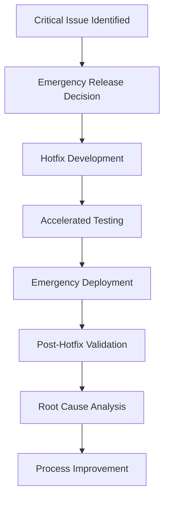

# Release Management Process

## Overview
This document defines the comprehensive release management process for AI-assisted development projects, ensuring reliable, coordinated, and quality-driven software releases while leveraging AI tools for planning, validation, and deployment optimization.

## Release Management Philosophy

### Core Principles
1. **Predictable Release Cycles**: Consistent, reliable release scheduling
2. **Quality First**: No release without meeting quality standards
3. **AI-Enhanced Planning**: Leverage AI for release planning and risk assessment
4. **Continuous Integration**: Seamless integration of changes throughout development
5. **Stakeholder Transparency**: Clear communication and visibility into release status

### Release Types
```yaml
Release_Categories:
  Major_Release:
    Version_Pattern: "X.0.0"
    Frequency: "Quarterly"
    Content: "New features, architecture changes, breaking changes"
    Planning_Time: "6-8 weeks"
    Testing_Duration: "2-3 weeks"
    
  Minor_Release:
    Version_Pattern: "X.Y.0"
    Frequency: "Monthly"
    Content: "Feature enhancements, non-breaking improvements"
    Planning_Time: "3-4 weeks"
    Testing_Duration: "1-2 weeks"
    
  Patch_Release:
    Version_Pattern: "X.Y.Z"
    Frequency: "As needed"
    Content: "Bug fixes, security patches, small improvements"
    Planning_Time: "1 week"
    Testing_Duration: "3-5 days"
    
  Hotfix_Release:
    Version_Pattern: "X.Y.Z-hotfix"
    Frequency: "Emergency only"
    Content: "Critical bug fixes, security vulnerabilities"
    Planning_Time: "< 24 hours"
    Testing_Duration: "< 8 hours"
```

## Release Management Workflow

### Phase 1: Release Planning

#### Step 1.1: Release Scope Definition
**Duration**: 3-5 days
**Responsible**: Product Owner + Technical Lead + AI Assistant

1. **AI-Assisted Feature Prioritization**:
   ```python
   class ReleaseFeaturePrioritizer:
       def __init__(self, ai_client):
           self.ai_client = ai_client
           
       async def prioritize_features(self, candidate_features: List[Feature]) -> PrioritizedReleaseScope:
           """AI-assisted feature prioritization for release"""
           
           prioritization_prompt = f"""
           Prioritize features for upcoming release based on:
           
           Candidate Features: {candidate_features}
           Release Type: {self.release_type}
           Available Capacity: {self.team_capacity}
           Business Objectives: {self.business_objectives}
           Technical Constraints: {self.technical_constraints}
           
           Consider:
           1. Business value and user impact
           2. Technical complexity and risk
           3. Dependencies between features
           4. Resource requirements and team capacity
           5. Integration with Chat App architecture (EventBus, plugins)
           6. Testing requirements and complexity
           
           Provide:
           1. Recommended feature set with priority scores
           2. Risk assessment for each feature
           3. Dependency analysis and sequencing
           4. Resource allocation recommendations
           5. Alternative scope options (MVP, extended)
           """
           
           return await self.ai_client.prioritize(prioritization_prompt)
   ```

2. **Release Scope Documentation**:
   ```markdown
   # Release [Version] Scope Document
   
   ## Release Overview
   - **Version**: [X.Y.Z]
   - **Release Date**: [Target date]
   - **Release Type**: [Major/Minor/Patch/Hotfix]
   - **Theme**: [Release focus/theme]
   
   ## Included Features
   ### High Priority (Must Have)
   - [Feature 1]: [Description, business value, effort estimate]
   - [Feature 2]: [Description, business value, effort estimate]
   
   ### Medium Priority (Should Have)
   - [Feature 3]: [Description, business value, effort estimate]
   - [Feature 4]: [Description, business value, effort estimate]
   
   ### Low Priority (Could Have)
   - [Feature 5]: [Description, business value, effort estimate]
   
   ## Excluded from This Release
   - [Deferred Feature 1]: [Reason for deferral, target release]
   - [Deferred Feature 2]: [Reason for deferral, target release]
   
   ## Technical Considerations
   - **Architecture Changes**: [Any architectural impacts]
   - **Breaking Changes**: [List of breaking changes if any]
   - **Dependencies**: [External dependencies or prerequisites]
   - **Migration Requirements**: [Data or configuration migrations needed]
   
   ## Success Criteria
   - [Measurable success criterion 1]
   - [Measurable success criterion 2]
   - [Performance benchmarks to maintain]
   - [Quality gates to pass]
   ```

#### Step 1.2: Release Planning and Scheduling
**Duration**: 2-3 days
**Responsible**: Scrum Master + Technical Lead

1. **AI-Generated Release Timeline**:
   ```python
   async def generate_release_timeline(release_scope: ReleaseScope) -> ReleaseTimeline:
       """AI-assisted release timeline generation"""
       
       timeline_prompt = f"""
       Generate detailed release timeline for:
       
       Features: {release_scope.features}
       Team Capacity: {get_team_capacity()}
       Historical Velocity: {get_historical_velocity()}
       Dependencies: {release_scope.dependencies}
       
       Consider:
       1. Development phases (design, implementation, testing)
       2. Integration points and dependencies
       3. Quality gates and review checkpoints
       4. Buffer time for risk mitigation
       5. Holiday and availability constraints
       6. AI-assisted development acceleration factors
       
       Provide:
       1. Detailed milestone schedule
       2. Critical path analysis
       3. Risk-adjusted timeline with buffers
       4. Resource allocation by phase
       5. Quality gate schedule
       6. Contingency plans for delays
       """
       
       return await self.ai_client.generate_timeline(timeline_prompt)
   ```

2. **Release Calendar Integration**:
   ```yaml
   Release_Calendar:
     Code_Freeze: "2 weeks before release"
     Feature_Complete: "3 weeks before release"
     Alpha_Release: "4 weeks before release"
     Beta_Release: "2 weeks before release"
     Release_Candidate: "1 week before release"
     Production_Release: "Release date"
     Post_Release_Support: "1 week after release"
   ```

### Phase 2: Development Coordination

#### Step 2.1: Development Tracking
**Duration**: Throughout development phase
**Responsible**: Technical Lead + Scrum Master

1. **AI-Enhanced Progress Monitoring**:
   ```python
   class ReleaseProgressMonitor:
       async def assess_release_progress(self, release_plan: ReleasePlan) -> ProgressAssessment:
           """AI assessment of release progress and health"""
           
           current_state = await self.collect_current_metrics()
           
           progress_prompt = f"""
           Assess release progress and predict completion:
           
           Original Plan: {release_plan.timeline}
           Current Progress: {current_state.progress}
           Velocity Metrics: {current_state.velocity}
           Quality Metrics: {current_state.quality}
           Issues and Blockers: {current_state.issues}
           
           Analyze:
           1. Likelihood of meeting release date (probability)
           2. Critical path items at risk
           3. Quality trend analysis
           4. Resource utilization efficiency
           5. Emerging risks and dependencies
           
           Recommend:
           1. Scope adjustments if needed
           2. Resource reallocation options
           3. Risk mitigation strategies
           4. Communication priorities
           5. Contingency activation triggers
           """
           
           return await self.ai_client.assess_progress(progress_prompt)
   ```

2. **Weekly Release Health Reports**:
   ```yaml
   Release_Health_Dashboard:
     Overall_Status: "Green/Yellow/Red"
     
     Progress_Metrics:
       Features_Complete: "[X] of [Y] features (Z%)"
       Story_Points_Complete: "[X] of [Y] points (Z%)"
       Velocity_Trend: "Above/At/Below target"
       Quality_Score: "[Score]/10"
       
     Risk_Indicators:
       Critical_Path_Delays: "[Number] items delayed"
       Quality_Gate_Failures: "[Number] failed gates"
       Resource_Constraints: "[Description]"
       External_Dependencies: "[Status]"
       
     Recommendations:
       Scope_Adjustments: "[Recommended changes]"
       Resource_Actions: "[Resource recommendations]"
       Risk_Mitigations: "[Active mitigations]"
   ```

#### Step 2.2: Quality Assurance Coordination
**Duration**: Throughout development phase
**Responsible**: QA Lead + AI Testing Tools

1. **AI-Enhanced Test Planning**:
   ```python
   class ReleaseTestCoordinator:
       async def plan_release_testing(self, release_features: List[Feature]) -> TestPlan:
           """AI-assisted comprehensive test planning"""
           
           test_planning_prompt = f"""
           Create comprehensive test plan for release features:
           
           Features: {release_features}
           Architecture: Chat App (EventBus, plugins, terminal interface)
           Integration Points: {get_integration_points()}
           Performance Requirements: {get_performance_requirements()}
           
           Generate test strategy covering:
           1. Unit test requirements and coverage targets
           2. Integration test scenarios (EventBus interactions)
           3. End-to-end user workflow testing
           4. Performance and load testing approach
           5. Security testing for new features
           6. Regression testing scope
           7. Plugin compatibility testing
           8. Terminal interface testing scenarios
           
           Include:
           - Test execution timeline
           - Resource requirements
           - Tool and environment needs
           - Risk-based test prioritization
           - Automation opportunities
           """
           
           return await self.ai_client.plan_testing(test_planning_prompt)
   ```

### Phase 3: Pre-Release Activities

#### Step 3.1: Code Freeze and Stabilization
**Duration**: 1-2 weeks before release
**Responsible**: Technical Lead + Development Team

1. **Code Freeze Preparation**:
   ```markdown
   ## Code Freeze Checklist
   
   ### Pre-Freeze Activities (48 hours before)
   - [ ] All feature development completed
   - [ ] Code review backlog cleared
   - [ ] Integration testing completed
   - [ ] Performance benchmarks validated
   - [ ] Security scans passed
   - [ ] Documentation updated
   
   ### Freeze Implementation
   - [ ] Release branch created from main
   - [ ] Branch protection rules activated
   - [ ] Only critical bug fixes allowed
   - [ ] All changes require release manager approval
   
   ### Stabilization Activities
   - [ ] Comprehensive regression testing
   - [ ] Performance validation
   - [ ] Security final validation
   - [ ] User acceptance testing
   - [ ] Production readiness review
   ```

2. **AI-Assisted Release Readiness Assessment**:
   ```python
   async def assess_release_readiness(release_branch: str) -> ReadinessAssessment:
       """AI assessment of release readiness"""
       
       # Collect comprehensive metrics
       code_metrics = await self.collect_code_metrics(release_branch)
       test_metrics = await self.collect_test_metrics(release_branch)
       quality_metrics = await self.collect_quality_metrics(release_branch)
       
       readiness_prompt = f"""
       Assess release readiness for Chat App release:
       
       Code Metrics: {code_metrics}
       Test Results: {test_metrics}
       Quality Metrics: {quality_metrics}
       Outstanding Issues: {get_outstanding_issues()}
       
       Evaluate:
       1. Code quality and stability (1-10 scale)
       2. Test coverage and pass rates
       3. Performance benchmark compliance
       4. Security posture assessment
       5. Outstanding issue criticality
       6. Risk level for production deployment
       
       Provide:
       1. Go/No-Go recommendation with confidence level
       2. Critical issues that must be resolved
       3. Risk mitigation requirements
       4. Monitoring requirements for release
       5. Rollback readiness assessment
       """
       
       return await self.ai_client.assess_readiness(readiness_prompt)
   ```

#### Step 3.2: Release Candidate Preparation
**Duration**: 3-5 days before release
**Responsible**: DevOps Team + QA Team

1. **Release Candidate Build**:
   ```yaml
   Release_Candidate_Process:
     Build_Generation:
       - Clean build from release branch
       - Version tagging and artifact generation
       - Security signature and validation
       - Deployment package preparation
       
     Validation_Tests:
       - Smoke testing in staging environment
       - Performance validation
       - Security penetration testing
       - User acceptance testing
       - Integration testing with production-like data
       
     Stakeholder_Review:
       - Product owner final review
       - Technical stakeholder sign-off
       - Business stakeholder validation
       - Support team readiness confirmation
   ```

### Phase 4: Release Execution

#### Step 4.1: Production Deployment
**Duration**: 2-4 hours
**Responsible**: DevOps Team + Technical Lead

1. **AI-Monitored Deployment Process**:
   ```python
   class SmartReleaseDeployment:
       async def execute_release_deployment(self, release_candidate: ReleaseCandidate) -> DeploymentResult:
           """AI-monitored release deployment"""
           
           # Pre-deployment validation
           pre_checks = await self.validate_pre_deployment(release_candidate)
           if not pre_checks.all_passed:
               return DeploymentResult(status="ABORTED", issues=pre_checks.failures)
           
           # Execute deployment with real-time monitoring
           deployment = await self.deploy_with_monitoring(release_candidate)
           
           # AI analysis of deployment metrics
           health_analysis = await self.ai_client.analyze_deployment_health(
               metrics=deployment.metrics,
               thresholds=self.health_thresholds,
               historical_baseline=self.baseline_metrics
           )
           
           # Automatic rollback if critical issues detected
           if health_analysis.requires_rollback:
               rollback_result = await self.execute_rollback(deployment)
               return DeploymentResult(
                   status="ROLLED_BACK",
                   issues=health_analysis.critical_issues,
                   rollback_result=rollback_result
               )
           
           return DeploymentResult(
               status="SUCCESS",
               health_score=health_analysis.health_score,
               monitoring_alerts=health_analysis.alerts
           )
   ```

2. **Deployment Monitoring Dashboard**:
   ```yaml
   Deployment_Health_Metrics:
     System_Health:
       - Application response times
       - Error rates and types
       - Memory and CPU utilization
       - Database performance
       
     User_Experience:
       - User session success rates
       - Feature utilization metrics
       - Performance perceived by users
       - Error reporting from client
       
     Business_Metrics:
       - Transaction completion rates
       - Revenue impact tracking
       - User satisfaction indicators
       - Support ticket trends
   ```

#### Step 4.2: Post-Deployment Validation
**Duration**: 4-8 hours after deployment
**Responsible**: QA Team + Development Team

1. **Production Smoke Testing**:
   ```markdown
   ## Production Validation Checklist
   
   ### Immediate Validation (0-2 hours)
   - [ ] Core functionality accessible
   - [ ] User authentication working
   - [ ] Key workflows functioning
   - [ ] Performance within acceptable ranges
   - [ ] No critical errors in logs
   
   ### Extended Validation (2-8 hours)
   - [ ] All new features working as expected
   - [ ] Integration points functioning correctly
   - [ ] Performance under normal load
   - [ ] Monitoring and alerting operational
   - [ ] Rollback procedures validated
   
   ### Business Validation
   - [ ] Key business metrics stable
   - [ ] Customer-facing features working
   - [ ] Support team readiness confirmed
   - [ ] Stakeholder communication completed
   ```

### Phase 5: Post-Release Activities

#### Step 5.1: Release Performance Analysis
**Duration**: 1-2 weeks after release
**Responsible**: Technical Lead + Product Owner

1. **AI-Powered Release Success Analysis**:
   ```python
   async def analyze_release_success(release: CompletedRelease) -> ReleaseAnalysis:
       """AI analysis of release success and lessons learned"""
       
       # Collect comprehensive post-release data
       performance_data = await self.collect_performance_metrics(release)
       user_feedback = await self.collect_user_feedback(release)
       technical_metrics = await self.collect_technical_metrics(release)
       
       analysis_prompt = f"""
       Analyze release success and extract insights:
       
       Release Objectives: {release.original_objectives}
       Performance Data: {performance_data}
       User Feedback: {user_feedback}
       Technical Metrics: {technical_metrics}
       Issues Encountered: {release.issues_log}
       
       Evaluate:
       1. Success against original objectives (percentage)
       2. User satisfaction and adoption metrics
       3. Technical performance vs. expectations
       4. Process effectiveness and efficiency
       5. Quality of AI assistance throughout release
       
       Identify:
       1. What worked exceptionally well
       2. Areas for improvement in future releases
       3. Process optimizations needed
       4. AI tool effectiveness and enhancement opportunities
       5. Team performance insights
       
       Recommend:
       1. Process improvements for next release
       2. Tool and automation enhancements
       3. Team training and development areas
       4. Quality gate optimizations
       """
       
       return await self.ai_client.analyze_release(analysis_prompt)
   ```

#### Step 5.2: Retrospective and Lessons Learned
**Duration**: 2-3 hours
**Responsible**: Release Team + Stakeholders

1. **Structured Retrospective Process**:
   ```yaml
   Retrospective_Agenda:
     Opening: "Set the stage and review release objectives"
     
     Data_Gathering: "What happened during this release?"
     - Timeline review and key events
     - Metrics and performance analysis
     - Issue and resolution tracking
     - Stakeholder feedback collection
     
     Insights_Generation: "Why did things happen the way they did?"
     - Root cause analysis of issues
     - Success factor identification
     - Process effectiveness evaluation
     - AI tool impact assessment
     
     Action_Planning: "What will we do differently next time?"
     - Process improvement actions
     - Tool and automation enhancements
     - Team development priorities
     - Communication optimizations
     
     Closing: "Commit to improvement actions"
     - Action item assignment and ownership
     - Timeline and success criteria definition
     - Follow-up meeting scheduling
   ```

## Release Quality Gates

### Quality Gate Framework
```yaml
Quality_Gates:
  Feature_Complete_Gate:
    Criteria:
      - All planned features implemented
      - Code review completed for all changes
      - Unit test coverage > 90%
      - Integration tests passing
    Approval_Required: "Technical Lead"
    
  Alpha_Release_Gate:
    Criteria:
      - All quality gates passed
      - System testing completed
      - Performance benchmarks met
      - Security scanning completed
    Approval_Required: "QA Lead + Technical Lead"
    
  Beta_Release_Gate:
    Criteria:
      - User acceptance testing completed
      - Performance under load validated
      - Documentation completed
      - Support team trained
    Approval_Required: "Product Owner + QA Lead"
    
  Production_Release_Gate:
    Criteria:
      - All beta feedback addressed
      - Production deployment tested
      - Rollback procedures validated
      - Monitoring and alerting ready
    Approval_Required: "Release Manager + Stakeholders"
```

### AI-Enhanced Quality Validation
```python
class ReleaseQualityValidator:
    async def validate_quality_gate(self, gate_type: str, release_state: ReleaseState) -> GateValidation:
        """AI-enhanced quality gate validation"""
        
        validation_prompt = f"""
        Validate {gate_type} quality gate for Chat App release:
        
        Release State: {release_state}
        Gate Criteria: {self.get_gate_criteria(gate_type)}
        Current Metrics: {release_state.metrics}
        
        Assess:
        1. Compliance with all gate criteria
        2. Risk level for proceeding to next phase
        3. Quality trend analysis
        4. Potential issues and their impact
        5. Readiness for next phase activities
        
        Provide:
        1. Pass/Fail recommendation for each criterion
        2. Overall gate status (PASS/FAIL/CONDITIONAL)
        3. Critical issues requiring resolution
        4. Risk mitigation recommendations
        5. Monitoring requirements for next phase
        """
        
        return await self.ai_client.validate_gate(validation_prompt)
```

## Release Metrics and KPIs

### Release Process Metrics
```yaml
Process_Metrics:
  Release_Frequency:
    Target: "Monthly minor releases, quarterly major releases"
    Measurement: "Actual release intervals vs. planned"
    
  Lead_Time:
    Target: "< 4 weeks from feature complete to production"
    Measurement: "Time from code freeze to production deployment"
    
  Deployment_Success_Rate:
    Target: "> 98% successful deployments"
    Measurement: "Deployments completed without rollback"
    
  Release_Quality:
    Target: "< 0.5 critical issues per release"
    Measurement: "Critical issues found in first 48 hours post-release"
```

### AI Assistance Effectiveness
```yaml
AI_Metrics:
  Planning_Accuracy:
    Target: "> 85% scope prediction accuracy"
    Measurement: "Planned vs. actual release scope delivered"
    
  Risk_Prediction:
    Target: "> 80% risk identification accuracy"
    Measurement: "AI-predicted risks that materialized"
    
  Quality_Prediction:
    Target: "> 90% quality gate prediction accuracy"
    Measurement: "AI predictions vs. actual quality outcomes"
    
  Time_Estimation:
    Target: "< 15% variance in timeline predictions"
    Measurement: "AI timeline estimates vs. actual delivery"
```

## Emergency Release Procedures

### Hotfix Release Process


### Hotfix Approval Criteria
```yaml
Hotfix_Criteria:
  Qualifying_Issues:
    - Production system completely down
    - Critical security vulnerability
    - Data corruption or loss
    - Major customer SLA breach
    - Regulatory compliance violation
    
  Accelerated_Process:
    - Technical Lead + Product Owner approval sufficient
    - Minimal viable testing required
    - Enhanced monitoring during deployment
    - Immediate post-deployment validation
    - Full retrospective within 48 hours
```

## Communication and Stakeholder Management

### Communication Plan
```yaml
Communication_Framework:
  Internal_Stakeholders:
    Development_Team:
      Frequency: "Daily during active development"
      Format: "Stand-ups, progress dashboards"
      Content: "Progress, blockers, quality metrics"
      
    Management:
      Frequency: "Weekly status, milestone updates"
      Format: "Executive reports, dashboard"
      Content: "Progress, risks, business impact"
      
    QA_Team:
      Frequency: "Continuous during testing phases"
      Format: "Test reports, quality dashboards"
      Content: "Test results, quality trends, risks"
      
  External_Stakeholders:
    Customers:
      Frequency: "Release announcements, major updates"
      Format: "Release notes, feature announcements"
      Content: "New features, improvements, migration guides"
      
    Partners:
      Frequency: "Integration impacting releases"
      Format: "Technical communications, API docs"
      Content: "API changes, integration requirements"
```

### Release Communication Templates
```markdown
# Release Status Update Template

## Release [Version] - Week [X] Status

### Overall Status: [Green/Yellow/Red]

### Progress Summary
- **Features Completed**: [X/Y] ([Z]%)
- **Testing Progress**: [Phase] - [X]% complete
- **Quality Score**: [Score]/10
- **Timeline**: [On track/X days ahead/X days behind]

### Key Accomplishments This Week
- [Achievement 1]
- [Achievement 2]
- [Achievement 3]

### Risks and Issues
- **[Risk 1]**: [Description] - [Mitigation plan]
- **[Issue 1]**: [Description] - [Resolution plan]

### Next Week Focus
- [Priority 1]
- [Priority 2]
- [Priority 3]

### Support Needed
- [Resource/decision/clarification needed]

---
*Next update: [Date]*
```

---

*This release management process ensures predictable, high-quality software releases while leveraging AI assistance for enhanced planning, monitoring, and execution efficiency.*