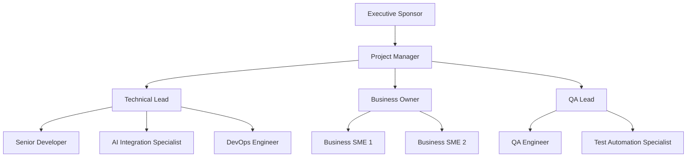

# Project Charter Template

## Document Information

```yaml
Charter_Metadata:
  Project_Name: "[Project Name]"
  Project_Code: "[PRJ-YYYY-NNN]"
  Charter_Version: "1.0"
  Creation_Date: "[YYYY-MM-DD]"
  Charter_Author: "[Project Manager Name]"
  Status: "[Draft/Review/Approved/Active]"
  
Approval_Information:
  Executive_Sponsor: "[Name and Title]"
  Business_Owner: "[Name and Title]"
  Technical_Sponsor: "[Name and Title]"
  Approval_Date: "[YYYY-MM-DD]"
  Charter_Review_Date: "[YYYY-MM-DD]"
  
AI_Enhancement:
  AI_Analysis_Tool: "Claude Code"
  AI_Validation_Date: "[YYYY-MM-DD]"
  AI_Risk_Assessment: "[Risk Level]"
  AI_Success_Probability: "[Percentage]"
```

## Executive Summary

### Project Overview
[Provide a comprehensive 3-4 paragraph executive summary that includes:]
- **Business Problem**: What business challenge or opportunity does this project address?
- **Proposed Solution**: High-level description of the solution approach
- **Strategic Alignment**: How does this project align with organizational strategy and Chat App roadmap?
- **Expected Value**: Quantified business value and benefits expected from the project

### AI-Generated Executive Insights
```yaml
AI_Executive_Analysis:
  Project_Complexity: "[Low/Medium/High] - [AI Assessment Reasoning]"
  Strategic_Impact: "[Low/Medium/High] - [Business impact analysis]"
  Technical_Feasibility: "[High/Medium/Low] - [Technical assessment]"
  Resource_Requirements: "[Light/Moderate/Heavy] - [Resource analysis]"
  Success_Probability: "[Percentage] - [Factors contributing to success/failure]"
  
Key_AI_Recommendations:
  - "[AI recommendation 1 for project success]"
  - "[AI recommendation 2 for risk mitigation]"
  - "[AI recommendation 3 for resource optimization]"
```

### Project Charter Approval
This charter authorizes the project and provides the project manager with the authority to:
- Assign organizational resources to project activities
- Make decisions within defined project scope and constraints
- Coordinate with stakeholders across organizational boundaries
- Manage project budget within approved limits
- Implement changes within approved change management processes

## Business Case and Justification

### Business Problem Statement
**Current State**: [Detailed description of the current situation, pain points, and limitations]

**Impact of Inaction**: [Consequences if the problem is not addressed, including quantified impacts where possible]

**Market/Competitive Drivers**: [External factors driving the need for this project]

**Organizational Drivers**: [Internal strategic initiatives or requirements driving this project]

### Opportunity Analysis
```yaml
Business_Opportunity:
  Market_Opportunity:
    Description: "[Description of market opportunity]"
    Size: "[Quantified market size or impact]"
    Timeline: "[Window of opportunity]"
    Competition: "[Competitive landscape analysis]"
    
  Operational_Opportunity:
    Efficiency_Gains: "[Expected operational efficiency improvements]"
    Cost_Savings: "[Quantified cost savings potential]"
    Quality_Improvements: "[Quality and reliability improvements]"
    Capability_Enhancement: "[New capabilities to be gained]"
    
  Strategic_Opportunity:
    Competitive_Advantage: "[How this creates competitive advantage]"
    Strategic_Alignment: "[Alignment with organizational strategy]"
    Innovation_Potential: "[Innovation and differentiation potential]"
    Future_Foundation: "[How this enables future opportunities]"
```

### Value Proposition and Benefits
```yaml
Expected_Benefits:
  Financial_Benefits:
    Revenue_Impact:
      - Benefit: "[Revenue benefit description]"
        Amount: "$[Amount]"
        Timeline: "[When benefit will be realized]"
        Confidence: "[High/Medium/Low]"
        
    Cost_Savings:
      - Benefit: "[Cost saving description]" 
        Amount: "$[Amount] annually"
        Timeline: "[When savings will begin]"
        Confidence: "[High/Medium/Low]"
        
  Operational_Benefits:
    Efficiency_Improvements:
      - Benefit: "[Efficiency improvement description]"
        Metric: "[Quantified improvement]"
        Timeline: "[Achievement timeline]"
        
    Quality_Improvements:
      - Benefit: "[Quality improvement description]"
        Metric: "[Quantified improvement]"
        Timeline: "[Achievement timeline]"
        
  Strategic_Benefits:
    Capability_Development:
      - Benefit: "[New capability description]"
        Impact: "[Strategic impact]"
        Timeline: "[Development timeline]"
        
    Market_Position:
      - Benefit: "[Market positioning improvement]"
        Impact: "[Competitive advantage gained]"
        Timeline: "[Realization timeline]"
```

### ROI Analysis and Financial Justification
```yaml
Financial_Analysis:
  Investment_Summary:
    Total_Project_Cost: "$[Amount]"
    Development_Costs: "$[Amount]"
    Implementation_Costs: "$[Amount]"
    Ongoing_Operational_Costs: "$[Amount] annually"
    
  Return_Analysis:
    Year_1_Benefits: "$[Amount]"
    Year_2_Benefits: "$[Amount]"  
    Year_3_Benefits: "$[Amount]"
    NPV_3_Years: "$[Net Present Value]"
    IRR: "[Internal Rate of Return]%"
    Payback_Period: "[X] months"
    
  Risk_Adjusted_Analysis:
    Conservative_ROI: "[ROI with 20% risk buffer]"
    Best_Case_ROI: "[ROI with optimal execution]"
    Break_Even_Timeline: "[Time to break even]"
```

## Project Scope and Objectives

### Project Scope Statement
**In Scope**: [Clear definition of what is included in the project]
- [Specific deliverable 1 with clear boundaries]
- [Specific deliverable 2 with clear boundaries]
- [Specific deliverable 3 with clear boundaries]

**Out of Scope**: [Clear definition of what is explicitly excluded]
- [Exclusion 1 with rationale]
- [Exclusion 2 with rationale] 
- [Exclusion 3 with rationale]

**Scope Boundaries**: [Clear boundaries and interfaces with other systems, projects, or organizational functions]

### SMART Objectives
```yaml
Project_Objectives:
  Primary_Objective_1:
    Objective: "[Specific, measurable objective]"
    Metric: "[How success will be measured]"
    Target: "[Specific target value]"
    Timeline: "[Achievement deadline]"
    Responsible: "[Who is accountable]"
    
  Primary_Objective_2:
    Objective: "[Specific, measurable objective]"
    Metric: "[How success will be measured]"
    Target: "[Specific target value]"
    Timeline: "[Achievement deadline]"
    Responsible: "[Who is accountable]"
    
  Secondary_Objective_1:
    Objective: "[Supporting objective]"
    Metric: "[Measurement approach]"
    Target: "[Target value]"
    Timeline: "[Achievement timeline]"
    Responsible: "[Accountable person]"
```

### Success Criteria and KPIs
```yaml
Success_Metrics:
  Business_Success_Criteria:
    - Criterion: "[Business success measure]"
      Target: "[Specific target]"
      Measurement_Method: "[How it will be measured]"
      Timeline: "[When it will be measured]"
      
  Technical_Success_Criteria:
    - Criterion: "[Technical success measure]"
      Target: "[Specific target]"
      Measurement_Method: "[How it will be measured]"
      Timeline: "[When it will be measured]"
      
  User_Experience_Success_Criteria:
    - Criterion: "[UX success measure]"
      Target: "[Specific target]"
      Measurement_Method: "[How it will be measured]"
      Timeline: "[When it will be measured]"
      
Key_Performance_Indicators:
  Leading_Indicators:
    - KPI: "[Predictive metric]"
      Target: "[Target value]"
      Frequency: "[Measurement frequency]"
      
  Lagging_Indicators:
    - KPI: "[Outcome metric]"
      Target: "[Target value]"
      Frequency: "[Measurement frequency]"
```

## Stakeholder Analysis

### Stakeholder Identification and Analysis
```yaml
Stakeholder_Matrix:
  Executive_Stakeholders:
    - Name: "[Executive Name]"
      Title: "[Title]"
      Role: "[Executive Sponsor/Decision Maker/Influencer]"
      Interest_Level: "[High/Medium/Low]"
      Influence_Level: "[High/Medium/Low]"
      Expectations: "[Key expectations and concerns]"
      Communication_Preference: "[Preferred communication method]"
      Engagement_Strategy: "[How to engage this stakeholder]"
      
  Business_Stakeholders:
    - Name: "[Business User Name]"
      Title: "[Title]"
      Role: "[Business Owner/Subject Matter Expert/End User]"
      Interest_Level: "[High/Medium/Low]"
      Influence_Level: "[High/Medium/Low]"
      Expectations: "[Key expectations and concerns]"
      Communication_Preference: "[Preferred communication method]"
      Engagement_Strategy: "[How to engage this stakeholder]"
      
  Technical_Stakeholders:
    - Name: "[Technical Lead Name]"
      Title: "[Title]"
      Role: "[Technical Lead/Architect/Developer]"
      Interest_Level: "[High/Medium/Low]"
      Influence_Level: "[High/Medium/Low]"
      Expectations: "[Key expectations and concerns]"
      Communication_Preference: "[Preferred communication method]"
      Engagement_Strategy: "[How to engage this stakeholder]"
      
  External_Stakeholders:
    - Name: "[External Partner/Customer]"
      Organization: "[Organization name]"
      Role: "[Customer/Partner/Vendor/Regulator]"
      Interest_Level: "[High/Medium/Low]"
      Influence_Level: "[High/Medium/Low]"
      Expectations: "[Key expectations and concerns]"
      Communication_Preference: "[Preferred communication method]"
      Engagement_Strategy: "[How to engage this stakeholder]"
```

### Stakeholder Engagement Plan
```yaml
Engagement_Strategy:
  High_Power_High_Interest:
    Stakeholders: "[List of stakeholders in this category]"
    Strategy: "Manage Closely"
    Engagement_Level: "Active partnership and frequent communication"
    Communication_Frequency: "Weekly status updates, monthly detailed reviews"
    Decision_Rights: "Key decision makers and approvers"
    
  High_Power_Low_Interest:
    Stakeholders: "[List of stakeholders in this category]"
    Strategy: "Keep Satisfied"
    Engagement_Level: "Regular updates, minimal effort required"
    Communication_Frequency: "Monthly status updates, quarterly reviews"
    Decision_Rights: "Consulted on major decisions"
    
  Low_Power_High_Interest:
    Stakeholders: "[List of stakeholders in this category]"
    Strategy: "Keep Informed"
    Engagement_Level: "Regular information sharing"
    Communication_Frequency: "Bi-weekly updates, project newsletters"
    Decision_Rights: "Informed of decisions, input welcomed"
    
  Low_Power_Low_Interest:
    Stakeholders: "[List of stakeholders in this category]"
    Strategy: "Monitor"
    Engagement_Level: "Minimal engagement, periodic updates"
    Communication_Frequency: "Monthly project newsletters"
    Decision_Rights: "Informed of major decisions"
```

## Project Team and Organization

### Project Organization Structure


### Core Team Roles and Responsibilities
```yaml
Core_Team_Structure:
  Project_Manager:
    Name: "[Name]"
    Commitment: "[X]% allocation"
    Responsibilities:
      - Overall project coordination and management
      - Stakeholder communication and engagement
      - Schedule and budget management
      - Risk and issue management
      - Quality assurance coordination
    Success_Criteria:
      - Project delivered on time and within budget
      - Stakeholder satisfaction maintained
      - Quality standards met
      
  Technical_Lead:
    Name: "[Name]"
    Commitment: "[X]% allocation"
    Responsibilities:
      - Technical architecture and design oversight
      - Code quality and standards enforcement
      - Technical risk assessment and mitigation
      - AI tool integration strategy
      - Developer mentoring and guidance
    Success_Criteria:
      - Technical solution meets requirements
      - Code quality standards maintained
      - Technical risks effectively mitigated
      
  Business_Owner:
    Name: "[Name]"
    Commitment: "[X]% allocation"
    Responsibilities:
      - Business requirements definition and validation
      - User acceptance criteria definition
      - Change request evaluation and approval
      - Business process design and optimization
      - User training and change management
    Success_Criteria:
      - Business requirements fully satisfied
      - User adoption targets achieved
      - Business value realization
      
  QA_Lead:
    Name: "[Name]"
    Commitment: "[X]% allocation"
    Responsibilities:
      - Test strategy development and execution
      - Quality standards definition and enforcement
      - Test automation implementation
      - Defect management and resolution tracking
      - Performance and security testing oversight
    Success_Criteria:
      - Quality targets achieved
      - Test coverage objectives met
      - Defect resolution within SLAs
```

### Extended Team and Resources
```yaml
Extended_Team:
  Subject_Matter_Experts:
    - Role: "[SME Role]"
      Name: "[Name]"
      Expertise: "[Area of expertise]"
      Commitment: "[Hours per week]"
      Engagement_Period: "[Start date] to [End date]"
      
  Specialist_Resources:
    - Role: "[Specialist Role]"
      Name: "[Name]"
      Specialization: "[Technical specialization]" 
      Commitment: "[Hours per week]"
      Engagement_Period: "[Start date] to [End date]"
      
  External_Resources:
    - Role: "[External Role]"
      Organization: "[Vendor/Partner name]"
      Services: "[Services provided]"
      Commitment: "[Contract terms]"
      Engagement_Period: "[Start date] to [End date]"
```

### RACI Matrix
```yaml
RACI_Matrix:
  Project_Charter_Approval:
    Executive_Sponsor: "A"
    Project_Manager: "R"
    Technical_Lead: "C"
    Business_Owner: "C"
    
  Requirements_Definition:
    Business_Owner: "A"
    Project_Manager: "R"
    Technical_Lead: "C"
    SMEs: "C"
    End_Users: "I"
    
  Technical_Design:
    Technical_Lead: "A"
    Project_Manager: "R"
    Senior_Developer: "R"
    Business_Owner: "C"
    QA_Lead: "C"
    
  Implementation:
    Technical_Lead: "A"
    Development_Team: "R"
    Project_Manager: "C"
    QA_Lead: "C"
    
  Testing_and_QA:
    QA_Lead: "A"
    QA_Engineers: "R"
    Development_Team: "C"
    Business_Owner: "C"
    
  Deployment:
    DevOps_Engineer: "A"
    Technical_Lead: "R"
    Project_Manager: "C"
    Business_Owner: "I"
    
Legend:
  R: "Responsible (does the work)"
  A: "Accountable (signs off on work)"
  C: "Consulted (provides input)"
  I: "Informed (kept informed of progress)"
```

## High-Level Timeline and Milestones

### Project Phases Overview
```yaml
Project_Phases:
  Phase_1_Initiation:
    Duration: "[X] weeks"
    Start_Date: "[YYYY-MM-DD]"
    End_Date: "[YYYY-MM-DD]"
    Objectives:
      - Project charter approval
      - Team assembly and onboarding
      - Initial requirements gathering
      - Technical feasibility assessment
    Key_Deliverables:
      - Approved project charter
      - Project team assembled
      - High-level requirements document
      - Technical feasibility report
    Success_Criteria:
      - Charter approved by all stakeholders
      - Team committed and available
      - Requirements baseline established
      
  Phase_2_Planning:
    Duration: "[X] weeks"
    Start_Date: "[YYYY-MM-DD]"
    End_Date: "[YYYY-MM-DD]"
    Objectives:
      - Detailed requirements analysis
      - Technical architecture design
      - Project planning and scheduling
      - Risk assessment and mitigation planning
    Key_Deliverables:
      - Detailed requirements specification
      - Technical architecture document
      - Detailed project plan
      - Risk management plan
    Success_Criteria:
      - Requirements approved by stakeholders
      - Architecture approved by technical review board
      - Project plan accepted by team and stakeholders
      
  Phase_3_Execution:
    Duration: "[X] weeks"
    Start_Date: "[YYYY-MM-DD]"
    End_Date: "[YYYY-MM-DD]"
    Objectives:
      - Software development and implementation
      - Integration with Chat App ecosystem
      - Comprehensive testing
      - Documentation completion
    Key_Deliverables:
      - Working software solution
      - Integration with EventBus and plugin system
      - Comprehensive test suite
      - Technical and user documentation
    Success_Criteria:
      - All functional requirements implemented
      - Integration tests passing
      - Performance targets met
      
  Phase_4_Deployment:
    Duration: "[X] weeks"
    Start_Date: "[YYYY-MM-DD]"
    End_Date: "[YYYY-MM-DD]"
    Objectives:
      - Production deployment preparation
      - User training and change management
      - Go-live execution
      - Post-deployment support
    Key_Deliverables:
      - Production-ready deployment
      - Trained user base
      - Successful go-live
      - Stabilized production system
    Success_Criteria:
      - Successful production deployment
      - User adoption targets achieved
      - System stability maintained
      
  Phase_5_Closure:
    Duration: "[X] weeks" 
    Start_Date: "[YYYY-MM-DD]"
    End_Date: "[YYYY-MM-DD]"
    Objectives:
      - Project closure activities
      - Lessons learned capture
      - Knowledge transfer
      - Benefit realization validation
    Key_Deliverables:
      - Project closure report
      - Lessons learned document
      - Knowledge transfer completion
      - Benefits realization report
    Success_Criteria:
      - All deliverables accepted
      - Knowledge successfully transferred
      - Benefits realization validated
```

### Major Milestones
```yaml
Key_Milestones:
  M1_Project_Charter_Approved:
    Date: "[YYYY-MM-DD]"
    Description: "Project charter approved and project officially authorized"
    Success_Criteria: "Executive sponsor and stakeholder approval obtained"
    Dependencies: "Business case validation, resource commitment"
    
  M2_Requirements_Baseline:
    Date: "[YYYY-MM-DD]"
    Description: "Complete requirements specification approved"
    Success_Criteria: "All requirements documented, reviewed, and approved"
    Dependencies: "Stakeholder engagement, subject matter expert availability"
    
  M3_Technical_Design_Approved:
    Date: "[YYYY-MM-DD]"
    Description: "Technical architecture and design approved"
    Success_Criteria: "Architecture review board approval, technical feasibility confirmed"
    Dependencies: "Requirements completion, technical team availability"
    
  M4_Development_Complete:
    Date: "[YYYY-MM-DD]"
    Description: "All development work completed and integration tested"
    Success_Criteria: "Feature complete, integration tests passing, code reviewed"
    Dependencies: "Technical design approval, development team productivity"
    
  M5_User_Acceptance_Complete:
    Date: "[YYYY-MM-DD]"
    Description: "User acceptance testing completed and signed off"
    Success_Criteria: "All UAT scenarios passed, business owner sign-off"
    Dependencies: "Development completion, user availability for testing"
    
  M6_Production_Go_Live:
    Date: "[YYYY-MM-DD]"
    Description: "Solution deployed to production and operational"
    Success_Criteria: "Successful deployment, system operational, users trained"
    Dependencies: "UAT completion, deployment preparation, change management"
    
  M7_Project_Closure:
    Date: "[YYYY-MM-DD]"
    Description: "Project officially closed and transitioned to operations"
    Success_Criteria: "All deliverables accepted, knowledge transferred, lessons captured"
    Dependencies: "Go-live success, post-implementation support completion"
```

## Risk Assessment and Management

### Risk Identification and Analysis
```yaml
Project_Risks:
  High_Risk:
    R001:
      Risk: "Key technical resources unavailable during critical development phase"
      Category: "Resource Risk"
      Probability: "[High/Medium/Low]"
      Impact: "[High/Medium/Low]"
      Risk_Score: "[Probability × Impact]"
      Triggers: 
        - Key developer resignation or extended absence
        - Competing project priorities requiring resource reallocation
      Early_Warning_Signs:
        - Resource utilization approaching 100%
        - Key personnel expressing dissatisfaction
        - Competing project timelines overlapping
      Mitigation_Strategy:
        - Cross-train multiple team members on critical components
        - Establish backup resource agreements with other teams
        - Maintain knowledge documentation and code reviews
        - Regular one-on-ones with key personnel
      Contingency_Plan:
        - Engage external contractors or consultants
        - Reduce scope to essential features only
        - Extend timeline with stakeholder approval
      Owner: "[Risk owner name]"
      
    R002:
      Risk: "AI integration complexity exceeds estimates"
      Category: "Technical Risk"
      Probability: "[High/Medium/Low]"
      Impact: "[High/Medium/Low]"
      Risk_Score: "[Probability × Impact]"
      Triggers:
        - AI API limitations not discovered until integration
        - Performance requirements not met with AI tools
        - AI tool availability or reliability issues
      Early_Warning_Signs:
        - Initial AI integration taking longer than estimated
        - Performance benchmarks not being met
        - AI tool service disruptions or changes
      Mitigation_Strategy:
        - Conduct AI integration proof of concept early
        - Establish fallback mechanisms for AI failures
        - Regular AI tool performance monitoring
        - Maintain relationships with multiple AI providers
      Contingency_Plan:
        - Implement simplified AI integration
        - Use alternative AI tools or services
        - Develop manual processes as fallback
      Owner: "[Risk owner name]"
      
  Medium_Risk:
    R003:
      Risk: "Stakeholder requirements change significantly during development"
      Category: "Scope Risk"
      Probability: "[High/Medium/Low]"
      Impact: "[High/Medium/Low]"
      Risk_Score: "[Probability × Impact]"
      Triggers:
        - Market conditions change requiring new features
        - Business priorities shift due to external factors
        - User feedback reveals different needs than expected
      Early_Warning_Signs:
        - Frequent requests for requirement clarification
        - Business strategy discussions ongoing
        - Competitive landscape changes
      Mitigation_Strategy:
        - Implement robust change control process
        - Regular stakeholder alignment meetings
        - Phased delivery to validate requirements early
        - Clear scope documentation and sign-off
      Contingency_Plan:
        - Formal change request process with impact assessment
        - Scope reduction to maintain timeline
        - Budget increase approval for significant changes
      Owner: "[Risk owner name]"
      
  Low_Risk:
    R004:
      Risk: "Third-party integration delays"
      Category: "Dependency Risk"
      Probability: "[High/Medium/Low]"
      Impact: "[High/Medium/Low]"
      Risk_Score: "[Probability × Impact]"
      Triggers:
        - Third-party API changes or deprecations
        - External vendor delays or issues
        - Integration complexity higher than expected
      Early_Warning_Signs:
        - Vendor communication about upcoming changes
        - Integration testing revealing issues
        - Vendor support responsiveness declining
      Mitigation_Strategy:
        - Early integration testing with third parties
        - Regular communication with vendor support
        - Alternative vendor identification
        - Mock services for development and testing
      Contingency_Plan:
        - Switch to alternative vendor or service
        - Implement workaround solutions
        - Delay integration to future release
      Owner: "[Risk owner name]"
```

### Risk Monitoring and Response
```yaml
Risk_Management_Process:
  Risk_Assessment_Frequency: "Weekly during active phases"
  Risk_Review_Meeting: "Bi-weekly with core team"
  Risk_Escalation_Criteria: "High probability + High impact risks"
  Risk_Reporting: "Monthly to stakeholders"
  
Risk_Response_Strategies:
  Avoid: "Eliminate the risk by changing the plan"
  Mitigate: "Reduce probability or impact"
  Transfer: "Shift risk to third party"
  Accept: "Acknowledge risk and monitor"
  
Risk_Escalation_Matrix:
  Low_Risk: "Project Manager manages"
  Medium_Risk: "Technical Lead and PM collaborate"
  High_Risk: "Stakeholder involvement required"
  Critical_Risk: "Executive sponsor decision needed"
```

## Budget and Resource Requirements

### Budget Summary
```yaml
Project_Budget:
  Total_Project_Budget: "$[Total Amount]"
  
  Budget_Categories:
    Personnel_Costs:
      Internal_Team: "$[Amount] ([X]% of total)"
      External_Contractors: "$[Amount] ([X]% of total)"
      Specialist_Consultants: "$[Amount] ([X]% of total)"
      
    Technology_Costs:
      Software_Licenses: "$[Amount] ([X]% of total)"
      AI_Tool_Subscriptions: "$[Amount] ([X]% of total)"
      Infrastructure: "$[Amount] ([X]% of total)"
      
    Operational_Costs:
      Training: "$[Amount] ([X]% of total)"
      Travel: "$[Amount] ([X]% of total)"
      Communication: "$[Amount] ([X]% of total)"
      
    Contingency:
      Risk_Buffer: "$[Amount] ([X]% of total)"
      Change_Reserve: "$[Amount] ([X]% of total)"
      
  Budget_Timeline:
    Q1: "$[Amount] - [Description of spend]"
    Q2: "$[Amount] - [Description of spend]"
    Q3: "$[Amount] - [Description of spend]"
    Q4: "$[Amount] - [Description of spend]"
```

### Resource Requirements
```yaml
Resource_Needs:
  Human_Resources:
    Full_Time_Equivalent: "[X] FTE for [Y] months"
    Specialist_Skills_Required:
      - Skill: "Python development with AI integration"
        Duration: "[X] months"
        Availability: "[When needed]"
      - Skill: "EventBus architecture expertise"
        Duration: "[X] months" 
        Availability: "[When needed]"
      - Skill: "Terminal interface development"
        Duration: "[X] months"
        Availability: "[When needed]"
        
  Technology_Resources:
    Development_Environment:
      - Resource: "High-performance development workstations"
        Quantity: "[X] units"
        Duration: "[Y] months"
      - Resource: "Claude Code enterprise subscriptions"
        Quantity: "[X] licenses"
        Duration: "[Y] months"
        
    Infrastructure:
      - Resource: "Development and testing servers"
        Specification: "[Server specs]"
        Duration: "[Y] months"
      - Resource: "AI API usage allowances"
        Specification: "[Usage limits]"
        Duration: "[Y] months"
        
  External_Services:
    - Service: "[External service name]"
      Provider: "[Provider name]"
      Cost: "$[Amount]"
      Duration: "[Service period]"
```

## Success Measures and Benefits Realization

### Success Measurement Framework
```yaml
Success_Framework:
  Project_Success_Measures:
    Scope_Success:
      Measure: "Percentage of requirements delivered"
      Target: "100% of approved requirements"
      Measurement_Method: "Requirements traceability matrix"
      
    Schedule_Success:
      Measure: "Project completion vs. planned schedule"
      Target: "Within 10% of planned schedule"
      Measurement_Method: "Milestone completion tracking"
      
    Budget_Success:
      Measure: "Actual cost vs. approved budget"
      Target: "Within 5% of approved budget"
      Measurement_Method: "Financial tracking and reporting"
      
    Quality_Success:
      Measure: "Defect rate and user satisfaction"
      Target: "< 0.5 defects per requirement, >8.5/10 satisfaction"
      Measurement_Method: "Quality metrics and user surveys"
      
  Business_Success_Measures:
    Value_Realization:
      Measure: "[Business value metric]"
      Target: "[Quantified target]"
      Timeline: "[Realization timeline]"
      Measurement_Method: "[How value will be measured]"
      
    User_Adoption:
      Measure: "User adoption rate"
      Target: "[X]% of target users within [Y] months"
      Timeline: "6 months post go-live"
      Measurement_Method: "Usage analytics and surveys"
      
    Performance_Improvement:
      Measure: "[Performance metric]"
      Target: "[Improvement target]"
      Timeline: "[Achievement timeline]"
      Measurement_Method: "[Measurement approach]"
```

### Benefits Realization Plan
```yaml
Benefits_Realization:
  Immediate_Benefits:
    - Benefit: "[Immediate benefit description]"
      Timeline: "0-3 months post go-live"
      Measurement: "[How measured]"
      Responsible: "[Who measures]"
      
  Short_Term_Benefits:
    - Benefit: "[Short-term benefit description]"
      Timeline: "3-12 months post go-live"
      Measurement: "[How measured]"
      Responsible: "[Who measures]"
      
  Long_Term_Benefits:
    - Benefit: "[Long-term benefit description]"
      Timeline: "12+ months post go-live"
      Measurement: "[How measured]"
      Responsible: "[Who measures]"
      
Benefits_Tracking:
  Review_Frequency: "Monthly for first 6 months, then quarterly"
  Reporting_To: "Executive sponsor and steering committee"
  Corrective_Actions: "Defined process for addressing benefit shortfalls"
```

## Communication Plan

### Communication Strategy
```yaml
Communication_Framework:
  Communication_Objectives:
    - Maintain stakeholder alignment and engagement
    - Provide transparent project progress reporting
    - Facilitate effective decision making
    - Manage expectations and address concerns proactively
    - Celebrate successes and learn from challenges
    
  Communication_Principles:
    - Transparency: Open and honest communication
    - Timeliness: Information shared when relevant and useful
    - Relevance: Right information to right audience
    - Consistency: Consistent messaging across channels
    - Two_Way: Encourage feedback and dialogue
```

### Stakeholder Communication Matrix
```yaml
Communication_Plan:
  Executive_Sponsor:
    Frequency: "Monthly"
    Format: "Executive dashboard and briefing"
    Content: 
      - Overall project health and progress
      - Key risks and mitigation strategies
      - Budget and schedule performance
      - Strategic alignment and value realization
    Owner: "Project Manager"
    
  Steering_Committee:
    Frequency: "Bi-weekly"
    Format: "Steering committee meeting"
    Content:
      - Detailed progress against plan
      - Risk and issue status
      - Change requests and decisions needed
      - Resource needs and constraints
    Owner: "Project Manager"
    
  Project_Team:
    Frequency: "Daily/Weekly"
    Format: "Stand-ups and team meetings"
    Content:
      - Sprint progress and blockers
      - Technical discussions and decisions
      - Quality metrics and testing results
      - Team coordination and planning
    Owner: "Technical Lead"
    
  End_Users:
    Frequency: "Monthly"
    Format: "Newsletter and demos"
    Content:
      - Feature preview and benefits
      - Training and preparation information
      - Timeline and deployment updates
      - Feedback collection and incorporation
    Owner: "Business Owner"
```

## Governance Structure

### Project Governance Framework
```yaml
Governance_Structure:
  Steering_Committee:
    Purpose: "Strategic oversight and decision making"
    Members:
      - Executive Sponsor (Chair)
      - Business Owner
      - Technical Sponsor
      - Project Manager
      - Key Stakeholder Representatives
    Meeting_Frequency: "Bi-weekly"
    Decision_Authority:
      - Project scope changes > 10%
      - Budget changes > 5%
      - Schedule changes > 2 weeks
      - Resource reallocation decisions
      - Risk escalation decisions
      
  Technical_Review_Board:
    Purpose: "Technical oversight and architecture decisions"
    Members:
      - Technical Sponsor (Chair)
      - Technical Lead
      - Senior Architect
      - AI Integration Specialist
      - Security Representative
    Meeting_Frequency: "Weekly during design/development"
    Decision_Authority:
      - Technical architecture decisions
      - Technology selection and standards
      - Code quality standards
      - Security and performance requirements
      
  Change_Control_Board:
    Purpose: "Change request evaluation and approval"
    Members:
      - Project Manager (Chair)
      - Business Owner
      - Technical Lead
      - QA Lead
    Meeting_Frequency: "Weekly or as needed"
    Decision_Authority:
      - Change request approval/rejection
      - Impact assessment validation
      - Priority and scheduling decisions
```

### Decision Making Framework
```yaml
Decision_Rights:
  Project_Manager:
    - Day-to-day operational decisions
    - Resource allocation within approved budget
    - Schedule adjustments within milestone constraints
    - Vendor and contractor management
    
  Technical_Lead:
    - Technical implementation decisions
    - Code review and quality standards
    - AI tool selection and configuration
    - Development methodology and practices
    
  Business_Owner:
    - Business requirement interpretation
    - User acceptance criteria definition
    - Change request prioritization
    - User training and communication content
    
  Executive_Sponsor:
    - Strategic direction and priority changes
    - Major budget or scope modifications
    - Resource conflict resolution
    - Project continuation or termination decisions
```

## Project Charter Approval

### Approval Process
This project charter has been reviewed and approved by the designated stakeholders. Approval indicates agreement with the project scope, objectives, approach, and resource commitments outlined in this document.

### Approval Signatures
```yaml
Approval_Record:
  Executive_Sponsor:
    Name: "[Name]"
    Title: "[Title]"
    Signature: "[Digital signature or approval confirmation]"
    Date: "[YYYY-MM-DD]"
    Comments: "[Any specific comments or conditions]"
    
  Business_Owner:
    Name: "[Name]"
    Title: "[Title]"
    Signature: "[Digital signature or approval confirmation]"
    Date: "[YYYY-MM-DD]"
    Comments: "[Any specific comments or conditions]"
    
  Technical_Sponsor:
    Name: "[Name]"
    Title: "[Title]"
    Signature: "[Digital signature or approval confirmation]"
    Date: "[YYYY-MM-DD]"
    Comments: "[Any specific comments or conditions]"
    
  Project_Manager:
    Name: "[Name]"
    Title: "[Title]"
    Signature: "[Digital signature or approval confirmation]"
    Date: "[YYYY-MM-DD]"
    Comments: "Accepting responsibility for project delivery per this charter"
```

### Charter Authority and Limitations
**Authority Granted**: This charter authorizes the project manager to proceed with project planning and execution within the defined scope, schedule, and budget parameters.

**Limitations**: Any changes to scope, schedule, or budget that exceed the thresholds defined in the governance section require steering committee approval.

**Review and Updates**: This charter will be reviewed quarterly or when significant changes to project parameters are proposed.

---

## Instructions for Using This Template

### Completion Guidelines
1. **Use AI Assistance**: Leverage Claude Code to help analyze business cases, assess risks, and generate initial content for complex sections
2. **Stakeholder Input**: Ensure all key stakeholders contribute to and review relevant sections
3. **Quantify Benefits**: Include specific, measurable benefits and success criteria wherever possible
4. **Risk Assessment**: Conduct thorough risk assessment with both likelihood and impact analysis
5. **Resource Validation**: Validate all resource requirements with relevant managers and teams

### Quality Assurance
1. **Business Case Validation**: Ensure ROI calculations are realistic and based on solid assumptions
2. **Stakeholder Alignment**: Confirm all stakeholders understand and agree with their roles and responsibilities
3. **Feasibility Check**: Validate technical feasibility and resource availability
4. **Success Criteria**: Ensure all success measures are SMART (Specific, Measurable, Achievable, Relevant, Time-bound)

This project charter template provides comprehensive structure for authorizing and governing AI-assisted development projects while ensuring clear accountability, realistic planning, and measurable success criteria.

---

*This template ensures comprehensive project authorization with AI-enhanced analysis while maintaining clear governance, realistic planning, and measurable success criteria for Chat App and similar AI-assisted development projects.*