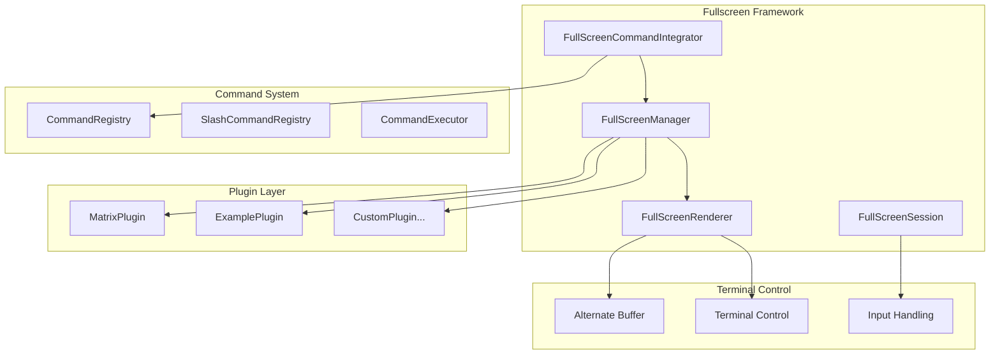

# Fullscreen Plugin System Reference

## Overview

The Kollabor CLI features a powerful fullscreen plugin system that allows developers to create immersive terminal experiences that take complete control of the screen. This system provides a clean separation between core CLI functionality and visual effects/applications.

## Architecture

### Core Components



### Component Responsibilities

#### FullScreenCommandIntegrator
- **Auto-discovers** plugins in `plugins/fullscreen/`
- **Registers slash commands** based on plugin metadata
- **Handles dynamic loading/unloading** of plugins
- **Maps commands to plugin execution**

#### FullScreenManager
- **Orchestrates plugin lifecycle** (initialize, start, stop, cleanup)
- **Manages plugin registry** and instance tracking
- **Coordinates with terminal state** management
- **Handles plugin switching** and session management

#### FullScreenRenderer
- **Controls terminal state** (alternate buffer, cursor, raw mode)
- **Provides rendering primitives** (clear, write_at, colors)
- **Manages screen buffer** transitions
- **Handles state restoration** on exit

#### FullScreenSession
- **Tracks active sessions** and plugin state
- **Manages input routing** during fullscreen mode
- **Coordinates cleanup** and restoration
- **Provides session isolation**

## Plugin Development

### Creating a Fullscreen Plugin

#### 1. Basic Plugin Structure

```python
from core.fullscreen import FullScreenPlugin
from core.fullscreen.plugin import PluginMetadata
from core.io.key_parser import KeyPress

class MyPlugin(FullScreenPlugin):
    """Custom fullscreen plugin."""

    def __init__(self):
        metadata = PluginMetadata(
            name="my_plugin",                    # Primary command name
            description="My awesome plugin",     # Command description
            version="1.0.0",
            author="Developer Name",
            category="effects",
            icon="🎨",                          # Command menu icon
            aliases=["alias1", "alias2"]        # Additional command names
        )
        super().__init__(metadata)

        # Plugin-specific state
        self.custom_state = None

    async def initialize(self, renderer) -> bool:
        """Initialize plugin with renderer."""
        if not await super().initialize(renderer):
            return False

        # Custom initialization
        self.custom_state = "initialized"
        return True

    async def on_start(self) -> None:
        """Called when plugin starts."""
        await super().on_start()
        # Plugin startup logic

    async def render_frame(self) -> bool:
        """Render a single frame."""
        # Clear screen
        self.renderer.clear_screen()

        # Custom rendering
        self.renderer.write_at(10, 5, "Hello Fullscreen!", "green")

        # Flush output
        self.renderer.flush()

        return True  # Continue rendering

    async def handle_input(self, key_press: KeyPress) -> bool:
        """Handle user input."""
        if key_press.char in ['q', '\x1b'] or key_press.name == "Escape":
            return True  # Exit plugin

        # Handle other keys
        return False  # Continue running

    async def on_stop(self) -> None:
        """Called when plugin stops."""
        await super().on_stop()
        # Cleanup logic

    async def cleanup(self) -> None:
        """Final cleanup."""
        self.custom_state = None
        await super().cleanup()
```

#### 2. Plugin Metadata Configuration

```python
PluginMetadata(
    name="plugin_name",           # Creates /plugin_name command
    description="What it does",   # Shown in command help
    version="1.0.0",             # Plugin version
    author="Author Name",         # Plugin author
    category="effects",           # Plugin category
    icon="🎯",                   # Command menu icon
    aliases=["alias1", "alias2"]  # Creates /alias1, /alias2 commands
)
```

#### 3. Rendering System

The fullscreen renderer provides several primitives:

```python
# Screen control
self.renderer.clear_screen()
self.renderer.flush()

# Cursor control
self.renderer.hide_cursor()
self.renderer.show_cursor()

# Positioning and colors
self.renderer.write_at(x, y, text, color)
self.renderer.write_raw(ansi_text)

# Terminal info
width, height = self.renderer.get_terminal_size()
```

#### 4. Available Colors

```python
from core.io.visual_effects import ColorPalette

# Basic colors
ColorPalette.RED
ColorPalette.GREEN
ColorPalette.BLUE
ColorPalette.YELLOW
ColorPalette.MAGENTA
ColorPalette.CYAN
ColorPalette.WHITE

# Intensity variants
ColorPalette.BRIGHT_GREEN
ColorPalette.DIM_GREEN

# Special
ColorPalette.RESET
```

## Command Registration

### Automatic Discovery

The system automatically discovers plugins in `plugins/fullscreen/` and registers commands:

1. **Scans** for `*.py` files in `plugins/fullscreen/`
2. **Loads** classes that inherit from `FullScreenPlugin`
3. **Extracts** metadata from plugin instances
4. **Registers** commands with the slash command system

### Command Mapping

- Plugin `name="matrix"` → Primary command `/matrix`
- Plugin `aliases=["rain", "code"]` → Alias commands `/rain`, `/code`
- Plugin `icon="🔋"` → Shows battery icon in command dropdown

### Dynamic Loading

```python
# Remove plugin file
rm plugins/fullscreen/my_plugin.py
# Commands disappear from dropdown

# Add plugin file back
# Commands automatically reappear
```

## Plugin Lifecycle

### 1. Discovery Phase
```
Application Start
├─ FullScreenCommandIntegrator.discover_and_register_plugins()
├─ Scan plugins/fullscreen/*.py
├─ Load plugin classes
├─ Extract metadata
└─ Register slash commands
```

### 2. Execution Phase
```
User types /matrix
├─ SlashCommandRegistry.get_command("matrix")
├─ FullScreenCommandIntegrator._create_plugin_handler()
├─ FullScreenManager.launch_plugin("matrix")
├─ MatrixPlugin.initialize()
├─ MatrixPlugin.on_start()
└─ MatrixPlugin.render_frame() loop
```

### 3. Cleanup Phase
```
User presses 'q' or ESC
├─ MatrixPlugin.handle_input() → return True
├─ FullScreenManager.stop_plugin()
├─ MatrixPlugin.on_stop()
├─ MatrixPlugin.cleanup()
├─ FullScreenRenderer.restore_terminal()
└─ Return to normal CLI mode
```

## Advanced Features

### Animation Framework

```python
from core.fullscreen.components.animation import AnimationFramework

class AnimatedPlugin(FullScreenPlugin):
    def __init__(self):
        super().__init__(metadata)
        self.animation = AnimationFramework()

    async def on_start(self):
        # Create fade-in animation
        self.animation.create_animation(
            "fade_in",
            duration=2.0,
            easing="ease_in_out"
        )
```

### Drawing Primitives

```python
from core.fullscreen.components.drawing import DrawingPrimitives

class ArtPlugin(FullScreenPlugin):
    async def render_frame(self):
        # Draw shapes
        DrawingPrimitives.draw_box(self.renderer, 10, 5, 20, 10, "blue")
        DrawingPrimitives.draw_line(self.renderer, 0, 0, 10, 10, "red")
        DrawingPrimitives.draw_circle(self.renderer, 15, 8, 5, "green")
```

### Input Handling Patterns

```python
async def handle_input(self, key_press: KeyPress) -> bool:
    # Exit keys
    if key_press.char in ['q', '\x1b'] or key_press.name == "Escape":
        return True

    # Arrow keys
    if key_press.name == "ArrowUp":
        self.move_up()
    elif key_press.name == "ArrowDown":
        self.move_down()
    elif key_press.name == "ArrowLeft":
        self.move_left()
    elif key_press.name == "ArrowRight":
        self.move_right()

    # Space bar
    elif key_press.char == ' ':
        self.action()

    # Letter keys
    elif key_press.char == 'r':
        self.reset()

    return False  # Continue running
```

## Best Practices

### 1. Resource Management
- Always call `await super().initialize()` in `initialize()`
- Clean up resources in `cleanup()`
- Handle initialization failures gracefully

### 2. Performance
- Keep `render_frame()` efficient (called frequently)
- Use `self.renderer.flush()` to batch output
- Limit expensive operations in render loop

### 3. User Experience
- Always handle 'q' and ESC for exit
- Provide clear visual feedback
- Use consistent color schemes

### 4. Error Handling
```python
async def render_frame(self) -> bool:
    try:
        # Rendering logic
        return True
    except Exception as e:
        logger.error(f"Render error: {e}")
        return False  # Stop plugin on error
```

## Examples

### Current Plugins

#### Matrix Rain Plugin
- **Command**: `/matrix`
- **File**: `plugins/fullscreen/matrix_plugin.py`
- **Features**: Animated falling code, multiple character sets, speed variation

#### Example Framework Plugin
- **Command**: `/example`
- **File**: `plugins/fullscreen/example_plugin.py`
- **Features**: Multi-page demo, animation showcase, input handling examples

### Plugin Ideas

- **Snake Game**: Classic terminal snake with arrow key controls
- **Clock Display**: Beautiful analog/digital clock
- **Starfield**: Flying through space animation
- **System Monitor**: Real-time CPU/memory graphs
- **Text Banner**: Convert text to large ASCII art

## Troubleshooting

### Common Issues

1. **Plugin not discovered**
   - Check file location: `plugins/fullscreen/my_plugin.py`
   - Ensure class inherits from `FullScreenPlugin`
   - Verify metadata is properly configured

2. **Command not appearing**
   - Check plugin name conflicts
   - Verify command registry integration
   - Look for initialization errors in logs

3. **Rendering issues**
   - Call `self.renderer.flush()` after writing
   - Check terminal size: `get_terminal_size()`
   - Verify alternate buffer support

4. **Input not working**
   - Return `False` to continue, `True` to exit
   - Handle both `key_press.char` and `key_press.name`
   - Check for input mode conflicts

### Debug Logging

```python
import logging
logger = logging.getLogger(__name__)

class MyPlugin(FullScreenPlugin):
    async def render_frame(self):
        logger.debug("Rendering frame")
        # Rendering logic
```

## Migration from Hardcoded Commands

### Before (Hardcoded)
```python
# In system_commands.py
async def handle_matrix(self, command):
    # Hardcoded matrix logic
```

### After (Plugin-based)
```python
# In plugins/fullscreen/matrix_plugin.py
class MatrixRainPlugin(FullScreenPlugin):
    # Plugin implementation
```

The new system provides:
- ✅ **Dynamic discovery** - No hardcoded dependencies
- ✅ **Clean separation** - Plugins are self-contained
- ✅ **Easy development** - Standard plugin interface
- ✅ **Automatic commands** - Commands created from metadata
- ✅ **Hot reloading** - Add/remove plugins dynamically