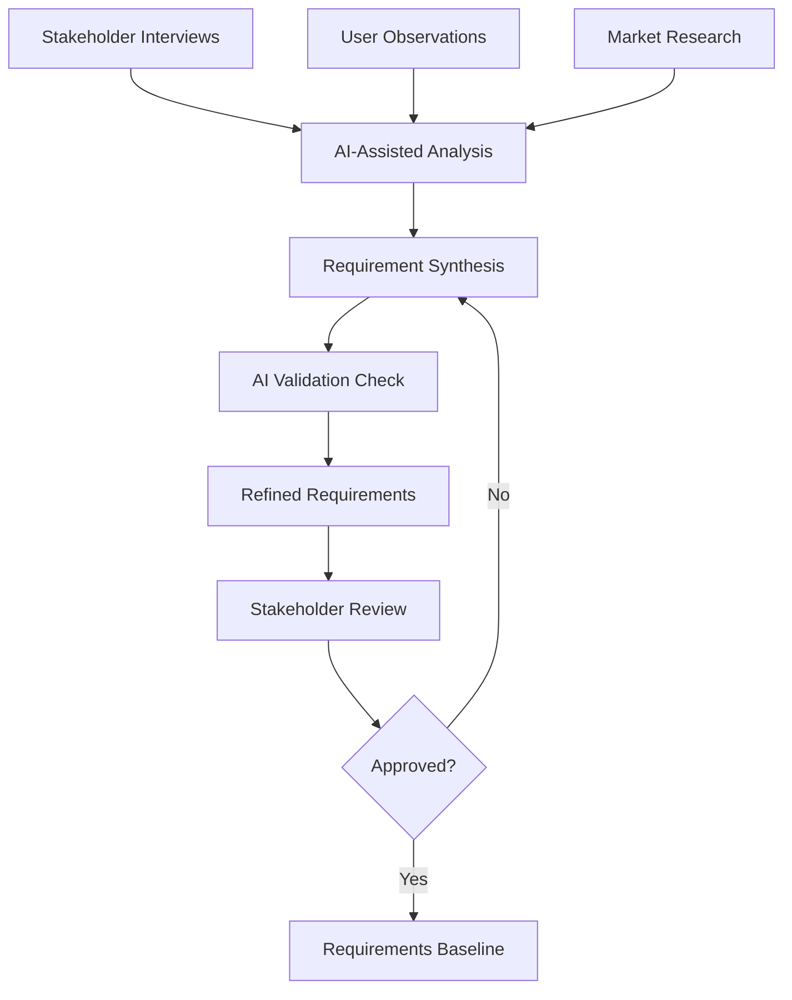
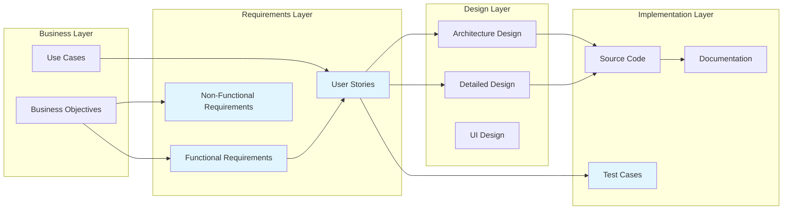

# AI-Enhanced Requirements Management

## Overview
This document establishes a comprehensive approach to requirements management that leverages AI tools to improve accuracy, completeness, and traceability throughout the software development lifecycle.

## AI-Enhanced Requirements Process

### 1. Requirements Discovery and Elicitation

#### Traditional + AI Approach


#### AI Tools for Requirements Discovery
- **Claude Code**: Analyze existing codebases to extract implicit requirements
- **Natural Language Processing**: Parse user feedback and support tickets
- **Pattern Recognition**: Identify common requirement patterns from historical data
- **Stakeholder Interview Analysis**: Extract key requirements from interview transcripts

**Example AI-Assisted Discovery Session**:
```markdown
## AI Analysis of User Feedback

### Input Data Sources:
- 247 user support tickets (last 6 months)
- 18 stakeholder interview transcripts
- Existing system documentation
- Competitive analysis reports

### AI-Identified Requirement Themes:
1. **Performance Requirements** (mentioned 156 times)
   - Response time < 2 seconds for LLM queries
   - Terminal rendering at consistent 20 FPS
   - Memory usage under 100MB for typical sessions

2. **Usability Requirements** (mentioned 134 times)  
   - Intuitive keyboard shortcuts
   - Clear error messages and recovery guidance
   - Consistent visual feedback for AI processing

3. **Integration Requirements** (mentioned 89 times)
   - Seamless Claude Code integration
   - GitHub workflow compatibility
   - Multiple LLM provider support
```

### 2. Requirements Analysis and Modeling

#### AI-Enhanced Requirements Templates
```yaml
Requirement_Template:
  ID: REQ-[Category]-[Number]
  Title: [Descriptive title]
  Description: [Natural language description]
  
  AI_Analysis:
    Complexity_Score: [1-10 scale]
    Dependencies_Identified: [List of dependencies]
    Risk_Assessment: [High/Medium/Low]
    Implementation_Estimate: [AI-calculated effort]
    Similar_Requirements: [References to related requirements]
    
  Traditional_Fields:
    Priority: [Must Have/Should Have/Could Have/Won't Have]
    Source: [Stakeholder/Document/Analysis]
    Acceptance_Criteria: [Testable criteria]
    Assumptions: [Key assumptions]
    Constraints: [Limitations and constraints]
    
  Traceability:
    Business_Objectives: [Links to business goals]
    User_Stories: [Related user stories]
    Test_Cases: [Test case references]
    Design_Elements: [Design artifact links]
```

#### AI-Powered Requirements Validation
```python
class RequirementsValidator:
    def __init__(self, ai_client):
        self.ai_client = ai_client
        
    async def validate_requirement(self, requirement: dict) -> ValidationResult:
        """Use AI to validate requirement quality"""
        
        validation_prompt = f"""
        Analyze this requirement for completeness and quality:
        
        Title: {requirement['title']}
        Description: {requirement['description']}
        Acceptance Criteria: {requirement['acceptance_criteria']}
        
        Check for:
        1. Clarity and unambiguity
        2. Testability
        3. Completeness
        4. Consistency with other requirements
        5. Technical feasibility
        
        Provide specific recommendations for improvement.
        """
        
        response = await self.ai_client.analyze(validation_prompt)
        return ValidationResult(
            score=response.quality_score,
            issues=response.identified_issues,
            recommendations=response.improvements
        )
```

### 3. User Story Generation and Enhancement

#### AI-Assisted User Story Creation
```python
class UserStoryGenerator:
    def __init__(self, ai_client):
        self.ai_client = ai_client
        
    async def generate_user_stories(self, requirement: str) -> List[UserStory]:
        """Generate comprehensive user stories from requirements"""
        
        prompt = f"""
        Based on this requirement: {requirement}
        
        Generate user stories following this format:
        As a [user type], I want [functionality] so that [benefit].
        
        Include:
        - Primary user stories for main functionality
        - Edge case user stories
        - Error handling user stories
        - Accessibility user stories
        - Performance user stories
        
        For each story, provide:
        - Acceptance criteria (Given/When/Then format)
        - Definition of done
        - Estimated complexity (1-13 fibonacci scale)
        """
        
        return await self.ai_client.generate_stories(prompt)
```

**Enhanced User Story Template**:
```markdown
# User Story: [Story Title]

## Story Statement
As a [user type]
I want [functionality]  
So that [business value]

## AI Analysis
- **Complexity Estimate**: [1-13 fibonacci points]
- **Dependencies**: [Other stories/requirements]
- **Risk Factors**: [Technical or business risks]
- **Implementation Approach**: [AI-suggested approach]

## Acceptance Criteria
### Scenario 1: [Happy Path]
Given [initial context]
When [user action]
Then [expected result]

### Scenario 2: [Edge Case]
Given [edge case context]
When [user action]
Then [expected behavior]

### Scenario 3: [Error Handling]
Given [error condition]
When [user action]
Then [error handling behavior]

## Definition of Done
- [ ] Code implemented and peer reviewed
- [ ] Unit tests written (>90% coverage)
- [ ] Integration tests passing
- [ ] Accessibility requirements met
- [ ] Performance criteria satisfied
- [ ] Documentation updated
- [ ] Stakeholder acceptance obtained

## AI-Generated Test Cases
[AI creates initial test scenarios based on acceptance criteria]

## Implementation Notes
[AI provides technical implementation suggestions]
```

## Requirements Traceability Matrix

### AI-Enhanced Traceability


### Automated Traceability Management
```python
class TraceabilityManager:
    def __init__(self, ai_client):
        self.ai_client = ai_client
        self.traceability_matrix = {}
        
    async def update_traceability(self, artifact_id: str, changes: dict):
        """Update traceability when artifacts change"""
        
        # AI analyzes impact of changes
        impact_analysis = await self.ai_client.analyze_impact(
            artifact_id, changes, self.traceability_matrix
        )
        
        # Update affected artifacts
        for affected_artifact in impact_analysis.affected_items:
            await self.update_artifact(affected_artifact, impact_analysis)
            
    async def validate_coverage(self) -> CoverageReport:
        """Ensure all requirements are properly traced"""
        
        coverage_prompt = """
        Analyze this traceability matrix for gaps:
        {traceability_data}
        
        Identify:
        1. Requirements without test coverage
        2. Code without requirement traceability  
        3. Orphaned design elements
        4. Missing documentation links
        """
        
        return await self.ai_client.analyze_coverage(coverage_prompt)
```

## Requirements Change Management

### AI-Powered Change Impact Analysis
```python
class ChangeImpactAnalyzer:
    def __init__(self, ai_client, codebase_analyzer):
        self.ai_client = ai_client
        self.codebase_analyzer = codebase_analyzer
        
    async def analyze_change_request(self, change_request: ChangeRequest) -> ImpactAnalysis:
        """Analyze the impact of a requirements change"""
        
        # Get current system state
        system_analysis = await self.codebase_analyzer.analyze_system()
        
        # AI analysis of change impact
        analysis_prompt = f"""
        Analyze the impact of this requirements change:
        
        Original Requirement: {change_request.original}
        Proposed Change: {change_request.proposed}
        Reason: {change_request.justification}
        
        Current System Context:
        - Architecture: {system_analysis.architecture}
        - Affected Components: {system_analysis.components}
        - Dependencies: {system_analysis.dependencies}
        
        Provide:
        1. Technical impact assessment
        2. Effort estimation for implementation
        3. Risk analysis (technical and business)
        4. Recommended implementation approach
        5. Testing strategy updates needed
        6. Documentation changes required
        """
        
        return await self.ai_client.analyze_impact(analysis_prompt)
```

### Change Approval Workflow
```yaml
Change_Approval_Process:
  1_Request_Submission:
    - Stakeholder submits change request
    - AI performs initial impact analysis
    - Change request auto-classified by severity
    
  2_Technical_Analysis:
    - Development team reviews AI analysis
    - Technical feasibility assessment
    - Effort estimation validation
    
  3_Business_Analysis:
    - Product owner reviews business impact
    - Cost-benefit analysis
    - Priority assessment against roadmap
    
  4_Approval_Decision:
    - Change review board evaluates request
    - AI provides recommendation based on criteria
    - Decision recorded with rationale
    
  5_Implementation_Planning:
    - AI generates implementation plan
    - Resource allocation
    - Timeline estimation
    - Risk mitigation strategies
```

## Requirements Quality Metrics

### AI-Calculated Quality Metrics
```python
class RequirementsMetrics:
    @staticmethod
    async def calculate_quality_score(requirement: Requirement) -> QualityScore:
        """Calculate comprehensive quality score"""
        
        metrics = {
            'clarity': await analyze_clarity(requirement.text),
            'completeness': await analyze_completeness(requirement),
            'testability': await analyze_testability(requirement.acceptance_criteria),
            'consistency': await analyze_consistency(requirement, related_requirements),
            'feasibility': await analyze_technical_feasibility(requirement)
        }
        
        return QualityScore(
            overall_score=sum(metrics.values()) / len(metrics),
            detail_scores=metrics,
            improvement_suggestions=await generate_improvements(metrics)
        )
    
    @staticmethod
    async def calculate_coverage_metrics() -> CoverageMetrics:
        """Calculate requirements coverage across lifecycle"""
        
        return CoverageMetrics(
            requirements_to_stories=calculate_story_coverage(),
            stories_to_tests=calculate_test_coverage(),
            tests_to_code=calculate_implementation_coverage(),
            code_to_docs=calculate_documentation_coverage()
        )
```

### Quality Dashboard
```yaml
Requirements_Quality_Dashboard:
  Overall_Health: 87%  # AI-calculated aggregate
  
  Quality_Metrics:
    Clarity_Score: 92%
    Completeness_Score: 85%
    Testability_Score: 90%
    Consistency_Score: 83%
    Feasibility_Score: 88%
    
  Coverage_Metrics:
    Requirements_Traced: 94%
    Stories_With_Tests: 87%
    Code_With_Requirements: 91%
    Documentation_Current: 78%
    
  Improvement_Actions:
    - Review 12 requirements with clarity issues
    - Add missing acceptance criteria to 8 stories
    - Update outdated documentation for 15 components
    - Resolve 3 requirement conflicts
```

## AI Tools Integration

### Claude Code for Requirements
```python
class ClaudeRequirementsAssistant:
    async def analyze_requirements_document(self, document_path: str) -> Analysis:
        """Analyze requirements document for completeness and quality"""
        
        prompt = f"""
        Analyze this requirements document for:
        
        1. Missing requirements categories
        2. Ambiguous or unclear statements  
        3. Conflicting requirements
        4. Testability issues
        5. Implementation feasibility concerns
        
        Provide specific recommendations for improvement.
        Document: {document_path}
        """
        
        return await self.claude_client.analyze(prompt)
    
    async def generate_acceptance_criteria(self, user_story: str) -> List[str]:
        """Generate comprehensive acceptance criteria for user story"""
        
        prompt = f"""
        For this user story: {user_story}
        
        Generate comprehensive acceptance criteria covering:
        - Happy path scenarios
        - Edge cases
        - Error conditions
        - Performance requirements
        - Security considerations
        - Accessibility requirements
        
        Use Given/When/Then format.
        """
        
        return await self.claude_client.generate(prompt)
```

### Automated Requirements Documentation
```python
class RequirementsDocumentGenerator:
    async def generate_specification(self, requirements: List[Requirement]) -> Document:
        """Generate comprehensive requirements specification"""
        
        sections = [
            await self.generate_introduction(requirements),
            await self.generate_functional_requirements(requirements),
            await self.generate_non_functional_requirements(requirements),
            await self.generate_user_interface_requirements(requirements),
            await self.generate_data_requirements(requirements),
            await self.generate_integration_requirements(requirements),
            await self.generate_appendices(requirements)
        ]
        
        return Document(
            title="AI-Enhanced Requirements Specification",
            sections=sections,
            generated_by="AI Assistant",
            version=self.calculate_version(),
            date=datetime.now()
        )
```

## Best Practices and Guidelines

### Requirements Writing Standards
1. **Clarity**: Use simple, unambiguous language
2. **Completeness**: Include all necessary information
3. **Consistency**: Maintain consistent terminology and format
4. **Testability**: Ensure requirements can be verified
5. **Feasibility**: Validate technical and business feasibility

### AI Integration Guidelines
1. **Human Oversight**: Always review AI-generated content
2. **Context Preservation**: Maintain project context across AI interactions
3. **Quality Validation**: Use multiple validation methods
4. **Continuous Learning**: Refine AI prompts based on results
5. **Documentation**: Record AI assistance decisions and rationale

### Review and Approval Process
1. **Automated Checks**: AI performs initial quality validation
2. **Peer Review**: Technical team reviews requirements
3. **Stakeholder Review**: Business stakeholders validate requirements
4. **Final Approval**: Requirements review board approval
5. **Baseline Management**: Version control and change tracking

---

*This AI-enhanced requirements management approach ensures high-quality requirements while leveraging AI tools to improve efficiency, accuracy, and completeness throughout the development lifecycle.*