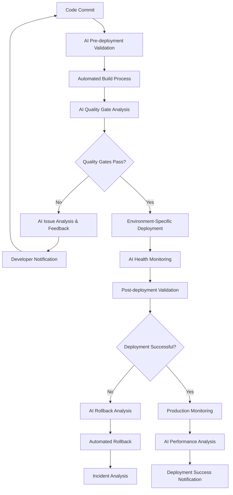
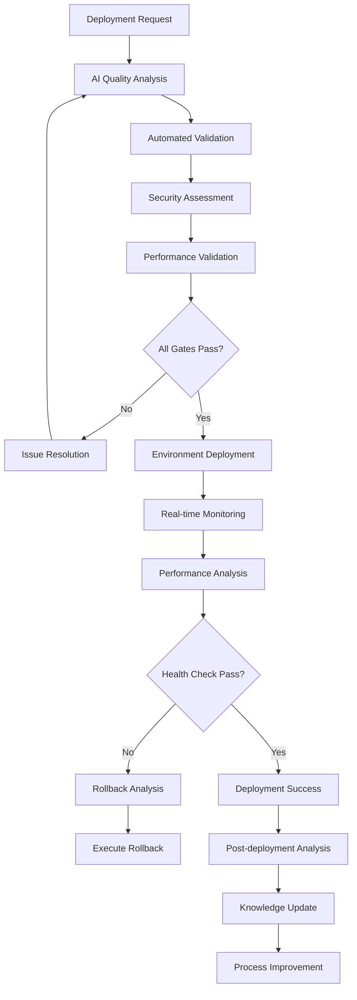

# Automated Deployment Pipeline

## Overview
This document establishes a comprehensive automated deployment pipeline that leverages AI tools to ensure reliable, secure, and efficient deployment of the Chat App across different environments while maintaining quality assurance and operational excellence.

## AI-Enhanced Deployment Architecture

### 1. Deployment Pipeline Philosophy

#### Continuous Deployment with AI Assistance


#### Deployment Strategy Framework
```yaml
Deployment_Strategy:
  Environment_Progression:
    - Development: "Continuous deployment from main branch"
    - Testing: "Automated deployment after quality gates"
    - Staging: "Production-like validation environment"
    - Production: "Controlled deployment with AI oversight"
    
  Deployment_Methods:
    Blue_Green:
      Description: "Zero-downtime deployments with instant rollback"
      Use_Case: "Production deployments"
      AI_Assistance: "Health comparison and traffic switching decisions"
      
    Rolling_Updates:
      Description: "Gradual instance replacement"
      Use_Case: "Non-critical updates"
      AI_Assistance: "Update pace optimization and failure detection"
      
    Canary_Deployments:
      Description: "Gradual traffic shifting to new version"
      Use_Case: "High-risk changes"
      AI_Assistance: "Performance monitoring and traffic routing decisions"
      
    Feature_Flags:
      Description: "Runtime feature control"
      Use_Case: "Feature rollouts and A/B testing"
      AI_Assistance: "Performance impact analysis and rollout optimization"
```

### 2. AI-Powered Build and Validation

#### Intelligent Build System
```python
class AIBuildOrchestrator:
    def __init__(self, claude_client, build_config):
        self.claude_client = claude_client
        self.build_config = build_config
        
    async def orchestrate_build(self, commit_data: dict) -> BuildResult:
        """AI-orchestrated build process with intelligent optimization"""
        
        build_analysis_prompt = f"""
        Analyze this commit for build optimization:
        
        Commit Data: {commit_data}
        
        Determine:
        1. Changed components and their dependencies
        2. Required build steps and their priority
        3. Test execution optimization strategy
        4. Deployment risk assessment
        5. Resource requirements estimation
        
        Optimize build by:
        - Identifying parallelizable build steps
        - Determining minimum required test scope
        - Assessing cache utilization opportunities
        - Estimating build completion time
        - Recommending resource allocation
        
        For Chat App specifically, consider:
        - Python dependency changes
        - Plugin system modifications
        - Configuration updates
        - Terminal interface changes
        - Event bus modifications
        """
        
        build_plan = await self.claude_client.analyze_build_requirements(build_analysis_prompt)
        
        return await self._execute_optimized_build(build_plan)
    
    async def _execute_optimized_build(self, build_plan: dict) -> BuildResult:
        """Execute build with AI-optimized plan"""
        
        build_steps = [
            self._setup_environment(),
            self._install_dependencies(),
            self._run_static_analysis(),
            self._execute_tests(build_plan.test_strategy),
            self._build_artifacts(),
            self._validate_build_quality()
        ]
        
        # Execute steps with AI monitoring
        results = []
        for step in build_steps:
            step_result = await step
            results.append(step_result)
            
            # AI analysis of step results
            if not step_result.success:
                failure_analysis = await self._analyze_build_failure(step_result)
                return BuildResult(
                    success=False,
                    failure_reason=failure_analysis.root_cause,
                    recommended_actions=failure_analysis.remediation_steps,
                    results=results
                )
        
        return BuildResult(
            success=True,
            build_artifacts=self._collect_artifacts(results),
            quality_metrics=self._calculate_quality_metrics(results),
            results=results
        )
    
    async def _analyze_build_failure(self, failure_data: dict) -> FailureAnalysis:
        """AI-powered build failure analysis"""
        
        failure_analysis_prompt = f"""
        Analyze this build failure for Chat App:
        
        Failure Data: {failure_data}
        
        Provide:
        1. Root cause identification
        2. Impact assessment on deployment
        3. Recommended remediation steps
        4. Prevention strategies for future builds
        5. Estimated fix time and effort
        
        Consider Chat App specific issues:
        - Plugin system compatibility
        - Python async/await patterns
        - EventBus configuration
        - Terminal interface dependencies
        - Configuration validation failures
        """
        
        return await self.claude_client.analyze_build_failure(failure_analysis_prompt)
```

#### Quality Gate Validation
```python
class QualityGateValidator:
    def __init__(self, claude_client):
        self.claude_client = claude_client
        
    async def validate_deployment_readiness(self, build_artifacts: dict) -> QualityGateResult:
        """Comprehensive AI-assisted quality gate validation"""
        
        quality_validation_prompt = f"""
        Validate deployment readiness for Chat App build:
        
        Build Artifacts: {build_artifacts}
        
        Validate these quality dimensions:
        
        1. Code Quality Metrics (Weight: 25%):
           - Test coverage >= 95% for unit tests
           - Test coverage >= 85% for integration tests
           - Static analysis score >= 8.0/10
           - Code complexity within acceptable limits
           - Security vulnerability scan clean
           
        2. Performance Benchmarks (Weight: 20%):
           - Response time requirements met
           - Memory usage within limits (<100MB typical)
           - Terminal rendering at 20 FPS
           - EventBus throughput benchmarks passed
           
        3. Functional Validation (Weight: 20%):
           - All critical user journeys tested
           - Plugin system functionality verified
           - Configuration loading validated
           - Error handling mechanisms tested
           
        4. Security Assessment (Weight: 15%):
           - No high/critical security vulnerabilities
           - Input validation mechanisms verified
           - Authentication/authorization tested
           - Data protection measures validated
           
        5. Operational Readiness (Weight: 10%):
           - Deployment scripts validated
           - Health check endpoints functional
           - Monitoring integration working
           - Rollback procedures tested
           
        6. Documentation Quality (Weight: 10%):
           - API documentation up to date
           - Deployment guides current
           - Configuration reference complete
           - Troubleshooting guides available
        
        For each dimension:
        - Provide pass/fail status
        - Include specific metric values
        - Identify any blocking issues
        - Recommend remediation actions
        - Assess deployment risk level
        
        Final recommendation: APPROVE/CONDITIONAL/REJECT deployment.
        """
        
        return await self.claude_client.validate_quality_gates(quality_validation_prompt)
```

### 3. Environment Management and Configuration

#### AI-Managed Environment Configuration
```python
class EnvironmentConfigurationManager:
    def __init__(self, claude_client):
        self.claude_client = claude_client
        
    async def generate_environment_config(self, environment_type: str, base_config: dict) -> EnvironmentConfig:
        """Generate environment-specific configuration with AI optimization"""
        
        config_generation_prompt = f"""
        Generate optimized configuration for Chat App deployment:
        
        Environment Type: {environment_type}
        Base Configuration: {base_config}
        
        Generate configurations for:
        
        1. Development Environment:
           - Debug logging enabled
           - Relaxed performance requirements
           - Local plugin development settings
           - Fast iteration configuration
           
        2. Testing Environment:
           - Production-like configuration
           - Enhanced logging for debugging
           - Test data and mocks enabled
           - Performance monitoring active
           
        3. Staging Environment:
           - Production mirror configuration
           - Full monitoring and alerting
           - Load testing configuration
           - Security hardening enabled
           
        4. Production Environment:
           - Optimized performance settings
           - Security hardening maximum
           - Minimal logging (info level)
           - High availability configuration
        
        For Chat App specifically, configure:
        - Terminal rendering optimization
        - EventBus performance tuning
        - Plugin system security settings
        - LLM API connection optimization
        - State management configuration
        - Logging and monitoring levels
        
        Include:
        - Environment variables
        - Configuration file templates
        - Security settings
        - Performance optimizations
        - Resource allocation recommendations
        """
        
        return await self.claude_client.generate_environment_config(config_generation_prompt)
    
    async def validate_configuration_changes(self, old_config: dict, new_config: dict) -> ConfigValidationResult:
        """Validate configuration changes with AI analysis"""
        
        validation_prompt = f"""
        Validate configuration changes for Chat App:
        
        Previous Configuration: {old_config}
        New Configuration: {new_config}
        
        Analyze:
        1. Breaking changes that could cause deployment failures
        2. Performance impact of configuration changes
        3. Security implications of modifications
        4. Compatibility with existing plugin system
        5. Resource requirement changes
        
        Check for:
        - Missing required configuration keys
        - Invalid configuration values
        - Conflicting settings
        - Performance regression risks
        - Security vulnerabilities
        
        Provide:
        - Change impact assessment
        - Risk level (Low/Medium/High)
        - Recommended validation tests
        - Rollback planning requirements
        - Migration steps if needed
        """
        
        return await self.claude_client.validate_config_changes(validation_prompt)
```

#### Infrastructure as Code with AI Assistance
```yaml
Infrastructure_Configuration:
  Container_Configuration:
    Base_Image: "python:3.11-slim"
    Dependencies:
      - "aiohttp>=3.8.0"
      - "sqlite3 (built-in)"
      - "asyncio (built-in)"
    
    Environment_Variables:
      KOLLABOR_CONFIG_PATH: "/app/.kollabor-cli/config.json"
      KOLLABOR_LOG_LEVEL: "${LOG_LEVEL:-INFO}"
      KOLLABOR_PLUGINS_PATH: "/app/plugins"
      PYTHONPATH: "/app"
    
    Resource_Limits:
      Development:
        Memory: "256MB"
        CPU: "0.5 cores"
      Production:
        Memory: "512MB"
        CPU: "1.0 cores"
    
    Health_Checks:
      Startup: "python -c 'import main; print(\"OK\")'"
      Liveness: "curl -f http://localhost:8080/health || exit 1"
      Readiness: "python health_check.py"
  
  Orchestration_Configuration:
    Kubernetes_Deployment:
      Replicas:
        Development: 1
        Testing: 2
        Staging: 2
        Production: 3
      
      Update_Strategy:
        Type: "RollingUpdate"
        Max_Unavailable: 1
        Max_Surge: 1
      
      Resource_Requests:
        Memory: "128MB"
        CPU: "0.1 cores"
      
      Resource_Limits:
        Memory: "512MB"
        CPU: "1.0 cores"
```

### 4. Deployment Execution and Monitoring

#### AI-Guided Deployment Process
```python
class DeploymentExecutor:
    def __init__(self, claude_client, environment_manager):
        self.claude_client = claude_client
        self.environment_manager = environment_manager
        
    async def execute_deployment(self, deployment_plan: dict) -> DeploymentResult:
        """Execute deployment with AI monitoring and decision making"""
        
        deployment_phases = [
            self._pre_deployment_validation(),
            self._execute_deployment_strategy(deployment_plan),
            self._post_deployment_validation(),
            self._performance_validation(),
            self._rollback_readiness_check()
        ]
        
        deployment_context = DeploymentContext(
            plan=deployment_plan,
            start_time=datetime.now(),
            environment=deployment_plan.target_environment
        )
        
        for phase in deployment_phases:
            phase_result = await phase
            deployment_context.add_phase_result(phase_result)
            
            # AI analysis of phase completion
            continuation_decision = await self._analyze_phase_result(
                phase_result, deployment_context
            )
            
            if continuation_decision.should_abort:
                return await self._handle_deployment_abort(
                    continuation_decision, deployment_context
                )
            elif continuation_decision.requires_intervention:
                return await self._handle_deployment_intervention(
                    continuation_decision, deployment_context
                )
        
        return DeploymentResult(
            success=True,
            deployment_id=deployment_context.deployment_id,
            metrics=deployment_context.get_metrics(),
            post_deployment_tasks=await self._generate_post_deployment_tasks()
        )
    
    async def _analyze_phase_result(self, phase_result: dict, context: DeploymentContext) -> ContinuationDecision:
        """AI analysis of deployment phase results"""
        
        analysis_prompt = f"""
        Analyze deployment phase result for continuation decision:
        
        Phase Result: {phase_result}
        Deployment Context: {context.get_summary()}
        
        Evaluate:
        1. Phase success metrics and criteria
        2. Performance impact assessment
        3. Error rate and system health
        4. User experience impact
        5. Rollback risk assessment
        
        For Chat App specifically:
        - Terminal interface responsiveness
        - EventBus performance metrics
        - Plugin system stability
        - LLM integration health
        - User session impact
        
        Decision options:
        - CONTINUE: Proceed to next phase
        - ABORT: Stop deployment and rollback
        - INTERVENTION: Require human decision
        
        Provide decision with detailed justification.
        """
        
        return await self.claude_client.analyze_deployment_phase(analysis_prompt)
```

#### Real-time Deployment Monitoring
```python
class DeploymentMonitor:
    def __init__(self, claude_client, metrics_collector):
        self.claude_client = claude_client
        self.metrics_collector = metrics_collector
        
    async def monitor_deployment_health(self, deployment_id: str) -> HealthStatus:
        """Continuous AI-powered deployment health monitoring"""
        
        health_metrics = await self.metrics_collector.collect_metrics([
            'response_time',
            'error_rate',
            'memory_usage',
            'cpu_utilization',
            'concurrent_users',
            'plugin_performance',
            'eventbus_throughput'
        ])
        
        health_analysis_prompt = f"""
        Analyze deployment health metrics for Chat App:
        
        Deployment ID: {deployment_id}
        Current Metrics: {health_metrics}
        
        Assess health across:
        
        1. System Performance:
           - Response time within SLA (<2 seconds)
           - Memory usage within limits (<100MB typical)
           - CPU utilization optimal
           - Terminal rendering smooth (20 FPS)
           
        2. Application Health:
           - Error rate acceptable (<1%)
           - Plugin system functioning
           - EventBus performance optimal
           - LLM integration stable
           
        3. User Experience:
           - Session stability
           - Feature availability
           - Performance consistency
           - Error handling effectiveness
           
        4. Operational Metrics:
           - Resource utilization efficiency
           - Scaling behavior
           - Configuration stability
           - Logging and monitoring health
        
        Provide:
        - Overall health score (1-10)
        - Specific health indicators
        - Early warning signals
        - Recommended actions
        - Escalation criteria
        """
        
        return await self.claude_client.analyze_deployment_health(health_analysis_prompt)
    
    async def predict_deployment_issues(self, historical_data: dict) -> IssuePredictor:
        """AI-powered deployment issue prediction"""
        
        prediction_prompt = f"""
        Predict potential deployment issues based on patterns:
        
        Historical Data: {historical_data}
        
        Analyze patterns for:
        1. Performance degradation trends
        2. Error rate spike patterns
        3. Resource exhaustion indicators
        4. Plugin compatibility issues
        5. Configuration-related failures
        
        For Chat App, focus on:
        - EventBus overload patterns
        - Plugin system conflicts
        - Terminal interface issues
        - LLM API connectivity problems
        - Memory leak indicators
        
        Provide:
        - Issue probability scores
        - Recommended preventive actions
        - Monitoring alert thresholds
        - Mitigation strategies
        - Timeline for potential issues
        """
        
        return await self.claude_client.predict_deployment_issues(prediction_prompt)
```

### 5. Rollback and Recovery Strategies

#### AI-Assisted Rollback Decision Making
```python
class RollbackManager:
    def __init__(self, claude_client, deployment_history):
        self.claude_client = claude_client
        self.deployment_history = deployment_history
        
    async def assess_rollback_necessity(self, incident_data: dict) -> RollbackDecision:
        """AI-powered rollback decision analysis"""
        
        rollback_analysis_prompt = f"""
        Analyze whether rollback is necessary for this incident:
        
        Incident Data: {incident_data}
        
        Evaluate:
        1. Incident Severity:
           - User impact level and scope
           - Business functionality affected
           - Data integrity concerns
           - Security implications
           
        2. Recovery Options:
           - Forward fix feasibility and timeline
           - Hotfix deployment possibility
           - Configuration-only resolution
           - Rollback complexity and risk
           
        3. Chat App Specific Considerations:
           - Plugin system impact
           - EventBus communication issues
           - Terminal interface problems
           - LLM integration failures
           - Configuration corruption
           
        4. Risk Assessment:
           - Rollback success probability
           - Potential rollback complications
           - Data loss or corruption risks
           - Service availability impact
           
        Decision Criteria:
        - IMMEDIATE_ROLLBACK: Critical issues, high user impact
        - CONDITIONAL_ROLLBACK: Moderate issues, assess timeline
        - FORWARD_FIX: Minor issues, fix in place
        - MONITOR: Watch and evaluate
        
        Provide decision with detailed justification and action plan.
        """
        
        return await self.claude_client.assess_rollback_necessity(rollback_analysis_prompt)
    
    async def execute_intelligent_rollback(self, rollback_plan: dict) -> RollbackResult:
        """Execute rollback with AI guidance and monitoring"""
        
        rollback_steps = [
            self._validate_rollback_target(),
            self._prepare_rollback_environment(),
            self._execute_rollback_deployment(),
            self._validate_rollback_success(),
            self._restore_service_health(),
            self._analyze_rollback_impact()
        ]
        
        rollback_context = RollbackContext(
            plan=rollback_plan,
            start_time=datetime.now(),
            target_version=rollback_plan.target_version
        )
        
        for step in rollback_steps:
            step_result = await step
            rollback_context.add_step_result(step_result)
            
            # AI validation of rollback step
            step_validation = await self._validate_rollback_step(
                step_result, rollback_context
            )
            
            if not step_validation.success:
                return RollbackResult(
                    success=False,
                    failure_reason=step_validation.failure_reason,
                    recovery_actions=step_validation.recovery_actions,
                    context=rollback_context
                )
        
        return RollbackResult(
            success=True,
            rollback_duration=rollback_context.duration,
            service_impact=rollback_context.service_impact,
            lessons_learned=await self._generate_lessons_learned(rollback_context)
        )
```

### 6. Multi-Environment Deployment Management

#### Environment-Specific Deployment Strategies
```yaml
Environment_Deployment_Strategies:
  Development_Environment:
    Strategy: "Direct deployment from main branch"
    Validation_Level: "Basic smoke tests"
    Rollback_Policy: "Immediate on any failure"
    AI_Assistance:
      - Code quality pre-checks
      - Basic performance validation
      - Plugin compatibility verification
    
  Testing_Environment:
    Strategy: "Automated deployment after quality gates"
    Validation_Level: "Full test suite execution"
    Rollback_Policy: "Automatic on test failures"
    AI_Assistance:
      - Comprehensive test result analysis
      - Performance regression detection
      - Integration issue identification
    
  Staging_Environment:
    Strategy: "Production-like deployment simulation"
    Validation_Level: "End-to-end validation and load testing"
    Rollback_Policy: "AI-assisted decision making"
    AI_Assistance:
      - Production readiness assessment
      - Performance under load analysis
      - Security vulnerability validation
    
  Production_Environment:
    Strategy: "Controlled rollout with monitoring"
    Validation_Level: "Real-time monitoring and user impact"
    Rollback_Policy: "AI-monitored with automatic triggers"
    AI_Assistance:
      - Real-time health monitoring
      - User experience impact analysis
      - Predictive issue detection
```

#### Canary Deployment with AI Control
```python
class CanaryDeploymentManager:
    def __init__(self, claude_client, traffic_manager):
        self.claude_client = claude_client
        self.traffic_manager = traffic_manager
        
    async def execute_canary_deployment(self, canary_config: dict) -> CanaryResult:
        """AI-controlled canary deployment execution"""
        
        canary_phases = [
            {'traffic_percentage': 5, 'duration': 300},   # 5% for 5 minutes
            {'traffic_percentage': 25, 'duration': 600},  # 25% for 10 minutes
            {'traffic_percentage': 50, 'duration': 900},  # 50% for 15 minutes
            {'traffic_percentage': 100, 'duration': 0}    # Full rollout
        ]
        
        canary_context = CanaryContext(
            config=canary_config,
            start_time=datetime.now()
        )
        
        for phase in canary_phases:
            # Update traffic routing
            await self.traffic_manager.set_traffic_split(
                canary_percentage=phase['traffic_percentage']
            )
            
            # Monitor phase performance
            phase_result = await self._monitor_canary_phase(
                phase, canary_context
            )
            
            # AI decision for phase continuation
            continuation_decision = await self._analyze_canary_phase(
                phase_result, canary_context
            )
            
            if continuation_decision.should_abort:
                await self._abort_canary_deployment(canary_context)
                return CanaryResult(
                    success=False,
                    abort_reason=continuation_decision.reason,
                    final_traffic_split=phase['traffic_percentage']
                )
            
            # Wait for phase duration
            if phase['duration'] > 0:
                await asyncio.sleep(phase['duration'])
        
        return CanaryResult(
            success=True,
            total_duration=canary_context.duration,
            performance_metrics=canary_context.get_metrics()
        )
    
    async def _analyze_canary_phase(self, phase_result: dict, context: CanaryContext) -> ContinuationDecision:
        """AI analysis of canary phase performance"""
        
        canary_analysis_prompt = f"""
        Analyze canary deployment phase performance:
        
        Phase Result: {phase_result}
        Canary Context: {context.get_summary()}
        
        Compare canary vs stable version:
        
        1. Performance Metrics:
           - Response time comparison
           - Error rate differential
           - Memory usage patterns
           - CPU utilization differences
           
        2. User Experience Metrics:
           - Session success rates
           - Feature functionality
           - Error handling effectiveness
           - Performance consistency
           
        3. Chat App Specific Metrics:
           - Terminal rendering performance
           - EventBus throughput comparison
           - Plugin system stability
           - LLM integration health
           
        4. Business Impact:
           - User satisfaction indicators
           - Feature adoption rates
           - Support request volume
           - Conversion metrics
        
        Decision criteria:
        - CONTINUE: Metrics within acceptable range
        - ABORT: Significant degradation detected
        - SLOW_DOWN: Reduce rollout pace
        - SPEED_UP: Accelerate rollout
        
        Provide decision with confidence level and justification.
        """
        
        return await self.claude_client.analyze_canary_phase(canary_analysis_prompt)
```

### 7. Deployment Security and Compliance

#### Security-First Deployment Validation
```python
class DeploymentSecurityValidator:
    def __init__(self, claude_client, security_scanner):
        self.claude_client = claude_client
        self.security_scanner = security_scanner
        
    async def validate_deployment_security(self, deployment_artifacts: dict) -> SecurityValidationResult:
        """Comprehensive security validation before deployment"""
        
        security_scan_results = await self.security_scanner.scan_artifacts(deployment_artifacts)
        
        security_validation_prompt = f"""
        Validate deployment security for Chat App:
        
        Scan Results: {security_scan_results}
        Deployment Artifacts: {deployment_artifacts}
        
        Validate security across:
        
        1. Code Security:
           - No critical vulnerability patterns
           - Input validation implementation
           - Error handling security
           - Dependency vulnerability assessment
           
        2. Configuration Security:
           - Secure configuration defaults
           - Sensitive data protection
           - Access control validation
           - Encryption requirements
           
        3. Runtime Security:
           - Plugin system security isolation
           - EventBus access controls
           - API endpoint security
           - Resource access restrictions
           
        4. Infrastructure Security:
           - Container security hardening
           - Network security configuration
           - Secret management validation
           - Access logging configuration
           
        5. Chat App Specific Security:
           - LLM prompt injection prevention
           - Terminal escape sequence handling
           - Plugin privilege isolation
           - Configuration tampering prevention
        
        Provide:
        - Security risk assessment
        - Vulnerability prioritization
        - Remediation recommendations
        - Deployment approval/rejection
        - Compliance validation results
        """
        
        return await self.claude_client.validate_deployment_security(security_validation_prompt)
```

## Deployment Best Practices and Standards

### Chat App Deployment Standards
```yaml
Deployment_Standards:
  Quality_Requirements:
    Code_Coverage: ">= 95% for deployment approval"
    Performance_Benchmarks: "All benchmarks must pass"
    Security_Scan: "No high/critical vulnerabilities"
    Documentation: "Up-to-date deployment and operational docs"
    
  Validation_Requirements:
    Automated_Tests: "Full test suite execution required"
    Performance_Tests: "Load testing on staging required"
    Security_Tests: "Security scan with clean results"
    Integration_Tests: "All integration points validated"
    
  Rollback_Requirements:
    Rollback_Plan: "Documented and tested rollback procedure"
    Data_Backup: "Current data backup before deployment"
    Health_Checks: "Comprehensive health validation"
    Monitoring: "Real-time monitoring during rollback"
    
  Communication_Requirements:
    Deployment_Notifications: "Stakeholder notification system"
    Status_Updates: "Real-time deployment status"
    Issue_Reporting: "Automated issue detection and reporting"
    Documentation_Updates: "Post-deployment documentation refresh"
```

### AI Integration Best Practices
```yaml
AI_Deployment_Integration:
  Decision_Making:
    AI_Recommendations: "AI provides analysis and recommendations"
    Human_Oversight: "Human approval required for critical decisions"
    Escalation_Triggers: "Clear criteria for human intervention"
    
  Monitoring_and_Analysis:
    Real_Time_Analysis: "Continuous AI monitoring during deployment"
    Pattern_Recognition: "AI identifies deployment patterns and issues"
    Predictive_Analytics: "AI predicts potential deployment problems"
    
  Quality_Assurance:
    Automated_Validation: "AI-powered quality gate validation"
    Performance_Analysis: "AI analysis of performance metrics"
    Security_Assessment: "AI-assisted security validation"
    
  Continuous_Improvement:
    Learning_From_Deployments: "AI analyzes deployment outcomes"
    Process_Optimization: "AI suggests deployment process improvements"
    Knowledge_Accumulation: "AI builds deployment knowledge base"
```

### Operational Excellence Framework


---

*This automated deployment pipeline framework ensures reliable, secure, and efficient deployment of the Chat App while leveraging AI capabilities to enhance decision-making, monitoring, and continuous improvement throughout the deployment lifecycle.*