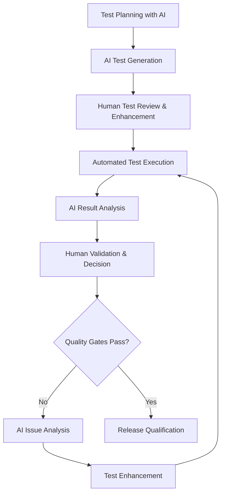
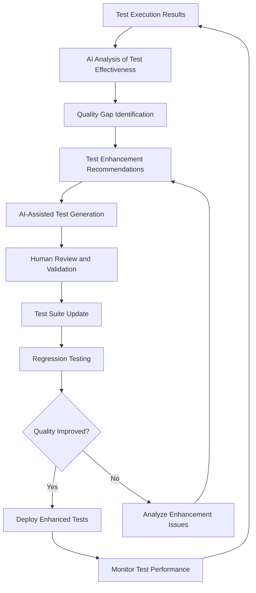

# AI-Enhanced Testing Strategy

## Overview
This document establishes a comprehensive testing strategy that leverages AI tools to enhance test coverage, quality, and efficiency while maintaining rigorous validation standards for the Chat App's event-driven, plugin-based architecture.

## AI-Enhanced Testing Framework

### 1. Testing Philosophy and Approach

#### AI-Human Collaborative Testing Model


#### Testing Pyramid for Chat App
```yaml
Testing_Pyramid:
  Unit_Tests: # 70% of total tests
    Coverage_Target: ">= 95%"
    AI_Assistance:
      - Test case generation from code analysis
      - Edge case identification
      - Mock object generation
      - Assertion validation
    Focus_Areas:
      - Component isolation testing
      - Business logic validation
      - Error handling verification
      - Performance unit benchmarks
      
  Integration_Tests: # 20% of total tests  
    Coverage_Target: ">= 85%"
    AI_Assistance:
      - Integration scenario generation
      - Data flow validation
      - API contract testing
      - Event bus testing patterns
    Focus_Areas:
      - Plugin system integration
      - EventBus communication
      - Configuration validation
      - External service integration
      
  End_to_End_Tests: # 10% of total tests
    Coverage_Target: ">= 75%"
    AI_Assistance:
      - User journey simulation
      - Terminal interaction testing
      - Performance regression testing
      - Error recovery validation
    Focus_Areas:
      - Complete user workflows
      - System performance validation
      - Security testing
      - Cross-platform compatibility
```

### 2. AI-Powered Test Generation

#### Automated Test Suite Generation
```python
class AITestGenerator:
    def __init__(self, claude_client, codebase_analyzer):
        self.claude_client = claude_client
        self.codebase_analyzer = codebase_analyzer
        
    async def generate_unit_tests(self, component_code: str, context: dict) -> TestSuite:
        """Generate comprehensive unit test suite for component"""
        
        test_generation_prompt = f"""
        Generate comprehensive unit tests for this Chat App component:
        
        Component Code: {component_code}
        Context: {context}
        
        Generate tests following these patterns:
        
        1. Test Class Structure:
           - AsyncTest base class for async components
           - setUp/tearDown with proper resource management
           - Test fixtures for common data
           - Mock configuration for dependencies
           
        2. Test Categories Required:
        
           Happy Path Tests:
           - Normal operation scenarios
           - Valid input processing
           - Expected output validation
           - State transition verification
           
           Edge Case Tests:
           - Boundary value testing
           - Empty/null input handling
           - Maximum capacity testing
           - Resource exhaustion scenarios
           
           Error Condition Tests:
           - Invalid input handling
           - Exception propagation
           - Error recovery mechanisms
           - Graceful degradation
           
           Integration Point Tests:
           - EventBus communication
           - Plugin hook registration
           - Configuration loading
           - Dependency injection
           
           Performance Tests:
           - Response time validation
           - Memory usage benchmarks
           - Concurrency stress testing
           - Resource cleanup verification
           
        3. Chat App Specific Patterns:
           - Async/await testing with proper event loops
           - EventBus mock integration
           - Plugin compatibility testing
           - Terminal rendering validation
           - Configuration testing with dot notation
           
        4. Test Implementation Requirements:
           - Use unittest.TestCase with async support
           - Mock external dependencies appropriately
           - Include performance assertions where relevant
           - Ensure tests are deterministic and fast
           - Add comprehensive docstrings
           
        Provide complete test implementation with proper imports and setup.
        """
        
        return await self.claude_client.generate_tests(test_generation_prompt)
    
    async def generate_integration_tests(self, system_components: dict) -> IntegrationTestSuite:
        """Generate integration tests for component interactions"""
        
        integration_test_prompt = f"""
        Generate integration tests for Chat App component interactions:
        
        System Components: {system_components}
        
        Focus on these integration patterns:
        
        1. EventBus Integration:
           - Event publishing and consumption
           - Event data validation
           - Event handler registration/deregistration
           - Event cancellation and error handling
           
        2. Plugin System Integration:
           - Plugin discovery and loading
           - Hook registration and execution
           - Plugin lifecycle management
           - Plugin configuration merging
           
        3. Configuration System Integration:
           - Configuration loading and validation
           - Environment variable override testing
           - Configuration change propagation
           - Default value handling
           
        4. Storage System Integration:
           - State persistence and retrieval
           - Database connection management
           - Transaction handling
           - Data migration testing
           
        5. Terminal Interface Integration:
           - Rendering pipeline testing
           - Input handling validation
           - Status display integration
           - Error presentation testing
           
        Test Implementation:
        - Use real components where possible
        - Mock only external dependencies
        - Test complete data flows
        - Validate error propagation
        - Include performance assertions
        """
        
        return await self.claude_client.generate_integration_tests(integration_test_prompt)
    
    async def generate_e2e_tests(self, user_scenarios: list) -> E2ETestSuite:
        """Generate end-to-end test scenarios"""
        
        e2e_test_prompt = f"""
        Generate end-to-end tests for Chat App user scenarios:
        
        User Scenarios: {user_scenarios}
        
        Create tests for complete user journeys:
        
        1. Application Startup Tests:
           - Configuration loading
           - Plugin discovery and initialization
           - Terminal interface setup
           - EventBus initialization
           
        2. LLM Interaction Tests:
           - Query processing pipeline
           - Response generation and display
           - Error handling and recovery
           - Multi-turn conversation handling
           
        3. Plugin System Tests:
           - Plugin hot-loading
           - Hook execution chains
           - Plugin error isolation
           - Configuration changes
           
        4. Performance Tests:
           - Response time validation
           - Memory usage monitoring
           - Concurrent request handling
           - Resource cleanup verification
           
        5. Error Recovery Tests:
           - Network failure handling
           - Plugin crash recovery
           - Configuration error handling
           - System resource exhaustion
           
        Use appropriate test automation frameworks:
        - Terminal automation for UI testing
        - HTTP client mocking for LLM APIs
        - File system mocking for configuration
        - Time manipulation for timeout testing
        """
        
        return await self.claude_client.generate_e2e_tests(e2e_test_prompt)
```

#### Test Case Templates and Patterns
```python
# AI-Generated Test Template for Chat App Components
import unittest
import asyncio
from unittest.mock import Mock, AsyncMock, patch
from typing import Dict, Any
import tempfile
import json

class ChatAppComponentTestBase(unittest.TestCase):
    """
    Base test class for Chat App components with common setup patterns
    """
    
    def setUp(self):
        """Setup common test infrastructure"""
        # Create event loop for async tests
        self.loop = asyncio.new_event_loop()
        asyncio.set_event_loop(self.loop)
        
        # Mock dependencies
        self.mock_event_bus = Mock()
        self.mock_config = Mock()
        self.mock_logger = Mock()
        
        # Setup test configuration
        self.test_config = {
            "terminal.render_fps": 20,
            "terminal.thinking_effect": "normal",
            "input.polling_delay": 0.01,
            "plugins.llm.http_connector_limit": 10
        }
        self.mock_config.get.side_effect = lambda key, default=None: self.test_config.get(key, default)
        
        # Create temporary directories for testing
        self.temp_dir = tempfile.mkdtemp()
        
    def tearDown(self):
        """Cleanup test resources"""
        # Close event loop
        if self.loop and not self.loop.is_closed():
            self.loop.close()
            
        # Cleanup temporary files
        import shutil
        shutil.rmtree(self.temp_dir, ignore_errors=True)
    
    def run_async(self, coro):
        """Helper to run async functions in tests"""
        return self.loop.run_until_complete(coro)
    
    def create_test_component(self, component_class, **kwargs):
        """Factory method for creating test components"""
        default_args = {
            'event_bus': self.mock_event_bus,
            'config': self.mock_config,
            'logger': self.mock_logger
        }
        default_args.update(kwargs)
        return component_class(**default_args)

class TestEventBusComponent(ChatAppComponentTestBase):
    """
    AI-Generated test suite for EventBus component
    """
    
    def setUp(self):
        super().setUp()
        from core.events.bus import EventBus
        self.event_bus = EventBus()
    
    def test_event_bus_initialization(self):
        """Test EventBus initializes correctly"""
        self.assertIsNotNone(self.event_bus)
        self.assertEqual(len(self.event_bus._handlers), 0)
        self.assertFalse(self.event_bus._shutdown)
    
    def test_register_event_handler(self):
        """Test event handler registration"""
        mock_handler = AsyncMock()
        
        self.run_async(
            self.event_bus.register_handler("test_event", mock_handler)
        )
        
        self.assertIn("test_event", self.event_bus._handlers)
        self.assertIn(mock_handler, self.event_bus._handlers["test_event"])
    
    def test_publish_event_success(self):
        """Test successful event publishing and handling"""
        mock_handler = AsyncMock(return_value="handler_result")
        
        self.run_async(
            self.event_bus.register_handler("test_event", mock_handler)
        )
        
        from core.events.event import Event
        test_event = Event("test_event", {"data": "test_data"})
        
        result = self.run_async(
            self.event_bus.publish(test_event)
        )
        
        mock_handler.assert_called_once_with(test_event)
        self.assertEqual(result.status, "completed")
    
    def test_publish_event_with_cancellation(self):
        """Test event cancellation mechanism"""
        def cancelling_handler(event):
            event.cancelled = True
            return "cancelled"
            
        second_handler = AsyncMock()
        
        self.run_async(
            self.event_bus.register_handler("test_event", cancelling_handler)
        )
        self.run_async(
            self.event_bus.register_handler("test_event", second_handler)
        )
        
        from core.events.event import Event
        test_event = Event("test_event", {"data": "test_data"})
        
        result = self.run_async(
            self.event_bus.publish(test_event)
        )
        
        # Second handler should not be called due to cancellation
        second_handler.assert_not_called()
        self.assertTrue(test_event.cancelled)
    
    def test_event_handler_error_handling(self):
        """Test error handling in event handlers"""
        def error_handler(event):
            raise ValueError("Test error")
            
        self.run_async(
            self.event_bus.register_handler("error_event", error_handler)
        )
        
        from core.events.event import Event
        error_event = Event("error_event", {"data": "test_data"})
        
        result = self.run_async(
            self.event_bus.publish(error_event)
        )
        
        self.assertEqual(result.status, "error")
        self.assertIn("Test error", str(result.error))
    
    def test_concurrent_event_handling(self):
        """Test concurrent event processing"""
        import asyncio
        
        async def slow_handler(event):
            await asyncio.sleep(0.1)
            return f"handled_{event.data['id']}"
        
        self.run_async(
            self.event_bus.register_handler("concurrent_event", slow_handler)
        )
        
        # Create multiple events
        from core.events.event import Event
        events = [
            Event("concurrent_event", {"id": i})
            for i in range(5)
        ]
        
        # Process events concurrently
        start_time = asyncio.get_event_loop().time()
        results = self.run_async(
            asyncio.gather(*[
                self.event_bus.publish(event) 
                for event in events
            ])
        )
        end_time = asyncio.get_event_loop().time()
        
        # Should complete in roughly the time of one slow handler
        # (concurrent execution) rather than 5x that time (sequential)
        self.assertLess(end_time - start_time, 0.5)  # Should be ~0.1s, not ~0.5s
        
        for result in results:
            self.assertEqual(result.status, "completed")

class TestPluginSystem(ChatAppComponentTestBase):
    """
    AI-Generated tests for Plugin System
    """
    
    def setUp(self):
        super().setUp()
        from core.plugins.registry import PluginRegistry
        self.plugin_registry = PluginRegistry()
    
    def test_plugin_discovery(self):
        """Test plugin discovery from plugins directory"""
        # Create mock plugin file
        plugin_code = '''
class TestPlugin:
    def __init__(self, event_bus, config, logger):
        pass
    
    async def initialize(self):
        pass
    
    @staticmethod
    def get_default_config():
        return {"test_setting": "default_value"}
'''
        
        plugin_file = f"{self.temp_dir}/test_plugin.py"
        with open(plugin_file, 'w') as f:
            f.write(plugin_code)
        
        # Test plugin discovery
        plugins = self.run_async(
            self.plugin_registry.discover_plugins(self.temp_dir)
        )
        
        self.assertIn("test_plugin", plugins)
        self.assertIsNotNone(plugins["test_plugin"])
    
    def test_plugin_initialization(self):
        """Test plugin initialization with dependencies"""
        from plugins.test_plugin import TestPlugin
        
        plugin = TestPlugin(
            self.mock_event_bus,
            self.mock_config,
            self.mock_logger
        )
        
        # Test initialization
        self.run_async(plugin.initialize())
        
        # Verify plugin state
        self.assertIsNotNone(plugin)
    
    def test_plugin_configuration_merging(self):
        """Test plugin configuration merging"""
        plugin_configs = [
            {"plugin1": {"setting1": "value1"}},
            {"plugin2": {"setting2": "value2"}},
            {"plugin1": {"setting3": "value3"}}  # Should merge with first plugin1
        ]
        
        merged_config = self.plugin_registry._merge_plugin_configs(plugin_configs)
        
        expected = {
            "plugin1": {"setting1": "value1", "setting3": "value3"},
            "plugin2": {"setting2": "value2"}
        }
        
        self.assertEqual(merged_config, expected)
```

### 3. Test Data Management and Generation

#### AI-Generated Test Data
```python
class TestDataGenerator:
    def __init__(self, claude_client):
        self.claude_client = claude_client
        
    async def generate_test_data(self, data_requirements: dict) -> TestDataSet:
        """Generate comprehensive test data sets"""
        
        test_data_prompt = f"""
        Generate comprehensive test data for Chat App testing:
        
        Data Requirements: {data_requirements}
        
        Generate data for these categories:
        
        1. Configuration Data:
           - Valid configuration combinations
           - Invalid configuration scenarios  
           - Edge case configuration values
           - Performance testing configurations
           
        2. Event Data:
           - Valid event payloads
           - Malformed event data
           - Large payload stress testing
           - Concurrent event scenarios
           
        3. User Input Data:
           - Typical user queries
           - Edge case inputs (empty, very long, special characters)
           - Multi-line inputs
           - Unicode and internationalization data
           
        4. LLM Response Data:
           - Normal response scenarios
           - Error response formats
           - Streaming response chunks
           - Large response handling
           
        5. Plugin Data:
           - Plugin configuration scenarios
           - Hook execution data
           - Plugin error conditions
           - Plugin interaction data
           
        6. Performance Test Data:
           - Load testing scenarios
           - Memory usage test data
           - Concurrent access patterns
           - Resource exhaustion scenarios
           
        Format as Python dictionaries and lists for easy integration.
        Include both positive and negative test cases.
        Ensure data covers boundary conditions and edge cases.
        """
        
        return await self.claude_client.generate_test_data(test_data_prompt)
    
    async def generate_mock_responses(self, api_specs: dict) -> MockResponseSet:
        """Generate mock API responses for testing"""
        
        mock_response_prompt = f"""
        Generate mock responses for Chat App API testing:
        
        API Specifications: {api_specs}
        
        Create mock responses for:
        
        1. LLM API Responses:
           - Successful completions
           - Streaming responses
           - Error responses (rate limiting, API errors)
           - Timeout scenarios
           - Authentication failures
           
        2. Configuration API Responses:
           - Valid configuration retrieval
           - Configuration validation errors
           - Permission denied scenarios
           - Service unavailable responses
           
        3. Plugin API Responses:
           - Plugin discovery responses
           - Plugin loading success/failure
           - Hook execution results
           - Plugin communication data
           
        Include appropriate HTTP status codes, headers, and response bodies.
        Ensure responses are realistic and cover error conditions.
        """
        
        return await self.claude_client.generate_mock_responses(mock_response_prompt)
```

### 4. Performance and Load Testing

#### AI-Enhanced Performance Testing
```python
class PerformanceTestGenerator:
    def __init__(self, claude_client):
        self.claude_client = claude_client
        
    async def generate_performance_tests(self, performance_requirements: dict) -> PerformanceTestSuite:
        """Generate performance and load tests"""
        
        performance_test_prompt = f"""
        Generate performance tests for Chat App components:
        
        Performance Requirements: {performance_requirements}
        
        Create tests for these scenarios:
        
        1. Response Time Tests:
           - LLM query processing time < 2 seconds
           - Terminal rendering at 20 FPS
           - Event bus message processing < 100ms
           - Plugin hook execution < 50ms
           
        2. Throughput Tests:
           - Concurrent user simulation
           - Message processing rate
           - Event handling capacity
           - Plugin system scalability
           
        3. Memory Usage Tests:
           - Memory usage under 100MB for typical sessions
           - Memory leak detection
           - Large conversation handling
           - Plugin memory isolation
           
        4. Stress Tests:
           - System behavior under heavy load
           - Resource exhaustion scenarios
           - Recovery from overload conditions
           - Graceful degradation testing
           
        5. Chat App Specific Tests:
           - Terminal rendering performance
           - EventBus scalability
           - Plugin system overhead
           - Configuration loading performance
           
        Implementation requirements:
        - Use appropriate timing and measurement libraries
        - Include statistical analysis of results
        - Provide pass/fail criteria for each test
        - Generate performance reports
        - Include comparison with baseline performance
        """
        
        return await self.claude_client.generate_performance_tests(performance_test_prompt)
    
    async def generate_load_test_scenarios(self, usage_patterns: dict) -> LoadTestScenarios:
        """Generate realistic load testing scenarios"""
        
        load_test_prompt = f"""
        Generate load testing scenarios based on usage patterns:
        
        Usage Patterns: {usage_patterns}
        
        Create scenarios for:
        
        1. Normal Load Scenarios:
           - Typical daily usage patterns
           - Peak usage periods
           - Gradual load increase
           - Sustained load testing
           
        2. Spike Load Scenarios:
           - Sudden load increases
           - Traffic burst handling
           - Recovery from spikes
           - System stability under spikes
           
        3. Soak Testing Scenarios:
           - Extended duration testing
           - Memory leak detection
           - Resource exhaustion over time
           - Long-running session stability
           
        4. Failure Scenarios:
           - Component failure under load
           - Network failure handling
           - Database connection issues
           - Plugin system failures
           
        Include realistic user behavior simulation:
        - Think time between actions
        - Varied query complexity
        - Session duration patterns
        - Error rate expectations
        """
        
        return await self.claude_client.generate_load_test_scenarios(load_test_prompt)
```

### 5. Test Automation and CI/CD Integration

#### Automated Test Execution Pipeline
```python
class TestAutomationPipeline:
    def __init__(self, claude_client):
        self.claude_client = claude_client
        
    async def generate_ci_pipeline(self, project_structure: dict) -> CIPipeline:
        """Generate CI/CD pipeline configuration for testing"""
        
        ci_pipeline_prompt = f"""
        Generate CI/CD pipeline configuration for Chat App testing:
        
        Project Structure: {project_structure}
        
        Create pipeline with these stages:
        
        1. Pre-commit Hooks:
           - Code formatting validation
           - Static analysis (type checking, security)
           - AI-powered code review
           - Fast unit test execution
           
        2. Build Stage:
           - Dependency installation
           - Virtual environment setup
           - Configuration validation
           - Build artifacts creation
           
        3. Test Stages:
           
           Unit Test Stage:
           - Run all unit tests with coverage
           - Generate coverage reports
           - Performance benchmarking
           - Memory usage validation
           
           Integration Test Stage:
           - Database setup and migrations
           - Service dependency mocking
           - Integration test execution
           - API contract validation
           
           End-to-End Test Stage:
           - Full system deployment
           - User journey testing
           - Performance validation
           - Security testing
           
           AI-Enhanced Test Stage:
           - AI code quality analysis
           - Test effectiveness evaluation
           - Bug prediction analysis
           - Performance regression detection
        
        4. Quality Gates:
           - Test coverage >= 90%
           - Performance benchmarks pass
           - Security scans clean
           - AI quality score >= 8.0
           
        5. Reporting and Notifications:
           - Test result summaries
           - Coverage reports
           - Performance metrics
           - Quality trend analysis
           
        Provide configuration for:
        - GitHub Actions workflow
        - Test result reporting
        - Artifact management
        - Failure notification system
        """
        
        return await self.claude_client.generate_ci_pipeline(ci_pipeline_prompt)
```

#### Test Result Analysis and Reporting
```python
class TestResultAnalyzer:
    def __init__(self, claude_client):
        self.claude_client = claude_client
        
    async def analyze_test_results(self, test_results: dict) -> TestAnalysisReport:
        """AI-powered analysis of test execution results"""
        
        analysis_prompt = f"""
        Analyze test execution results and provide insights:
        
        Test Results: {test_results}
        
        Perform analysis on:
        
        1. Test Execution Summary:
           - Pass/fail rates by test category
           - Execution time analysis
           - Resource usage patterns
           - Error frequency and types
           
        2. Quality Metrics Analysis:
           - Code coverage trends
           - Test effectiveness scoring
           - Bug detection capability
           - Performance regression detection
           
        3. Failure Analysis:
           - Root cause identification
           - Failure pattern recognition
           - Impact assessment
           - Recommended remediation actions
           
        4. Performance Analysis:
           - Response time trends
           - Resource utilization patterns
           - Scalability indicators
           - Performance bottleneck identification
           
        5. Recommendations:
           - Test suite improvements
           - Coverage gap identification
           - Performance optimization opportunities
           - Quality enhancement suggestions
           
        Provide actionable insights for:
        - Test strategy refinement
        - Code quality improvements
        - Performance optimizations
        - Risk mitigation strategies
        """
        
        return await self.claude_client.analyze_test_results(analysis_prompt)
    
    async def generate_test_report(self, analysis_results: dict) -> TestReport:
        """Generate comprehensive test execution report"""
        
        report_generation_prompt = f"""
        Generate comprehensive test execution report:
        
        Analysis Results: {analysis_results}
        
        Create report sections:
        
        1. Executive Summary:
           - Overall test execution status
           - Key quality metrics
           - Critical issues and risks
           - Recommendations summary
           
        2. Test Execution Details:
           - Test suite breakdown by category
           - Pass/fail statistics
           - Execution time analysis
           - Resource usage metrics
           
        3. Quality Assessment:
           - Code coverage analysis
           - Quality score trends
           - Defect density metrics
           - Technical debt indicators
           
        4. Performance Analysis:
           - Response time benchmarks
           - Throughput measurements
           - Resource utilization patterns
           - Scalability assessment
           
        5. Issue Analysis:
           - Critical issues identification
           - Failure root cause analysis
           - Risk assessment
           - Remediation recommendations
           
        6. Trends and Insights:
           - Quality trend analysis
           - Performance trend analysis
           - Test effectiveness trends
           - Predictive insights
           
        Format as markdown with charts and visualizations where helpful.
        Include actionable recommendations for stakeholders.
        """
        
        return await self.claude_client.generate_test_report(report_generation_prompt)
```

### 6. Security Testing Integration

#### AI-Powered Security Testing
```python
class SecurityTestGenerator:
    def __init__(self, claude_client):
        self.claude_client = claude_client
        
    async def generate_security_tests(self, security_requirements: dict) -> SecurityTestSuite:
        """Generate comprehensive security test suite"""
        
        security_test_prompt = f"""
        Generate security tests for Chat App:
        
        Security Requirements: {security_requirements}
        
        Create tests for these security aspects:
        
        1. Input Validation Security:
           - SQL injection prevention (SQLite database)
           - Command injection prevention
           - Path traversal prevention
           - Input sanitization validation
           
        2. Authentication and Authorization:
           - Access control validation
           - Permission boundary testing
           - Session management security
           - API key validation
           
        3. Data Protection:
           - Sensitive data handling
           - Configuration security
           - Log data security
           - Memory dump protection
           
        4. Plugin Security:
           - Plugin isolation testing
           - Privilege escalation prevention
           - Malicious plugin detection
           - Resource access controls
           
        5. Network Security:
           - TLS/SSL validation
           - API endpoint security
           - Rate limiting effectiveness
           - DoS prevention
           
        6. Chat App Specific Security:
           - LLM prompt injection prevention
           - Configuration tampering prevention
           - Plugin system security isolation
           - Terminal escape sequence handling
           
        Implementation requirements:
        - Use security testing frameworks
        - Include both positive and negative tests
        - Test for common vulnerabilities (OWASP Top 10)
        - Validate security controls effectiveness
        """
        
        return await self.claude_client.generate_security_tests(security_test_prompt)
```

### 7. Test Quality Metrics and Monitoring

#### AI-Enhanced Test Quality Assessment
```python
class TestQualityAssessment:
    def __init__(self, claude_client):
        self.claude_client = claude_client
        
    async def assess_test_suite_quality(self, test_suite: dict) -> TestQualityReport:
        """Assess the quality and effectiveness of test suite"""
        
        quality_assessment_prompt = f"""
        Assess the quality of this test suite:
        
        Test Suite: {test_suite}
        
        Evaluate these quality dimensions:
        
        1. Coverage Quality (Weight: 25%):
           - Code coverage completeness
           - Branch coverage adequacy
           - Edge case coverage
           - Error path coverage
           
        2. Test Design Quality (Weight: 25%):
           - Test case design effectiveness
           - Assertion quality and completeness
           - Test data adequacy
           - Mock usage appropriateness
           
        3. Maintainability (Weight: 20%):
           - Test code readability
           - Test structure and organization
           - Dependency management
           - Documentation quality
           
        4. Reliability (Weight: 15%):
           - Test determinism and stability
           - Execution time consistency
           - Environment independence
           - Failure rate analysis
           
        5. Effectiveness (Weight: 15%):
           - Bug detection capability
           - Regression prevention
           - Performance validation
           - Security testing coverage
           
        For each dimension, provide:
        - Score (1-10)
        - Specific strengths and weaknesses
        - Improvement recommendations
        - Priority assessment for enhancements
        
        Generate overall test quality score and improvement roadmap.
        """
        
        return await self.claude_client.assess_test_quality(quality_assessment_prompt)
```

### 8. Continuous Test Improvement

#### Test Evolution and Enhancement


## Testing Best Practices and Standards

### Chat App Testing Standards
```yaml
Testing_Standards:
  Unit_Testing:
    Coverage_Target: ">= 95%"
    Performance_Requirements:
      - Test execution time < 30 seconds for full suite
      - Individual test case < 100ms
      - Memory usage < 50MB during test execution
    
    Code_Quality:
      - All public methods must have tests
      - Error conditions must be tested
      - Edge cases must be covered
      - Mocks must be used for external dependencies
      
  Integration_Testing:
    Coverage_Target: ">= 85%"
    Performance_Requirements:
      - Test execution time < 5 minutes
      - End-to-end scenarios < 30 seconds each
      - Resource cleanup validation required
      
    Quality_Requirements:
      - Real component integration where possible
      - Database integration with test data
      - Event bus communication validation
      - Plugin system integration testing
      
  End_to_End_Testing:
    Coverage_Target: ">= 75%"
    Performance_Requirements:
      - User journey tests < 2 minutes each
      - System performance within SLA requirements
      - Error recovery within 30 seconds
      
    Validation_Requirements:
      - Complete user workflow testing
      - Cross-platform compatibility
      - Performance regression prevention
      - Security vulnerability validation
```

### AI Tool Integration Guidelines
```yaml
AI_Testing_Tool_Integration:
  Primary_AI_Assistant:
    Tool: "Claude Code"
    Usage:
      - Test case generation and enhancement
      - Test result analysis and reporting
      - Test quality assessment
      - Performance analysis and optimization
      
  Test_Data_Generation:
    AI_Assistance: "Synthetic test data creation"
    Human_Validation: "Data accuracy and relevance review"
    
  Test_Automation:
    AI_Contribution: "Test script generation and maintenance"
    Human_Oversight: "Test strategy and validation"
    
  Quality_Assessment:
    AI_Analysis: "Automated quality scoring and gap analysis"
    Human_Decision: "Final quality approval and improvement prioritization"
```

### Continuous Improvement Process
```python
class TestImprovementProcess:
    """Continuous improvement of testing practices with AI assistance"""
    
    async def identify_improvement_opportunities(self, test_metrics: dict) -> ImprovementOpportunities:
        """Identify areas for test improvement"""
        
        improvement_prompt = f"""
        Identify testing improvement opportunities:
        
        Test Metrics: {test_metrics}
        
        Analyze for improvements in:
        1. Test coverage gaps
        2. Test execution efficiency
        3. Test quality enhancements
        4. Tool integration opportunities
        5. Process optimization potential
        
        Prioritize by impact and implementation effort.
        """
        
        return await self.claude_client.identify_improvements(improvement_prompt)
    
    async def generate_improvement_plan(self, opportunities: dict) -> ImprovementPlan:
        """Generate structured improvement implementation plan"""
        
        plan_prompt = f"""
        Create improvement plan for testing enhancements:
        
        Opportunities: {opportunities}
        
        Provide:
        1. Prioritized improvement roadmap
        2. Implementation strategies
        3. Resource requirements
        4. Timeline estimates
        5. Success metrics
        6. Risk mitigation strategies
        """
        
        return await self.claude_client.generate_improvement_plan(plan_prompt)
```

---

*This AI-enhanced testing strategy ensures comprehensive validation of the Chat App while leveraging AI capabilities to improve test quality, efficiency, and coverage throughout the development lifecycle.*