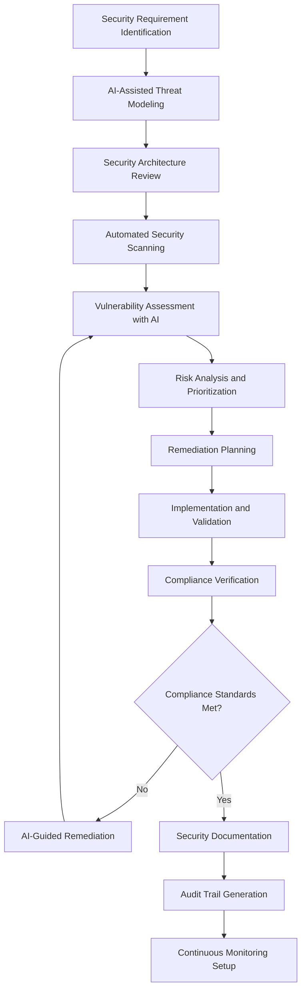

# Security Compliance Procedures SOP

## Purpose
This Standard Operating Procedure (SOP) defines the comprehensive security compliance framework for the Chat App project, ensuring adherence to security standards, regulatory requirements, and industry best practices through AI-enhanced security processes and automated compliance validation.

## Scope
This SOP applies to all security-related activities including:
- Security architecture review and validation
- Code security scanning and vulnerability assessment
- Data protection and privacy compliance
- Access control and authentication management
- Security incident prevention and monitoring
- Compliance reporting and auditing

## Prerequisites
- Security clearance and role-based access training
- Understanding of Chat App security architecture
- Familiarity with security scanning tools and AI security assistants
- Completed security compliance training certification
- Access to security monitoring and compliance dashboards

## Security Compliance Overview



## Detailed Procedures

### Phase 1: Security Requirements and Threat Modeling

#### Step 1.1: Security Requirement Analysis
**Duration**: 30-45 minutes
**Responsible**: Security Lead + AI Assistant

1. **Requirements Gathering**:
   ```markdown
   Analyze security requirements for:
   - Data sensitivity classification
   - Regulatory compliance needs (GDPR, CCPA, SOC2)
   - Authentication and authorization requirements
   - Encryption and data protection standards
   - Network security and API protection
   - Plugin security isolation requirements
   ```

2. **AI-Enhanced Requirement Validation**:
   ```markdown
   Use AI to analyze requirements for:
   
   Component: [Feature/Component Name]
   Data Types: [Personal, Sensitive, Public]
   Compliance Standards: [GDPR, CCPA, SOC2, etc.]
   
   Generate:
   1. Security requirement matrix
   2. Compliance checklist
   3. Risk assessment framework
   4. Implementation guidelines
   
   Follow Chat App security patterns and EventBus security model.
   ```

#### Step 1.2: AI-Assisted Threat Modeling
**Duration**: 45-60 minutes
**Responsible**: Security Lead + Development Team + AI

1. **Threat Model Generation**:
   ```markdown
   Create comprehensive threat model for:
   
   System Component: [EventBus/Plugin System/Terminal Interface]
   Attack Vectors: [Network, Input Validation, Plugin Isolation]
   Assets: [User Data, System Configuration, API Keys]
   
   Use STRIDE methodology enhanced with AI analysis:
   - Spoofing threats and prevention
   - Tampering vulnerabilities
   - Repudiation risks
   - Information disclosure vectors
   - Denial of service scenarios
   - Elevation of privilege paths
   
   Generate threat matrix with likelihood and impact scoring.
   ```

2. **Threat Validation and Prioritization**:
   - Review AI-generated threat scenarios
   - Validate against Chat App architecture
   - Prioritize threats by risk score
   - Identify immediate vs. long-term remediation needs

#### Step 1.3: Security Architecture Review
**Duration**: 60-90 minutes
**Responsible**: Security Architect + AI Assistant

1. **Architecture Security Assessment**:
   ```markdown
   Analyze Chat App security architecture:
   
   Focus Areas:
   1. EventBus security isolation
   2. Plugin sandboxing and permissions
   3. Configuration security (sensitive data handling)
   4. Terminal interface input validation
   5. State management security (SQLite encryption)
   6. Network communication security
   
   Generate:
   - Security control mapping
   - Attack surface analysis
   - Trust boundary identification
   - Security pattern recommendations
   ```

2. **AI-Powered Security Review**:
   - Automated architecture scanning
   - Security pattern compliance validation
   - Integration point vulnerability assessment
   - Configuration security analysis

### Phase 2: Automated Security Scanning and Assessment

#### Step 2.1: Code Security Scanning
**Duration**: 20-30 minutes (automated)
**Responsible**: Developer + AI Security Scanner

1. **Automated Security Scanning Setup**:
   ```bash
   # Static Application Security Testing (SAST)
   bandit -r . -f json -o security_report.json
   
   # Dependency vulnerability scanning
   safety check --json --output vuln_report.json
   
   # AI-enhanced security analysis
   ai-security-scan --project="chat_app" --deep-analysis
   ```

2. **AI-Enhanced Code Analysis**:
   ```markdown
   Perform deep security analysis on:
   
   Code Base: [Specific modules/files]
   Focus Areas:
   - Input validation and sanitization
   - SQL injection prevention (SQLite operations)
   - Command injection prevention
   - Path traversal vulnerabilities
   - Authentication bypass scenarios
   - Authorization logic flaws
   
   Generate:
   1. Vulnerability report with CVSS scoring
   2. Remediation recommendations
   3. Code fix suggestions
   4. Testing scenarios for security validation
   ```

#### Step 2.2: Dynamic Security Testing
**Duration**: 45-60 minutes
**Responsible**: Security Tester + AI Assistant

1. **Runtime Security Assessment**:
   ```python
   # AI-assisted penetration testing scenarios
   def run_security_tests():
       """
       Execute comprehensive security test suite:
       - Input fuzzing on terminal interface
       - Plugin isolation breach attempts
       - Configuration tampering tests
       - EventBus message injection tests
       - State corruption attack simulations
       """
   ```

2. **Security Test Implementation**:
   ```markdown
   Create security test scenarios for:
   
   Component: [Terminal Interface/Plugin System]
   Test Types:
   - Boundary value testing
   - Error handling security
   - Race condition exploitation
   - Resource exhaustion attacks
   - Privilege escalation attempts
   
   Use AI to generate test cases and expected security behaviors.
   ```

#### Step 2.3: Vulnerability Assessment and Risk Analysis
**Duration**: 30-45 minutes
**Responsible**: Security Analyst + AI

1. **Vulnerability Risk Scoring**:
   ```markdown
   Analyze discovered vulnerabilities using AI:
   
   Vulnerabilities Found: [List from scanning]
   
   For each vulnerability:
   1. CVSS base score calculation
   2. Environmental score adjustment
   3. Chat App specific impact assessment
   4. Exploitability analysis
   5. Remediation effort estimation
   
   Generate prioritized remediation roadmap.
   ```

2. **Risk Impact Analysis**:
   - Business impact assessment
   - Technical debt implications
   - Compliance violation risks
   - Customer trust impact evaluation

### Phase 3: Remediation and Implementation

#### Step 3.1: Security Remediation Planning
**Duration**: 30-60 minutes
**Responsible**: Security Lead + Development Team

1. **Remediation Strategy Development**:
   ```markdown
   Create remediation plan for identified issues:
   
   High Risk Issues: [Critical/High severity vulnerabilities]
   Medium Risk Issues: [Medium severity items]
   Low Risk Issues: [Low severity and future improvements]
   
   For each issue category:
   1. Remediation approach and timeline
   2. Required resources and skills
   3. Testing and validation strategy
   4. Rollback planning
   5. Communication requirements
   
   Use AI to optimize remediation sequencing and resource allocation.
   ```

2. **Implementation Planning**:
   - Sprint planning integration
   - Resource allocation
   - Timeline establishment
   - Dependencies identification

#### Step 3.2: AI-Assisted Secure Code Implementation
**Duration**: Variable based on complexity
**Responsible**: Developer + AI Security Assistant

1. **Secure Coding with AI Guidance**:
   ```markdown
   Implement security fixes with AI assistance:
   
   Vulnerability: [Specific security issue]
   Component: [Affected code/module]
   
   Generate secure implementation:
   1. Follow OWASP secure coding practices
   2. Implement defense-in-depth patterns
   3. Add comprehensive input validation
   4. Include security logging and monitoring
   5. Ensure proper error handling
   
   Validate against Chat App security patterns and EventBus security model.
   ```

2. **Security Code Review with AI**:
   ```markdown
   Review security implementation for:
   
   Security Controls:
   - Input validation completeness
   - Authentication and authorization logic
   - Encryption implementation
   - Error handling security
   - Logging and monitoring coverage
   
   Chat App Integration:
   - EventBus security event generation
   - Plugin security boundary enforcement
   - Configuration security handling
   - State management security
   
   Generate security validation test cases.
   ```

#### Step 3.3: Security Testing and Validation
**Duration**: 45-75 minutes
**Responsible**: Security Tester + Developer

1. **Security Test Execution**:
   ```bash
   # Automated security test suite
   python tests/security/run_security_tests.py
   
   # AI-enhanced penetration testing
   ai-pentest --target="localhost:8080" --config="chat_app_security.yaml"
   
   # Regression testing for security fixes
   python tests/security/regression_tests.py
   ```

2. **Security Validation Metrics**:
   - Vulnerability remediation verification
   - Security control effectiveness testing
   - Performance impact assessment
   - Integration security validation

### Phase 4: Compliance Verification and Documentation

#### Step 4.1: Compliance Standards Validation
**Duration**: 60-90 minutes
**Responsible**: Compliance Officer + AI Assistant

1. **Automated Compliance Checking**:
   ```markdown
   Validate compliance against standards:
   
   Standards: [GDPR, CCPA, SOC2, ISO27001]
   
   For each standard:
   1. Control implementation verification
   2. Documentation completeness check
   3. Process adherence validation
   4. Evidence collection and review
   5. Gap analysis and remediation planning
   
   Use AI to cross-reference requirements with implementation.
   ```

2. **Compliance Documentation Generation**:
   ```markdown
   Generate compliance artifacts:
   
   Required Documents:
   1. Security control matrix
   2. Risk assessment reports
   3. Vulnerability management records
   4. Incident response procedures
   5. Data protection impact assessments
   6. Audit trail documentation
   
   Use AI to ensure completeness and accuracy of compliance documentation.
   ```

#### Step 4.2: Security Documentation and Reporting
**Duration**: 45-60 minutes
**Responsible**: Security Lead + Technical Writer

1. **Security Documentation Update**:
   ```markdown
   Update security documentation:
   
   Documents to Update:
   1. Security architecture diagrams
   2. Threat model documentation
   3. Security control descriptions
   4. Incident response procedures
   5. Security configuration guides
   6. User security guidelines
   
   Ensure alignment with Chat App architecture and plugin system.
   ```

2. **Automated Report Generation**:
   - Security posture dashboards
   - Compliance status reports
   - Vulnerability trend analysis
   - Security metrics and KPIs

#### Step 4.3: Audit Trail and Evidence Management
**Duration**: 30-45 minutes
**Responsible**: Compliance Officer + AI

1. **Evidence Collection and Organization**:
   ```python
   def generate_audit_evidence():
       """
       AI-assisted audit trail generation:
       - Security scan results and remediation
       - Code review records with security focus
       - Compliance validation results
       - Security testing evidence
       - Change management security reviews
       """
   ```

2. **Audit Readiness Verification**:
   - Evidence completeness validation
   - Documentation accuracy review
   - Process compliance verification
   - Remediation tracking validation

### Phase 5: Continuous Monitoring and Maintenance

#### Step 5.1: Security Monitoring Setup
**Duration**: 60-90 minutes
**Responsible**: Security Operations + AI

1. **Monitoring Infrastructure Configuration**:
   ```markdown
   Configure AI-enhanced security monitoring:
   
   Monitoring Areas:
   1. Runtime security event detection
   2. Plugin behavior anomaly detection
   3. Configuration tampering alerts
   4. Authentication failure patterns
   5. Data access anomaly detection
   6. Performance-based attack detection
   
   Integrate with Chat App EventBus for real-time security events.
   ```

2. **AI-Powered Threat Detection**:
   - Machine learning-based anomaly detection
   - Behavioral analysis and alerting
   - Automated incident classification
   - Threat intelligence integration

#### Step 5.2: Continuous Compliance Monitoring
**Duration**: 30-45 minutes (setup) + Ongoing
**Responsible**: Compliance Team + AI

1. **Automated Compliance Monitoring**:
   ```bash
   # Daily compliance checks
   ai-compliance-monitor --standards="GDPR,SOC2" --config="compliance.yaml"
   
   # Weekly compliance reporting
   generate-compliance-report --period="weekly" --format="dashboard"
   ```

2. **Continuous Improvement Process**:
   - Regular security posture assessments
   - Compliance gap identification
   - Process optimization recommendations
   - Security training needs analysis

## Quality Standards and Metrics

### Security Compliance Requirements
- **Vulnerability Resolution**: Critical vulnerabilities remediated within 24 hours
- **Security Test Coverage**: 100% coverage of security-critical components
- **Compliance Adherence**: 100% compliance with applicable standards
- **Security Documentation**: Complete and current security documentation
- **Monitoring Coverage**: 24/7 security monitoring and alerting

### AI-Enhanced Security Metrics
- **Threat Detection Accuracy**: AI threat detection false positive rate <5%
- **Vulnerability Discovery Rate**: AI-assisted vulnerability identification improvement
- **Remediation Efficiency**: Time to remediation with AI assistance
- **Compliance Automation**: Percentage of compliance checks automated

### Security Review Checkpoints
1. **Threat Model Validation**: Confirmed before implementation
2. **Security Architecture Review**: Validated during design phase
3. **Code Security Scanning**: Verified during development
4. **Penetration Testing**: Confirmed during testing phase
5. **Compliance Verification**: Validated before production deployment

## Tools and Resources

### Required Security Tools
- **Static Analysis**: Bandit, SonarQube, CodeQL
- **Dynamic Testing**: OWASP ZAP, Burp Suite, Nessus
- **Dependency Scanning**: Safety, OWASP Dependency Check
- **AI Security Tools**: Claude Code security extensions, AI-powered SAST/DAST
- **Compliance Tools**: AWS Config, Azure Security Center, GRC platforms

### AI Security Assistants
- **Threat Modeling AI**: Automated threat scenario generation
- **Code Security AI**: Real-time secure coding assistance
- **Compliance AI**: Automated compliance validation and reporting
- **Incident Response AI**: Intelligent incident analysis and response

### Security Reference Materials
- **OWASP Top 10**: Web application security risks
- **NIST Cybersecurity Framework**: Comprehensive security guidance
- **Chat App Security Guide**: Project-specific security patterns
- **Plugin Security Standards**: Secure plugin development guidelines

## Troubleshooting Common Issues

### Compliance Validation Failures
**Problem**: Automated compliance checks fail validation
**Solution**:
1. Review specific compliance requirements with AI assistance
2. Identify gap areas and remediation needs
3. Implement missing controls following Chat App patterns
4. Re-validate compliance after remediation

### Security Scanning False Positives
**Problem**: Security scanners report false positive vulnerabilities
**Solution**:
1. Use AI to analyze scan results and classify findings
2. Review code context and validate actual risk
3. Configure scanner exceptions for verified false positives
4. Document rationale for risk acceptance decisions

### Performance Impact of Security Controls
**Problem**: Security implementations negatively impact Chat App performance
**Solution**:
1. Profile security control performance with AI assistance
2. Optimize security implementations for efficiency
3. Consider security control placement and timing
4. Balance security requirements with performance needs

### Plugin Security Isolation Issues
**Problem**: Plugin security boundaries are compromised
**Solution**:
1. Review plugin sandboxing implementation
2. Validate EventBus security event handling
3. Strengthen plugin permission model
4. Implement additional monitoring and detection

## Success Criteria

### Individual Security Success
- Consistent adherence to security procedures
- Effective use of AI security tools
- High-quality security implementations
- Proactive security issue identification

### Team Security Success
- Consistent security practices across team
- Reduced security vulnerability introduction
- Improved security incident response time
- Enhanced security awareness and capability

### Organizational Security Success
- Maintained compliance with all applicable standards
- Continuous improvement in security posture
- Reduced security-related business risk
- Enhanced customer and stakeholder trust

### Continuous Monitoring Success
- Real-time security threat detection and response
- Automated compliance validation and reporting
- Proactive security issue identification and remediation
- Data-driven security decision making

---

*This SOP ensures comprehensive security compliance through AI-enhanced processes while maintaining the flexibility to adapt to evolving security threats and regulatory requirements.*