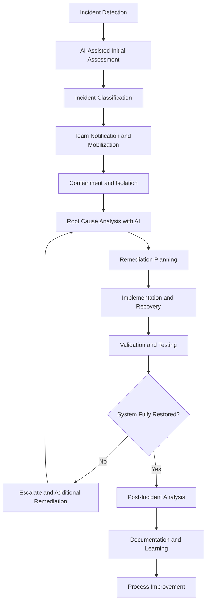

# Incident Response Procedures SOP

## Purpose
This Standard Operating Procedure (SOP) defines the comprehensive incident response framework for the Chat App project, ensuring rapid detection, analysis, containment, and resolution of operational incidents through AI-enhanced monitoring, automated response systems, and coordinated team actions.

## Scope
This SOP applies to all operational incidents including:
- System availability and performance incidents
- Security breaches and suspicious activities
- Data integrity and corruption issues
- Plugin system failures and isolation breaches
- EventBus communication disruptions
- Terminal interface and user experience issues

## Prerequisites
- Incident response team role assignments and training
- Access to monitoring systems and AI analysis tools
- Understanding of Chat App architecture and dependencies
- Familiarity with emergency communication protocols
- Completed incident response simulation exercises

## Incident Response Overview



## Incident Severity Classification

| Severity | Description | Response Time | Team Mobilization |
|----------|-------------|---------------|-------------------|
| **P0 - Critical** | Complete system outage, data breach, security compromise | 15 minutes | Full incident response team |
| **P1 - High** | Significant functionality impaired, performance degradation | 30 minutes | Core response team + specialists |
| **P2 - Medium** | Minor functionality affected, workarounds available | 2 hours | Primary on-call engineer |
| **P3 - Low** | Cosmetic issues, no user impact | 24 hours | Scheduled resolution |

## Detailed Procedures

### Phase 1: Detection and Initial Assessment

#### Step 1.1: Incident Detection and Alerting
**Duration**: 1-5 minutes (automated)
**Responsible**: Monitoring Systems + AI Detection

1. **Automated Detection Triggers**:
   ```yaml
   # AI-enhanced monitoring rules
   incident_detection:
     system_health:
       - cpu_usage > 90% for 5 minutes
       - memory_usage > 95% for 3 minutes
       - disk_space < 10% available
       - network_latency > 5000ms consistently
     
     application_health:
       - terminal_renderer fps < 10 for 30 seconds
       - eventbus_queue_depth > 1000 messages
       - plugin_failure_rate > 10% in 5 minutes
       - sqlite_connection_failures > 5 in 1 minute
     
     security_events:
       - authentication_failures > 20 in 1 minute
       - plugin_isolation_breach_detected
       - configuration_tampering_detected
       - unusual_system_call_patterns
   ```

2. **AI-Powered Incident Triage**:
   ```markdown
   Initial AI analysis of detected anomaly:
   
   Alert Data: [Raw monitoring data and metrics]
   System State: [Current Chat App component status]
   Recent Changes: [Deployment history, configuration changes]
   
   Generate:
   1. Incident severity preliminary assessment
   2. Affected component identification
   3. Potential root cause hypotheses
   4. Initial containment recommendations
   5. Required expertise and team members
   
   Consider Chat App architecture: EventBus, Plugin System, Terminal Interface, State Management
   ```

#### Step 1.2: Incident Verification and Classification
**Duration**: 5-15 minutes
**Responsible**: On-Call Engineer + AI Assistant

1. **Incident Validation Process**:
   ```bash
   # Automated health checks
   ./scripts/health_check.sh --comprehensive
   
   # AI-assisted system analysis
   ai-system-analyzer --incident-mode --capture-state
   
   # Manual validation of critical systems
   python tests/system_integration_tests.py --incident-validation
   ```

2. **Severity Classification with AI**:
   ```markdown
   Classify incident severity based on:
   
   Current Impact:
   - User-facing functionality affected
   - System performance degradation
   - Data integrity concerns
   - Security implications
   
   Potential Impact:
   - Escalation scenarios
   - Business continuity risks
   - Customer trust implications
   - Compliance violation risks
   
   Chat App Specific Factors:
   - EventBus communication status
   - Plugin system stability
   - Terminal interface responsiveness
   - State persistence integrity
   
   Generate severity classification with rationale.
   ```

#### Step 1.3: Team Notification and War Room Setup
**Duration**: 5-10 minutes
**Responsible**: Incident Commander + Automated Systems

1. **Automated Team Notification**:
   ```python
   def notify_incident_team(incident_data):
       """
       AI-enhanced team notification:
       - Determine required expertise based on incident type
       - Select appropriate team members by availability and skills
       - Generate incident summary for rapid context sharing
       - Set up communication channels and war room
       """
   ```

2. **War Room Coordination**:
   ```markdown
   Establish incident command structure:
   
   Incident Commander: [Primary coordinator and decision maker]
   Technical Lead: [Systems expert for Chat App architecture]
   Communications Lead: [Internal and external communication]
   Security Lead: [If security implications detected]
   
   Tools Setup:
   - Incident tracking dashboard
   - Real-time collaboration space
   - AI assistant with full system context
   - Monitoring and logging access
   
   Initial briefing with AI-generated incident overview.
   ```

### Phase 2: Containment and Isolation

#### Step 2.1: Immediate Containment Actions
**Duration**: 10-30 minutes
**Responsible**: Technical Lead + AI Assistance

1. **Automated Containment Triggers**:
   ```yaml
   # AI-driven containment actions
   containment_rules:
     security_breach:
       - isolate_affected_plugins
       - disable_external_connections
       - backup_current_state
       - enable_enhanced_logging
     
     system_overload:
       - implement_circuit_breakers
       - reduce_eventbus_throughput
       - disable_non_critical_plugins
       - scale_resources_if_available
     
     data_corruption:
       - stop_write_operations
       - backup_current_state
       - isolate_affected_storage
       - enable_read_only_mode
   ```

2. **Manual Containment Verification**:
   ```markdown
   Verify containment effectiveness:
   
   Containment Actions Taken: [List of automated/manual actions]
   
   Validation Checks:
   1. Confirm threat/issue is contained
   2. Verify system stability after containment
   3. Check for any collateral impact
   4. Validate monitoring continues to function
   5. Ensure backup systems are operational
   
   Use AI to predict potential escalation scenarios post-containment.
   ```

#### Step 2.2: Impact Assessment and Communication
**Duration**: 15-30 minutes
**Responsible**: Communications Lead + AI

1. **AI-Enhanced Impact Analysis**:
   ```markdown
   Comprehensive impact assessment:
   
   Technical Impact:
   - Affected Chat App components and functionality
   - Performance degradation measurements
   - Data integrity assessment
   - Security posture evaluation
   
   Business Impact:
   - User experience disruption
   - Service availability metrics
   - Compliance and regulatory implications
   - Customer and stakeholder concerns
   
   Generate impact summary and communication recommendations.
   ```

2. **Stakeholder Communication**:
   ```markdown
   # Incident Communication Template (AI-Generated)
   
   **Incident Summary**: [Brief description]
   **Status**: [Investigating/Contained/Resolving]
   **Impact**: [User-facing impact description]
   **Timeline**: [Discovery time, containment time, ETA for resolution]
   **Next Update**: [Scheduled communication time]
   
   **Actions Taken**:
   - [Containment measures implemented]
   - [Team mobilization status]
   - [Investigation progress]
   
   **Customer Impact**: [Clear description of user-visible effects]
   ```

### Phase 3: Investigation and Root Cause Analysis

#### Step 3.1: Evidence Collection and Preservation
**Duration**: 20-45 minutes
**Responsible**: Technical Lead + Security Lead (if applicable)

1. **Automated Evidence Gathering**:
   ```bash
   # Comprehensive system state capture
   ./scripts/incident_evidence_collection.sh
   
   # AI-assisted log analysis and correlation
   ai-log-analyzer --incident-mode --time-range="last-4-hours"
   
   # Chat App specific diagnostics
   python diagnostics/system_diagnostics.py --full-report --incident-context
   ```

2. **Evidence Analysis with AI**:
   ```markdown
   Analyze collected evidence for root cause identification:
   
   Log Data: [System, application, and security logs]
   Metrics: [Performance, resource utilization, error rates]
   State Information: [EventBus state, plugin states, database state]
   Configuration: [Recent changes, current settings]
   
   Focus Areas:
   1. Timeline correlation across all components
   2. Anomaly detection in normal operational patterns
   3. Configuration or code change correlation
   4. External dependency and integration issues
   5. Resource exhaustion or performance bottlenecks
   
   Generate root cause hypotheses with supporting evidence.
   ```

#### Step 3.2: Root Cause Identification
**Duration**: 30-90 minutes
**Responsible**: Technical Lead + Subject Matter Experts + AI

1. **Systematic Root Cause Analysis**:
   ```markdown
   Conduct thorough root cause analysis using AI assistance:
   
   Analysis Method: 5-Whys + Fishbone Diagram + Timeline Analysis
   
   Areas of Investigation:
   1. Chat App Architecture Components:
      - EventBus message processing and queuing
      - Plugin lifecycle and isolation boundaries  
      - Terminal interface and rendering pipeline
      - State management and SQLite operations
   
   2. Environmental Factors:
      - Infrastructure and resource constraints
      - Network connectivity and latency
      - External service dependencies
      - Operating system and platform issues
   
   3. Human Factors:
      - Recent code changes and deployments
      - Configuration modifications
      - Operational procedure changes
      - Team communication and coordination
   
   Use AI to synthesize findings into definitive root cause determination.
   ```

2. **Root Cause Validation**:
   ```python
   def validate_root_cause(hypothesis, evidence):
       """
       AI-assisted root cause validation:
       - Test hypothesis against all available evidence
       - Simulate the proposed failure scenario
       - Verify timeline consistency
       - Check for alternative explanations
       - Generate confidence scoring
       """
   ```

#### Step 3.3: Solution Design and Risk Assessment
**Duration**: 30-60 minutes
**Responsible**: Technical Lead + Architecture Team + AI

1. **Solution Development with AI**:
   ```markdown
   Design comprehensive solution for identified root cause:
   
   Root Cause: [Confirmed root cause with evidence]
   
   Solution Requirements:
   1. Immediate fix for current incident
   2. Long-term prevention measures
   3. Detection and monitoring improvements
   4. Process and procedure updates
   
   Chat App Integration Considerations:
   - Impact on EventBus performance and reliability
   - Plugin system compatibility and stability
   - Terminal interface user experience
   - State management and data integrity
   - Configuration management implications
   
   Generate detailed implementation plan with risk assessment.
   ```

2. **Solution Risk Analysis**:
   - Implementation risk assessment
   - Potential side effects and unintended consequences
   - Rollback and recovery planning
   - Testing and validation requirements

### Phase 4: Resolution and Recovery

#### Step 4.1: Solution Implementation
**Duration**: 30-180 minutes (varies by complexity)
**Responsible**: Technical Lead + Development Team

1. **Staged Implementation Approach**:
   ```bash
   # Pre-implementation validation
   python tests/pre_deployment_tests.py --incident-resolution
   
   # Staged rollout with monitoring
   ./scripts/deploy_incident_fix.sh --staged --monitor
   
   # AI-assisted deployment monitoring
   ai-deployment-monitor --incident-resolution --auto-rollback
   ```

2. **Implementation Validation**:
   ```markdown
   Validate solution effectiveness at each stage:
   
   Implementation Stage: [Development/Staging/Production]
   
   Validation Checks:
   1. Root cause issue resolution confirmation
   2. System stability and performance validation
   3. No regression in existing functionality
   4. Security posture maintenance
   5. User experience restoration
   
   Use AI to monitor system behavior patterns post-implementation.
   ```

#### Step 4.2: System Recovery and Verification
**Duration**: 30-60 minutes
**Responsible**: Technical Lead + QA Team

1. **Recovery Validation Process**:
   ```bash
   # Comprehensive system health verification
   python tests/system_recovery_tests.py --full-validation
   
   # AI-powered system behavior analysis
   ai-system-validator --post-incident --baseline-comparison
   
   # User acceptance testing for critical paths
   python tests/user_journey_tests.py --critical-paths
   ```

2. **Performance and Stability Monitoring**:
   ```markdown
   Establish enhanced monitoring for recovery period:
   
   Monitoring Duration: [24-72 hours depending on incident severity]
   
   Enhanced Metrics:
   1. System performance baselines restoration
   2. Error rate normalization
   3. User experience metrics recovery
   4. Resource utilization stability
   5. EventBus and plugin system health
   
   AI-powered anomaly detection with lowered thresholds during recovery.
   ```

#### Step 4.3: Service Restoration Communication
**Duration**: 15-30 minutes
**Responsible**: Communications Lead + Incident Commander

1. **Recovery Communication**:
   ```markdown
   # Service Restoration Announcement (AI-Generated)
   
   **Incident Resolution Update**
   
   **Status**: RESOLVED
   **Resolution Time**: [Time from detection to full resolution]
   **Root Cause**: [Non-technical summary of root cause]
   **Resolution**: [Non-technical summary of solution]
   
   **What We Did**:
   - [Key actions taken to resolve the issue]
   - [Measures implemented to prevent recurrence]
   - [Enhanced monitoring and detection added]
   
   **Service Status**: All services fully restored and operating normally
   **Next Steps**: Detailed post-incident review and improvement implementation
   ```

2. **Stakeholder Notification**:
   - Customer communication through appropriate channels
   - Internal team and management notification
   - Compliance and regulatory reporting if required
   - Documentation updates for support teams

### Phase 5: Post-Incident Analysis and Learning

#### Step 5.1: Comprehensive Post-Incident Review
**Duration**: 2-4 hours (scheduled within 48 hours)
**Responsible**: Full Incident Response Team + AI Facilitator

1. **AI-Facilitated Retrospective**:
   ```markdown
   Conduct thorough post-incident analysis with AI assistance:
   
   Review Areas:
   1. Timeline Analysis:
      - Detection time and method effectiveness
      - Response time against SLA targets
      - Decision points and decision quality
      - Communication effectiveness
   
   2. Technical Analysis:
      - Root cause accuracy and time to identification
      - Solution effectiveness and implementation quality
      - System resilience and recovery capabilities
      - Monitoring and alerting performance
   
   3. Process Analysis:
      - SOP adherence and effectiveness
      - Team coordination and communication
      - Escalation procedures and decision making
      - Documentation and knowledge sharing
   
   Use AI to identify patterns and improvement opportunities.
   ```

2. **Lessons Learned Documentation**:
   ```python
   def generate_lessons_learned(incident_data, team_feedback):
       """
       AI-assisted lessons learned generation:
       - Identify what worked well and should be reinforced
       - Highlight areas for improvement and specific actions
       - Generate recommendations for process enhancements
       - Create action items with owners and timelines
       """
   ```

#### Step 5.2: Action Item Planning and Implementation
**Duration**: 60-90 minutes
**Responsible**: Incident Commander + Team Leads

1. **Improvement Action Planning**:
   ```markdown
   Generate comprehensive improvement plan:
   
   Categories:
   1. Technical Improvements:
      - Code and architecture changes
      - Monitoring and alerting enhancements
      - Testing and validation improvements
      - Documentation updates
   
   2. Process Improvements:
      - SOP updates and refinements
      - Training and skill development
      - Communication procedures
      - Escalation criteria adjustments
   
   3. Organizational Improvements:
      - Team structure and responsibilities
      - Tools and resource allocation
      - Policy and procedure updates
      - Culture and practices enhancement
   
   Each action item includes: Owner, Timeline, Success Criteria, Dependencies
   ```

2. **Action Item Tracking**:
   - Integration with project management systems
   - Regular progress reviews and updates
   - Success measurement and validation
   - Continuous improvement feedback loop

#### Step 5.3: Knowledge Sharing and Training
**Duration**: 30-45 minutes + Ongoing
**Responsible**: Technical Lead + Training Team

1. **Knowledge Transfer Activities**:
   ```markdown
   Share incident learnings across organization:
   
   Knowledge Sharing Methods:
   1. Technical deep-dive sessions for engineering teams
   2. Executive briefings with business impact focus
   3. Cross-team sharing for related systems and processes
   4. Documentation updates and wiki contributions
   5. Training material updates and new scenario development
   
   Focus on Chat App specific patterns and architectural considerations.
   ```

2. **Training and Simulation Updates**:
   - Incorporate incident scenarios into training exercises
   - Update simulation environments with lessons learned
   - Enhance team skills based on identified gaps
   - Cross-training for critical knowledge areas

## Quality Standards and Metrics

### Incident Response Performance
- **Detection Time**: Mean time to detection (MTTD) < 5 minutes for P0/P1 incidents
- **Response Time**: Mean time to response (MTTR) per SLA by severity level
- **Resolution Time**: Mean time to resolution (MTTR) tracking and improvement
- **Communication Quality**: Stakeholder satisfaction with incident communication

### AI Enhancement Metrics
- **AI Accuracy**: Accuracy of AI-generated root cause analysis and recommendations
- **Automation Efficiency**: Percentage of response actions automated successfully
- **Decision Support**: Quality and usefulness of AI-provided analysis and recommendations
- **Learning Integration**: Effectiveness of AI in incorporating lessons learned

### Process Quality Indicators
1. **SOP Adherence**: Compliance with incident response procedures
2. **Team Coordination**: Effectiveness of team communication and collaboration
3. **Documentation Quality**: Completeness and accuracy of incident documentation
4. **Learning Implementation**: Success rate of post-incident improvement implementation

## Tools and Resources

### Required Incident Response Tools
- **Monitoring and Alerting**: Prometheus, Grafana, PagerDuty, AI-enhanced monitoring
- **Communication**: Slack, Teams, Conference systems with AI transcription
- **Documentation**: Incident tracking systems, AI-assisted report generation
- **Analysis Tools**: Log analysis, AI-powered root cause analysis, system diagnostics
- **Recovery Tools**: Deployment automation, rollback systems, validation frameworks

### AI-Powered Tools
- **Incident Detection AI**: Anomaly detection and early warning systems
- **Analysis AI**: Root cause analysis and evidence correlation
- **Communication AI**: Automated status updates and stakeholder communication
- **Learning AI**: Pattern recognition and improvement recommendation

### Chat App Specific Resources
- **System Diagnostics**: Chat App health check and diagnostic tools
- **Architecture Documentation**: Component interaction diagrams and dependencies
- **Runbook Library**: Standard procedures for common Chat App issues
- **Testing Frameworks**: Incident validation and recovery testing tools

## Troubleshooting Common Issues

### False Positive Alerts
**Problem**: AI monitoring generates false positive incident alerts
**Solution**:
1. Review AI model training data and detection patterns
2. Adjust sensitivity thresholds based on historical data
3. Implement human validation checkpoint for borderline cases
4. Continuously train models with incident feedback data

### Communication Breakdowns
**Problem**: Team communication fails during high-stress incidents
**Solution**:
1. Implement structured communication protocols with AI assistance
2. Use automated status updates to maintain information flow
3. Designate dedicated communication roles and backup coverage
4. Regular practice with communication tools and procedures

### Resource Availability Issues
**Problem**: Key personnel unavailable during incident response
**Solution**:
1. Implement comprehensive on-call rotation with skill-based scheduling
2. Cross-train team members on critical system components
3. Maintain up-to-date runbooks and documentation for common scenarios
4. Use AI to provide guidance when human expertise is limited

### Complex Multi-System Incidents
**Problem**: Incidents spanning multiple systems and teams create coordination challenges
**Solution**:
1. Establish clear incident command structure with defined roles
2. Use AI to coordinate across teams and provide unified view
3. Implement standardized communication and escalation procedures
4. Conduct regular multi-team incident simulation exercises

## Success Criteria

### Individual Response Success
- Consistent adherence to incident response procedures
- Effective use of AI tools for analysis and decision making
- Quality documentation and knowledge sharing
- Continuous learning and skill development

### Team Response Success
- Coordinated and efficient incident response across team members
- Effective communication and collaboration during high-stress situations
- Successful resolution within SLA targets
- Quality post-incident analysis and improvement implementation

### Organizational Response Success
- Minimized business impact and customer disruption
- Continuous improvement in response capabilities and system resilience
- Enhanced stakeholder confidence and trust
- Proactive risk management and prevention

### System Resilience Success
- Reduced incident frequency through proactive improvements
- Faster detection and automated response capabilities
- Enhanced system monitoring and predictive capabilities
- Improved overall system stability and reliability

---

*This SOP ensures rapid, coordinated, and effective incident response through AI-enhanced processes while maintaining focus on learning and continuous improvement.*