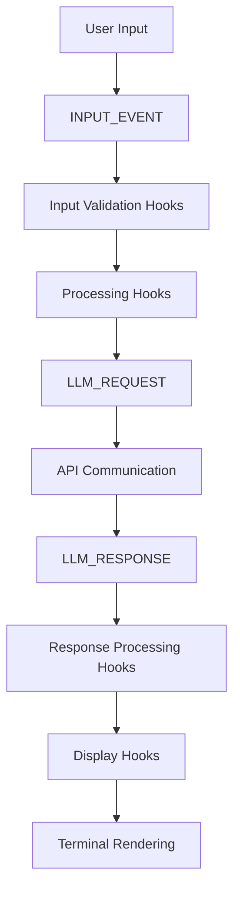
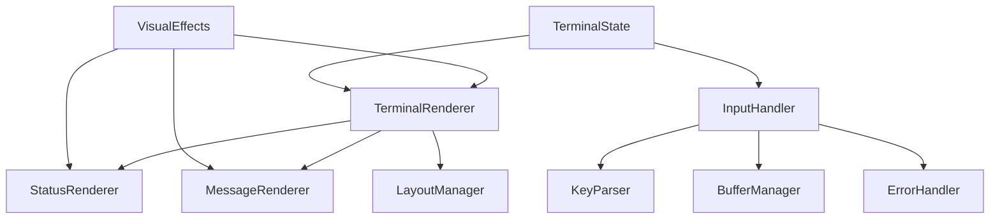

# System Architecture Standards

## Document Information
- **Version**: 1.0
- **Date**: 2025-09-09  
- **Status**: Active
- **Classification**: Internal

## 1. Architecture Principles

### 1.1 Core Architectural Principles
- **Modularity**: Systems composed of loosely coupled, cohesive modules
- **Scalability**: Architecture supports horizontal and vertical scaling
- **Maintainability**: Clear separation of concerns and consistent patterns
- **Testability**: Components designed for comprehensive testing
- **Observability**: Built-in monitoring, logging, and tracing
- **Resilience**: Graceful degradation and fault tolerance
- **Security by Design**: Security integrated at every architectural layer

### 1.2 AI-Enhanced Architecture Validation
```python
# Example: AI-assisted architecture compliance checker
class ArchitectureValidator:
    def __init__(self, ai_assistant):
        self.ai_assistant = ai_assistant
        self.architecture_rules = self.load_architecture_rules()
    
    async def validate_component_design(self, component_spec: dict) -> dict:
        """Validate component design against architecture standards."""
        validation_prompt = f"""
        Analyze this component specification against our architecture standards:
        
        Component: {component_spec}
        
        Architecture Standards:
        - Event-driven architecture with EventBus
        - Async/await pattern throughout
        - Plugin-based extensibility
        - Clear separation of concerns
        - Comprehensive error handling
        
        Return validation results with specific recommendations.
        """
        
        result = await self.ai_assistant.analyze(validation_prompt)
        return self.parse_validation_result(result)
    
    def check_dependency_compliance(self, dependencies: list) -> dict:
        """Check if dependencies align with architectural standards."""
        approved_patterns = [
            "core.events.*",  # Event system
            "core.config.*",  # Configuration
            "core.io.*",      # I/O components
            "plugins.*"       # Plugin system
        ]
        
        violations = []
        for dep in dependencies:
            if not any(dep.startswith(pattern.replace("*", "")) for pattern in approved_patterns):
                violations.append(f"Unapproved dependency: {dep}")
        
        return {"compliant": len(violations) == 0, "violations": violations}
```

## 2. System Architecture Patterns

### 2.1 Event-Driven Architecture
The Chat App follows a comprehensive event-driven architecture with centralized event management.

#### Core Components
```python
# Event Bus Architecture Pattern
class EventBus:
    """Central event coordination system."""
    
    def __init__(self):
        self.hooks: Dict[str, List[Hook]] = defaultdict(list)
        self.event_log: List[Event] = []
        self.metrics: EventMetrics = EventMetrics()
    
    async def emit_event(self, event: Event) -> EventResult:
        """Emit event and execute all registered hooks."""
        # Pre-hooks (validation, preparation)
        await self.execute_hooks(event, HookType.PRE)
        
        # Main event processing
        if not event.cancelled:
            await self.execute_hooks(event, HookType.MAIN)
        
        # Post-hooks (cleanup, logging)
        await self.execute_hooks(event, HookType.POST)
        
        return EventResult(event, self.collect_hook_results(event))
```

#### Event Types and Flow


### 2.2 Plugin Architecture
Extensible plugin system with dynamic discovery and lifecycle management.

#### Plugin Interface Standard
```python
from abc import ABC, abstractmethod
from typing import Dict, Any, Optional

class PluginInterface(ABC):
    """Standard interface for all plugins."""
    
    @abstractmethod
    def __init__(self, state_manager, event_bus, renderer, config):
        """Initialize plugin with core dependencies."""
        pass
    
    @abstractmethod
    async def initialize(self) -> None:
        """Perform async initialization tasks."""
        pass
    
    @abstractmethod
    async def register_hooks(self) -> None:
        """Register event hooks with the EventBus."""
        pass
    
    @abstractmethod
    def get_status_line(self) -> Optional[str]:
        """Return status information for terminal display."""
        pass
    
    @abstractmethod
    async def shutdown(self) -> None:
        """Clean shutdown and resource cleanup."""
        pass
    
    @staticmethod
    @abstractmethod
    def get_default_config() -> Dict[str, Any]:
        """Return default configuration for the plugin."""
        pass
```

#### Plugin Discovery and Registration
```python
class PluginRegistry:
    """Manages plugin discovery, loading, and lifecycle."""
    
    def __init__(self, plugin_directory: str = "plugins"):
        self.plugin_directory = plugin_directory
        self.plugins: Dict[str, PluginInterface] = {}
        self.plugin_configs: Dict[str, Dict] = {}
    
    async def discover_plugins(self) -> List[str]:
        """Discover all available plugins in the plugin directory."""
        plugin_files = []
        for file in os.listdir(self.plugin_directory):
            if file.endswith('.py') and not file.startswith('__'):
                plugin_files.append(file[:-3])  # Remove .py extension
        return plugin_files
    
    async def load_plugin(self, plugin_name: str) -> bool:
        """Load and initialize a specific plugin."""
        try:
            # Dynamic import
            module = importlib.import_module(f"{self.plugin_directory}.{plugin_name}")
            plugin_class = getattr(module, self.get_plugin_class_name(plugin_name))
            
            # Create plugin instance
            plugin_instance = plugin_class(
                self.state_manager,
                self.event_bus,
                self.renderer,
                self.config
            )
            
            # Initialize plugin
            await plugin_instance.initialize()
            await plugin_instance.register_hooks()
            
            self.plugins[plugin_name] = plugin_instance
            return True
            
        except Exception as e:
            logger.error(f"Failed to load plugin {plugin_name}: {e}")
            return False
```

### 2.3 Modular I/O Architecture
The I/O system is decomposed into 11 specialized components for maximum modularity and testability.

#### I/O Component Architecture
```python
# Core I/O Components
class TerminalRenderer:
    """Main rendering coordinator - orchestrates all rendering."""
    
class InputHandler:
    """Advanced keyboard input processing with error recovery."""
    
class VisualEffects:
    """Centralized gradient, shimmer, and color effects."""
    
class TerminalState:
    """Low-level terminal operations and capability detection."""
    
class StatusRenderer:
    """Multi-area status display with semantic coloring."""
    
class MessageRenderer:
    """Conversation display and formatting."""
    
class LayoutManager:
    """Screen regions, positioning, and adaptive layouts."""
    
class BufferManager:
    """Input buffer management with history."""
    
class KeyParser:
    """Structured key event processing and normalization."""
    
class ErrorHandler:
    """Comprehensive input error recovery."""
    
class ThinkingAnimation:
    """Animated thinking indicators with configurable effects."""
```

#### Component Interaction Pattern


## 3. Data Architecture Standards

### 3.1 State Management Architecture
```python
class StateManager:
    """Centralized state management with versioning and persistence."""
    
    def __init__(self, db_path: str):
        self.db_path = db_path
        self.current_state = {}
        self.state_history = []
        self.version = 0
    
    async def update_state(self, key: str, value: Any, create_snapshot: bool = True):
        """Update state with optional versioning."""
        if create_snapshot:
            await self.create_state_snapshot()
        
        self.current_state[key] = value
        self.version += 1
        await self.persist_state()
    
    async def create_state_snapshot(self):
        """Create snapshot for undo/redo functionality."""
        snapshot = {
            'version': self.version,
            'state': deepcopy(self.current_state),
            'timestamp': datetime.utcnow()
        }
        self.state_history.append(snapshot)
        
        # Limit history size
        if len(self.state_history) > 100:
            self.state_history.pop(0)
```

### 3.2 Configuration Architecture
```python
class ConfigManager:
    """Hierarchical configuration with plugin merging and validation."""
    
    def __init__(self):
        self.config_data = {}
        self.plugin_configs = {}
        self.config_schema = self.load_schema()
    
    def get(self, key: str, default: Any = None) -> Any:
        """Get configuration value using dot notation (e.g., 'section.subsection.key')."""
        keys = key.split('.')
        value = self.config_data
        
        try:
            for k in keys:
                value = value[k]
            return value
        except (KeyError, TypeError):
            return default
    
    def merge_plugin_config(self, plugin_name: str, plugin_config: Dict[str, Any]):
        """Merge plugin configuration into main config."""
        plugin_section = f"plugins.{plugin_name}"
        self.set(plugin_section, plugin_config)
    
    def validate_config(self) -> Dict[str, List[str]]:
        """Validate entire configuration against schema."""
        return self.config_validator.validate(self.config_data, self.config_schema)
```

## 4. API Architecture Standards

### 4.1 Internal API Design
```python
from abc import ABC, abstractmethod
from typing import Dict, Any, Optional, TypedDict

class APIResponse(TypedDict):
    """Standard API response format."""
    success: bool
    data: Optional[Dict[str, Any]]
    error: Optional[str]
    metadata: Dict[str, Any]

class APIInterface(ABC):
    """Standard interface for internal APIs."""
    
    @abstractmethod
    async def handle_request(self, request: Dict[str, Any]) -> APIResponse:
        """Process API request and return standardized response."""
        pass
    
    @abstractmethod
    def validate_request(self, request: Dict[str, Any]) -> bool:
        """Validate request format and parameters."""
        pass

# Example: LLM API Implementation
class LLMAPIHandler(APIInterface):
    """Handler for LLM-related API requests."""
    
    async def handle_request(self, request: Dict[str, Any]) -> APIResponse:
        """Handle LLM API request with proper error handling."""
        try:
            if not self.validate_request(request):
                return APIResponse(
                    success=False,
                    data=None,
                    error="Invalid request format",
                    metadata={"request_id": request.get("id", "unknown")}
                )
            
            # Process LLM request
            result = await self.process_llm_request(request)
            
            return APIResponse(
                success=True,
                data=result,
                error=None,
                metadata={
                    "request_id": request.get("id"),
                    "processing_time": result.get("processing_time"),
                    "model_used": result.get("model")
                }
            )
            
        except Exception as e:
            logger.exception(f"LLM API error: {e}")
            return APIResponse(
                success=False,
                data=None,
                error=str(e),
                metadata={"request_id": request.get("id", "unknown")}
            )
```

### 4.2 External API Integration Standards
```python
class ExternalAPIClient:
    """Base class for external API integrations."""
    
    def __init__(self, base_url: str, timeout: float = 30.0):
        self.base_url = base_url
        self.timeout = timeout
        self.session = None
        self.rate_limiter = RateLimiter()
        self.circuit_breaker = CircuitBreaker()
    
    async def make_request(
        self, 
        method: str, 
        endpoint: str, 
        data: Optional[Dict] = None,
        headers: Optional[Dict] = None
    ) -> APIResponse:
        """Make HTTP request with resilience patterns."""
        
        # Rate limiting
        if not await self.rate_limiter.acquire():
            return APIResponse(
                success=False,
                error="Rate limit exceeded",
                data=None,
                metadata={}
            )
        
        # Circuit breaker
        if not self.circuit_breaker.can_execute():
            return APIResponse(
                success=False,
                error="Circuit breaker open",
                data=None,
                metadata={}
            )
        
        try:
            async with self.get_session() as session:
                async with session.request(
                    method,
                    f"{self.base_url}/{endpoint}",
                    json=data,
                    headers=headers,
                    timeout=self.timeout
                ) as response:
                    response.raise_for_status()
                    result = await response.json()
                    
                    self.circuit_breaker.record_success()
                    return APIResponse(
                        success=True,
                        data=result,
                        error=None,
                        metadata={"status_code": response.status}
                    )
                    
        except Exception as e:
            self.circuit_breaker.record_failure()
            logger.error(f"External API error: {e}")
            return APIResponse(
                success=False,
                error=str(e),
                data=None,
                metadata={}
            )
```

## 5. Performance Architecture Standards

### 5.1 Async Performance Patterns
```python
import asyncio
from typing import List, Callable, Any

class PerformanceOptimizer:
    """Performance optimization utilities and patterns."""
    
    @staticmethod
    async def batch_process(
        items: List[Any],
        processor: Callable,
        batch_size: int = 10,
        max_concurrency: int = 5
    ) -> List[Any]:
        """Process items in optimized batches with concurrency control."""
        semaphore = asyncio.Semaphore(max_concurrency)
        
        async def process_batch(batch):
            async with semaphore:
                tasks = [processor(item) for item in batch]
                return await asyncio.gather(*tasks, return_exceptions=True)
        
        # Split into batches
        batches = [items[i:i + batch_size] for i in range(0, len(items), batch_size)]
        
        # Process batches concurrently
        batch_results = await asyncio.gather(*[process_batch(batch) for batch in batches])
        
        # Flatten results
        return [item for batch in batch_results for item in batch]
    
    @staticmethod
    def cache_with_ttl(ttl_seconds: int = 300):
        """Decorator for caching with TTL."""
        def decorator(func):
            cache = {}
            
            async def wrapper(*args, **kwargs):
                key = str(args) + str(sorted(kwargs.items()))
                now = time.time()
                
                if key in cache:
                    result, timestamp = cache[key]
                    if now - timestamp < ttl_seconds:
                        return result
                
                result = await func(*args, **kwargs)
                cache[key] = (result, now)
                
                # Clean expired entries periodically
                if len(cache) > 100:
                    cache.clear()
                
                return result
            return wrapper
        return decorator
```

### 5.2 Memory Management Standards
```python
import gc
import psutil
from typing import Optional

class MemoryManager:
    """Memory monitoring and management utilities."""
    
    def __init__(self, memory_threshold_mb: int = 100):
        self.memory_threshold_mb = memory_threshold_mb
        self.process = psutil.Process()
    
    def get_memory_usage(self) -> dict:
        """Get current memory usage statistics."""
        memory_info = self.process.memory_info()
        return {
            "rss_mb": memory_info.rss / 1024 / 1024,
            "vms_mb": memory_info.vms / 1024 / 1024,
            "percent": self.process.memory_percent(),
            "threshold_mb": self.memory_threshold_mb
        }
    
    def check_memory_pressure(self) -> bool:
        """Check if memory usage exceeds threshold."""
        usage = self.get_memory_usage()
        return usage["rss_mb"] > self.memory_threshold_mb
    
    async def cleanup_if_needed(self) -> bool:
        """Perform cleanup if memory pressure detected."""
        if self.check_memory_pressure():
            # Force garbage collection
            gc.collect()
            
            # Clear caches if available
            await self.clear_application_caches()
            
            # Check if cleanup was effective
            return not self.check_memory_pressure()
        
        return True
    
    async def clear_application_caches(self):
        """Clear application-specific caches."""
        # Implementation specific to application caches
        pass
```

## 6. Security Architecture Standards

### 6.1 Security Layer Architecture
```python
class SecurityLayer:
    """Comprehensive security layer for all components."""
    
    def __init__(self):
        self.auth_manager = AuthenticationManager()
        self.authz_manager = AuthorizationManager()
        self.audit_logger = AuditLogger()
        self.encryption_service = EncryptionService()
    
    async def secure_operation(
        self,
        operation: Callable,
        user_context: UserContext,
        required_permissions: List[str],
        audit_event: str
    ) -> Any:
        """Wrap any operation with comprehensive security."""
        
        # Authentication
        if not await self.auth_manager.validate_user(user_context):
            await self.audit_logger.log_security_event(
                "AUTH_FAILURE",
                user_context.user_id,
                audit_event
            )
            raise AuthenticationError("Authentication failed")
        
        # Authorization
        if not await self.authz_manager.check_permissions(
            user_context,
            required_permissions
        ):
            await self.audit_logger.log_security_event(
                "AUTHZ_FAILURE",
                user_context.user_id,
                audit_event
            )
            raise AuthorizationError("Insufficient permissions")
        
        try:
            # Execute operation
            result = await operation()
            
            # Audit success
            await self.audit_logger.log_security_event(
                "OPERATION_SUCCESS",
                user_context.user_id,
                audit_event
            )
            
            return result
            
        except Exception as e:
            # Audit failure
            await self.audit_logger.log_security_event(
                "OPERATION_FAILURE",
                user_context.user_id,
                f"{audit_event}: {str(e)}"
            )
            raise
```

## 7. Testing Architecture Standards

### 7.1 Testing Strategy Architecture
```python
import unittest
from unittest.mock import Mock, patch, AsyncMock
from typing import Dict, Any, List

class ArchitectureTestBase(unittest.TestCase):
    """Base class for architecture compliance testing."""
    
    def setUp(self):
        """Set up common test fixtures."""
        self.mock_event_bus = Mock()
        self.mock_state_manager = Mock()
        self.mock_config = Mock()
        self.test_data = self.load_test_data()
    
    def assert_event_driven_compliance(self, component):
        """Verify component follows event-driven architecture."""
        # Check that component has event_bus dependency
        self.assertTrue(hasattr(component, 'event_bus'))
        
        # Check that component registers hooks
        self.assertTrue(hasattr(component, 'register_hooks'))
        self.assertTrue(callable(component.register_hooks))
    
    def assert_plugin_interface_compliance(self, plugin):
        """Verify plugin implements required interface."""
        required_methods = [
            'initialize', 'register_hooks', 'get_status_line', 'shutdown'
        ]
        
        for method in required_methods:
            self.assertTrue(hasattr(plugin, method))
            self.assertTrue(callable(getattr(plugin, method)))
    
    def assert_async_pattern_compliance(self, methods: List[str]):
        """Verify async/await pattern compliance."""
        for method_name in methods:
            method = getattr(self.component, method_name)
            self.assertTrue(asyncio.iscoroutinefunction(method))

# Component Integration Tests
class ComponentIntegrationTest(ArchitectureTestBase):
    """Test component integration patterns."""
    
    async def test_event_flow_integration(self):
        """Test complete event flow through system."""
        # Setup components
        event_bus = EventBus()
        test_plugin = TestPlugin(
            self.mock_state_manager,
            event_bus,
            self.mock_renderer,
            self.mock_config
        )
        
        await test_plugin.initialize()
        await test_plugin.register_hooks()
        
        # Create test event
        test_event = Event(
            event_type="TEST_EVENT",
            data={"test": "data"},
            source="test"
        )
        
        # Emit event and verify processing
        result = await event_bus.emit_event(test_event)
        
        self.assertTrue(result.success)
        self.assertIsNotNone(result.data)
```

### 7.2 Performance Testing Standards
```python
import time
import asyncio
from concurrent.futures import ThreadPoolExecutor

class PerformanceTestSuite:
    """Performance testing utilities for architecture validation."""
    
    async def benchmark_component_performance(
        self,
        component,
        test_operations: List[Callable],
        target_ops_per_second: int = 100
    ) -> Dict[str, float]:
        """Benchmark component performance against targets."""
        results = {}
        
        for operation in test_operations:
            operation_name = operation.__name__
            
            # Warm up
            for _ in range(10):
                await operation(component)
            
            # Benchmark
            start_time = time.time()
            iterations = 0
            
            while time.time() - start_time < 1.0:  # 1 second test
                await operation(component)
                iterations += 1
            
            ops_per_second = iterations / (time.time() - start_time)
            results[operation_name] = ops_per_second
            
            # Verify against target
            self.assertGreaterEqual(
                ops_per_second,
                target_ops_per_second,
                f"{operation_name} performance below target: "
                f"{ops_per_second:.2f} < {target_ops_per_second}"
            )
        
        return results
    
    async def test_concurrent_load(
        self,
        component,
        operation: Callable,
        concurrent_users: int = 10,
        duration_seconds: int = 30
    ) -> Dict[str, Any]:
        """Test component under concurrent load."""
        start_time = time.time()
        completed_operations = 0
        errors = 0
        
        async def user_simulation():
            nonlocal completed_operations, errors
            while time.time() - start_time < duration_seconds:
                try:
                    await operation(component)
                    completed_operations += 1
                except Exception:
                    errors += 1
                await asyncio.sleep(0.01)  # Small delay between operations
        
        # Run concurrent user simulations
        tasks = [user_simulation() for _ in range(concurrent_users)]
        await asyncio.gather(*tasks)
        
        total_time = time.time() - start_time
        
        return {
            "concurrent_users": concurrent_users,
            "duration_seconds": total_time,
            "completed_operations": completed_operations,
            "errors": errors,
            "ops_per_second": completed_operations / total_time,
            "error_rate": errors / (completed_operations + errors) if (completed_operations + errors) > 0 else 0
        }
```

## 8. Deployment Architecture Standards

### 8.1 Container Architecture Standards
```yaml
# Example: Container architecture for Chat App
version: '3.8'
services:
  chat-app:
    build:
      context: .
      dockerfile: Dockerfile
    environment:
      - CONFIG_PATH=/app/config
      - LOG_LEVEL=INFO
    volumes:
      - ./config:/app/config:ro
      - chat-app-data:/app/data
    ports:
      - "8000:8000"
    healthcheck:
      test: ["CMD", "python", "-c", "import requests; requests.get('http://localhost:8000/health')"]
      interval: 30s
      timeout: 10s
      retries: 3
    restart: unless-stopped

volumes:
  chat-app-data:
```

```dockerfile
# Multi-stage Dockerfile following security best practices
FROM python:3.11-slim as base

# Install system dependencies
RUN apt-get update && apt-get install -y \
    --no-install-recommends \
    gcc \
    && rm -rf /var/lib/apt/lists/*

# Create non-root user
RUN groupadd -r chatapp && useradd -r -g chatapp chatapp

# Set up application directory
WORKDIR /app
COPY requirements.txt .
RUN pip install --no-cache-dir -r requirements.txt

FROM base as production
COPY --chown=chatapp:chatapp . .
USER chatapp
EXPOSE 8000
CMD ["python", "main.py"]
```

### 8.2 Infrastructure as Code Standards
```python
# Infrastructure monitoring and health checks
class HealthCheckManager:
    """Comprehensive health checking for all system components."""
    
    def __init__(self):
        self.health_checks = {}
        self.metrics_collector = MetricsCollector()
    
    def register_health_check(self, name: str, check_func: Callable):
        """Register a health check function."""
        self.health_checks[name] = check_func
    
    async def run_all_health_checks(self) -> Dict[str, Any]:
        """Run all registered health checks."""
        results = {}
        overall_healthy = True
        
        for name, check_func in self.health_checks.items():
            try:
                start_time = time.time()
                result = await check_func()
                duration = time.time() - start_time
                
                results[name] = {
                    "healthy": result.get("healthy", False),
                    "message": result.get("message", ""),
                    "duration_ms": duration * 1000,
                    "details": result.get("details", {})
                }
                
                if not result.get("healthy", False):
                    overall_healthy = False
                    
            except Exception as e:
                results[name] = {
                    "healthy": False,
                    "message": f"Health check failed: {str(e)}",
                    "duration_ms": 0,
                    "details": {}
                }
                overall_healthy = False
        
        return {
            "overall_healthy": overall_healthy,
            "timestamp": datetime.utcnow().isoformat(),
            "checks": results
        }

# Example health checks for Chat App components
async def event_bus_health_check() -> Dict[str, Any]:
    """Check EventBus health."""
    try:
        # Test event processing
        test_event = Event("HEALTH_CHECK", {"test": True}, "health_checker")
        result = await event_bus.emit_event(test_event)
        
        return {
            "healthy": result.success,
            "message": "EventBus operating normally",
            "details": {
                "active_hooks": len(event_bus.hooks),
                "event_queue_size": event_bus.get_queue_size()
            }
        }
    except Exception as e:
        return {
            "healthy": False,
            "message": f"EventBus error: {str(e)}",
            "details": {}
        }

async def plugin_health_check() -> Dict[str, Any]:
    """Check plugin system health."""
    try:
        plugin_statuses = {}
        healthy_plugins = 0
        
        for plugin_name, plugin in plugin_registry.plugins.items():
            try:
                status = plugin.get_status_line()
                plugin_statuses[plugin_name] = {
                    "active": True,
                    "status": status or "OK"
                }
                healthy_plugins += 1
            except Exception as e:
                plugin_statuses[plugin_name] = {
                    "active": False,
                    "status": f"Error: {str(e)}"
                }
        
        return {
            "healthy": healthy_plugins == len(plugin_registry.plugins),
            "message": f"{healthy_plugins}/{len(plugin_registry.plugins)} plugins healthy",
            "details": {
                "plugins": plugin_statuses,
                "total_plugins": len(plugin_registry.plugins),
                "healthy_plugins": healthy_plugins
            }
        }
    except Exception as e:
        return {
            "healthy": False,
            "message": f"Plugin system error: {str(e)}",
            "details": {}
        }
```

## 9. AI-Enhanced Architecture Validation

### 9.1 Automated Architecture Review
```python
class AIArchitectureReviewer:
    """AI-powered architecture review and compliance checking."""
    
    def __init__(self, ai_assistant):
        self.ai_assistant = ai_assistant
        self.architecture_patterns = self.load_architecture_patterns()
    
    async def review_component_architecture(self, component_path: str) -> Dict[str, Any]:
        """Review component against architecture standards."""
        
        # Load component code
        component_code = await self.load_component_code(component_path)
        
        review_prompt = f"""
        Review this component against our architecture standards:
        
        COMPONENT CODE:
        {component_code}
        
        ARCHITECTURE STANDARDS TO CHECK:
        1. Event-driven pattern compliance (EventBus usage)
        2. Plugin interface implementation
        3. Async/await pattern usage
        4. Error handling patterns
        5. Configuration management compliance
        6. Security pattern implementation
        7. Performance optimization patterns
        8. Testing architecture compliance
        
        PROVIDE:
        - Compliance score (0-100)
        - Specific violations found
        - Improvement recommendations
        - Code examples for fixes
        
        Format response as JSON.
        """
        
        review_result = await self.ai_assistant.analyze(review_prompt)
        return self.parse_review_result(review_result)
    
    async def suggest_architecture_improvements(self, codebase_analysis: Dict) -> List[str]:
        """Generate architecture improvement suggestions."""
        
        improvement_prompt = f"""
        Based on this codebase analysis, suggest architecture improvements:
        
        CURRENT ARCHITECTURE:
        {json.dumps(codebase_analysis, indent=2)}
        
        FOCUS AREAS:
        - Component coupling reduction
        - Performance optimization opportunities
        - Security enhancement possibilities
        - Testability improvements
        - Maintainability enhancements
        - Scalability considerations
        
        Provide specific, actionable recommendations with code examples.
        """
        
        suggestions = await self.ai_assistant.analyze(improvement_prompt)
        return self.parse_improvement_suggestions(suggestions)
```

### 9.2 Architecture Metrics and Monitoring
```python
class ArchitectureMetrics:
    """Comprehensive architecture health metrics."""
    
    def __init__(self):
        self.metrics = {}
        self.thresholds = self.load_architecture_thresholds()
    
    def calculate_coupling_metrics(self, dependency_graph: Dict) -> Dict[str, float]:
        """Calculate component coupling metrics."""
        metrics = {
            "afferent_coupling": {},  # Dependencies on this component
            "efferent_coupling": {},  # Dependencies this component has
            "instability": {}         # Efferent / (Afferent + Efferent)
        }
        
        for component, dependencies in dependency_graph.items():
            efferent = len(dependencies)
            afferent = sum(1 for deps in dependency_graph.values() if component in deps)
            
            metrics["afferent_coupling"][component] = afferent
            metrics["efferent_coupling"][component] = efferent
            metrics["instability"][component] = (
                efferent / (afferent + efferent) if (afferent + efferent) > 0 else 0
            )
        
        return metrics
    
    def calculate_complexity_metrics(self, component_analysis: Dict) -> Dict[str, Any]:
        """Calculate architectural complexity metrics."""
        return {
            "cyclomatic_complexity": self.calculate_cyclomatic_complexity(component_analysis),
            "cognitive_complexity": self.calculate_cognitive_complexity(component_analysis),
            "component_count": len(component_analysis.get("components", [])),
            "interface_count": len(component_analysis.get("interfaces", [])),
            "dependency_depth": self.calculate_dependency_depth(component_analysis)
        }
    
    async def generate_architecture_report(self) -> Dict[str, Any]:
        """Generate comprehensive architecture health report."""
        report = {
            "timestamp": datetime.utcnow().isoformat(),
            "overall_score": 0,
            "metrics": {},
            "violations": [],
            "recommendations": []
        }
        
        # Collect all metrics
        coupling_metrics = self.calculate_coupling_metrics(self.dependency_graph)
        complexity_metrics = self.calculate_complexity_metrics(self.component_analysis)
        performance_metrics = await self.collect_performance_metrics()
        security_metrics = await self.collect_security_metrics()
        
        report["metrics"] = {
            "coupling": coupling_metrics,
            "complexity": complexity_metrics,
            "performance": performance_metrics,
            "security": security_metrics
        }
        
        # Calculate overall score
        report["overall_score"] = self.calculate_overall_architecture_score(report["metrics"])
        
        # Identify violations and recommendations
        report["violations"] = self.identify_architecture_violations(report["metrics"])
        report["recommendations"] = await self.generate_recommendations(report["metrics"])
        
        return report
```

## 10. Enforcement and Compliance

### 10.1 Architecture Compliance Gates
```python
class ArchitectureComplianceGate:
    """Automated compliance checking for CI/CD pipeline."""
    
    def __init__(self):
        self.compliance_rules = self.load_compliance_rules()
        self.ai_reviewer = AIArchitectureReviewer()
    
    async def run_compliance_check(self, changed_files: List[str]) -> Dict[str, Any]:
        """Run comprehensive compliance check on changed files."""
        
        compliance_results = {
            "overall_compliant": True,
            "files_checked": len(changed_files),
            "violations": [],
            "warnings": [],
            "score": 100
        }
        
        for file_path in changed_files:
            if self.is_code_file(file_path):
                file_result = await self.check_file_compliance(file_path)
                
                if not file_result["compliant"]:
                    compliance_results["overall_compliant"] = False
                    compliance_results["violations"].extend(file_result["violations"])
                
                compliance_results["warnings"].extend(file_result.get("warnings", []))
        
        # Calculate overall compliance score
        total_issues = len(compliance_results["violations"]) + len(compliance_results["warnings"])
        compliance_results["score"] = max(0, 100 - (total_issues * 5))
        
        return compliance_results
    
    async def check_file_compliance(self, file_path: str) -> Dict[str, Any]:
        """Check individual file against architecture standards."""
        
        violations = []
        warnings = []
        
        # Load and analyze file
        file_content = await self.load_file(file_path)
        analysis = await self.analyze_file_architecture(file_content, file_path)
        
        # Check against rules
        for rule in self.compliance_rules:
            result = await rule.check(file_content, analysis)
            
            if result["violation"]:
                violations.append({
                    "rule": rule.name,
                    "message": result["message"],
                    "line": result.get("line"),
                    "severity": result.get("severity", "error")
                })
            
            if result.get("warning"):
                warnings.append({
                    "rule": rule.name,
                    "message": result["warning"],
                    "line": result.get("line")
                })
        
        return {
            "file": file_path,
            "compliant": len(violations) == 0,
            "violations": violations,
            "warnings": warnings
        }

# Example compliance rules
class EventDrivenComplianceRule:
    """Ensure components follow event-driven architecture."""
    
    name = "event_driven_architecture"
    
    async def check(self, file_content: str, analysis: Dict) -> Dict[str, Any]:
        """Check if component properly uses EventBus."""
        
        # Check for EventBus usage
        if "EventBus" not in file_content and "event_bus" not in file_content:
            if self.is_component_file(analysis):
                return {
                    "violation": True,
                    "message": "Component does not use EventBus pattern",
                    "severity": "error"
                }
        
        # Check for hook registration
        if "register_hooks" not in file_content and self.is_plugin_file(analysis):
            return {
                "violation": True,
                "message": "Plugin does not implement register_hooks method",
                "severity": "error"
            }
        
        return {"violation": False}

class AsyncPatternComplianceRule:
    """Ensure proper async/await usage."""
    
    name = "async_pattern_compliance"
    
    async def check(self, file_content: str, analysis: Dict) -> Dict[str, Any]:
        """Check async/await pattern compliance."""
        
        violations = []
        warnings = []
        
        # Check for blocking operations in async functions
        async_functions = self.extract_async_functions(file_content)
        
        for func in async_functions:
            if self.has_blocking_operations(func):
                violations.append(
                    f"Async function '{func['name']}' contains blocking operations"
                )
        
        # Check for missing await keywords
        missing_awaits = self.find_missing_awaits(file_content)
        for missing in missing_awaits:
            warnings.append(
                f"Possible missing await on line {missing['line']}: {missing['call']}"
            )
        
        return {
            "violation": len(violations) > 0,
            "violations": violations,
            "warnings": warnings
        }
```

### 10.2 Continuous Architecture Monitoring
```python
class ContinuousArchitectureMonitor:
    """Continuous monitoring of architecture health."""
    
    def __init__(self):
        self.metrics_collector = ArchitectureMetrics()
        self.alert_manager = AlertManager()
        self.dashboard = ArchitectureDashboard()
    
    async def run_monitoring_cycle(self):
        """Run complete monitoring cycle."""
        
        # Collect current metrics
        current_metrics = await self.collect_all_metrics()
        
        # Compare with historical data
        trend_analysis = await self.analyze_trends(current_metrics)
        
        # Check for violations
        violations = self.detect_violations(current_metrics)
        
        # Generate alerts if needed
        if violations:
            await self.alert_manager.send_alerts(violations)
        
        # Update dashboard
        await self.dashboard.update(current_metrics, trend_analysis)
        
        # Store metrics for historical analysis
        await self.store_metrics(current_metrics)
    
    async def collect_all_metrics(self) -> Dict[str, Any]:
        """Collect all architecture metrics."""
        return {
            "coupling_metrics": await self.metrics_collector.calculate_coupling_metrics(),
            "complexity_metrics": await self.metrics_collector.calculate_complexity_metrics(),
            "performance_metrics": await self.collect_performance_metrics(),
            "security_metrics": await self.collect_security_metrics(),
            "maintainability_metrics": await self.collect_maintainability_metrics()
        }
    
    def detect_violations(self, metrics: Dict[str, Any]) -> List[Dict[str, Any]]:
        """Detect architecture violations from metrics."""
        violations = []
        
        # Check coupling thresholds
        for component, instability in metrics["coupling_metrics"]["instability"].items():
            if instability > 0.8:  # High instability threshold
                violations.append({
                    "type": "high_instability",
                    "component": component,
                    "value": instability,
                    "threshold": 0.8,
                    "severity": "warning"
                })
        
        # Check complexity thresholds
        if metrics["complexity_metrics"]["cyclomatic_complexity"] > 10:
            violations.append({
                "type": "high_complexity",
                "value": metrics["complexity_metrics"]["cyclomatic_complexity"],
                "threshold": 10,
                "severity": "error"
            })
        
        return violations
```

This comprehensive System Architecture Standards document establishes clear, enforceable guidelines for the Chat App's architecture while integrating AI-enhanced validation and compliance checking throughout the development lifecycle. The standards ensure maintainable, scalable, and secure system design with comprehensive monitoring and continuous improvement processes.