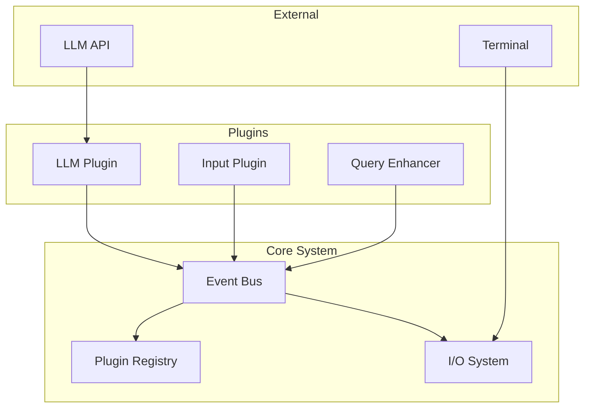
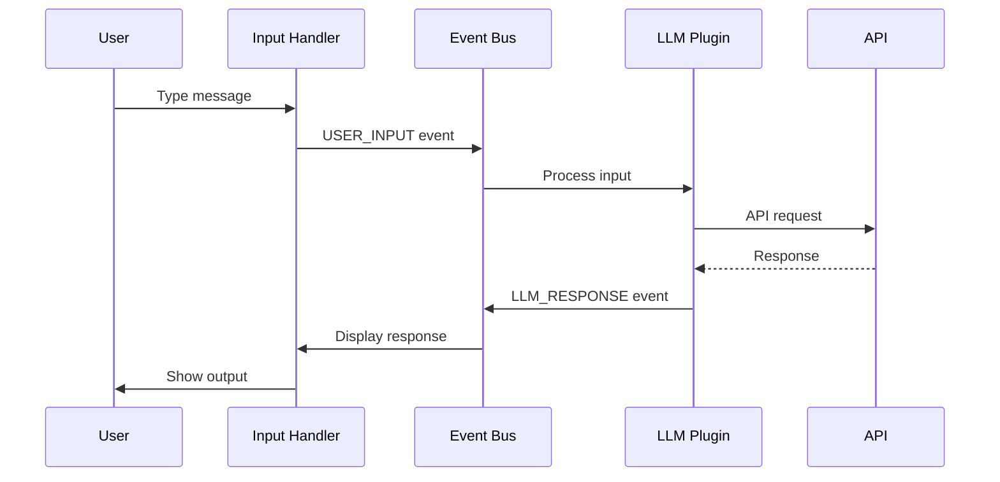
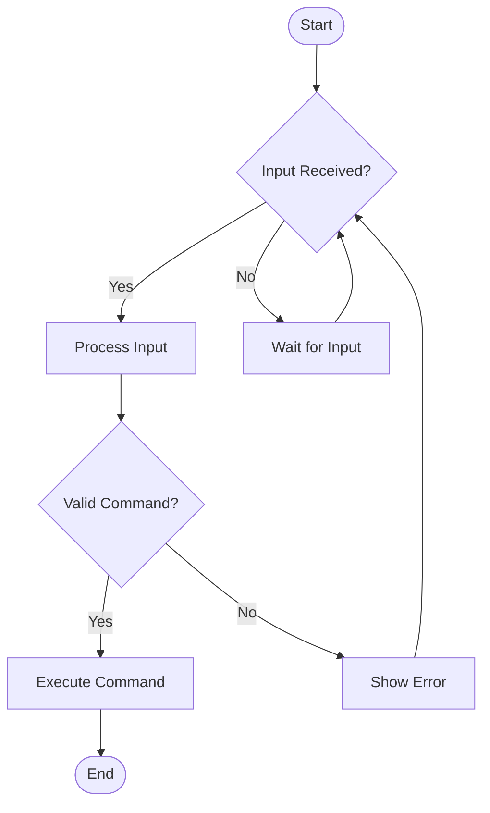
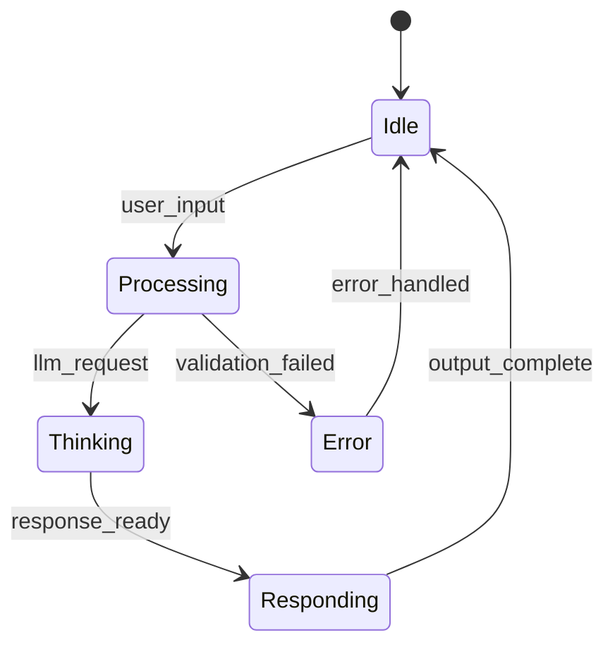

# Diagram Standards

## Overview
This document establishes comprehensive standards for creating, maintaining, and using diagrams across the Chat App project, ensuring consistency and clarity in visual communication.

## Diagram Types and Use Cases

### 1. Architecture Diagrams
**Purpose**: Show high-level system structure and component relationships

**Standard Elements**:
- Components: Rounded rectangles with consistent styling
- Connections: Solid lines for direct relationships, dashed for indirect
- Groupings: Background containers with subtle borders
- Labels: Clear, concise component names

**Mermaid Example**:


### 2. Sequence Diagrams
**Purpose**: Illustrate interaction flows and timing between components

**Standard Elements**:
- Actors: Stick figures or labeled boxes
- Lifelines: Vertical dashed lines
- Messages: Horizontal arrows with labels
- Activation boxes: Rectangles on lifelines

**Mermaid Example**:


### 3. Flowcharts
**Purpose**: Show process flows and decision points

**Standard Elements**:
- Start/End: Rounded rectangles with thick borders
- Process: Rectangles
- Decision: Diamonds
- Connectors: Arrows with clear flow direction

**Mermaid Example**:


### 4. State Diagrams
**Purpose**: Show state transitions and system behavior

**Standard Elements**:
- States: Circles or rounded rectangles
- Transitions: Labeled arrows
- Initial State: Filled circle
- Final State: Double circle

**Mermaid Example**:


## Visual Standards

### Color Palette
```css
/* Primary Colors */
--diagram-primary: #2563eb;
--diagram-secondary: #6b7280;
--diagram-accent: #10b981;

/* Status Colors */
--diagram-success: #22c55e;
--diagram-warning: #f59e0b;
--diagram-error: #ef4444;
--diagram-info: #3b82f6;

/* Background Colors */
--diagram-bg-light: #f8fafc;
--diagram-bg-medium: #e2e8f0;
--diagram-bg-dark: #334155;

/* Text Colors */
--diagram-text-primary: #1e293b;
--diagram-text-secondary: #64748b;
--diagram-text-inverse: #ffffff;
```

### Typography
```css
/* Font Specifications */
font-family: 'Inter', -apple-system, BlinkMacSystemFont, sans-serif;

/* Size Scale */
--text-xs: 10px;    /* Small labels */
--text-sm: 12px;    /* Standard labels */
--text-md: 14px;    /* Component names */
--text-lg: 16px;    /* Titles */
--text-xl: 20px;    /* Main headings */
```

### Shape Standards
- **Rectangles**: 8px border radius for modern appearance
- **Lines**: 2px stroke width for primary connections, 1px for secondary
- **Arrows**: Consistent arrowhead size and style
- **Spacing**: Minimum 16px between elements

## Tool-Specific Guidelines

### Mermaid Diagrams
**Advantages**:
- Version control friendly (text-based)
- Consistent styling across platforms
- Integration with documentation systems
- Programmatic generation support

**Best Practices**:
```mermaid
%%{init: {
  'theme': 'base',
  'themeVariables': {
    'primaryColor': '#2563eb',
    'primaryTextColor': '#1e293b',
    'primaryBorderColor': '#3b82f6',
    'lineColor': '#6b7280',
    'secondaryColor': '#f1f5f9',
    'tertiaryColor': '#f8fafc'
  }
}}%%
```

### Draw.io/Diagrams.net
**Use Cases**: Complex diagrams requiring precise positioning

**Standards**:
- Use consistent shape libraries
- Apply standardized color themes
- Maintain editable source files
- Export multiple formats (SVG, PNG, PDF)

### PlantUML
**Use Cases**: Automated diagram generation from code

**Configuration**:
```plantuml
!theme aws-orange
skinparam {
  BackgroundColor white
  ComponentStyle uml2
  ArrowColor #6b7280
  ComponentBackgroundColor #f1f5f9
  ComponentBorderColor #3b82f6
}
```

## Diagram Creation Workflow

### 1. Planning Phase
- Define diagram purpose and audience
- Identify key components and relationships
- Choose appropriate diagram type
- Sketch initial layout

### 2. Creation Phase
- Start with high-level structure
- Add details progressively
- Apply consistent styling
- Validate information accuracy

### 3. Review Phase
- Technical accuracy review
- Visual clarity assessment
- Accessibility compliance check
- Stakeholder feedback collection

### 4. Maintenance Phase
- Regular accuracy updates
- Version tracking
- Archive outdated versions
- Link to related documentation

## Integration Standards

### Documentation Integration
```markdown
## Architecture Overview

The following diagram illustrates the core system architecture:

```mermaid
[Diagram code here]
```

*Figure 1: Chat App Core Architecture*

Key components include:
- **Event Bus**: Central communication hub
- **Plugin System**: Extensible functionality
- **I/O System**: Terminal interface management
```

### Code Integration
```python
# Generate architecture diagram
def generate_architecture_diagram():
    """
    Generate Mermaid diagram from current system configuration
    """
    components = get_system_components()
    relationships = get_component_relationships()
    return build_mermaid_diagram(components, relationships)
```

## Accessibility Requirements

### Visual Accessibility
- High contrast ratios (minimum 4.5:1)
- Colorblind-friendly color combinations
- Clear, readable typography
- Adequate spacing between elements

### Alternative Formats
- Alt text descriptions for all diagrams
- Textual representations when possible
- Screen reader compatible formats
- High-contrast versions available

## Quality Metrics

### Diagram Quality Checklist
- [ ] Purpose clearly defined
- [ ] Information accurate and current
- [ ] Visual standards applied consistently
- [ ] Labels clear and concise
- [ ] Accessibility requirements met
- [ ] Source files properly versioned

### Review Criteria
1. **Clarity**: Information easily understood
2. **Accuracy**: Technical details correct
3. **Consistency**: Standards applied throughout
4. **Completeness**: All necessary information included
5. **Maintainability**: Easy to update and modify

## Automation and AI Integration

### Claude Code Diagram Generation
```python
# Example prompt for diagram generation
prompt = """
Generate a Mermaid sequence diagram showing the user input processing flow 
in the Chat App system. Include these components:
- User Input Handler
- Event Bus  
- LLM Plugin
- Terminal Renderer

Show the complete flow from user typing to response display.
Use the established color scheme and follow our diagram standards.
"""
```

### Automated Updates
- Link diagrams to code changes
- Trigger updates on architecture modifications
- Validate diagram accuracy against current system
- Generate change notifications for stakeholders

---

*These diagram standards ensure clear, consistent visual communication across all Chat App project documentation and presentations.*