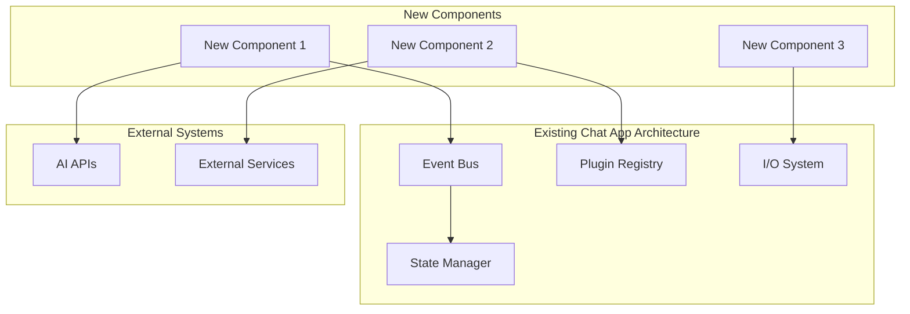

# Technical Specification Template

## Document Metadata

```yaml
Document_Information:
  Title: "[Feature/System Name] Technical Specification"
  Version: "1.0"
  Date: "[YYYY-MM-DD]"
  Author: "[Author Name]"
  Status: "[Draft/Review/Approved/Deprecated]"
  Project: "Chat App"
  
Review_Information:
  Technical_Reviewer: "[Name]"
  Business_Reviewer: "[Name]"  
  Approval_Date: "[YYYY-MM-DD]"
  Next_Review_Date: "[YYYY-MM-DD]"
  
AI_Assistance:
  Primary_AI_Tool: "Claude Code"
  AI_Analysis_Date: "[YYYY-MM-DD]"
  AI_Validation_Score: "[1-10]"
  Human_Review_Required: "[Yes/No]"
```

## Executive Summary

### Overview
[Provide a 2-3 paragraph executive summary that covers:]
- What is being built/changed
- Why it's important to the business
- High-level approach and key decisions
- Expected impact and benefits

### Key Decisions
1. **[Decision 1]**: [Brief description and rationale]
2. **[Decision 2]**: [Brief description and rationale] 
3. **[Decision 3]**: [Brief description and rationale]

### AI Analysis Summary
[Include AI-generated analysis summary:]
- **Complexity Assessment**: [Low/Medium/High] - [Justification]
- **Risk Level**: [Low/Medium/High] - [Key risks identified]
- **Implementation Estimate**: [X weeks/months] - [Confidence level]
- **Architectural Impact**: [Minimal/Moderate/Significant] - [Areas affected]

## Problem Statement

### Background
[Describe the context and background that led to this specification:]
- Current system state and limitations
- Business drivers and market pressures  
- User pain points and requirements
- Technical debt or architectural issues

### Current State Analysis
[Detail the current state with specific focus on Chat App components:]
- **EventBus System**: [Current state and limitations]
- **Plugin Architecture**: [Existing plugin capabilities and gaps]
- **Terminal Interface**: [Current UI/UX and user feedback]
- **State Management**: [Data persistence and configuration issues]
- **AI Integration**: [Current AI tool usage and limitations]

### Desired State
[Describe the target state after implementation:]
- **Business Outcomes**: [Measurable business improvements expected]
- **User Experience**: [How user experience will improve]
- **Technical Improvements**: [Technical quality and capability enhancements]
- **Performance Gains**: [Expected performance improvements with metrics]

### Success Criteria
```yaml
Success_Metrics:
  Business_Metrics:
    - Metric: "[Business metric name]"
      Current: "[Current value]"
      Target: "[Target value]"
      Timeline: "[Achievement timeline]"
      
  Technical_Metrics:
    - Metric: "[Technical metric name]" 
      Current: "[Current value]"
      Target: "[Target value]"
      Timeline: "[Achievement timeline]"
      
  User_Experience_Metrics:
    - Metric: "[UX metric name]"
      Current: "[Current value]"
      Target: "[Target value]"
      Timeline: "[Achievement timeline]"
```

## Requirements Analysis

### Functional Requirements

#### Core Functionality Requirements
```yaml
Functional_Requirements:
  FR001:
    Title: "[Requirement title]"
    Description: "[Detailed requirement description]"
    Priority: "[Must Have/Should Have/Could Have/Won't Have]"
    User_Stories:
      - "As a [user type], I want [functionality] so that [benefit]"
      - "As a [user type], I want [functionality] so that [benefit]"
    Acceptance_Criteria:
      - "Given [context], when [action], then [expected result]"
      - "Given [context], when [action], then [expected result]"
    AI_Analysis:
      Complexity: "[1-10 scale]"
      Risk_Level: "[Low/Medium/High]"
      Dependencies: "[List of dependencies]"
      
  FR002:
    # [Additional functional requirements following same structure]
```

#### Chat App Specific Requirements
```yaml
Chat_App_Integration_Requirements:
  EventBus_Requirements:
    - Event types to be added/modified
    - Hook integration requirements
    - Data flow and event sequencing
    - Performance impact on event processing
    
  Plugin_Requirements:
    - New plugin interfaces needed
    - Plugin compatibility requirements
    - Configuration schema changes
    - Plugin lifecycle management changes
    
  Terminal_Interface_Requirements:  
    - New display components needed
    - User interaction patterns
    - Keyboard shortcut requirements
    - Visual feedback and animation needs
    
  AI_Integration_Requirements:
    - Claude Code integration points
    - AI tool orchestration needs
    - Context management requirements
    - Response processing and display
```

### Non-Functional Requirements

#### Performance Requirements
```yaml
Performance_Requirements:
  Response_Time:
    - Component: "[Component name]"
      Requirement: "[Response time target]"
      Measurement: "[How measured]"
      Current_Performance: "[Current metrics]"
      
  Throughput:
    - Component: "[Component name]"
      Requirement: "[Throughput target]"
      Measurement: "[How measured]"
      Current_Performance: "[Current metrics]"
      
  Resource_Usage:
    - Resource: "[Memory/CPU/Storage]"
      Requirement: "[Usage target]"
      Measurement: "[How measured]"
      Current_Usage: "[Current metrics]"
```

#### Scalability Requirements
```yaml
Scalability_Requirements:
  User_Load:
    Current_Capacity: "[Current user load capacity]"
    Target_Capacity: "[Target user load capacity]"
    Growth_Timeline: "[Expected growth timeline]"
    Scaling_Strategy: "[Horizontal/Vertical scaling approach]"
    
  Data_Volume:
    Current_Volume: "[Current data volume]"
    Projected_Volume: "[Projected data volume]"
    Growth_Rate: "[Expected growth rate]"
    Storage_Strategy: "[Data storage and archiving approach]"
    
  Plugin_Ecosystem:
    Current_Plugins: "[Number of current plugins]"
    Target_Plugins: "[Target plugin ecosystem size]"
    Plugin_Performance: "[Performance requirements per plugin]"
    Resource_Isolation: "[Plugin resource isolation requirements]"
```

#### Security Requirements
```yaml
Security_Requirements:
  Authentication:
    - Requirement: "[Authentication requirement]"
      Implementation: "[How it will be implemented]"
      Validation: "[How it will be validated]"
      
  Authorization:
    - Requirement: "[Authorization requirement]"
      Implementation: "[How it will be implemented]"
      Validation: "[How it will be validated]"
      
  Data_Protection:
    - Data_Type: "[Type of sensitive data]"
      Protection_Level: "[Required protection level]"
      Implementation: "[Protection implementation]"
      Compliance: "[Regulatory compliance requirements]"
      
  AI_Security:
    - API_Security: "[AI API security requirements]"
    - Data_Privacy: "[AI data privacy requirements]"
    - Model_Security: "[AI model security considerations]"
    - Context_Protection: "[Conversation context security]"
```

## Solution Architecture

### High-Level Architecture

#### System Architecture Diagram


#### Architecture Decisions
```yaml
Architecture_Decisions:
  AD001:
    Decision: "[Architecture decision title]"
    Options_Considered:
      - Option: "[Option 1]"
        Pros: "[Advantages]"
        Cons: "[Disadvantages]"
      - Option: "[Option 2]"
        Pros: "[Advantages]" 
        Cons: "[Disadvantages]"
    Chosen_Option: "[Selected option]"
    Rationale: "[Why this option was chosen]"
    Implications: "[Technical and business implications]"
    AI_Recommendation: "[AI analysis of decision]"
    
  AD002:
    # [Additional architecture decisions following same structure]
```

### Detailed Component Design

#### Component Specifications
```python
# Component Design Template with AI-Enhanced Documentation

class NewComponentExample:
    """
    [AI-Generated Component Description]
    
    Purpose: [Component's primary responsibility]
    Dependencies: [External dependencies and their purposes]
    Performance: [Expected performance characteristics]
    Thread Safety: [Concurrency considerations]
    
    AI Analysis:
    - Complexity Score: [1-10]
    - Maintainability Score: [1-10] 
    - Integration Risk: [Low/Medium/High]
    - Testing Complexity: [1-10]
    """
    
    def __init__(self, event_bus: EventBus, config: Config):
        """
        Initialize component with Chat App integration
        
        Args:
            event_bus: EventBus instance for system communication
            config: Configuration manager instance
            
        Raises:
            ConfigurationError: If required configuration is missing
            IntegrationError: If EventBus integration fails
        """
        self.event_bus = event_bus
        self.config = config
        self._initialize_component()
        
    async def initialize(self) -> None:
        """
        Async initialization and EventBus hook registration
        
        This method:
        1. Registers required event hooks
        2. Initializes any async resources
        3. Validates component readiness
        4. Reports initialization status
        """
        await self._register_event_hooks()
        await self._initialize_resources()
        await self._validate_readiness()
        
    async def _register_event_hooks(self) -> None:
        """Register component hooks with EventBus"""
        await self.event_bus.register_hook(
            event_type="USER_INPUT",
            hook_function=self.handle_user_input,
            priority=500
        )
        
    async def handle_user_input(self, event: Event) -> None:
        """
        Process user input events
        
        Args:
            event: User input event from EventBus
            
        This method implements the component's main processing logic
        following Chat App patterns for event handling.
        """
        try:
            # Process input according to component responsibility
            result = await self._process_input(event.data)
            
            # Emit results via EventBus
            await self.event_bus.publish_event(
                event_type="COMPONENT_RESULT",
                data=result
            )
            
        except Exception as error:
            await self._handle_error(error, event)
            
    def get_status_info(self) -> Dict[str, Any]:
        """
        Provide component status for terminal display
        
        Returns:
            Dict containing status information for Chat App terminal
        """
        return {
            "status": "active" if self._is_healthy() else "error",
            "metrics": self._get_performance_metrics(),
            "last_activity": self._last_activity_timestamp
        }
```

#### Data Flow Design
```yaml
Data_Flow_Specification:
  Input_Data:
    Source: "[Data source]"
    Format: "[Data format and schema]"
    Validation: "[Input validation requirements]"
    Processing: "[How data is processed]"
    
  Data_Transformations:
    - Step: "[Transformation step]"
      Input: "[Input format]"
      Output: "[Output format]"
      Logic: "[Transformation logic]"
      Error_Handling: "[Error handling approach]"
      
  Output_Data:
    Destination: "[Where data goes]"
    Format: "[Output format and schema]"
    Validation: "[Output validation requirements]"
    Persistence: "[How data is persisted if needed]"
    
  EventBus_Integration:
    Events_Consumed:
      - Event_Type: "[Event type]"
        Purpose: "[Why this event is needed]"
        Processing: "[How event is processed]"
        
    Events_Produced:
      - Event_Type: "[Event type]"
        Purpose: "[Why this event is emitted]"
        Data_Format: "[Event data structure]"
```

### Integration Design

#### EventBus Integration
```python
# EventBus Integration Pattern
class EventBusIntegrationExample:
    """Example of proper EventBus integration for new components"""
    
    def __init__(self, event_bus: EventBus):
        self.event_bus = event_bus
        self.hook_registrations = []
        
    async def register_hooks(self) -> None:
        """Register all component hooks following Chat App patterns"""
        
        # Register pre-processing hook
        hook_id = await self.event_bus.register_hook(
            event_type="USER_INPUT",
            hook_function=self.preprocess_input,
            priority=600,  # Higher priority for preprocessing
            hook_type="pre"
        )
        self.hook_registrations.append(hook_id)
        
        # Register main processing hook
        hook_id = await self.event_bus.register_hook(
            event_type="USER_INPUT",
            hook_function=self.process_input,
            priority=400,  # Standard priority for main processing
            hook_type="main"
        )
        self.hook_registrations.append(hook_id)
        
        # Register post-processing hook
        hook_id = await self.event_bus.register_hook(
            event_type="LLM_RESPONSE", 
            hook_function=self.post_process_response,
            priority=200,  # Lower priority for post-processing
            hook_type="post"
        )
        self.hook_registrations.append(hook_id)
        
    async def cleanup(self) -> None:
        """Properly cleanup EventBus registrations"""
        for hook_id in self.hook_registrations:
            await self.event_bus.unregister_hook(hook_id)
        self.hook_registrations.clear()
```

#### Plugin System Integration
```yaml
Plugin_Integration:
  Plugin_Interface:
    - Interface_Name: "[Plugin interface name]"
      Methods: "[Required methods for plugins]"
      Configuration: "[Plugin configuration requirements]"
      Lifecycle: "[Plugin lifecycle management]"
      
  Plugin_Discovery:
    - Discovery_Method: "[How plugins are discovered]"
      Registration: "[How plugins register with the system]"
      Validation: "[Plugin validation requirements]"
      Loading: "[Plugin loading and initialization]"
      
  Plugin_Communication:
    - Communication_Method: "[How plugins communicate with system]"
      Data_Exchange: "[Data exchange formats and protocols]"
      Event_Integration: "[EventBus integration for plugins]"
      Error_Handling: "[Plugin error handling and isolation]"
```

## Implementation Plan

### Development Phases

#### Phase 1: Foundation and Architecture
```yaml
Phase_1_Plan:
  Duration: "[X] weeks"
  Objectives:
    - Set up basic component structure
    - Implement EventBus integration
    - Create configuration schema
    - Set up development and testing infrastructure
    
  Tasks:
    - Task: "Create component base classes"
      Estimate: "[X] hours"
      Dependencies: "[Any dependencies]"
      AI_Assistance: "Claude Code for boilerplate generation"
      
    - Task: "Implement EventBus integration"
      Estimate: "[X] hours"
      Dependencies: "[EventBus system ready]"
      AI_Assistance: "Integration pattern generation"
      
  Deliverables:
    - Component skeleton with EventBus integration
    - Configuration schema and validation
    - Basic test infrastructure
    - Development environment setup
    
  Success_Criteria:
    - All foundation components compile and initialize
    - EventBus integration functional
    - Configuration system working
    - Test framework operational
```

#### Phase 2: Core Functionality Implementation
```yaml
Phase_2_Plan:
  Duration: "[X] weeks"
  Objectives:
    - Implement core business logic
    - Add comprehensive error handling
    - Integrate with AI tools as needed
    - Implement logging and monitoring
    
  Tasks:
    - Task: "Implement core processing logic"
      Estimate: "[X] hours"
      Dependencies: "[Phase 1 completion]"
      AI_Assistance: "Algorithm implementation and optimization"
      
  Deliverables:
    - Core functionality working
    - Error handling implemented
    - AI tool integration functional
    - Monitoring and logging active
    
  Success_Criteria:
    - Core use cases working end-to-end
    - Error handling comprehensive
    - Performance within acceptable limits
    - Monitoring providing useful insights
```

#### Phase 3: Integration and Testing
```yaml
Phase_3_Plan:
  Duration: "[X] weeks"
  Objectives:
    - Complete integration with Chat App ecosystem
    - Comprehensive testing (unit, integration, system)
    - Performance optimization
    - Documentation completion
    
  Tasks:
    - Task: "Complete integration testing"
      Estimate: "[X] hours"
      Dependencies: "[Phase 2 completion]"
      AI_Assistance: "Test case generation and validation"
      
  Deliverables:
    - Fully integrated system
    - Comprehensive test suite
    - Performance optimized code
    - Complete documentation
    
  Success_Criteria:
    - All integration tests passing
    - Performance requirements met
    - Documentation complete and accurate
    - System ready for production deployment
```

### Resource Requirements

#### Team Resources
```yaml
Resource_Allocation:
  Senior_Developer:
    Allocation: "[X]% of time over [Y] weeks"
    Responsibilities:
      - Architecture implementation
      - Complex algorithm development
      - Performance optimization
      - Code review and mentoring
      
  AI_Integration_Specialist:
    Allocation: "[X]% of time over [Y] weeks"
    Responsibilities:
      - AI tool integration
      - Prompt engineering and optimization
      - AI workflow design
      - AI performance monitoring
      
  QA_Engineer:
    Allocation: "[X]% of time over [Y] weeks"
    Responsibilities:
      - Test strategy development
      - Test automation implementation
      - Integration testing coordination
      - Quality metric tracking
      
  DevOps_Engineer:
    Allocation: "[X]% of time over [Y] weeks"
    Responsibilities:
      - Infrastructure setup
      - CI/CD pipeline updates
      - Deployment automation
      - Monitoring and alerting setup
```

#### Technology and Tool Requirements
```yaml
Technology_Requirements:
  Development_Tools:
    - Python 3.11+ development environment
    - Claude Code subscription and integration
    - Testing frameworks (unittest, pytest)
    - Performance monitoring tools
    
  Infrastructure:
    - Development environment resources
    - Staging environment for integration testing
    - Performance testing infrastructure
    - CI/CD pipeline capacity
    
  AI_Tools:
    - Claude Code for development assistance
    - Additional AI APIs if needed for functionality
    - AI performance monitoring tools
    - Context management systems
```

## Testing Strategy

### Test Categories and Coverage

#### Unit Testing Strategy
```yaml
Unit_Testing:
  Coverage_Target: ">90% line coverage"
  Framework: "unittest with AI-generated test cases"
  
  Test_Categories:
    Core_Logic:
      - Business logic validation
      - Edge case handling
      - Error condition testing
      - Performance boundary testing
      
    EventBus_Integration:
      - Hook registration/deregistration
      - Event handling accuracy
      - Event data validation
      - Hook priority compliance
      
    Configuration:
      - Configuration parsing and validation
      - Default value handling
      - Configuration change handling
      - Invalid configuration rejection
      
    AI_Integration:
      - AI API integration reliability
      - Response parsing and validation
      - Error handling for AI failures
      - Context management accuracy
```

#### Integration Testing Strategy  
```yaml
Integration_Testing:
  Coverage_Target: "All integration points tested"
  Framework: "pytest with Chat App test utilities"
  
  Integration_Points:
    EventBus_System:
      - Event flow through complete system
      - Multi-component event handling
      - Event ordering and sequencing
      - Performance under event load
      
    Plugin_System:
      - Plugin discovery and loading
      - Plugin communication with new component
      - Plugin lifecycle management
      - Plugin error isolation
      
    Terminal_Interface:
      - Display integration and rendering
      - User interaction handling
      - Status reporting accuracy
      - Visual feedback consistency
      
    State_Management:
      - Data persistence and retrieval
      - Configuration state management
      - State synchronization across components
      - State migration and versioning
```

### AI-Enhanced Testing Approach
```python
class AITestingCoordinator:
    """AI-assisted testing coordination for new components"""
    
    async def generate_test_scenarios(self, component_spec: ComponentSpec) -> List[TestScenario]:
        """Generate comprehensive test scenarios using AI"""
        
        test_generation_prompt = f"""
        Generate comprehensive test scenarios for Chat App component:
        
        Component: {component_spec.name}
        Functionality: {component_spec.functionality}
        Integration Points: {component_spec.integrations}
        Requirements: {component_spec.requirements}
        
        Generate test scenarios for:
        1. Happy path scenarios with typical inputs
        2. Edge cases with boundary conditions
        3. Error scenarios with invalid inputs
        4. Performance scenarios with load conditions
        5. Integration scenarios with other components
        6. EventBus interaction scenarios
        7. Configuration edge cases
        8. AI integration failure scenarios
        
        For each scenario provide:
        - Test description and purpose
        - Input data and conditions
        - Expected outcomes
        - Performance expectations
        - Error handling validation
        """
        
        return await self.ai_client.generate_tests(test_generation_prompt)
        
    async def validate_test_coverage(self, test_suite: TestSuite) -> CoverageReport:
        """AI analysis of test coverage completeness"""
        
        coverage_prompt = f"""
        Analyze test coverage for completeness:
        
        Test Suite: {test_suite.summary}
        Component Requirements: {self.component_requirements}
        Integration Points: {self.integration_points}
        
        Evaluate coverage for:
        1. Functional requirement coverage
        2. Non-functional requirement coverage  
        3. Integration point coverage
        4. Error scenario coverage
        5. Performance scenario coverage
        6. Edge case coverage
        
        Identify gaps and recommend additional tests needed.
        """
        
        return await self.ai_client.analyze_coverage(coverage_prompt)
```

## Risk Assessment and Mitigation

### Technical Risks
```yaml
Technical_Risks:
  High_Risk:
    - Risk: "EventBus performance impact from new component"
      Probability: "[Low/Medium/High]"
      Impact: "[Low/Medium/High]"
      Mitigation: 
        - Performance testing and optimization
        - Event processing optimization
        - Load testing with realistic scenarios
        - Monitoring and alerting implementation
      Owner: "[Team member responsible]"
      
    - Risk: "AI integration reliability issues"
      Probability: "[Low/Medium/High]"
      Impact: "[Low/Medium/High]"
      Mitigation:
        - Fallback mechanisms for AI failures
        - Circuit breaker pattern implementation
        - Comprehensive error handling
        - Alternative AI provider integration
      Owner: "[Team member responsible]"
      
  Medium_Risk:
    - Risk: "Plugin compatibility issues"
      Probability: "[Low/Medium/High]"
      Impact: "[Low/Medium/High]"
      Mitigation:
        - Backward compatibility testing
        - Plugin API versioning
        - Comprehensive integration testing
        - Plugin developer communication
      Owner: "[Team member responsible]"
```

### Business Risks
```yaml
Business_Risks:
  High_Risk:
    - Risk: "Feature delivery timeline delays"
      Probability: "[Low/Medium/High]"
      Impact: "[Low/Medium/High]"
      Mitigation:
        - Phased delivery approach
        - MVP scope definition
        - Regular progress reviews
        - Resource allocation flexibility
      Owner: "[Team member responsible]"
      
  Medium_Risk:
    - Risk: "User adoption lower than expected"
      Probability: "[Low/Medium/High]"
      Impact: "[Low/Medium/High]"
      Mitigation:
        - User research and validation
        - Iterative design improvements
        - User feedback integration
        - Change management support
      Owner: "[Team member responsible]"
```

## Monitoring and Observability

### Metrics and KPIs
```yaml
Monitoring_Strategy:
  Performance_Metrics:
    - Metric: "Component response time"
      Target: "[X] ms average"
      Alerting: "[X] ms threshold"
      Dashboard: "Component Performance"
      
    - Metric: "EventBus event processing time"
      Target: "[X] ms per event"
      Alerting: "[X] ms threshold"  
      Dashboard: "EventBus Performance"
      
  Quality_Metrics:
    - Metric: "Error rate"
      Target: "< [X]% of operations"
      Alerting: "> [X]% threshold"
      Dashboard: "Component Health"
      
    - Metric: "AI integration success rate"
      Target: "> [X]% success"
      Alerting: "< [X]% threshold"
      Dashboard: "AI Integration Health"
      
  Business_Metrics:
    - Metric: "Feature usage rate"
      Target: "[X]% of users"
      Reporting: "Weekly business reports"
      Dashboard: "Feature Adoption"
```

### Alerting and Incident Response
```yaml
Alerting_Configuration:
  Critical_Alerts:
    - Alert: "Component completely unavailable"
      Condition: "Error rate > 90% for 5 minutes"
      Response_Time: "< 15 minutes"
      Escalation: "Immediate to on-call engineer"
      
    - Alert: "EventBus integration failure"  
      Condition: "No events processed for 10 minutes"
      Response_Time: "< 30 minutes"
      Escalation: "Technical lead notification"
      
  Warning_Alerts:
    - Alert: "Performance degradation"
      Condition: "Response time > threshold for 10 minutes"
      Response_Time: "< 1 hour"
      Escalation: "Development team notification"
```

## Documentation Requirements

### Technical Documentation
```yaml
Documentation_Deliverables:
  Architecture_Documentation:
    - High-level architecture diagrams
    - Component interaction diagrams
    - Data flow documentation
    - Integration point specifications
    
  API_Documentation:
    - Public interface documentation
    - EventBus integration patterns
    - Plugin interface specifications
    - Configuration schema documentation
    
  Operations_Documentation:
    - Deployment procedures
    - Monitoring and alerting setup
    - Troubleshooting guides
    - Performance tuning guidelines
    
  Developer_Documentation:
    - Development setup instructions
    - Coding standards and patterns
    - Testing procedures and frameworks
    - AI tool integration guidelines
```

### User Documentation
```yaml
User_Documentation:
  End_User_Documentation:
    - Feature overview and benefits
    - User workflow guides
    - Configuration instructions
    - Troubleshooting and FAQ
    
  Administrator_Documentation:
    - Installation and setup procedures
    - Configuration management
    - Monitoring and maintenance
    - Security considerations
    
  Developer_Documentation:
    - Plugin development guides
    - API integration examples
    - Customization procedures
    - Extension point documentation
```

## Approval and Sign-off

### Review Checklist
```yaml
Review_Criteria:
  Technical_Review:
    - [ ] Architecture aligns with Chat App patterns
    - [ ] EventBus integration properly designed
    - [ ] Performance requirements clearly defined
    - [ ] Security considerations addressed
    - [ ] Error handling comprehensive
    - [ ] Testing strategy complete
    - [ ] Monitoring and observability planned
    
  Business_Review:
    - [ ] Requirements align with business objectives
    - [ ] Success criteria measurable and achievable
    - [ ] Resource requirements realistic
    - [ ] Timeline feasible and acceptable
    - [ ] Risk assessment comprehensive
    - [ ] User impact properly considered
    
  AI_Integration_Review:
    - [ ] AI tool integration properly planned
    - [ ] Prompt engineering strategy defined
    - [ ] AI performance monitoring included
    - [ ] Fallback mechanisms for AI failures
    - [ ] Context management properly designed
```

### Approval Signatures
```yaml
Approval_Record:
  Technical_Lead:
    Name: "[Name]"
    Date: "[YYYY-MM-DD]"
    Signature: "[Digital signature or approval confirmation]"
    Comments: "[Any specific comments or conditions]"
    
  Product_Owner:
    Name: "[Name]"
    Date: "[YYYY-MM-DD]"
    Signature: "[Digital signature or approval confirmation]"
    Comments: "[Any specific comments or conditions]"
    
  Architecture_Review_Board:
    Decision: "[Approved/Approved with Conditions/Rejected]"
    Date: "[YYYY-MM-DD]"
    Conditions: "[Any conditions for approval]"
    Next_Review: "[Date for next review if applicable]"
```

---

## Instructions for Using This Template

### AI-Assisted Completion
1. **Use Claude Code** to help fill out sections based on your specific requirements
2. **Leverage AI analysis** for complexity assessment, risk evaluation, and solution alternatives
3. **Generate test scenarios** using AI to ensure comprehensive coverage
4. **Validate technical decisions** with AI recommendations and alternatives

### Quality Assurance
1. **Review all AI-generated content** for accuracy and completeness
2. **Validate technical decisions** against Chat App architectural principles
3. **Ensure integration patterns** align with existing EventBus and plugin systems
4. **Verify performance requirements** are realistic and measurable

### Stakeholder Engagement
1. **Involve technical stakeholders** in architecture and implementation planning
2. **Engage business stakeholders** in requirements validation and success criteria
3. **Include QA team** in testing strategy development
4. **Coordinate with DevOps** for infrastructure and deployment planning

This template ensures comprehensive technical specifications that leverage AI assistance while maintaining high quality standards and alignment with Chat App architecture and development practices.

---

*This template provides a comprehensive framework for creating detailed technical specifications with AI assistance while ensuring all critical aspects of system design and implementation are thoroughly addressed.*