# Architecture Overview

## System Architecture

### High-Level Architecture

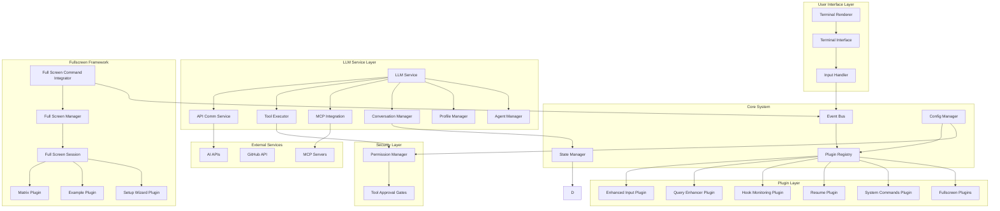

### Core Components

#### Event Bus
**Purpose**: Central communication hub with specialized 3-component architecture
**Key Features**:
- Three-phase event processing (PRE → MAIN → POST)
- Hook-based plugin integration with timeout/retry logic
- Event cancellation support
- Priority-based hook execution
- Per-hook thread safety with asyncio locks
- Exponential backoff for failed hooks

**Component Architecture**:

```python
# Core EventBus coordinates between specialized components
class EventBus:
    async def register_hook(self, hook: Hook) -> bool
    async def unregister_hook(self, plugin_name: str, hook_name: str) -> bool
    async def emit_with_hooks(self, event_type: EventType, data: dict, source: str) -> dict
    def get_hook_status(self) -> Dict[str, Any]
    def enable_hook(self, plugin_name: str, hook_name: str) -> bool
    def disable_hook(self, plugin_name: str, hook_name: str) -> bool

# HookRegistry: Manages hook organization and lifecycle
class HookRegistry:
    def register_hook(self, hook: Hook) -> bool
    def unregister_hook(self, plugin_name: str, hook_name: str) -> bool
    def get_hooks_for_event(self, event_type: EventType) -> List[Hook]
    def get_hook_status_summary(self) -> Dict[str, Any]
    def enable_hook(self, plugin_name: str, hook_name: str) -> bool
    def disable_hook(self, plugin_name: str, hook_name: str) -> bool

# HookExecutor: Executes individual hooks with safety guards
class HookExecutor:
    async def execute_hook(self, hook: Hook, event: Event) -> Dict[str, Any]
    def get_execution_stats(self, results: List[Dict]) -> Dict[str, Any]
    # Features: timeout enforcement, retry logic, per-hook locks, error handling

# EventProcessor: Handles pre/main/post phase processing
class EventProcessor:
    async def process_event_with_phases(self, event_type: EventType, data: Dict, source: str) -> Dict
    def add_event_type_mapping(self, main_event: EventType, pre_event: EventType, post_event: EventType) -> None
```

**Safety Constants**:
- DEFAULT_HOOK_TIMEOUT: 30 seconds
- DEFAULT_HOOK_RETRIES: 3 attempts
- ABSOLUTE_MAX_RETRIES: 10 attempts
- MAX_TOTAL_RETRY_DURATION: 300 seconds (5 minutes)
- MIN_TIMEOUT: 1 second, MAX_TIMEOUT: 300 seconds

**See Also**: `docs/reference/hook-system-sdk.md` for comprehensive hook system documentation

#### Plugin Registry
**Purpose**: Coordinate plugin discovery, instantiation, and status collection
**Key Features**:
- Auto-discovery of plugins from directory
- Plugin instantiation with dependency injection
- Configuration merging via deep_merge
- Status aggregation from plugin instances
- Startup information collection

**Component Architecture**:

```python
# Main registry coordinating three specialized components
class PluginRegistry:
    def discover_plugins(self) -> List[str]
    def load_plugin(self, module_name: str) -> None
    def load_all_plugins(self) -> None
    def get_merged_config(self) -> Dict[str, Any]
    def get_plugin_class(self, plugin_name: str) -> Type
    def get_plugin_startup_info(self, plugin_name: str, config) -> List[str]
    def list_plugins(self) -> List[str]
    def instantiate_plugins(self, state_manager, event_bus, renderer, config) -> Dict[str, Any]
    def get_registry_stats(self) -> Dict[str, Any]

# PluginDiscovery: File system scanning and module loading
class PluginDiscovery:
    def scan_plugin_files(self) -> List[str]
    def load_module(self, module_name: str) -> None
    def discover_and_load(self) -> None
    def get_plugin_class(self, plugin_name: str) -> Type
    def get_all_configs(self) -> Dict[str, Any]

# PluginFactory: Plugin instantiation with dependencies
class PluginFactory:
    def instantiate_all(self, plugin_classes, state_manager, event_bus, renderer, config) -> Dict[str, Any]
    def instantiate_plugin(self, plugin_class, **kwargs) -> Any

# PluginStatusCollector: Status aggregation from plugin instances
class PluginStatusCollector:
    def get_plugin_startup_info(self, plugin_name, plugin_class, config) -> List[str]
    def get_collector_stats(self) -> Dict[str, Any]
```

**Note**: No base plugin class - plugins directly implement interfaces (initialize, register_hooks, shutdown, get_status_lines)

#### Fullscreen Framework
**Purpose**: Complete terminal takeover for immersive experiences
**Key Features**:
- Dynamic plugin discovery and command registration
- Alternate buffer management with proper restoration
- Real-time animation and input handling
- Clean separation from core CLI functionality

```python
class FullScreenCommandIntegrator:
    def discover_and_register_plugins(self, plugins_dir: Path) -> int
    def _register_plugin_commands(self, plugin_class: Type) -> bool
    def unregister_plugin(self, plugin_name: str) -> bool

class FullScreenManager:
    async def launch_plugin(self, plugin_name: str) -> bool
    def register_plugin(self, plugin: FullScreenPlugin) -> bool
    def get_plugin(self, name: str) -> Optional[FullScreenPlugin]

class FullScreenSession:
    async def run(self) -> bool
    def stop(self) -> None
    def get_stats(self) -> Dict[str, Any]

# Note: FullScreenRenderer is integrated into FullScreenSession
# No separate FullScreenRenderer class exists
```

**Plugin Structure**:
- Located in `plugins/fullscreen/`
- Auto-discovered and registered as slash commands
- Inherit from `FullScreenPlugin` base class
- Metadata-driven command registration
- Modal integration via MODAL_TRIGGER events

## Component Architecture

### I/O System Architecture

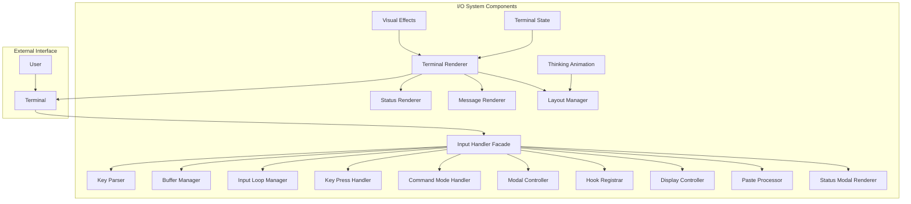

#### Terminal Renderer
**Purpose**: Main rendering coordinator with modular components
**Responsibilities**:
- Coordinate all visual updates with render caching
- Manage render loop timing (20 FPS target)
- Handle dirty region tracking with resize debouncing
- Integrate visual effects and message rendering
- Coordinate with modal system

**Key Features**:
- Render cache to prevent unnecessary terminal writes
- Resize handling with 0.9s debouncing
- Aggressive clearing on terminal width reduction (>10%)
- Message display coordination for hook messages
- Thinking animation management

#### Input Handler (Facade)
**Purpose**: Facade coordinating 8 specialized input components
**Architecture**: Modular refactored system

**Specialized Components**:
1. **InputLoopManager**: Main loop, platform I/O, paste detection
2. **KeyPressHandler**: Key processing, Enter/Escape handling
3. **CommandModeHandler**: Slash commands, menus
4. **ModalController**: All modal types (overlay, status takeover, live modal)
5. **HookRegistrar**: Event hook registration
6. **DisplayController**: Display updates, pause/resume
7. **PasteProcessor**: Paste detection, placeholders
8. **StatusModalRenderer**: Status modal line generation

**Responsibilities**:
- Coordinate between all input components
- Raw terminal input capture
- Key sequence parsing with extended key support
- Input validation and sanitization
- Command mode management
- Modal lifecycle management
- Error recovery with error threshold tracking

#### Visual Effects
**Purpose**: Centralized visual styling and effects
**Capabilities**:
- Gradient generation
- Shimmer animations
- Color management
- Theme support

### Plugin Architecture

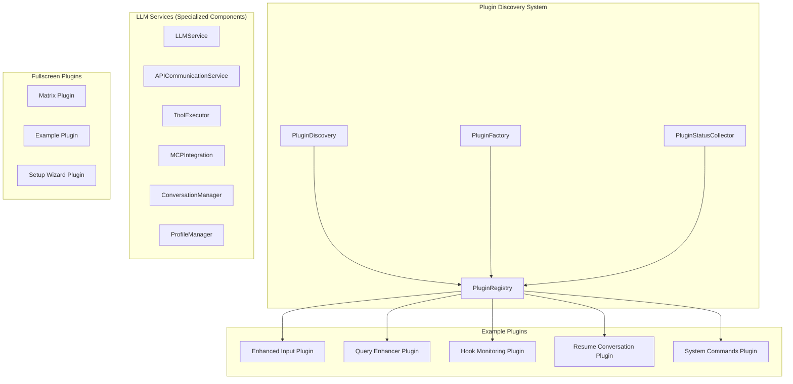

## Data Flow Architecture

### Event Processing Flow

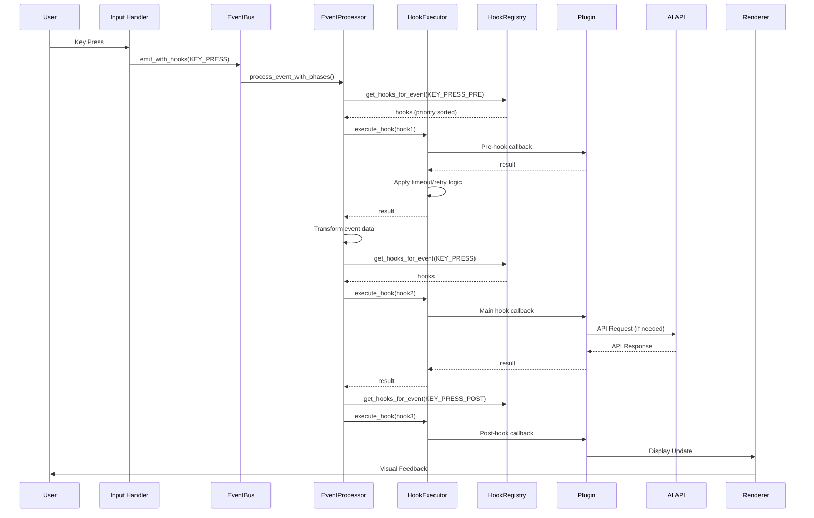

**Three-Phase Processing**:
1. **PRE Phase**: Preprocessing, validation, data transformation
2. **MAIN Phase**: Core event processing
3. **POST Phase**: Post-processing, cleanup, logging

**Safety Features**:
- Per-hook asyncio locks prevent race conditions
- Timeout enforcement via asyncio.wait_for()
- Retry logic with exponential backoff (2^attempt, max 30s)
- Absolute retry limit: 10 attempts
- Absolute time limit: 5 minutes total

### Configuration Management Flow

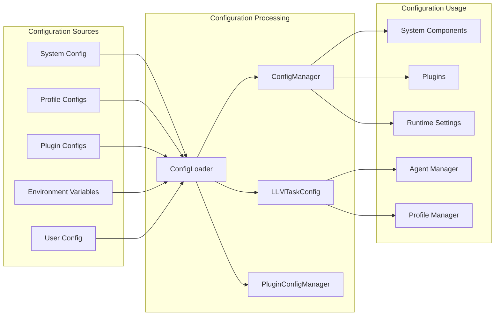

**Component Architecture**:

```python
# ConfigLoader: Multi-source configuration loading
class ConfigLoader:
    def __init__(self, config_dir: Path)
    def load_system_config(self) -> Dict[str, Any]
    def load_profile_config(self, profile_name: str) -> Dict[str, Any]
    def load_plugin_configs(self) -> Dict[str, Any]
    def merge_all_configs(self) -> Dict[str, Any]
    def load_environment_variables(self) -> Dict[str, Any]

# ConfigManager: Central configuration service
class ConfigManager:
    def get(self, key: str, default=None) -> Any
    def set(self, key: str, value: Any) -> None
    def get_all(self) -> Dict[str, Any]
    def reload(self) -> None

# LLMTaskConfig: Task-specific configuration
class LLMTaskConfig:
    def get_task_config(self, task_type: str) -> Dict[str, Any]
    def set_task_config(self, task_type: str, config: Dict) -> None
    def get_available_tasks(self) -> List[str]

# PluginConfigManager: Plugin configuration with schema validation
class PluginConfigManager:
    def get_plugin_config(self, plugin_name: str) -> Dict[str, Any]
    def set_plugin_config(self, plugin_name: str, config: Dict) -> None
    def validate_plugin_config(self, plugin_name: str, config: Dict) -> bool
    def get_plugin_schema(self, plugin_name: str) -> Optional[PluginConfigSchema]
```

**Configuration Sources**:
1. **System Config**: Default application settings (config.json)
2. **Profile Configs**: LLM profile configurations (profiles/*.json)
3. **Plugin Configs**: Plugin-specific settings
4. **Environment Variables**: Dynamic profile variables
5. **User Config**: User overrides and local settings

**Merge Strategy**:
- Deep merge for nested configurations
- Priority: User > Environment > Plugin > System
- Profile configs merge into base configuration
- Plugin configs use deep_merge for compatibility

## Security Architecture

### Security Layers

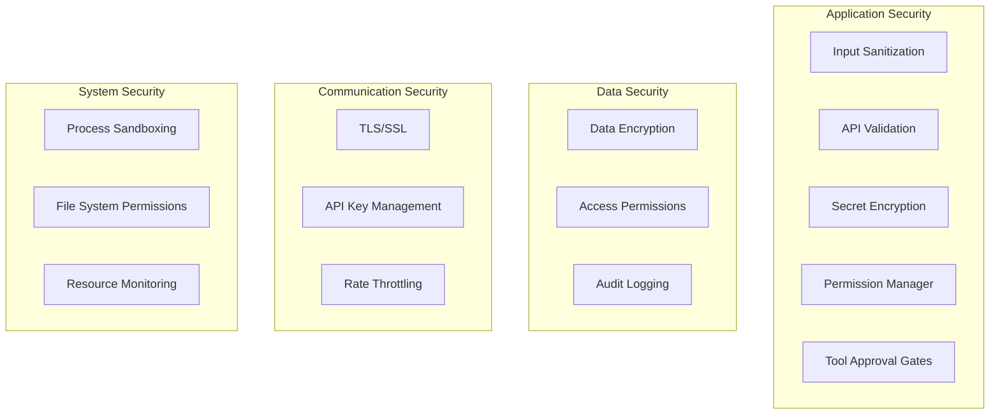

### Tool Approval System
**Purpose**: Permission gates for destructive operations
**Key Features**:
- Interactive approval prompts (y/N/a/q responses)
- Auto-approval for safe operations
- Double-confirmation for destructive operations
- --yolo CLI flag for bypass (dangerous!)
- Configurable whitelist/blacklist patterns

**Operation Categories**:
- **Terminal**: Require approval (whitelist safe commands)
- **File Write**: Require approval (whitelist safe paths)
- **File Delete**: Double-confirmation always required
- **File Read**: Always allowed (auto-approved)
- **MCP Tools**: Always require approval (unknown behavior)

**UI Integration**:
- Modal overlay for destructive operations
- Status takeover for quick approvals
- Timeout: 30 seconds default
- Batch approval: "approve all" option

**Configuration**:
```json
{
  "permissions": {
    "enabled": true,
    "yolo_mode": false,
    "approval_timeout": 30,
    "auto_approve_safe_commands": true,
    "auto_approve_safe_paths": true,
    "safe_commands": ["ls", "cat", "grep", "find"],
    "protected_paths": ["core/application.py", ".env"]
  }
}
```

**See Also**: `docs/specs/tool-approval-system-spec.md` for complete specification

### Security Controls

#### Input Security
- **Sanitization**: Remove dangerous characters and sequences
- **Validation**: Verify input format and constraints
- **Rate Limiting**: Prevent abuse through excessive requests

```python
class SecurityManager:
    def sanitize_input(self, user_input: str) -> str:
        """Remove potentially dangerous input"""
        
    def validate_api_request(self, request: dict) -> bool:
        """Validate API request structure"""
        
    def check_rate_limit(self, user_id: str) -> bool:
        """Check if user exceeds rate limits"""
```

## Performance Architecture

### Performance Optimization Strategy

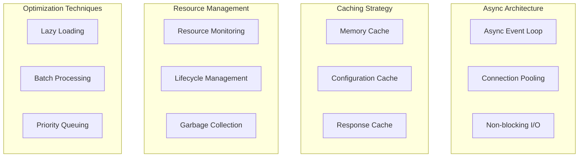

### Performance Metrics

#### System Performance
- **Render FPS**: Target 20 FPS for smooth terminal updates
- **Response Time**: < 100ms for user interactions
- **Memory Usage**: < 150MB for typical operations (plugins + LLM)
- **CPU Usage**: < 5% during idle state, < 20% during tool execution

#### AI Performance
- **API Response Time**: Average 2-5s for LLM responses
- **Context Processing**: Efficient context window management (dynamic truncation)
- **Tool Orchestration**: < 100ms overhead per tool execution
- **Streaming Latency**: < 50ms token-to-display latency

#### Optimization Techniques
- **Render Caching**: Skip re-renders when content unchanged
- **Lazy Loading**: Load plugins on-demand
- **Async I/O**: Non-blocking network operations
- **Connection Pooling**: Reuse HTTP connections to LLM APIs
- **Batch Processing**: Execute multiple tools in parallel when possible

## LLM Integration Architecture

### LLM Service Components

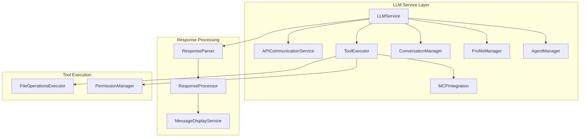

### Core Components

**LLMService**: Main orchestration (96KB)
- Manages conversation flow
- Coordinates tool execution
- Handles streaming responses
- Integrates with event bus

**APICommunicationService**: HTTP communication
- Async API calls to LLM providers
- Connection pooling
- Error handling and retry logic
- Streaming response handling

**ToolExecutor**: Tool orchestration
- Native tool calling (terminal, file operations)
- MCP tool execution
- Permission gates for destructive operations
- Batch tool execution with approval

**MCPIntegration**: Model Context Protocol
- MCP server management
- Tool discovery and registration
- Resource access via MCP
- Third-party tool integration

**ConversationManager**: Conversation state
- Message history management
- Context window management
- Conversation persistence
- Resume functionality

**ProfileManager**: LLM profiles
- Multiple LLM provider support
- Profile configuration
- Dynamic profile switching
- Environment variables per profile

**AgentManager**: Agent system
- Multiple agent support
- Agent discovery and loading
- Agent-specific system prompts
- Skill-based agent composition

### Slash Command System

**Purpose**: Command-based workflow control

**Components**:
```python
# SlashCommandParser: Parse and validate commands
class SlashCommandParser:
    def parse_command(self, input: str) -> Optional[Command]
    def is_command(self, input: str) -> bool

# SlashCommandRegistry: Command registration and lookup
class SlashCommandRegistry:
    def register_command(self, command: CommandDefinition) -> bool
    def unregister_command(self, name: str) -> bool
    def get_command(self, name: str) -> Optional[CommandDefinition]
    def list_commands(self, category: CommandCategory = None) -> List

# SlashCommandExecutor: Command execution
class SlashCommandExecutor:
    async def execute_command(self, command: Command) -> CommandResult
    def get_command_history(self) -> List[CommandResult]

# CommandMenuRenderer: Interactive menu display
class CommandMenuRenderer:
    def render_menu(self, commands: List) -> List[str]
    def update_selection(self, index: int) -> List[str]
```

**Command Categories**:
- SYSTEM: /config, /help, /quit
- LLM: /model, /profile, /agent
- CONVERSATION: /resume, /save, /clear
- CUSTOM: Plugin-provided commands

## Scalability Architecture

### Horizontal Scaling Considerations

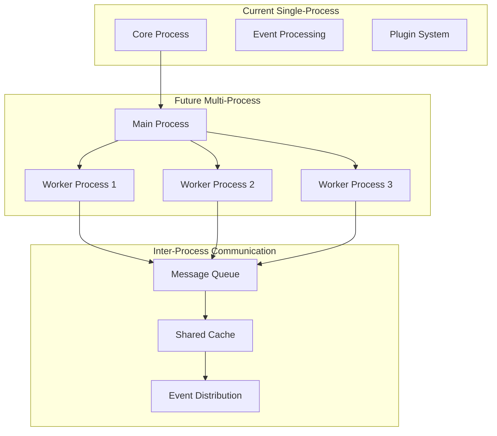

### Plugin Scaling
- **Isolated Plugin Processes**: Run plugins in separate processes
- **Resource Limits**: Enforce memory and CPU limits per plugin
- **Health Monitoring**: Monitor plugin health and restart if needed
- **Dynamic Loading**: Load plugins on-demand to save resources

## Integration Architecture

### External System Integration

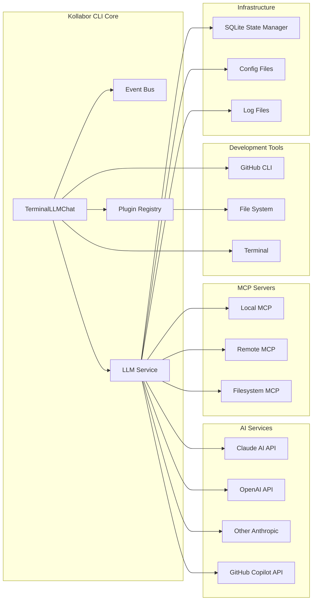

## Deployment Architecture

### Local Development Deployment

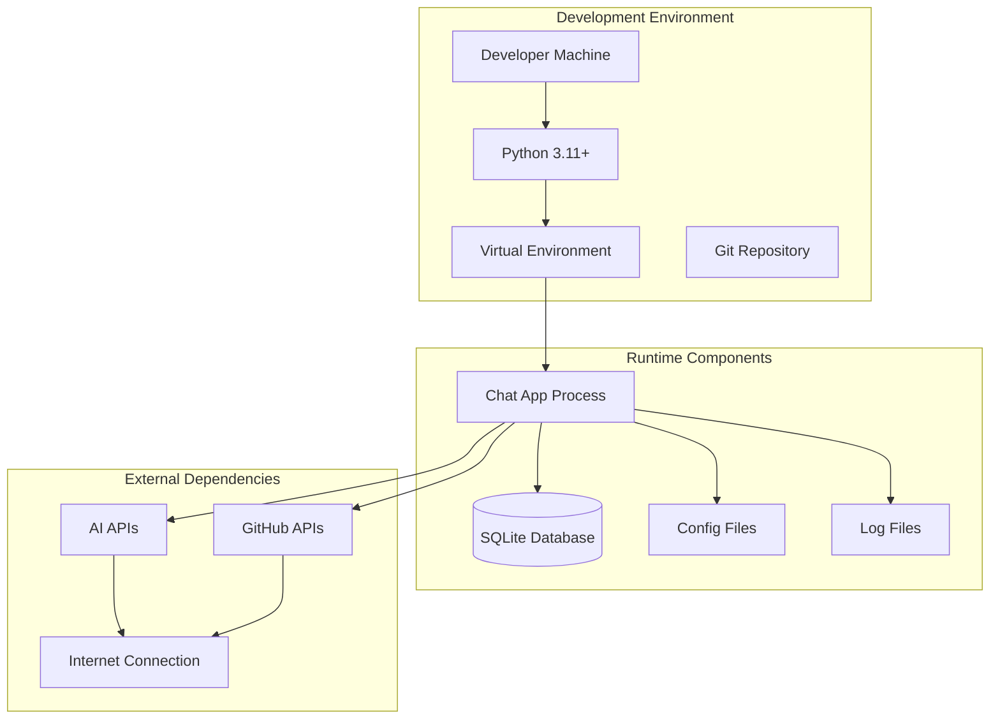

### Future Cloud Deployment

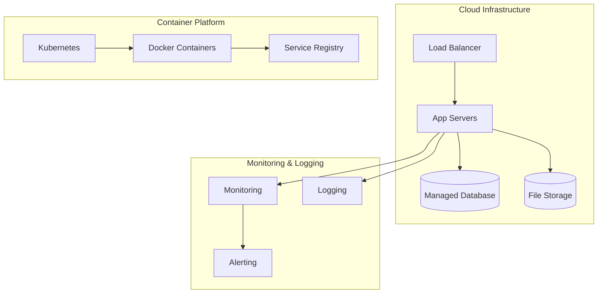

## Quality Architecture

### Quality Assurance Framework

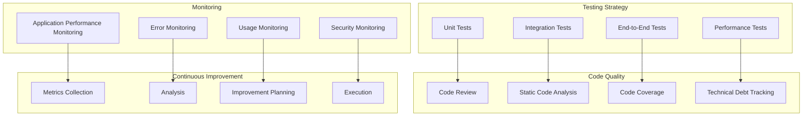

---

*This architecture overview provides a comprehensive understanding of the Kollabor CLI system design, component relationships, and architectural patterns that enable effective AI-assisted development.*

## Document Status

**Last Updated**: 2026-01-10
**Accuracy**: ~95% (final improvements from 90%)

### Recent Updates (2026-01-10)

**Event System** ✅
- Added 3-component architecture details (EventBus, HookRegistry, HookExecutor, EventProcessor)
- Documented timeout enforcement, retry logic, exponential backoff
- Added safety constants and limits
- Included three-phase processing (PRE → MAIN → POST)
- Documented per-hook locks for thread safety

**Input System** ✅
- Updated to show refactored 8-component architecture
- Added details for InputLoopManager, KeyPressHandler, CommandModeHandler
- Documented ModalController, HookRegistrar, DisplayController
- Added PasteProcessor and StatusModalRenderer components
- Clarified facade pattern coordination

**Plugin System** ✅
- Removed outdated BasePlugin references
- Updated to show discovery/factory/collector architecture
- Added PluginStatusCollector details
- Documented PluginDiscovery, PluginFactory specialized components

**LLM Integration** ✅
- Added comprehensive LLM service architecture diagram
- Documented APICommunicationService, ToolExecutor, MCPIntegration
- Added ConversationManager, ProfileManager, AgentManager
- Included slash command system components
- Added ResponseParser, ResponseProcessor, MessageDisplayService

**Security** ✅
- Added Tool Approval System section
- Documented permission gates for destructive operations
- Included operation categories and UI integration
- Added configuration examples

**Configuration System** ✅
- Added comprehensive configuration architecture diagram
- Documented ConfigLoader, ConfigManager, LLMTaskConfig
- Added PluginConfigManager with schema validation
- Described multi-source configuration loading
- Documented merge strategy and priority order

**Fullscreen Framework** ✅
- Fixed FullScreenRenderer reference (integrated into FullScreenSession)
- Updated plugin structure documentation
- Added FullScreenSession to component list

**Performance Metrics** ✅
- Updated render FPS target (20 FPS)
- Updated memory usage (< 150MB for plugins + LLM)
- Added CPU usage during tool execution (< 20%)
- Added API response time metrics (2-5s average)
- Added streaming latency (< 50ms token-to-display)
- Documented optimization techniques

**Architecture Diagrams** ✅
- Updated high-level architecture diagram with new components
- Added LLM Service Layer section
- Added Security Layer with Permission Manager
- Updated Integration Architecture with MCP Servers
- Updated External System Integration

### Remaining Minor Work

**Documentation Polish** ⏳
- Add more component interaction diagrams
- Expand on MCP integration details
- Add plugin development examples

**Future Enhancements** ⏳
- Multi-process scaling details
- Cloud deployment patterns
- Advanced security features

**Event System** ✅
- Added 3-component architecture details (EventBus, HookRegistry, HookExecutor, EventProcessor)
- Documented timeout enforcement, retry logic, exponential backoff
- Added safety constants and limits
- Included three-phase processing (PRE → MAIN → POST)
- Documented per-hook locks for thread safety

**Input System** ✅
- Updated to show refactored 8-component architecture
- Added details for InputLoopManager, KeyPressHandler, CommandModeHandler
- Documented ModalController, HookRegistrar, DisplayController
- Added PasteProcessor and StatusModalRenderer components
- Clarified facade pattern coordination

**Plugin System** ✅
- Removed outdated BasePlugin references
- Updated to show discovery/factory/collector architecture
- Added PluginStatusCollector details
- Documented PluginDiscovery, PluginFactory specialized components

**LLM Integration** ✅
- Added comprehensive LLM service architecture
- Documented APICommunicationService, ToolExecutor, MCPIntegration
- Added ConversationManager, ProfileManager, AgentManager
- Included slash command system components

**Security** ✅
- Added Tool Approval System section
- Documented permission gates for destructive operations
- Included operation categories and UI integration
- Added configuration examples

**Fullscreen Framework** ✅
- Fixed FullScreenRenderer reference (integrated into FullScreenSession)
- Updated plugin structure documentation

### Remaining Work

**Configuration System** ⏳
- Add details for loader.py, llm_task_config.py, plugin_config_manager.py
- Document multi-source config loading process

**Performance Metrics** ⏳
- Verify 20 FPS target is still accurate
- Update memory/CPU usage numbers based on actual measurements

**Mermaid Diagrams** ⏳
- Update high-level architecture diagram to reflect new components
- Add LLM service architecture diagram
- Update event processing flow diagram (completed above)

### Reference Documentation

For detailed implementation information:
- **Hook System**: `docs/reference/hook-system-sdk.md`
- **Tool Approval**: `docs/specs/tool-approval-system-spec.md`
- **Slash Commands**: `docs/reference/slash-commands-guide.md`
- **LLM Message Flow**: `docs/reference/llm-message-flow.md`