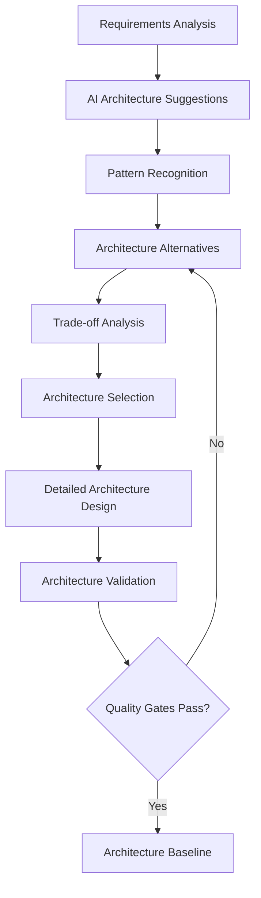
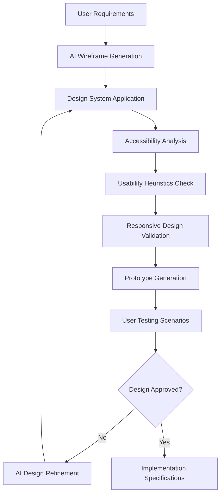
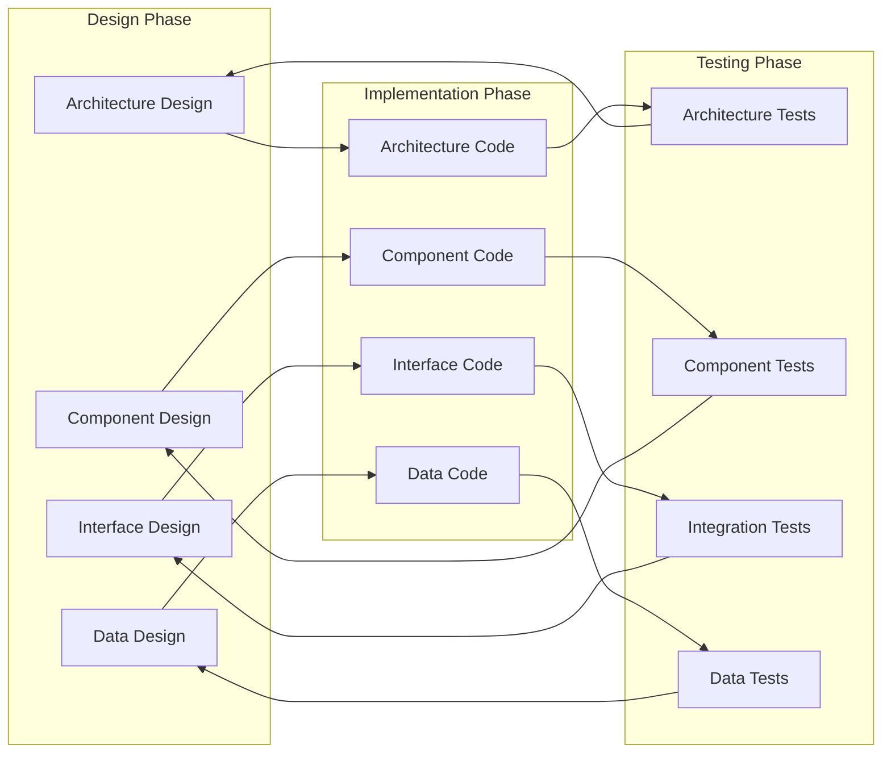

# AI-Assisted Design Methodology

## Overview
This document establishes a comprehensive design methodology that integrates AI tools throughout the design process, from architectural planning to detailed implementation design, ensuring consistency, quality, and maintainability.

## Design Philosophy

### Core Principles
1. **AI-Augmented Creativity**: AI tools enhance human design thinking rather than replace it
2. **Iterative Refinement**: Continuous improvement through AI feedback and analysis
3. **Design-First Approach**: Thorough design before implementation begins
4. **Maintainability Focus**: Designs optimized for long-term maintenance and evolution
5. **Documentation-Driven**: Comprehensive documentation generated and maintained with AI assistance

### Design Quality Standards
- **Consistency**: Standardized patterns and conventions across all components
- **Modularity**: Loosely coupled, highly cohesive design elements
- **Scalability**: Architecture capable of growth and adaptation
- **Testability**: Design supports comprehensive testing strategies
- **Accessibility**: Universal design principles applied throughout

## Architecture Design Process

### 1. System Architecture Design

#### AI-Enhanced Architecture Analysis


#### Architecture Design Templates
```yaml
Architecture_Design_Document:
  Metadata:
    Document_ID: "ARCH-001"
    Version: "1.0"
    Author: "[Designer Name]"
    AI_Assistant: "Claude Code"
    Review_Status: "Draft/Review/Approved"
    
  Executive_Summary:
    System_Overview: "[High-level system description]"
    Key_Decisions: "[Major architectural decisions]"
    AI_Recommendations: "[AI-suggested approaches]"
    
  Context_and_Requirements:
    Business_Context: "[Business drivers and context]"
    Quality_Attributes: "[Performance, scalability, security requirements]"
    Constraints: "[Technical and business constraints]"
    Assumptions: "[Key assumptions and dependencies]"
    
  Architecture_Overview:
    System_Structure: "[High-level component organization]"
    Component_Interactions: "[Communication patterns]"
    Data_Flow: "[Information flow through system]"
    Technology_Stack: "[Selected technologies and rationale]"
    
  Detailed_Design:
    Component_Specifications: "[Detailed component descriptions]"
    Interface_Definitions: "[API and interface specifications]"
    Data_Models: "[Data structure and schema definitions]"
    Security_Architecture: "[Security patterns and controls]"
    
  Quality_Analysis:
    Performance_Analysis: "[AI-generated performance predictions]"
    Scalability_Assessment: "[Growth capacity analysis]"
    Maintainability_Score: "[AI-calculated maintainability metrics]"
    Risk_Assessment: "[Technical risk analysis]"
```

#### AI-Powered Architecture Validation
```python
class ArchitectureValidator:
    def __init__(self, ai_client):
        self.ai_client = ai_client
        self.validation_rules = self.load_validation_rules()
        
    async def validate_architecture(self, architecture_doc: dict) -> ValidationReport:
        """Comprehensive AI-assisted architecture validation"""
        
        validation_prompt = f"""
        Analyze this system architecture for quality and consistency:
        
        Architecture: {architecture_doc}
        
        Evaluate against these criteria:
        1. Adherence to SOLID principles
        2. Appropriate separation of concerns
        3. Scalability and performance considerations
        4. Security best practices
        5. Maintainability and extensibility
        6. Technology stack appropriateness
        7. Component coupling and cohesion
        8. Error handling and resilience patterns
        
        Provide:
        - Quality scores for each criterion (1-10)
        - Specific improvement recommendations
        - Alternative approaches where beneficial
        - Risk assessment for identified issues
        """
        
        analysis = await self.ai_client.analyze(validation_prompt)
        
        return ValidationReport(
            overall_score=analysis.overall_quality,
            criterion_scores=analysis.detailed_scores,
            recommendations=analysis.improvements,
            risks=analysis.identified_risks,
            alternatives=analysis.alternative_approaches
        )
```

### 2. Component Design

#### AI-Assisted Component Design
```python
class ComponentDesigner:
    def __init__(self, ai_client):
        self.ai_client = ai_client
        
    async def design_component(self, requirements: dict) -> ComponentDesign:
        """Design component using AI assistance"""
        
        design_prompt = f"""
        Design a software component with these requirements:
        
        Functional Requirements: {requirements['functional']}
        Non-functional Requirements: {requirements['non_functional']}
        Dependencies: {requirements['dependencies']}
        Constraints: {requirements['constraints']}
        
        Provide:
        1. Component interface design (public methods and properties)
        2. Internal structure and key algorithms
        3. Data structures and state management
        4. Error handling strategy
        5. Testing approach
        6. Documentation structure
        7. Performance considerations
        8. Security implications
        
        Follow these patterns:
        - Single Responsibility Principle
        - Dependency Injection for external dependencies
        - Async/await for I/O operations
        - Comprehensive error handling
        - Extensive logging and monitoring hooks
        """
        
        return await self.ai_client.design_component(design_prompt)
```

#### Component Design Template
```python
# Component Design Template
class ComponentTemplate:
    """
    AI-Generated Component Design Template
    
    Purpose: [Component purpose and responsibility]
    Dependencies: [External dependencies and their purposes]
    Performance: [Expected performance characteristics]
    Thread Safety: [Concurrency considerations]
    """
    
    def __init__(self, dependencies: dict, config: dict):
        """
        Initialize component with dependencies and configuration
        
        Args:
            dependencies: Injected dependencies (interfaces, not implementations)
            config: Configuration parameters
            
        Raises:
            ConfigurationError: If required configuration is missing
            DependencyError: If required dependencies are unavailable
        """
        self._validate_dependencies(dependencies)
        self._validate_configuration(config)
        
        self.dependencies = dependencies
        self.config = config
        self.state = ComponentState()
        self.metrics = MetricsCollector()
        
    async def initialize(self) -> None:
        """
        Async initialization for resources that require async setup
        
        This method should be called after construction but before use.
        Idempotent - safe to call multiple times.
        """
        pass
        
    async def process(self, input_data: InputType) -> OutputType:
        """
        Main processing method - component's primary responsibility
        
        Args:
            input_data: Validated input data
            
        Returns:
            Processed output
            
        Raises:
            ProcessingError: If processing fails
            ValidationError: If input validation fails
        """
        # Input validation
        validated_input = await self._validate_input(input_data)
        
        # Processing with error handling
        try:
            result = await self._perform_processing(validated_input)
            self.metrics.record_success()
            return result
        except Exception as e:
            self.metrics.record_error(e)
            raise ProcessingError(f"Processing failed: {e}")
            
    async def shutdown(self) -> None:
        """
        Graceful shutdown - cleanup resources
        
        This method should be called during application shutdown.
        Idempotent - safe to call multiple times.
        """
        pass
        
    def get_health_status(self) -> HealthStatus:
        """
        Return current component health status
        
        Returns:
            Health status including metrics and diagnostics
        """
        return HealthStatus(
            healthy=self.state.is_healthy(),
            metrics=self.metrics.get_summary(),
            diagnostics=self._get_diagnostics()
        )
```

### 3. User Interface Design

#### AI-Enhanced UI Design Process


#### Terminal UI Design Standards
```yaml
Terminal_UI_Design:
  Layout_Principles:
    - Consistent information hierarchy
    - Clear visual separation between areas
    - Efficient use of terminal space
    - Responsive to terminal size changes
    
  Color_Standards:
    Primary_Text: "#e5e5e5"
    Secondary_Text: "#9ca3af"
    Accent_Green: "#00ff88"
    Error_Red: "#ff5555"
    Warning_Yellow: "#ffb86c"
    
  Typography_Standards:
    Primary_Font: "JetBrains Mono"
    Fallback_Fonts: ["Fira Code", "Cascadia Code", "Monaco"]
    Size_Hierarchy:
      - Header: "Bold, uppercase"
      - Body: "Normal weight"
      - Code: "Monospace, consistent spacing"
      - Status: "Compact, informative"
      
  Interaction_Patterns:
    Input_Handling:
      - Real-time input validation
      - Clear error messages
      - Helpful autocomplete suggestions
      - Keyboard shortcuts for efficiency
      
    Feedback_Systems:
      - Immediate visual feedback
      - Progress indicators for long operations
      - Status updates in dedicated areas
      - Error recovery guidance
```

#### AI-Generated UI Components
```python
class UIComponentGenerator:
    def __init__(self, ai_client, design_system):
        self.ai_client = ai_client
        self.design_system = design_system
        
    async def generate_component(self, requirements: dict) -> UIComponent:
        """Generate UI component based on requirements"""
        
        component_prompt = f"""
        Generate a terminal UI component with these requirements:
        
        Functionality: {requirements['functionality']}
        User Interactions: {requirements['interactions']}
        Data Display: {requirements['data']}
        Accessibility Needs: {requirements['accessibility']}
        
        Apply these design standards:
        - Colors: {self.design_system.colors}
        - Typography: {self.design_system.typography}
        - Spacing: {self.design_system.spacing}
        - Animation: {self.design_system.animations}
        
        Provide:
        1. Component structure and layout
        2. State management approach
        3. Event handling implementation
        4. Accessibility features
        5. Error state handling
        6. Performance optimization
        7. Test scenarios
        """
        
        return await self.ai_client.generate_component(component_prompt)
```

### 4. API Design

#### RESTful API Design with AI
```python
class APIDesigner:
    def __init__(self, ai_client):
        self.ai_client = ai_client
        
    async def design_api(self, domain_model: dict) -> APIDesign:
        """Design RESTful API based on domain model"""
        
        api_design_prompt = f"""
        Design a RESTful API for this domain model:
        
        Domain Model: {domain_model}
        
        Follow these principles:
        1. RESTful resource design
        2. Consistent naming conventions
        3. Appropriate HTTP methods and status codes
        4. Comprehensive error handling
        5. Pagination for collections
        6. Versioning strategy
        7. Rate limiting considerations
        8. Security best practices
        
        Provide:
        - Resource endpoints and methods
        - Request/response schemas
        - Error response formats
        - Authentication/authorization approach
        - Documentation structure
        - Testing strategies
        """
        
        return await self.ai_client.design_api(api_design_prompt)
```

#### API Design Standards
```yaml
API_Design_Standards:
  Resource_Naming:
    - Use nouns for resources (not verbs)
    - Plural forms for collections
    - Consistent casing (snake_case for JSON)
    - Hierarchical relationships in URLs
    
  HTTP_Methods:
    GET: "Retrieve resources (safe, idempotent)"
    POST: "Create new resources"
    PUT: "Update/replace resources (idempotent)"
    PATCH: "Partial updates"
    DELETE: "Remove resources (idempotent)"
    
  Response_Standards:
    Success_Responses:
      200: "OK - Request succeeded"
      201: "Created - Resource created"
      204: "No Content - Success with no response body"
      
    Error_Responses:
      400: "Bad Request - Invalid input"
      401: "Unauthorized - Authentication required"
      403: "Forbidden - Insufficient permissions"  
      404: "Not Found - Resource not found"
      429: "Too Many Requests - Rate limited"
      500: "Internal Server Error - Server error"
      
  Response_Format:
    Success: |
      {
        "data": { /* actual response data */ },
        "meta": {
          "timestamp": "2025-01-15T10:30:00Z",
          "version": "v1"
        }
      }
      
    Error: |
      {
        "error": {
          "code": "VALIDATION_ERROR",
          "message": "Invalid input parameters",
          "details": {
            "field": "email",
            "issue": "Invalid email format"
          }
        },
        "meta": {
          "timestamp": "2025-01-15T10:30:00Z",
          "request_id": "req_12345"
        }
      }
```

## Design Documentation

### AI-Generated Design Documentation
```python
class DesignDocumentationGenerator:
    def __init__(self, ai_client):
        self.ai_client = ai_client
        
    async def generate_architecture_documentation(self, system_design: dict) -> Documentation:
        """Generate comprehensive architecture documentation"""
        
        doc_prompt = f"""
        Generate comprehensive architecture documentation for:
        
        System Design: {system_design}
        
        Include these sections:
        1. Executive Summary
        2. Architecture Overview with diagrams
        3. Component Specifications
        4. Data Flow Documentation
        5. Security Architecture
        6. Performance Considerations
        7. Deployment Architecture  
        8. Monitoring and Observability
        9. Troubleshooting Guide
        10. Future Evolution Considerations
        
        Format: Markdown with Mermaid diagrams
        Audience: Technical team and stakeholders
        """
        
        return await self.ai_client.generate_documentation(doc_prompt)
        
    async def generate_component_documentation(self, component_design: dict) -> Documentation:
        """Generate detailed component documentation"""
        
        doc_prompt = f"""
        Generate detailed component documentation for:
        
        Component: {component_design}
        
        Include:
        1. Component Purpose and Responsibilities
        2. Public Interface Documentation
        3. Configuration Options
        4. Dependencies and Integration Points
        5. Error Handling and Recovery
        6. Performance Characteristics
        7. Testing Approach
        8. Usage Examples
        9. Troubleshooting Guide
        10. Change History
        
        Format: API documentation style with examples
        """
        
        return await self.ai_client.generate_documentation(doc_prompt)
```

### Living Documentation
```yaml
Living_Documentation_Strategy:
  Automated_Generation:
    - API documentation from code annotations
    - Architecture diagrams from system analysis
    - Component relationships from dependency analysis
    - Test coverage reports from test execution
    
  AI_Enhancement:
    - Natural language descriptions of technical concepts
    - Usage examples and tutorials
    - Troubleshooting guides based on common issues
    - Best practice recommendations
    
  Maintenance_Approach:
    - Documentation updated with every code change
    - Regular AI-assisted review for accuracy
    - Stakeholder feedback incorporation
    - Version control integration
    
  Quality_Metrics:
    - Documentation coverage percentage
    - Accuracy validation through testing
    - User satisfaction with documentation
    - Time-to-understanding for new developers
```

## Design Review and Validation

### AI-Assisted Design Reviews
```python
class DesignReviewer:
    def __init__(self, ai_client):
        self.ai_client = ai_client
        self.review_criteria = self.load_review_criteria()
        
    async def conduct_design_review(self, design_artifacts: dict) -> ReviewReport:
        """Comprehensive AI-assisted design review"""
        
        review_prompt = f"""
        Conduct a comprehensive design review for:
        
        Design Artifacts: {design_artifacts}
        
        Review Criteria:
        1. Architecture Quality
           - Separation of concerns
           - Coupling and cohesion
           - Scalability patterns
           - Performance implications
           
        2. Code Quality
           - SOLID principles adherence
           - Design patterns appropriateness
           - Error handling completeness
           - Testing strategy adequacy
           
        3. Security Considerations
           - Security by design principles
           - Data protection measures
           - Authentication/authorization
           - Input validation strategies
           
        4. Maintainability
           - Code readability and documentation
           - Modular design approach
           - Dependency management
           - Configuration externalization
           
        Provide:
        - Overall quality assessment
        - Specific improvement recommendations
        - Risk analysis
        - Compliance with best practices
        - Alternative design suggestions where beneficial
        """
        
        return await self.ai_client.conduct_review(review_prompt)
```

### Design Quality Gates
```yaml
Design_Quality_Gates:
  Gate_1_Architecture_Review:
    Criteria:
      - Architecture aligns with requirements
      - Technology choices are justified
      - Scalability approach is defined
      - Security architecture is complete
    Approval_Required: "Senior Architect"
    
  Gate_2_Detailed_Design_Review:
    Criteria:
      - Component interfaces are well-defined
      - Data models are complete and consistent
      - Error handling strategy is comprehensive
      - Testing approach is adequate
    Approval_Required: "Tech Lead + Peer Review"
    
  Gate_3_Implementation_Readiness:
    Criteria:
      - All design artifacts are complete
      - Development team understands design
      - Implementation plan is detailed
      - Quality criteria are defined
    Approval_Required: "Development Team + QA Lead"
    
  Gate_4_Design_Validation:
    Criteria:
      - Implementation matches design
      - Quality metrics meet targets
      - Performance requirements are satisfied
      - Security requirements are implemented
    Approval_Required: "Architecture Review Board"
```

## Integration with Development Process

### Design-to-Code Traceability


### Continuous Design Evolution
```python
class DesignEvolutionManager:
    def __init__(self, ai_client):
        self.ai_client = ai_client
        
    async def analyze_design_drift(self, design_baseline: dict, current_implementation: dict) -> DriftAnalysis:
        """Analyze drift between design and implementation"""
        
        drift_analysis_prompt = f"""
        Analyze the drift between original design and current implementation:
        
        Original Design: {design_baseline}
        Current Implementation: {current_implementation}
        
        Identify:
        1. Deviations from original design
        2. New patterns that have emerged
        3. Technical debt accumulation
        4. Opportunities for design improvement
        5. Architecture evolution needs
        
        Recommend:
        1. Design updates to reflect reality
        2. Refactoring opportunities
        3. Architecture modernization steps
        4. Process improvements to prevent drift
        """
        
        return await self.ai_client.analyze_drift(drift_analysis_prompt)
    
    async def suggest_design_improvements(self, system_analysis: dict) -> ImprovementSuggestions:
        """Suggest design improvements based on system analysis"""
        
        improvement_prompt = f"""
        Based on this system analysis: {system_analysis}
        
        Suggest design improvements for:
        1. Performance optimization opportunities
        2. Scalability enhancements
        3. Maintainability improvements
        4. Security hardening
        5. Code quality enhancements
        
        Prioritize suggestions by:
        - Business impact
        - Implementation effort
        - Risk reduction
        - Technical debt reduction
        """
        
        return await self.ai_client.suggest_improvements(improvement_prompt)
```

---

*This AI-assisted design methodology ensures high-quality, consistent design outcomes while leveraging AI tools to enhance creativity, validate designs, and maintain comprehensive documentation throughout the development lifecycle.*