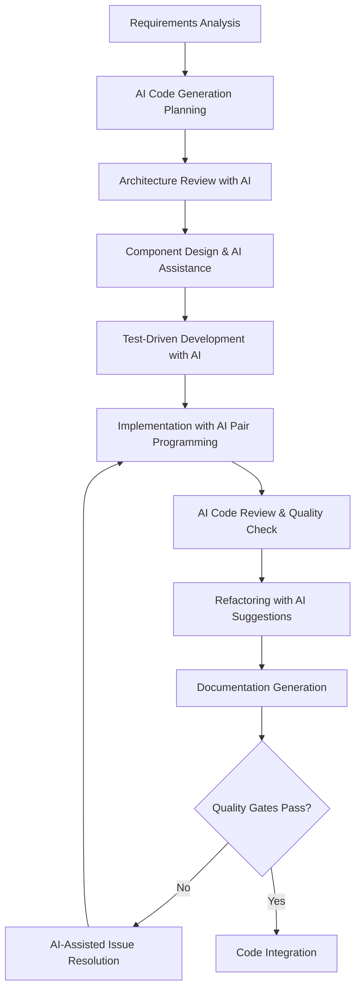
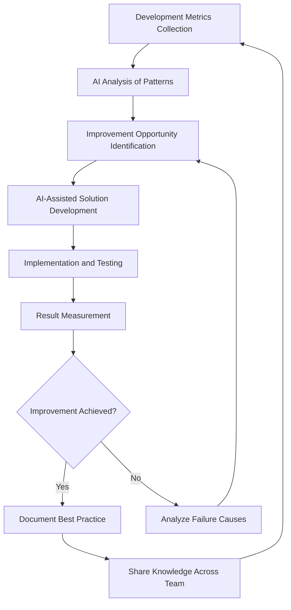

# AI-Assisted Coding Practices

## Overview
This document establishes comprehensive coding practices that leverage AI tools to enhance developer productivity, code quality, and maintainability while ensuring human oversight and quality control throughout the development process.

## AI-Enhanced Development Workflow

### 1. Development Process Integration

#### AI-First Development Approach


#### Human-AI Collaboration Model
```yaml
Collaboration_Framework:
  Human_Responsibilities:
    - Architectural decision making
    - Business logic validation
    - Code review and approval
    - Integration testing oversight
    - Security and privacy compliance
    - Performance optimization decisions
    
  AI_Responsibilities:
    - Code generation and boilerplate
    - Pattern recognition and application
    - Documentation generation
    - Test case creation
    - Code quality analysis
    - Refactoring suggestions
    
  Shared_Responsibilities:
    - Error handling implementation
    - Performance optimization
    - Code documentation
    - Testing strategy development
    - Bug identification and resolution
```

### 2. Claude Code Integration Patterns

#### Prompt Engineering for Development
```python
class DevelopmentPromptTemplates:
    """Standardized prompts for development tasks with Claude Code"""
    
    @staticmethod
    def generate_component_prompt(requirements: dict, context: dict) -> str:
        """Generate component implementation prompt"""
        return f"""
        Implement a Python component with these specifications:
        
        Requirements: {requirements}
        System Context: {context}
        
        Follow these patterns for the Chat App:
        1. Async/await for all I/O operations
        2. Event-driven architecture using EventBus
        3. Comprehensive error handling with custom exceptions
        4. Plugin-compatible design with hook registration
        5. Configuration via dependency injection
        6. Extensive logging for debugging
        7. Type hints for all function signatures
        8. Docstrings following Google style
        
        Component Structure:
        - Initialize with dependencies and config
        - Implement async initialize() method
        - Register event handlers with EventBus
        - Provide get_status_line() for terminal display
        - Include graceful shutdown() method
        
        Testing Requirements:
        - Unit tests with >90% coverage
        - Mock external dependencies
        - Test error conditions and edge cases
        - Performance benchmarks where applicable
        """
    
    @staticmethod
    def generate_refactoring_prompt(code_snippet: str, issues: list) -> str:
        """Generate code refactoring prompt"""
        return f"""
        Refactor this code to address the identified issues:
        
        Current Code:
        {code_snippet}
        
        Issues to Address:
        {issues}
        
        Apply these Chat App patterns:
        1. Single Responsibility Principle
        2. Dependency Injection pattern
        3. Async context management
        4. Event-driven communication
        5. Comprehensive error handling
        6. Performance optimization
        7. Memory efficiency
        8. Thread safety where applicable
        
        Maintain backward compatibility and existing API contracts.
        Include migration guide if breaking changes are necessary.
        """
    
    @staticmethod
    def generate_testing_prompt(component: str, functionality: dict) -> str:
        """Generate comprehensive test suite prompt"""
        return f"""
        Generate comprehensive test suite for:
        
        Component: {component}
        Functionality: {functionality}
        
        Test Categories Required:
        1. Unit Tests:
           - Happy path scenarios
           - Edge cases and boundary conditions
           - Error conditions and exception handling
           - Mock integration points
           
        2. Integration Tests:
           - Component interaction testing
           - Event bus integration
           - Configuration validation
           - Plugin compatibility
           
        3. Performance Tests:
           - Response time benchmarks
           - Memory usage validation
           - Concurrency stress testing
           - Resource cleanup verification
           
        Use Python unittest framework with async test support.
        Include test fixtures and data builders.
        Ensure tests are deterministic and fast.
        """
```

#### AI-Assisted Code Generation Workflow
```python
class AIAssistedDevelopment:
    def __init__(self, claude_client, project_context):
        self.claude_client = claude_client
        self.project_context = project_context
        
    async def generate_component(self, specification: dict) -> GeneratedComponent:
        """Generate component with AI assistance"""
        
        # Step 1: Generate initial implementation
        implementation_prompt = DevelopmentPromptTemplates.generate_component_prompt(
            specification, self.project_context
        )
        
        initial_code = await self.claude_client.generate_code(implementation_prompt)
        
        # Step 2: Generate corresponding tests
        test_prompt = DevelopmentPromptTemplates.generate_testing_prompt(
            specification['name'], specification['functionality']
        )
        
        test_code = await self.claude_client.generate_code(test_prompt)
        
        # Step 3: Generate documentation
        doc_prompt = f"""
        Generate comprehensive documentation for this component:
        
        Code: {initial_code}
        Tests: {test_code}
        
        Include:
        - Component overview and purpose
        - API documentation with examples
        - Configuration options
        - Integration guide
        - Troubleshooting section
        """
        
        documentation = await self.claude_client.generate_documentation(doc_prompt)
        
        # Step 4: Perform quality analysis
        quality_analysis = await self.analyze_code_quality(initial_code, test_code)
        
        return GeneratedComponent(
            implementation=initial_code,
            tests=test_code,
            documentation=documentation,
            quality_analysis=quality_analysis
        )
    
    async def analyze_code_quality(self, code: str, tests: str) -> QualityAnalysis:
        """AI-powered code quality analysis"""
        
        quality_prompt = f"""
        Analyze the quality of this code and test suite:
        
        Implementation: {code}
        Tests: {tests}
        
        Evaluate:
        1. Code Quality (1-10):
           - Readability and maintainability
           - Adherence to SOLID principles
           - Error handling completeness
           - Performance considerations
           
        2. Test Quality (1-10):
           - Coverage completeness
           - Test case adequacy
           - Edge case handling
           - Test maintainability
           
        3. Documentation Quality (1-10):
           - API documentation completeness
           - Code comment quality
           - Usage example clarity
           - Integration guidance
           
        4. Security Analysis:
           - Input validation
           - Error information leakage
           - Resource management
           - Authentication/authorization
           
        5. Performance Analysis:
           - Algorithmic efficiency
           - Memory usage patterns
           - Async/await usage
           - Resource cleanup
           
        Provide specific improvement recommendations for each area.
        """
        
        return await self.claude_client.analyze_quality(quality_prompt)
```

### 3. Code Generation Standards

#### Template-Based Generation
```python
# AI-Generated Component Template for Chat App
class AIGeneratedComponent:
    """
    AI-Generated Component Template for Chat App Architecture
    
    This template provides the standard structure for all Chat App components,
    ensuring consistency with the event-driven, plugin-based architecture.
    """
    
    def __init__(self, event_bus, config, logger, dependencies=None):
        """
        Initialize component with Chat App standard dependencies
        
        Args:
            event_bus: EventBus instance for event-driven communication
            config: Configuration object with dot-notation access
            logger: Logger instance for debugging and monitoring
            dependencies: Optional dictionary of injected dependencies
            
        Raises:
            ConfigurationError: If required configuration is missing
            DependencyError: If required dependencies are unavailable
        """
        self.event_bus = event_bus
        self.config = config
        self.logger = logger
        self.dependencies = dependencies or {}
        
        # Component state management
        self.state = ComponentState()
        self.metrics = ComponentMetrics()
        self.error_handler = ErrorHandler(logger)
        
        # Validate configuration and dependencies
        self._validate_initialization()
        
    async def initialize(self) -> None:
        """
        Async initialization for component setup
        
        This method handles:
        - Resource allocation
        - External service connections
        - Event handler registration
        - Plugin hook setup
        
        Should be called after construction but before use.
        Idempotent - safe to call multiple times.
        """
        try:
            await self._setup_resources()
            await self._register_event_handlers()
            await self._register_plugin_hooks()
            
            self.state.set_initialized()
            self.logger.info(f"{self.__class__.__name__} initialized successfully")
            
        except Exception as e:
            self.logger.error(f"Initialization failed: {e}")
            await self._cleanup_resources()
            raise InitializationError(f"Component initialization failed: {e}")
    
    async def process_event(self, event: Event) -> EventResult:
        """
        Main event processing method
        
        Args:
            event: Event to process
            
        Returns:
            EventResult containing processing outcome
            
        Raises:
            ProcessingError: If event processing fails
        """
        # Input validation
        if not self.state.is_initialized():
            raise ProcessingError("Component not initialized")
        
        # Event processing with error handling
        try:
            self.metrics.record_event_start(event.type)
            
            # Delegate to specific handler
            result = await self._handle_event(event)
            
            self.metrics.record_event_success(event.type)
            return result
            
        except Exception as e:
            self.metrics.record_event_error(event.type, e)
            
            # Attempt error recovery
            recovery_result = await self.error_handler.handle_error(e, event)
            if recovery_result.recovered:
                return recovery_result.result
            else:
                raise ProcessingError(f"Event processing failed: {e}")
    
    async def shutdown(self) -> None:
        """
        Graceful shutdown with resource cleanup
        
        This method handles:
        - Event handler deregistration
        - Resource cleanup
        - Connection termination
        - State persistence
        
        Idempotent - safe to call multiple times.
        """
        try:
            await self._deregister_event_handlers()
            await self._cleanup_resources()
            await self._persist_state()
            
            self.state.set_shutdown()
            self.logger.info(f"{self.__class__.__name__} shutdown completed")
            
        except Exception as e:
            self.logger.error(f"Shutdown error: {e}")
            # Continue shutdown despite errors
    
    def get_status_line(self) -> str:
        """
        Generate status line for terminal display
        
        Returns:
            Formatted status string for terminal renderer
        """
        return f"{self.__class__.__name__}: {self.state.status} | " \
               f"Events: {self.metrics.total_events} | " \
               f"Errors: {self.metrics.error_count}"
    
    def get_health_status(self) -> HealthStatus:
        """
        Get comprehensive component health information
        
        Returns:
            HealthStatus with detailed health metrics
        """
        return HealthStatus(
            component_name=self.__class__.__name__,
            healthy=self.state.is_healthy(),
            metrics=self.metrics.get_summary(),
            diagnostics=self._get_diagnostics(),
            last_activity=self.metrics.last_activity
        )
```

#### Code Quality Standards
```yaml
AI_Generated_Code_Standards:
  Code_Structure:
    - Follow Single Responsibility Principle
    - Use dependency injection for all external dependencies
    - Implement proper async/await patterns
    - Include comprehensive error handling
    - Provide extensive logging throughout
    
  Documentation_Requirements:
    - Google-style docstrings for all public methods
    - Type hints for all function parameters and returns
    - Inline comments for complex logic
    - Usage examples in docstrings
    - Integration notes for Chat App ecosystem
    
  Error_Handling_Patterns:
    - Custom exception classes for domain-specific errors
    - Graceful degradation where possible
    - Comprehensive error logging with context
    - Recovery mechanisms for transient failures
    - Clear error messages for debugging
    
  Performance_Considerations:
    - Efficient async/await usage
    - Proper resource cleanup in finally blocks
    - Memory-efficient data structures
    - Lazy loading where appropriate
    - Caching for expensive operations
    
  Testing_Requirements:
    - Unit tests for all public methods
    - Integration tests for external dependencies
    - Error condition testing
    - Performance benchmarks for critical paths
    - Mock usage for external services
```

### 4. AI-Assisted Code Review Process

#### Automated Code Review with AI
```python
class AICodeReviewer:
    def __init__(self, claude_client):
        self.claude_client = claude_client
        
    async def review_pull_request(self, pr_data: dict) -> CodeReviewResult:
        """Comprehensive AI-assisted pull request review"""
        
        review_prompt = f"""
        Conduct a comprehensive code review for this pull request:
        
        Changes: {pr_data['changes']}
        Context: {pr_data['context']}
        
        Review Areas:
        
        1. Code Quality (Weight: 25%)
           - SOLID principles adherence
           - DRY principle application
           - Code readability and maintainability
           - Naming conventions consistency
           - Comment quality and necessity
           
        2. Architecture Alignment (Weight: 20%)
           - Consistency with Chat App architecture
           - Event-driven pattern usage
           - Plugin system integration
           - Proper separation of concerns
           - Dependency injection usage
           
        3. Error Handling (Weight: 15%)
           - Exception handling completeness
           - Error recovery mechanisms
           - Logging quality and coverage
           - Graceful degradation patterns
           - Input validation thoroughness
           
        4. Performance (Weight: 15%)
           - Async/await usage optimization
           - Resource management efficiency
           - Memory usage patterns
           - Algorithm efficiency
           - Potential bottleneck identification
           
        5. Testing (Weight: 15%)
           - Test coverage adequacy
           - Test quality and maintainability
           - Edge case coverage
           - Integration test completeness
           - Mock usage appropriateness
           
        6. Security (Weight: 10%)
           - Input validation security
           - Error information leakage
           - Resource access controls
           - Data sanitization practices
           - Authentication/authorization
        
        For each area, provide:
        - Score (1-10)
        - Specific observations
        - Improvement recommendations
        - Code examples where helpful
        - Priority level (High/Medium/Low)
        """
        
        return await self.claude_client.review_code(review_prompt)
    
    async def suggest_improvements(self, code_section: str, context: dict) -> ImprovementSuggestions:
        """Generate specific improvement suggestions for code section"""
        
        improvement_prompt = f"""
        Analyze this code section and provide specific improvement suggestions:
        
        Code: {code_section}
        Context: {context}
        
        Focus on:
        1. Chat App architectural patterns
        2. Python best practices
        3. Performance optimizations
        4. Error handling improvements
        5. Code readability enhancements
        6. Testing considerations
        
        For each suggestion, provide:
        - Current issue description
        - Recommended solution
        - Code example of improvement
        - Justification for the change
        - Impact assessment (effort vs benefit)
        """
        
        return await self.claude_client.suggest_improvements(improvement_prompt)
```

#### Review Quality Gates
```yaml
Code_Review_Quality_Gates:
  Automated_Checks:
    AI_Review_Score: ">= 7.0/10"
    Code_Coverage: ">= 90%"
    Performance_Tests: "All passing"
    Security_Scan: "No high/critical issues"
    Documentation_Coverage: ">= 95%"
    
  Human_Review_Requirements:
    Technical_Review: "Required for all changes"
    Architecture_Review: "Required for significant changes"
    Security_Review: "Required for security-related changes"
    Performance_Review: "Required for performance-critical changes"
    
  Approval_Criteria:
    Code_Quality: "AI score >= 8.0 OR human approval with justification"
    Test_Coverage: ">=90% with meaningful tests"
    Documentation: "Complete and accurate"
    Performance: "No regressions detected"
    Security: "No unresolved security issues"
```

### 5. Refactoring with AI Assistance

#### AI-Guided Refactoring Process
```python
class RefactoringAssistant:
    def __init__(self, claude_client, codebase_analyzer):
        self.claude_client = claude_client
        self.codebase_analyzer = codebase_analyzer
        
    async def analyze_refactoring_opportunities(self, codebase_path: str) -> RefactoringOpportunities:
        """Identify refactoring opportunities across the codebase"""
        
        # Analyze codebase structure
        analysis = await self.codebase_analyzer.analyze(codebase_path)
        
        refactoring_prompt = f"""
        Analyze this codebase for refactoring opportunities:
        
        Codebase Analysis: {analysis}
        
        Identify opportunities for:
        
        1. Code Duplication Elimination
           - Repeated code patterns
           - Similar function implementations
           - Duplicated business logic
           - Copy-paste programming instances
           
        2. Design Pattern Implementation
           - Missing design patterns that would improve structure
           - Incorrect pattern usage
           - Pattern consolidation opportunities
           - Architecture pattern improvements
           
        3. Performance Optimizations
           - Inefficient algorithms
           - Memory usage improvements
           - I/O optimization opportunities
           - Caching implementation possibilities
           
        4. Code Quality Improvements
           - Long method/class refactoring
           - Complex conditional simplification
           - Variable/method naming improvements
           - Comment and documentation updates
           
        5. Architecture Improvements
           - Separation of concerns violations
           - Dependency injection opportunities
           - Interface segregation needs
           - Modularization improvements
        
        For each opportunity, provide:
        - Description of current issue
        - Proposed solution approach
        - Estimated effort level (Small/Medium/Large)
        - Business impact assessment
        - Risk level of refactoring
        - Implementation priority
        """
        
        return await self.claude_client.analyze_refactoring(refactoring_prompt)
    
    async def execute_refactoring(self, refactoring_plan: RefactoringPlan) -> RefactoringResult:
        """Execute refactoring with AI assistance"""
        
        execution_prompt = f"""
        Execute this refactoring plan:
        
        Plan: {refactoring_plan}
        
        Provide:
        1. Step-by-step implementation guide
        2. Code changes for each step
        3. Test updates required
        4. Documentation updates needed
        5. Migration guide for breaking changes
        6. Rollback plan in case of issues
        
        Ensure:
        - Backward compatibility where possible
        - Comprehensive testing of changes
        - Clear commit message structure
        - Performance impact assessment
        - Security implication review
        """
        
        return await self.claude_client.execute_refactoring(execution_prompt)
```

### 6. Documentation Generation

#### AI-Generated Documentation Standards
```python
class DocumentationGenerator:
    def __init__(self, claude_client):
        self.claude_client = claude_client
        
    async def generate_component_documentation(self, component_code: str) -> Documentation:
        """Generate comprehensive component documentation"""
        
        doc_prompt = f"""
        Generate comprehensive documentation for this Chat App component:
        
        Code: {component_code}
        
        Generate documentation in this structure:
        
        # Component Name
        
        ## Overview
        Brief description of component purpose and role in Chat App ecosystem.
        
        ## Architecture
        - Component responsibilities
        - Integration with EventBus
        - Plugin system interactions
        - Dependencies and relationships
        
        ## API Reference
        ### Public Methods
        For each public method, provide:
        - Method signature with type hints
        - Parameter descriptions
        - Return value description
        - Usage examples
        - Error conditions and exceptions
        
        ### Configuration Options
        - All configuration parameters
        - Default values
        - Environment variable overrides
        - Configuration validation rules
        
        ## Usage Examples
        ### Basic Usage
        ```python
        # Basic component usage example
        ```
        
        ### Advanced Usage
        ```python
        # Advanced usage scenarios
        ```
        
        ### Integration Examples
        ```python
        # Integration with other Chat App components
        ```
        
        ## Error Handling
        - Exception types and when they occur
        - Error recovery mechanisms
        - Logging and debugging guidance
        - Troubleshooting common issues
        
        ## Performance Considerations
        - Performance characteristics
        - Optimization recommendations
        - Resource usage patterns
        - Scaling considerations
        
        ## Testing
        - Unit testing approach
        - Integration testing requirements
        - Mock usage guidelines
        - Performance testing recommendations
        
        ## Changelog
        - Version history
        - Breaking changes
        - Migration guides
        """
        
        return await self.claude_client.generate_documentation(doc_prompt)
    
    async def generate_api_documentation(self, api_spec: dict) -> APIDocumentation:
        """Generate API documentation from specification"""
        
        api_doc_prompt = f"""
        Generate comprehensive API documentation:
        
        API Specification: {api_spec}
        
        Include:
        1. API Overview and Authentication
        2. Base URLs and Versioning
        3. Request/Response Formats
        4. Endpoint Documentation:
           - HTTP methods and URLs
           - Parameters (path, query, body)
           - Response schemas and examples
           - Error codes and messages
           - Rate limiting information
        5. SDK Examples in Python
        6. Integration Guide
        7. Troubleshooting Section
        8. Changelog and Versioning
        
        Format as markdown with OpenAPI compliance.
        """
        
        return await self.claude_client.generate_api_documentation(api_doc_prompt)
```

### 7. Performance Optimization with AI

#### AI-Powered Performance Analysis
```python
class PerformanceOptimizer:
    def __init__(self, claude_client, profiler):
        self.claude_client = claude_client
        self.profiler = profiler
        
    async def analyze_performance_bottlenecks(self, component: str) -> PerformanceAnalysis:
        """Identify and analyze performance bottlenecks"""
        
        # Collect profiling data
        profile_data = await self.profiler.profile_component(component)
        
        analysis_prompt = f"""
        Analyze performance bottlenecks in this Chat App component:
        
        Component: {component}
        Profile Data: {profile_data}
        
        Analyze:
        1. CPU Usage Patterns
           - High CPU utilization functions
           - Inefficient algorithms
           - Synchronous blocking in async code
           - Unnecessary computations
           
        2. Memory Usage Patterns
           - Memory leaks and retention
           - Large object allocations
           - Inefficient data structures
           - Caching opportunities
           
        3. I/O Performance
           - Blocking I/O operations
           - Inefficient file/network access
           - Missing async patterns
           - Batching opportunities
           
        4. Concurrency Issues
           - Thread contention
           - Lock contention
           - Async/await inefficiencies
           - Race conditions
           
        5. Chat App Specific Patterns
           - EventBus performance
           - Plugin system overhead
           - Terminal rendering efficiency
           - State management performance
        
        For each bottleneck:
        - Performance impact quantification
        - Root cause analysis
        - Optimization recommendations
        - Implementation complexity
        - Expected performance improvement
        """
        
        return await self.claude_client.analyze_performance(analysis_prompt)
    
    async def generate_optimization_plan(self, analysis: PerformanceAnalysis) -> OptimizationPlan:
        """Generate comprehensive optimization implementation plan"""
        
        optimization_prompt = f"""
        Create optimization plan based on performance analysis:
        
        Analysis: {analysis}
        
        Generate plan with:
        
        1. Prioritized Optimizations
           - High impact, low effort changes first
           - Performance improvement estimates
           - Implementation complexity ratings
           - Risk assessments
           
        2. Implementation Strategy
           - Phase-based rollout approach
           - Measurement and validation plan
           - Rollback procedures
           - Performance testing requirements
           
        3. Code Changes
           - Specific optimization implementations
           - Before/after code examples
           - Configuration changes needed
           - Dependencies or library updates
           
        4. Monitoring and Validation
           - Performance metrics to track
           - Benchmarking approaches
           - Success criteria definitions
           - Ongoing monitoring recommendations
        """
        
        return await self.claude_client.generate_optimization_plan(optimization_prompt)
```

## Best Practices and Guidelines

### Development Workflow Standards
```yaml
AI_Assisted_Development_Best_Practices:
  Planning_Phase:
    - Use AI for initial architecture suggestions
    - Validate AI recommendations with human expertise
    - Document AI-assisted decisions and rationale
    - Maintain architectural consistency checks
    
  Implementation_Phase:
    - Start with AI-generated boilerplate and templates
    - Iterate with AI for complex logic development
    - Human review of all AI-generated code
    - Continuous integration with automated testing
    
  Review_Phase:
    - AI-assisted code review as first pass
    - Human review for architecture and business logic
    - Performance and security analysis with AI
    - Documentation generation and validation
    
  Maintenance_Phase:
    - AI-powered refactoring recommendations
    - Automated performance monitoring
    - Proactive issue identification
    - Documentation maintenance with AI assistance
```

### Quality Assurance Integration
```python
class QualityAssuranceIntegration:
    """Integration of AI tools with QA processes"""
    
    async def pre_commit_quality_check(self, changes: dict) -> QualityCheckResult:
        """AI-powered pre-commit quality validation"""
        
        check_prompt = f"""
        Perform pre-commit quality check on these changes:
        
        Changes: {changes}
        
        Validate:
        1. Code quality and standards compliance
        2. Test coverage adequacy
        3. Documentation completeness
        4. Performance impact assessment
        5. Security vulnerability check
        6. Architecture consistency
        
        Provide pass/fail decision with specific issues.
        """
        
        return await self.claude_client.quality_check(check_prompt)
    
    async def continuous_quality_monitoring(self) -> QualityMetrics:
        """Ongoing quality monitoring with AI analysis"""
        
        monitoring_prompt = """
        Analyze current codebase quality metrics:
        
        Monitor:
        1. Code complexity trends
        2. Technical debt accumulation
        3. Test coverage evolution
        4. Performance degradation patterns
        5. Documentation staleness
        6. Dependency vulnerability status
        
        Provide actionable recommendations for quality improvement.
        """
        
        return await self.claude_client.monitor_quality(monitoring_prompt)
```

### AI Tool Selection and Integration
```yaml
Recommended_AI_Tools:
  Primary_Development_Assistant:
    Tool: "Claude Code"
    Use_Cases: 
      - Component generation and refactoring
      - Code review and quality analysis
      - Documentation generation
      - Architecture recommendations
      
  Code_Quality_Analysis:
    Tools: ["Claude Code", "SonarQube with AI", "DeepCode"]
    Integration: "CI/CD pipeline integration"
    
  Performance_Analysis:
    Tools: ["Python Profiler", "AI Performance Analyzer"]
    Metrics: "Response time, memory usage, throughput"
    
  Security_Analysis:
    Tools: ["Bandit", "Safety", "AI Security Scanner"]
    Coverage: "Dependency vulnerabilities, code security patterns"
    
  Testing_Assistance:
    Tools: ["Claude Code for test generation", "Coverage.py"]
    Approach: "AI-generated tests with human validation"
```

### Continuous Improvement Process


---

*This AI-assisted coding practices framework ensures high-quality, maintainable code development while leveraging AI capabilities to enhance developer productivity and code quality throughout the Chat App development lifecycle.*