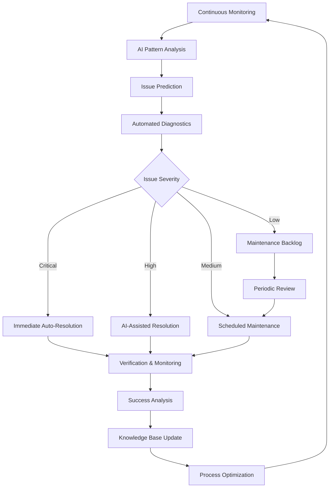
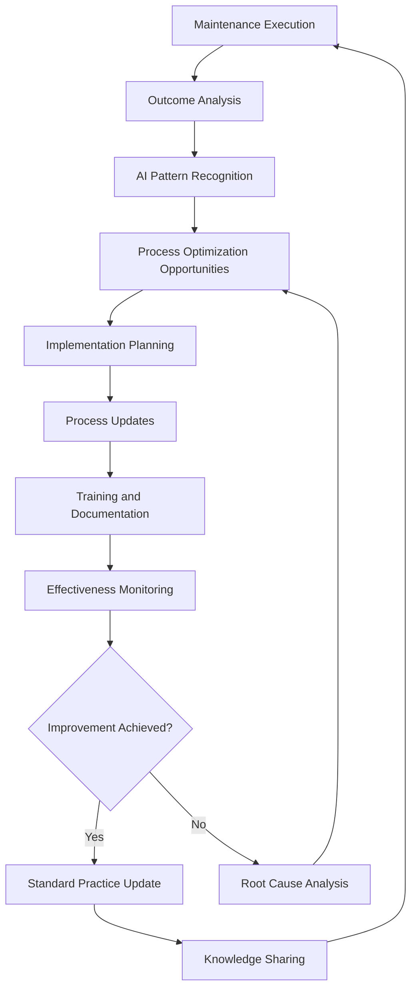

# AI-Powered Maintenance

## Overview
This document establishes a comprehensive maintenance strategy that leverages AI tools to proactively monitor, maintain, and optimize the Chat App throughout its operational lifecycle, ensuring high availability, performance, and user satisfaction while minimizing operational overhead.

## AI-Enhanced Maintenance Framework

### 1. Maintenance Philosophy and Approach

#### Proactive AI-Driven Maintenance Model


#### Maintenance Strategy Framework
```yaml
Maintenance_Strategy:
  Preventive_Maintenance:
    Description: "Proactive issue prevention through AI analysis"
    Frequency: "Continuous monitoring with daily analysis"
    AI_Capabilities:
      - Performance trend analysis
      - Resource utilization prediction
      - Dependency vulnerability monitoring
      - Configuration drift detection
    
  Predictive_Maintenance:
    Description: "AI-powered failure prediction and prevention"
    Scope: "System-wide health and performance monitoring"
    AI_Capabilities:
      - Failure pattern recognition
      - Performance degradation prediction
      - Resource exhaustion forecasting
      - Plugin compatibility analysis
    
  Corrective_Maintenance:
    Description: "AI-assisted issue resolution and recovery"
    Response_Time: "< 15 minutes for critical issues"
    AI_Capabilities:
      - Automated diagnosis and root cause analysis
      - Self-healing mechanisms
      - Rollback decision making
      - Recovery procedure automation
    
  Adaptive_Maintenance:
    Description: "AI-guided system evolution and optimization"
    Frequency: "Monthly optimization cycles"
    AI_Capabilities:
      - Performance optimization recommendations
      - Architecture improvement suggestions
      - Plugin ecosystem enhancement
      - User experience optimization
```

### 2. Continuous Monitoring and Health Assessment

#### AI-Powered System Health Monitoring
```python
class SystemHealthMonitor:
    def __init__(self, claude_client, metrics_collector, alert_manager):
        self.claude_client = claude_client
        self.metrics_collector = metrics_collector
        self.alert_manager = alert_manager
        
    async def assess_system_health(self) -> SystemHealthReport:
        """Comprehensive AI-powered system health assessment"""
        
        # Collect comprehensive metrics
        health_metrics = await self.metrics_collector.collect_all_metrics()
        
        health_analysis_prompt = f"""
        Analyze Chat App system health comprehensively:
        
        Current Metrics: {health_metrics}
        
        Assess health across these dimensions:
        
        1. Core System Health (Weight: 30%):
           - EventBus performance and throughput
           - Memory usage patterns and trends
           - CPU utilization and efficiency
           - Response time consistency
           - Error rates and patterns
           
        2. Component Health (Weight: 25%):
           - Plugin system stability and performance
           - Terminal interface responsiveness
           - Configuration system integrity
           - Storage system performance
           - I/O system efficiency
           
        3. Integration Health (Weight: 20%):
           - LLM API connectivity and performance
           - External service dependencies
           - Network connectivity stability
           - Database performance and consistency
           - File system access patterns
           
        4. User Experience Health (Weight: 15%):
           - Session stability and duration
           - Feature availability and functionality
           - Error handling effectiveness
           - Performance consistency
           - Resource usage impact
           
        5. Operational Health (Weight: 10%):
           - Logging system functionality
           - Monitoring system health
           - Configuration management
           - Security posture maintenance
           - Backup and recovery readiness
        
        For each dimension, provide:
        - Health score (1-10)
        - Trend analysis (improving/stable/degrading)
        - Key performance indicators
        - Risk assessment
        - Recommended actions
        
        Include:
        - Overall system health score
        - Critical issues requiring immediate attention
        - Warning indicators for proactive action
        - Performance optimization opportunities
        - Capacity planning recommendations
        """
        
        health_analysis = await self.claude_client.analyze_system_health(health_analysis_prompt)
        
        # Generate alerts for critical issues
        if health_analysis.overall_score < 7.0:
            await self.alert_manager.send_alert(
                severity="HIGH",
                message=f"System health degraded to {health_analysis.overall_score}",
                details=health_analysis.critical_issues
            )
        
        return SystemHealthReport(
            timestamp=datetime.now(),
            overall_score=health_analysis.overall_score,
            dimension_scores=health_analysis.dimension_scores,
            trends=health_analysis.trends,
            recommendations=health_analysis.recommendations,
            alerts_generated=health_analysis.alerts
        )
    
    async def predict_maintenance_needs(self, historical_data: dict) -> MaintenancePrediction:
        """AI-powered maintenance needs prediction"""
        
        prediction_prompt = f"""
        Predict maintenance needs for Chat App based on patterns:
        
        Historical Data: {historical_data}
        
        Analyze patterns to predict:
        
        1. Performance Degradation:
           - Response time increase trends
           - Memory usage growth patterns
           - CPU utilization climbing
           - Error rate increases
           
        2. Resource Exhaustion:
           - Disk space consumption trends
           - Memory leak patterns
           - Connection pool exhaustion
           - File handle usage growth
           
        3. Component Failures:
           - Plugin system instability patterns
           - EventBus overload indicators
           - Configuration corruption risks
           - Integration point failures
           
        4. Capacity Issues:
           - User load growth patterns
           - Feature usage expansion
           - Data volume increases
           - Concurrent session trends
           
        5. Security Concerns:
           - Vulnerability accumulation
           - Configuration drift risks
           - Access pattern anomalies
           - Dependency security issues
        
        For each predicted issue, provide:
        - Probability of occurrence (percentage)
        - Estimated timeline for manifestation
        - Potential impact severity
        - Recommended preventive actions
        - Resource requirements for resolution
        
        Prioritize predictions by:
        - Risk level (impact × probability)
        - Business impact severity
        - Resolution complexity
        - Dependencies on other issues
        """
        
        return await self.claude_client.predict_maintenance_needs(prediction_prompt)
```

#### Real-time Performance Monitoring
```python
class PerformanceMonitor:
    def __init__(self, claude_client, performance_collector):
        self.claude_client = claude_client
        self.performance_collector = performance_collector
        
    async def monitor_performance_continuously(self) -> PerformanceAnalysis:
        """Continuous AI-powered performance monitoring"""
        
        performance_data = await self.performance_collector.collect_performance_metrics()
        
        performance_analysis_prompt = f"""
        Analyze Chat App performance metrics for optimization opportunities:
        
        Performance Data: {performance_data}
        
        Analyze these performance aspects:
        
        1. Response Time Analysis:
           - LLM query processing time trends
           - Terminal rendering performance
           - EventBus message processing speed
           - Plugin hook execution time
           - Configuration loading performance
           
        2. Throughput Analysis:
           - Messages processed per second
           - Concurrent user handling capacity
           - Event processing rate
           - Plugin system scalability
           - I/O operation efficiency
           
        3. Resource Utilization:
           - Memory usage efficiency and patterns
           - CPU utilization optimization
           - Disk I/O performance
           - Network bandwidth usage
           - File handle utilization
           
        4. Scalability Assessment:
           - Performance under varying loads
           - Resource consumption scaling
           - Response time consistency
           - Error rate under stress
           - Recovery time from overload
           
        5. Chat App Specific Performance:
           - Terminal rendering frame rate consistency
           - EventBus throughput optimization
           - Plugin loading and execution speed
           - Configuration parsing efficiency
           - State management performance
        
        Identify:
        - Performance bottlenecks and root causes
        - Optimization opportunities with impact estimates
        - Resource allocation improvements
        - Configuration tuning recommendations
        - Architecture enhancement suggestions
        
        Provide:
        - Performance score (1-10)
        - Bottleneck prioritization
        - Quick wins vs long-term improvements
        - Resource requirement estimates
        - Implementation complexity assessment
        """
        
        return await self.claude_client.analyze_performance(performance_analysis_prompt)
```

### 3. Automated Issue Detection and Resolution

#### AI-Driven Issue Detection System
```python
class IssueDetectionSystem:
    def __init__(self, claude_client, log_analyzer, metrics_analyzer):
        self.claude_client = claude_client
        self.log_analyzer = log_analyzer
        self.metrics_analyzer = metrics_analyzer
        
    async def detect_system_issues(self) -> IssueDetectionReport:
        """Comprehensive AI-powered issue detection"""
        
        # Analyze logs for anomalies
        log_analysis = await self.log_analyzer.analyze_recent_logs()
        
        # Analyze metrics for patterns
        metric_analysis = await self.metrics_analyzer.analyze_metric_patterns()
        
        issue_detection_prompt = f"""
        Detect and classify system issues for Chat App:
        
        Log Analysis: {log_analysis}
        Metric Analysis: {metric_analysis}
        
        Detect issues in these categories:
        
        1. Critical Issues (Immediate attention required):
           - System crashes or hangs
           - Data corruption or loss
           - Security breaches or vulnerabilities
           - Complete service unavailability
           - Critical plugin failures
           
        2. High Priority Issues (Within 1 hour):
           - Performance degradation >50%
           - Partial feature unavailability
           - High error rates (>5%)
           - Memory leaks or resource exhaustion
           - Plugin system instability
           
        3. Medium Priority Issues (Within 4 hours):
           - Minor performance degradation
           - Non-critical feature issues
           - Configuration inconsistencies
           - Warning level log patterns
           - User experience impact
           
        4. Low Priority Issues (Within 24 hours):
           - Optimization opportunities
           - Documentation inconsistencies
           - Minor UI/UX improvements
           - Non-critical warnings
           - Maintenance scheduling needs
           
        5. Chat App Specific Issues:
           - EventBus communication problems
           - Plugin loading or execution failures
           - Terminal rendering issues
           - LLM integration problems
           - Configuration system errors
        
        For each detected issue, provide:
        - Issue classification and severity
        - Root cause analysis
        - Impact assessment (users affected, functionality impacted)
        - Resolution approach recommendations
        - Estimated resolution time and effort
        - Dependencies and prerequisites
        
        Prioritize issues by:
        - Business impact severity
        - Number of users affected
        - System stability risk
        - Resolution complexity
        - Available resources
        """
        
        detection_results = await self.claude_client.detect_issues(issue_detection_prompt)
        
        return IssueDetectionReport(
            timestamp=datetime.now(),
            issues_detected=detection_results.issues,
            severity_distribution=detection_results.severity_distribution,
            recommended_actions=detection_results.actions,
            auto_resolution_candidates=detection_results.auto_resolvable
        )
    
    async def classify_issue_patterns(self, historical_issues: dict) -> PatternAnalysis:
        """Analyze historical issue patterns for prevention"""
        
        pattern_analysis_prompt = f"""
        Analyze historical issue patterns for Chat App:
        
        Historical Issues: {historical_issues}
        
        Identify patterns in:
        
        1. Recurring Issues:
           - Frequently occurring problems
           - Seasonal or time-based patterns
           - Load-related issue patterns
           - Configuration-related problems
           - Plugin-specific issues
           
        2. Root Cause Patterns:
           - Common underlying causes
           - System component failure patterns
           - External dependency issues
           - Resource exhaustion patterns
           - Code quality related problems
           
        3. Resolution Patterns:
           - Effective resolution approaches
           - Time to resolution trends
           - Resource requirements patterns
           - Success rates by resolution type
           - Prevention effectiveness
           
        4. Impact Patterns:
           - User impact severity trends
           - Business functionality effects
           - System stability impacts
           - Performance degradation patterns
           - Recovery time patterns
           
        5. Prevention Opportunities:
           - Proactive monitoring improvements
           - Configuration management enhancements
           - Code quality improvements
           - Testing strategy enhancements
           - Deployment process refinements
        
        Provide:
        - Pattern classification and significance
        - Prevention strategy recommendations
        - Monitoring enhancement suggestions
        - Process improvement opportunities
        - Investment prioritization for prevention
        """
        
        return await self.claude_client.analyze_issue_patterns(pattern_analysis_prompt)
```

#### Automated Resolution Engine
```python
class AutomatedResolutionEngine:
    def __init__(self, claude_client, system_controller):
        self.claude_client = claude_client
        self.system_controller = system_controller
        
    async def resolve_issue_automatically(self, issue: DetectedIssue) -> ResolutionResult:
        """AI-powered automated issue resolution"""
        
        resolution_prompt = f"""
        Develop automated resolution for this Chat App issue:
        
        Issue Details: {issue}
        
        Analyze resolution approach:
        
        1. Issue Classification:
           - Problem type and severity
           - Affected components and systems
           - Root cause identification
           - Resolution complexity assessment
           
        2. Resolution Strategy Options:
           
           Immediate Actions:
           - Service restart or reload
           - Configuration reset or correction
           - Resource cleanup or reallocation
           - Plugin system restart
           - Cache clearing or refresh
           
           Corrective Actions:
           - Configuration file corrections
           - Database cleanup or repair
           - Log rotation or cleanup
           - Plugin reinstallation
           - Dependency updates
           
           Preventive Actions:
           - Monitoring threshold adjustments
           - Resource limit modifications
           - Configuration optimization
           - Performance tuning
           - Security hardening
           
        3. Risk Assessment:
           - Resolution success probability
           - Potential side effects or risks
           - System stability impact
           - User experience disruption
           - Data integrity concerns
           
        4. Rollback Planning:
           - Rollback triggers and conditions
           - Rollback procedure steps
           - Recovery time estimates
           - Alternative resolution approaches
           - Escalation criteria
        
        5. Chat App Specific Considerations:
           - EventBus system impact
           - Plugin ecosystem effects
           - Terminal interface continuity
           - Configuration system integrity
           - User session preservation
        
        Provide:
        - Recommended resolution approach
        - Step-by-step resolution procedure
        - Risk mitigation strategies
        - Success criteria and validation
        - Monitoring requirements post-resolution
        """
        
        resolution_plan = await self.claude_client.develop_resolution_plan(resolution_prompt)
        
        # Execute resolution if confidence is high and risk is acceptable
        if resolution_plan.confidence_score >= 8.0 and resolution_plan.risk_level <= "MEDIUM":
            return await self._execute_resolution_plan(resolution_plan, issue)
        else:
            return ResolutionResult(
                status="ESCALATED",
                reason="Resolution requires human oversight",
                plan=resolution_plan,
                escalation_details=resolution_plan.escalation_rationale
            )
    
    async def _execute_resolution_plan(self, plan: ResolutionPlan, issue: DetectedIssue) -> ResolutionResult:
        """Execute the AI-generated resolution plan"""
        
        resolution_context = ResolutionContext(
            issue=issue,
            plan=plan,
            start_time=datetime.now()
        )
        
        try:
            # Execute resolution steps with monitoring
            for step in plan.resolution_steps:
                step_result = await self._execute_resolution_step(step)
                resolution_context.add_step_result(step_result)
                
                # Validate step success
                if not step_result.success:
                    # Attempt rollback
                    await self._execute_rollback(resolution_context)
                    return ResolutionResult(
                        status="FAILED",
                        failure_reason=step_result.error,
                        rollback_executed=True,
                        context=resolution_context
                    )
                
                # Check for improvement in issue symptoms
                improvement_check = await self._validate_issue_improvement(issue)
                if improvement_check.resolved:
                    break
            
            # Final validation
            final_validation = await self._validate_resolution_success(issue)
            
            return ResolutionResult(
                status="SUCCESS" if final_validation.success else "PARTIAL",
                resolution_duration=resolution_context.duration,
                steps_executed=len(resolution_context.completed_steps),
                validation_results=final_validation,
                context=resolution_context
            )
            
        except Exception as e:
            # Emergency rollback
            await self._execute_rollback(resolution_context)
            return ResolutionResult(
                status="ERROR",
                error=str(e),
                rollback_executed=True,
                context=resolution_context
            )
```

### 4. Proactive Maintenance and Optimization

#### AI-Driven Performance Optimization
```python
class PerformanceOptimizer:
    def __init__(self, claude_client, system_analyzer):
        self.claude_client = claude_client
        self.system_analyzer = system_analyzer
        
    async def optimize_system_performance(self) -> OptimizationPlan:
        """AI-powered system performance optimization"""
        
        # Analyze current system state
        system_analysis = await self.system_analyzer.analyze_system_comprehensively()
        
        optimization_prompt = f"""
        Develop performance optimization plan for Chat App:
        
        System Analysis: {system_analysis}
        
        Analyze optimization opportunities across:
        
        1. Core System Optimizations:
           - EventBus performance tuning
           - Memory usage optimization
           - CPU utilization improvements
           - I/O operation efficiency
           - Async/await pattern optimization
           
        2. Component-Level Optimizations:
           - Plugin system performance
           - Terminal rendering efficiency
           - Configuration loading speed
           - Storage system optimization
           - Error handling streamlining
           
        3. Integration Optimizations:
           - LLM API communication efficiency
           - Network request optimization
           - Database query performance
           - File system access patterns
           - External service integration
           
        4. Resource Management:
           - Memory allocation strategies
           - Connection pool optimization
           - Cache utilization improvements
           - Resource cleanup efficiency
           - Garbage collection tuning
           
        5. Chat App Architecture Optimizations:
           - Event processing pipeline efficiency
           - Plugin hook execution optimization
           - Status rendering performance
           - Configuration caching strategies
           - Session state management
        
        For each optimization opportunity, provide:
        
        Impact Analysis:
        - Performance improvement estimate
        - Resource usage reduction potential
        - User experience enhancement
        - System stability improvement
        - Scalability benefits
        
        Implementation Details:
        - Specific changes required
        - Configuration modifications
        - Code optimization approaches
        - Testing requirements
        - Rollback procedures
        
        Prioritization:
        - Implementation effort (Low/Medium/High)
        - Business impact (Low/Medium/High)
        - Risk level (Low/Medium/High)
        - Dependencies and prerequisites
        - Timeline estimates
        
        Provide comprehensive optimization roadmap with phases.
        """
        
        optimization_analysis = await self.claude_client.analyze_optimization_opportunities(optimization_prompt)
        
        return OptimizationPlan(
            analysis_timestamp=datetime.now(),
            optimization_opportunities=optimization_analysis.opportunities,
            implementation_phases=optimization_analysis.phases,
            expected_benefits=optimization_analysis.benefits,
            risk_assessment=optimization_analysis.risks,
            success_metrics=optimization_analysis.metrics
        )
    
    async def implement_optimization(self, optimization: OptimizationItem) -> OptimizationResult:
        """Implement specific optimization with AI guidance"""
        
        implementation_prompt = f"""
        Guide implementation of this performance optimization:
        
        Optimization: {optimization}
        
        Provide detailed implementation guidance:
        
        1. Pre-Implementation:
           - Current state baseline measurement
           - Backup procedures for rollback
           - Risk mitigation preparations
           - Testing environment setup
           - Success criteria definition
           
        2. Implementation Steps:
           - Step-by-step implementation procedure
           - Configuration changes required
           - Code modifications needed
           - Testing at each step
           - Validation procedures
           
        3. Post-Implementation:
           - Performance measurement procedures
           - Success validation criteria
           - Monitoring adjustments
           - Documentation updates
           - Knowledge sharing requirements
           
        4. Rollback Procedures:
           - Rollback triggers and conditions
           - Step-by-step rollback process
           - Recovery validation procedures
           - Lessons learned capture
           - Prevention strategies
        
        Include Chat App specific considerations:
        - EventBus system impact
        - Plugin ecosystem compatibility
        - Terminal interface effects
        - Configuration system changes
        - User session continuity
        """
        
        implementation_guidance = await self.claude_client.generate_implementation_guidance(implementation_prompt)
        
        # Execute implementation with monitoring
        implementation_result = await self._execute_optimization_implementation(
            optimization, implementation_guidance
        )
        
        return implementation_result
```

#### Capacity Planning and Scaling
```python
class CapacityPlanner:
    def __init__(self, claude_client, usage_analyzer):
        self.claude_client = claude_client
        self.usage_analyzer = usage_analyzer
        
    async def analyze_capacity_requirements(self) -> CapacityPlan:
        """AI-powered capacity planning and scaling recommendations"""
        
        usage_data = await self.usage_analyzer.analyze_usage_patterns()
        
        capacity_planning_prompt = f"""
        Analyze capacity requirements for Chat App:
        
        Usage Data: {usage_data}
        
        Analyze capacity across these dimensions:
        
        1. Current Capacity Assessment:
           - Resource utilization patterns
           - Performance under current load
           - Bottleneck identification
           - Scalability limitations
           - Growth trajectory analysis
           
        2. Future Capacity Needs:
           - User growth projections
           - Feature usage expansion
           - Data volume increases
           - Session duration trends
           - Concurrent usage patterns
           
        3. Resource Planning:
           - Memory requirements scaling
           - CPU capacity needs
           - Storage expansion requirements
           - Network bandwidth needs
           - I/O capacity planning
           
        4. Scalability Strategy:
           - Horizontal scaling opportunities
           - Vertical scaling requirements
           - Load distribution strategies
           - Caching optimization
           - Database scaling needs
           
        5. Chat App Specific Scaling:
           - EventBus scalability requirements
           - Plugin system scaling strategies
           - Terminal interface performance scaling
           - Configuration management scaling
           - State storage scalability
        
        Provide capacity planning with:
        
        Growth Scenarios:
        - Conservative growth (25% increase)
        - Expected growth (50% increase)
        - Aggressive growth (100% increase)
        - Peak load scenarios (3x normal)
        
        Resource Recommendations:
        - Infrastructure requirements
        - Configuration optimizations
        - Architecture modifications
        - Technology upgrades
        - Monitoring enhancements
        
        Implementation Timeline:
        - Immediate needs (0-3 months)
        - Medium term needs (3-12 months)
        - Long term needs (1-3 years)
        - Contingency planning
        
        Cost-Benefit Analysis:
        - Investment requirements
        - Performance benefits
        - Risk mitigation value
        - Competitive advantage
        - ROI estimates
        """
        
        capacity_analysis = await self.claude_client.analyze_capacity_requirements(capacity_planning_prompt)
        
        return CapacityPlan(
            analysis_date=datetime.now(),
            current_capacity=capacity_analysis.current_state,
            growth_scenarios=capacity_analysis.scenarios,
            resource_requirements=capacity_analysis.requirements,
            implementation_timeline=capacity_analysis.timeline,
            cost_analysis=capacity_analysis.costs
        )
```

### 5. Security Maintenance and Vulnerability Management

#### AI-Powered Security Monitoring
```python
class SecurityMaintenanceManager:
    def __init__(self, claude_client, security_scanner, vulnerability_db):
        self.claude_client = claude_client
        self.security_scanner = security_scanner
        self.vulnerability_db = vulnerability_db
        
    async def assess_security_posture(self) -> SecurityAssessment:
        """Comprehensive AI-powered security posture assessment"""
        
        # Scan for vulnerabilities
        security_scan = await self.security_scanner.comprehensive_scan()
        
        # Check dependency vulnerabilities
        dependency_vulns = await self.vulnerability_db.check_dependencies()
        
        security_assessment_prompt = f"""
        Assess Chat App security posture comprehensively:
        
        Security Scan Results: {security_scan}
        Dependency Vulnerabilities: {dependency_vulns}
        
        Assess security across these areas:
        
        1. Code Security:
           - Input validation implementations
           - Error handling security
           - Authentication mechanisms
           - Authorization controls
           - Data sanitization practices
           
        2. Configuration Security:
           - Secure configuration defaults
           - Sensitive data protection
           - Access control settings
           - Encryption configurations
           - Logging security settings
           
        3. Runtime Security:
           - Plugin system security isolation
           - EventBus access controls
           - API endpoint security
           - Resource access restrictions
           - Session management security
           
        4. Infrastructure Security:
           - Container security hardening
           - Network security configuration
           - Secret management practices
           - Access logging and monitoring
           - Backup security measures
           
        5. Chat App Specific Security:
           - LLM prompt injection prevention
           - Terminal escape sequence handling
           - Plugin privilege isolation
           - Configuration tampering prevention
           - State storage security
        
        Vulnerability Analysis:
        - Critical vulnerabilities requiring immediate action
        - High priority vulnerabilities (patch within 7 days)
        - Medium priority vulnerabilities (patch within 30 days)
        - Low priority vulnerabilities (patch within 90 days)
        
        Risk Assessment:
        - Exploitability analysis
        - Business impact evaluation
        - Attack vector assessment
        - Mitigation priority ranking
        - Compensating controls evaluation
        
        Provide:
        - Overall security score (1-10)
        - Vulnerability prioritization matrix
        - Remediation action plan
        - Security improvement roadmap
        - Monitoring enhancement recommendations
        """
        
        security_analysis = await self.claude_client.assess_security_posture(security_assessment_prompt)
        
        return SecurityAssessment(
            assessment_date=datetime.now(),
            overall_score=security_analysis.score,
            vulnerabilities=security_analysis.vulnerabilities,
            recommendations=security_analysis.recommendations,
            action_plan=security_analysis.action_plan
        )
    
    async def manage_vulnerability_lifecycle(self, vulnerability: SecurityVulnerability) -> VulnerabilityManagement:
        """AI-guided vulnerability management and remediation"""
        
        vulnerability_management_prompt = f"""
        Develop vulnerability management plan:
        
        Vulnerability: {vulnerability}
        
        Create management plan covering:
        
        1. Vulnerability Analysis:
           - Severity and exploitability assessment
           - Business impact evaluation
           - Affected system components
           - Attack vector analysis
           - Compensating controls assessment
           
        2. Remediation Strategy:
           - Immediate mitigation options
           - Patch availability and testing
           - Alternative solutions
           - Workaround procedures
           - Timeline for resolution
           
        3. Risk Management:
           - Risk acceptance criteria
           - Temporary risk mitigation
           - Business continuity planning
           - Communication requirements
           - Escalation procedures
           
        4. Implementation Planning:
           - Patch testing procedures
           - Deployment scheduling
           - Rollback planning
           - Validation requirements
           - Documentation updates
           
        5. Chat App Considerations:
           - Plugin system compatibility
           - EventBus security impact
           - Configuration changes needed
           - User session impact
           - Performance implications
        
        Provide detailed action plan with timelines and responsibilities.
        """
        
        management_plan = await self.claude_client.develop_vulnerability_management_plan(vulnerability_management_prompt)
        
        return VulnerabilityManagement(
            vulnerability=vulnerability,
            management_plan=management_plan,
            timeline=management_plan.timeline,
            risk_assessment=management_plan.risk_assessment,
            action_items=management_plan.actions
        )
```

### 6. Data and Configuration Management

#### AI-Assisted Configuration Management
```python
class ConfigurationManager:
    def __init__(self, claude_client, config_validator):
        self.claude_client = claude_client
        self.config_validator = config_validator
        
    async def audit_configuration_health(self) -> ConfigurationAudit:
        """AI-powered configuration health audit"""
        
        # Collect current configurations
        current_configs = await self.config_validator.collect_all_configurations()
        
        config_audit_prompt = f"""
        Audit Chat App configuration health:
        
        Current Configurations: {current_configs}
        
        Audit these configuration aspects:
        
        1. Configuration Integrity:
           - Syntax validation and correctness
           - Required parameter completeness
           - Value range and type validation
           - Cross-configuration consistency
           - Default value appropriateness
           
        2. Security Configuration:
           - Sensitive data protection
           - Access control settings
           - Encryption configurations
           - Authentication parameters
           - Authorization rules
           
        3. Performance Configuration:
           - Resource allocation settings
           - Timeout and retry configurations
           - Cache settings optimization
           - Connection pool configurations
           - Buffer and queue sizes
           
        4. Operational Configuration:
           - Logging level and output settings
           - Monitoring and alerting configuration
           - Backup and recovery settings
           - Health check parameters
           - Error handling configurations
           
        5. Chat App Specific Configuration:
           - EventBus performance settings
           - Plugin system configurations
           - Terminal rendering parameters
           - LLM integration settings
           - State management configuration
        
        Configuration Issues:
        - Critical misconfigurations affecting functionality
        - Security configuration vulnerabilities
        - Performance bottleneck configurations
        - Operational monitoring gaps
        - Maintenance and cleanup settings
        
        Optimization Opportunities:
        - Performance tuning recommendations
        - Resource usage optimization
        - Security hardening suggestions
        - Operational efficiency improvements
        - Best practice alignment
        
        Provide:
        - Configuration health score (1-10)
        - Critical issue identification
        - Optimization recommendations
        - Implementation priorities
        - Risk assessment for changes
        """
        
        audit_results = await self.claude_client.audit_configuration(config_audit_prompt)
        
        return ConfigurationAudit(
            audit_date=datetime.now(),
            health_score=audit_results.health_score,
            issues=audit_results.issues,
            optimizations=audit_results.optimizations,
            recommendations=audit_results.recommendations
        )
```

### 7. Maintenance Reporting and Analytics

#### AI-Generated Maintenance Reports
```python
class MaintenanceReporter:
    def __init__(self, claude_client, data_aggregator):
        self.claude_client = claude_client
        self.data_aggregator = data_aggregator
        
    async def generate_maintenance_report(self, period: str) -> MaintenanceReport:
        """Generate comprehensive AI-powered maintenance report"""
        
        # Aggregate maintenance data
        maintenance_data = await self.data_aggregator.aggregate_maintenance_data(period)
        
        report_generation_prompt = f"""
        Generate comprehensive maintenance report for Chat App:
        
        Period: {period}
        Maintenance Data: {maintenance_data}
        
        Create report sections:
        
        1. Executive Summary:
           - Overall system health status
           - Key maintenance achievements
           - Critical issues resolved
           - Performance improvements
           - Resource optimization results
           
        2. System Health Analysis:
           - Health score trends
           - Component performance analysis
           - Reliability metrics
           - Availability statistics
           - User impact assessment
           
        3. Issue Management:
           - Issues detected and resolved
           - Response time analysis
           - Resolution effectiveness
           - Recurring problem patterns
           - Prevention success metrics
           
        4. Performance Optimization:
           - Optimization initiatives completed
           - Performance improvement metrics
           - Resource usage optimization
           - Capacity planning updates
           - Scaling recommendations
           
        5. Security Maintenance:
           - Security posture improvements
           - Vulnerabilities addressed
           - Security incidents handled
           - Compliance status updates
           - Risk mitigation effectiveness
           
        6. Operational Excellence:
           - Automation improvements
           - Process optimizations
           - Tool integration enhancements
           - Knowledge base updates
           - Team efficiency gains
           
        7. Future Planning:
           - Upcoming maintenance priorities
           - Capacity planning recommendations
           - Technology upgrade planning
           - Risk mitigation strategies
           - Investment recommendations
        
        Include:
        - Key performance indicators
        - Trend analysis and insights
        - Actionable recommendations
        - Resource requirement planning
        - Success metrics and benchmarks
        
        Format as executive-ready report with visualizations.
        """
        
        report = await self.claude_client.generate_maintenance_report(report_generation_prompt)
        
        return MaintenanceReport(
            report_period=period,
            generation_date=datetime.now(),
            executive_summary=report.executive_summary,
            detailed_analysis=report.detailed_analysis,
            recommendations=report.recommendations,
            metrics=report.metrics
        )
```

## Maintenance Best Practices and Standards

### Chat App Maintenance Standards
```yaml
Maintenance_Standards:
  Monitoring_Requirements:
    Health_Check_Frequency: "Every 5 minutes"
    Performance_Analysis: "Every 15 minutes"  
    Security_Scan: "Daily comprehensive scan"
    Configuration_Audit: "Weekly audit cycle"
    
  Response_Time_Requirements:
    Critical_Issues: "< 15 minutes response time"
    High_Priority: "< 1 hour response time"
    Medium_Priority: "< 4 hours response time"
    Low_Priority: "< 24 hours response time"
    
  Quality_Standards:
    System_Health_Score: ">= 8.0 for production"
    Performance_Degradation_Threshold: "< 10% from baseline"
    Error_Rate_Threshold: "< 1% for critical functions"
    Security_Vulnerability_SLA: "Critical within 24 hours"
    
  Documentation_Requirements:
    Maintenance_Procedures: "Keep current and validated"
    Issue_Resolution_Knowledge: "Document all solutions"
    Performance_Baselines: "Update monthly"
    Security_Policies: "Review quarterly"
```

### AI Integration Standards
```yaml
AI_Maintenance_Integration:
  Decision_Automation:
    Automated_Resolution: "Low risk, high confidence issues only"
    Human_Oversight: "All medium+ risk resolutions require approval"
    Escalation_Criteria: "Clear thresholds for human intervention"
    
  Quality_Assurance:
    AI_Recommendation_Validation: "Human review of all recommendations"
    Success_Rate_Monitoring: "Track AI decision effectiveness"
    Continuous_Learning: "Update AI models based on outcomes"
    
  Knowledge_Management:
    Solution_Database: "AI maintains knowledge base of solutions"
    Pattern_Recognition: "AI identifies recurring issues and solutions"
    Best_Practice_Evolution: "AI suggests process improvements"
```

### Continuous Improvement Framework


---

*This AI-powered maintenance framework ensures proactive, efficient, and effective maintenance of the Chat App while leveraging AI capabilities to predict, prevent, and resolve issues with minimal operational overhead and maximum system reliability.*