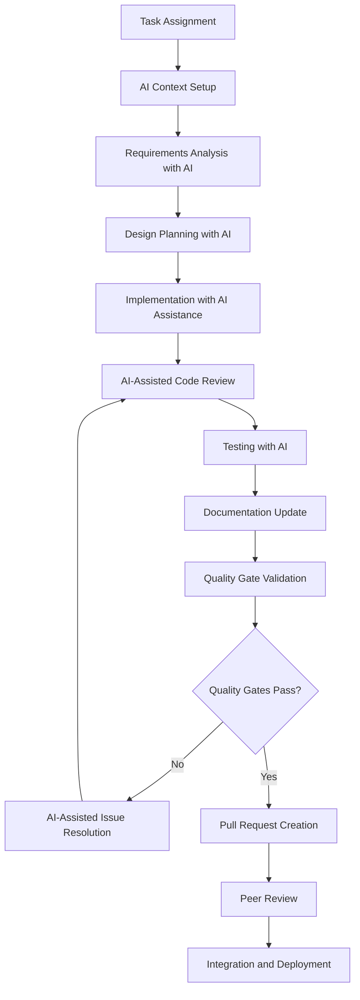

# AI-Assisted Development Workflow SOP

## Purpose
This Standard Operating Procedure (SOP) defines the step-by-step workflow for AI-assisted development using Claude Code and other AI tools within the Chat App project, ensuring consistent, high-quality development practices across the team.

## Scope
This SOP applies to all development activities including:
- Feature development and enhancements
- Bug fixes and maintenance
- Code refactoring and optimization
- Documentation updates
- Testing and quality assurance

## Prerequisites
- Active Claude Code subscription and account setup
- Development environment properly configured
- Understanding of Chat App architecture and patterns
- Familiarity with AI-assisted development principles
- Completed AI development workflow training

## Workflow Overview



## Detailed Procedures

### Phase 1: Task Initialization and AI Context Setup

#### Step 1.1: Task Assignment Review
**Duration**: 10-15 minutes
**Responsible**: Developer

1. **Review Task Details**:
   ```markdown
   - Read task description, acceptance criteria, and requirements
   - Understand business context and user impact
   - Identify technical constraints and dependencies
   - Note any specific Chat App components involved
   ```

2. **Estimate Complexity**:
   - Simple (< 4 hours): Direct implementation
   - Medium (4-16 hours): May require design planning
   - Complex (16+ hours): Requires architectural review

#### Step 1.2: Claude Code Session Initialization
**Duration**: 5-10 minutes
**Responsible**: Developer

1. **Start New Claude Code Session**:
   ```bash
   # Ensure clean working directory
   git status
   git pull origin main
   
   # Start Claude Code with project context
   claude-code --project="chat_app" --context="current_task"
   ```

2. **Provide Initial Context**:
   ```markdown
   I'm working on [Task Title] for the Chat App project.
   
   Task Details:
   - Requirement: [Brief description]
   - Acceptance Criteria: [List criteria]
   - Affected Components: [Event Bus/Plugins/Terminal Interface]
   - Estimated Complexity: [Simple/Medium/Complex]
   
   Please help me analyze this task and plan the implementation approach.
   ```

#### Step 1.3: Project Context Loading
**Duration**: 5 minutes
**Responsible**: AI + Developer Validation

1. **AI Analyzes Project Structure**:
   - Current codebase architecture
   - Recent changes and patterns
   - Related components and dependencies
   - Testing strategy requirements

2. **Developer Validates Context**:
   - Confirm AI understanding is accurate
   - Provide additional context if needed
   - Clarify any specific requirements

### Phase 2: Requirements Analysis and Planning

#### Step 2.1: AI-Assisted Requirements Analysis
**Duration**: 15-30 minutes
**Responsible**: Developer + AI

1. **Requirements Deep Dive**:
   ```markdown
   Analyze these requirements in detail:
   [Paste requirements]
   
   Consider:
   - Functional requirements
   - Non-functional requirements (performance, security, etc.)
   - Integration with EventBus system
   - Plugin compatibility requirements
   - Terminal interface considerations
   
   Identify any gaps, ambiguities, or potential issues.
   ```

2. **AI Analysis Review**:
   - Review AI-identified requirements
   - Clarify any ambiguous points
   - Validate understanding with product owner if needed
   - Document assumptions and constraints

#### Step 2.2: Technical Approach Planning
**Duration**: 20-40 minutes
**Responsible**: Developer + AI

1. **Architecture Planning**:
   ```markdown
   Based on the requirements, suggest an implementation approach for:
   
   1. Component architecture (which classes/modules to modify/create)
   2. EventBus integration pattern
   3. Plugin system considerations
   4. Data flow and state management
   5. Error handling strategy
   6. Testing approach
   
   Follow Chat App patterns:
   - Async/await for I/O operations
   - Event-driven architecture
   - Plugin-based extensibility
   - Configuration through dot notation
   ```

2. **Approach Validation**:
   - Review AI suggestions with tech lead if complex
   - Validate against Chat App architectural principles
   - Confirm non-functional requirements are addressed
   - Document chosen approach and rationale

### Phase 3: Implementation with AI Assistance

#### Step 3.1: Component Development
**Duration**: Variable based on complexity
**Responsible**: Developer + AI

1. **Iterative Development Process**:
   ```markdown
   Let's implement [Component Name] with the following approach:
   
   1. Start with the interface/contract definition
   2. Implement core functionality
   3. Add error handling and logging
   4. Integrate with EventBus
   5. Add configuration support
   6. Implement status reporting
   
   Please generate the initial structure following Chat App patterns.
   ```

2. **Code Generation Guidelines**:
   - Request AI to follow established patterns
   - Validate generated code against style guidelines
   - Ensure proper async/await usage
   - Verify EventBus integration patterns
   - Check plugin compatibility

#### Step 3.2: Incremental Implementation
**Duration**: Continuous during development
**Responsible**: Developer

1. **Small Batch Implementation**:
   - Implement one method/feature at a time
   - Test each increment before proceeding
   - Request AI assistance for complex logic
   - Validate against acceptance criteria continuously

2. **Code Quality Checks**:
   ```python
   # AI-assisted quality validation
   def validate_code_quality(code_snippet):
       """
       Ask AI to review code for:
       - Adherence to Chat App patterns
       - Error handling completeness
       - Performance considerations
       - Security best practices
       - Documentation quality
       """
   ```

#### Step 3.3: Integration Implementation
**Duration**: 30-60 minutes
**Responsible**: Developer + AI

1. **EventBus Integration**:
   ```markdown
   Help me integrate this component with the EventBus system:
   
   Component: [Component Name]
   Events to Handle: [List events]
   Events to Emit: [List events]
   
   Generate the hook registration code and event handling methods
   following the established patterns in the Chat App.
   ```

2. **Configuration Integration**:
   ```markdown
   Add configuration support for this component:
   
   Required Configuration:
   - [Configuration parameters]
   
   Use the dot notation configuration system and provide default values.
   Follow the pattern used by other Chat App components.
   ```

### Phase 4: AI-Assisted Code Review

#### Step 4.1: Self-Review with AI
**Duration**: 20-30 minutes
**Responsible**: Developer

1. **Comprehensive Code Review**:
   ```markdown
   Please review my implementation for:
   
   1. Code Quality:
      - SOLID principles adherence
      - Chat App pattern consistency
      - Error handling completeness
      - Performance considerations
   
   2. Integration Quality:
      - EventBus integration correctness
      - Configuration handling
      - Plugin compatibility
      - State management
   
   3. Security Considerations:
      - Input validation
      - Error information exposure
      - Resource cleanup
   
   4. Testing Requirements:
      - Testability of the implementation
      - Test scenarios needed
      - Mock requirements
   
   Implementation:
   [Paste code]
   ```

2. **AI Feedback Processing**:
   - Address all AI-identified issues
   - Request clarification for unclear feedback
   - Implement suggested improvements
   - Document decisions for rejected suggestions

#### Step 4.2: Code Optimization
**Duration**: 15-30 minutes
**Responsible**: Developer + AI

1. **Performance Optimization**:
   ```markdown
   Analyze this code for performance optimization opportunities:
   
   Focus Areas:
   - Async/await efficiency
   - Memory usage optimization
   - EventBus interaction efficiency
   - Terminal rendering performance impact
   
   Suggest specific improvements with code examples.
   ```

2. **Refactoring Opportunities**:
   - Identify code duplication
   - Suggest pattern improvements
   - Optimize for maintainability
   - Ensure consistent styling

### Phase 5: Testing with AI Assistance

#### Step 5.1: Test Strategy Development
**Duration**: 20-40 minutes
**Responsible**: Developer + AI

1. **Test Plan Generation**:
   ```markdown
   Generate a comprehensive test plan for:
   
   Component: [Component Name]
   Functionality: [Brief description]
   
   Include:
   1. Unit tests for core functionality
   2. Integration tests for EventBus interaction
   3. Error handling tests
   4. Performance tests
   5. Configuration tests
   
   Follow Chat App testing patterns and use unittest framework.
   ```

2. **Test Implementation**:
   - Generate test code with AI assistance
   - Validate test coverage completeness
   - Ensure async test patterns are followed
   - Add mock objects for dependencies

#### Step 5.2: Test Execution and Validation
**Duration**: 15-30 minutes
**Responsible**: Developer

1. **Automated Test Execution**:
   ```bash
   # Run comprehensive test suite
   python tests/run_tests.py
   
   # Check coverage
   coverage run -m pytest
   coverage report --show-missing
   ```

2. **Test Results Analysis**:
   - Validate all tests pass
   - Ensure coverage meets requirements (>90%)
   - Review failed tests with AI assistance
   - Update implementation based on test feedback

### Phase 6: Documentation and Quality Gates

#### Step 6.1: Documentation Update
**Duration**: 15-25 minutes
**Responsible**: Developer + AI

1. **Code Documentation**:
   ```markdown
   Generate documentation for the implemented component:
   
   Include:
   1. Class/method docstrings
   2. Usage examples
   3. Configuration options
   4. Integration points
   5. Error handling information
   
   Follow the Chat App documentation standards.
   ```

2. **User Documentation Update**:
   - Update relevant user guides
   - Add feature documentation to README
   - Update configuration documentation
   - Create troubleshooting guides if needed

#### Step 6.2: Quality Gate Validation
**Duration**: 10-15 minutes
**Responsible**: Developer

1. **Automated Quality Checks**:
   ```bash
   # Code style and quality checks
   python -m black src/
   python -m mypy src/
   python -m pylint src/
   
   # Security scanning
   python -m bandit -r src/
   ```

2. **Manual Quality Validation**:
   - Verify acceptance criteria are met
   - Confirm integration works correctly
   - Validate performance requirements
   - Check error handling robustness

### Phase 7: Pull Request and Peer Review

#### Step 7.1: Pull Request Preparation
**Duration**: 15-20 minutes
**Responsible**: Developer

1. **PR Description Generation**:
   ```markdown
   Create a detailed pull request description:
   
   Task: [Task title and ID]
   Implementation Summary: [What was implemented]
   Architecture Changes: [Any architectural impacts]
   Testing: [Testing strategy and results]
   Documentation: [Documentation updates made]
   Breaking Changes: [Any breaking changes]
   AI Assistance: [How AI tools were used]
   ```

2. **Final Validation**:
   - Ensure all commits are clean and logical
   - Verify branch is up to date with main
   - Confirm all tests pass in CI/CD
   - Review diff for any unintended changes

#### Step 7.2: Peer Review Process
**Duration**: Variable
**Responsible**: Peer Reviewer + Developer

1. **Review Guidelines for Reviewers**:
   - Focus on logic and architecture over style
   - Validate Chat App pattern adherence
   - Check integration points carefully
   - Verify test coverage and quality
   - Consider maintainability and extensibility

2. **Review Response Process**:
   - Address all reviewer comments
   - Use AI assistance for complex refactoring requests
   - Document rationale for any rejected suggestions
   - Request re-review after significant changes

## Quality Standards and Metrics

### Code Quality Requirements
- **Test Coverage**: Minimum 90% for new code
- **Documentation**: All public interfaces documented
- **Performance**: No regression in benchmarks
- **Security**: Pass all security scans
- **Style**: Pass all linting checks

### AI Assistance Metrics
- **AI Suggestion Acceptance Rate**: Track adoption of AI recommendations
- **Development Velocity**: Measure impact on story point completion
- **Code Quality**: Monitor defect rates in AI-assisted code
- **Documentation Quality**: Assess completeness of AI-generated docs

### Review Checkpoints
1. **Requirements Understanding**: Confirmed before implementation
2. **Architecture Alignment**: Validated during design phase
3. **Implementation Quality**: Verified during code review
4. **Integration Success**: Confirmed during testing
5. **Documentation Completeness**: Validated before PR submission

## Tools and Resources

### Required Tools
- **Claude Code**: Primary AI development assistant
- **Git**: Version control and collaboration
- **Python Testing Tools**: unittest, coverage, pytest
- **Code Quality Tools**: black, mypy, pylint, bandit
- **Chat App Test Suite**: Project-specific testing framework

### AI Prompts Library
- **Component Design Prompts**: Standard prompts for component creation
- **Code Review Prompts**: Comprehensive review checklists
- **Test Generation Prompts**: Testing strategy and implementation
- **Documentation Prompts**: Standard documentation formats

### Reference Materials
- **Chat App Architecture Guide**: Core architectural patterns
- **EventBus Integration Patterns**: Standard integration approaches
- **Plugin Development Guide**: Plugin creation and lifecycle
- **Configuration Management**: Configuration patterns and practices

## Troubleshooting Common Issues

### AI Context Loss
**Problem**: AI loses project context during long sessions
**Solution**: 
1. Provide context refresh every 2 hours
2. Use structured prompts with key project information
3. Reference specific Chat App patterns explicitly

### Integration Issues
**Problem**: Component doesn't integrate properly with EventBus
**Solution**:
1. Verify hook registration follows established patterns
2. Check event data structure matches expectations
3. Validate async/await usage in event handlers

### Performance Problems
**Problem**: Implementation affects terminal rendering performance
**Solution**:
1. Profile code using AI assistance
2. Optimize async operations
3. Minimize EventBus event frequency
4. Use appropriate caching strategies

## Success Criteria

### Individual Developer Success
- Consistent adherence to workflow steps
- High-quality code with minimal rework
- Effective use of AI assistance
- Timely completion of assigned tasks

### Team Success  
- Consistent code quality across team members
- Reduced development cycle time
- Improved first-time-right implementation rate
- Enhanced knowledge sharing and collaboration

### Project Success
- Faster feature delivery without quality compromise
- Reduced technical debt accumulation
- Improved system maintainability
- Enhanced developer productivity and satisfaction

---

*This SOP ensures consistent, high-quality AI-assisted development practices while maintaining the flexibility to adapt to specific task requirements and evolving AI capabilities.*