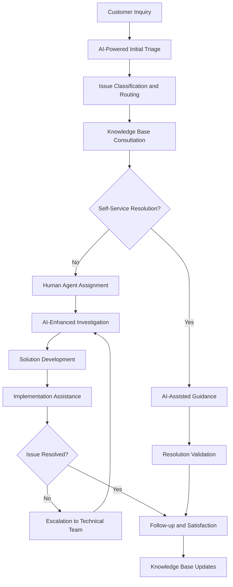

# Customer Support Procedures SOP

## Purpose
This Standard Operating Procedure (SOP) defines the comprehensive customer support framework for the Chat App project, ensuring exceptional user experience through AI-enhanced support processes, proactive issue resolution, and continuous service improvement while maintaining high satisfaction and retention rates.

## Scope
This SOP applies to all customer support activities including:
- Technical support and troubleshooting assistance
- User onboarding and feature guidance
- Bug reporting and issue escalation
- Feature requests and product feedback management
- Plugin ecosystem support and troubleshooting
- Performance optimization assistance

## Prerequisites
- Customer support platform access and training
- Understanding of Chat App architecture and user workflows
- Familiarity with AI-assisted support tools and knowledge bases
- Completed customer service excellence training
- Access to development team escalation channels

## Customer Support Overview



## Support Tier Classification

| Tier | Description | Response Time | Resolution Target | Escalation Path |
|------|-------------|---------------|-------------------|-----------------|
| **L1 - First Contact** | General inquiries, basic troubleshooting | 1 hour | 4 hours | L2 Technical Support |
| **L2 - Technical Support** | Complex technical issues, plugin problems | 2 hours | 8 hours | L3 Engineering |
| **L3 - Engineering** | Architecture issues, bug fixes, development | 4 hours | 24 hours | Product/Engineering Leadership |
| **L4 - Escalation** | Critical issues, architectural changes | 1 hour | Varies | Executive/Leadership Team |

## Detailed Procedures

### Phase 1: Customer Contact and Initial Assessment

#### Step 1.1: Customer Inquiry Reception
**Duration**: 1-5 minutes (automated + manual)
**Responsible**: Support System + AI Triage

1. **Automated Inquiry Processing**:
   ```yaml
   # AI-powered inquiry classification
   inquiry_classification:
     channels:
       - email_support: automated_parsing_and_routing
       - chat_support: real_time_ai_assistance
       - github_issues: technical_classification
       - community_forum: automated_monitoring
     
     classification_criteria:
       - urgency_level: [low, medium, high, critical]
       - category: [technical, feature, bug, documentation]
       - complexity: [simple, moderate, complex, architectural]
       - user_type: [new, experienced, developer, enterprise]
   ```

2. **AI-Enhanced Initial Triage**:
   ```markdown
   Analyze customer inquiry using AI assistance:
   
   Customer Message: [Original inquiry text]
   User Profile: [Account info, usage history, technical level]
   Context: [Recent user activity, system interactions]
   
   Generate:
   1. Issue classification and severity assessment
   2. Suggested resolution pathway
   3. Required expertise identification
   4. Estimated resolution timeframe
   5. Proactive communication recommendations
   
   Consider Chat App specific components: Terminal Interface, Plugin System, EventBus, Configuration
   ```

#### Step 1.2: Customer Information Gathering
**Duration**: 5-15 minutes
**Responsible**: Support Agent + AI Assistant

1. **Comprehensive Information Collection**:
   ```markdown
   Gather detailed information about the customer's situation:
   
   Technical Environment:
   - Operating system and version
   - Python version and environment setup
   - Chat App version and configuration
   - Plugin versions and enabled plugins
   - Terminal environment and settings
   
   Issue Details:
   - Specific problem description
   - Steps to reproduce the issue
   - Expected vs. actual behavior
   - Error messages and logs
   - Timeline and frequency of occurrence
   
   User Context:
   - Experience level with Chat App
   - Recent changes or updates
   - Business impact and urgency
   - Previous troubleshooting attempts
   
   Use AI to suggest additional diagnostic questions based on initial assessment.
   ```

2. **Automated Environment Analysis**:
   ```bash
   # AI-assisted environment analysis
   chat-app-diagnostics --customer-support --anonymized
   
   # Generate support bundle
   ./scripts/generate_support_bundle.sh --privacy-safe
   
   # AI analysis of provided information
   ai-support-analyzer --customer-data --suggest-solutions
   ```

#### Step 1.3: Issue Classification and Routing
**Duration**: 5-10 minutes
**Responsible**: AI System + Support Manager

1. **Intelligent Issue Routing**:
   ```python
   def route_customer_issue(issue_data, customer_profile):
       """
       AI-powered issue routing logic:
       - Analyze issue complexity and required expertise
       - Consider customer priority and service level
       - Match with available agent skills and capacity
       - Predict resolution time and resource requirements
       - Generate routing recommendation with confidence score
       """
   ```

2. **Routing Decision Validation**:
   ```markdown
   Validate AI routing decision:
   
   Recommended Routing: [Support tier and specific agent]
   Rationale: [AI reasoning for routing decision]
   
   Validation Checks:
   1. Agent availability and capacity
   2. Skills match with issue requirements
   3. Customer service level alignment
   4. Escalation pathway clarity
   5. Resource allocation optimization
   
   Adjust routing if necessary based on current team status and priorities.
   ```

### Phase 2: Knowledge Base and Self-Service Resolution

#### Step 2.1: AI-Enhanced Knowledge Base Search
**Duration**: 2-10 minutes
**Responsible**: AI System + Customer/Support Agent

1. **Intelligent Content Matching**:
   ```markdown
   Search knowledge base using AI-powered semantic matching:
   
   Query: [Customer's issue description]
   Context: [Technical environment and user profile]
   
   Search Strategy:
   1. Exact match search for known issues
   2. Semantic similarity matching
   3. Symptom-based problem identification
   4. Component-specific troubleshooting guides
   5. Related issue and solution clustering
   
   Focus on Chat App specific content:
   - Terminal interface configuration and troubleshooting
   - Plugin installation and compatibility issues
   - EventBus performance and debugging
   - Configuration management problems
   - Performance optimization guides
   ```

2. **Solution Relevance Scoring**:
   ```python
   def score_solution_relevance(customer_issue, knowledge_base_articles):
       """
       AI-powered solution scoring:
       - Match issue symptoms with documented solutions
       - Consider customer environment compatibility
       - Assess solution complexity vs. user technical level
       - Score based on historical success rates
       - Rank solutions by likelihood of resolution
       """
   ```

#### Step 2.2: Self-Service Guidance and Validation
**Duration**: 10-30 minutes (customer self-service)
**Responsible**: Customer + AI Guidance System

1. **Interactive Troubleshooting Assistant**:
   ```markdown
   Provide AI-guided self-service resolution:
   
   Issue: [Specific problem identified]
   User Level: [Technical proficiency assessment]
   
   Generate Step-by-Step Guidance:
   1. Problem confirmation and validation
   2. Safety checks and backup recommendations
   3. Progressive troubleshooting steps
   4. Validation checkpoints after each step
   5. Success criteria and testing procedures
   
   Include Chat App specific guidance:
   - Configuration file validation and repair
   - Plugin troubleshooting and isolation
   - EventBus debugging and monitoring
   - Performance profiling and optimization
   ```

2. **Self-Service Success Validation**:
   ```bash
   # Customer-run validation scripts
   python support/validate_resolution.py --issue-id="ISSUE_123"
   
   # AI-powered resolution confirmation
   ai-resolution-validator --customer-feedback --system-state
   ```

#### Step 2.3: Escalation to Human Support
**Duration**: 5-15 minutes
**Responsible**: Support Agent + AI Assistant

1. **Human Agent Handoff Process**:
   ```markdown
   Transfer to human support with complete context:
   
   Handoff Package:
   1. Complete customer interaction history
   2. Technical environment and diagnostic data
   3. Self-service attempts and results
   4. AI recommendations and confidence scores
   5. Suggested next steps and escalation path
   
   Agent Briefing:
   - Customer background and service level
   - Issue complexity and technical requirements
   - Previous communication tone and preferences
   - Time sensitivity and business impact
   - Available resources and expert contacts
   ```

### Phase 3: Technical Investigation and Resolution

#### Step 3.1: Deep Technical Analysis
**Duration**: 20-90 minutes
**Responsible**: Technical Support Agent + AI Tools

1. **AI-Assisted Problem Diagnosis**:
   ```markdown
   Conduct comprehensive technical analysis:
   
   Diagnostic Areas:
   1. Chat App Architecture Analysis:
      - EventBus message flow and processing
      - Plugin loading and execution lifecycle
      - Terminal rendering and user interaction
      - Configuration parsing and validation
      - State management and persistence
   
   2. Environment Investigation:
      - System resource utilization patterns
      - Network connectivity and performance
      - Python environment and dependencies
      - File system permissions and access
      - Integration with external tools
   
   3. Log Analysis:
      - Error patterns and frequency analysis
      - Performance bottleneck identification
      - Security event correlation
      - User interaction pattern analysis
      - System behavior anomaly detection
   
   Use AI to correlate symptoms with known patterns and suggest diagnostic approaches.
   ```

2. **Root Cause Identification**:
   ```python
   def identify_root_cause(symptoms, environment, logs):
       """
       AI-powered root cause analysis:
       - Pattern matching against known issues database
       - Correlation analysis across multiple data sources
       - Hypothesis generation and validation
       - Solution pathway recommendation
       - Confidence scoring and alternative explanations
       """
   ```

#### Step 3.2: Solution Development and Testing
**Duration**: 30-120 minutes
**Responsible**: Technical Support Agent + Development Team (if needed)

1. **Solution Design and Validation**:
   ```markdown
   Develop comprehensive solution approach:
   
   Root Cause: [Identified underlying issue]
   Solution Strategy:
   1. Immediate workaround (if available)
   2. Proper fix implementation
   3. Prevention measures
   4. Testing and validation approach
   5. Rollback plan if needed
   
   Chat App Integration Considerations:
   - Impact on existing user configuration
   - Plugin compatibility and dependencies
   - EventBus performance implications
   - Terminal interface user experience
   - State migration and data integrity
   
   Use AI to predict solution effectiveness and potential side effects.
   ```

2. **Solution Testing in Safe Environment**:
   ```bash
   # Create isolated test environment
   ./scripts/create_test_environment.sh --customer-config
   
   # Test solution implementation
   python tests/customer_solution_tests.py --issue-specific
   
   # AI-powered solution validation
   ai-solution-tester --simulate-customer-environment
   ```

#### Step 3.3: Customer Solution Implementation
**Duration**: 15-60 minutes
**Responsible**: Support Agent + Customer

1. **Guided Implementation Process**:
   ```markdown
   Provide step-by-step implementation guidance:
   
   Pre-Implementation:
   1. Backup current configuration and state
   2. Validate system prerequisites
   3. Confirm customer availability and timeline
   4. Set up communication channel for real-time support
   
   Implementation Steps:
   [Detailed, tested steps with validation points]
   
   Post-Implementation:
   1. Comprehensive functionality testing
   2. Performance validation
   3. User experience confirmation
   4. Documentation updates
   5. Follow-up scheduling
   
   Use AI to adapt instructions to customer's technical level and environment.
   ```

2. **Real-Time Implementation Support**:
   ```python
   def provide_implementation_support(customer_context, implementation_stage):
       """
       AI-enhanced real-time support:
       - Monitor implementation progress
       - Predict potential issues before they occur
       - Provide contextual guidance and tips
       - Suggest optimizations and improvements
       - Generate troubleshooting advice for unexpected issues
       """
   ```

### Phase 4: Escalation and Expert Consultation

#### Step 4.1: Technical Escalation Process
**Duration**: 15-30 minutes
**Responsible**: Support Manager + Technical Lead

1. **Escalation Criteria Assessment**:
   ```markdown
   Evaluate need for technical escalation:
   
   Escalation Triggers:
   1. Issue requires code changes or bug fixes
   2. Architectural understanding needed
   3. Performance optimization beyond standard troubleshooting
   4. Plugin ecosystem compatibility issues
   5. Security implications identified
   6. Customer resolution time exceeding SLA
   
   Escalation Package:
   - Complete technical analysis and findings
   - Customer impact assessment
   - Attempted solutions and results
   - Required expertise and resources
   - Timeline and priority considerations
   
   Use AI to assess escalation urgency and resource requirements.
   ```

2. **Expert Team Mobilization**:
   ```python
   def mobilize_expert_team(escalation_data):
       """
       AI-assisted expert team assembly:
       - Identify required expertise areas
       - Match with available team member skills
       - Consider customer priority and service level
       - Coordinate schedules and availability
       - Generate expert briefing materials
       """
   ```

#### Step 4.2: Engineering Team Collaboration
**Duration**: 60-240 minutes (varies by complexity)
**Responsible**: Development Team + Support Team + AI

1. **Technical Deep Dive and Analysis**:
   ```markdown
   Conduct engineering-level investigation:
   
   Analysis Areas:
   1. Code-level investigation and debugging
   2. Architecture review and optimization opportunities
   3. Performance profiling and bottleneck identification
   4. Security assessment and vulnerability analysis
   5. Compatibility testing across environments
   
   Chat App Specific Focus:
   - EventBus architecture and message flow optimization
   - Plugin system isolation and security boundaries
   - Terminal interface rendering and user experience
   - Configuration system flexibility and validation
   - State management and data persistence integrity
   
   Use AI to accelerate code analysis and solution development.
   ```

2. **Solution Development and Integration**:
   ```bash
   # Development environment setup for customer issue
   git checkout -b customer-issue-ISSUE_123
   
   # AI-assisted code development
   ai-code-assistant --customer-issue --context="production-environment"
   
   # Testing with customer-specific scenarios
   python tests/customer_specific_tests.py --issue-id="ISSUE_123"
   ```

#### Step 4.3: Solution Delivery and Validation
**Duration**: 30-90 minutes
**Responsible**: Technical Lead + Support Team

1. **Customer Solution Delivery**:
   ```markdown
   Deliver engineered solution to customer:
   
   Solution Package:
   1. Root cause explanation (appropriate technical level)
   2. Solution implementation (code, configuration, or process)
   3. Installation and deployment instructions
   4. Testing and validation procedures
   5. Future prevention recommendations
   
   Delivery Methods:
   - Hotfix or patch delivery
   - Configuration updates
   - Workaround procedures
   - Feature enhancement timeline
   
   Ensure solution aligns with customer environment and constraints.
   ```

2. **Solution Effectiveness Monitoring**:
   ```python
   def monitor_solution_effectiveness(customer_id, solution_id):
       """
       AI-powered solution monitoring:
       - Track customer system behavior post-implementation
       - Monitor for issue recurrence or related problems
       - Measure performance impact and user satisfaction
       - Generate proactive recommendations for optimization
       - Alert for any degradation or new issues
       """
   ```

### Phase 5: Follow-up and Continuous Improvement

#### Step 5.1: Customer Satisfaction and Follow-up
**Duration**: 15-30 minutes
**Responsible**: Support Agent + Customer Success

1. **Satisfaction Assessment and Feedback**:
   ```markdown
   Conduct comprehensive satisfaction evaluation:
   
   Feedback Areas:
   1. Issue resolution effectiveness
   2. Support team responsiveness and expertise
   3. Communication quality and clarity
   4. Resolution timeline satisfaction
   5. Overall support experience rating
   
   Additional Insights:
   - Areas for improvement identification
   - Feature requests or enhancement suggestions
   - Documentation gaps or unclear procedures
   - Training or educational content needs
   
   Use AI to analyze feedback patterns and identify improvement opportunities.
   ```

2. **Proactive Follow-up Process**:
   ```python
   def schedule_proactive_followup(customer_data, issue_resolution):
       """
       AI-driven follow-up scheduling:
       - Determine optimal follow-up timeline
       - Identify potential future issues
       - Generate health check recommendations
       - Schedule educational content delivery
       - Plan proactive outreach for related features
       """
   ```

#### Step 5.2: Knowledge Base and Documentation Updates
**Duration**: 20-45 minutes
**Responsible**: Support Team + Technical Writer + AI

1. **Knowledge Capture and Documentation**:
   ```markdown
   Update knowledge base with new insights:
   
   Documentation Updates:
   1. New troubleshooting procedures and solutions
   2. Common issue patterns and resolutions
   3. Environment-specific configuration guides
   4. Performance optimization recommendations
   5. Integration guides for common scenarios
   
   Chat App Specific Content:
   - Plugin troubleshooting and compatibility matrices
   - EventBus configuration and performance tuning
   - Terminal interface customization guides
   - Configuration management best practices
   
   Use AI to generate comprehensive documentation from support interactions.
   ```

2. **Searchability and Accessibility Improvement**:
   ```python
   def improve_knowledge_base_effectiveness(new_content, user_queries):
       """
       AI-enhanced knowledge base optimization:
       - Generate SEO-friendly titles and descriptions
       - Create semantic tags and categories
       - Identify content gaps and overlaps
       - Generate related content suggestions
       - Optimize search ranking and relevance
       """
   ```

#### Step 5.3: Product Improvement and Feature Requests
**Duration**: 30-60 minutes
**Responsible**: Product Management + Development Team

1. **Product Enhancement Identification**:
   ```markdown
   Analyze support patterns for product improvements:
   
   Analysis Areas:
   1. Recurring customer issues and pain points
   2. Feature gaps and enhancement opportunities
   3. Usability improvements and user experience optimization
   4. Documentation and onboarding improvements
   5. Integration and compatibility enhancements
   
   Chat App Improvement Opportunities:
   - Plugin ecosystem expansion and improvement
   - EventBus performance and scalability enhancements
   - Terminal interface user experience optimization
   - Configuration simplification and validation
   - Error messaging and troubleshooting improvement
   
   Generate prioritized product enhancement roadmap.
   ```

2. **Customer-Driven Development Planning**:
   ```python
   def prioritize_customer_driven_features(support_data, customer_feedback):
       """
       AI-assisted feature prioritization:
       - Analyze customer pain points and frequency
       - Assess business impact and customer satisfaction potential
       - Evaluate development effort and resource requirements
       - Consider strategic alignment and technical feasibility
       - Generate prioritized development recommendations
       """
   ```

## Quality Standards and Metrics

### Customer Support Performance
- **Response Time**: First response within SLA by support tier
- **Resolution Time**: Issue resolution within target timeframes
- **Customer Satisfaction**: CSAT score > 4.5/5.0, NPS > 50
- **First Contact Resolution**: >70% of issues resolved without escalation

### AI Enhancement Metrics
- **AI Accuracy**: Accuracy of AI triage and routing decisions >90%
- **Self-Service Success**: Percentage of issues resolved through AI-guided self-service
- **Knowledge Base Effectiveness**: Success rate of AI-recommended solutions
- **Agent Productivity**: Impact of AI assistance on resolution time and quality

### Support Quality Indicators
1. **Issue Resolution Quality**: Customer validation of solution effectiveness
2. **Communication Excellence**: Clarity, empathy, and professionalism in interactions
3. **Technical Accuracy**: Correctness of technical guidance and solutions
4. **Knowledge Transfer**: Effectiveness of customer education and empowerment

## Tools and Resources

### Required Support Tools
- **Ticketing System**: AI-enhanced support ticket management and routing
- **Knowledge Base**: Searchable documentation with AI-powered recommendations
- **Communication**: Multi-channel support with AI transcription and analysis
- **Diagnostics**: Chat App diagnostic tools and automated environment analysis
- **Collaboration**: Integration with development tools and escalation systems

### AI-Powered Support Tools
- **Intelligent Triage**: Automated issue classification and routing
- **Solution Assistant**: AI-powered troubleshooting guidance and recommendations
- **Knowledge Mining**: Automated knowledge extraction from support interactions
- **Sentiment Analysis**: Customer satisfaction and emotional state monitoring

### Chat App Specific Resources
- **Diagnostic Scripts**: Automated environment analysis and health checking
- **Configuration Validators**: Automated configuration testing and validation
- **Plugin Troubleshooting**: Plugin-specific diagnostic and resolution tools
- **Performance Analyzers**: EventBus and terminal interface performance monitoring

## Troubleshooting Common Issues

### AI Triage Misclassification
**Problem**: AI incorrectly classifies or routes customer issues
**Solution**:
1. Review and adjust AI training data based on misclassification patterns
2. Implement human validation checkpoint for borderline classifications
3. Continuously refine classification criteria and routing algorithms
4. Provide feedback loop for AI model improvement

### Knowledge Base Content Gaps
**Problem**: Customers unable to find relevant self-service solutions
**Solution**:
1. Analyze search patterns and failed resolution attempts
2. Identify content gaps and create targeted documentation
3. Improve content discoverability with better tagging and categorization
4. Implement proactive content creation based on support trends

### Escalation Communication Breakdown
**Problem**: Information loss during escalation between support tiers
**Solution**:
1. Standardize escalation documentation templates and procedures
2. Implement comprehensive context transfer with AI assistance
3. Establish clear handoff protocols and validation checkpoints
4. Provide escalation training and communication best practices

### Customer Expectation Misalignment
**Problem**: Customer expectations don't match realistic resolution timelines
**Solution**:
1. Improve upfront communication about issue complexity and timelines
2. Provide regular status updates and progress communication
3. Educate customers about Chat App architecture and constraints
4. Set realistic expectations while striving for exceptional service

## Success Criteria

### Individual Agent Success
- Consistent achievement of response and resolution SLA targets
- High customer satisfaction scores and positive feedback
- Effective use of AI tools and knowledge resources
- Continuous learning and skill development in Chat App expertise

### Team Support Success
- Coordinated escalation and collaboration across support tiers
- Knowledge sharing and continuous improvement culture
- Consistent service quality across all customer interactions
- Proactive identification and resolution of systemic issues

### Customer Success Outcomes
- High overall customer satisfaction and loyalty metrics
- Reduced customer effort and improved self-service success
- Faster resolution times and improved first-contact resolution
- Enhanced customer confidence and Chat App adoption

### Product Improvement Success
- Customer-driven feature development and enhancement
- Reduced support volume through proactive product improvements
- Enhanced user experience and reduced complexity
- Stronger customer relationships and community engagement

---

*This SOP ensures exceptional customer support through AI-enhanced processes while building lasting customer relationships and driving continuous product improvement.*