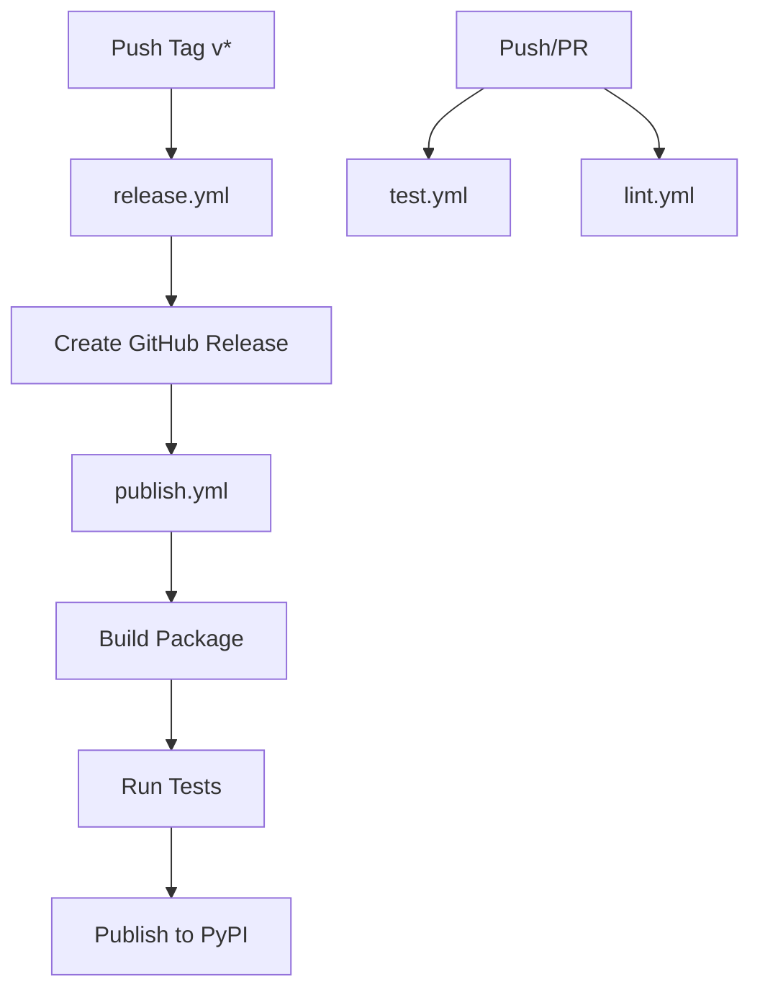

# GitHub Actions Workflows

This directory contains CI/CD workflows for Kube AuthKit.

## Workflows Overview

### 1. `publish.yml` - PyPI Publishing
**Triggers**: 
- Automatically on GitHub release creation
- Manually via workflow dispatch

**What it does**:
- Builds the Python package
- Runs full test suite
- Publishes to PyPI using Trusted Publishing (no tokens needed!)
- Optional: Publish to TestPyPI for testing

**Requirements**:
- PyPI Trusted Publishing configured (see [PUBLISHING.md](../../PUBLISHING.md))
- GitHub environment: `pypi`

### 2. `test.yml` - Automated Testing
**Triggers**:
- Push to main, feat/*, fix/* branches
- Pull requests to main
- Manual dispatch

**What it does**:
- Runs tests on multiple Python versions (3.10, 3.11, 3.12)
- Tests on multiple OS (Ubuntu, macOS)
- Separates unit and integration tests
- Generates coverage reports
- Uploads coverage to Codecov
- Tests with minimum supported dependency versions

**Coverage Threshold**: 70%

### 3. `lint.yml` - Code Quality
**Triggers**:
- Push to main, feat/*, fix/* branches
- Pull requests to main
- Manual dispatch

**What it does**:
- **Ruff**: Linting and format checking
- **mypy**: Type checking
- **Bandit**: Security scanning
- **Black**: Format verification
- **pip-audit**: Dependency vulnerability scanning

### 4. `release.yml` - GitHub Releases
**Triggers**:
- Push of version tags (v*.*.*)

**What it does**:
- Automatically creates GitHub release
- Generates changelog from commits
- Marks pre-releases (alpha, beta, rc) appropriately

## Workflow Dependencies



## Quick Reference

### Run Tests Locally
```bash
pytest tests/ --cov=src/kube_authkit
```

### Run Linters Locally
```bash
ruff check src/ tests/
black --check src/ tests/
mypy src/kube_authkit
bandit -r src/kube_authkit
```

### Trigger Manual Publish to TestPyPI
1. Go to Actions → "Publish to PyPI"
2. Click "Run workflow"
3. Check "Publish to Test PyPI"
4. Run workflow

### Create a Release
```bash
# Update version in pyproject.toml
git add pyproject.toml
git commit -m "Bump version to 0.2.0"
git push

# Create and push tag
git tag v0.2.0
git push origin v0.2.0

# GitHub Actions will:
# 1. Create release (release.yml)
# 2. Publish to PyPI (publish.yml)
```

## Status Badges

Add these to your README.md:

```markdown


```

## Troubleshooting

### Publish Workflow Fails
- Check PyPI Trusted Publishing is configured
- Verify environment name is exactly `pypi`
- Ensure workflow name matches in PyPI settings

### Tests Fail
- Run tests locally first
- Check for OS-specific issues
- Review test logs in Actions tab

### Coverage Drop
- Add tests for new code
- Check `--cov-fail-under=70` threshold
- Review coverage report

## Security

- **Secrets**: No API tokens stored in repository
- **Trusted Publishing**: Uses OIDC for secure PyPI publishing
- **Dependency Scanning**: Automated with pip-audit
- **Security Scanning**: Automated with Bandit

## Resources

- [GitHub Actions Documentation](https://docs.github.com/en/actions)
- [PyPI Trusted Publishing](https://docs.pypi.org/trusted-publishers/)
- [Contributing Guide](../../CONTRIBUTING.md)
- [Publishing Guide](../../PUBLISHING.md)
