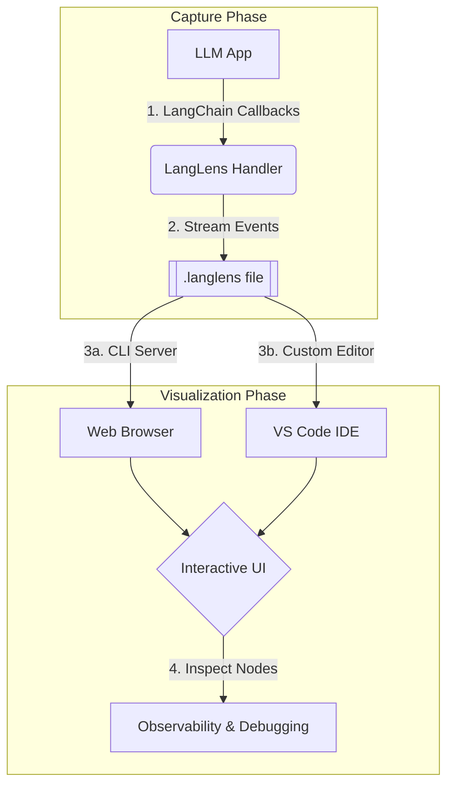

<p align="center">
  
</p>

# LangLens

**Node-Level Observability for LangChain and LangGraph.**

LangLens is a lightweight visual tracer and debugger designed specifically for LLM-powered applications. It captures detailed execution logs from your agents and chains, allowing you to inspect every LLM call, tool execution, and state transition with precision.


---

## ✨ Features

- 🔍 **Interactive Trace Viewer**: Explore complex workflows through a rich graphical interface.
- 🧩 **Node-Level Granularity**: Deep dive into individual chain runs, LLM inputs/outputs, and tool executions.
- 💻 **VS Code Extension**: Debug your traces directly inside VS Code with a custom editor experience.
- 🚀 **CLI Tool**: Quickly host a local viewer for any `.langlens` file.
- 🔌 **Seamless Integration**: Add observability to your existing projects with a single line of code.

---

## 🏗️ How it Works

LangLens bridges the gap between your LLM execution and visual debugging:



1. **Capture**: The `LangLensCallbackHandler` hooks into LangChain's event system to record starts, ends, and errors of every chain, tool, and LLM call.
2. **Storage**: Events are serialized and saved into a `.langlens` file (JSONL format), providing a portable trace of the entire execution.
3. **Visualization**:
   - The **CLI Tool** launches a local Python server that hosts a Svelte-based frontend.
   - The **VS Code Extension** registers as a custom editor for `.langlens` files, embedding the same Svelte UI directly into your workspace.
4. **Debugging**: Use the interactive graph to navigate complex agentic workflows and inspect raw inputs/outputs at any level of the tree.

---

## 📦 Installation

### Python Package

Install LangLens via pip:

```bash
pip install langlens
```

### VS Code Extension

Install the **LangLens Viewer** from the [VS Code Marketplace](https://marketplace.visualstudio.com/items?itemName=viet-the-le.langlens-viewer).

## 🚀 Quick Start

### 1. Integrate the Callback

Add the `LangLensCallbackHandler` to your LangChain or LangGraph execution config.

```python
from langlens import LangLensCallbackHandler
from langchain_openai import ChatOpenAI

# Initialize the handler (creates a logs.langlens file)
handler = LangLensCallbackHandler(filename="logs.langlens")

# Attach it to your run
llm = ChatOpenAI()
config = {"callbacks": [handler]}
response = llm.invoke("How does a sunrise look from Mars?", config=config)
```

### 2. Visualize the Trace

#### Option A: Using the CLI

Run the following command to start a local server and open the viewer in your browser:

```bash
langlens visualize logs.langlens
```

#### Option B: Using VS Code

Simply open any `.langlens` file. The **LangLens Viewer** will automatically render the interactive trace.

## 🛠️ Development

### Local Setup

1. **Build the Web UI**: This bundles the Svelte app and copies assets to the Python and VS Code extension folders.

   ```bash
   ./build_ui.sh
   ```

2. **Install Python Package** (Editable mode):

   ```bash
   pip install -e .
   ```

3. **VS Code Extension**:
   - Open the `vscode-extension` folder in VS Code.
   - Run `pnpm install`.
   - Press `F5` to start the Extension Development Host.

### Packaging

To build distribution packages manually:

```bash
./scripts/package.sh
```

---

## 📄 License

This project is licensed under the MIT License.
