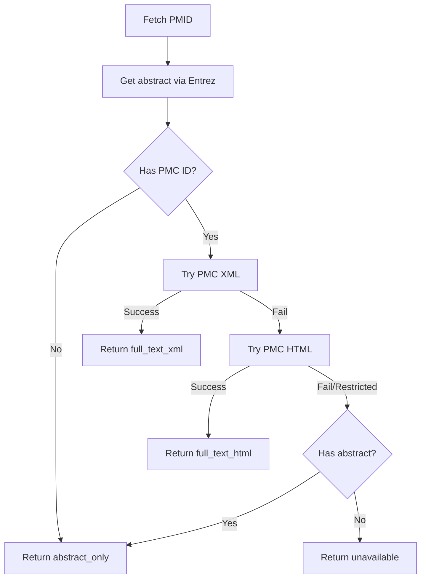

# Content Types

When fetching references, the validator tracks what type of content was retrieved using the `content_type` field. This is important because validation reliability depends on having access to the right content - an excerpt from a paper's Methods section won't be found if only the abstract is available.

## Content Type Values

| Value | Source(s) | Description |
|-------|-----------|-------------|
| `full_text_xml` | PMID (via PMC) | Full text retrieved from PubMed Central as XML |
| `full_text_html` | PMID (via PMC) | Full text retrieved from PubMed Central as HTML (fallback) |
| `abstract_only` | PMID, DOI | Only the abstract was available |
| `summary` | GEO, BioProject, BioSample, ClinicalTrials | Database summary/description field |
| `local_file` | file: | Content read from local filesystem |
| `url` | url: | Content fetched from web URL |
| `unavailable` | Any | No content could be retrieved |

### Internal Values (not typically seen by users)

| Value | Meaning |
|-------|---------|
| `no_pmc` | PMID has no corresponding PMC ID |
| `pmc_restricted` | PMC entry exists but content is restricted |
| `unknown` | Default value (content type not determined) |

## How Content Type Affects Validation

### Full Text Available (`full_text_xml`, `full_text_html`)

When full text is available, validation is most reliable. The content includes:

- Abstract
- Introduction
- Methods
- Results
- Discussion
- References

Excerpts from any section can be validated.

### Abstract Only (`abstract_only`)

When only the abstract is available:

- Validation works for text from the abstract
- **Validation will fail for excerpts from other sections**
- Error messages note this limitation: `(note: only abstract available for PMID:nnn, full text may contain this excerpt)`

This is common for PMIDs without open-access PMC versions.

### Summary (`summary`)

For database records (GEO, BioProject, etc.), the "summary" or "description" field is used. This is typically a brief description, not a full publication.

### Unavailable (`unavailable`)

No content was retrieved. Validation will fail with a clear error message.

## PMID Full Text Cascade

For PMID references, the validator automatically attempts to get the best content available:



When full text is retrieved, it's **concatenated with the abstract** to provide maximum coverage.

## Checking Content Type

### In Cache Files

Cached references store content type in YAML frontmatter:

```yaml
---
reference_id: PMID:16888623
title: Example Article
content_type: abstract_only
---
```

### Via CLI

```bash
linkml-reference-validator cache show PMID:16888623
```

Output includes:
```
Content type: abstract_only
```

### In Validation Results

When validation fails and only abstract was available, the error message includes context:

```
Text part not found as substring: 'excerpt from methods section'
(note: only abstract available for PMID:16888623, full text may contain this excerpt)
```

## Strategies When Full Text Unavailable

If validation fails due to abstract-only content:

1. **Check for PMC version**: Search [PubMed Central](https://www.ncbi.nlm.nih.gov/pmc/) for the article - if available, use `PMC:` prefix instead of `PMID:`

2. **Use local file**: If you have the PDF/text, save as markdown and reference with `file:./path/to/paper.md`

3. **Use URL**: If the full text is freely available online, use `url:https://...`

4. **Remove the excerpt**: If the excerpt can't be verified, consider removing it from your data

5. **Accept the limitation**: Document that certain excerpts couldn't be verified due to access limitations

See [Using Local Files and URLs](../how-to/use-local-files-and-urls.md) for detailed guidance on alternatives.
