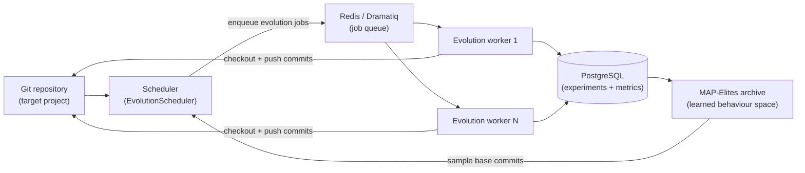

# Loreley


> Whole-repository Quality-Diversity optimization for real git codebases.

Loreley is an automated Quality-Diversity optimization system that **evolves entire git repositories**, not just single files or scripts. It continuously samples promising commits, asks external agents to plan and implement changes, evaluates them, and archives the best-performing and most diverse variants for later reuse.

Use this page as a high-level overview and a navigation hub into the focused module guides under `loreley/` and `script/` (see the sidebar navigation).

---

## Challenges and core ideas

Loreley is built around three core ideas, each designed to address a concrete challenge in real-world code evolution:

| Challenge in real repositories | Loreley core idea |
| --- | --- |
| Single-file evolution cannot express cross-module refactors and production changes | **Whole-repo evolution** |
| Hand-crafted behaviour descriptors do not generalise across projects | **Learned behaviour space** |
| Demo-style pipelines do not scale to distributed, long-running operation | **Production-grade distributed loop** |

Related systems include [AlphaEvolve](https://deepmind.google/blog/alphaevolve-a-gemini-powered-coding-agent-for-designing-advanced-algorithms/), [OpenEvolve](https://github.com/algorithmicsuperintelligence/openevolve), and [ShinkaEvolve](https://github.com/SakanaAI/ShinkaEvolve).

---

## Methodology

Loreley treats software evolution as **quality-diversity search over the commit graph of a real repository**, guided by a learned behaviour space and driven by a production-grade distributed loop. Instead of using LLMs as one-shot patch generators, it organises planning, editing, evaluation, and archiving into a repeatable system that can safely explore improvements while remaining auditable (git), testable (evaluator), and operable (scheduler + workers).

---

## System overview

At a high level, Loreley sits between your git repository, a pool of LLM-based agents, and a MAP-Elites archive:



- **Scheduler** keeps the experiment in sync with the repository, ingests completed jobs, samples new base commits from the MAP-Elites archive, and enqueues evolution jobs.
- **Workers** check out base commits, call external planning/coding/evaluation agents, create new commits, and persist metrics.
- **Archive** stores a diverse set of high-performing commits in a learned behaviour space that the scheduler uses to inspire the next round of jobs.

---

## Quick start

### Requirements

- Python 3.11+
- [`uv`](https://github.com/astral-sh/uv) for dependency management
- PostgreSQL and Redis
- Git (including worktrees; LFS optional)

### Install dependencies

```bash
git clone <YOUR_FORK_OR_ORIGIN_URL> loreley
cd loreley
uv sync
```

### Start PostgreSQL + Redis (recommended for local dev)

If you have Docker installed, you can start the required services with:

```bash
docker compose up -d postgres redis
```

### Configure

All runtime configuration is provided via environment variables and loaded by `loreley.config.Settings`. Start with:

Copy the example env file:

```bash
cp env.example .env
```

- `APP_NAME`, `APP_ENV`, `LOG_LEVEL`
- `DATABASE_URL`
- `TASKS_REDIS_URL`, `TASKS_QUEUE_NAME` (queue prefix), `WORKER_EXPERIMENT_ID`
- `OPENAI_API_KEY`
- `MAPELITES_EXPERIMENT_ROOT_COMMIT`
- `SCHEDULER_REPO_ROOT`, `WORKER_REPO_REMOTE_URL`
- `WORKER_EVOLUTION_GLOBAL_GOAL`, `WORKER_EVALUATOR_PLUGIN`

See: [Configuration](loreley/config.md)

### Run

Preflight checks:

```bash
uv run loreley doctor --role all
```

Note: on first start the scheduler performs a repo-state root scan at `MAPELITES_EXPERIMENT_ROOT_COMMIT` and requires operator approval. In non-interactive environments, pass `--yes` or set `SCHEDULER_STARTUP_APPROVE=true`.

```bash
uv run loreley scheduler
uv run loreley worker --experiment-id <EXPERIMENT_UUID>
```

See: [Running the scheduler](script/run_scheduler.md), [Running the worker](script/run_worker.md)

---

## Core ideas in practice

### Whole-repo evolution

Whole-repo evolution makes the **git commit** the fundamental unit of search. This solves the practical limitation of single-file optimisation: real improvements often require changing multiple modules, updating configs and build scripts, and keeping tests and tooling intact.

Repository-scale evolution has been demonstrated in the literature (for example, [SATLUTION](https://arxiv.org/pdf/2509.07367)), but many repository-scale loops are champion-based and rulebase-driven: a single “current best” becomes the next baseline, and extensive human-authored rules are used to keep the agent on track. This design can limit diversity and makes quality-diversity methods difficult to realise.


Loreley is designed to be **QD-native at repository scale**:

- it keeps a MAP-Elites archive of **multiple elites** across behavioural niches (not a single champion line),
- it samples from those niches as inspirations for new jobs,
- and it uses evaluator gates + repository semantics as the primary source of constraints, minimising dependence on domain-specific rulebases.

### Learned behaviour space

Quality-diversity methods require a behaviour space. Hand-crafted behaviour descriptors (file counts, line deltas, test counts, etc.) are brittle and often project-specific.


Loreley derives behaviour descriptors from **repo-state code embeddings** (file-level embeddings cached by git blob SHA and aggregated into a commit vector), optionally reduced with PCA.

Under similar fitness, the archive can preserve structurally different improvements (refactors vs micro-optimisations vs feature shifts) as distinct behavioural niches, enabling exploration without collapsing to a single style of change.

### Production-grade distributed loop

Production-grade evolution requires more than an agent loop: it needs distributed execution, resource controls, and persistent traceability.

Loreley runs a long-lived loop with:

- a scheduler that ingests completed jobs, samples base commits, and enqueues new jobs,
- a Redis/Dramatiq worker fleet that runs planning/coding/evaluation per job,
- a PostgreSQL-backed store for experiments, commits, metrics, and archive state,
- explicit lifecycle controls (max unfinished jobs, optional total job caps, seed population, best-candidate branch export).

You can run a long optimisation campaign on a repository, scaling workers horizontally, while keeping the evolution process reproducible and observable.

---

## Adoption checklist (is your project a fit?)

A project is a strong fit for Loreley when these questions have clear, automated answers:

- Do you have an **evaluator** that can run unattended and produce structured metrics (plus pass/fail correctness gates)?
- Is the evaluation signal **comparable** across commits and not dominated by noise?
- Is the per-job evaluation cost acceptable (P50/P95 runtime), and can it be parallelised or staged (smoke test → full benchmark)?
- Do meaningful improvements often require **cross-file** and **cross-module** changes?
- Can failures be detected cheaply (compile/test/correctness gates) to avoid wasting full benchmark runs?
- Can the project tolerate continuous creation of job branches / commits (ideally on a dedicated remote or mirror)?
- Is there value in keeping **multiple diverse strong solutions** (trade-offs, strategies, module-level variants), not just a single best commit?

---

## What you need to integrate a project

To hook a repository into Loreley, you typically need:

- **Repository info**: remote URL/branch, LFS/submodules, reproducible environment (toolchains, containers, hardware).
- **Build & test entrypoints**: minimal commands for build/test, plus optional staged checks (smoke vs full).
- **Evaluator spec**: plugin entrypoint, metrics schema, correctness validation, and any benchmark/data access details.
- **Goal & constraints**: the optimisation objective, non-negotiable constraints, acceptance criteria, and forbidden areas.
- **Resources & ops**: worker concurrency, CPU/GPU/memory budgets, and runtime/timeouts.

---

## Estimating cost and ROI

A practical way to estimate cost/benefit is to run a small pilot (e.g. 20–50 jobs) and measure:

- `t_job` (time per job):

```
t_job = t_plan + t_code + t_build + t_eval + t_ingest
jobs_per_day ≈ workers * 24 / E[t_job]
```

- `p_valid` (valid-job rate): fraction of jobs that pass correctness gates and produce usable metrics.
- improvement distribution `Δ`: fitness(new) − fitness(base) across valid jobs.

From these, you can forecast:

- **time-to-first-win**: how many valid jobs you typically need to see a meaningful improvement,
- **expected best-of-N**: how the best improvement grows as you run more valid jobs,
- **$ / improvement**: combine LLM + compute costs per job with the observed success rate.

---

## Documentation map

Use this index as a quick map of the rest of the documentation:

- **Configuration**
  - [Global settings](loreley/config.md)
- **Database**
  - [Engine and sessions](loreley/db/base.md)
  - [ORM models](loreley/db/models.md)
- **Experiments**
  - [Repository & experiment helpers](loreley/core/experiments.md)
- **Core contracts**
  - [Hot-path contracts](loreley/core/contracts.md)
- **MAP-Elites core**
  - [Overview & archive](loreley/core/map-elites/map-elites.md)
  - [Preprocessing](loreley/core/map-elites/preprocess.md)
  - [Chunking](loreley/core/map-elites/chunk.md)
  - [Code embeddings](loreley/core/map-elites/code_embedding.md)
  - [Dimensionality reduction](loreley/core/map-elites/dimension_reduction.md)
  - [Sampler](loreley/core/map-elites/sampler.md)
  - [Snapshots](loreley/core/map-elites/snapshot.md)
- **Worker pipeline**
  - [Planning agent](loreley/core/worker/planning.md)
  - [Coding agent](loreley/core/worker/coding.md)
  - [Evaluator](loreley/core/worker/evaluator.md)
  - [Evolution loop](loreley/core/worker/evolution.md)
  - [Commit cards](loreley/core/worker/commit_card.md)
  - [Commit summaries](loreley/core/worker/commit_summary.md)
  - [Artifacts](loreley/core/worker/artifacts.md)
  - [Job store](loreley/core/worker/job_store.md)
  - [Worker repository](loreley/core/worker/repository.md)
- **Scheduler & tasks**
  - [Scheduler](loreley/scheduler/main.md)
  - [Tasks broker](loreley/tasks/broker.md)
  - [Tasks workers](loreley/tasks/workers.md)
- **UI (optional)**
  - [UI API (`loreley.api`)](loreley/api.md)
  - [Streamlit UI (`loreley.ui`)](loreley/ui.md)
- **Operations**
  - [Running the scheduler](script/run_scheduler.md)
  - [Running the worker](script/run_worker.md)
  - [Running the UI API](script/run_api.md)
  - [Running the UI](script/run_ui.md)
  - [Resetting the database](script/reset_db.md)

---

## Next steps

- Start by configuring a small test repository and running the scheduler/worker pair locally.
- Once the basic loop works, plug in a custom evaluator and tune `MAPELITES_*` settings.
- When you are ready for production, point the scheduler at a long-lived repository clone and supervise both processes with your preferred process manager.
