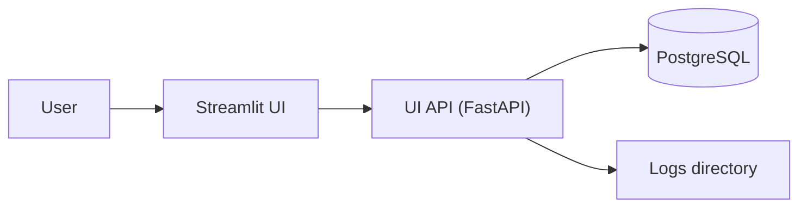

## Streamlit UI (loreley.ui)

Loreley ships an optional **read-only** Streamlit dashboard for observability.
It calls the [UI API](api.md) and renders tables, charts, and commit lineage graphs.

The UI stack is intentionally read-only: it does not enqueue jobs, stop workers, or mutate the database.



## Install

The UI dependencies live under the `ui` extra in `pyproject.toml`.

```bash
uv sync --extra ui
```

## Run

When the UI API is not running and `LORELEY_UI_API_BASE_URL` (or `--api-base-url`)
points to a local HTTP URL (`http://127.0.0.1:<port>`, `http://localhost:<port>`,
or `http://[::1]:<port>`), starting the UI will automatically start the UI API in
a subprocess.

You can still start the API manually:

```bash
uv run loreley api
```

Start Streamlit:

```bash
uv run loreley ui --api-base-url http://127.0.0.1:8000
```

See also:

- [Running the UI API](../script/run_api.md)
- [Running the Streamlit UI](../script/run_ui.md)

## Configuration

### UI variables

- `LORELEY_UI_API_BASE_URL`: Base URL for the UI API (default: `http://127.0.0.1:8000`).

### API runtime variables

The API relies on standard Loreley settings (database/logs). See:

- [Configuration](config.md)
- [UI API](api.md)

## Pages

The Streamlit UI is multi-page (implemented under `loreley/ui/pages`):

- **Overview**: quick KPIs, fitness trend, island table.
- **Experiments**: experiment list and selected experiment details.
- **Jobs**: job table with filters and a details panel.
- **Commits**: commit table with search; commit details with charts.
- **Archive**: island stats, snapshot metadata, record plots and table.
- **Graphs**: fitness scatter and commit lineage graph.
- **Logs**: browse role logs and tail a file.
- **Settings**: API health and safe settings (`Settings.export_safe()`).

## Notes

- **Caching**: the Streamlit UI caches API GET calls (default: ~60s); use the sidebar **Refresh data** button to clear cache.
- **Security**: there is no authentication layer. Deploy behind your internal network controls if exposing remotely.