### **MAID: The Manifest-driven AI Development Methodology**

**Version:** 1.3
**Date:** October 30, 2025

#### **Abstract**

The Manifest-driven AI Development (MAID) methodology is a structured approach to software engineering that leverages AI agents for code implementation while ensuring architectural integrity, quality, and maintainability. It addresses the core challenge of AI code generation—its tendency to produce plausible but flawed code without architectural awareness—by shifting the developer's role from a direct implementer to a high-level architect who provides AI agents with perfectly isolated, testable, and explicit tasks. This is achieved through a workflow centered on a Task Manifest, a declarative file that defines a self-contained unit of work as part of a verifiable sequence. By combining this manifest with architectural patterns that promote extreme decoupling, MAID creates a predictable and scalable environment for AI-assisted development.

-----

#### **Core Principles**

The MAID methodology is founded on five core principles:

  * **Explicitness over Implicitness:** An AI agent's context must be explicitly defined. The agent should never have to guess which files to edit, what dependencies exist, or how to validate its work.
  * **Extreme Isolation:** A task given to an AI agent should be as isolated as possible from the wider codebase *at the time of its creation*. The goal is to create a temporary "micro-environment" for every task, minimizing the cognitive load on the LLM.
  * **Test-Driven Validation:** The sole measure of an AI's success is its ability to make a predefined set of tests pass. The **manifest is the primary contract**; tests support implementation and verify behavior against that contract.
  * **Directed Dependency:** The software architecture must enforce a one-way flow of dependencies from volatile details (frameworks, databases) inward to stable business logic, as defined by Clean Architecture. This protects the core logic and simplifies tasks for the AI.
  * **Verifiable Chronology:** The current state of any module must be the verifiable result of applying its entire sequence of historical manifests. This ensures that the codebase has a transparent and reproducible history, preventing undocumented changes or "code drift."

-----

#### **The MAID Workflow**

```mermaid
---
title: MAID Workflow - Human to AI Handoff
---
flowchart LR
      subgraph Human["👤 Human Architect"]
          A[Goal] --> B[Manifest]
          B --> C[Tests]
          C --> D{Valid?}
          D -->|No| B
      end
      subgraph AI["🤖 Developer Agent"]
          E[Load Context] --> F[Implement]
          F --> G{Pass?}
          G -->|No| F
      end
      subgraph TDD["🔄 Code Quality"]
          H[Refactor] --> I{Green?}
          I -->|No| H
      end
      D -->|Yes| E
      G -->|Yes| H
      I -->|Yes| J[✅ Commit]
      style Human fill:#e3f2fd,stroke:#1565c0,color:#1565c0
      style AI fill:#fff3e0,stroke:#ef6c00,color:#ef6c00
      style TDD fill:#f3e5f5,stroke:#7b1fa2,color:#7b1fa2
      linkStyle 0,1,2,3,4,5,6,7,8 stroke:#000000
```



The development process is broken down into distinct phases, characterized by two main loops: a **Planning Loop** for the human architect and an **Implementation Loop** for the AI agent.

1.  **Phase 1: Goal Definition (Human Architect)**
    The human developer defines a high-level feature or bug fix. For example: "The system needs an endpoint to retrieve a user's profile by their ID."

2.  **Phase 2: The Planning Loop (Human Architect & Validator Tool)**
    This is an iterative, local phase where the plan is perfected before being committed. The process is as follows:
    * **Draft the Contract:** The architect first drafts the **manifest**. The manifest is the primary contract that defines the task's goal, scope, and expected structural artifacts.
    * **Draft the Behavioral Tests:** The architect then drafts the **behavioral test suite**, which supports the manifest by defining the success criteria.
    * **Structural Validation & Refinement:** The architect uses a validator tool (e.g., maid-runner) to repeatedly check for alignment. This Structural Validation is comprehensive:
        * It validates the draft manifest against the behavioral test code (using AST analysis) to ensure the plan is internally consistent.
        * If the task involves editing an existing file, it also validates the current implementation code against its entire manifest history (using the Merging Validator) to ensure the starting point is valid.
    * The architect refines both the manifest and the tests together until this validation passes and the plan is deemed complete.

3.  **Phase 3: Implementation (Developer Agent)**
    Once the plan is finalized and committed, an automated system invokes a "Developer Agent" with the manifest. The agent's **Implementation Loop** is as follows:
    * Read the manifest to load only the specified files into its context.
    * Write or modify the code based on the `goal` and its understanding of the tests.
    * The controlling script executes the `validationCommand` from the manifest.
    * If this **Behavioral Validation** fails, the error output is fed back into the agent's context for the next iteration. This loop continues until all tests pass.

4.  **Phase 4: Integration**
    Once the task is complete, the newly implemented code and its corresponding manifest are committed. Because the work was performed against a strict, test-verified manifest contract, it can be integrated with high confidence.

-----

#### **Core Components & Patterns**

  * **The Task Manifest**
    The Task Manifest is a JSON file that makes every task explicit and self-contained. It serves as an immutable record of a single change, forming one link in a chronological chain that defines the state of a module. The schema supports detailed interface definitions and multiple validation commands.

    **Enhanced Format Support:** The schema now supports both legacy and enhanced formats for backward compatibility:
    - **Legacy format:** `validationCommand` (single array), `parameters` field
    - **Enhanced format:** `validationCommands` (array of arrays for multiple commands), `args` field, `metadata` object, enhanced `returns` format, `raises` field

    Both formats are fully supported and can coexist. New manifests can use the enhanced format while existing manifests continue to work unchanged.

    **Example (Enhanced Format):**
    ```json
    {
      "version": "1",
      "goal": "Refactor the UserService to add a method for finding a user by ID.",
      "taskType": "edit",
      "supersedes": [],
      "editableFiles": ["src/services/user_service.py"],
      "readonlyFiles": [
        "tests/test_user_service.py",
        "src/models/user.py"
      ],
      "metadata": {
        "author": "developer@example.com",
        "tags": ["refactoring", "user-service"],
        "priority": "high"
      },
      "expectedArtifacts": {
        "file": "src/services/user_service.py",  // ⚠️ OBJECT with "file" + "contains" (NOT an array!)
        "contains": [
          {
            "type": "class",
            "name": "UserService",
            "bases": ["BaseService"]
          },
          {
            "type": "function",
            "name": "get_user_by_id",
            "class": "UserService",
            "args": [{"name": "user_id", "type": "int"}],
            "returns": {"type": "User"},
            "raises": ["ValueError"]
          }
        ]
      },
      "validationCommands": [
        ["pytest", "tests/test_user_service.py", "-v"],
        ["mypy", "src/services/user_service.py"]
      ]
    }
    ```

    **Example (Legacy Format - Still Supported):**
    ```json
    {
      "goal": "Add a method to UserService",
      "readonlyFiles": [],
      "expectedArtifacts": {
        "file": "src/services/user_service.py",  // ⚠️ OBJECT with "file" + "contains" (NOT an array!)
        "contains": [
          {
            "type": "function",
            "name": "get_user_by_id",
            "class": "UserService",
            "parameters": [{"name": "user_id"}],
            "returns": "User"
          }
        ]
      },
      "validationCommand": ["pytest", "tests/test_user_service.py"]
    }
    ```

    **⚠️ IMPORTANT: `expectedArtifacts` Structure**
    - `expectedArtifacts` is an **OBJECT**, not an array
    - It defines artifacts for **ONE file only** (specified by the `file` field)
    - For multi-file tasks: Create **separate manifests** for each file
    - The `systemArtifacts` field (array) is only for system-snapshot manifests

  * **Multi-Language Support**
    MAID Runner supports validation across multiple programming languages with production-ready parsers:

      * **Python** - Full support via Python AST (built-in)
        - File extensions: `.py`
        - Artifact types: `class`, `function`, `attribute`
        - Features: Type hints, async/await, decorators, class inheritance

      * **TypeScript/JavaScript** - Production-ready support via tree-sitter
        - File extensions: `.ts`, `.tsx`, `.js`, `.jsx`
        - Artifact types: `class`, `function`, `interface`, `type`, `enum`, `namespace`, `attribute`
        - Features: Generics, decorators, JSX/TSX, async functions, arrow functions
        - Framework support: Angular, React, NestJS, Vue
        - Coverage: 99.9% of TypeScript language constructs

    The validator automatically detects the language based on file extension and routes to the appropriate parser. All validation features (behavioral tests, implementation validation, snapshot generation, test stub generation) work seamlessly across languages.

    **Supported Artifact Types:**
    - **Common (Python & TypeScript):** `class`, `function`, `attribute`
    - **TypeScript-Specific:** `interface`, `type`, `enum`, `namespace`

  * **Context-Aware Validation Modes**
    The structural validator operates in two modes based on the manifest's intent, providing a balance between strictness and flexibility:

      * **Strict Mode (for `creatableFiles`):** The implementation's public artifacts must *exactly match* `expectedArtifacts`. This prevents AI code pollution in new files.
      * **Permissive Mode (for `editableFiles`):** The implementation's public artifacts must *contain at least* `expectedArtifacts`. This allows for iterative changes to existing files.

  * **Prescribed Architectural Patterns**
    To enable the necessary isolation, projects following MAID must adhere to these patterns:

      * Hexagonal Architecture (Ports & Adapters)
      * Dependency Injection (DI)
      * Single Responsibility Principle (SRP)

-----

#### **Advanced Concepts & Future Techniques**

  * **Handling Code Evolution (Migrations, Refactoring & Snapshots)**
    This is a set of strategies to manage the manifest history over the project's lifecycle, ensuring the codebase remains verifiable.

    * **The Merging Validator:** Inspired by database migrations, this validator tool enforces the Verifiable Chronology principle. To validate a file, it finds all "active" manifests in its history, merges their `expectedArtifacts` into a single, comprehensive list, and performs a strict validation against the current state of the implementation code.

    * **Handling Refactoring with `supersedes`:** To handle breaking changes without violating immutability, a new manifest can formally supersede an old one. It uses the optional `supersedes` property (an array of manifest paths). The Merging Validator is smart enough to ignore any manifest that has been superseded, allowing the contract to evolve. Superseded manifests are considered "dead" for validation but remain as an immutable part of the project's audit log.

      **Important:** When a manifest is superseded, it is completely excluded from MAID operations:
      - The validator (`maid validate`) ignores superseded manifests when merging manifest chains
      - The test runner (`maid test`) does NOT execute `validationCommand` from superseded manifests
      - Superseded manifests serve as historical documentation only—they are archived, not active

    * **Consolidated Snapshots:** For mature modules with a long manifest history, a tool can be run to generate a single "snapshot" manifest. This new manifest describes the complete current state of the file and supersedes all previous manifests for that file. This is also the primary mechanism for onboarding existing, legacy code into the MAID methodology.

    * **Transitioning from Snapshots to Natural Evolution:** Snapshot manifests are designed for "frozen" code—capturing a complete baseline. Once code needs to evolve, you must transition to the natural MAID flow:

      **The Pattern:**
      1. **Snapshot Phase** (Initial state): A snapshot manifest captures the complete public API of a file at a specific point in time
         ```json
         {
           "taskType": "snapshot",
           "expectedArtifacts": {
             "file": "src/service.py",
             "contains": [
               {"type": "function", "name": "existing_func_1"},
               {"type": "function", "name": "existing_func_2"}
             ]
           }
         }
         ```

      2. **Transition Manifest** (First evolution): When the file needs to evolve, create an edit manifest that:
         - Declares ALL current functions (existing + new)
         - Supersedes the snapshot manifest
         - Uses `taskType: "edit"` (not "snapshot")

         ```json
         {
           "taskType": "edit",
           "supersedes": ["task-015-snapshot-service.manifest.json"],
           "expectedArtifacts": {
             "file": "src/service.py",
             "contains": [
               {"type": "function", "name": "existing_func_1"},
               {"type": "function", "name": "existing_func_2"},
               {"type": "function", "name": "new_func"}  // New addition
             ]
           }
         }
         ```

      3. **Future Evolution** (Natural MAID flow): Subsequent manifests only declare new changes:
         ```json
         {
           "taskType": "edit",
           "expectedArtifacts": {
             "file": "src/service.py",
             "contains": [
               {"type": "function", "name": "another_new_func"}  // Only the new addition
             ]
           }
         }
         ```

         With `--use-manifest-chain`, the validator merges all active manifests, so the complete API is validated without needing to update previous manifests.

      **Why This Pattern Works:**
      - Snapshot = baseline for static/legacy code
      - Transition manifest = bridge from frozen state to natural evolution
      - Natural flow = incremental changes leveraging manifest chaining
      - Future manifests can add APIs without touching previous manifests

      **Key Rule:** Once you supersede a snapshot with a comprehensive edit manifest, continue using incremental edit manifests. Don't create new snapshots unless establishing a new "checkpoint" baseline.

  * **File Deletion Pattern**

    When removing a file that was previously tracked by MAID:

    1. **Create a deletion manifest** with `taskType: "refactor"`
    2. **Supersede** the original creation manifest
    3. **Delete** the file, its tests, and any imports
    4. **Validate** the deletion with behavioral tests

    Use status: "absent" in expectedArtifacts to mark the file as deleted.

    **Manifest Structure:**
    ```json
    {
      "goal": "Remove module X as it is no longer needed",
      "taskType": "refactor",
      "supersedes": ["manifests/task-XXX-create-module.manifest.json"],
      "creatableFiles": [],
      "editableFiles": [],
      "expectedArtifacts": {
        "file": "module_x.py",
        "status": "absent",
        "contains": []
      },
      "validationCommand": ["pytest", "tests/test_verify_deletion.py", "-v"]
    }
    ```

    **Validation Requirements:**
    - File no longer exists
    - Test file for original feature is deleted
    - No remaining imports from the deleted module

    **Audit Trail:** The superseded manifest preserves the complete history of when and why the file was created and later removed.

  * **File Rename Pattern**

    When renaming a file tracked by MAID:

    1. **Create a rename manifest** with `taskType: "refactor"`
    2. **Supersede** the original creation manifest
    3. **Use `git mv`** to preserve file history
    4. **Update** manifest to reference new filename
    5. **Validate** the rename with behavioral tests

    **Manifest Structure:**
    ```json
    {
      "goal": "Rename module_old.py to module_new.py for clarity",
      "taskType": "refactor",
      "supersedes": ["manifests/task-XXX-create-module-old.manifest.json"],
      "creatableFiles": ["path/to/module_new.py"],
      "expectedArtifacts": {
        "file": "path/to/module_new.py",
        "contains": [
          {"type": "function", "name": "existing_function"}
        ]
      },
      "validationCommand": ["pytest", "tests/test_verify_rename.py", "-v"]
    }
    ```

    **Validation Requirements:**
    - Old filename no longer exists
    - New filename exists with correct functionality
    - No remaining imports from old module name
    - Git history preserved via `git mv`

    **Key Difference from Deletion:** The `creatableFiles` contains the new filename, and `expectedArtifacts` declares the same public API under the new file location. This maintains continuity of the module's functionality while updating its location.

  * **The "Scaffold and Fill" Pattern**
    A stricter version of the workflow where the Architect Agent not only creates tests but also creates the `editableFiles` with empty function signatures. This reduces the Developer Agent's task to pure implementation.

  * **IDE Integration (The "Guardian Watcher")**
    The structural validator can be integrated into an IDE (e.g., as a VS Code extension). It runs in the background like a linter, providing real-time feedback to the architect during the "Planning Loop" and catching alignment errors the moment they are made.

  * **The Guardian Agent and Self-Healing Codebases**
    For ongoing maintenance, a top-level "Guardian Agent" can run the entire test suite after any change is committed. If a change breaks tests, the Guardian can automatically generate a new manifest to dispatch a fix.

  * **Codebase as a Dependency Graph**
    By analyzing `import` statements, the entire codebase can be mapped as a Directed Acyclic Graph (DAG). This allows the system to automatically identify all necessary `readonlyFiles` for a given task and run tasks in parallel.
    