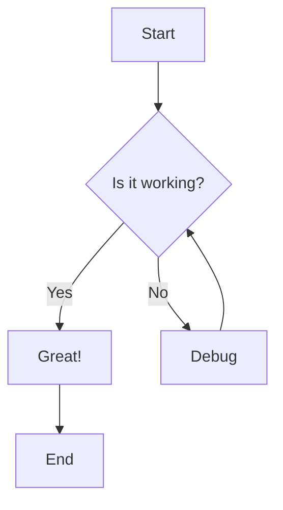

# MarkDeck 🎬

A lightweight, markdown-based presentation tool that runs locally.

[](https://www.python.org/downloads/)
[](https://opensource.org/licenses/MIT)

## ✨ Features

- **📝 Markdown-based**: Write presentations in plain text using familiar Markdown syntax
- **🚀 Fast & Lightweight**: No heavy frameworks, just clean HTML/CSS/JS
- **🔥 Hot Reload**: Automatically refreshes when you edit your markdown file (with `--watch`)
- **🎨 Beautiful Design**: Modern, distraction-free presentation interface with multiple themes
- **⌨️ Keyboard Shortcuts**: Navigate efficiently with keyboard controls
- **🔍 Grid View**: Overview all slides at once with interactive thumbnail grid (press `O`)
- **🎭 Multiple Themes**: Dark, light, and beige themes (press `T` to cycle)
- **📑 Two-Column Layouts**: Create side-by-side content with easy syntax
- **📐 Wide Slide Mode**: Expand slides to 90-98% viewport for wide tables and content
- **💬 Speaker Notes**: Hidden notes visible in terminal
- **🎯 Syntax Highlighting**: Beautiful code blocks powered by highlight.js
- **📊 Mermaid Diagrams**: Create flowcharts, sequence diagrams, and more with Mermaid.js
- **🔢 Math Equations**: LaTeX-style math rendering powered by KaTeX
- **📱 Responsive**: Works on different screen sizes
- **🔧 Easy Setup**: Simple CLI interface, no complex configuration

## 🚀 Quick Start

### Installation

#### Install from GitHub (Recommended)

```bash
# Install directly from GitHub using uv
uv pip install git+https://github.com/orangewise/markdeck.git

# Install from a specific branch
uv pip install git+https://github.com/orangewise/markdeck.git@claude/init-markdeck-project-01DJeHxbuthmNtDFjgxToFrP

# Then run it
markdeck present examples/demo.md
```

#### Install from Local Clone

```bash
# Clone the repository
git clone https://github.com/orangewise/markdeck.git
cd markdeck

# Using uv (recommended)
uv pip install -e .

# Or using pip
pip install -e .
```

### Run Without Installing

You can run MarkDeck directly without permanent installation:

```bash
# Create a test presentation
echo "# Hello MarkDeck

---

## Your First Slide

- Quick
- Easy
- Beautiful

---

## That's It!

Start creating your own presentations!" > test.md

# Run directly from a GitHub branch (no installation needed)
uvx --from git+https://github.com/orangewise/markdeck.git@claude/init-markdeck-project-01DJeHxbuthmNtDFjgxToFrP markdeck present test.md

# Or use the main branch
uvx --from git+https://github.com/orangewise/markdeck.git markdeck present test.md
```

### Prune uv to clear caches

```
uv cache prune --force
uv cache clean markdeck
uvx . present examples/features.md --watch
```

### Clear Browser Cache

- Safari: Cmd + Option + R (or hold Shift while clicking reload)
- Chrome/Edge: Cmd + Shift + R (should work)
- Firefox: Cmd + Shift + R


### Create Your First Presentation

```bash
# Create a new presentation from template
markdeck init my-presentation.md

# Start presenting
markdeck present my-presentation.md
```

Your browser will automatically open to `http://127.0.0.1:8000` with your presentation ready!

## 📖 Usage

### Basic Commands

```bash
# Present a markdown file
markdeck present slides.md

# Present with hot reload (auto-refresh on file changes)
markdeck present slides.md --watch

# Present on a custom port
markdeck present slides.md --port 3000

# Present without auto-opening browser (useful for automated screenshot capture)
markdeck present slides.md --no-browser

# Combine options
markdeck present slides.md --watch --port 3000

# Create a new presentation
markdeck init my-talk.md

# Create with custom title
markdeck init my-talk.md --title "My Awesome Talk"

# Validate a presentation file
markdeck validate slides.md

# Show version
markdeck --version
```

### Markdown Syntax

Create slides by separating content with `---` on its own line:

````markdown
# My First Slide

This is the content of the first slide.

---

# Second Slide

- Bullet point 1
- Bullet point 2
- Bullet point 3

---

# Code Example

```python
def hello_markdeck():
    print("Hello from MarkDeck!")
```

---

# Slide with Speaker Notes

This content is visible to the audience.

<!--NOTES:
These are speaker notes.
They will appear in the terminal where you run markdeck.
-->
````

### Keyboard Shortcuts

| Key | Action |
|-----|--------|
| `→` / `Space` / `PageDown` | Next slide |
| `←` / `PageUp` | Previous slide |
| `Home` | First slide |
| `End` | Last slide |
| `O` | Toggle grid view (slide overview) |
| `T` | Cycle themes (dark/light/beige) |
| `F` | Toggle fullscreen |
| `?` | Show help |
| `Esc` | Exit fullscreen/help/grid |

## 📁 Project Structure

```
markdeck/
├── markdeck/          # Main package
│   ├── __init__.py
│   ├── __main__.py     # Entry point
│   ├── cli.py          # CLI interface
│   ├── server.py       # FastAPI server
│   ├── parser.py       # Markdown parser
│   └── static/         # Frontend files
│       ├── index.html
│       ├── style.css
│       └── slides.js
├── tests/              # Unit tests
├── examples/           # Example presentations
│   ├── demo.md
│   ├── features.md
│   └── code-examples.md
└── pyproject.toml      # Project configuration
```

## 🎨 Features in Detail

### Markdown Support

MarkDeck supports standard Markdown features:

- **Headings**: `#` through `######`
- **Bold**: `**bold**` or `__bold__`
- **Italic**: `*italic*` or `_italic_`
- **Code**: `` `inline code` ``
- **Links**: `[text](url)`
- **Images**: ``
- **Lists**: Unordered (`-`, `*`, `+`) and ordered (`1.`, `2.`)
- **Tables**: GitHub-flavored markdown tables
- **Blockquotes**: `> quote`
- **Code blocks**: Fenced with ` ``` `

### Code Syntax Highlighting

MarkDeck includes syntax highlighting for many languages:

```python
# Python
def fibonacci(n):
    return n if n <= 1 else fibonacci(n-1) + fibonacci(n-2)
```

```javascript
// JavaScript
const greet = (name) => console.log(`Hello, ${name}!`);
```

```rust
// Rust
fn main() {
    println!("Hello, MarkDeck!");
}
```

### Speaker Notes

Add speaker notes that are hidden from the main view:

```markdown
# My Slide

Visible content here.

<!--NOTES:
These notes are only visible when you press 'S'
- Remember to mention X
- Don't forget Y
- Time: 2 minutes
-->
```

### Mermaid Diagrams

MarkDeck supports Mermaid diagrams for visualizing concepts, workflows, and architecture:

````markdown

````

**Supported diagram types:**
- Flowcharts (`graph`, `flowchart`)
- Sequence diagrams (`sequenceDiagram`)
- Class diagrams (`classDiagram`)
- State diagrams (`stateDiagram-v2`)
- Git graphs (`gitGraph`)
- Pie charts (`pie`)
- And many more!

Diagrams render with a dark theme that matches MarkDeck's interface and scale responsively to fit your slides.

### Two-Column Layouts

MarkDeck supports two-column layouts for side-by-side content presentation:

````markdown
:::columns
### Left Column

Content on the left side

|||

### Right Column

Content on the right side
:::
````

**Features:**
- Simple `:::columns` syntax with `|||` separator
- Supports all markdown features in each column (code, lists, images, etc.)
- Responsive design - columns stack vertically on mobile devices
- Perfect for comparisons, code + documentation, pros/cons lists

**Common use cases:**
- **Code comparisons**: Before/after examples side-by-side
- **Documentation**: Code on one side, explanation on the other
- **Comparisons**: Pros vs Cons, Old vs New approaches
- **Multi-language examples**: Same logic in different languages

**Example - Code & Explanation:**

````markdown
:::columns
### The Code

```python
def factorial(n):
    if n <= 1:
        return 1
    return n * factorial(n - 1)
```

|||

### How It Works

This recursive function calculates factorials.

**Base case**: n ≤ 1 returns 1
**Recursive**: n × factorial(n-1)
:::
````

See `examples/two-column-examples.md` for comprehensive examples.

### Custom Column Widths

You can specify custom width percentages for two-column layouts to create asymmetric layouts:

````markdown
:::columns[70]
### Main Content (70%)

This column gets 70% of the width
|||

### Sidebar (30%)

This column gets the remaining 30%
:::
````

**Features:**
- Specify left column width as a percentage: `:::columns[width]`
- Right column automatically gets the remaining width (100 - left%)
- Width must be between 1 and 99
- Backward compatible: `:::columns` without width still creates 50/50 split
- Perfect for layouts with primary content and sidebars

**Common use cases:**
- **70/30 split**: Wide main content with narrow sidebar for notes or links
- **60/40 split**: Code reviews with implementation and review comments
- **30/70 split**: Quick stats or table of contents with detailed content

**Example - 70/30 Layout:**

````markdown
:::columns[70]
### Main Content (70%)

- Detailed explanations
- Code examples that need more width
- Main narrative
- Primary visuals

|||

### Sidebar (30%)

**Quick Notes:**
- Key points
- References
- Tips
:::
````

See `examples/features.md` for live examples of different column width configurations.

### Wide Slide Mode

For slides with wide tables or content that needs more horizontal space, use the `<!--SLIDE:wide-->` directive:

````markdown
<!--SLIDE:wide-->

## Wide Table Example

| Column 1 | Column 2 | Column 3 | Column 4 | Column 5 | Column 6 |
|----------|----------|----------|----------|----------|----------|
| Data     | Data     | Data     | Data     | Data     | Data     |
````

**Available width modes:**
- `<!--SLIDE:wide-->` - 90% viewport width
- `<!--SLIDE:full-->` - 95% viewport width
- `<!--SLIDE:ultra-wide-->` - 98% viewport width

**Usage:**
- Place the directive at the very top of the slide (before any content)
- Only affects the current slide - other slides maintain normal width
- Perfect for wide tables, comparison charts, or detailed data

**Visual Preview:**


*Wide mode showing a multi-column table with expanded width*

### Grid View / Slide Overview

MarkDeck provides a grid view for quick navigation and overview of your entire presentation:

**How to use:**
- Press `O` at any time to toggle the grid view
- See all slides as interactive thumbnails in a responsive grid layout
- Click any slide to jump directly to it
- The current slide is highlighted with a blue border

**Features:**
- Visual previews of all slides
- Current slide indicator
- Quick navigation by clicking thumbnails
- Responsive grid layout that adapts to screen size
- Keyboard controls (`O` to toggle, `Esc` to close)

**Perfect for:**
- Long presentations (20+ slides)
- Finding specific slides during Q&A
- Getting an overview of presentation structure
- Quick navigation during practice sessions

**Visual Preview:**

<details>
<summary>Click to see grid view screenshots</summary>


*Normal presentation view*


*Grid view showing all slides as thumbnails*


*Current slide highlighted with blue border*

</details>

### Hot Reload

MarkDeck includes hot reload functionality for a seamless development experience:

```bash
# Start with watch mode enabled
markdeck present my-slides.md --watch
```

**What happens:**
- MarkDeck monitors your markdown file for changes
- When you save edits, the presentation automatically refreshes in your browser
- You stay on the current slide (or closest available slide if slides were removed)
- A brief "Presentation reloaded" notification appears

**Perfect for:**
- Iterating on your presentation content
- Live editing during practice sessions
- Quick feedback on formatting and layout changes

## 🛠️ Development

### Setup Development Environment

```bash
# Clone the repository
git clone https://github.com/orangewise/markdeck.git
cd markdeck

# Install with development dependencies
uv pip install -e ".[dev]"

# Run tests
python -m unittest discover tests/

# Run linter
ruff check .

# Format code
ruff format .
```

### Running Tests

```bash
# Run all tests
python -m unittest discover tests/

# Run with verbose output
python -m unittest discover tests/ -v

# Run specific test file
python -m unittest tests.test_parser
```

### Project Commands

```bash
# Run the server in development mode
python -m markdeck present examples/demo.md

# Run linting
ruff check markdeck/ tests/

# Format code
ruff format markdeck/ tests/
```

## 📚 Examples

Check out the `examples/` directory for sample presentations:

- **features.md**: Comprehensive feature showcase
- **two-column-examples.md**: Two-column layout examples
- **code-examples.md**: Syntax highlighting demo

Try them out:

```bash
markdeck present examples/features.md
markdeck present examples/two-column-examples.md
markdeck present examples/code-examples.md
```

## 🗺️ Roadmap

### Phase 2 - Enhanced Features

- [x] Hot reload (watch file for changes) ✓
- [x] Slide overview/grid view ✓
- [x] PyPI distribution ✓
- [x] Multiple themes (dark/light/beige) ✓
- [x] Two-column layouts ✓
- [x] Custom column widths ✓
- [x] Wide slide mode ✓
- [ ] Slide transitions
- [ ] Media embedding improvements

### Phase 3 - Polish & Distribution (Planned)

- [ ] Export to PDF
- [ ] Export to standalone HTML
- [ ] Configuration file support
- [ ] Custom themes
- [ ] Plugin system

## 🤝 Contributing

Contributions are welcome! Here's how you can help:

1. Fork the repository
2. Create a feature branch (`git checkout -b feature/amazing-feature`)
3. Make your changes
4. Add tests for new features
5. Run tests and linting
6. Commit your changes (`git commit -m 'Add amazing feature'`)
7. Push to the branch (`git push origin feature/amazing-feature`)
8. Open a Pull Request

Please ensure:
- Code follows PEP 8 style guide
- All tests pass
- New features include tests
- Documentation is updated

## 📄 License

This project is licensed under the MIT License - see the [LICENSE](LICENSE) file for details.

## 🙏 Acknowledgments

- [FastAPI](https://fastapi.tiangolo.com/) - Modern web framework
- [marked.js](https://marked.js.org/) - Markdown parser
- [highlight.js](https://highlightjs.org/) - Syntax highlighting
- [Mermaid.js](https://mermaid.js.org/) - Diagram and flowchart generation
- [Python-Markdown](https://python-markdown.github.io/) - Server-side markdown parsing

## 📞 Support

- 🐛 [Report bugs](https://github.com/orangewise/markdeck/issues)
- 💡 [Request features](https://github.com/orangewise/markdeck/issues)
- 📖 [Documentation](https://github.com/orangewise/markdeck)

## ⭐ Show Your Support

If you find MarkDeck useful, please consider giving it a star on GitHub!

---

**Made with ❤️ by the MarkDeck community**
