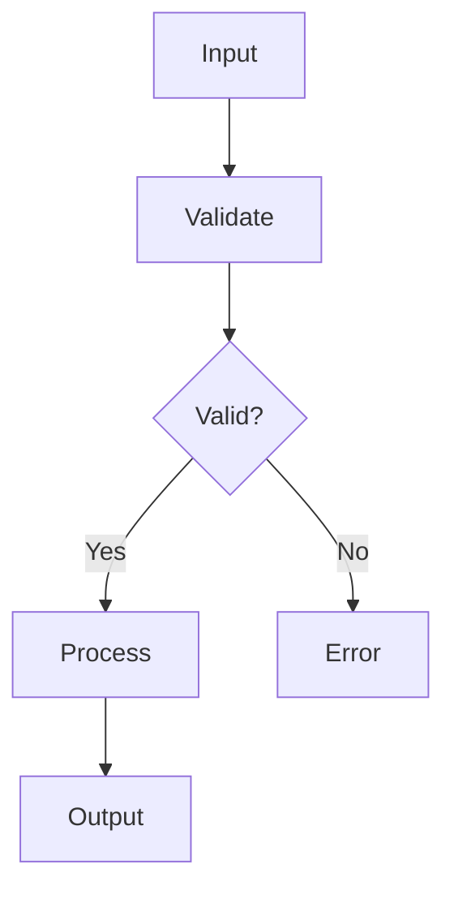
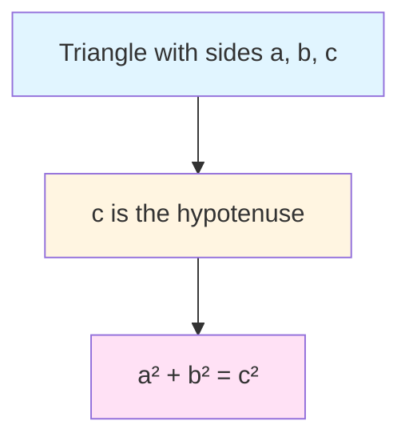

# Two-Column Layout Examples

Comprehensive examples of MarkDeck's two-column feature

---

## Basic Two-Column Layout

:::columns
### Left Column

This is content in the left column.

You can put any markdown here!

|||

### Right Column

This is content in the right column.

It appears side-by-side with the left column.
:::

---

## Comparison: Before & After

:::columns
### Before

```python
# Old approach
for i in range(len(items)):
    item = items[i]
    if item.valid:
        process(item)
```

|||

### After

```python
# Modern approach
for item in items:
    if item.valid:
        process(item)
```
:::

**Result**: Cleaner, more Pythonic code!

---

## Feature Comparison Table

:::columns
### Traditional Presentations

| Tool | Pros | Cons |
|------|------|------|
| PowerPoint | Rich UI | Binary format |
| Keynote | Beautiful | Mac-only |
| Google Slides | Cloud-based | Requires internet |

|||

### MarkDeck Approach

**Advantages:**
- Plain text (version control!)
- Fast and lightweight
- Works offline
- Open source

**Perfect for:**
- Technical talks
- Code reviews
- Developer presentations
:::

---

## Problem & Solution

:::columns
### The Problem

Many developers struggle with creating technical presentations that include:

- Code examples
- Diagrams
- Equations
- Version control

Traditional tools are either too complex or lack the features developers need.

|||

### The Solution

**MarkDeck** provides:

1. **Markdown syntax** - familiar and easy
2. **Syntax highlighting** - beautiful code blocks
3. **Git-friendly** - plain text files
4. **Fast** - no bloat
5. **Extensible** - Mermaid, KaTeX, and more

Perfect for technical content!
:::

---

## Code & Documentation

:::columns
### Implementation

```javascript
class Cache {
  constructor(ttl = 3600) {
    this.store = new Map();
    this.ttl = ttl;
  }

  set(key, value) {
    const expires = Date.now() + this.ttl * 1000;
    this.store.set(key, { value, expires });
  }

  get(key) {
    const item = this.store.get(key);
    if (!item) return null;
    if (Date.now() > item.expires) {
      this.store.delete(key);
      return null;
    }
    return item.value;
  }
}
```

|||

### Documentation

**Cache Class**

A simple time-based cache implementation with automatic expiration.

**Constructor:**
- `ttl` (optional): Time to live in seconds (default: 3600)

**Methods:**
- `set(key, value)`: Store a value with expiration
- `get(key)`: Retrieve a value (returns null if expired)

**Usage:**
```javascript
const cache = new Cache(300);
cache.set('user', data);
const user = cache.get('user');
```
:::

---

## Visual & Textual Content

:::columns
### Process Flow



|||

### Explanation

**Data Flow:**

1. **Input** - Receive data from user
2. **Validate** - Check data integrity
3. **Decision** - Is data valid?
   - Yes → Process the data
   - No → Return error
4. **Output** - Return results

This pattern ensures data quality before processing.
:::

---

## Mathematical Concepts

:::columns
### The Formula

The **Pythagorean Theorem** states:

$$a^2 + b^2 = c^2$$

Where:
- $a$ and $b$ are the legs of a right triangle
- $c$ is the hypotenuse

**Example:**
If $a = 3$ and $b = 4$, then:

$$c = \sqrt{3^2 + 4^2} = \sqrt{9 + 16} = 5$$

|||

### Visual Representation



**Applications:**
- Distance calculations
- Computer graphics
- Navigation systems
- Physics simulations
:::

---

## Lists: Ordered vs Unordered

:::columns
### Ordered Process

1. Clone the repository
2. Install dependencies
   ```bash
   npm install
   ```
3. Run development server
   ```bash
   npm run dev
   ```
4. Build for production
   ```bash
   npm run build
   ```

|||

### Checklist

- [ ] Code review completed
- [ ] Tests passing
- [ ] Documentation updated
- [ ] Changelog entry added
- [ ] Version bumped
- [ ] Ready to merge

**Note**: Order matters on the left, but not on the right!
:::

---

## Multiple Languages

:::columns
### Python

```python
def greet(name: str) -> str:
    return f"Hello, {name}!"

# Usage
message = greet("World")
print(message)
```

|||

### JavaScript

```javascript
function greet(name) {
  return `Hello, ${name}!`;
}

// Usage
const message = greet("World");
console.log(message);
```
:::

Same logic, different syntax!

---

## Responsive Design

:::columns
### Desktop View

On larger screens (> 768px), columns appear **side-by-side** for easy comparison and parallel reading.

This makes it perfect for:
- Code comparisons
- Before/after examples
- Pros vs Cons
- Theory vs Practice

|||

### Mobile View

On smaller screens (≤ 768px), columns **stack vertically** for better readability.

This ensures:
- No horizontal scrolling
- Readable text size
- Easy navigation
- Great mobile experience

The layout adapts automatically!
:::

---

## Tips & Best Practices

:::columns
### Do ✓

- Keep column content balanced
- Use parallel structure
- Limit nesting depth
- Test on mobile
- Use meaningful headings

|||

### Don't ✗

- Overload one column
- Mix too many formats
- Create deep hierarchies
- Forget mobile users
- Ignore accessibility
:::

---

## Thank You!

Two-column layouts add flexibility to your presentations.

**Try them out!**

Syntax reminder:
```markdown
:::columns
Left content
|||
Right content
:::
```
