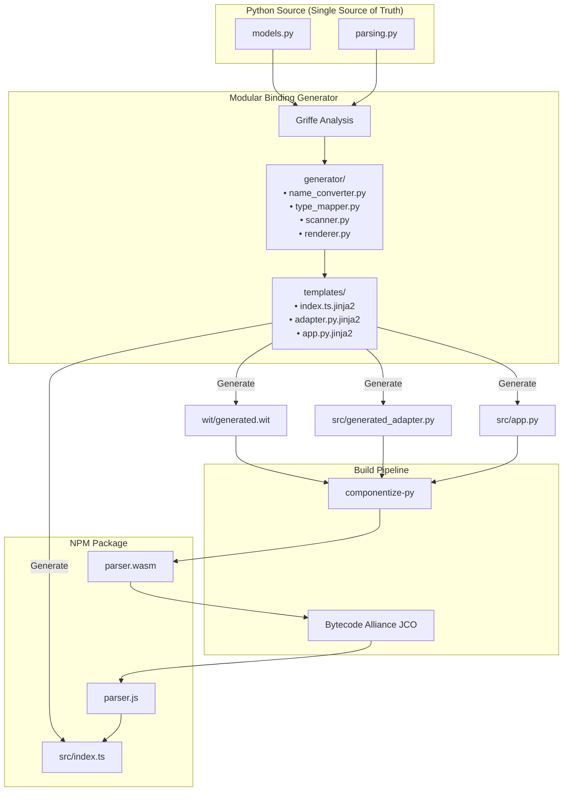

# NPM Package Architecture & Internals

This document explains how `md-spreadsheet-parser` achieves **100% API Compatibility** between its Python core and the NPM package, ensuring that TypeScript users have the exact same Object-Oriented experience as Python users.

## 1. High-Level Architecture

The NPM package is not a rewrite. It is a **direct compilation** of the Python source code into WebAssembly (WASM), wrapped in an auto-generated TypeScript layer that restores Python's Object-Oriented (OO) semantics.



## 2. The Core Mechanism: Modular Binding Generation

To guarantee 100% parity and zero drift, we use a **modular generator** architecture with Jinja2 templates.

### 2.1 Generator Modules (`scripts/generator/`)

| Module | Responsibility |
|--------|---------------|
| `name_converter.py` | Naming convention utilities (kebab-case, camelCase, snake_case) |
| `type_mapper.py` | Python → WIT → TypeScript type mapping |
| `scanner.py` | Griffe-based module/class/function discovery |
| `renderer.py` | Jinja2 template rendering orchestration |

### 2.2 Static Analysis (Griffe)
We use `griffe` to parse the Python AST of `md_spreadsheet_parser`. It allows us to:
- Discover all `dataclass` Models (`Table`, `Workbook`, `ParsingSchema`, etc.).
- Inspect method signatures, type annotations, and default values.
- Respect inheritance (e.g., `MultiTableParsingSchema` inherits `ParsingSchema`).

### 2.3 The "Value-Type" Bridge
WASM Components use the WIT (Wasm Interface Type) system, which primarily exchanges **Data** (Records/Structs), not **Objects** (Classes with methods).

1.  **Python Models**: Are Class Instances with methods.
2.  **WIT Records**: Are pure data structs.
3.  **Adapter Layer**: `generated_adapter.py` converts between Python Objects and WIT Records. 
    - `unwrap_*`: Converts WIT Records → Python Objects (for function inputs).
    - `convert_*`: Converts Python Objects → WIT Records (for function outputs).

### 2.4 Method Flattening & App Wrapper
Since WASM interfaces are flat functions, we "flatten" Python instance methods into standalone functions in `src/app.py`.

**Original Python:**
```python
class Table:
    def update_cell(self, row: int, col: int, value: str): ...
```

**Flattened WASM Export (`app.py`):**
```python
def table_update_cell(self_obj: WitTable, row: int, col: int, value: str):
    real_table = unwrap_table(self_obj)
    real_table.update_cell(row, col, value)
    return convert_table(real_table)
```

## 3. Preserving Python Semantics in TypeScript

### 3.1 Fluent API & Mutation Simulation (Model Reconstruction Pattern)

Python methods often mutate `self` and return `self` for fluent chaining.

- **Problem**: WASM passes data by value. The struct returned by WASM is a *new copy*, not the original instance. Additionally, `metadata` comes back as a JSON string instead of a parsed object.
- **Solution**: The generated TypeScript wrapper uses a **Model Reconstruction Pattern**: 
  1. Call WASM and get the raw response
  2. Create a new instance via constructor (which properly parses JSON fields and wraps nested models)
  3. Assign the hydrated properties back to `this`

**Generated TypeScript (`src/index.ts`):**
```typescript
class Table {
    updateCell(rowIdx: number, colIdx: number, value: string): Table {
        const dto = this.toDTO();
        
        // 1. Call WASM (takes current state, returns NEW state 'res')
        const res = _tableUpdateCell(dto, rowIdx, colIdx, value);
        
        // 2. Create properly hydrated instance via constructor
        //    - Parses metadata JSON string → object
        //    - Wraps nested models (sheets, tables, etc.)
        const hydrated = new Table(res);
        
        // 3. Assign hydrated properties to 'this'
        Object.assign(this, hydrated);
        
        // 4. Return 'this' to support chaining
        return this;
    }
}
```

This ensures `table.updateCell(...)` updates the `table` object in-place from the user's perspective, matching Python behavior while correctly handling JSON fields and nested models.

### 3.2 Partial Schema & Default Argument Support
Python supports partial schemas via default arguments: `ParsingSchema(column_separator="|")` (other fields use defaults).
- **Problem**: WIT records must have all fields present.
- **Solution (WIT Side)**: All fields with Python defaults are marked as `option<T>` in WIT.
- **Solution (Python Side)**: The app wrapper uses a `**kwargs` filtering pattern.
    - If TS passes `undefined` → Python receives `None`.
    - The wrapper sees `None` and **omits** the argument from the Python call.
    - Python's native default argument logic kicks in.

## 4. Test Infrastructure

The generator includes comprehensive unit tests:

```
scripts/tests/
├── test_name_converter.py   # 16 tests - Naming conversion utilities
├── test_type_mapper.py      # 17 tests - Type mapping logic
├── test_scanner.py          # 8 tests  - Module scanning
├── test_template_rendering.py  # 6 tests - Template output
└── test_dist_output.py      # 10 tests - Generated code verification
```

Run with: `npm run test:generator`

## 5. Verification Strategy

We verify compatibility using multiple approaches:

1. **Generator Unit Tests**: `npm run test:generator` (61 tests)
2. **Runtime Integration**: `npm test` (end-to-end verification)
3. **API Coverage Audit**: `uv run python scripts/verify_api_coverage.py`

The API coverage script scans both Python and TypeScript to verify 100% structural parity:

```text
✅ 100% Structural API Compatibility Verified.
   Covered 27 public methods/functions.
```

## 6. Known Limitations

1.  **File System Access (`*FromFile` functions)**:
    - Functions like `parseTableFromFile` require a Node.js environment.
    - **In Browser**: These functions throw a clear error message directing users to use string-based alternatives.

2.  **`Table.toModels(schema)` - Schema Types**:
    - **Plain Object Schema**: Pass an object with converter functions:
      ```typescript
      const schema = {
          id: (val: string) => Number(val),
          active: (val: string) => val === 'yes'
      };
      const results = table.toModels(schema);
      // [{ id: 1, active: true }]
      ```
    - **Zod Schema**: For robust validation, use [Zod](https://zod.dev/):
      ```typescript
      import { z } from 'zod';
      const schema = z.object({
          id: z.coerce.number(),
          active: z.string().transform(v => v === 'yes')
      });
      const results = table.toModels(schema);
      ```
    - Both approaches return an array of typed objects directly—no JSON parsing required.

## 7. For Maintainers: Adding New Features

1.  **Modify Python Core**: Add your methods or fields to `md_spreadsheet_parser`.
2.  **Auto-Generate**: Run `npm run build`. This will:
    - Detect the new fields/methods via Griffe.
    - Update `generated.wit`, `generated_adapter.py`, `app.py`, and `src/index.ts`.
    - Recompile the WASM.
3.  **Run Tests**: `npm test && npm run test:generator`
