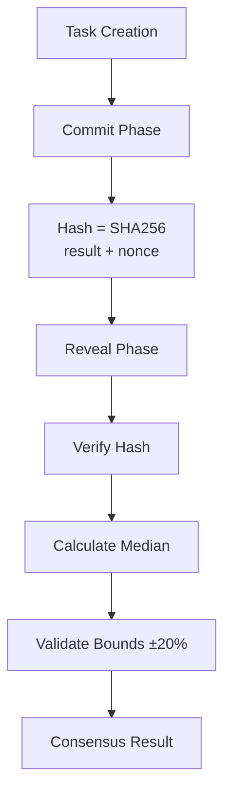

# Median Blockchain Python SDK

Python SDK for interacting with the Median blockchain, providing easy-to-use interfaces for account management, coin operations, staking, NFTs, and inference task management with commit-reveal consensus.

## Features

- **Account Management**: Create and query blockchain accounts dynamically
- **Coin Operations**: Mint, burn, and transfer tokens with proper authorization
- **Staking Management**: Delegate, undelegate tokens with **automated NFT certificate generation**
- **Smart Fee System**: Automatic fee currency selection and dynamic gas-based calculation
- **Task Management**: Create inference tasks with commit-reveal consensus
- **Query Functionality**: Query blockchain state, balances, task results, and staking information
- **Batch Operations**: Efficient batch queries for multiple addresses
- **Composite Queries**: Advanced summaries for staking and validator information
- **Type-Safe**: Uses dataclasses and type hints for better IDE support
- **Transaction Signing**: Proper transaction signing using mospy-wallet library

## Installation

### Requirements

- Python 3.7 or higher
- `requests` library
- `mospy-wallet` for transaction signing
- `cosmospy_protobuf` for Protobuf message handling

### Install Dependencies

```bash
pip install requests mospy-wallet cosmospy_protobuf protobuf==4.22.1
```

**Note**: `protobuf==4.22.1` is required for compatibility with mospy-wallet 0.6.0.

### Install SDK

Copy the `median_sdk.py` file to your project or add the SDK directory to your Python path:

```python
import sys
sys.path.insert(0, '/path/to/Median/sdk/python')
from median_sdk import MedianSDK, Coin, create_sdk
```

## Quick Start

```python
from median_sdk import create_sdk, Coin

# Initialize the SDK
sdk = create_sdk(api_url="http://localhost:22281", chain_id="co-chain")

# Query an account balance
balance = sdk.get_account_balance("cosmos15uzxeqrvx76pclg8t7mkfpwpnj2vveq2kmpljd")
for coin in balance:
    print(f"{coin.amount} {coin.denom}")

# Get blockchain info
node_info = sdk.get_node_info()
print(f"Chain ID: {node_info['default_node_info']['network']}")
```

## Core Concepts

### Account Types
- **Genesis Account**: The initial validator account created during blockchain setup
- **Validator Account**: Participates in consensus and can delegate/undelegate tokens
- **User Account**: Standard blockchain account for transactions
- **New Test Account**: Dynamically created for testing purposes

### Token Types
- **stake**: Base token for staking, gas fees, and network security
- **token**: Utility token for application-specific operations

### Consensus Model
Median uses a commit-reveal consensus scheme for decentralized inference tasks:
1. **Commit Phase**: Validators submit hashed results
2. **Reveal Phase**: Validators reveal actual results
3. **Consensus Calculation**: Median computation with bounds validation

## API Reference

### Initialization

#### `MedianSDK(api_url, chain_id, timeout)`

Initialize the SDK with blockchain connection parameters.

**Parameters:**
- `api_url` (str): Base URL of the blockchain API (default: "http://localhost:1317")
- `chain_id` (str): Chain ID (default: "median")
- `timeout` (int): Request timeout in seconds (default: 30)

**Example:**
```python
sdk = MedianSDK(
    api_url="http://localhost:22281",
    chain_id="co-chain",
    timeout=30
)
```

#### `create_sdk(api_url, chain_id)`

Convenience function to create an SDK instance.

**Example:**
```python
sdk = create_sdk(api_url="http://localhost:22281", chain_id="co-chain")
```

### Account Management

#### `create_account(creator_address, new_account_address, private_key=None, wait_confirm=False)`

Create a new blockchain account dynamically.

**Parameters:**
- `creator_address` (str): Address of the account creator (must have authority)
- `new_account_address` (str): Address for the new account
- `private_key` (str, optional): Private key for signing transactions
- `wait_confirm` (bool): Wait for transaction confirmation (default: False)

**Returns:** Transaction response dictionary

**Example:**
```python
result = sdk.create_account(
    creator_address="cosmos10d07y265gmmuvt4z0w9aw880jnsr700j6zn9kn",
    new_account_address="cosmos1newaccount123...",
    private_key="your_private_key_hex"
)
```

#### `get_account(address)`

Get account information by address.

**Parameters:**
- `address` (str): Account address

**Returns:** Account information dictionary

**Example:**
```python
account = sdk.get_account("cosmos15uzxeqrvx76pclg8t7mkfpwpnj2vveq2kmpljd")
print(account['account']['@type'])
```

#### `get_account_balance(address)`

Get account balance.

**Parameters:**
- `address` (str): Account address

**Returns:** List of `Coin` objects

**Example:**
```python
balances = sdk.get_account_balance("cosmos15uzxeqrvx76pclg8t7mkfpwpnj2vveq2kmpljd")
for coin in balances:
    print(f"{coin.amount} {coin.denom}")
```

### Coin Management

#### `transfer_coins(from_address, to_address, amount, private_key=None, wait_confirm=False)`

Transfer coins between accounts.

**Parameters:**
- `from_address` (str): Source account address
- `to_address` (str): Destination account address
- `amount` (List[Coin]): List of coins to transfer
- `private_key` (str, optional): Private key for signing
- `wait_confirm` (bool): Wait for transaction confirmation (default: False)

**Returns:** Transaction response dictionary

**Example:**
```python
from median_sdk import Coin

result = sdk.transfer_coins(
    from_address="cosmos15uzxeqrvx76pclg8t7mkfpwpnj2vveq2kmpljd",
    to_address="cosmos1newaccount123...",
    amount=[Coin(denom="token", amount="1")],
    private_key="your_private_key_hex"
)
```

#### `mint_coins(authority_address, recipient_address, amount, private_key=None, wait_confirm=False)`

Mint new coins and send to recipient.

**Parameters:**
- `authority_address` (str): Address with minting authority
- `recipient_address` (str): Address to receive minted coins
- `amount` (List[Coin]): List of coins to mint
- `private_key` (str, optional): Private key for signing
- `wait_confirm` (bool): Wait for transaction confirmation (default: False)

**Returns:** Transaction response dictionary

**Example:**
```python
result = sdk.mint_coins(
    authority_address="cosmos10d07y265gmmuvt4z0w9aw880jnsr700j6zn9kn",
    recipient_address="cosmos16tzn8wytv7srdw6v9l4q7ncmu8a092wrrfjp7l",
    amount=[
        Coin(denom="token", amount="1000"),
        Coin(denom="stake", amount="5000")
    ],
    private_key="your_private_key_hex"
)
```

#### `burn_coins(authority_address, amount, from_address="", private_key=None, wait_confirm=False)`

Burn coins from the module account.

**Parameters:**
- `authority_address` (str): Address with burning authority
- `amount` (List[Coin]): List of coins to burn
- `from_address` (str, optional): Source address (currently only module account supported)
- `private_key` (str, optional): Private key for signing
- `wait_confirm` (bool): Wait for transaction confirmation (default: False)

**Returns:** Transaction response dictionary

**Example:**
```python
result = sdk.burn_coins(
    authority_address="cosmos10d07y265gmmuvt4z0w9aw880jnsr700j6zn9kn",
    amount=[Coin(denom="token", amount="500")],
    private_key="your_private_key_hex"
)
```

### Staking Management

#### `delegate_tokens(delegator_address, validator_address, amount, private_key=None, wait_confirm=False, fee_granter=None)`

Delegate tokens to a validator.

**Note**: Upon successful delegation, the blockchain will **automatically** mint a Staking Certificate (NFT) for the delegator. No manual issuance is required.

**Parameters:**
- `delegator_address` (str): Address of the delegator
- `validator_address` (str): Address of the validator (operator address)
- `amount` (List[Coin]): List of coins to delegate (single coin only)
- `private_key` (str, optional): Private key for signing
- `wait_confirm` (bool): Wait for transaction confirmation (default: False)
- `fee_granter` (str, optional): Address of the fee granter

**Returns:** Transaction response dictionary

**Example:**
```python
result = sdk.delegate_tokens(
    delegator_address="cosmos15uzxeqrvx76pclg8t7mkfpwpnj2vveq2kmpljd",
    validator_address="cosmosvaloper15uzxeqrvx76pclg8t7mkfpwpnj2vveq2n04277",
    amount=[Coin(denom="token", amount="100000000")],
    private_key="your_private_key_hex"
)
```

#### `undelegate_tokens(delegator_address, validator_address, amount, private_key=None, wait_confirm=False, fee_granter=None)`

Undelegate tokens from a validator.

**Parameters:**
- `delegator_address` (str): Address of the delegator
- `validator_address` (str): Address of the validator (operator address)
- `amount` (List[Coin]): List of coins to undelegate (single coin only)
- `private_key` (str, optional): Private key for signing
- `wait_confirm` (bool): Wait for transaction confirmation (default: False)
- `fee_granter` (str, optional): Address of the fee granter

**Returns:** Transaction response dictionary

**Example:**
```python
result = sdk.undelegate_tokens(
    delegator_address="cosmos15uzxeqrvx76pclg8t7mkfpwpnj2vveq2kmpljd",
    validator_address="cosmosvaloper15uzxeqrvx76pclg8t7mkfpwpnj2vveq2n04277",
    amount=[Coin(denom="stake", amount="1")],
    private_key="your_private_key_hex"
)
```

### Fee Grant Management

#### `grant_fee_allowance(granter_address, grantee_address, spend_limit=None, expiration=None, private_key=None, wait_confirm=False, fee_granter=None)`

Grant fee allowance to another account, allowing them to pay transaction fees using the granter's funds.

**Parameters:**
- `granter_address` (str): Address granting the allowance
- `grantee_address` (str): Address receiving the allowance
- `spend_limit` (List[Coin], optional): Limit on how much can be spent (e.g., `[Coin("stake", "1000000")]`)
- `expiration` (str, optional): Expiration time in RFC 3339 format (e.g., "2025-01-01T00:00:00Z")
- `private_key` (str, optional): Granter's private key for signing
- `wait_confirm` (bool): Wait for transaction confirmation (default: False)
- `fee_granter` (str, optional): Address of the fee granter (optional, for nested grants)

**Returns:** Transaction response dictionary

**Example:**
```python
result = sdk.grant_fee_allowance(
    granter_address="cosmos15uzxeqrvx76pclg8t7mkfpwpnj2vveq2kmpljd",
    grantee_address="cosmos1newaccount123...",
    spend_limit=[Coin(denom="stake", amount="1000000")],
    private_key="your_private_key_hex"
)
```

#### `revoke_fee_allowance(granter_address, grantee_address, private_key=None, wait_confirm=False, fee_granter=None)`

Revoke an existing fee allowance.

**Parameters:**
- `granter_address` (str): Address that granted the allowance
- `grantee_address` (str): Address that received the allowance
- `private_key` (str, optional): Granter's private key for signing
- `wait_confirm` (bool): Wait for transaction confirmation (default: False)
- `fee_granter` (str, optional): Address of the fee granter

**Returns:** Transaction response dictionary

**Example:**
```python
result = sdk.revoke_fee_allowance(
    granter_address="cosmos15uzxeqrvx76pclg8t7mkfpwpnj2vveq2kmpljd",
    grantee_address="cosmos1newaccount123...",
    private_key="your_private_key_hex"
)
```

#### `get_fee_allowance(grantee_address, granter_address)`

Query fee allowance for a specific granter-grantee pair.

**Parameters:**
- `grantee_address` (str): Address receiving the allowance
- `granter_address` (str): Address granting the allowance

**Returns:** Fee allowance dictionary

**Example:**
```python
allowance = sdk.get_fee_allowance(
    grantee_address="cosmos1newaccount123...",
    granter_address="cosmos15uzxeqrvx76pclg8t7mkfpwpnj2vveq2kmpljd"
)
print(allowance)
```

#### `get_allowances(grantee_address)`

Query all fee allowances granted to an account.

**Parameters:**
- `grantee_address` (str): Address receiving the allowance

**Returns:** List of fee allowances

**Example:**
```python
allowances = sdk.get_allowances("cosmos1newaccount123...")
print(allowances)
```

#### Using Fee Grants in Transactions

All transaction methods (`transfer_coins`, `create_task`, `delegate_tokens`, etc.) support the optional `fee_granter` parameter.

**Example:**
```python
# Alice (user with no stake) delegates tokens, fees paid by Bob (granter)
result = sdk.delegate_tokens(
    delegator_address="alice_address...",
    validator_address="validator_address...",
    amount=[Coin(denom="token", amount="1000")],
    private_key="alice_private_key_hex",
    fee_granter="bob_address..."  # <--- Specify the fee granter here
)
```

### Task Management

#### `create_task(creator_address, task_id, description, input_data, private_key=None, wait_confirm=False)`

Create a new inference task.

**Parameters:**
- `creator_address` (str): Address of the task creator
- `task_id` (str): Unique identifier for the task
- `description` (str): Task description
- `input_data` (str): Input data for the task
- `private_key` (str, optional): Private key for signing
- `wait_confirm` (bool): Wait for transaction confirmation (default: False)

**Returns:** Transaction response dictionary

**Example:**
```python
result = sdk.create_task(
    creator_address="cosmos16tzn8wytv7srdw6v9l4q7ncmu8a092wrrfjp7l",
    task_id="task_001",
    description="Predict BTC price",
    input_data="Current price: $50000",
    private_key="your_private_key_hex"
)
```

#### `commit_result(validator_address, task_id, result_hash, nonce=None, private_key=None, wait_confirm=False)`

Commit a result hash for a task (commit phase of commit-reveal).

**Parameters:**
- `validator_address` (str): Address of the validator
- `task_id` (str): Task identifier
- `result_hash` (str): SHA256 hash of result + nonce
- `nonce` (int, optional): Random nonce (default: 0)
- `private_key` (str, optional): Private key for signing
- `wait_confirm` (bool): Wait for transaction confirmation (default: False)

**Returns:** Transaction response dictionary

**Example:**
```python
import hashlib
result = 52000  # Predicted value
nonce = 1234567
result_hash = hashlib.sha256(f"{result}{nonce}".encode()).hexdigest()

result = sdk.commit_result(
    validator_address="cosmos16tzn8wytv7srdw6v9l4q7ncmu8a092wrrfjp7l",
    task_id="task_001",
    result_hash=result_hash,
    nonce=nonce,
    private_key="your_private_key_hex"
)
```

#### `reveal_result(validator_address, task_id, result, nonce, private_key=None, wait_confirm=False)`

Reveal the actual result for a task (reveal phase of commit-reveal).

**Parameters:**
- `validator_address` (str): Address of the validator
- `task_id` (str): Task identifier
- `result` (Union[int, float, str]): The actual result value
- `nonce` (Union[int, str]): Nonce used in commit phase
- `private_key` (str, optional): Private key for signing
- `wait_confirm` (bool): Wait for transaction confirmation (default: False)

**Returns:** Transaction response dictionary

**Example:**
```python
result = sdk.reveal_result(
    validator_address="cosmos16tzn8wytv7srdw6v9l4q7ncmu8a092wrrfjp7l",
    task_id="task_001",
    result=52000,  # Same as committed
    nonce=1234567, # Same as committed
    private_key="your_private_key_hex"
)
```

### Query Methods

#### Blockchain Info
- `get_node_info()`: Get blockchain node information
- `get_current_height()`: Get current block height
- `get_supply(denom=None)`: Get token supply information

#### Account Queries
- `get_account(address)`: Get account information
- `get_account_balance(address)`: Get account balance
- `batch_get_balances(addresses)`: Batch query multiple account balances

#### Staking Queries
- `get_delegation(delegator_address, validator_address)`: Get specific delegation
- `get_delegator_delegations(delegator_address)`: Get all delegations for a delegator
- `get_validator_delegations(validator_address)`: Get all delegations for a validator
- `get_unbonding_delegations(delegator_address, validator_address=None)`: Get unbonding delegations

#### NFT Queries
- `get_nft(class_id, nft_id)`: Get specific NFT information
- `get_nft_class(class_id)`: Get NFT class information
- `get_nfts_by_owner(owner_address)`: Get NFTs owned by an address
- `get_nfts_by_class(class_id)`: Get all NFTs in a class
- `get_nft_supply(class_id)`: Get NFT class supply

#### Task Queries
- `get_task(task_id)`: Get task information by ID
- `get_consensus_result(task_id)`: Get consensus result for a task
- `get_all_tasks()`: Get all tasks
- `list_commitments(task_id=None)`: List all commitments (optionally filtered by task)
- `list_reveals(task_id=None)`: List all reveals (optionally filtered by task)
- `list_consensus_results()`: List all consensus results

#### Distribution (Rewards) Queries
- `get_delegator_rewards(delegator_address, validator_address=None)`: Get staking rewards
- `get_validator_outstanding_rewards(validator_address)`: Get validator outstanding rewards
- `get_validator_commission(validator_address)`: Get validator commission
- `get_community_pool()`: Get community pool balance
- `get_distribution_params()`: Get distribution module parameters

#### Certificate Queries
- `query_certificates(owner_address, class_id="staking-certificate", active_only=True)`: Query user certificates
- `get_certificate(certificate_id, class_id="staking-certificate")`: Get specific certificate details

### Advanced Query Methods

#### `batch_get_balances(addresses)`

Batch query balances for multiple addresses.

**Parameters:**
- `addresses` (List[str]): List of addresses to query

**Returns:** Dict mapping address to list of Coin objects

**Example:**
```python
addresses = [
    "cosmos15uzxeqrvx76pclg8t7mkfpwpnj2vveq2kmpljd",
    "cosmos1ep7tvf66mr4ss2j0592k427n3904deu5klr5sx"
]
balances = sdk.batch_get_balances(addresses)
for addr, coins in balances.items():
    print(f"{addr[:12]}...: {len(coins)} coins")
```

#### `batch_get_delegations(delegator_addresses)`

Batch query delegation information for multiple delegators.

**Parameters:**
- `delegator_addresses` (List[str]): List of delegator addresses

**Returns:** Dict mapping delegator address to delegation information

**Example:**
```python
delegators = ["cosmos15uzxeqrvx76pclg8t7mkfpwpnj2vveq2kmpljd"]
delegations = sdk.batch_get_delegations(delegators)
```

#### `batch_get_certificates(owner_addresses, class_id="staking-certificate", active_only=True)`

Batch query certificates for multiple owners.

**Parameters:**
- `owner_addresses` (List[str]): List of owner addresses
- `class_id` (str): NFT class ID (default: "staking-certificate")
- `active_only` (bool): Only return active certificates (default: True)

**Returns:** Dict mapping owner address to list of certificates

#### `get_staking_summary(delegator_address)`

Get comprehensive staking summary for a delegator.

**Includes:**
1. Total staked amount
2. Delegation details
3. Unbonding delegations
4. Staking rewards
5. Certificate information

**Example:**
```python
summary = sdk.get_staking_summary("cosmos15uzxeqrvx76pclg8t7mkfpwpnj2vveq2kmpljd")
print(f"Total staked: {summary['total_staked']}")
print(f"Number of delegations: {len(summary['delegations'])}")
```

#### `get_validator_summary(validator_address)`

Get comprehensive validator summary.

**Includes:**
1. Validator details
2. Total delegated amount
3. Delegator list
4. Outstanding rewards
5. Commission information

**Example:**
```python
summary = sdk.get_validator_summary("cosmosvaloper15uzxeqrvx76pclg8t7mkfpwpnj2vveq2kmpljd")
print(f"Total delegated: {summary['total_delegated']}")
print(f"Outstanding rewards: {summary['outstanding_rewards']}")
```

### Transaction Methods

#### `get_tx(tx_hash)`

Query transaction by hash.

**Parameters:**
- `tx_hash` (str): Transaction hash

**Returns:** Transaction details dictionary

**Example:**
```python
tx_info = sdk.get_tx("1D1078AC79F20B8729B2A19D1E00E5F27F15D8E69D039A48DFB794BFAE23AC43")
print(f"Transaction code: {tx_info.get('tx_response', {}).get('code')}")
```

#### `wait_for_tx(tx_hash, timeout=30, interval=1.0)`

Wait for transaction to be included in a block.

**Parameters:**
- `tx_hash` (str): Transaction hash to wait for
- `timeout` (int): Maximum time to wait in seconds (default: 30)
- `interval` (float): Polling interval in seconds (default: 1.0)

**Returns:** Transaction details when confirmed

**Raises:** `MedianSDKError` if timeout is reached

**Example:**
```python
try:
    tx = sdk.wait_for_tx("1D1078AC79F20B8729B2A19D1E00E5F27F15D8E69D039A48DFB794BFAE23AC43", timeout=60)
    print(f"Transaction confirmed at height: {tx.get('tx_response', {}).get('height')}")
except MedianSDKError as e:
    print(f"Transaction confirmation failed: {e}")
```

## Examples

The SDK includes comprehensive test scripts demonstrating various functionalities:

### Transfer and Staking Test
```bash
# Test transfer from genesis account to new account, and staking operations
python test_transfer_staking.py
```

### Certificate System Test
```bash
# Test NFT certificate issuance and redemption
python test_certificates.py
```

### Advanced Features Test
```bash
# Test batch queries, composite queries, and distribution features
python test_advanced.py
```

### Staking Test
```bash
# Basic staking operations test
python test_staking.py
```

## Data Types

### `Coin`

Represents a coin amount with denomination.

**Attributes:**
- `denom` (str): Coin denomination (e.g., "stake", "token")
- `amount` (str): Amount as string (for large numbers)

**Methods:**
- `to_dict()`: Convert to dictionary format for API calls

**Example:**
```python
from median_sdk import Coin

coin = Coin(denom="stake", amount="1000000")
print(f"{coin.amount} {coin.denom}")
coin_dict = coin.to_dict()  # {'denom': 'stake', 'amount': '1000000'}
```

### `MedianSDKError`

Custom exception for Median-specific errors.

**Attributes:**
- Inherits from Python's base `Exception` class

**Example:**
```python
try:
    result = sdk.transfer_coins(from_addr, to_addr, amount, private_key)
except MedianSDKError as e:
    print(f"SDK error: {e}")
except ValueError as e:
    print(f"Invalid input: {e}")
```

## Transaction Signing

The SDK uses `mospy-wallet` library for proper Cosmos SDK transaction signing. All transaction methods accept a `private_key` parameter for signing.

### Private Key Format

Private keys can be provided in two formats:

1. **Hex string** (recommended):
   ```python
   private_key = "decd56aca3793a0b9f04847af54ffb3c004eb0830f5bc20b59026f434b737ef1"
   ```

2. **Bytes**:
   ```python
   private_key = bytes.fromhex("decd56aca3793a0b9f04847af54ffb3c004eb0830f5bc20b59026f434b737ef1")
   ```

### Transaction Fees

The SDK implements a **Smart Fee System**:
1.  **Dynamic Calculation**: Fees are calculated based on `gas_limit * gas_price`.
2.  **Smart Currency Selection**: If the user's `stake` balance is insufficient for the fee, the SDK automatically attempts to pay using other available tokens (like `token`) if they have enough balance.
3.  **Manual Override**: You can still manually specify `fee_amount` and `fee_denom` in any transaction method.

### Dynamic Gas Estimation

The SDK supports dynamic gas estimation via transaction simulation, which is recommended over using default gas limits.

**Configuration parameters:**
- `gas_price` (default: `0.025`): Price per gas unit in stake
- `gas_adjustment` (default: `1.5`): Multiplier applied to simulated gas for safety margin

**How it works:**
1. When `auto_estimate_gas=True` is passed to any transaction method, the SDK first simulates the transaction via the `/cosmos/tx/v1beta1/simulate` endpoint
2. The simulated gas usage is multiplied by `gas_adjustment` for safety margin
3. The fee is calculated as `gas_used * gas_price`
4. If simulation fails, the SDK falls back to default gas

**Usage example:**
```python
# Enable automatic gas estimation
result = sdk.transfer_coins(
    from_address="cosmos15uzxeqrvx76pclg8t7mkfpwpnj2vveq2kmpljd",
    to_address="cosmos1newaccount123...",
    amount=[Coin(denom="token", amount="1")],
    private_key="your_private_key_hex",
    auto_estimate_gas=True  # Enable dynamic estimation
)

# Manual gas and fee override (optional)
result = sdk.transfer_coins(
    from_address="cosmos15uzxeqrvx76pclg8t7mkfpwpnj2vveq2kmpljd",
    to_address="cosmos1newaccount123...",
    amount=[Coin(denom="token", amount="1")],
    private_key="your_private_key_hex",
    gas=300000,           # Custom gas limit
    fee_amount=7500,      # Custom fee amount
    fee_denom="stake",    # Custom fee denomination
    auto_estimate_gas=False  # Disable auto-estimation
)
```

**All transaction methods support these optional parameters:**
- `gas` (Optional[int]): Gas limit (overrides default)
- `fee_amount` (Optional[int]): Fee amount in smallest unit
- `fee_denom` (Optional[str]): Fee denomination (default: "stake")
- `auto_estimate_gas` (bool): Enable automatic gas estimation via simulation (default: False)

### Account Sequence Management

The SDK automatically fetches the latest account sequence number from the blockchain before signing transactions to prevent sequence mismatch errors.

## Error Handling

The SDK provides detailed error messages for common issues:

```python
try:
    result = sdk.transfer_coins(from_addr, to_addr, amount, private_key)
    print(f"Transaction successful: txhash={result.get('txhash')}")
except MedianSDKError as e:
    # SDK-specific errors (insufficient funds, invalid parameters, etc.)
    print(f"SDK Error: {e}")
except ValueError as e:
    # Invalid input (bad private key format, etc.)
    print(f"Value Error: {e}")
except requests.exceptions.RequestException as e:
    # Network errors
    print(f"Network Error: {e}")
```

### Common Error Scenarios

1. **Insufficient funds**: `Transaction failed (code=13): insufficient fees`
2. **Sequence mismatch**: `Transaction failed (code=32): account sequence mismatch`
3. **Invalid private key**: `Invalid private key format`
4. **Invalid message format**: `'MessageFactory' object has no attribute 'GetPrototype'` (protobuf version mismatch)

## Configuration

### Blockchain Connection

Default Median blockchain configuration:

```python
# Local development (Docker)
sdk = MedianSDK(api_url="http://localhost:22281", chain_id="co-chain")

# Testnet
sdk = MedianSDK(api_url="https://api.testnet.median.network", chain_id="median-testnet-1")

# Mainnet
sdk = MedianSDK(api_url="https://api.median.network", chain_id="median-1")
```

### Docker Deployment

For local testing, use the Median Docker deployment:

```bash
# Clone the repository
git clone https://github.com/Median/sdk.git
cd Median/docker

# Start genesis node
docker compose -f docker-compose-genesis.yml up -d

# The blockchain will be available at:
# - API: http://localhost:22281
# - RPC: http://localhost:22283
# - P2P: localhost:22282
```

## Testing

### Running Tests

The SDK includes comprehensive test scripts:

```bash
# Run all tests
cd /path/to/Median/sdk
python test_transfer_staking.py
python test_certificates.py
python test_advanced.py
python test_staking.py
```

### Test Coverage

The test suite covers:
- Account creation and balance queries
- Coin transfers between accounts
- Staking operations (delegate/undelegate)
- NFT certificate issuance and redemption
- Batch and composite queries
- Error handling scenarios
- Transaction confirmation waiting

## Architecture

### Commit-Reveal Consensus

The Median blockchain uses a commit-reveal scheme for inference tasks:



### Data Flow Example

```python
# 1. Task creation
sdk.create_task(creator, "price_prediction", "BTC price prediction", "Current: $50000")

# 2. Validator participation (commit phase)
result = 52000
nonce = random.randint(1000000, 9999999)
result_hash = hashlib.sha256(f"{result}{nonce}".encode()).hexdigest()
sdk.commit_result(validator, "price_prediction", result_hash, nonce)

# 3. Validator participation (reveal phase)
sdk.reveal_result(validator, "price_prediction", result, nonce)

# 4. Consensus calculation (automatic)
consensus = sdk.get_consensus_result("price_prediction")
# Returns median result with validator validity status
```

## Development

### Project Structure

```
sdk/
├── python/
│   ├── median_sdk.py           # Main SDK module
│   ├── README.md               # This file
│   └── __init__.py            # Package initialization
├── test_transfer_staking.py   # Transfer and staking test
├── test_certificates.py       # Certificate system test
├── test_advanced.py           # Advanced features test
├── test_staking.py            # Basic staking test
└── test_undelegate_debug.py   # Debug script
```

### Building and Distribution

The SDK is a single-file Python module for easy distribution:

```bash
# Copy to your project
cp python/median_sdk.py /your/project/

# Or install as package
pip install -e .
```

### Version Compatibility

| SDK Version | Blockchain Version | Python | Dependencies |
|-------------|-------------------|--------|--------------|
| 1.4.0       | Median 1.0+       | 3.7+   | mospy-wallet 0.6.0, protobuf 4.22.1 |
| 1.3.0       | Median 1.0+       | 3.7+   | mospy-wallet 0.5.0 |
| 1.0.0       | Median 0.1        | 3.7+   | requests only |

## Troubleshooting

### Common Issues

1. **Protobuf version conflict**:
   ```
   'MessageFactory' object has no attribute 'GetPrototype'
   ```
   **Solution**: Install `protobuf==4.22.1`

2. **Insufficient fees**:
   ```
   Transaction failed (code=13): insufficient fees; got: 1stake required: 5000stake
   ```
   **Solution**: The SDK automatically sets the correct fee. Ensure you have sufficient stake balance.

3. **Account sequence mismatch**:
   ```
   Transaction failed (code=32): account sequence mismatch, expected 6, got 5
   ```
   **Solution**: Wait a few seconds and retry. The SDK automatically fetches the latest sequence.

4. **Connection refused**:
   ```
   requests.exceptions.ConnectionError
   ```
   **Solution**: Ensure the Median blockchain is running and accessible at the API URL.

### Debug Mode

Enable detailed error messages:

```python
import traceback

try:
    result = sdk.transfer_coins(from_addr, to_addr, amount, private_key)
except Exception as e:
    print(f"Error: {e}")
    traceback.print_exc()
```

## Contributing

Contributions are welcome! Please ensure:

1. Code follows Python PEP 8 style guidelines
2. Add docstrings to new functions
3. Update README with new features
4. Test thoroughly with running blockchain
5. Update version number in `median_sdk.py`

### Development Workflow

1. Fork the repository
2. Create a feature branch
3. Implement changes with tests
4. Update documentation
5. Submit pull request

## License

This SDK is part of the Median blockchain project, released under the Apache License 2.0.

## Support

For issues and questions:
- GitHub Issues: [Median Repository](https://github.com/Median/sdk/issues)
- Documentation: See `docs/` directory in the main repository
- Examples: See test scripts in the SDK directory

## Changelog

### Version 1.7.0 (2026-01-16)
- **Fee Grant Support**:
  - Added `grant_fee_allowance` and `revoke_fee_allowance` methods.
  - Added `fee_granter` parameter to all transaction methods, allowing users to pay fees using a granted allowance.
  - Implemented using explicit Protobuf classes for robust message construction.
- **Refactoring**:
  - Removed fragile monkey-patching of `mospy` library.
  - Updated `_broadcast_tx` to support raw Protobuf message objects.

### Version 1.6.0 (2026-01-15)
- **Automated Staking Certificates**: 
  - NFTs are now minted automatically by the blockchain upon delegation.
  - Removed `issue_staking_certificate()` as it is no longer required.
- **Smart Fee System**:
  - Implemented automatic fee currency selection (fallback to `token` if `stake` is low).
  - Removed all hardcoded `5000 stake` fee logic.
  - Fees are now purely dynamic: `gas * gas_price`.
- **Pre-flight Checks**: Added balance and account existence validation before broadcasting.
- **Improved Initialization**: Cleaned up SDK constructor and fixed session initialization bugs.

### Version 1.5.0 (2026-01-13)
- **New Features**:
  - Added dynamic gas estimation via transaction simulation
  - Added `auto_estimate_gas` parameter to all transaction methods
  - Added `gas`, `fee_amount`, `fee_denom` optional parameters for manual override
  - Enhanced fee calculation based on gas price and gas adjustment factors

- **Improvements**:
  - Updated `_broadcast_tx()` to support automatic gas simulation
  - Improved gas limit handling with safety margin (gas_adjustment)
  - Added fallback to default gas when simulation fails
  - Updated documentation with usage examples

### Version 1.4.0 (2026-01-07)
- **New Features**:
  - Added `transfer_coins()` method for direct token transfers
  - Added `delegate_tokens()` and `undelegate_tokens()` for staking
  - Added NFT and certificate management (`issue_staking_certificate()`, `redeem_certificate()`)
  - Added batch query methods (`batch_get_balances()`, `batch_get_delegations()`)
  - Added composite query methods (`get_staking_summary()`, `get_validator_summary()`)
  - Added distribution/rewards query methods
  - Added `wait_for_tx()` for transaction confirmation waiting
  - Added proper transaction signing with mospy-wallet

- **Improvements**:
  - Updated transaction fee handling (minimum 5000 stake)
  - Added account sequence management
  - Enhanced error messages with helpful hints
  - Improved compatibility with Median blockchain deployment
  - Added comprehensive test suite

- **Dependencies**:
  - Added `mospy-wallet` for transaction signing
  - Added `cosmospy_protobuf` for Protobuf messages
  - Updated to `protobuf==4.22.1` for compatibility

### Version 1.3.0
- Added task query methods
- Enhanced error handling
- Improved documentation

### Version 1.0.0
- Initial release
- Account management APIs
- Coin minting and burning
- Task creation and consensus
- Basic query functionality
