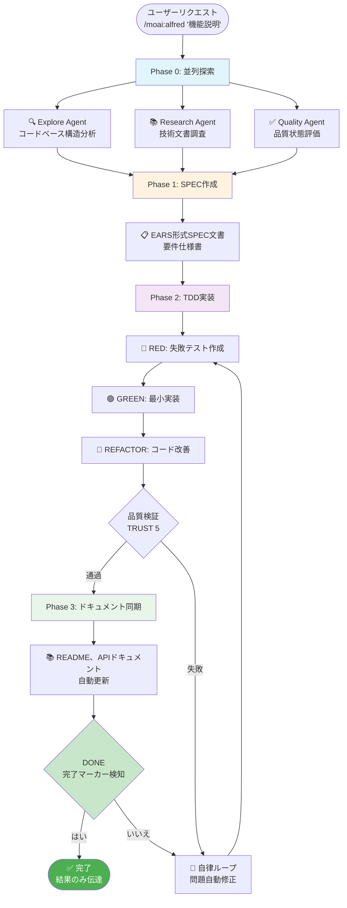
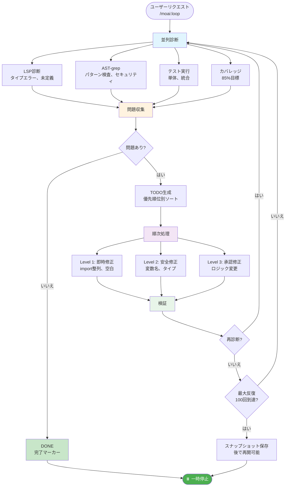
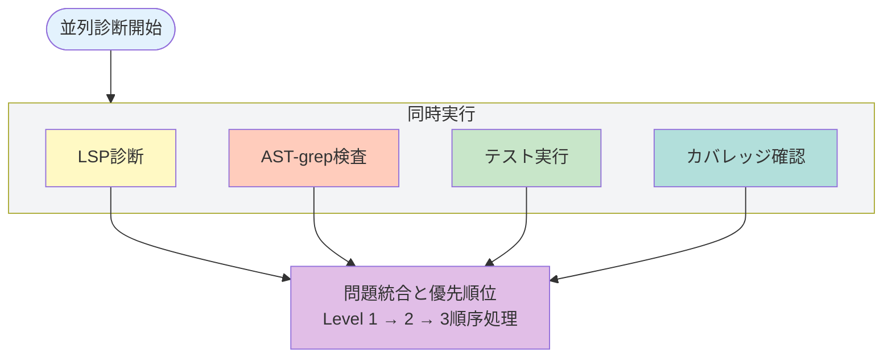
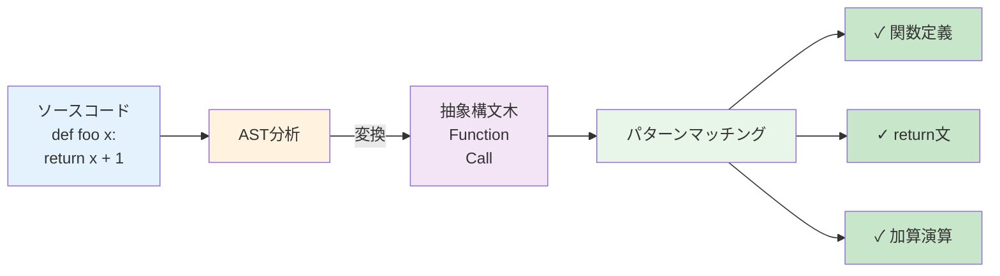
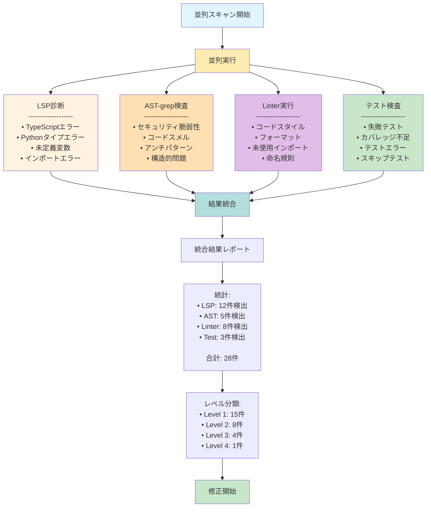
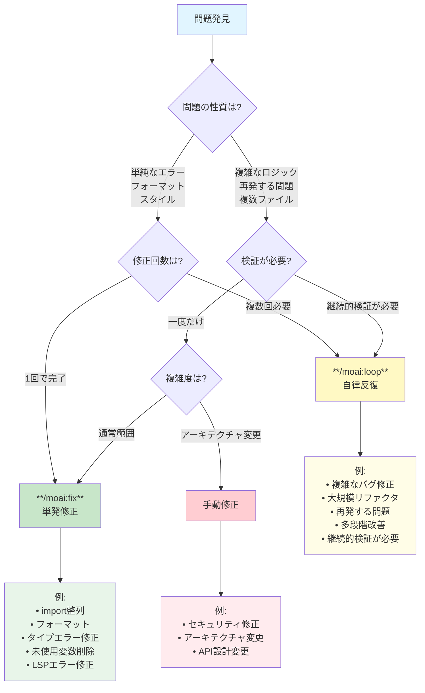
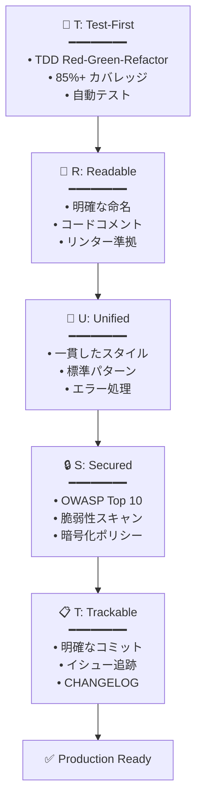

# 🗿 MoAI-ADK: Agentic AI 開発フレームワーク


**利用可能な言語:** [🇰🇷 한국어](./README.ko.md) | [🇺🇸 English](./README.md) | [🇯🇵 日本語](./README.ja.md) | [🇨🇳 中文](./README.zh.md)

[](https://pypi.org/project/moai-adk/)
[](./LICENSE)
[](https://www.python.org/)

> **"バイブコーディングの目的は迅速な生産性ではなく、コード品質である"**

MoAI-ADKは**高品質なコードを作成するAI開発環境**を提供します。SPEC-First TDD、テスト駆動開発、継続的リファクタリング、そして20個の専門AIエージェントが一緒に働きます。

---

## 🎁 MoAI-ADK スポンサー: z.ai GLM 4.7

**💎 コスト効率の良いAI開発のための最適ソリューション**

MoAI-ADKは**z.ai GLM 4.7**とのパートナーシップを通じて、開発者に経済的なAI開発環境を提供します。

### 🚀 GLM 4.7 特別特典

| 特典                  | 説明                                       |
| --------------------- | ------------------------------------------ |
| **💰 70% コスト削減** | Claude比 1/7価格で同等性能                 |
| **⚡ 高速応答**       | 最適化されたインフラで低レイテンシ応答提供 |
| **🔄 互換性**         | Claude Codeと完全互換、別途コード修正不要  |
| **📈 無制限使用**     | 日次/週次トークンリミットなしで自由に使用  |

### 🎁 登録特別割引

**👉 [GLM 4.7 登録 (10% 追加割引)](https://z.ai/subscribe?ic=1NDV03BGWU)**

このリンクから登録すると:

- ✅ **追加10%割引**特典
- ✅ **MoAIオープンソース開発**に貢献 (リワードクレジットはオープンソースプロジェクトに使用されます)

### 💡 使用ガイド

```bash
# 1. GLM APIキー発行
上記リンクから登録後APIキー発行

# 2. MoAI-ADKでGLM設定
moai glm YOUR_API_KEY
```

> **💡 ヒント**: Worktree環境でGLM 4.7を活用すると、Opusで設計してGLMで大量実装してコストを最大70%削減できます。

---

## 🌟 核心価値

- **🎯 SPEC-First**: 明確な仕様書で90%再作業削減
- **🔴 TDD強制**: 85%+テストカバレッジ自動保証
- **🤖 AIオーケストレーション**: 20個専門エージェント + 48個スキル
- **🌐 多言語ルーティング**: 韓国語/英語/日本語/中国語自動サポート
- **🌳 Worktree並列開発**: 完全分離環境で無制限並列作業
- **🏆 MoAI Rank**: バイブコーディングリーダーボードでモチベーション

---

> **📚 詳細は公式オンラインドキュメントを参照してください:** [https://adk.mo.ai.kr](https://adk.mo.ai.kr)

## 1. 30秒インストール

### 🚀 方法1: クイックインストール (推奨)

```bash
curl -LsSf https://modu-ai.github.io/moai-adk/install.sh | sh
```

### 🔧 方法2: 手動インストール

```bash
# Step 1: uv インストール (macOS/Linux)
curl -LsSf https://astral.sh/uv/install.sh | sh

# Step 2: MoAI-ADK インストール
uv tool install moai-adk
```

### 🎨 対話型設定ウィザード

`moai init`コマンド実行時に**9段階対話型ウィザード**が開始されます:


---

#### Step 1: 言語選択

対話言語を選択します。以降の案内がすべて選択した言語で表示されます。

```text
🌐 Language Selection
❯ Select your conversation language: [↑↓] Navigate  [Enter] Select
❯ Japanese (日本語)
  English
  Korean (한국어)
  Chinese (中文)
```

---

#### Step 2: 名前入力

ユーザー名を入力します。AIがパーソナライズされた応答を提供します。

```text
👤 ユーザー設定
❯ ユーザー名を入力してください (選択事項):
```

---

#### Step 3: GLM APIキー入力

Z.AI社のGLM APIキーを入力します。

```text
🔑 APIキー入力
GLM CodePlan API key (optional - press Enter to skip)

✓ 既存GLM APIキーが見つかりました: 99c1a2df...
Enterを押すと既存キー維持、新しいキーを入力すると交換されます

? GLM APIキーを入力してください:
```

> 🎁 **GLM登録特典**: GLMアカウントがない場合は下記リンクで登録してください!
>
> **👉 [GLM 登録 (10% 追加割引)](https://z.ai/subscribe?ic=1NDV03BGWU)**
>
> このリンクから登録すると**追加10%割引**特典を受けられます。
> また、リンクを通じた登録時に発生するリワードは**MoAIオープンソース開発**に使用されます。🙏

---

#### Step 4: プロジェクト設定

プロジェクト名を入力します。

```text
📁 プロジェクト設定
❯ プロジェクト名: MoAI-ADK
```

---

#### Step 5: Git設定

Gitモードを選択します。

```text
🔀 Git設定
❯ Gitモードを選択してください: [↑↓] Navigate  [Enter] Select
❯ manual (ローカルのみ) - ローカルリポジトリのみ使用
  personal (GitHub個人) - GitHub個人アカウント使用
  team (GitHubチーム) - GitHubチーム/組織使用
```

---

#### Step 6: GitHubユーザー名

personal/team選択時にGitHubユーザー名を入力します。

```text
❯ GitHubユーザー名:
```

---

#### Step 7: コミットメッセージ言語

Gitコミットメッセージに使用する言語を選択します。

```text
🗣️ 出力言語設定
❯ コミットメッセージ言語: [↑↓] Navigate  [Enter] Select
  English
❯ Japanese (日本語)
  Korean (한국어)
  Chinese (中文)
```

---

#### Step 8: コードコメント言語

コードコメントに使用する言語を選択します。

```text
❯ コードコメント言語: [↑↓] Navigate  [Enter] Select
  English
❯ Japanese (日本語)
  Korean (한국어)
  Chinese (中文)
```

---

#### Step 9: ドキュメント言語

ドキュメントに使用する言語を選択します。

```text
❯ ドキュメント言語: [↑↓] Navigate  [Enter] Select
  English
❯ Japanese (日本語)
  Korean (한국어)
  Chinese (中文)
```

> 💡 **トークン最適化戦略**: エージェントに指示する内部プロンプトは**英語で固定**されています。
>
> **理由**: 非英語圏言語はClaudeで**12%~20%トークンを追加消費**します。無限反復エージェント作業が多くなるとコストと週次トークンリミットに大きな影響を与えるため、MoAIは内部エージェント指示は英語で固定し**一般対話のみユーザー言語で提供**します。
>
> これがMoAIの**トークン浪費を減らすための取り組み**です。

---

#### Step 10: TAGシステムの有効化

🎯 TAGシステム: TDDのためのコード↔ドキュメント追跡

TAGシステムはコードとSPECドキュメント間の追跡可能性を維持して
TDD(Test-Driven Development)サイクルをサポートします。

TDD目的:
•  RED (テスト作成) → @SPEC SPEC-XXX verify
•  GREEN (コード実装) → @SPEC SPEC-XXX impl
•  REFACTOR (改善) → @SPEC SPEC-XXX implまたはrelated

各コードファイルがどのSPECを実装するか明確に追跡して
ドキュメント中心開発を促進し品質を維持します。

💡 TAGの有効化を推奨します。TDDサイクルでコードとドキュメントの
一貫性を維持して品質と保守性を向上させます。

```text
? TAGシステムを有効にしますか？ (TDD推奨) (Y/n)
```

---

**TAG検証モードガイド**

• warn: 開発中に警告で通知 (デフォルト、推奨)
• enforce: TAG未満時コミット拒否 (厳格な品質管理)
• off: 検証スキップ (推奨しない)

```text
❯ TAG検証モードを選択してください: [↑↓] Navigate  [Enter] Select
❯ warn (警告) - 不足したTAGについて警告のみ表示します。開発中に柔軟対応
  enforce (強制) - TAGが不足するとコミットを拒否します。厳格な品質管理
  off (オフ) - TAG検証をスキップします。推奨しません
```

---

#### インストール完了

すべての設定が完了すると5段階インストールが自動進行します:

```text
🚀 Starting installation...

Phase 1: Preparation and backup...        ████████████████ 100%
Phase 2: Creating directory structure...  ████████████████ 100%
Phase 3: Installing resources...          ████████████████ 100%
Phase 4: Generating configurations...     ████████████████ 100%
Phase 5: Validation and finalization...   ████████████████ 100%

✅ Initialization Completed Successfully!
────────────────────────────────────────────────────────────────

📊 Summary:
  📁 Location:   /path/to/my-project
  🌐 Language:   Auto-detect (use /moai:0-project)
  🔀 Git:        manual (github-flow, branch: manual)
  🌍 Locale:     ja
  📄 Files:      47 created
  ⏱️  Duration:   1234ms

🚀 Next Steps:
  1. Run cd my-project to enter the project
  2. Run /moai:0-project in Claude Code for full setup
  3. Start developing with MoAI-ADK!
```

### 既存プロジェクトに追加

```bash
cd your-existing-project
moai init .
# 既存ファイルはそのまま維持されます
```

---

### 🔄 MoAI-ADK アップデート

既存プロジェクトを最新バージョンにアップデートします。

```bash
moai update
```

**3段階スマートアップデートワークフロー**:

```text
Stage 1: 📦 パッケージバージョン確認
         └─ PyPIで最新バージョン確認 → 必要時自動アップグレード

Stage 2: 🔍 Configバージョン比較
         └─ パッケージテンプレート vs プロジェクト設定比較
         └─ 同一ならスキップ (70-80% 性能向上)

Stage 3: 📄 テンプレート同期
         └─ バックアップ作成 → テンプレートアップデート → ユーザー設定復元
```

**主要オプション**:

```bash
# バージョンのみ確認 (アップデートなし)
moai update --check

# テンプレートのみ同期 (パッケージアップグレードスキップ)
moai update --templates-only

# 設定編集モード (initウィザード再実行)
moai update --config
moai update -c

# バックアップなし強制アップデート
moai update --force

# All is well~ 自動モード (すべての確認自動承認)
moai update --yes
```

**マージ戦略選択**:

```text
🔀 Choose merge strategy:
  [1] Auto-merge (default)
      → テンプレート + ユーザー変更事項自動保存
  [2] Manual merge
      → バックアップ + マージガイド作成 (直接制御)
```

```bash
# Auto-merge強制 (デフォルト)
moai update --merge

# Manual merge強制
moai update --manual
```

**自動保存項目**:

| 項目                     | 説明                                         |
| ------------------------ | -------------------------------------------- |
| **ユーザー設定**         | `.claude/settings.local.json` (MCP, GLM設定) |
| **カスタムエージェント** | テンプレートにないユーザー生成エージェント   |
| **カスタムコマンド**     | ユーザー定義スラッシュコマンド               |
| **カスタムスキル**       | ユーザー定義スキル                           |
| **カスタムフック**       | ユーザー定義フックスクリプト                 |
| **SPECドキュメント**     | `.moai/specs/` フォルダ全体                  |
| **レポート**             | `.moai/reports/` フォルダ全体                |

> 💡 **アップデートヒント**: `moai update -c`でいつでも言語、APIキー、Git設定を変更できます。
> ユーザーのコマンド、エージェント、スキル、フックはmoai以外のフォルダに生成して使用すると良いです。

---

## 2. プロジェクトドキュメント生成 (選択事項)

新規プロジェクトや既存プロジェクトで**Claude Codeがプロジェクトを理解するのを助ける**プロジェクトドキュメントを自動生成できます:

```text
> /moai:0-project
```

### 生成される3つのファイル

| ファイル                     | 目標             | 主要内容                                                               |
| ---------------------------- | ---------------- | ---------------------------------------------------------------------- |
| `.moai/project/product.md`   | **製品概要**     | プロジェクト名/説明、ターゲットユーザー、核心機能、使用事例            |
| `.moai/project/structure.md` | **構造分析**     | ディレクトリツリー、主要フォルダ目的、核心ファイル位置、モジュール構成 |
| `.moai/project/tech.md`      | **技術スタック** | 使用技術、フレームワーク選択理由、開発環境、ビルド/デプロイ設定        |

### なぜ必要なのか？

- **コンテキスト提供**: Claude Codeがプロジェクト文脈を迅速把握
- **一貫性維持**: チームメンバー間のプロジェクト理解度共有
- **オンボーディング加速**: 新規開発者のプロジェクト把握時間短縮
- **AI協業最適化**: より正確なコード提案とレビュー可能

> 💡 **ヒント**: プロジェクト初期または構造変更時に`/moai:0-project`を実行すると最新状態でドキュメントが更新されます。

---

## 3. 核心コマンド集

### 🎯 `/moai:0-project` - プロジェクト初期化

```bash
> /moai:0-project
```

プロジェクトの現在状態を自動分析して最適の開発環境を構成します。プログラミング言語とフレームワークを検出し、Gitワークフローと品質保証基準を自動設定します。すべての構成が完了するとすぐに開発を開始できる準備状態になります。

**作業内容**:

- ✅ プロジェクト構造分析
- ✅ プログラミング言語/フレームワーク検出
- ✅ `.moai/config/config.yaml` 生成
- ✅ Gitワークフロー設定
- ✅ セッションメモリシステム構成
- ✅ 品質保証基準設定

---

### 📋 `/moai:1-plan` - SPEC作成

```bash
> /moai:1-plan "機能説明"
```

EARS形式を使用して曖昧さのない仕様書を自動生成します。要求事項定義、成功基準、テストシナリオを含めて開発方向を明確に提示します。生成されたSPECは開発チームとAIが同一理解を共有する単一ソース（Source of Truth）として作動します。

**自動生成**:

- EARS形式仕様書
- 要求事項定義
- 成功基準
- テストシナリオ

**例**:

```bash
> /moai:1-plan "ユーザープロフィールページ"
# → SPEC-002 生成

> /moai:1-plan "決済API"
# → SPEC-003 生成
```

**重要**: 必ず次に`> /clear`実行

---

### 💻 `/moai:2-run` - TDD実装

```bash
> /moai:2-run SPEC-001
```

Red-Green-Refactorサイクルを通じてテストを先に書き、それを通過するコードを実装します。すべての実装は85%以上のテストカバレッジとリンティング、タイプ検査、セキュリティ検査を通過しなければなりません。TRUST 5品質原則を自動検証して安定したコードのみコミットされます。

**自動実行**:

- 🔴 テスト先作成 (Red)
- 🟢 テスト通過コード (Green)
- 🔵 リファクタリング (Refactor)
- ✅ TRUST 5検証

**検証項目**:

- テストカバレッジ >= 85%
- リンティング通過
- タイプ検査通過
- セキュリティ検査通過

---

### 📚 `/moai:3-sync` - ドキュメント同期

```bash
> /clear  # 同期前に常にclearを実行してセッション初期化後品質検査を実行
> /moai:3-sync SPEC-001
```

品質検証を開始にドキュメント同期、Gitコミット、PR自動化を行います。APIドキュメント、アーキテクチャ図、README、CHANGELOGを自動生成して最新状態を維持します。変更事項を自動コミットしてチームモードではPRをDraftからReadyに転換します。

**自動実行される作業**:

1. **Phase 1: 品質検証**
   - テスト実行 (pytest, jest, go test等)
   - リンター検査 (ruff, eslint, golangci-lint等)
   - タイプチェッカー (mypy, tsc, go vet等)
   - コードレビュー (manager-quality)

2. **Phase 2-3: ドキュメント同期**
   - APIドキュメント自動生成
   - アーキテクチャ図更新
   - README更新
   - SPECドキュメント同期

3. **Phase 4: Git自動化**
   - 変更事項コミット
   - PR Draft → Ready転換
   - (選択) Auto-merge

**実行モード**:

- `auto` (デフォルト): 変更されたファイルのみ選択同期
- `force`: 全体ドキュメント再生成
- `status`: 状態確認のみ実行
- `project`: プロジェクト全体同期

**詳細**: コマンドファイル参照

---

### 🚀 `/moai:alfred` - 完全自律自動化

```bash
> /moai:alfred "機能説明"
```

ユーザーが目標を提示するとAIが自ら探索、計画、実装、検証をすべて行います。並列探索でコードベースを分析し、自律ループを通じて問題を自ら修正します。完了マーカー(`<moai>DONE</moai>`)を検知すると自動終了して開発者は最終結果のみ確認すれば良いです。

#### コンセプトとワークフロー



#### 詳細プロセス

**一度に実行**:

1. **Phase 1: 並列探索** (3-4倍高速分析)
   - **Explore Agent**: コードベース構造、パターン、関連ファイル分析
   - **Research Agent**: 技術文書、ベストプラクティス調査
   - **Quality Agent**: 現在の品質状態、潜在的問題特定

2. **Phase 2: SPEC作成** (EARS形式)
   - 明確な要件定義
   - 受諾基準仕様書
   - ユーザーストーリー作成

3. **Phase 3: TDD実装** (自律ループ)
   - **RED**: 失敗するテストを先に記述
   - **GREEN**: テスト通過最小実装
   - **REFACTOR**: コード品質改善
   - **ループ**: 品質検証失敗時自動問題修正

4. **Phase 4: ドキュメント同期**
   - README、APIドキュメント自動更新
   - CHANGELOG自動生成
   - ユーザーガイド最新化

#### いつ使用するか？

| 状況                 | 説明                               | 例                       |
| -------------------- | ---------------------------------- | ------------------------ |
| **新機能開発**       | 最初から最後までAIが自動処理     | "JWT認証システム追加"     |
| **複雑なリファクタリング** | 複数ファイルに影響大きな変更     | "データベース層再構成"    |
| **バグ修正**         | 原因特定から修正まで自動化       | "ログイン失敗バグ修正"    |
| **SPECベース開発**    | SPEC文書のある機能実装          | `/moai:alfred SPEC-AUTH-001` |

**オプション**:

- `--loop`: 自律反復修正活性化 (AIが自ら問題解決)
- `--max N`: 最大反復回数指定 (デフォルト: 100)
- `--sequential` / `--seq`: 順次探索 (デバッグ用) - 並列がデフォルト
- `--branch`: 機能ブランチ自動作成
- `--pr`: 完了後Pull Request作成
- `--resume SPEC`: 続きから

> **パフォーマンス**: 並列探索がデフォルトになり、3-4倍高速な分析が可能です。`--sequential`はデバッグ用にのみ使用してください。

**例**:

```bash
# 基本自律実行 (並列がデフォルト)
> /moai:alfred "JWT認証追加"

# 自動ループ + 順次探索 (デバッグ用)
> /moai:alfred "JWT認証" --loop --seq

# 続きから
> /moai:alfred resume SPEC-AUTH-001
```

---

### 🔁 `/moai:loop` - 自律反復修正

```bash
> /moai:loop
```

AIが自らLSPエラー、テスト失敗、カバレッジ不足を診断して修正を反復します。並列診断でLSP、AST-grep、Tests、Coverageを同時実行して3-4倍速く問題を解決します。完了マーカーを検知または最大反復回数に到達するまで自律的に実行されます。

#### コンセプトとワークフロー



#### 並列診断詳細

**並列診断** (3.75倍高速):



#### 📖 AST-grepとは？

> **"grepはテキストを探すが、AST-grepはコード構造を探す"**

**概念**:

AST-grepは**構造的コード検査ツール**です。通常のgrepや正規表現がテキストを検索するのとは異なり、AST-grepはコードの**抽象構文木(Abstract Syntax Tree)**を分析してコードの**構造とパターン**を検査します。

**テキスト検索 vs 構造検索**:

| 特徴        | grep/正規表現                 | AST-grep         |
| ----------- | ------------------------------ | ----------------- |
| 検索対象    | テキスト文字列                | コード構造 (AST)  |
| 例          | `print("hello")`             | `print(__)`       |
| 意味         | "print"という文字列検索       | print関数呼び出しパターン検索 |
| 空白感応    | はい (空白、インデント重要)    | いいえ (構造のみ分析) |
| 変数区別    | 困難 (例: `x=1`, `y=1`は別)  | 可能 (全変数代入パターン) |

**動作原理**:



**AST-grepが検知すること**:

1. **セキュリティ脆弱性**
   - SQLインジェクションパターン: `execute(f"SELECT * FROM users WHERE id={user_input}")`
   - ハードコードされたパスワード: `password = "123456"`
   - 安全でない関数使用: `eval(user_input)`

2. **コードスメル (Code Smells)**
   - 重複コード: 類似構造の反復
   - 長い関数: 複雑すぎる
   - マジックナンバー: `if x == 42` (意味のない数字)

3. **アンチパターン (Anti-patterns)**
   - 空のexceptブロック: `except: pass`
   - 大域変数修正
   - 循環依存

4. **ベストプラクティス違反**
   - タイプヒント欠如
   - ドキュメント化欠如
   - エラー処理欠如

**例シナリオ**:

```python
# AST-grepが問題を見つけるコード例
def process_user_input(user_input):
    # ⚠️ 警告: eval使用 (セキュリティ脆弱性)
    result = eval(user_input)

    # ⚠️ 警告: 空のexcept (アンチパターン)
    try:
        save_to_database(result)
    except:
        pass

    # ⚠️ 警告: マジックナンバー (コードスメル)
    if result > 42:
        return True
```

**なぜ重要か？**

- **正確性**: コードの意味を理解して検査するので誤検知(False Positive)が少ない
- **40言語サポート**: Python、TypeScript、Go、Rust、Javaなど多様な言語で動作
- **自動修正可能**: パターンを見つけるだけでなく自動修正提案も生成
- **セキュリティ強化**: OWASP Top 10などセキュリティ脆弱性を自動検知

**MoAI-ADKでの活用**:

`/moai:loop`と`/moai:fix`コマンドでAST-grepは並列診断の中核構成要素として動作します:

- **LSP**: タイプエラー、定義検索
- **AST-grep**: 構造的パターン、セキュリティ脆弱性 ← **これが私たちの関心事!**
- **Tests**: テスト失敗
- **Coverage**: カバレッジ不足

この4つが**同時実行**されてコード品質を3.75倍速く診断します。

---

#### 詳細プロセス

**自律ループフロー**:

1. **並列診断** (同時実行)
   - **LSP**: タイプエラー、未定義、潜在的バグ
   - **AST-grep**: コードパターン検査、セキュリティ脆弱性
   - **Tests**: 単体テスト、統合テスト実行
   - **Coverage**: 85%カバレッジ目標達成確認

2. **TODO生成** (優先順位別)
   - Level 1: 即時修正 (import整列、空白、フォーマット)
   - Level 2: 安全修正 (変数名、タイプ追加)
   - Level 3: 承認修正 (ロジック変更、API修正)
   - Level 4: 手動必要 (セキュリティ、アーキテクチャ)

3. **順次修正**
   - TODO項目を一つずつ処理
   - 各修正後検証
   - 失敗時再診断

4. **反復または完了**
   - 全問題解決時 `<moai>DONE</moai>` マーカー
   - 最大100回反復後スナップショット保存

#### いつ使用するか？

| 状況                  | 説明                             | 例                           |
| --------------------- | -------------------------------- | ---------------------------- |
| **実装後品質確保**     | コード作成後自動品質改善       | 機能実装後 `/moai:loop` 実行 |
| **テスト失敗修正**      | テスト失敗を自動分析修正       | テスト実行後失敗時          |
| **カバレッジ向上**      | 85%目標を自動達成             | 新コード作成後               |
| **リファクタリング**     | コード品質を継続的に改善       | 定期的実行で保守             |

**オプション**:

- `--max N`: 最大反復回数 (デフォルト: 100)
- `--auto`: 自動修正活性化 (Level 1-3)
- `--sequential` / `--seq`: 順次診断 (デバッグ用) - 並列がデフォルト
- `--errors`: エラーのみ修正
- `--coverage`: カバレッジ包含 (100%目標)
- `--resume ID`: スナップショット復元

> **パフォーマンス**: 並列診断がデフォルトになり、LSP、AST-grep、Tests、Coverageを同時実行します (3.75倍高速)。

**例**:

```bash
# 基本自律ループ (並列がデフォルト)
> /moai:loop

# 順次 + 自動修正 (デバッグ用)
> /moai:loop --seq --auto

# 最大50回反復
> /moai:loop --max 50

# スナップショット復元
> /moai:loop --resume latest
```

---

### 🔧 `/moai:fix` - 単発自動修正

```bash
> /moai:fix
```

**「一回の実行で、一度に修正」**

LSPエラー、linting問題、AST-grepパターンを並列でスキャンして、検出された問題を一回の実行で一度に修正します。Level 1-2は即時修正し、Level 3はユーザー承認後修正し、Level 4は手動修正が必要だと報告します。`--dry`オプションでプレビュー確認後、実際の修正を適用できます。

---

#### 🎯 コンセプトとワークフロー

`/moai:fix`は**一回の実行で終わる単発修正**コマンドです。自律的にループする`/moai:loop`とは異なり、スキャン→修正→報告の順序で一度だけ実行します。

```mermaid
flowchart TB
    Start[/moai:fix 開始] --> Scan[並列スキャン実行]

    Scan --> LSP[LSP診断]
    Scan --> AST[AST-grep検査]
    Scan --> Linter[Linter実行]
    Scan --> Test[テスト実行]

    LSP --> Gather[結果収集]
    AST --> Gather
    Linter --> Gather
    Test --> Gather

    Gather --> Analyze[問題分析と分類]

    Analyze --> Level1{Level判定}
    Level1 -->|Level 1<br/>即時修正| Fix1[自動修正]
    Level1 -->|Level 2<br/>安全修正| Fix2[ログ記録後修正]
    Level1 -->|Level 3<br/>承認必要| Ask{ユーザー承認}
    Level1 -->|Level 4<br/>手動必要| Report[報告のみ]

    Ask -->|承認| Fix3[修正実行]
    Ask -->|拒否| Skip[スキップ]

    Fix1 --> Verify[修正検証]
    Fix2 --> Verify
    Fix3 --> Verify
    Skip --> Verify
    Report --> End[完了報告]

    Verify --> TestCheck{テスト実行?}
    TestCheck -->|是| TestRun[テスト実行]
    TestCheck -->|否| End
    TestRun --> TestPass{パス?}
    TestPass -->|是| End
    TestPass -->|否| Ask

    style Start fill:#e1f5ff
    style End fill:#c8e6c9
    style LSP fill:#fff3e0
    style AST fill:#fff3e0
    style Linter fill:#fff3e0
    style Test fill:#fff3e0
    style Fix1 fill:#c8e6c9
    style Fix2 fill:#c8e6c9
    style Fix3 fill:#c8e6c9
    style Report fill:#ffcdd2
    style Ask fill:#fff9c4
```

---

#### 🔍 並列スキャン詳細

**4つの診断ツールを並列実行して、3.75倍高速にスキャンします**。



**並列実行によるパフォーマンス向上**:

- 順次実行: 150秒 (LSP 45s + AST 35s + Linter 40s + Test 30s)
- 並列実行: 40秒 (最も遅いツールの時間)
- **高速化**: 3.75倍向上

---

#### 📋 修正レベルとプロセス

各問題は複雑度に応じて4つのレベルに分類されます。

| Level | 説明           | 承認   | 例                                   | 自動修正可否 |
| ----- | -------------- | ------ | ------------------------------------ | ------------ |
| 1     | 即時修正       | 不要   | インポート整列、空白、フォーマット    | ✅ 可能      |
| 2     | 安全修正       | ログのみ | 変数名、タイプ追加、単純なリファクタ | ✅ 可能      |
| 3     | 承認必要       | 必要   | ロジック変更、API修正、メソッド置換  | ⚠️ 承認後    |
| 4     | 手動必要       | 不可   | セキュリティ、アーキテクチャ         | ❌ 不可能    |

**修正プロセス**:

1. **スキャン並列実行**: LSP、AST-grep、Linter、Testを同時に実行
2. **結果統合**: すべての診断結果を統合して重複排除
3. **レベル分類**: 各問題をレベル1-4に分類
4. **修正実行**:
   - Level 1: 即時修正（ログのみ記録）
   - Level 2: 安全修正（変更内容をログ記録）
   - Level 3: ユーザー承認後修正
   - Level 4: 手動修正が必要と報告
5. **検証**: 修正後にテスト実行して回帰検証
6. **完了報告**: 修正内容と統計を報告

---

#### 🎬 いつ使うべきか

| 状況                           | 推奨コマンド    | 理由                                           |
| ------------------------------ | --------------- | ---------------------------------------------- |
| 日常的なコード品質維持         | `/moai:fix`     | 迅速な単発修正、ループ不要                     |
| CI失敗の原因を一括修正         | `/moai:fix`     | 一回の実行で全問題修正                         |
| 新機能実装後のクリーンアップ   | `/moai:fix`     | 一括フォーマットとスタイル修正                 |
| 複雑な再発するバグ             | `/moai:loop`    | 継続的な修正と検証が必要                       |
| 大規模リファクタリング         | `/moai:loop`    | 多段階修正と段階的検証が必要                   |
| PR作成前の最終確認             | `/moai:fix`     | 1回の実行でクリーンアップ                     |
| レガシーコードの大幅改善       | `/moai:loop`    | 何度も反復して段階的に改善                     |

---

#### 🔀 `/moai:fix` vs `/moai:loop` 選択ガイド

**どちらを使うか迷ったら、このフローチャートで決定できます**。



**要約**:

- **`/moai:fix`**: 一回の実行で終わる、日常的な問題修正に最適
- **`/moai:loop`**: 継続的な修正と検証が必要な複雑な問題に最適
- **手動修正**: アーキテクチャ変更やセキュリティ修正など、人的判断が必要

---

#### 🛠️ オプションと使用例

```bash
# 基本修正（並列がデフォルト）
> /moai:fix

# プレビューのみ（実際修正なし）
> /moai:fix --dry

# 順次スキャン（デバッグ用）
> /moai:fix --seq

# レベル3以下のみ修正
> /moai:fix --level 3

# エラーのみ修正
> /moai:fix --errors

# セキュリティ検査包含
> /moai:fix --security

# 特定ファイル
> /moai:fix src/auth.py

# フォーマットスキップ
> /moai:fix --no-fmt
```

---

> **💡 パフォーマンス**: 並列スキャンがデフォルトになり、LSP、AST-grep、Linterを同時実行します（3.75倍高速）。

---

### ⏹️ `/moai:cancel-loop` - ループキャンセル

```bash
> /moai:cancel-loop
```

実行中の自律ループを安全にキャンセルしてすべての進行状態をスナップショットで保存します。キャンセル時TODO状態、修正履歴、反復回数がすべて保存されて後で続きから継続できます。`--list`オプションで以前スナップショットを確認して特定時点で復元できます。

**オプション**:

- `--force`: 確認なしキャンセル
- `--snapshot`: スナップショット保存
- `--keep`: stateファイル保存
- `--reason TEXT`: キャンセル事由記録
- `--list`: スナップショットリスト確認

**復元**:

```bash
# 最新スナップショット復元
> /moai:loop --resume latest

# 特定スナップショット復元
> /moai:loop --resume cancel-20240111-105230
```

**例**:

```bash
# 基本キャンセル (確認後)
> /moai:cancel-loop

# 強制キャンセル
> /moai:cancel-loop --force

# スナップショット保存
> /moai:cancel-loop --snapshot

# スナップショットリスト
> /moai:cancel-loop --list
```

**実際出力結果**:

```text

⏺ ✅ ループキャンセル完了

  状態報告

  ═══════════════════════════════════════════════════════
           Loop: Cancelled (No Active Loop)
  ═══════════════════════════════════════════════════════

  ### Status
  - 実行中ループ: なし
  - 完了作業: 100%
  - 残りTODO: 0個

  ### Completed Tasks
  ✅ README.ja.md "3. 核心コマンド集" セクション更新
  ✅ Fenced code blocks言語指定追加 (MD040) - 9件
  ✅ Emphasis → Heading変更 (MD036) - 2件
  ✅ Table column style修正 (MD060) - 2件

  ### Changes Summary
  - コマンド個数: 4個 → 8個 (loop, fix, cancel-loop追加)
  - 説明スタイル: 簡単リスト → 3文以上詳細説明
  - Markdown linting: 13件問題 → 0件

  ═══════════════════════════════════════════════════════

  最終ファイル状態

  README.ja.md:
  - すべてmarkdown linting問題解決
  - 8個核心コマンド詳細説明完了
  - 標準markdown形式準拠

  ---
  すべての作業が正常完了しました！🎉
```

---

## 4. 🤖 All is Well - エージェンティック自律自動化

**MoAI-ADKの最も強力な機能**: AIが自ら探索し、計画し、実装し、検証を完了マーカー検出まで繰り返します。

### 核心コンセプト

```text
ユーザー: "認証機能追加"
  ↓
AI: 探索 → 計画 → 実装 → 検証 → 繰り返し
  ↓
AI: すべての問題解決
  ↓
AI: <moai>DONE</moai>  ← 完了マーカー
```

### 3つのコマンド階層

| コマンド             | タイプ      | 説明                                          |
| -------------------- | ----------- | --------------------------------------------- |
| `/moai:fix`          | 単発        | 1回スキャン + 自動修正                        |
| `/moai:loop`         | 自律ループ  | 完了マーカー または 最大回数まで繰り返し修正  |
| `/moai:alfred`       | 完全自律    | 目標 → SPEC → 実装 → ドキュメント全過程自動化 |

### コマンドチェーン関係

```text
/moai:alfred
  ├── Phase 0: 並列探索 (Explore + Research + Quality)
  ├── Phase 1: /moai:1-plan (SPEC生成)
  ├── Phase 2: /moai:2-run (TDD実装)
  │     └── /moai:loop (自律ループ)
  │           └── /moai:fix (単発修正) × N回
  └── Phase 3: /moai:3-sync (ドキュメント同期)
```

### 完了マーカー

AIが作業完了時にマーカーを追加して自律ループが終了します:

| マーカー               | 説明       |
| ---------------------- | ---------- |
| `<moai>DONE</moai>`    | 作業完了   |
| `<moai>COMPLETE</moai>`| 全体完了   |
| `<moai:done />`        | XML形式    |

### 自動修正レベル

| Level | 説明     | 承認     | 例                           |
| ----- | -------- | -------- | ---------------------------- |
| 1     | 即時修正 | 不要     | import整列、空白             |
| 2     | 安全修正 | ログのみ | 変数名、タイプ追加           |
| 3     | 承認必要 | 必要     | ロジック変更、API修正        |
| 4     | 手動必要 | 不可     | セキュリティ、アーキテクチャ |

### クイックスタート

```bash
# 1回修正 (並列がデフォルト)
> /moai:fix

# 自律ループ (完了マーカーまで、並列がデフォルト)
> /moai:loop --auto

# 完全自律自動化 (All is Well!、並列がデフォルト)
> /moai:alfred "JWT認証追加" --loop

# 続きから
> /moai:alfred resume SPEC-AUTH-001
```

---

## 5. Mr.AlfredとSub-Agents

### 🎩 Mr.Alfred - Super Agent (首席オーケストレーター)

**役割**: ユーザーリクエストを分析して適切な専門エージェントに委任

**作業フロー**:

1. **Understand**: リクエスト分析及び明確化
2. **Plan**: Planエージェントを通じ実行計画策定
3. **Execute**: 専門エージェントに作業委任 (順次/並列)
4. **Integrate**: 結果統合及びユーザー報告

### 🌐 多言語自動ルーティング (NEW)

Alfredは4つの言語リクエストを自動認識して正しいエージェントを呼び出します:

| リクエスト言語 | 例                          | 呼出エージェント |
| -------------- | --------------------------- | ---------------- |
| 英語           | "Design backend API"        | expert-backend   |
| 韓国語         | "백엔드 API 설계해줘"       | expert-backend   |
| 日本語         | "バックエンドAPIを設計して" | expert-backend   |
| 中国語         | "设计后端API"               | expert-backend   |

---

### 🔧 Tier 1: ドメイン専門家 (8個)

| エージェント           | 専門分野                         | 使用例                       |
| ---------------------- | -------------------------------- | ---------------------------- |
| **expert-backend**     | FastAPI, Django, DB設計          | API設計、クエリ最適化        |
| **expert-frontend**    | React, Vue, Next.js              | UIコンポーネント、状態管理   |
| **expert-security**    | セキュリティ分析、OWASP          | セキュリティ監査、脆弱性分析 |
| **expert-devops**      | Docker, K8s, CI/CD               | デプロイ自動化、インフラ     |
| **expert-debug**       | バグ分析、性能                   | 問題診断、ボトルネック解決   |
| **expert-performance** | プロファイリング、最適化         | 応答時間改善                 |
| **expert-refactoring** | コードリファクタリング、AST-Grep | 大規模コード変換             |
| **expert-testing**     | テスト戦略、E2E                  | テスト計画、カバレッジ       |

---

### 🎯 Tier 2: ワークフロー管理者 (8個)

| エージェント            | 役割                 | 自動呼出時期      |
| ----------------------- | -------------------- | ----------------- |
| **manager-spec**        | SPEC作成 (EARS)      | `/moai:1-plan`    |
| **manager-tdd**         | TDD自動実行          | `/moai:2-run`     |
| **manager-docs**        | ドキュメント自動生成 | `/moai:3-sync`    |
| **manager-quality**     | TRUST 5検証          | 実装完了後        |
| **manager-strategy**    | 実行戦略策立         | 複雑な企画時      |
| **manager-project**     | プロジェクト初期化   | `/moai:0-project` |
| **manager-git**         | Gitワークフロー      | ブランチ/PR管理   |
| **manager-claude-code** | Claude Code統合      | 設定最適化        |

---

### 🏗️ Tier 3: Claude Code Builder (4個)

| エージェント        | 役割               | 使用例                     |
| ------------------- | ------------------ | -------------------------- |
| **builder-agent**   | 新エージェント生成 | 組織専門家エージェント     |
| **builder-skill**   | 新スキル生成       | チーム専用スキルモジュール |
| **builder-command** | 新コマンド生成     | カスタムワークフロー       |
| **builder-plugin**  | プラグイン生成     | デプロイ用プラグイン       |

---

## 6. Agent-Skills

### 📚 スキルライブラリ構造

```text
🏗️ Foundation (5)    → 核心哲学、実行ルール
🎯 Domain (4)        → ドメイン専門知識
💻 Language (16)     → 16個プログラミング言語
🚀 Platform (10)     → クラウド/BaaS統合
📋 Workflow (7)      → 自動化ワークフロー
📚 Library (4)       → 特殊ライブラリ
🛠️ Tool (2)          → 開発ツール
```

### よく使うスキル組合せ

| 目的                 | スキル組合せ                                                             |
| -------------------- | ------------------------------------------------------------------------ |
| **バックエンドAPI**  | `moai-lang-python` + `moai-domain-backend` + `moai-platform-supabase`    |
| **フロントエンドUI** | `moai-lang-typescript` + `moai-domain-frontend` + `moai-library-shadcn`  |
| **ドキュメント生成** | `moai-library-nextra` + `moai-workflow-docs` + `moai-library-mermaid`    |
| **テスト**           | `moai-lang-python` + `moai-workflow-testing` + `moai-foundation-quality` |

### スキル使用法

```python
# 方法1: 直接呼出 (Agent)
Skill("moai-lang-python")

# 方法2: Alfred自動選択 (一般ユーザー)
"FastAPIサーバー作成して"
→ Alfredが自動でmoai-lang-python選択
```

---

## 7. TRUST 5品質原則

MoAI-ADKのすべてプロジェクトは**TRUST 5**品質フレームワークに従います。

### 🏆 TRUST 5 = Test + Readable + Unified + Secured + Trackable



### T - Test-First (テスト優先)

**原則**: すべての実装はテストから開始

**検証**:

- テストカバレッジ >= 85%
- 失敗するテスト先作成 (Red)
- テスト通過コード (Green)
- リファクタリング (Refactor)

### R - Readable (可読性)

**原則**: コードは明確で理解しやすいべき

**検証**:

- 明確な変数名
- 複雑なロジックにコメント
- コードレビュー通過
- リンター検査通過

### U - Unified (統一性)

**原則**: プロジェクト全体に一貫したスタイル維持

**検証**:

- プロジェクトスタイルガイド準拠
- 一貫した命名規則
- 統一されたエラー処理
- 標準ドキュメント形式

### S - Secured (セキュリティ)

**原則**: すべてのコードはセキュリティ検査通過

**検証**:

- OWASP Top 10チェック
- 依存関係脆弱性スキャン
- 暗号化ポリシー準拠
- アクセス制御検証

### T - Trackable (追跡可能性)

**原則**: すべての変更は明確に追跡可能

**検証**:

- 明確なコミットメッセージ
- イシュー追跡 (GitHub Issues)
- CHANGELOG維持
- コードレビュー記録

---

## 8. 自動品質検査

### 🔍 AST-Grep基盤構造的検査

**AST-Grep**はテキストではなく**コード構造**を分析します:

| 機能                         | 説明                  | 例                                           |
| ---------------------------- | --------------------- | -------------------------------------------- |
| **構造的検索**               | ASTパターンマッチング | パラメータ化されないSQLクエリ探求            |
| **セキュリティスキャン**     | 自動脆弱点探知        | SQL Injection, XSS, ハードコードされた秘密鍵 |
| **パターンリファクタリング** | 安全コード変換        | 変数名一括変更、関数抽出                     |
| **多言語サポート**           | 40+ 言語              | Python, TypeScript, Go, Rust...              |

### 自動検査フロー

```text
コード作成
    ↓
[Hook] AST-Grep 自動スキャン
    ↓
⚠️  脆弱点発見時即時通知
    ↓
✅ 安全コードでリファクタリング
```

**検出例**:

```bash
⚠️  AST-Grep: Potential SQL injection in src/auth.py:47
   Pattern: execute(f"SELECT * FROM users WHERE id={user_id}")
   Suggestion: execute("SELECT * FROM users WHERE id=%s", (user_id,))
```

---

## 9. 📊 Statuslineカスタマイズ

MoAI-ADKはClaude Codeターミナルにリアルタイム状態情報を表示するカスタマイズ可能なstatuslineを提供します。

### デフォルトレイアウト

```text
🤖 Opus 4.5 | 💰 152K/200K | 💬 Mr. Alfred | 📁 MoAI-ADK | 📊 +0 M58 ?5 | 💾 57.7MB | 🔀 main
```

### 使用可能なコンポーネント

| アイコン | コンポーネント | 説明 | 設定キー |
| -------- | -------------- | ---- | -------- |
| 🤖 | モデル | Claudeモデル (Opus, Sonnet等) | `model` |
| 💰 | コンテキスト | コンテキストウィンドウ使用量 (例: 77K/200K) | `context_window` |
| 💬 | スタイル | アクティブアウトプットスタイル (例: Mr. Alfred) | `output_style` |
| 📁 | ディレクトリ | 現在のプロジェクト名 | `directory` |
| 📊 | Git状態 | ステージング/修正/追跡されないファイル数 | `git_status` |
| 💾 | メモリ | プロセスメモリ使用量 | `memory_usage` |
| 🔀 | ブランチ | 現在のGitブランチ | `branch` |
| 🔅 | バージョン | Claude Codeバージョン (オプション) | `version` |

### 設定

`.moai/config/statusline-config.yaml`で表示項目を設定します:

```yaml
display:
  model: true           # 🤖 Claudeモデル
  context_window: true  # 💰 コンテキストウィンドウ
  output_style: true    # 💬 アウトプットスタイル
  directory: true       # 📁 プロジェクト名
  git_status: true      # 📊 Git状態
  memory_usage: true    # 💾 メモリ使用量
  branch: true          # 🔀 Gitブランチ
  version: 1.1.0        # 🔅 バージョン (オプション)
  active_task: true     # アクティブタスク
```

### メモリコレクター

`memory_usage`が有効な場合、MoAI-ADKは`psutil`を使用してリアルタイムメモリ使用量を収集します:

- **プロセスメモリ**: 現在のPythonプロセスのRSS (常駐セットサイズ)
- **キャッシング**: 10秒TTLで性能最適化
- **クロスプラットフォーム**: macOS, Linux, Windowsサポート
- **グレースフルデグラデーション**: psutilが使用不可な場合は"N/A"表示

### ディスプレイモード

| モード | 最大長 | 使用ケース |
| ------ | ------ | ---------- |
| `compact` | 80文字 | 標準ターミナル |
| `extended` | 120文字 | ワイドターミナル |
| `minimal` | 40文字 | 狭いターミナル |

モード設定:

```bash
export MOAI_STATUSLINE_MODE=extended
```

---

## 10. 🌳 Worktree並列開発

MoAI-ADKの核心革新: **Worktreeで完全分離、無制限並列開発**

### 💡 なぜWorktreeなのか？

**問題点**: `moai glm`/`moai cc`でLLMを変更すると**すべて開かれたセッション**に適用されます。同一セッションでモデルを変更すると認証エラーでその後進行が困難です。

**解決策**: Git Worktreeで各SPECを完全分離して独立LLM設定維持

---

### 📦 Worktreeワークフロー

```text
┌─────────────────────────────────────────────────────────────────┐
│  ターミナル1 (Claude Opus) - SPEC設計専用                        │
│  ━━━━━━━━━━━━━━━━━━━━━━━━━━━━━━━━━━━━━━━━━━━━━━━━━━━━━━━━━━━━━  │
│  $ cd my-project                                                │
│  $ claude                                                        │
│                                                                  │
│  > /moai:1-plan "ユーザー認証システム" --worktree                   │
│  ✅ SPEC-AUTH-001 生成完了                                      │
│  ✅ Worktree生成: ~/moai/worktrees/my-project/SPEC-AUTH-001     │
│  ✅ Branch: feature/SPEC-AUTH-001                                │
│                                                                  │
│  > /moai:1-plan "決済システム" --worktree                          │
│  ✅ SPEC-PAY-002 生成完了                                       │
│  ✅ Worktree生成: ~/moai/worktrees/my-project/SPEC-PAY-002      │
│                                                                  │
│  > /moai:1-plan "ダッシュボードUI" --worktree                         │
│  ✅ SPEC-UI-003 生成完                                        │
│  ✅ Worktree生成: ~/moai/worktrees/my-project/SPEC-UI-003       │
│                                                                  │
│  💡 OpusですべてSPEC計画完了 (セッション維持中...)                  │
└─────────────────────────────────────────────────────────────────┘

┌─────────────────────────────────────────────────────────────────┐
│  ターミナル2 - SPEC-AUTH-001 Worktree (GLM 4.7)                    │
│  ━━━━━━━━━━━━━━━━━━━━━━━━━━━━━━━━━━━━━━━━━━━━━━━━━━━━━━━━━━━━━  │
│  $ moai-worktree go SPEC-AUTH-001                                │
│  # または省略形: moai-wt go SPEC-AUTH-001                          │
│                                                                  │
│  📁 現在位置: ~/moai/worktrees/my-project/SPEC-AUTH-001        │
│  🔀 Branch: feature/SPEC-AUTH-001                                │
│                                                                  │
│  $ moai glm                                                       │
│  ✅ Switched to GLM backend                                      │
│                                                                  │
│  $ claude                                                        │
│  > /moai:2-run SPEC-AUTH-001                                     │
│  🔄 TDD実行中... (Red → Green → Refactor)                       │
│  ✅ 実装完了!                                                   │
│  ✅ テスト通過 (Coverage: 92%)                                  │
│                                                                  │
│  > /moai:3-sync SPEC-AUTH-001                                    │
│  ✅ ドキュメント同期完了                                             │
│                                                                  │
│  # 完了後マージ                                                   │
│  $ git checkout main                                             │
│  $ git merge feature/SPEC-AUTH-001                               │
│  $ moai-worktree clean --merged-only                             │
└─────────────────────────────────────────────────────────────────┘

┌─────────────────────────────────────────────────────────────────┐
│  ターミナル3 - SPEC-PAY-002 Worktree (GLM 4.7)                     │
│  ━━━━━━━━━━━━━━━━━━━━━━━━━━━━━━━━━━━━━━━━━━━━━━━━━━━━━━━━━━━━━  │
│  $ moai-wt go SPEC-PAY-002                                       │
│  $ moai glm                                                       │
│  $ claude                                                        │
│                                                                  │
│  > /moai:alfred SPEC-PAY-002                                     │
│  🔄 Plan → Run → Sync 自動実行                                  │
│  ✅ 完了!                                                        │
│                                                                  │
│  $ git checkout main && git merge feature/SPEC-PAY-002           │
└─────────────────────────────────────────────────────────────────┘

┌─────────────────────────────────────────────────────────────────┐
│  ターミナル4 - SPEC-UI-003 Worktree (GLM 4.7)                      │
│  ━━━━━━━━━━━━━━━━━━━━━━━━━━━━━━━━━━━━━━━━━━━━━━━━━━━━━━━━━━━━━  │
│  $ moai-wt go SPEC-UI-003                                        │
│  $ moai glm                                                       │
│  $ claude                                                        │
│  > /moai:alfred SPEC-UI-003                                      │
│  ✅ 完了!                                                        │
└─────────────────────────────────────────────────────────────────┘
```

---

### 🎯 核心ワークフロー

#### Phase 1: Claude 4.5 Opusで計画 (ターミナル1)

```bash
/moai:1-plan "機能説明" --worktree
```

- ✅ SPECドキュメント生成
- ✅ Worktree自動生成
- ✅ 機能ブランチ自動生成

#### Phase 2: GLM 4.7で実装 (ターミナル2, 3, 4...)

```bash
moai-wt go SPEC-ID
moai glm
claude
> /moai:2-run SPEC-ID
> /moai:3-sync SPEC-ID
```

- ✅ 独立した作業環境
- ✅ GLMコスト効率
- ✅ 衝突なし並列開発

**Phase 3: マージ及び整理**

```bash
# 方法1: 一括完了 (推奨)
moai-wt done SPEC-ID              # checkout main → merge → cleanup
moai-wt done SPEC-ID --push       # 上記 + リモートプッシュ

# 方法2: 手動処理
git checkout main
git merge feature/SPEC-ID
moai-wt clean --merged-only
```

---

### ✨ Worktree長所

| 長所           | 説明                                  |
| -------------- | ------------------------------------- |
| **完全分離**   | 各SPECが独立Git状態、ファイル衝突なし |
| **LLM独立**    | 各Worktreeで別LLM設定可能             |
| **無制限並列** | 依存性なし無制限SPEC並列開発          |
| **安全マージ** | 完了SPECのみ順次的にmainにマージ      |

---

### 📊 Worktreeコマンド

| コマンド                 | 説明                           | 使用例                           |
| ------------------------ | ------------------------------ | -------------------------------- |
| `moai-wt new SPEC-ID`    | 新Worktree生成                 | `moai-wt new SPEC-AUTH-001`      |
| `moai-wt go SPEC-ID`     | Worktree進入 (新シェル開く)    | `moai-wt go SPEC-AUTH-001`       |
| `moai-wt list`           | Worktreeリスト確認             | `moai-wt list`                   |
| `moai-wt done SPEC-ID`   | マージ後整理 (checkout→merge)  | `moai-wt done SPEC-AUTH-001`     |
| `moai-wt remove SPEC-ID` | Worktree削除                   | `moai-wt remove SPEC-AUTH-001`   |
| `moai-wt status`         | Worktree状態及びレジストリ確認 | `moai-wt status`                 |
| `moai-wt sync [SPEC-ID]` | Worktree同期                   | `moai-wt sync --all`             |
| `moai-wt clean`          | マージWorktree整理             | `moai-wt clean --merged-only`    |
| `moai-wt recover`        | ディスクからレジストリ復復     | `moai-wt recover`                |
| `moai-wt config`         | Worktree設定確認               | `moai-wt config root`            |

---

## 11. CLAUDE.mdの理解

MoAI-ADKインストール後、プロジェクトルートに生成される`CLAUDE.md`は**Alfred（AIオーケストレーター）の実行指示書**です。このファイルはClaude Codeがプロジェクトでどのように動作するかを定義します。

### CLAUDE.mdとは？

`CLAUDE.md`はClaude Codeがセッション開始時に自動的に読み込むプロジェクト設定ファイルです。MoAI-ADKではこのファイルを通じて**Alfredオーケストレーター**の行動規則を定義します。

```text
📁 プロジェクトルート
├── CLAUDE.md              ← Alfred実行指示書（変更非推奨）
├── CLAUDE.local.md        ← 個人カスタム指示（オプション）
├── .claude/
│   ├── settings.json      ← Claude Code設定
│   ├── agents/            ← サブエージェント定義
│   ├── commands/          ← スラッシュコマンド
│   └── skills/            ← スキル定義
└── .moai/
    └── config/            ← MoAI設定
```

### CLAUDE.mdコア構造

| セクション | 説明 | 主要内容 |
|-----------|------|---------|
| **Core Identity** | Alfredの役割定義 | 戦略的オーケストレーター、HARDルール |
| **Request Processing Pipeline** | リクエスト処理フロー | Analyze → Route → Execute → Report |
| **Command Reference** | コマンド分類 | Type A (Workflow), Type B (Utility), Type C (Feedback) |
| **Agent Catalog** | サブエージェントリスト | Manager 8個, Expert 8個, Builder 4個 |
| **SPEC-Based Workflow** | SPEC基盤開発 | Plan → Run → Sync フロー |
| **Quality Gates** | 品質検証ルール | HARD/SOFTルールチェックリスト |
| **Configuration Reference** | 設定参照 | 言語、出力形式ルール |

### 使用方法：変更しないでください

> **推奨**：`CLAUDE.md`は**変更せずそのまま使用**してください。

**理由**：
- MoAI-ADKアップデート時に自動的に最新バージョンに置き換えられます
- 変更するとアップデート時に競合が発生する可能性があります
- エージェント間の一貫した動作を保証します

```bash
# アップデート時CLAUDE.mdは自動的に最新化
moai update
```

### カスタマイズ：CLAUDE.local.mdを使用

追加指示が必要な場合は**`CLAUDE.local.md`**ファイルを作成してください。

```bash
# プロジェクトルートにCLAUDE.local.mdを作成
touch CLAUDE.local.md
```

**CLAUDE.local.md例**：

```markdown
# プロジェクトローカル指示

## コーディングスタイル
- すべての関数に型ヒント必須
- docstringはGoogleスタイル使用

## プロジェクト特殊ルール
- APIレスポンスは常にsnake_case使用
- テストファイルはtest_プレフィックス必須

## 禁止事項
- console.log使用禁止（logger使用）
- any型使用禁止
```

**利点**：
- `CLAUDE.md`アップデートと競合なし
- プロジェクト別カスタム設定可能
- `.gitignore`に追加して個人設定維持可能

### CLAUDE.md vs CLAUDE.local.md

| 区分 | CLAUDE.md | CLAUDE.local.md |
|------|-----------|-----------------|
| **目的** | Alfred実行指示 | 個人/プロジェクト追加指示 |
| **変更** | 非推奨 | 自由に変更可能 |
| **アップデート** | MoAIが自動管理 | ユーザーが直接管理 |
| **Git** | コミット対象 | 選択（.gitignore可能） |
| **優先順位** | 基本ルール | 追加/オーバーライドルール |

### コアルール（HARD Rules）

`CLAUDE.md`に定義された**HARDルール**は必ず遵守されます：

1. **Language-Aware Responses**：ユーザー言語で応答
2. **Parallel Execution**：独立タスクは並列実行
3. **No XML in User Responses**：ユーザー応答にXMLタグ非表示

これらのルールは`CLAUDE.local.md`でもオーバーライドできません。

---

## 12. MoAI Rank 紹介

**エージェンティックコーディングの新次元**: あなたのコーディング旅を追跡して、グローバル開発者たちと競争してください！

### なぜMoAI Rankなのか？

| 機能                            | 説明                         |
| ------------------------------- | ---------------------------- |
| **📊 トークントラッキング**     | セッション別AI使用量自動記録 |
| **🏆 グローバルリーダーボード** | 日間/週間/月間/全体順位      |
| **🎭 コーディングスタイル分析** | あなただけの開発パターン発見 |
| **📈 ダッシュボード**           | 可視化された統計とインサイト |

---

### 🚀 CLIコマンド

```bash
❯ moai rank
Usage: moai rank [OPTIONS] COMMAND [ARGS]...

  MoAI Rank - Token usage leaderboard.

  Track your Claude Code token usage and compete on the leaderboard.
  Visit https://rank.mo.ai.kr for the web dashboard.

Commands:
  register   Register with MoAI Rank via GitHub OAuth.
  status     Show your current rank and statistics.
  exclude    Exclude a project from session tracking.
  include    Re-include a previously excluded project.
  logout     Remove stored MoAI Rank credentials.
```

---

### Step 1: GitHub OAuth登録

```bash
❯ moai rank register

╭──────────────────────────── Registration ────────────────────────────╮
│ MoAI Rank Registration                                               │
│                                                                      │
│ This will open your browser to authorize with GitHub.                │
│ After authorization, your API key will be stored securely.           │
╰──────────────────────────────────────────────────────────────────────╯

Opening browser for GitHub authorization...
Waiting for authorization (timeout: 5 minutes)...

╭───────────────────────── Registration Complete ──────────────────────╮
│ Successfully registered as your-github-id                            │
│                                                                      │
│ API Key: moai_rank_a9011fac_c...                                     │
│ Stored in: ~/.moai/rank/credentials.json                             │
╰──────────────────────────────────────────────────────────────────────╯

╭───────────────────────── Global Hook Installed ──────────────────────╮
│ Session tracking hook installed globally.                            │
│                                                                      │
│ Your Claude Code sessions will be automatically tracked.             │
│ Hook location: ~/.claude/hooks/moai/session_end__rank_submit.py      │
│                                                                      │
│ To exclude specific projects:                                        │
│   moai rank exclude /path/to/project                                 │
╰──────────────────────────────────────────────────────────────────────╯
```

---

### Step 2: セッションデータ同期

既存のClaude CodeセッションデータをMoAI Rankに同期します。

```bash
❯ moai rank sync

Syncing 2577 session(s) to MoAI Rank
Phase 1: Parsing transcripts (parallel: 20 workers)

  Parsing transcripts ━━━━━━━━━━━━━━━━━━━━━━━━━━━━━━━━━━━━━━━━ 100% (2577/2577)

Phase 2: Submitting 1873 session(s) (batch mode)
Batch size: 100 | Batches: 19

  Submitting batches ━━━━━━━━━━━━━━━━━━━━━━━━━━━━━━━━━━━━━━━━ 100% (19/19)

Sync Complete
  ✓ Submitted: 1169
  ○ Skipped:   704 (no usage or duplicate)
  ✗ Failed:    0
```

---

### Step 3: 私の順位確認

```bash
❯ moai rank status

╭────────────────────────────── MoAI Rank ─────────────────────────────╮
│ your-github-id                                                       │
│                                                                      │
│ 🏆 Global Rank: #42                                                  │
╰──────────────────────────────────────────────────────────────────────╯
╭───── Daily ──────╮  ╭───── Weekly ─────╮  ╭──── Monthly ─────╮  ╭──── All Time ────╮
│ #12              │  │ #28              │  │ #42              │  │ #156             │
╰──────────────────╯  ╰──────────────────╯  ╰──────────────────╯  ╰──────────────────╯
╭─────────────────────────── Token Usage ──────────────────────────────╮
│ 1,247,832 total tokens                                               │
│                                                                      │
│ Input  ██████████████░░░░░░ 847,291 (68%)                            │
│ Output ██████░░░░░░░░░░░░░░ 400,541 (32%)                            │
│                                                                      │
│ Sessions: 47                                                         │
╰──────────────────────────────────────────────────────────────────────╯

● Hook: Installed  |  https://rank.mo.ai.kr
```

---

### Step 3: ウェブダッシュボード


**[https://rank.mo.ai.kr](https://rank.mo.ai.kr)**

ダッシュボードで:

- トークン使用量推移
- ツール使用統計
- モデル別使用分析
- 週間/月間レポート

📖 **詳細**: [modu-ai/moai-rank](https://github.com/modu-ai/moai-rank)リポジトリを参照してください。

---

### Step 4: 収集メトリック

| メトリック           | 説明                                  |
| -------------------- | ------------------------------------- |
| **トークン使用量**   | 入力/出力トークン、キャッシュトークン |
| **ツール使用**       | Read, Edit, Bash等使用回数            |
| **モデル使用**       | Opus, Sonnet, Haiku別分量             |
| **コードメトリック** | 追加/削除ライン、修正ファイル         |
| **セッション情報**   | 継続時間、ターン数、タイムスタンプ    |

### 🔒 プライバシー保護

```bash
# 現在プロジェクト除外
moai rank exclude

# 特定パス除外
moai rank exclude /path/to/private

# ワイルドカードパターン
moai rank exclude "*/confidential/*"

# 除外リスト確認
moai rank list-excluded
```

**保証**: 収集データは**数値メトリックのみ** (コード内容、ファイルパス非転送)

---

## 13. FAQ 5個

### Q1: SPECは常に必要ですか？

| 条件            | SPEC必要有無    |
| --------------- | --------------- |
| 1-2ファイル修正 | 選択 (省略可能) |
| 3-5ファイル修正 | 推奨            |
| 10+ファイル修正 | 必須            |
| 新機能追加      | 推奨            |
| バグ修正        | 選択            |

### Q2: MCPサーバーインストールが必要ですか？

**必須 (2個)**:

- **Context7**: 最新ライブラリドキュメント、Skillラッパンス生成時使用

**選択**:

- claude-in-chrome: ブラウザでClaude使用及びウェブ自動化テスト
- Playwright: ウェブ自動化テスト
- Figma: デザインシステム

### Q3: MoAI Rankは費用がかかりますか？

無料です。セッションデータのみ自動収集します。

### Q4: GLM設定は必須ですか？

違います。Claudeのみ使用でも良いです。ただ、コスト削減のために推奨します。

### Q5: 既存プロジェクトにも適用可能ですか？

はい。`moai init .`で既存ファイルはそのまま維持されます。

---

## 14. コミュニティ & サポート

### 🌐 参加する

- **Discord (公式)**: [https://discord.gg/umywNygN](https://discord.gg/umywNygN)
- **GitHub**: [https://github.com/modu-ai/moai-adk](https://github.com/modu-ai/moai-adk)
- **開発者ブログ**: [https://goos.kim](https://goos.kim)

### 🆘 サポート

- メール: [support@mo.ai.kr](mailto:support@mo.ai.kr)
- ドキュメント: [https://adk.mo.ai.kr](https://adk.mo.ai.kr)

---

## 📝 ライセンス

Copyleft License (COPYLEFT-3.0) - [LICENSE](./LICENSE)

---

## 🙏 Made with ❤️ by MoAI-ADK Team

**Last Updated:** 2026-01-11
**Philosophy**: SPEC-First TDD + Agent Orchestration + Hybrid LLM
**MoAI**: MoAIは"みんなのためのAI (Modu-ui AI)"を意味します。

> **"無限可能主義 - みんなのAI"**
